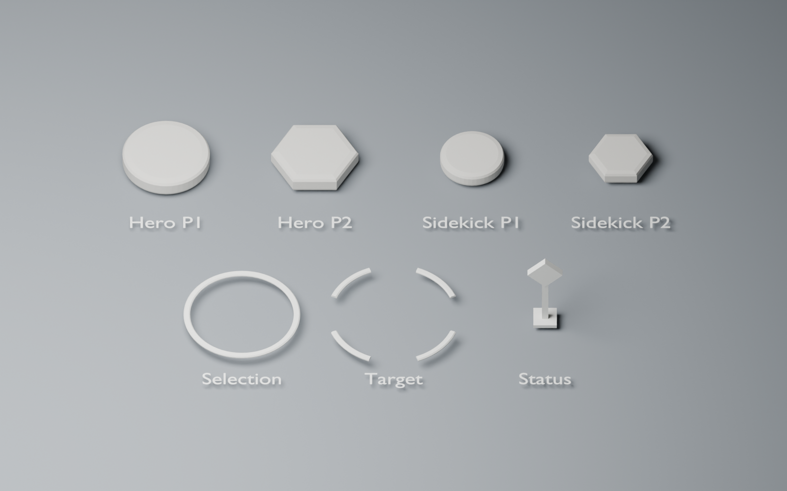
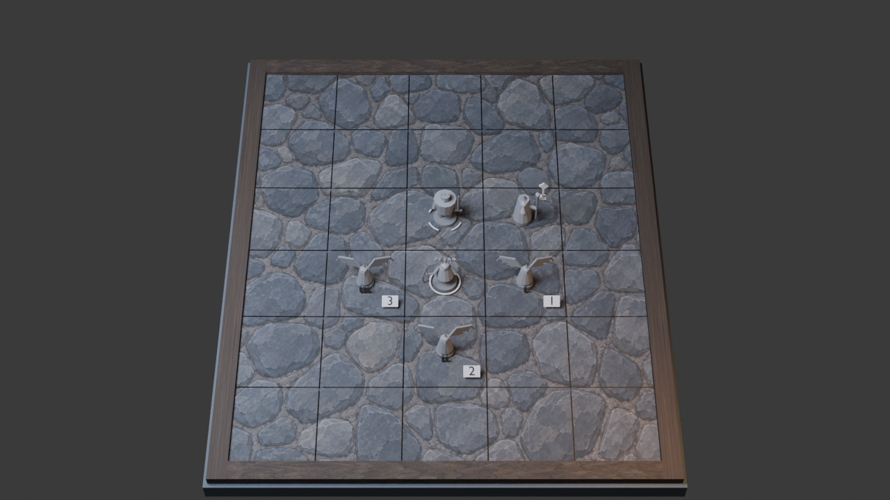

# ASSET-MARKERS-001 · нейтральный комплект маркеров, проба v1

**Статус: `in_progress`, геометрия и отдельные FBX проверены в Blender, импорт и коллизия прицела проверены в UE; техническая привязка прицела к живому бою принята, полная игровая приёмка открыта.** [Самоприёмка packaged K3](../../docs/game-design/evidence/ART-003/live-combat-target-acceptance-2026-09-28.md). Комплект следует выбранному направлению B · Painted Miniature как простой матовый игровой слой. Геометрия передаёт профиль команды и состояние выбора; цвет и пульсация должны задаваться параметрами материала/игрового слоя в UE. Нейтральные цвета на превью не утверждают палитру команд, зон или статусов.

| Меш | Кандидатный размер по [карточке §3.8](../../docs/game-design/04-blender-production.md#38-asset-markers-001--подставки-кольца-маркеры-состояния) | Форма | Треугольники |
|---|---|---|---:|
| `SM_Base_Hero_P1` / `P2` | Ø30 × 6 uu | круг / шестиугольник | 576 каждый |
| `SM_Base_Sidekick_P1` / `P2` | Ø22 × 5 uu | круг / шестиугольник | 576 каждый |
| `SM_Marker_SelectionRing` | Ø40 uu, Z 2,2–3,0 uu | сплошное кольцо | 768 |
| `SM_Marker_TargetRing` | Ø46 uu, Z 2,2–3,0 uu | четыре разомкнутые дуги | 800 |
| `SM_Marker_Status` | 12 × 30 uu | вертикальная ромбовидная стела без иконки | 36 |

У всех семи мешей pivot в центре клетки при Z=0, один слот нейтрального материала, UV0, нет текстур и отрицательного масштаба. У прицела **четыре отдельные выпуклые** `UCX_SM_Marker_TargetRing_00..03` по дугам; центр фигуры не закрыт сплошным hit proxy. Подставки и прочие маркеры не имеют собственной игровой коллизии в этой пробе.



[Проба K1 на Cobble City](preview/markers-on-board-k1-v1.png) ставит кольцо выбора под `f-0-hero`, четырёхчастный прицел под `f-1-hero` и стелу над `f-1-sk0`. Все позиции взяты из [текущей фикстуры 5×6](../../docs/game-design/evidence/S04/board-contract.json); стела временно поднята на 45 uu для просмотра над силуэтом Merlin. На фиксированном Blender K1 кольца различимы по форме. Стела видна, но без игровой иконки и HUD не является принятой обратной связью состояния. Цифры трёх Harpy пришли из отдельной [компоновочной пробы](../../docs/game-design/evidence/ART-003/marker-placement-acceptance-2026-09-27.md). Здесь нет игрового зонного слоя, выбора кликом или другой схемы света: blue/red зоны Cobble City — данные `boardState`, не текстура и не источники света. Для других карт нужны отдельные проверки их световых секций и зон.

Новые подставки в K1 не наложены на блок-ауты ART-003: у тех уже встроены временные базы. Дублирование исказило бы высоту фигурок; право владения базой будет решено отдельно до игрового импорта.



## Техническая проверка

- [Исходная сцена](markers.blend) и [отчёт сборки](build-report.json): Blender 5.2.2 LTS, 7 мешей, предлагаемые размеры. Все семь ниже предварительного максимума 2k tris на объект; 36 tris у стелы — экономная геометрия, а не ошибочный расход бюджета.
- [Семь отдельных FBX и манифест](export/export-manifest.json) сделаны пресетом `UM_FBX_v1`. Это выбранный для пробы вариант из [04](../../docs/game-design/04-blender-production.md) §3.8; в [06](../../docs/game-design/06-asset-manifest.csv) ранее стоял один `SM_Markers.fbx`. Формат окончательного handoff по AD-CNF-19 ещё не утверждён.
- [Повторный импорт FBX](export/roundtrip-report.json): семь файлов импортированы в чистый Blender; у всех совпали мировые габариты с исходником в пределах 0,002 м, pivot остался в (0,0,0), один материал, UV0, число треугольников, 0 non-manifold рёбер и положительный ориентированный объём. Четыре UCX-объекта присутствуют в FBX прицела, выпуклы в плане и не захватывают центр. Импортёр Blender ставит scale 0,01 и компенсирует его в мировых размерах; это не заменяет проверку масштабов в UE.
- [Импорт в UE 5.8.2](ue-import-report.json): семь StaticMesh сохранены в `/Game/ArtTests/ARTMarkers/Meshes` отдельным командлетом с `-nullrhi`. Размеры, включая pivot по Z, совпали с исходником в пределах 0,5 uu; каждый меш имеет 1 LOD0 section и 1 material slot. У `SM_Marker_TargetRing` Unreal распознал **4 convex collision hull**, у остальных простая коллизия отсутствует. Командлет завершился `ART_MARKERS_UE_IMPORT_PASS 7` без ошибок и предупреждений. Это проверка импорта, не клик по игровому актору и не проверка кадров.
- [Трассировка коллизии в UE](ue-hit-report.json): отдельный `StaticMeshActor` в `/Game/ArtTests/ARTMarkers/L_ARTMarkers_HitTest` сохранён и повторно загружен перед проверкой физической сцены. Простая коллизия блокирует вертикальный луч в середине каждой из четырёх дуг и пропускает его в четырёх разрывах и центре — **9/9** (`ART_MARKERS_UE_HIT_PASS 9`). Это редакторный тест одного меша на канале Visibility, не игровой клик по `fighterId` и не проверка всей сцены.
- [K1-проба](preview/markers-on-board-report.json) снята в Blender Cycles CPU 1280×720; это не UE K1, не QA-010 и не FPS-замер.
- [Совместный UE K1 с B-атласом и Medusa](../../docs/game-design/evidence/ART-005/combined-acceptance-2026-09-27.md) показал, что тёмный нейтральный материал колец исчезает на фактуре. Контрастные золото/коралл читаются как компоновочная проба; стела без иконки остаётся непонятной. Геометрия комплекта и FBX этим UE-вариантом не изменены.

После первого игрового подключения: привязка прицела к `fighterId` подтверждена в packaged K3, а реальный клик мышью ещё надо проверить. Нужно решить, принадлежат ли подставки отдельным мешам или фигурке ([AD-CNF-22/AD-OPEN-42](../../docs/game-design/17-art-production-spec.md)), согласовать Ø22 uu этого sidekick-кандидата с Ø24 uu в карточке Merlin (AD-CNF-18), довести параметры TeamColor/selection/target/status и показать 1080p K1–K3 с HUD и `boardState` в обычном, grayscale и deuteranopia видах. На минимальных настройках подсветки и игровая информация должны остаться. До этого `ASSET-MARKERS-001` и GD-058 не приняты.

Повторить из корня проекта:

```powershell
& 'C:/Program Files/Blender Foundation/Blender 5.2/blender.exe' --background --factory-startup --python blender/ASSET-MARKERS-001/build_markers.py
& 'C:/Program Files/Blender Foundation/Blender 5.2/blender.exe' --background --factory-startup --python blender/ASSET-MARKERS-001/export_markers.py
& 'C:/Program Files/Blender Foundation/Blender 5.2/blender.exe' --background --factory-startup --python blender/ASSET-MARKERS-001/verify_markers.py
& 'C:/Program Files/Blender Foundation/Blender 5.2/blender.exe' --background --factory-startup --python blender/ASSET-MARKERS-001/render_markers_on_board.py
$repo = 'C:/Users/ren/WebstormProjects/unmached/unmached'
& 'C:/Program Files/Epic Games/UE_5.8/Engine/Binaries/Win64/UnrealEditor-Cmd.exe' "$repo/unreal/Unmatched/Unmatched.uproject" -run=pythonscript "-script=$repo/tools/art/artmarkers_import_verify.py" -unattended -nosplash -nullrhi -DisablePlugins=Tripo3DUEBridge '-ini:Engine:[ConsoleVariables]:Interchange.FeatureFlags.Import.FBX=False'
& 'C:/Program Files/Epic Games/UE_5.8/Engine/Binaries/Win64/UnrealEditor-Cmd.exe' "$repo/unreal/Unmatched/Unmatched.uproject" -run=pythonscript "-script=$repo/tools/art/artmarkers_hit_verify.py" -unattended -nosplash -nullrhi -DisablePlugins=Tripo3DUEBridge '-ini:Engine:[ConsoleVariables]:Interchange.FeatureFlags.Import.FBX=False'
```

Абсолютные пути для следующего агента:

- `C:/Users/ren/WebstormProjects/unmached/unmached/blender/ASSET-MARKERS-001/markers.blend`
- `C:/Users/ren/WebstormProjects/unmached/unmached/blender/ASSET-MARKERS-001/export/export-manifest.json`
- `C:/Users/ren/WebstormProjects/unmached/unmached/blender/ASSET-MARKERS-001/ue-import-report.json`
- `C:/Users/ren/WebstormProjects/unmached/unmached/blender/ASSET-MARKERS-001/ue-hit-report.json`
- `C:/Users/ren/WebstormProjects/unmached/unmached/blender/ASSET-MARKERS-001/preview/markers-on-board-k1-v1.png`
- `C:/Users/ren/WebstormProjects/unmached/unmached/blender/ASSET-MARKERS-001/README.md`
