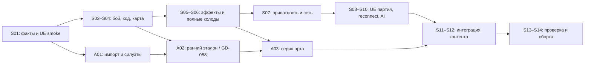

# 13. Спринт-план для одного разработчика с ИИ и отдельного арта

Дата: 2026-09-18. Состав команды подтверждён автором в этой задаче. Это план исполнения после [аудита](12-validation-report.md), а не отчёт о сделанной игре.

**Состояние на 2026-09-25:** S01–S04 реализованы и проверены; целевая ветка — `fix/admin-panel`.
Текущий спринт — **S05** (способности, Medusa, реестр карт и ранний визуальный эталон).
GD-014/015/016/018 закрыты в [протоколе S04](evidence/S04/README.md) после
[независимого адверсариального ревью исправлений](evidence/S04/correction-review-2026-09-25.md).
Полные ACC-017/ACC-008 остаются открыты до карточного покрытия и UE-интеграции;
неблокирующие замечания лобби/интерфейса распределены на GD-029/GD-035.

**Обновление после S02:** GD-006…009 проверены серверным harness; [протокол](evidence/S02/README.md). S03 остаётся 8 DEV дней: минимальные exhaustion/continuation исправления S02 не закрывают GD-011/018.

**Обновление после S01:** GD-001..005 имеют доказательства в [baseline](evidence/S01/README.md). S02 оставлен 7 DEV дней, S03 — 8; последовательность, контрактные риски и критерии выхода уточнены там по живым HTTP/WS ответам. Минимальный packaged UE и static mesh проверены, поэтому ART-001/002 могут продолжаться независимо от backend. Не считать это завершением всей ACC-022 или ART-001.

**Приоритет: сначала доказать корректную дуэль, затем перенести её в UE и довести до принятого визуала.** Художник параллельно готовит конвейер и ранний эталон. Два героя, одна доска, VS_AI и RU/EN остаются обязательными. Неподдержанные эффекты не заменяются ручной админкой в готовом MVP.

## Вместимость и оценки

- Спринт — две рабочие недели, один разработчик. Планируем **не более 8 человеко-дней** задач на 10 рабочих дней; остаток — ревью, интеграционные сюрпризы, исправления и показ результата.
- В CSV оценки включают реализацию и локальные проверки. Один день — рабочий день специалиста, не сутки работы агента. У ИИ нет отдельной гарантированной мощности: код всё равно проверяет и интегрирует разработчик.
- **58 задач DEV, 103 оценочных дня; 11 задач ART, 35 оценочных дней.** Всего 69 задач. ART не входит в лимит DEV. Время разработчика на приёмку/интеграцию арта учтено отдельными GD-задачами.
- **14 спринтов / 28 рабочих календарных недель** — исходная гипотеза при полной занятости разработчика и своевременной поставке арта, не обещанный срок. Даты не назначены. После S01 пересчитать ближайшие два спринта; после S06 — остаток по факту покрытия карт. Если capacity разработчика 4 дня на спринт, 103/4 даёт минимум 26 спринтов ещё до ожиданий.
- Не прибавлять автоматически второй «20% резерв» к уже заложенным 2 дням. Если растёт объём исправлений, переносить задачи явно. Ожидание автора, арта или доступа отражать отдельно от трудозатрат.
- Самые неопределённые оценки: GD-013 (двухстадийный манёвр), GD-017..023 (способности/эффекты), GD-027..028 (контракт и UE), художественные задачи. Перед стартом большой неизвестной — ограниченный спайк внутри её бюджета; при обнаружении новой подсистемы обновить оценку и разбить задачу.

DEV — один разработчик, совмещающий backend/UE/интеграцию/QA при помощи ИИ. ART — внешний художник/теххудожник; при отсутствии навыка audio/UI привлекается соответствующий исполнитель. Автор принимает продуктовые и визуальные варианты, подготовленные командой; его не назначаем исполнителем всех переводов и исследований.

## Результаты спринтов

Каждый спринт заканчивается запускаемым демо и протоколом. Пока UE не подключён, серверное демо проводится двумя участниками через API/test harness. Оно не называется готовой UE-игрой.

| Спринт | Цель и задачи | DEV дней | Демонстрация / условие выхода |
|---|---|---:|---|
| S01 | Установить факты: GD-001..005 | 7 | Два аккаунта, свежая схема и fixtures, состав колод/карта, пустая Windows-сборка UE. Доступ/версии не остаются скрытыми предположениями |
| S02 | Корректный бой: GD-006..009 | 7 | Бой 2 против 5; отмена; prevent; гибель героя с живым помощником. Результаты совпадают с oracle |
| S03 | Корректный ход и ресурсы: GD-010..013 | 8 | Манёвр без движения и с новой boost-картой; выбор сброса; истощение; два действия без лишнего добора |
| S04 | Карта и очередь выборов: GD-014..016, GD-018 | 8 | Общие зоны/смежность, собственные помощники, корректная расстановка; цепочка второго действия завершается до чужого хода |
| S05 | Способности и Medusa: GD-017, GD-019..020; ранний арт-gate GD-058 | 8 | Выбор взгляда, буст Arthur, сложные эффекты Medusa и возвращение гарпии; принят ранний эталон |
| S06 | Полные стартовые колоды: GD-021..024 | 8 | 27/27 записей карт имеют позитивные/граничные fixtures; две контрольные партии с перестановкой сторон без ручных эффектов |
| S07 | Честная сеть и автономный бой: GD-025..027 | 7 | Скрытых данных нет в API; без клиентов сервер завершает бой; snapshot/WS/recovery имеют доказанный контракт |
| S08 | Вход и серая сцена UE: GD-028..031 | 8 | Два packaged клиента входят в комнату и видят одну доску с шестью бойцами; HTTP/WS не дублируют state |
| S09 | Полная приватная UE-дуэль: GD-032..036 | 8 | Вход → расстановка → манёвр/бой/карты/выборы → победа → лобби. Это первый полный игровой vertical slice |
| S10 | Устойчивость и VS_AI: GD-037..041 | 7 | Потерянный ответ не повторяет действие; истечение JWT восстанавливается; бот проходит новые выборы; серый плейтест |
| S11 | Эталон в полной игре: GD-042..045 | 7 | Принятый ранее визуал работает вместе с HUD, сетью и CUE; бюджеты измерены в packaged, старый CUE не повторяется |
| S12 | Полный контент и два языка: GD-046..049 | 7 | Четыре типа моделей, шесть бойцов, финальная доска, 27 cardArt-привязок, 18 CUE, девять экранов, RU/EN |
| S13 | Понимание и производительность: GD-050..053 | 7 | Плейтест на финальном визуале, устранение стопперов, бюджет на целевом ПК, доступность и fallback |
| S14 | Воспроизводимый внутренний MVP: GD-054..057 | 6 | Все применимые QA и ACC пройдены на одной сборке; запуск по инструкции другим человеком; нет P0/P1 |

Заказ «сначала партия» не означает ждать S09 без доказательств: с S02 есть проверяемые боевые ситуации, с S06 — законченная серверная дуэль. Запуск двух UE-клиентов с одним манёвром в S08 — интеграционное демо, не завершённый игровой срез.

## Арт-поток и его реальные зависимости

| Пакет | Задачи / объём | Когда готовить | Что разрешает следующий шаг |
|---|---|---|---|
| A01 | ART-001..003, 6 дней | Старт после минимального UE; финальные габариты после GD-014 | Проверенный FBX, выбранное направление, читаемые силуэты/маркеры |
| A02 | ART-004..005, 8 дней | После A01; участок доски можно раньше, Medusa после GD-017 в S05 | GD-058: автор принимает три кадра, разработчик проверяет импорт и бюджет ранней сцены |
| A03 | ART-006..011, 21 день | Модели после GD-058 и rules-gate S06; UI/feedback после соответствующего серого HUD/боя S09 | Модели/доска к GD-046; UI к GD-047; CUE к GD-049 |

35 дней ART — суммарная работа, не обещание «всё параллельно». При одном художнике с 5 днями в неделю это минимум 7 рабочих недель чистой работы плюс ожидание входов и доработки. При 2 днях в неделю — 17.5 недель. Ранний GD-058 предотвращает тиражирование непринятого стиля; контроль S11 проверяет его в полной игре. Если A02 не успевает к S05, продолжать независимые GD-019..024 и сетевые задачи, а GD-058 и зависимые ART переносить явно. Примитивы UE допустимы до поставки моделей.

Итоговые ревизии масштабов после начала серии требуют оценки стоимости переделок. Сценический размер ~50 uu при клетке 100 uu уже согласован внутри документов; принятие этих чисел по изображению остаётся художественным gate.

## Gate и критический путь

Схема — уровень этапов; точный DAG и разные сроки поставки моделей/UI находятся в CSV.

1. **G0 / после S01:** версия среды, схема, фикстуры, источник правил, неизвестные эффекты названы. Неопределённость не превращается в `verified`.
2. **G1 / после S06:** правила, 27 записей карт и обе способности проверены. Если карта не работает, следующий спринт поглощает её исправление; нельзя молча заменить текст или объявить колоду урезанной.
3. **G2 / после S07:** API не раскрывает скрытое, сервер сам завершает бой, recovery воспроизводим. UE начинает опираться на устойчивый контракт.
4. **G3 / после S10:** полная PvP-дуэль и VS_AI из UE, восстановление в каждой фазе; плейтест серой версии.
5. **G4 / ранний GD-058 и подтверждение S11:** принятый вид + измеренная контрольная сцена. Серийные ассеты имеют этот вход.
6. **G5 / после S14:** функциональные, визуальные и эксплуатационные проверки одной release candidate; затем решение автора о внутреннем MVP.

P0/P1 блокируют соответствующий gate, не любую независимую работу. Регистрация в UE не блокирует существующие тестовые аккаунты. Референсы не блокируют backend. FBX не блокирует серую доску из примитивов. Недостаточный FPS не разрешает скрыть игровые подсветки.

## Как работать с карточками

Источник задач — [14-sprint-backlog.csv](14-sprint-backlog.csv), UTF-8 с BOM. `depends_on`, `source_ids`, `acceptance_ids` — списки через `;`. DEV — GD-001..058; ART — ART-001..011. Каждый исходный TASK из 09 связан хотя бы с одной новой задачей. Старые размеры S/M/L больше не используются для расчёта вместимости.

**Definition of Ready:** прочитаны source_ids и связанные AUD; зависимости завершены или предоставляют проверенный контракт/fixture; назначен исполнитель; известен наблюдаемый результат и oracle проверки. Для внешнего арта есть reference, размеры и импортный preset. Для нового DTO есть пример ответа обеим сторонам.

**Definition of Done задачи:** конкретный deliverable сохранён; acceptance воспроизведён; тест/лог/скриншот привязан к версии; нет новой ошибки приватности или повторной мутации; документация и карточная support-строка обновлены. «Сгенерирован класс» или «тест mock прошёл» без проверки соответствующего сценария не закрывают интеграционную задачу.

Разработчик берёт одну реализационную задачу за раз. ИИ помогает читать код, готовить варианты, fixtures и проверки; параллельная генерация не превращает человека в несколько интеграторов. Новые work items добавляются после оценки, с заменой равного объёма в спринте. Художественную задачу на 4–5 дней можно разделить на mesh/material и rig/clips, сохранив общий приёмочный gate.

Статусы в CSV связаны с `evidence/Sxx/tasks.json` соответствующего спринта и
конкретными проверками. Завершение отдельной задачи не означает прохождения
всех связанных ACC целиком. Этот документ не является разрешением на создание
внешних тикетов, публикацию или изменение принятых правил.

## Плейтест как задача геймдизайна

В S06 проверяется корректность и тактическая асимметрия на фиксированных ситуациях: дальняя угроза Medusa, жизнь трёх гарпий, расход руки Arthur на усиление и роль Merlin. Обе стороны меняются героями и первым ходом. Сначала ищем нарушение текста, а не меняем баланс.

В S10 и S13 наблюдаем минимум три человека вне разработки, суммарно шесть сессий в каждом раунде с перестановкой сторон. Это минимальная диагностическая выборка, не исследование win rate. Предварительные UX-цели: 3/3 находят активного игрока и допустимое действие без подсказки; не менее 5/6 сессий дают первый осмысленный ход за 3 минуты после входа в матч; нет неверно подтверждённых действий из-за неразличимых гарпий или скрытой панели выбора. При провале записать причину и повторить сценарий после правки.

15–40 минут на матч — гипотеза v0.1. Фиксировать фактическую длительность, количество ходов, причины ожиданий, время решения в бою и непонятые эффекты. Маленькая выборка не подтверждает баланс, а долгий матч не разрешает добавлять неутверждённое правило ускорения.

## Что сокращать при ограниченном времени

Сначала сокращаются декор, вариации VFX/звука и глубина визуальной полировки сверх принятого эталона. Не сокращаются завершимость правил, скрытые данные, восстановление, обязательные выборы и исправление неверного урона. Отказ от VS_AI, RU, героя, карт или полного визуального набора — изменение D-03/D-08/D-12 и отдельное решение автора; план его не предполагает.

## Первая выдача разработчику

Начать с GD-001..005. Сохранить: `docs/game-design/evidence/S01/README.md`, обезличенные fixtures, schema snapshot, версии инструментов и лог минимальной packaged-сборки. Пути будущих артефактов здесь — задания, сейчас этих доказательств нет. ART-001 получает UE smoke, ART-002 — исходный D-02. После отчёта S01 пересчитать следующие два спринта; не начинать массовое моделирование или перенос всей старой FSM до проверки контрактов.
