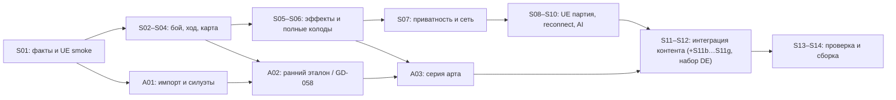

# 13. Спринт-план для одного разработчика с ИИ и отдельного арта

Дата: 2026-09-18. Состав команды подтверждён автором в этой задаче. Это план исполнения после [аудита](12-validation-report.md), а не отчёт о сделанной игре.

**Состояние на 2026-09-27 (ветка `fix/admin-panel`):** основные DEV-задачи
S01–S07 закрыты, кроме вынесенного из S05 визуального gate GD-058;
UE-клиент и полный PvP-срез S08–S09 интегрированы. Проверенные части S08/S09
отмечены `done`, но сами спринты ещё имеют открытые критерии: у GD-030 не
закрыта вся приёмка читаемости/контрольных точек, у GD-035 нет живого
производителя `CHOOSE_ONE`, а GD-036 ждёт прохода двумя людьми через обычный
ввод. [Доказательства S08](evidence/S08/README.md) и
[S09](evidence/S09/README.md) не подменяют эти проверки. Текущий этап — S10:
GD-037 имеет тесты и [пакетные прогоны с потерянными ответами](evidence/S10/packaged-fault-runs-2026-09-27.md),
GD-038 — тесты восстановления авторизации, GD-039
имеет [проверенный серверный VS_AI](evidence/S10/README.md), но полная приёмка
этих задач и клиентский VS_AI ещё открыты; GD-040/041 не приняты.

**Счёт на 2026-10-04 (пересчитан DE-008):** в [backlog](14-sprint-backlog.csv) 34 `done`, 6 `in_progress` и 18
`planned` задач DEV. **Остаются 24 DEV-задачи:** один хвост S08, два S09, все пять S10 и 16 задач S11–S14.
Визуальный gate GD-058 из S05 принят по делегированию 2026-10-03. Художественный поток A01–A03: 3 `done`,
13 `in_progress` и 2 `planned` задачи ART (с ART-012…018, добавленными 2026-09-30). Итого до приёмки остаются
39 задач из 14, из них 19 уже в работе. Отдельно идёт [набор DE](#набор-de-вставные-спринты-окна-s11-2026-10-04):
38 задач в [07-sprint-backlog.csv](de-footage/task/07-sprint-backlog.csv), из них 8 `done` (DE-001…DE-008 —
документы прогона A) и 30 `planned`. Это счёт задач, а не прогноз длительности: исходные оценки в CSV включают и
уже сделанную часть `in_progress`.
Нормальный packaged-клиент сохраняет default 60 FPS; для двухклиентского
offscreen-демо действует отдельный лимит 30 FPS на процесс. Эффективный FPS,
GPU frame time и нагрузка двух процессов вместе ещё не измерены; замер на
целевом GTX 1060/1660 или RX 580 остаётся открытым.

Ближайший порядок: закрыть конкретные хвосты GD-030/035/036 и доказать
оставшиеся режимы восстановления GD-037/038; затем завершить клиентский
VS_AI GD-039, различение FINISHED/ABORTED и повторную комнату GD-040, после
чего провести внешний плейтест GD-041. ART-001..005 могут идти параллельно
клиентской работе; серийные ART-006..011 и визуальная интеграция S11–S12
зависят от принятого GD-058 и поставки соответствующих ассетов. S13–S14
проверяют уже собранную версию, а не заменяют незакрытые gates S08–S12.

**Историческая запись на 2026-09-25:** серверные задачи S01–S06 реализованы и проверены;
GD-021..024 из S06 прошли [независимое адверсариальное ревью](evidence/S06/README.md)
и повторные проверки исправлений. Целевая ветка — `fix/admin-panel`. Текущий
серверный спринт — **S07** (приватность, таймаут боя и recovery-контракт).
Визуальный gate GD-058 из S05 остаётся открытым: технический packaged-эталон
создан, но нужны читаемые кадры, проверка на целевом ПК и решение автора.
GD-014/015/016/018 закрыты в [протоколе S04](evidence/S04/README.md) после
[независимого адверсариального ревью исправлений](evidence/S04/correction-review-2026-09-25.md).
Полные ACC-017/ACC-008 остаются открыты до UE-интеграции;
неблокирующие замечания лобби/интерфейса распределены на GD-029/GD-035.

**Исторический пересчёт после S06:** исполнимый реестр покрывает 27 уникальных записей / 60
копий; карточный ремонт не перенесён в S07. По исходным оценкам backlog осталось
58 DEV-дней (57 в S07–S14 и 1 на открытый GD-058). Это остаток оценок, а не
измеренный труд или обещание календарной даты. Визуальные замечания к эталону
и доступ к целевому ПК могут сдвинуть арт-гейт; серийные модели A03 не начинать
до принятия GD-058. Полная партия production VS_AI остаётся GD-039.

**Обновление после S02:** GD-006…009 проверены серверным harness; [протокол](evidence/S02/README.md). S03 остаётся 8 DEV дней: минимальные exhaustion/continuation исправления S02 не закрывают GD-011/018.

**Обновление после S01:** GD-001..005 имеют доказательства в [baseline](evidence/S01/README.md). S02 оставлен 7 DEV дней, S03 — 8; последовательность, контрактные риски и критерии выхода уточнены там по живым HTTP/WS ответам. Минимальный packaged UE и static mesh проверены, поэтому ART-001/002 могут продолжаться независимо от backend. Не считать это завершением всей ACC-022 или ART-001.

**Обновление ART-001, 2026-09-27:** полный набор Blender 5.2.2 LTS → UE 5.8.2 прошёл; Q-311 закрыт, [evidence](evidence/ART-001/README.md). Следующая работа A01 — ART-002, затем ART-003. Это не закрывает ACC-022 или GD-058.

**Обновление ART-002, 2026-09-27:** пользователь делегировал выбор направления; принят B · Painted Miniature из [сравнения A/B/C](evidence/ART-002/README.md). ART-002 закрыт как задача выбора; следующая работа — ревью ART-003 и доводка ART-004/005 для GD-058. Камера, точная палитра, HUD, бюджет и визуальная приёмка остаются открытыми.

**Приёмка GD-058, 2026-09-27:** [самостоятельный акт проверки](evidence/GD-058/acceptance-review-2026-09-27.md) — **не принято**. K1–K3 и импорт S05/ART-001 подтверждают технические пробы, но нет эталонной Medusa и финального покрытия Cobble City в выбранном B, общей QA-010-сцены и packaged-замера на D-07. GD-058 остаётся `planned/open` до повторной проверки; ART-006..011 не разблокированы.

**Повторная самоприёмка 2026-09-28:** [текущий акт GD-058](evidence/GD-058/acceptance-review-2026-09-28.md) учитывает импортированную Medusa, улучшенный Cobble, живой packaged K1 с HUD/выбором и [сравнение игрового K2](evidence/ART-004/live-k2-zoom-comparison-2026-09-28.md) при 1,6×/5×. Первое приближение слишком мало для лица; второе полезно, но остаётся пробным и раскрывает нерешённые требования к модели/UI. Полного K1–K3, QA-009/010 и packaged D-07 всё ещё нет. GD-058 не принят, зависимые ART-006..011 не разблокированы. Работа над анимациями остаётся на паузе по решению пользователя.

**Дополнение K3, 2026-09-28:** [живой двухклиентский combat-проход](evidence/ART-003/live-combat-target-acceptance-2026-09-28.md) подтвердил привязку четырёхчастного прицела к цели и снятие его после результата. Это частичная техническая приёмка маркера, а не закрытие K3/GD-058: пиктограмма, сигнал урона на фигурке, компоновка подписей и инспектор ещё открыты.

**Следующая частичная самоприёмка K3, 2026-09-28:** [пробная пиктограмма и числовой сигнал урона](evidence/ART-003/live-combat-icon-damage-acceptance-2026-09-28.md) прошли live packaged-проверку двух клиентов. Полный K3/GD-058 по-прежнему открыт: источник значка ещё не принят в 24 px, плотные подписи, инспектор, другие световые секции и QA-010 не проверены; анимация остаётся на паузе.

**Сверка плана с фактом, 2026-09-30:** Arthur, Merlin и Harpy начаты до GD-058 — серией v1 2026-09-28 (Tripo H3.1, 610 кредитов, по разрешению пользователя «можно на полную использовать лимиты для триппо и синтакс»; заменена проходом H2) и затем H2/H3 по делегированию 2026-09-29 («делай все без меня»): ART-006…009 переведены в `in_progress`, художественной приёмки нет. Medusa перешла с доводки v3.1 на проход качества H2 (Tripo «по частям» по новым концептам → H2LD на мастере M_UM_Figure_v2.1); v3.1 в UE не импортировалась. Анимация снята с паузы: 16 клипов rig v2 (H2Anim) технически импортированы, в игре их ещё нет. Командный цвет — по решению пользователя «акценты + кольцо». Добавлены ART-012…018: герои v2 в игре за флагом S08, проигрывание клипов, свет доски для фигур, остатки W5b-R, маска акцента Arthur и насыщенность, слои реестра, длинный packaged K2 с пересъёмкой трёх досок. GD-058, K1–K3 и QA-009/010 по-прежнему открыты до волны приёмки. Полная таблица задач с доказательствами — [PLAN-STATUS.md](../art-pipeline/PLAN-STATUS.md).

**Приоритет: сначала доказать корректную дуэль, затем перенести её в UE и довести до принятого визуала.** Художник параллельно готовит конвейер и ранний эталон. Два героя, одна доска, VS_AI и RU/EN остаются обязательными. Неподдержанные эффекты не заменяются ручной админкой в готовом MVP.

## Вместимость и оценки

- Спринт — две рабочие недели, один разработчик. Планируем **не более 8 человеко-дней** задач на 10 рабочих дней; остаток — ревью, интеграционные сюрпризы, исправления и показ результата.
- В CSV оценки включают реализацию и локальные проверки. Один день — рабочий день специалиста, не сутки работы агента. У ИИ нет отдельной гарантированной мощности: код всё равно проверяет и интегрирует разработчик.
- **58 задач DEV, 102 оценочных дня; 18 задач ART, 46.5 оценочного дня.** Всего 76 задач (ART-012…018 на 11.5 дня добавлены 2026-09-30; GD-044 уменьшена с 1,5 до 0,5 дня 2026-10-04 — бой и урон забирает набор DE, см. ниже). ART не входит в лимит DEV. Время разработчика на приёмку/интеграцию арта учтено отдельными GD-задачами.
- **14 спринтов / 28 рабочих календарных недель** — исходная гипотеза при полной занятости разработчика и своевременной поставке арта, не обещанный срок. Даты не назначены. После S01 пересчитать ближайшие два спринта; после S06 — остаток по факту покрытия карт. Если capacity разработчика 4 дня на спринт, 103/4 даёт минимум 26 спринтов ещё до ожиданий.
- **Набор DE (2026-10-04):** 34 задачи DEV на 33,5 дня (28,0 в S10…S13 и 5,5 post-MVP) и 4 задачи ART на 4,5 дня
  (пакет A04) — в [07-sprint-backlog.csv](de-footage/task/07-sprint-backlog.csv). К ним сопряжённые задачи подбора хода
  из [move-selection/05](move-selection/05-implementation-plan.md): 10,0 дня с DE и 9,0 дня размещённого остатка.
  **Гипотеза с набором DE — 20 спринтов / около 40 недель** (+5 вставных спринтов S11b…S11f и шестой слот S11g,
  +12 недель). Это та же гипотеза при полной занятости, а не обещанный срок.
- Не прибавлять автоматически второй «20% резерв» к уже заложенным 2 дням. Если растёт объём исправлений, переносить задачи явно. Ожидание автора, арта или доступа отражать отдельно от трудозатрат.
- Самые неопределённые оценки: GD-013 (двухстадийный манёвр), GD-017..023 (способности/эффекты), GD-027..028 (контракт и UE), художественные задачи. Перед стартом большой неизвестной — ограниченный спайк внутри её бюджета; при обнаружении новой подсистемы обновить оценку и разбить задачу.

DEV — один разработчик, совмещающий backend/UE/интеграцию/QA при помощи ИИ. ART — внешний художник/теххудожник; при отсутствии навыка audio/UI привлекается соответствующий исполнитель. Автор принимает продуктовые и визуальные варианты, подготовленные командой; его не назначаем исполнителем всех переводов и исследований.

## Результаты спринтов

Каждый спринт заканчивается запускаемым демо и протоколом. Для S01–S07 серверное демо проводилось через API/test harness; с S08 проверяется и packaged UE-клиент. Серверное демо не называется готовой UE-игрой.

| Спринт | Цель и задачи                                                     | DEV дней | Демонстрация / условие выхода                                                                                                           |
| ------ | ----------------------------------------------------------------- | -------: | --------------------------------------------------------------------------------------------------------------------------------------- |
| S01    | Установить факты: GD-001..005                                     |        7 | Два аккаунта, свежая схема и fixtures, состав колод/карта, пустая Windows-сборка UE. Доступ/версии не остаются скрытыми предположениями |
| S02    | Корректный бой: GD-006..009                                       |        7 | Бой 2 против 5; отмена; prevent; гибель героя с живым помощником. Результаты совпадают с oracle                                         |
| S03    | Корректный ход и ресурсы: GD-010..013                             |        8 | Манёвр без движения и с новой boost-картой; выбор сброса; истощение; два действия без лишнего добора                                    |
| S04    | Карта и очередь выборов: GD-014..016, GD-018                      |        8 | Общие зоны/смежность, собственные помощники, корректная расстановка; цепочка второго действия завершается до чужого хода                |
| S05    | Способности и Medusa: GD-017, GD-019..020; ранний арт-gate GD-058 |        8 | Выбор взгляда, буст Arthur, сложные эффекты Medusa и возвращение гарпии; принят ранний эталон                                           |
| S06    | Полные стартовые колоды: GD-021..024                              |        8 | 27/27 записей карт имеют позитивные/граничные fixtures; две контрольные партии с перестановкой сторон без ручных эффектов               |
| S07    | Честная сеть и автономный бой: GD-025..027                        |        7 | Скрытых данных нет в API; без клиентов сервер завершает бой; snapshot/WS/recovery имеют доказанный контракт                             |
| S08    | Вход и серая сцена UE: GD-028..031                                |        8 | Два packaged клиента входят в комнату и видят одну доску с шестью бойцами; HTTP/WS не дублируют state                                   |
| S09    | Полная приватная UE-дуэль: GD-032..036                            |        8 | Вход → расстановка → манёвр/бой/карты/выборы → победа → лобби. Это первый полный игровой vertical slice                                 |
| S10    | Устойчивость и VS_AI: GD-037..041; прогон A набора DE (DE-002…008) | 7 + 1,0 DE = 8 | Потерянный ответ не повторяет действие; истечение JWT восстанавливается; бот проходит новые выборы; серый плейтест. Нормативные документы синхронизированы с живыми данными DE (G-CUE, G-HUD) |
| S11    | Эталон в полной игре: GD-042..045 (GD-044 — 0,5); MS-T-11         | 6 + 1,5 MS = 7,5 | Принятый ранее визуал работает вместе с HUD, сетью и CUE; бюджеты измерены в packaged, старый CUE не повторяется                        |
| S11b   | Ввод и кандидаты: DE-014…017; MS-T-08                             | 3,5 + 4,5 MS = 8 | Ни одно нажатие не теряется (0 потерь при n ≥ 20 на элемент); «Пас» убран; кольца-кандидаты на Marmoreal и Sarpedon original |
| S11c   | Бой и смерть: DE-018…020; MS-T-12, MS-T-13                        | 7 + 1,0 MS = 8 | Бой без эффектов ≈ 3,9 с ±10 %; смерть по этапам F-09; повтор seq не даёт второй урон; живой бой двух клиентов на Marmoreal original |
| S11d   | Движение и соперник: DE-021, 022; MS-T-16, MS-T-17                | 3 + 5,0 MS = 8 | Шаг 280 мс на ребро без подскока; взгляд соперника; тест «код = cue-table» зелёный |
| S11e   | HUD хода, рука и карты: DE-023…028; MS-T-26                       | 6,75 + 0,5 MS = 7,25 | Кольцо хода и трекер; лимит руки без блокировки; лист A/B отправлен автору |
| S11f   | Экраны, колода, живая приёмка: DE-029…031; резерв MS-T-09/10      | 5 + 3,0 MS = 8 | Экран результата и панель колоды; весь набор DE принят живьём на двух реальных картах (DE-031) |
| S11g   | Приёмка и RU/EN подбора хода: MS-T-27, MS-T-28                    | 3 MS + хвосты | Приёмка MS на Marmoreal и Sarpedon original; остаток слота — хвосты S11b…S11f, нового объёма нет |
| S12    | Полный контент и два языка: GD-046..049; DE-032, MS-T-18          | 7 + 0,5 DE + 0,5 MS = 8 | Четыре типа моделей, шесть бойцов, финальная доска, 27 cardArt-привязок, 18 CUE, девять экранов, RU/EN; звук по точкам синхронизации DE |
| S13    | Понимание и производительность: GD-050..053; DE-033               | 7 + 0,5 DE = 7,5 | Плейтест на финальном визуале, устранение стопперов, бюджет на целевом ПК, доступность и fallback; темп боя и ручные клики наблюдаются |
| S14    | Воспроизводимый внутренний MVP: GD-054..057                       |        6 | Все применимые QA и ACC пройдены на одной сборке; запуск по инструкции другим человеком; нет P0/P1                                      |
| post-MVP | P3 разбора DE (W-20): DE-034…038                                | 5,5 (вне MVP) | Только после приёмки MVP GD-057; DE-038 — только по слову автора |

Заказ «сначала партия» не означает ждать S09 без доказательств: с S02 есть проверяемые боевые ситуации, с S06 — законченная серверная дуэль. Запуск двух UE-клиентов с одним манёвром в S08 — интеграционное демо, не завершённый игровой срез.

## Набор DE: вставные спринты окна S11 (2026-10-04)

Источник — живое исследование Unmatched: Digital Edition ([разбор](de-footage/README.md),
[пакет задач](de-footage/task/00-TASK.md)). План, ёмкость и резолюция ревью Fable High —
[07-sprint-plan.md](de-footage/task/07-sprint-plan.md) (§1, §3, §6). Перенос в 13/14 — задача DE-008.

- **Где задачи.** 38 задач DE-001…DE-038 лежат в [07-sprint-backlog.csv](de-footage/task/07-sprint-backlog.csv): те же
  колонки, что у 14, тот же парсер (`_validation/validate_package.py` читает оба файла). В 14 строки DE не копируются:
  статусы набора ведут прогоны в 07, а у 14 фиксированный набор GD/ART и спринты S01–S14. Связь с GD записана в самих
  строках GD-044, GD-047, GD-049 и GD-050.
- **Почему окно S11, а не после S14.** Цель S11 — «принятый визуал работает вместе с HUD, сетью и CUE», а подача DE —
  это ровно CUE и HUD: темп боя, выпад, смерть, кольцо хода, трекер. S12 (GD-047, GD-049) строится поверх уже
  изменённых HUD и CUE, а плейтест GD-050 и приёмка GD-055 должны видеть итоговый темп.
- **Вставные спринты** S11b…S11f и шестой слот S11g — в таблице выше. Они идут после S11 и до S12. Технический старт
  UE-задач определяют `depends_on` и go-ahead автора на Unreal (дан 2026-10-04).
- **Связь с GD:**

  | GD | Что меняет набор DE |
  | --- | --- |
  | GD-044 | Оценка 1,5 → 0,5 дня: бой и урон закрывают DE-018/DE-019, движение — MS-T-15/MS-T-16. Остаются очередь после reconnect и подключение остальных CUE. Освободившийся день S11 берёт MS-T-11 |
  | GD-047 | 9 экранов и 11 блоков HUD доделываются на HUD, уже изменённом DE-023…DE-030 |
  | GD-049 | Звук по точкам синхронизации — DE-032 (в счёт GD-049) и MS-T-18; ассеты — DE-013 и ART-010 |
  | GD-050 | Наблюдение темпа боя и 50 ручных кликов — DE-033 (в счёт GD-050) |
  | GD-040 | DE-029 (экран результата) ждёт FINISHED/ABORTED; без GD-040 делается часть FINISHED |

- **Поток подбора хода (MS-T).** Задачи MS-T ведёт [move-selection/05](move-selection/05-implementation-plan.md); в 14 и
  в 07 они не дублируются. Сопряжённые с DE: MS-T-08 (S11b), MS-T-12 (S11c), MS-T-16 и MS-T-17 (S11d) — 10,0 дня.
  Остаток размещён по 07 §3: MS-T-11 → S11, MS-T-13 → S11c, MS-T-26 → S11e, MS-T-09/10 → резерв S11f,
  MS-T-18 → S12, MS-T-27/28 → S11g — 9,0 дня.
- **Гейты.** G3 (после S10) из набора DE блокирует только DE-029 (GD-040) и DE-033 (GD-050). Слоты S11b…S11g идут после
  S10, так что G3 закрывается раньше них.
- **Арт** — пакет A04 в таблице арт-потока ниже; ART не входит в лимит DEV.
- **P3 разбора (W-20)** — post-MVP, после GD-057: DE-034…DE-037 (статусы входа, лобби, контекстные подсказки,
  «История») и DE-038 (3D-фигура победителя, только по слову автора). 5,5 дня вне гипотезы 20 спринтов.
- **Что сокращать.** Первыми — W-17…W-19 (DE-029, DE-026, DE-030) по правилу «сначала полировка» ниже.

## Арт-поток и его реальные зависимости

| Пакет | Задачи / объём        | Когда готовить                                                                              | Что разрешает следующий шаг                                                           |
| ----- | --------------------- | ------------------------------------------------------------------------------------------- | ------------------------------------------------------------------------------------- |
| A01   | ART-001..003, 6 дней  | Старт после минимального UE; финальные габариты после GD-014                                | Проверенный FBX, выбранное направление, читаемые силуэты/маркеры                      |
| A02   | ART-004..005, 8 дней; ART-012..018, 11.5 дня (2026-09-30) | После A01; участок доски можно раньше, Medusa после GD-017 в S05                            | GD-058: автор принимает три кадра, разработчик проверяет импорт и бюджет ранней сцены |
| A03   | ART-006..011, 21 день | Модели после GD-058 и rules-gate S06; UI/feedback после соответствующего серого HUD/боя S09 | Модели/доска к GD-046; UI к GD-047; CUE к GD-049                                      |
| A04   | DE-010…013, 4,5 дня (2026-10-04) | Параллельно S11b…S11e; арт-приёмка глифов DE-012 и листа A/B DE-028 — у автора | Notify контакта → DE-018 (фолбэк — константа кадра), растворение → DE-019 (фолбэк — простой fade), записи движения глифов → DE-023, звуки → DE-032 |

35 дней ART — суммарная работа, не обещание «всё параллельно». При одном художнике с 5 днями в неделю это минимум 7 рабочих недель чистой работы плюс ожидание входов и доработки. При 2 днях в неделю — 17.5 недель. Ранний GD-058 предотвращает тиражирование непринятого стиля; контроль S11 проверяет его в полной игре. Если A02 не успевает к S05, продолжать независимые GD-019..024 и сетевые задачи, а GD-058 и зависимые ART переносить явно. Примитивы UE допустимы до поставки моделей.

Итоговые ревизии масштабов после начала серии требуют оценки стоимости переделок. Сценический размер ~50 uu при клетке 100 uu уже согласован внутри документов; принятие этих чисел по изображению остаётся художественным gate.

## Gate и критический путь

Схема — уровень этапов; точный DAG и разные сроки поставки моделей/UI находятся в CSV.

1. **G0 / после S01:** версия среды, схема, фикстуры, источник правил, неизвестные эффекты названы. Неопределённость не превращается в `verified`.
2. **G1 / после S06:** правила, 27 записей карт и обе способности проверены. Если карта не работает, следующий спринт поглощает её исправление; нельзя молча заменить текст или объявить колоду урезанной.
3. **G2 / после S07:** API не раскрывает скрытое, сервер сам завершает бой, recovery воспроизводим. UE начинает опираться на устойчивый контракт.
4. **G3 / после S10:** полная PvP-дуэль и VS_AI из UE, восстановление в каждой фазе; плейтест серой версии.
5. **G4 / ранний GD-058 и подтверждение S11:** принятый вид + измеренная контрольная сцена. Серийные ассеты имеют этот вход.
6. **G5 / после S14:** функциональные, визуальные и эксплуатационные проверки одной release candidate; затем решение автора о внутреннем MVP.

P0/P1 блокируют соответствующий gate, не любую независимую работу. Регистрация в UE не блокирует существующие тестовые аккаунты. Референсы не блокируют backend. FBX не блокирует серую доску из примитивов. Недостаточный FPS не разрешает скрыть игровые подсветки.

## Как работать с карточками

Источник задач — [14-sprint-backlog.csv](14-sprint-backlog.csv), UTF-8 с BOM. `depends_on`, `source_ids`, `acceptance_ids` — списки через `;`. DEV — GD-001..058; ART — ART-001..018. Задачи набора DE (DE-001…038) — в [07-sprint-backlog.csv](de-footage/task/07-sprint-backlog.csv) с теми же колонками; их статусы ведутся там. Каждый исходный TASK из 09 связан хотя бы с одной новой задачей. Старые размеры S/M/L больше не используются для расчёта вместимости.

**Definition of Ready:** прочитаны source_ids и связанные AUD; зависимости завершены или предоставляют проверенный контракт/fixture; назначен исполнитель; известен наблюдаемый результат и oracle проверки. Для внешнего арта есть reference, размеры и импортный preset. Для нового DTO есть пример ответа обеим сторонам.

**Definition of Done задачи:** конкретный deliverable сохранён; acceptance воспроизведён; тест/лог/скриншот привязан к версии; нет новой ошибки приватности или повторной мутации; документация и карточная support-строка обновлены. «Сгенерирован класс» или «тест mock прошёл» без проверки соответствующего сценария не закрывают интеграционную задачу.

Разработчик берёт одну реализационную задачу за раз. ИИ помогает читать код, готовить варианты, fixtures и проверки; параллельная генерация не превращает человека в несколько интеграторов. Новые work items добавляются после оценки, с заменой равного объёма в спринте. Художественную задачу на 4–5 дней можно разделить на mesh/material и rig/clips, сохранив общий приёмочный gate.

Статусы в CSV сверяются с доказательствами `evidence/Sxx/README.md` и
конкретными проверками; `tasks.json` подключается там, где он уже создан.
Завершение отдельной задачи не означает прохождения
всех связанных ACC целиком. Этот документ не является разрешением на создание
внешних тикетов, публикацию или изменение принятых правил.

Текущий учёт: `done` — критерий задачи подтверждён; `in_progress` — код или
часть проверок готовы, но хотя бы один критерий приёмки открыт; `planned` —
задача не принята и ещё не имеет достаточного проверенного результата.
Для S08–S10 состояние зафиксировано выше по evidence, даже если отдельный
спринтовый `tasks.json` ещё отсутствует. Не переводить `in_progress` в `done`
только по зелёной автоматизации: требуемый живой, визуальный или человеческий
проход должен быть записан отдельно.

## Плейтест как задача геймдизайна

В S06 проверяется корректность и тактическая асимметрия на фиксированных ситуациях: дальняя угроза Medusa, жизнь трёх гарпий, расход руки Arthur на усиление и роль Merlin. Обе стороны меняются героями и первым ходом. Сначала ищем нарушение текста, а не меняем баланс.

В S10 и S13 наблюдаем минимум три человека вне разработки, суммарно шесть сессий в каждом раунде с перестановкой сторон. Это минимальная диагностическая выборка, не исследование win rate. Предварительные UX-цели: 3/3 находят активного игрока и допустимое действие без подсказки; не менее 5/6 сессий дают первый осмысленный ход за 3 минуты после входа в матч; нет неверно подтверждённых действий из-за неразличимых гарпий или скрытой панели выбора. При провале записать причину и повторить сценарий после правки.

15–40 минут на матч — гипотеза v0.1. Фиксировать фактическую длительность, количество ходов, причины ожиданий, время решения в бою и непонятые эффекты. Маленькая выборка не подтверждает баланс, а долгий матч не разрешает добавлять неутверждённое правило ускорения.

## Что сокращать при ограниченном времени

Сначала сокращаются декор, вариации VFX/звука и глубина визуальной полировки сверх принятого эталона. Не сокращаются завершимость правил, скрытые данные, восстановление, обязательные выборы и исправление неверного урона. Отказ от VS_AI, RU, героя, карт или полного визуального набора — изменение D-03/D-08/D-12 и отдельное решение автора; план его не предполагает.

## Первая выдача разработчику

Первую DEV-выдачу GD-001..005 хранить в `docs/game-design/evidence/S01/README.md`. ART-001 теперь имеет отдельное доказательство в `docs/game-design/evidence/ART-001/README.md`; следующий вход художнику — ART-002 на основе D-02. Массовое моделирование A03 не начинать до ART-003 и GD-058.
