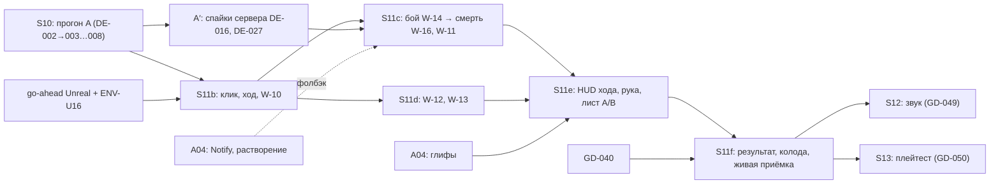

# 07 — Спринт-план: выводы DE → задачи реализации

Дата: 2026-10-04. Статус: после живого исследования (серии s01–s05) и ревью Fable High (DE-002 сделано; резолюции — §6
и [runs/REVIEW-2026-10-04-fable.md](runs/REVIEW-2026-10-04-fable.md)).
Задачи — [07-sprint-backlog.csv](07-sprint-backlog.csv): 38 задач `DE-001…DE-038`. Колонки те же, что у
[14-sprint-backlog.csv](../../14-sprint-backlog.csv). Рабочие пункты W-xx — [03-work-items.md](03-work-items.md),
прогоны workflow — [05-workflow-plan.md](05-workflow-plan.md).

Основания:
- решения — [01-decisions.md](01-decisions.md), раздел «Окончательные решения Claude после живого исследования» (F-01…F-12);
- дельты — [02-spec-deltas.md](02-spec-deltas.md) (SD-01…SD-55);
- перенос на наш срез — [live-2026-10-04/APPROXIMATION.md](../live-2026-10-04/APPROXIMATION.md);
- протокол и тайминги — [live-2026-10-04/README.md](../live-2026-10-04/README.md),
  [timings-live.csv](../live-2026-10-04/timings-live.csv).

Если числа расходятся, действует 01, а не APPROXIMATION. Пример: 600 мс на строку эффекта в 01 против 800 в APPROXIMATION
§2 (подробнее — §6 п. 6).

## 0. Как читать

- **Единица оценки** — рабочий день специалиста, как в 14. Размеры из плана MS переведены так: S = 0,5, M = 1,5,
  L = 3,5; у MS-T-08 L + 1 = 4,5.
- **Лимит спринта** — по [13](../../13-sprint-plan.md): спринт длится 2 недели, задач DEV не больше чем на 8 дней. Остаток
  идёт на ревью и интеграцию. Задачи ART в лимит DEV не входят.
- **Задачи MS-T** ([move-selection/05](../../move-selection/05-implementation-plan.md)) в CSV не дублируются. Если W-xx
  расширяет базовую задачу MS-T, та стоит в `depends_on`. Её объём учтён в ёмкости спринта как «сопряжённая нагрузка».
- **`acceptance_ids`** содержат ACC-xxx и MS-AT-xx из нормативных документов, а также гейты G-xxx из §8 (они
  повторяют [00-TASK.md §5](00-TASK.md#5-гейты)).
- **Статусы:**
  - `done` — критерий подтверждён;
  - `planned` — не начато.

  Пока прогон A не запущен, `in_progress` нет ни у одной задачи.

## 1. Решение: окно S11 расширяется вставными спринтами S11b…S11f

**Что сделано.** Документы (прогон A) встроены в текущий S10. Реализация в UE встроена в окно S11 пятью вставными
спринтами S11b…S11f, они идут до S12. Звук встроен в GD-049 (S12), наблюдение в плейтесте — в GD-050 (S13). Арт
собран в новый пакет A04. P3 (W-20) отложен в post-MVP.

**Почему не после S14:**
1. **Цель S11 совпадает с задачами DE.** Цель S11 по 13: «принятый визуал работает вместе с HUD, сетью и CUE». Подача DE —
   это ровно CUE и HUD: темп боя, выпад, смерть, кольцо хода, трекер. GD-044 «очередь обратной связи CUE» — естественный
   носитель W-14 и W-16.
2. **S12 строится поверх результата DE.** GD-047 (9 экранов, 11 блоков HUD, настройки) и GD-049 (18 CUE, звук)
   доделываются на HUD и CUE, уже изменённых по DE. В обратном порядке HUD и CUE переделывались бы дважды.
3. **Проверки должны видеть итоговый темп.** Плейтест на финальном визуале (GD-050, S13) и приёмка release candidate
   (GD-055, S14) проверяют уже итоговый темп. Если делать DE после S14, приёмку пришлось бы повторять.
4. **Документы почти ничего не стоят.** Прогон A — около 1 дня, лёгкий режим, без UE. Он укладывается в S10.

**Почему не внутрь самого S11.** S11 уже загружен на 7 дней (GD-042…045). Объём DE — 28 дней DEV плюс 10 дней сопряжённых
MS-T. Это 5 дополнительных двухнедельных спринтов. 13 требует переносить такой объём явно, а не прятать.

**Что меняется в 13.** Гипотеза «14 спринтов» становится «19 спринтов», это примерно +10 недель; с шестым слотом
S11g по резолюции ревью (§6 п. 4) — 20 спринтов, около +12 недель. **Записано DE-008 (прогон A, 2026-10-04):**
- в 13 — счётчики, ёмкость, строки S10…S13 с долей DE, вставные S11b…S11g, post-MVP, раздел «Набор DE», пакет A04;
- в 14 — GD-044 1,5 → 0,5 и ссылки на DE в строках GD-044, GD-047, GD-049, GD-050. Строки DE остаются здесь,
  в [07-sprint-backlog.csv](07-sprint-backlog.csv): `_validation/validate_package.py` читает его тем же парсером.

**Порядок и старт.** S11b…S11f — плановые слоты окна S11. Технический старт задачи определяют три условия:
- `depends_on` задачи;
- go-ahead пользователя на Unreal (2026-10-04 он остановил все Unreal-работы);
- ENV-U16 — по AGENTS.md это следующая Unreal-задача.

Гейт G3 (после S10) блокирует только задачи, у которых в `depends_on` есть GD-040 или GD-050. Это DE-029 и DE-033.

GD-044 — не блокер. DE-018 строит бой на уже существующем выпуске CUE (трассы `CUE move`, `CUE damage` в
`S08FlowGameMode.cpp:937-940`) и закрывает боевую часть GD-044.

Без go-ahead на Unreal можно делать:
- прогон A;
- оба серверных спайка: DE-016 «нет целей» и DE-027 Q-203.

## 2. Ограничения проекта (обязательны для всех прогонов)

- **Сцена — AGENTS.md, «Board scenes and heroes»:**
  - доска — нарисованное поле Marmoreal original (по умолчанию) или Sarpedon original;
  - задник у Marmoreal нарисованный, у Sarpedon — lit3d «путь 1»;
  - все 6 фигур — v2 (`SK_<Hero>_H2LD`, `SK_Harpy_H3LD`) с клипами Idle, Lunge, Hit, Death;
  - DE меняет только HUD, тайминги CUE, позу и материал фигур. Камеру, задник и состав сцены не трогаем;
  - камера неподвижна (D-10): наезд, отъезд и перекадровка DE не переносятся (APPROXIMATION §0.2).
- **Известный разрыв ENV-U16.** Пока он не закрыт, кадры Marmoreal снимаются с `-ConceptPaste` или помечаются.
  Синтетические доски (Cobble, ART FIXTURE, 20×20) в зачёт не идут.
- **Принятый арт включён по умолчанию.** Новые глифы, растворение при смерти и вариант трекера DE — кандидаты. Они
  видны только в галерее или на листе A/B, пока пользователь их не принял. После приёмки — по умолчанию, флаг только
  для отката.
- **Iteration speed:**
  - прогон A и чисто параметрические правки — лёгкий режим: не больше 3 итераций, live tune, без отдельного ревью и
    без бенча;
  - новый код, новые кнопки, правила сервера и FX — полный режим: ревью, все гейты, `render_bench.py` при новых FX;
  - одна упаковка на изменение; после `safe-integrate.sh --apply` — `sync-staged-build.ps1`, без повторной упаковки.
- **Интеграция:**
  - каждый прогон работает в своём worktree и своей ветке;
  - коммиты — `git commit --no-verify`;
  - перед интеграцией в ветку вливается свежий `fix/admin-panel`, затем пересборка и тесты;
  - интеграция — `tools/git/safe-integrate.sh <ветка>`: сначала dry run, потом `--apply`;
  - если менялся `unreal/`, после интеграции пересобрать UnmatchedEditor в основном checkout.
- **EULA.** Ассеты, тексты карт, строки интерфейса и звуки DE не копируются. Файлы и память игры не трогаются.
- **Нормативные документы** вне `de-footage/` меняет только прогон A. Его запускает пользователь отдельной командой.

## 3. Сводка по спринтам

| Спринт | Окно 13 | Цель | Задачи DE | DE, дн. | Сопряжённые MS-T, дн. | Итого DEV | Прогон |
|---|---|---|---|---:|---:|---:|---|
| S10 | текущий | Документы по живым данным | DE-001…009 (DE-001 сделан) | 1,0 (+0,75 в резерве) | — | 7 (GD) + 1,0 = 8,0 | A |
| A04 | арт | Notify контакта, растворение, глифы, звуки | DE-010…013 | ART 4,5 | — | вне лимита DEV | A04 |
| S11b | S11 | Ввод и кандидаты | DE-014…017 | 3,5 | MS-T-08 4,5 | 8,0 | B |
| S11c | S11 | Бой и смерть | DE-018…020 | 7,0 | MS-T-12 0,5 | 7,5 | C |
| S11d | S11 | Движение и соперник | DE-021, 022 | 3,0 | MS-T-16 3,5; MS-T-17 1,5 | 8,0 | D |
| S11e | S11 | HUD хода, рука и карты, лист A/B | DE-023…028 | 6,75 | — | 6,75 | E |
| S11f | S11 | Экраны, колода, живая приёмка | DE-029…031 | 5,0 | резерв MS 3,0 | 8,0 | F |
| S12 | S12 | Звук по точкам синхронизации | DE-032 (в счёт GD-049) | 0,5 | — | 7 (GD) + 0,5 = 7,5 | G |
| S13 | S13 | Темп и клики в плейтесте | DE-033 (в счёт GD-050) | 0,5 | — | 7 (GD) + 0,5 = 7,5 | — (плейтест) |
| post-MVP | после S14 | P3 разбора (W-20) | DE-034…038 | 5,5 | — | — | — |

Итоги:
- **По задачам:** S10 — 9, A04 — 4, S11b — 4, S11c — 3, S11d — 2, S11e — 6, S11f — 3, S12 — 1, S13 — 1, post-MVP — 5.
  Всего 38.
- **По дням:**
  - DEV в S10…S13 — 28,0 дня. В S10 из 1,75 дня в лимит идёт 1,0; DE-002 (0,25) и необязательная DE-009 (0,5)
    оплачиваются из резерва ревью;
  - ART — 4,5;
  - post-MVP — 5,5;
  - сопряжённые MS-T — 10,0.

**Вне ёмкости этого плана — остаток потока MS:** MS-T-09, 10, 11, 13, 18, 26, 27, 28, всего ≈ 9,5 дня. В 13 поток MS
не учтён вообще. Для MS-T-09 и MS-T-10 в S11f оставлен резерв 3 дня. MS-T-28 (RU/EN) по смыслу ложится в GD-048
(S12), но это решает план MS (§6 п. 4).

**Размещение остатка MS (резолюция ревью, §6 п. 4; записывает DE-008):**

| MS-T | Дн. | Куда | Итого спринта |
|---|---:|---|---:|
| MS-T-09, MS-T-10 | 3,0 | S11f, резерв | 8,0 |
| MS-T-11 (плашка, кнопки ▲▼) | 1,5 | S11, за счёт GD-044 −1,0 (§6 п. 2) | 7,5 |
| MS-T-13 (стиль, light) | 0,5 | S11c | 8,0 |
| MS-T-26 (документы) | 0,5 | S11e | 7,25 |
| MS-T-18 (звук шага) | 0,5 | S12, вместе с DE-032 | 8,0 |
| MS-T-27 (приёмка MS), MS-T-28 (RU/EN) | 3,0 | **S11g** — шестой вставной слот перед S12; остаток слота (5 дн.) — хвосты S11b…S11f, нового объёма туда не класть | 3,0 + хвосты |

Гипотеза 13 с учётом S11g: 20 спринтов (+12 недель к исходным 14).

## 4. Спринты

### S10 — документы по живым данным (прогон A)

- **Цель.** Перенести решения F-01…F-12 и дельты SD-01…SD-55 в нормативные документы. Перенести набор задач в 13/14.
- **Задачи:**
  - DE-001 — сделано;
  - DE-002 — сделано 2026-10-04: ревью Fable High, резолюция спорных пунктов (§6, 01 и 02 «Резолюция», журнал в
    `runs/`);
  - DE-003…DE-007 — W-01…W-05;
  - DE-008 — W-30, перенос в 13/14 вместе с W-20;
  - DE-009 — W-31, живые остатки, по желанию пользователя.
- **Зависимости.** DE-002 идёт до DE-003…008. Редакторы DE-003…008 работают параллельно: у них разные файлы.
- **Критерии выхода:**
  - G-CUE и G-HUD зелёные;
  - журнал `task/runs/A-<дата>.md` с колонками applied / stale / waiting / rejected;
  - каждая правка ссылается на `timings-live.csv` или таймкод;
  - в 05 подбора хода MS-T-13 и MS-T-27 ссылаются только на реальные доски;
  - 13 и 14 пересчитаны.
- **Риски:** параллельная сессия меняет те же файлы (`git log --since=2026-10-04` перед стартом); числа APPROXIMATION
  не совпадают с 01.
- **Нужно от пользователя:** команда запуска прогона A. DE-009 — только если пользователь запустит игру.
- **Оценка:** 1,0 дня DEV в лимите плюс 0,75 в резерве. По опыту 05 — ~7 агентов, 30–45 мин, без сборок UE.

### A04 — арт подачи DE (параллельно S11b…S11e)

- **Цель.** Подготовить ассеты, без которых код DE работает только на фолбэке.
- **Задачи:**
  - DE-010 — W-26: AnimNotify `Contact` и параметр заливки удара;
  - DE-011 — W-27: растворение при смерти;
  - DE-012 — W-15, арт: глифы кольца, сердца, креста и трекера;
  - DE-013 — W-25, арт: звуки под точки синхронизации.
- **Зависимости:**
  - DE-010 нужен до DE-018 (фолбэк — константа кадра контакта из профиля);
  - DE-011 нужен до DE-019 (фолбэк — простой fade);
  - DE-012 нужен до DE-023 (до приёмки — только галерея);
  - DE-013 нужен до DE-032.
- **Критерии выхода:**
  - у DE-010 длины клипов не изменились, кадр K1 при параметре 0 совпадает с прежним;
  - у DE-011 `render_bench.py` в бюджете;
  - у DE-012 генератор и золотые позы зелёные;
  - у DE-013 у каждого звука есть лицензия и источник.
- **Риски:**
  - правка мастер-материала `M_UM_Figure_v2.1` может сдвинуть принятый вид. Защита — значение 0 по умолчанию и
    метрика K1;
  - новые ассеты требуют перезапуска клиента и упаковки (AGENTS.md, «Packaging trap»).
- **Нужно от пользователя:**
  - арт-приёмка глифов (DE-012) поштучно на 1024 px и на 16/24/32 px;
  - покупка звуков Fab — только им и по желанию;
  - вид растворения — на листе A/B (DE-028).
- **Оценка:** 4,5 дня ART.

### S11b — ввод и кандидаты (прогон B)

- **Цель.** Ни одно нажатие не теряется. Ход начинается и заканчивается понятно. Кандидаты на ход видны сразу.
- **Задачи:**
  - DE-014 — W-21, надёжность клика, гейт HUD (P1; было P0 — снято ревью, §6 п. 7);
  - DE-015 — W-22, начало и конец хода, «Пас» убрать;
  - DE-016 — спайк сервера «нет целей»;
  - DE-017 — W-10 вместе с MS-T-08.
- **Зависимости.** DE-014 — гейт для всех следующих задач HUD. DE-017 ждёт MS-T-08 (L + 1).
- **Критерии выхода:**
  - автотест синтетических кликов: 0 потерь при n ≥ 20 на каждый элемент;
  - трасса первого клика своего хода в кадре снапшота;
  - «Пас» отсутствует;
  - кадры колец-кандидатов на Marmoreal и Sarpedon original;
  - G-UE и G-BE зелёные.
- **Риски:**
  - MS-T-08 больше оценки (новые материалы, парсер профилей вместе с ENV-MAPS — 05 MS §4);
  - причина потери кликов в DE (P0-3) не установлена. Наш критерий от неё не зависит.
- **Нужно от пользователя:** go-ahead на Unreal.
- **Оценка:** 3,5 дня DE + 4,5 дня MS-T-08 = 8,0.

### S11c — бой и смерть (прогон C)

- **Цель.** Бой по шкале F-01 (≈ 3,9 с без эффектов) с выпадом в резолве и контактом по кадру. Смерть по этапам F-09
  (удар → экран ≈ 3,1 с). Отложенные выборы без «зависания».
- **Задачи:**
  - DE-018 — W-14;
  - DE-019 — W-16;
  - DE-020 — W-11, клиент, вместе с MS-T-12.
- **Зависимости:**
  - DE-018 → DE-019: этапы смерти отсчитываются от кадра контакта;
  - DE-010 и DE-011 из A04 — мягкие, есть фолбэки;
  - DE-020 ждёт DE-016 и MS-T-12.
- **Критерии выхода:**
  - трасса боя проходит `check-trace`;
  - бой без эффектов ≈ 3,9 с ±10 %;
  - исчезновение фигуры: герой ≈ 2125 мс, помощник ≈ 1725 мс;
  - экран результата через 1000 мс после исчезновения героя;
  - повтор seq не даёт второй урон;
  - живой бой двух клиентов на Marmoreal original.
- **Риски:**
  - DE-018 — самая крупная задача (L);
  - карты боя у краёв поля (SD-48 п. 4) — принято ревью (02 «Резолюция»): слой HUD у краёв поля, применяется в DE-018;
    DE-010 и DE-011 в `depends_on` не стоят — у DE-018/DE-019 есть фолбэки (константа контакта, простой fade);
  - выпад сейчас стоит на входе в `COMBAT_RESOLVE` (`S08FlowGameMode.cpp:560-567`), а HitReact приходит следующим
    снапшотом через ~5 с. Перенос затрагивает порядок применения снапшотов.
- **Нужно от пользователя:** ничего сверх go-ahead.
- **Оценка:** 7,0 + 0,5 (MS-T-12) = 7,5.

### S11d — движение и соперник (прогон D)

- **Цель.** Шаг 280 мс на ребро без подскока, с наклоном 10°. Взгляд соперника и строка «что делать».
- **Задачи:**
  - DE-021 — W-12 вместе с MS-T-16;
  - DE-022 — W-13 вместе с MS-T-17.
- **Зависимости.** MS-T-16 (L) зависит от MS-T-15 (сделано). MS-T-17 зависит от MS-T-08 (S11b).
- **Критерии выхода:**
  - тест «код = cue-table» зелёный;
  - MS-AT-24, 26, 30, 33 зелёные;
  - A/B-кадры: подскок 0 против 0,08, наклон 0 против 10°;
  - кадры клиента-соперника.
- **Риски:**
  - ориентация после хода пересекается с ART-012. Поворот к сопернику решает пользователь; здесь только доворот по
    пути и возврат к правилу половины поля;
  - ease на первом и последнем шаге — спорно (02 «Спорно» п. 1), по умолчанию выкл.
- **Нужно от пользователя:** ничего; A/B уходят в общий лист DE-028.
- **Оценка:** 3,0 + 5,0 (MS-T-16, MS-T-17) = 8,0.

### S11e — HUD хода, рука и карты (прогон E)

- **Цель:**
  - кольцо хода и трекер по F-07 и F-12;
  - лимит руки без блокировки;
  - множитель скорости по SD-49;
  - рука и карты по F-10 и SD-54;
  - один лист A/B для пользователя.
- **Задачи:**
  - DE-023 — W-15, HUD;
  - DE-024 — W-23;
  - DE-025 — W-24;
  - DE-026 — W-18;
  - DE-027 — спайк Q-203;
  - DE-028 — W-28, лист A/B.
- **Зависимости:**
  - DE-023 ждёт записи DE-012 (только записи движения, приёмка не нужна);
  - DE-025 ждёт MS-T-16 и DE-018;
  - DE-026 ждёт DE-022;
  - DE-028 собирает кадры DE-021, DE-019, DE-023, DE-011, DE-012.
- **Критерии выхода:**
  - G-ICON зелёный: эталон Python и UE |Δ| ≤ 0,45 и 0,81;
  - тост лимита руки однократный и не блокирует;
  - карта схемы соперника 1500 мс до эффекта, пропуск запускает эффект сразу;
  - лист A/B отправлен пользователю, кадры просмотрены до отправки.
- **Риски:**
  - постоянный UMG-виджет кольца стоит дороже пересоздаваемого Slate — замер в DE-031;
  - пользователь может ответить на лист A/B не сразу. До ответа действуют умолчания F-02/F-07/F-09/F-12, работа не
    останавливается.
- **Нужно от пользователя:** ответ по листу A/B (DE-028) и арт-приёмка глифов (DE-012).
- **Оценка:** 6,75.

### S11f — экраны, колода, живая приёмка (прогон F)

- **Цель.** Экран результата по F-06 и SD-45. Панель колоды по F-05 и SD-41. Приёмка всего набора на двух реальных
  картах.
- **Задачи:**
  - DE-029 — W-17;
  - DE-030 — W-19;
  - DE-031 — W-29, живая приёмка.
- **Зависимости:**
  - DE-029 ждёт GD-040 (S10) и DE-027;
  - DE-030 ждёт GD-025 (сделано), нужен тест проекции;
  - DE-031 идёт последней, после ENV-U16 или с `-ConceptPaste`.
- **Критерии выхода (DE-031):**
  - одна упаковка;
  - два клиента на Marmoreal и Sarpedon original;
  - все трассы проходят `check-trace`;
  - кадры просмотрены;
  - темп по трассе совпадает с 01;
  - `render_bench.py` в бюджете;
  - 60 FPS (ACC-022) не ухудшены;
  - свидетельства в `docs/game-design/evidence/DE-FOOTAGE/<дата>/`.
- **Риски:**
  - GD-040 может не закрыться к этому слоту. Тогда DE-029 переносится, DE-031 принимает набор без нового экрана
    результата (с пометкой);
  - экрана победы DE нет в данных (P1-4).
- **Нужно от пользователя:** ничего; приёмка — по трассам и кадрам.
- **Оценка:** 5,0 + резерв MS 3,0.

### S12 и S13 — звук и плейтест (в счёт GD-049 и GD-050)

- **DE-032** — W-25. Звук по точкам синхронизации:
  - ui — в кадре отклика;
  - удар — в кадре контакта;
  - шаг — один звук на ребро, вместе с MS-T-18;
  - перезвон — только на свой ход;
  - стинг результата — вместе с экраном.

  Зависит от GD-049 (аудиогруппы) и DE-013. В UE пока нет аудиокода: подсистема — GD-044/GD-049, не DE.
- **DE-033** — наблюдение в плейтесте GD-050: темп боя и 50 ручных кликов. Порог «≥ 2 из 6 сессий» выбран, а не
  измерен (§6 п. 11).

### post-MVP — P3 разбора (W-20)

DE-034…DE-037 — статусы входа, лобби, контекстные подсказки, «История». Для «Истории» сначала нужно подключить
`updateStatsAfterGame`: сейчас он не вызывается.

DE-038 — 3D-фигура победителя на экране результата. Только по слову пользователя.

## 5. Прогоны workflow → спринты

| Прогон | Спринт | Пункты W (задачи DE) | Режим | Агенты | Ветка/worktree |
|---|---|---|---|---|---|
| A | S10 | DE-002 (ревью) → W-01…W-05, W-30 (DE-003…008) | лёгкий | 6 редакторов параллельно + 1 ревьюер | `de/spec-sync` |
| A′ (не UE) | S11b / S11e | спайки сервера W-11 (DE-016), W-17 (DE-027) | полный (правила сервера) | 2 исполнителя + 1 ревьюер | `de/server-spikes` |
| A04 | A04 | W-26, W-27, W-15 арт, W-25 арт (DE-010…013) | W-26 лёгкий + G-UE; W-27 и W-15 полный (FX, генератор) | последовательно, 1 ревьюер | `de/art-a04` |
| B | S11b | W-21 → W-22 → W-10 (DE-014, 015, 017) + MS-T-08 | полный | последовательно | `de/input` |
| C | S11c | W-14 → W-16 → W-11 клиент (DE-018…020) + MS-T-12 | полный | последовательно | `de/combat` |
| D | S11d | W-12, W-13 (DE-021, 022) + MS-T-16, MS-T-17 | полный | последовательно | `de/move-opponent` |
| E | S11e | W-15 HUD, W-23, W-24, W-18, W-28 (DE-023…026, 028) | полный | последовательно | `de/hud` |
| F | S11f | W-17, W-19, W-29 (DE-029…031) | полный | последовательно | `de/screens` |
| G | S12 | W-25 (DE-032) в составе GD-049 | полный | вместе с GD-049 | ветка GD-049 |

**Было → стало (прогоны из 05):**
- A → A, плюс DE-002 до него и W-30;
- B (W-10…13) → B (W-10), C (W-11), D (W-12, W-13);
- C (W-15 → W-16 → W-14) → C (**W-14 → W-16**), E (W-15 HUD), A04 (W-15 арт). Порядок изменён: смерть по F-09
  отсчитывается от кадра контакта, который вводит W-14. Крест на сердце (W-15) в W-16 необязателен: до приёмки глифа
  сердце просто чернеет;
- D (W-17…19) → E (W-18), F (W-17, W-19).

Один прогон — один спринт, одна ветка, одна упаковка в конце. Сборки UE идут последовательно. Перед каждым прогоном
проверить статус базовой MS-T в move-selection/05 (сделано / в работе / не начато) и `git log` по файлам пункта.

## 6. Спорно — для ревью Fable High (DE-002)

1. **+5 вставных спринтов.** Это ~10 недель к гипотезе 13. Альтернатива — отложить P2 (W-17, W-18, W-19; 5,5 дня) за
   S14 и сэкономить один спринт. Рекомендация — оставить их в окне: экран результата и колоду видят игроки
   плейтеста GD-050. Это первый кандидат на сокращение по правилу 13 «сначала полировка».
2. **Пересечение с GD-044.** DE-018 и DE-019 закрывают боевую часть GD-044, но оценку GD-044 (1,5) здесь не уменьшаем.
   Сколько вычесть, решает DE-008 при переносе в 13.
3. **G3 не блокирует DE**, кроме задач, зависящих от GD-040 и GD-050. Это отступление от строгой последовательности
   этапов 13, но так уже работает поток MS (M1 закрыт при открытом S10).
4. **Поток MS вне 13.** Осталось ≈ 19 дней, из них 10 учтены здесь как сопряжённые. Остаток (≈ 9,5 дня) ложится на
   план MS. MS-T-28 по смыслу совпадает с GD-048.
5. **ENV-U16 раньше DE.** По AGENTS.md ENV-U16 — следующая Unreal-задача. План ставит S11b после неё. Если пользователь
   поменяет порядок, кадры Marmoreal снимаются с `-ConceptPaste` или с пометкой.
6. **Числа APPROXIMATION против 01.** CSV взят по 01, ревью сводит расхождения в DE-002:
   - 600 против 800 мс на строку;
   - помощник 1725 против 1450 мс;
   - метка исхода ~1500 против 1200 мс;
   - «−N» 900 против 1000 мс.
7. **Приоритет P0 у DE-014.** В 14 P0 — корректность правил. Здесь P0 — гейт потери ввода (APPROXIMATION §6:
   «гейт P0 для MS-M2»).
8. **Крест на сердце** в DE-019 зависит от арт-приёмки DE-012. До неё фолбэк — почерневшее сердце.
9. **Растворение до приёмки.** По умолчанию простой fade, FX — кандидат на листе A/B. Решение F-09 о таймингах от
   этого не зависит.
10. **Карты боя у краёв поля** (SD-48 п. 4) в DE-018 применяются только после резолюции DE-002.
11. **Порог DE-033 «≥ 2 из 6»** придуман, данных нет. Это заглушка до протокола GD-050.
12. **Громкости «Общая» и «Окружение»** (APPROXIMATION §15 п. 14) в DE-025 только сохраняются в настройках, применяются
    в DE-032. Если ревью их отклонит — убрать из DE-025.

### Резолюция ревью Fable High (DE-002, 2026-10-04)

Журнал — [runs/REVIEW-2026-10-04-fable.md](runs/REVIEW-2026-10-04-fable.md). По пунктам выше:

1. **Пять вставных спринтов — оставить в окне S11.** P2 (W-17…19) видят игроки плейтеста GD-050; откладывать за S14 —
   значит повторять приёмку. W-17…19 остаются первым кандидатом на сокращение по правилу 13 «сначала полировка».
2. **GD-044 уменьшить на 1,0 (1,5 → 0,5).** DE-018/DE-019 закрывают урон и бой, MS-T-15/16 — движение; у GD-044
   остаётся очередь после reconnect и подключение остальных CUE. Освободившийся день S11 берёт MS-T-11. Записывает
   DE-008.
3. **G3 не блокирует DE — принято.** Слоты S11b…S11f хронологически после S10, так что G3 закрывается раньше них сам;
   явная блокировка нужна только DE-029 (GD-040) и DE-033 (GD-050). Так уже работает поток MS.
4. **Остаток MS — размещён** (таблица в §3): шестой слот S11g для MS-T-27/28, остальное — в существующие спринты в
   пределах лимита 8. Гипотеза 13 — 20 спринтов. Записывает DE-008.
5. **ENV-U16 раньше DE — принято.** До него кадры Marmoreal — с `-ConceptPaste` или с пометкой; старт в UE — только
   по go-ahead пользователя.
6. **Числа — по 01.** 600 мс на строку; помощник 1725; метка исхода ~1500 (до конца CUE-011); «−N» 900. Основания — 01
   «Резолюция ревью». APPROXIMATION §0.4 помечен как снятый в этих местах. CSV без изменений в числах.
7. **DE-014 — P1,** название и приёмка «гейт HUD» сохранены. P0 в 14 означает корректность правил; смысл не размывать.
8. **Крест на сердце — принято:** до арт-приёмки DE-012 сердце чернеет (+133 мс, как у DE), крест +1100 после приёмки.
9. **Растворение — принято:** по умолчанию простой fade через параметр `Fade`, FX «пепел» — кандидат на листе A/B.
   Тайминги F-09 от вида не зависят.
10. **Карты боя у краёв поля — принято** (02 «Резолюция» п. 2). В DE-018 применяется без условия.
11. **Порог DE-033** переписан: любое замечание о темпе или непонятной смерти записывается с таймкодом; параметры
    удержаний правятся live tune, если замечание повторяется минимум у двух разных игроков протокола GD-050. Число
    сессий задаёт GD-050, не этот план.
12. **Громкости «Общая» и «Окружение» — оставить в DE-025** (только хранение). Основание: SD-55 делегирована; задники
    по AGENTS.md анимированы (вода, огонь, водопад), им нужен отдельный регулятор. Применение — DE-032.

Дополнительно ревью внесло: определение «бой ≈ 3,9 с» (карта с текстом, 0 сработавших строк; без текста ≈ 2,9 с) — в
DE-018/DE-031; LungeAttack — вступление CUE-011, `duration_ms` 900 от контакта (01 «Резолюция» п. 4); SD-56 (своя атака
без подтверждения) — в DE-005/DE-020; DE-009 дополнен P0-4, P1-9, P1-10; DE-002 — `done`.

## 7. Что нужно от пользователя (сводно)

Только блокеры и арт-приёмка (постоянное делегирование «делай все без меня»):
- **Команды запуска.** Прогон A — отдельной командой. Каждый следующий прогон — по [00-TASK.md §0](00-TASK.md#0-полномочия).
- **Go-ahead на Unreal** — для прогонов A04, B…G. Прогон A и спайки A′ его не требуют.
- **Арт-приёмка:** глифы DE-012; лист A/B DE-028 — подскок, наклон, растворение, кольцо, трекер v3 или DE.
- **По желанию:**
  - покупка звуков Fab (DE-013);
  - живые остатки исследования DE (DE-009);
  - 3D-фигура победителя (DE-038).
- **Остаётся за пользователем, как раньше:** поворот фигуры к сопернику (ART-012), HUD-таблички над фигурами.

## 8. Гейты

| ID | Что | Команда / проверка |
|---|---|---|
| G-DOC | Документы, лёгкий режим | Основание у каждой правки, журнал `task/runs/A-<дата>.md`, ревьюер сверяет `git diff --stat` со списком файлов |
| G-CUE | `07` + `cue-table.json`, трассы | `python tools/s08/cue_contract/cue_contract.py validate-table`, `python -m pytest tools/s08/cue_contract/test_cue_contract.py`, `cue_contract.py check-trace`; при правке CUE-007 — UE `Unmatched.S08` |
| G-HUD | `hud-style-tokens.json`, `why-reasons.json` | `python tools/s08/hud_contract/hud_contract.py validate` и `test_hud_contract.py` |
| G-ICON | `icon-motion.json` | Только генератор `motion_contract.py`; золотые позы `icon_motion.py`; копия `Config/S08IconMotion.json`; UE `Unmatched.S08.IconMotion.*` |
| G-UE | C++ | Сборка UnmatchedEditor и игровой цели (код выхода 0 при ошибке компиляции не доказывает успех — читать лог); `node tools/s08/run-ue-tests.cjs "<префикс>" <лог>` |
| G-BE | backend | jest `game-engine`, `games`; typecheck |
| G-LIVE | Живая подача | `tools/s08/run-phase2-demo.ps1`: Marmoreal original (`-ArtPreviewBoardId c121b47f8d6eb28daccb76d05`), Sarpedon original (`c7fa64a26c29a0835f2383e63`); трассы `CUE …` / `MS-CUE …` через `check-trace`; кадры до/после **просмотрены до отчёта**: реальная карта, верный задник, 6 фигур v2, строка `ARTLOOK` |
| G-COST | Новые FX, материалы, свет | `tools/art/render/render_bench.py` (packaged `-Bench`) |
| G-ART-TECH | Правка ассета | `validate_registry.py`; кадры K1 до/после совпадают при значениях по умолчанию |
| G-ART | Арт-приёмка | Пользователь: поштучно (значки — 1024 и 16/24/32 px) или по листу A/B |

## 9. Ключевые зависимости

**Критический путь** (расчёт по `depends_on` в CSV, MS-T — по размерам 05):
MS-T-08 (4,5) → MS-T-17 (1,5) → DE-022 (2) → DE-026 (2) → DE-031 (1,5) = **11,5 дня DEV**. Ещё +0,5 дня, если
считать до DE-033. К этому добавляется ожидание go-ahead на Unreal, ENV-U16 и GD-040 (для DE-029).

Ветка боя короче: DE-002 → DE-005 → DE-014 → DE-018 → DE-025 → DE-031 ≈ 7,7 дня; через смерть и экран результата —
DE-003 → DE-014 → DE-018 → DE-019 → DE-029 → DE-031 ≈ 10,7 дня (плюс ожидание GD-040). Ответ пользователя по листу A/B
(DE-028) работу не блокирует. Арт A04 на критический путь DEV не входит: у DE-018/DE-019 фолбэки, DE-023 ждёт только
записи движения DE-012.
