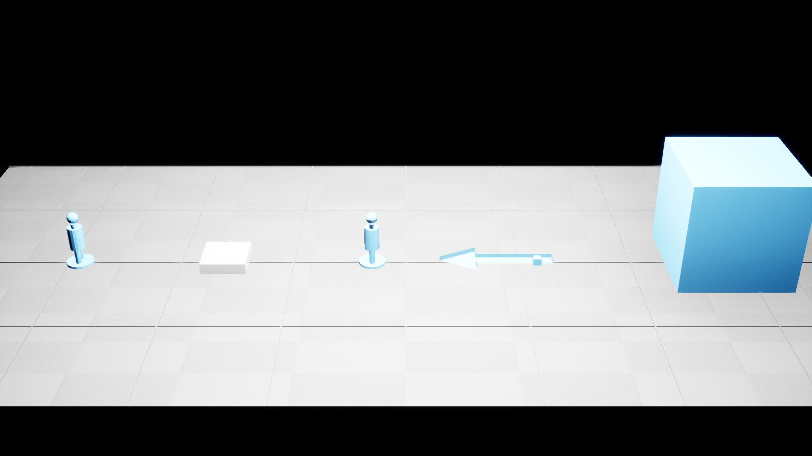
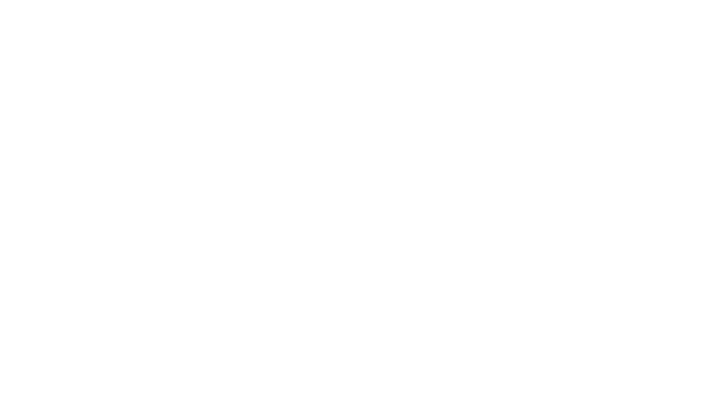

# ART-001 — проверочный набор Blender → Unreal Engine

Статус: **PASS**, 2026-09-27. Задача ART-001 и технический вопрос Q-311 закрыты для связки Blender **5.2.2 LTS** → Unreal Engine **5.8.2**. Художественная приёмка, размеры серийных фигурок, камера, палитра и бюджеты этим прогоном не утверждаются: они остаются за ART-002/003 и GD-058.

## Воспроизведение

Из корня репозитория:

```powershell
& tools/art/run-art001.ps1
```

Сценарий заново собирает `.blend`, проверяет геометрию, экспортирует шесть FBX, собирает UE Editor, очищает только `/Game/ArtTests/ART001`, импортирует набор, выполняет машинные проверки и снимает два кадра реальным DX11 RHI в режиме `-RenderOffScreen`. Повторные полные запуски дали одинаковые замеры и завершились строкой `ART-001 PASS`.

Воспроизводимость здесь функциональная, не побитовая: Blender/FBX записывают служебные метаданные сохранения и экспорта, поэтому SHA файлов между прогонами может меняться. Манифест фиксирует хэши конкретной поставки; gate сравнивает размеры, оси, pivot, структуру рига, root motion, материалы, коллизию и настройки текстуры.

## Результат

| Проверка | Измерено | Статус |
|---|---:|---|
| Куб | 100×100×100 uu; pivot min Z = 0 | PASS |
| Стрелка | X = 0…100 uu; верхняя метка Z = 0…10 uu | PASS |
| Статический манекен | 24×24×50 uu; pivot min Z = 0 | PASS |
| Материал | 1 слот; параметр TeamColor доступен | PASS |
| Selection collision | 1 convex shape; line trace hit | PASS |
| Skeletal mesh | 17 костей; импорт без разворота | PASS |
| Клип | 1.2083 s; root Δ = [100, 0, 0] uu | PASS |
| Normal map | `TC_NORMALMAP`; `sRGB=false`; `flip_green=false`; противоположные половины различимы в normal buffer | PASS |

Полный машинный отчёт: [REPORT.md](../../../../blender/_shared/check_set/REPORT.md) и [ue-import-report.json](../../../../blender/_shared/check_set/ue-import-report.json). Хэши экспортов: [export-manifest.json](../../../../blender/_shared/check_set/export/export-manifest.json).





## Абсолютные пути для локального агента

- Спецификация: `C:/Users/ren/WebstormProjects/unmached/unmached/docs/game-design/evidence/ART-001/README.md`
- Полный запуск: `C:/Users/ren/WebstormProjects/unmached/unmached/tools/art/run-art001.ps1`
- Blender-исходник: `C:/Users/ren/WebstormProjects/unmached/unmached/blender/_shared/check_set.blend`
- Шаблон рига: `C:/Users/ren/WebstormProjects/unmached/unmached/blender/_shared/rig_template.blend`
- Пресет FBX: `C:/Users/ren/WebstormProjects/unmached/unmached/blender/_tools/presets/UM_FBX_v1.json`
- Отчёт: `C:/Users/ren/WebstormProjects/unmached/unmached/blender/_shared/check_set/REPORT.md`
- UE-уровень: `C:/Users/ren/WebstormProjects/unmached/unmached/unreal/Unmatched/Content/ArtTests/ART001/L_ART001_Check.umap`

Пути указывают на целевую ветку `fix/admin-panel` после интеграции этого коммита.

## Граница доказательства

ART-001 подтверждает технический editor pipeline и разрешает серийный экспорт через UM_FBX_v1. Он не закрывает ACC-022 целиком и не заменяет packaged-проверку конкретной серийной модели по QA-009. Локальные логи запуска находятся в `unreal/Unmatched/Artifacts/ART001/` и исключены из Git.
