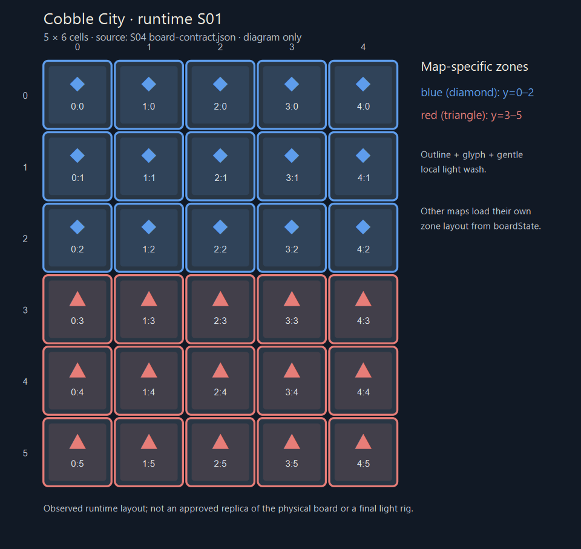
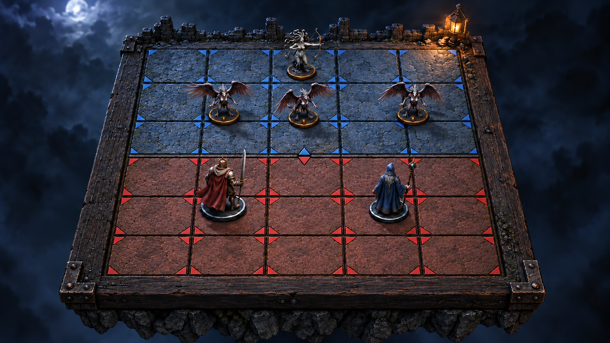
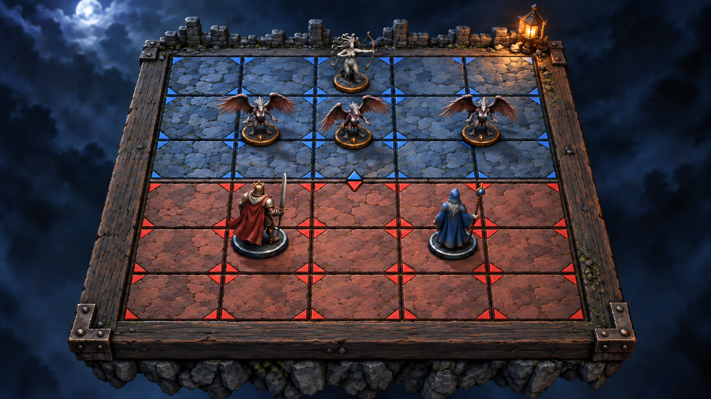
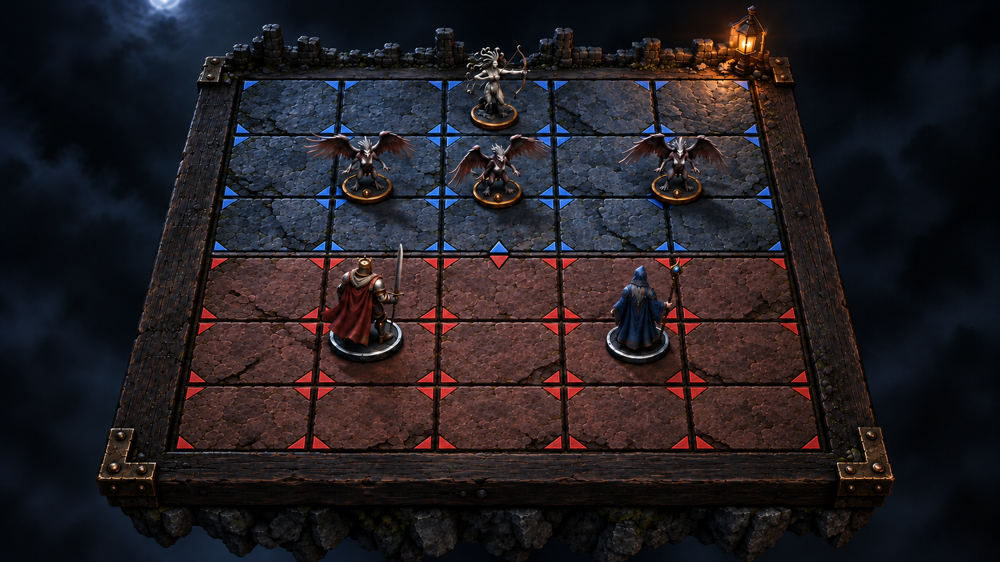
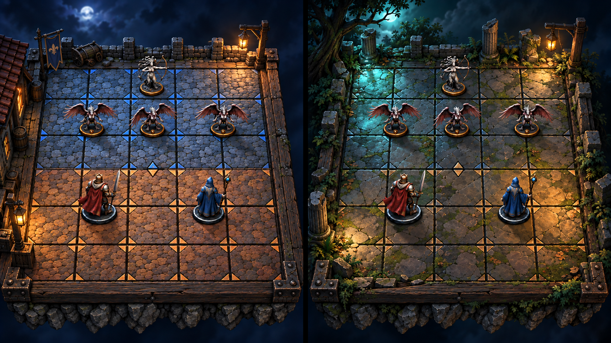
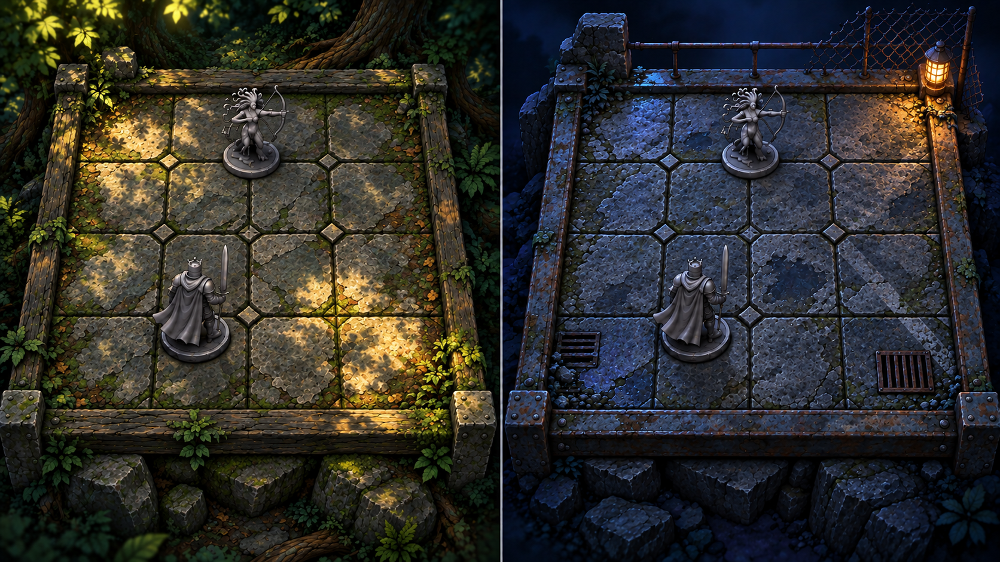
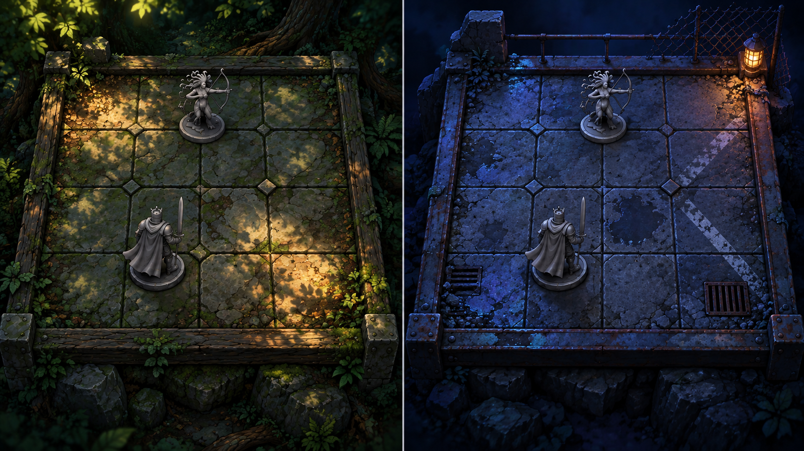
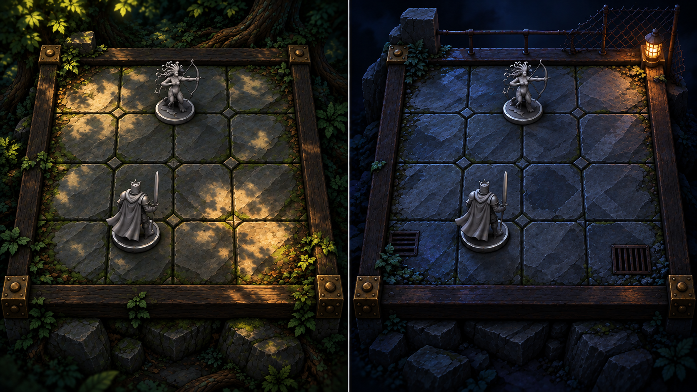

# ART-002 · варианты художественного направления

Статус на 2026-09-27: **готово к выбору автора; направление ещё не утверждено**. Три варианта стиля, ранний двухкартный эскиз и листы A/B/C по полноразмерным референсам двух готовых карт созданы встроенным ChatGPT imagegen. Это концепты, а не UE-кадры, текстуры, спецификация меша или доказательство GD-058. Для работы над серой сценой действует уже принятое D-02; переносить численные параметры с иллюстраций в движок нельзя.

## Что закреплено, а что сравниваем

Сохраняем решение [D-02/D-10/D-13](../../00-vision-and-scope.md): объёмная стилизованная мрачноватая диорама, холодная направленная основа света и тёплые акценты, камень и старое дерево, перспективная камера с фиксированным углом. На всех вариантах один состав: Medusa + три Harpy против Arthur + Merlin; полный обзор доски; низкий дальний декор. Варьируем частоту рисунка камня, степень упрощения формы, локальный контраст и силу зонного света. Палитра, шероховатость, размеры фигурок, камера и численные бюджеты из [03](../../03-art-direction.md) С-1..С-11 остаются **предложением** до GD-058.

Актуальный [контракт S04](../S04/board-contract.json) фиксирует **наблюдавшуюся серверную** Cobble City: 5×6 клеток, blue при `y=0..2`, red при `y=3..5`, 15+15, без мультизон. Он сам говорит, что это не утверждённая копия физической доски и не финальная UE-сцена. [Точная схема](zone-layout-runtime.svg) построена из его `cells[]`; исходная фикстура — [S01](../S01/content-board.json). Пять зон в старом статическом коде 6×4 и пять вертикальных полос ранних черновиков не применяются к текущей Cobble City ([17](../../17-art-production-spec.md) AD-CNF-09/36). На концептах три верхних и три нижних ряда; точное соответствие клеток, позиций фигурок и размеров проверять по схеме/`boardState`, а не пипеткой или счётом пикселей изображения.

Автор напомнил, что в проекте есть изображения разных готовых полей с разными цветовыми/световыми областями. Сохранили [скриншот каталога](reference-admin-boards.png) как **референс разнообразия карт**: Yukon, T. Rex Paddock, Sherwood Forest, King Solomon's Mine, Venice и др. Миниатюры каталога не раскрывают достоверно все зоны/световые параметры. [Hell's Kitchen](../../../../public/assets/boards/hells-kitchen.webp) в старом веб-клиенте показывает сложные цветовые и перекрывающиеся участки, но его изображение сейчас временно привязано к Cobble City и **не является её утверждённым артом**. Для каждой следующей карты нужны её собственные изображение/поверхность и `boardState.cells[].zones`; Cobble City с blue/red нельзя тиражировать на все поля.

## Три варианта в одном ракурсе

| Вариант | Что сравниваем | Сильная сторона | Риск для проверки в UE |
|---|---|---|---|
| [A · Weathered Stone](option-A-weathered-stone.png) | Более подробный неровный булыжник, естественное старое дерево, мягкий холодный лунный key и видимые локальные blue/red области | Фактура и атмосферная глубина | Частый рисунок камня может спорить с клетками и фигурками в K-1; проверить шум и контраст в 1080p |
| [B · Painted Miniature](option-B-painted-miniature.png) | Крупные нарисованные плоскости камня/дерева, упрощённые формы, повышенная яркость игрового слоя при том же тёмном окружении | На концепте лучше всего читаются плоскости и силуэты; **рабочая рекомендация для первого UE-прогона** | Излишнее упрощение может уничтожить нужную фактуру в K-2; проверить крупный план |
| [C · Premium Tabletop](option-C-premium-tabletop.png) | Более тёмный фон, выборочное холодное контурное освещение, осторожные латунные акценты, почти чёрный край подноса | Выразительный «предметный» образ | Дальние клетки и тёмные фигуры могут теряться в K-1; возможна стоимость дополнительных световых эффектов — не измерена |

Ни один вариант не копирует старые [noir tactical](../../../hud-concepts/hud-noir-tactical.png), [premium tabletop](../../../hud-concepts/hud-premium-tabletop.png) или [arcade comic](../../../hud-concepts/hud-arcade-comic.png) как утверждённый HUD. Эти три изображения сравнивают **сцену**; семейства HUD, кириллица и состояния требуют отдельной ART-011. Пропорции фигурок и высота декора на imagegen-кадрах также не являются измеренными размерами ART-003/005.

## Как перенести «световые секции» на разные карты

1. **Геометрия и правила.** По [08](../../08-integration-decisions.md) / [17](../../17-art-production-spec.md) геометрию, `zones[]`, соседство и стартовые позиции берём из `boardState`. Арт доски не создаёт механику. Для новых карт нельзя выводить зоны только из картинки.
2. **Поверхность карты.** Отдельный базовый материал/набор декора для Cobble City и для каждой будущей карты. Камень, лес, шахта и т. п. могут иметь свой характер, но общий D-02 и читаемость игрового слоя сохраняются. Скриншоты готовых полей задают различия в образе, не фиксируют числа UE-света.
3. **Зонный слой.** Вариант реализации для пробы: по `cells[].zones` рисовать на каждой игровой клетке тонкую обводку, глиф/форму и мягкую локальную цветовую тонировку; границы секций непрерывны. Blue и red на Cobble City — только текущая фикстура. Мультизона поддерживается данными/боевой логикой, но её чистовое визуальное правило открыто ([17](../../17-art-production-spec.md) AD-OPEN-21). Цвет никогда не единственный признак.
4. **Свет сцены.** Глобальный холодный key и тёплый фонарь описывают диораму; зонная подсветка обозначает принадлежность клетки и не должна менять читаемость соседней клетки, команды или выбранной фигуры. Для 60 FPS на D-07 предпочтение материалу/оверлею перед множеством динамических shadow-casting lights — **предложение для замера**, не утверждённый метод или бюджет.
5. **Конфликтующие слои.** Выделение, доступный ход, цель атаки и pending должны быть видны поверх базового зонного слоя. Нужно проверить на K-1/K-3 и при симуляции deuteranopia; форма/глиф/контур сохраняют смысл без цвета. Локальный тёплый фонарь и HUD не должны скрывать одну из секций.

[Серые силуэты ART-003](../ART-003/README.md) намеренно сняты без цветных секций. Следующий цветовой концепт должен быть показан **минимум на двух разных схемах освещения карт**, включая текущую Cobble City и отдельный эскиз с несколькими/пересекающимися световыми секциями по референсам готовых полей. Такой второй эскиз проверяет художественный язык, но не утверждает расположение игровых зон: для точной разметки нужен `boardState` соответствующей карты. Миниатюры админ-каталога и старое изображение Hell's Kitchen дают визуальный референс разнообразия, но не заменяют контракт зон.

### Сравнение света на двух полях

Слева imagegen показал мостовую с более простой холодной/тёплой секционностью; справа — **вымышленное лесное поле** с несколькими локальными холодными и янтарными пятнами. Это проверка того, что один стиль выдерживает разные поверхности и рисунок света без потери клетки и фигуры. Правый кадр **не изображает Sherwood Forest из каталога** и не воспроизводит её зоны. Даже левый кадр нельзя использовать как источник числа/координат клеток: точная Cobble City определена схемой S04 выше. Генерация добавила деталь и цвет фигуркам; степень этой детализации не утверждена и будет оцениваться по K1/K2 и бюджету. [Происхождение и промпт](PROMPTS.md#двухкартный-эскиз-света).

### Привязка следующего цветового прохода к готовым картам

Вымышленный правый кадр выше **не заменяет проверку на реальных картах**. На [скриншоте каталога](reference-admin-boards.png) уже видны разные цветовые рисунки: Yukon/Yukon 1900 — тёплые и холодные участки, T. Rex Paddock — преимущественно холодные сине-фиолетовые, Sherwood Forest — зелёные и тёплые, Venice — более пёстрые бирюзовые и песочные. Это наблюдения по маленьким превью, **не утверждённые цвета освещения или координаты игровых зон**. [Hell's Kitchen](../../../../public/assets/boards/hells-kitchen.webp) показывает многосоставные цветные клетки крупнее, но сейчас ошибочно используется как картинка Cobble City; её топологию не переносить в ART-005.

Первый сравнительный лист подготовлен **по полноразмерным изображениям двух существующих карт с различным цветовым рисунком** — T. Rex Paddock и Sherwood Forest. На нём одинаковые серые Medusa и Arthur показаны на двух оригинальных пробных диорамах при разных условиях света; геометрия, материалы, масштаб и камера задуманы одинаковыми. Исходные карты использованы как референсы цвета окружения, а не скопированы как поверхность, сеть клеток или игровые зоны. [Точные входы и промпт](PROMPTS.md#свет-по-полноразмерным-референсам-двух-карт).

| Вариант при тех же двух условиях света | Что видно на концепте | Риск для UE-проверки |
|---|---|---|
| [A · Weathered Stone](lighting-real-map-option-A.png) | Более дробный выветренный камень и старая древесина | Шум поверхности может спорить с фигуркой и границей клетки на K-1 |
| [B · Painted Miniature](lighting-real-map-conditions-concept.png) | Более крупные спокойные плоскости; рабочая рекомендация для первой пробы | На K-2 нужно сохранить достаточную материальность |
| [C · Premium Tabletop](lighting-real-map-option-C.png) | Более тёмный край и редкие латунные детали; клетки оставлены освещёнными | Тёмный край/лес может слить дальний силуэт в K-1 |

**Что показывают кадры:** слева — зелёная тень листвы с локальными тёплыми пятнами, справа — холодный сине-фиолетовый ночной фон с небольшим тёплым практическим источником. Фигурки остаются серыми, но их свет на картинках не является замером UE; генеративное редактирование не гарантирует пиксельного совпадения геометрии между A/B/C. Цветные сектора внутри кругов на исходных картах относятся к **графике игровых зон**, а не к источникам света; в пробные листы они не перенесены. Эти листы также **не подтверждают** карту клеток, расположение зон, полноценные материалы Medusa/Arthur, HUD или приёмку GD-058. Следующий шаг после выбора направления — UE K-1/K-3 с одинаковыми камерами/экспозицией/материалами, настоящими `boardState` соответствующих карт, HUD и проверкой в оттенках серого и при симуляции deuteranopia: силуэт, команда, клетка, выделение и цель атаки должны оставаться читаемыми в каждой секции. Без такого прогона цветовые листы — только концепты, а не доказательство пригодности света для всех карт.

## Проверка до выбора и после него

| Проверка | Проверяемый результат | Сейчас |
|---|---|---|
| Источник карты | Концепт и точная схема явно отделены: `zone-layout-runtime.svg` отображает 30 клеток, 15 blue / 15 red; вариант изображения не меняет `boardState` | Схема построена; 3 стилистических кадра готовы |
| K-1, полный обзор | Видны все клетки/дальняя строка, шесть фигурок, герой/помощник, обе команды, выбранная фигура, граница blue/red; decor вторичен | Требует интегрированного UE-кадра 1080p с HUD |
| K-2, приближение | Большая форма камня, оружие, лицо/силуэт, база/номер Harpy читаются без дробного шума | Требует UE-кадра |
| K-3, бой | Нападающий, цель, результат и карта/инспектор читаются без кино-поворота, свет секций не спорит с боевой подсветкой | Требует UE-кадра |
| Доступность | Секции, команда и боевые состояния различимы в grayscale и deuteranopia по форме/иконке/контрасту, не только по blue/red | Требует симуляции на реальном кадре |
| Другие карты | Сравнительные листы A/B/C по полноразмерным референсам двух реальных карт с разным цветовым рисунком; при наличии второго `boardState` его `zones[]` меняют игровую разметку без изменения базового кода; несколько зон на клетке не теряются | Три концепта по референсам готовы; UE K-1/K-3 с HUD, фикстура другой карты и решение по мультизоне ещё нужны |
| Производительность | Packaged Development на целевом D-07 при 1080p/60 FPS; подсветки сохраняются на минималках | Не измерено; GD-058/ACC-022 открыты |

**Выбор автора для ART-002:** A, B, C либо исходный D-02 без выбора конкретного кадра. При выборе стоит отдельно отметить, что берём из зонной подачи и допускается ли иной подход для других карт. До ответа вариант B — только рабочая рекомендация; никакая из картинок не утверждает палитру, карту, HUD или параметры камеры. Сохраняются открытыми Q-301, Q-302..304, ART-003/005 и GD-058. [Промпты и происхождение](PROMPTS.md).
