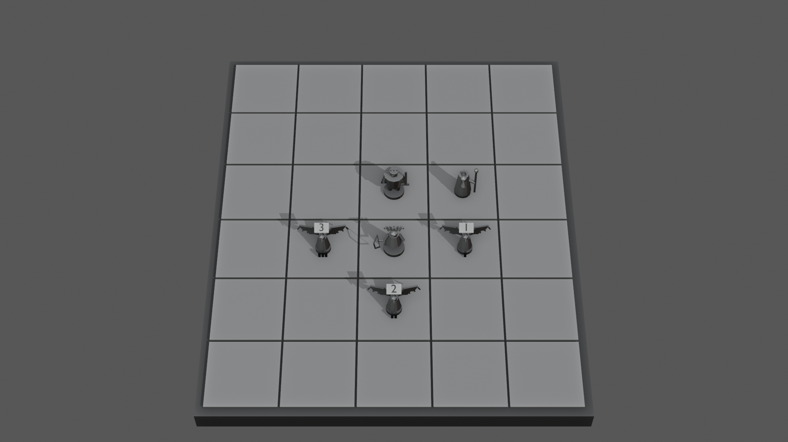
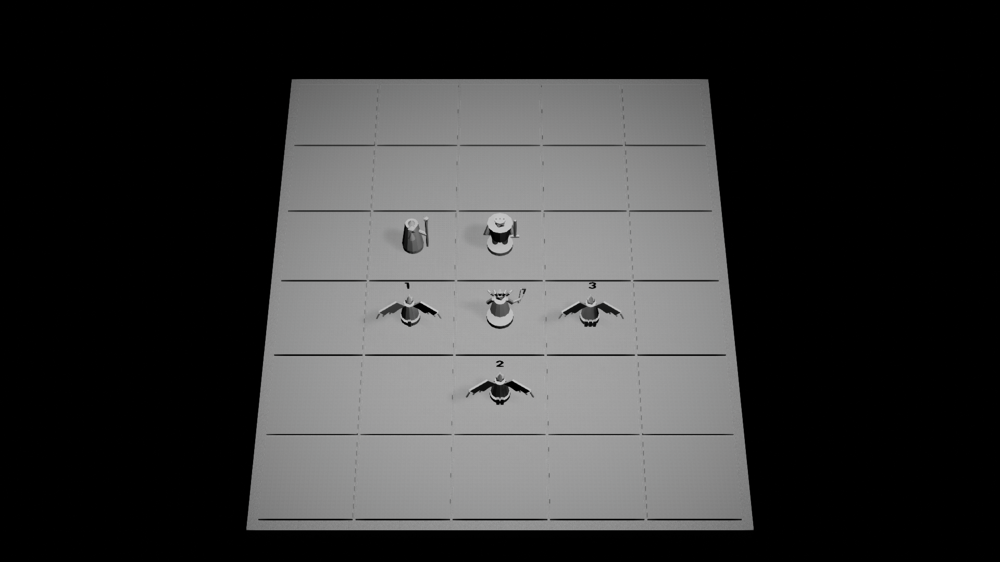

# ART-003 · серые силуэты и габариты четырёх типов

**Дополнение 2026-09-28:** [живая packaged-проба выбора](live-selection-packaged-review-2026-09-28.md) подключила авторское кольцо ASSET-MARKERS-001 к Medusa и заменила заливку достижимых клеток на угловые метки. После устранения наложения в центре поля K1 с HUD читается без белой плашки; реальный клик, остальные состояния и полный QA-010 остаются открытыми.

Статус на 2026-09-27: **in_progress, блок-аут и редакторный UE-проход готовы к просмотру**. После этих кадров [выбран B · Painted Miniature](../ART-002/README.md); серые силуэты остаются отдельной воспроизводимой проверкой до визуальной приёмки GD-058. Фигурки здесь не являются готовыми моделями для игры: FBX — статические пробы с автоматической технической UV-развёрткой и серым материалом, без производственных UV/текстур, рига и анимаций. Численные размеры и камера остаются предложением из [04](../../04-blender-production.md) и [03](../../03-art-direction.md).

## Что открыть

- [Серая сцена K1, 1920×1080](../../../../blender/A01/preview/k1-six-figures-gray.png) — шесть фигурок на сетке текущей Cobble City; над гарпиями временные таблички 1/2/3 для проверки различимости экземпляров.
- [K1 без цвета и табличек](../../../../blender/A01/preview/k1-six-figures-silhouette.png) — проверка формы четырёх типов с той же камеры. Три гарпии имеют один и тот же силуэт, поскольку это экземпляры одной модели.
- Turntable по три ракурса для [Medusa](../../../../blender/A01/preview/medusa-front-gray.png), [Harpy](../../../../blender/A01/preview/harpy-front-gray.png), [Arthur](../../../../blender/A01/preview/arthur-front-gray.png), [Merlin](../../../../blender/A01/preview/merlin-front-gray.png); рядом с каждым `*-front-gray.png` лежат `*-side-gray.png` и `*-back-gray.png`.
- [Редактируемая сцена Blender](../../../../blender/A01/silhouette_blockouts.blend), [численный отчёт](../../../../blender/A01/build-report.json), [скрипт сборки](../../../../blender/_tools/build_art003_blockouts.py).
- [Редакторный кадр UE K1, 1920×1080](../../../../blender/A01/preview/ue-art003-k1-gray.png), [отчёт импорта](../../../../blender/A01/ue-import-report.json), [манифест четырёх FBX](../../../../blender/A01/export/export-manifest.json) и [отдельный тестовый уровень](../../../../unreal/Unmatched/Content/ArtTests/ART003/L_ART003_SilhouetteScale.umap).





## Проверенный состав и масштаб

Скрипт берёт 5×6 клеток и позиции `medusa-first` из [S04 board-contract.json](../S04/board-contract.json), а не из старого статического 6×4 макета. В сцене `f-0-hero` = Medusa, `f-0-sk0..2` = три Harpy, `f-1-hero` = Arthur, `f-1-sk0` = Merlin. Одна клетка 100 uu представлена 1 м в Blender; цифры ниже пересчитаны в uu. Нижние и верхние границы получены из геометрии сохранённой сцены, не из пикселей.

| Тип | Высота тела без оружия | Полная высота | Подставка | Отличительный силуэт |
|---|---:|---:|---:|---|
| Medusa | 54,48 uu | 54,48 uu | Ø30 uu | Змеиная корона и лук, в том числе заметный в боковом ракурсе |
| Harpy | 42 uu | 42 uu | Ø22 uu | Полураскрытые, слегка отведённые назад крылья; полный размах 73,32 uu |
| Arthur | 55,5 uu | 56 uu с мечом | Ø30 uu | Тяжёлый плечевой силуэт, корона, плащ и вертикальный меч |
| Merlin | 48 uu | 61,5 uu с посохом | Ø24 uu | Узкая мантия, капюшон/борода и отдельный высокий посох |

Высоты тела попадают в предложенные диапазоны [04 §3.1–3.4](../../04-blender-production.md), Harpy уже предложенного максимума 80 uu по крыльям. Выходящий за высоту тела посох Merlin учтён отдельно. Это **не утверждение** размеров будущих производственных мешей.

## Что подтвердил импорт в UE

Четыре статических FBX экспортированы по проверенному [UM_FBX_v1](../../../../blender/_tools/presets/UM_FBX_v1.json) и импортированы в отдельный `/Game/ArtTests/ART003`. В UE измерены полные высоты: Medusa **54,485 uu**, Harpy **42,000 uu**, Arthur **56,000 uu**, Merlin **61,500 uu** с посохом. У каждого нижняя точка `Z=0`; максимальный горизонтальный габарит Harpy **72,647 uu** после поворота экспорта, меньше клетки 100 uu и предложенного предела 80 uu. Все четыре имеют один render section LOD0. Итоговый FBX-import commandlet сообщил **0 errors / 0 warnings**; это не означает, что игровые материалы, коллизия и анимации проверены.

Тестовый уровень использует 30 серых клеток и шесть экземпляров по S04. Команды повернуты друг к другу: тогда крылья не сжимаются в проекции игровой камеры. На пробном K1 видны отдельные формы героев и помощников и временные цифры Harpy 1/2/3. Снимок получен Unreal Engine 5.8.2 с реальным RHI, без HUD, при временном лимите процесса `t.MaxFPS 30`; это **не замер 60 FPS** и не проверка packaged build. Нейтральные свет и экспозиция уровня предназначены только для чтения серых форм, не являются палитрой ART-002 или освещением конкретной карты.

## Результат просмотра и незакрытое

В просмотренных серых turntable и K1 фигуры имеют разные большие формы: у Medusa выступают лук и корона, у Harpy — крылья, у Arthur — широкие плечи/меч, у Merlin — узкий плащ/посох. Боковой вид лука и крыльев отдельно раскрыт, чтобы профиль не превращался в линию. На сером K1 временные таблички 1/2/3 различают экземпляры Harpy; возле основания также есть физические группы из 1/2/3 выступов. В K1 эти выступы слишком малы для самостоятельного уверенного распознавания, поэтому формат игрового маркера остаётся открытым ([17](../../17-art-production-spec.md), AD-OPEN-06). Таблички — **визуальный probe**, не утверждённый HUD или часть экспортируемой модели.

Блок-аут намеренно без цветных зон и локального света: так проверяется именно силуэт. На [готовых картах в каталоге](../ART-002/reference-admin-boards.png) цветовые/световые секции различаются; одну схему Cobble City нельзя переносить на остальные поля. Для ART-005 надо снова показать K1/K2/K3 с материалом конкретной карты и её `boardState.cells[].zones`, а затем проверить конфликт местного света, границ зон, подсветки выбора и фигурок. [ART-002](../ART-002/README.md) содержит эту схему проверки. Сама текущая Cobble City имеет 15 blue + 15 red клеток по S04; старый [Hell's Kitchen](../../../../public/assets/boards/hells-kitchen.webp) показывает сложные разноцветные участки, но не является утверждённой картой Cobble City.

После исходной серой проверки шесть блок-аутов перенесены на [Blender-пробу B atlas v1](../../../../blender/ASSET-BOARD-COBBLE-001/variants/B-atlas-v1/board-six-figures-k1-atlas-B-v1.png). На 1280×720 крупные формы фигур читаются на неповторяющемся камне, а цифры Harpy видны; временные таблички частично перекрывают крылья и требуют иной игровой компоновки. Этот кадр не содержит зон, HUD и UE-проверки, поэтому не закрывает ART-003 и QA-010.

Следующая [компоновочная проба v2](../../../../blender/ASSET-BOARD-COBBLE-001/variants/B-atlas-v1/marker-placement-v2/board-six-figures-k1-markers-v2.png) переносит номера к переднему правому краю клеток. [Самоприёмка](marker-placement-acceptance-2026-09-27.md) подтверждает отсутствие перекрытия крыльев в фиксированном Blender K1; игровая привязка маркеров, HUD, зоны и UE K1 ещё не проверены.

Для проверки игрового слоя изготовлен отдельный [кандидат ASSET-MARKERS-001](../../../../blender/ASSET-MARKERS-001/README.md): четыре профиля баз, кольца выбора/цели и стела состояния. [Blender K1 с тремя маркерами](../../../../blender/ASSET-MARKERS-001/preview/markers-on-board-k1-v1.png) показывает различие сплошного кольца и четырёх дуг; это не подтверждает материал/клик/различимость с HUD и зонами в UE.

Семь мешей комплекта затем [технически импортированы в отдельную папку UE ArtTests](../../../../blender/ASSET-MARKERS-001/ue-import-report.json), включая четыре выпуклые коллизии прицела. [Редакторная трассировка](../../../../blender/ASSET-MARKERS-001/ue-hit-report.json) дала 9/9 ожидаемых попаданий и промахов по дугам, разрывам и центру. Полная сценическая проверка ART-003 с игровым кликом, HUD и зонами не проводилась.

**До закрытия ART-003:** направление ART-002 выбрано; остаются просмотр силуэтов автором в целевом игровом масштабе, решение о способе обозначать три Harpy и проверка пересечений в UE с HUD/подсветкой выбранной клетки. Редакторные кадры не доказывают packaged 1080p/60 FPS, деутеранопию, финальную геометрию или GD-058.

## Воспроизведение

Из корня проекта с Blender 5.2.2 LTS:

```powershell
& 'C:/Program Files/Blender Foundation/Blender 5.2/blender.exe' --background --factory-startup --python blender/_tools/build_art003_blockouts.py
```

Скрипт пересоздаёт `.blend`, 12 ракурсов персонажей, два K1-кадра и JSON-отчёт. Успешный прогон печатает `ART003_BLOCKOUTS_COMPLETE 14`. Изменять утверждённые данные боя или другие карты для этой проверки не требуется.

Для FBX → UE Editor → K1-кадра на установленном Unreal Engine 5.8.2:

```powershell
& tools/art/run-art003-ue.ps1
```

Сценарий читает сохранённый `.blend`, экспортирует четыре статических FBX, импортирует их только в `/Game/ArtTests/ART003`, сверяет размеры/pivot с Blender-отчётом и снимает кадр `ue-art003-k1-gray.png`. Повторный полный прогон завершился `ART003_UE_PASS`. Логи каждого прогона находятся в игнорируемом `unreal/Unmatched/Artifacts/ART003/`.
