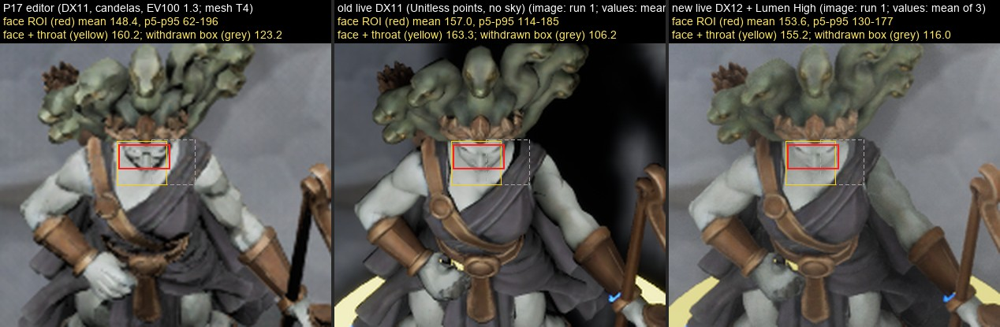

# ART-004 / W4-A — рендер по решению пользователя: DX12/SM6 + Lumen, эталон High (2026-09-29)

Статус: **технически внедрено и измерено** на ПК разработки (RTX 4090, i9-13900F). Художественной приёмки нет, ACC-022 на целевом ПК D-07 не заявляется. Коммитов нет — оркестратор коммитит по commit_manifest.

Решения пользователя (2026-09-28, чат оркестратора; действуют): «Графика: DX12 + Lumen сейчас», «Эталон качества для приёмки K1–K3 и ACC-022: High как эталон». TeamColor на одежде и гибрид UMG в этой задаче не затрагивались. Меморандум: `C:/tmp/p0-review/engine-gate-memo.md` (§1 п. 1, 2, 3 частично, 7; §2 бенч).

Каталог доказательств: [render-dx12-lumen-2026-09-29/](render-dx12-lumen-2026-09-29/).

**Исправление после проверки (2026-09-29).** Первая версия отчёта утверждала в п. 3(в): «лицо K2 5× 106,2 → 116,0, лицо больше не тёмное (G01)». Это неверно. ROI лица центрировался по экранному X сокета Head и покрывал правую треть лица, мантию и чёрный зазор у шеи. Правило ROI исправлено, все кадры пересчитаны тем же правилом, §0, §3 и §5 переписаны. Итог другой: лицо не было тёмным, а на эталоне High оно немного темнее и заметно площе.

## 0. Коротко

- Проект переведён на **DX12/SM6 + Lumen GI и отражения** (software Lumen, mesh distance fields), **CSM** для ключевого света (VSM измерен и отклонён), Nanite и Substrate не используются. Кукается PCD3D_SM6 **и** PCD3D_SM5. Игра стартует на DX12 SM6. Без SM6 (DX12 без SM 6.6 или DX11) она запускается на SM5 без Lumen. Оба фолбэка запущены и сняты.
- **G01 исправлен**: point-свет перед интенсивностью переводится в канделы. Профили rev 2 объявляют единицы. Point-«амбиент» заменён Movable SkyLight, экспозиция фиксирована объёмом (EV100 1,3 как в P17).
- **G05 подтверждён и исправлен**: старые packaged-кадры рендерились в **72,9 %** внутреннего разрешения (TSR-вход по ProfileGPU). Теперь 100 %.
- **Эталон High**: `DefaultGameUserSettings.ini [ScalabilityGroups]` = 2, `-S08RenderPreset=High` в бенче и доказательных прогонах. `DefaultScalability.ini` сохраняет тень ключа на всех уровнях.
- **RENDER fingerprint** пишется в каждый SHOT. `classify_evidence --strict/--render-reference` и `qa010 render` + строка чек-листа `ALL.render_reference` отвергают кадры без fingerprint или не на эталоне. Проверено на реальных кадрах: 6/6 новых — `packaged-live strict`, 6/6 старых — REJECTED (S5).
- **Игровой слой** (зоны, глифы, кольца, отметки клеток, база команды, подписи) переведён на unlit + EyeAdaptationInverse, без теней и без вклада в Lumen/DF. Попутно исправлен давний дефект: зоны Cobble в packaged рисовались материалом по умолчанию (нет ISM usage), теперь рисуются своими цветами.
- **Бенч `-Bench`**: сцена без бэкенда, packaged Development, 1920×1080, SP 100, 30 с прогрева, 3 повтора, порог 2× шума.
  - GPU-кадр на RTX 4090, при одинаковом D3D12-таймере: старое состояние 1,56 / 1,62 мс → DX12+Lumen High **1,77 / 2,00 мс** (K1 / K2 5×; +14 % / +23 %).
  - Lumen занимает 0,87–1,06 мс на async compute.
  - Пара клиентов по 30 FPS: суммарная загрузка GPU **41,2 % → 50,8 %** (p95 46 → 56 %; сверх простоя +3,8 → +12,5 п.п.). FPS 29,8 и p95 кадра 33,3 мс не изменились.
- **Лицо Medusa (K2 5×, живые кадры, ROI на лице)**: **157,0 → 153,6** (−3,4, значимо при пороге 0,5). Лицо вместе с горлом: 163,3 → 155,2 (−8,2). Лицо стало площе: p5–p95 114–185 → 130–177.
  - Лицо не было тёмным и раньше. G01 осветлил окружение, а не лицо: кадр p50 72 → 114, тени p10 26 → 48, чёрные падающие тени исчезли.
  - Доска K1 (p50): 81,9 → 134,4 при P17 131,2.
  - Баланс ключ/небо/экспозиция для лица — открытый художественный вопрос (§5, §8).
- **Риск ACC-022 для класса GTX 1060 — высокий на High** (оценка, §6). Low/Medium — вероятный путь к 60 FPS на таком железе. На целевом ПК не мерили.

## 1. Что внедрено (файлы — арт-worktree)

| Пункт | Реализация |
|---|---|
| DX12/SM6 + Lumen | `unreal/Unmatched/Config/DefaultEngine.ini`: `DefaultGraphicsRHI_DX12`, D3D12 formats PCD3D_SM6 + PCD3D_SM5, D3D11 PCD3D_SM5, `r.DynamicGlobalIlluminationMethod=1`, `r.ReflectionMethod=1`, `r.GenerateMeshDistanceFields=True`, `r.Lumen.HardwareRayTracing=False`, `r.RayTracing=False`, `r.Shadow.Virtual.Enable=0` (CSM), `r.Substrate=False`, `r.AntiAliasingMethod=4` (TSR, явно), `r.DefaultFeature.LightUnits=1`, SP: `r.ScreenPercentage.Default=100`, `…Desktop.Mode=0`, `[SystemSettings] r.ScreenPercentage=100` |
| Эталон High, пресеты | `Config/DefaultGameUserSettings.ini` `[ScalabilityGroups]` sg.* = 2, ResolutionQuality 100 (свежая установка, в логе `@2` применяется при инициализации RHI); `Config/DefaultScalability.ini` (ShadowQuality@0 держит 1 каскад 1024 — тень ключа на всех уровнях; предложение UI: Low/Medium/High = sg 0/1/2); `-S08RenderPreset=Low|Medium|High|Epic` (`S08Render.cpp`) |
| G01 единицы | `S08BoardActor.cpp ApplyArtLights`: `SetMobility(Movable)` → `SetIntensityUnits(Candelas)` → `SetIntensity`; профиль без `units` (данные до W4) или `-S08LegacyRender` = Unitless, помечается в трассе и fingerprint |
| Профили rev 2 | `Config/ArtBoards/S08ArtBoardProfiles.json` (sha256 `91ea86be…`): `units {point: candelas, directional: lux}`, `sky` (cubemap `/Game/S08/Render/TC_S08_AmbientDome`, интенсивность, цвет), `exposure` (histogram-fixed, min = max = 2,46229, bias 0, EV100 1,3), `directional.shadow` (CSM 3000 uu, 2 каскада). Point `fill` удалён — его заменил sky. Пересчёт значений не нужен: числа уже были канделами редакторных проб (в P17 `intensity_units: CANDELAS`), packaged трактовал их как Unitless (×1/625). Валидаторы: C++ `ParseRenderBlocks`, `tools/art/art_board_fixtures.py check_render_blocks` |
| SkyLight | Movable `ASkyLight` (deferred spawn, `SLS_SpecifiedCubemap`, `RecaptureSky`). Нейтральный «купол» генерируется детерминированно: `tools/art/render/make_ambient_dome_hdr.py`, sha256 HDR `389961f0…`. Импорт TextureCube: `tools/art/render/w4a_render_content.py`, UnrealEditor-Cmd **арт-worktree**, отчёт `content/w4a-render-content-report.json` |
| Экспозиция | Unbound `APostProcessVolume` из профиля: histogram, min = max, bias; диапазон не расширялся |
| SP 100 (G05) | см. DefaultEngine.ini; fingerprint `screenPct=100.0`, ProfileGPU `TSR … 1920x1080 -> 1920x1080` |
| RENDER fingerprint | `S08Render.h/.cpp` (`S08RenderFingerprint`, свой SHA-256 — в UE 5.8 нет Windows-реализации `GetSHA256Signature`); строка в каждом SHOT-блоке (`TakeEvidenceShot`), в `PERF config` и `BENCH measure`; эталон `docs/art-pipeline/render-reference.json`; разбор `tools/art/render_fingerprint.py` |
| Гейты доказательств | `tools/art/classify_evidence.py`: строгий признак S5, `--render-reference` (включается с `--strict`), самотест +1 негатив; `tools/art/qa010`: подкоманда `render` (0/1/3), строка чек-листа `ALL.render_reference`; README QA-010 дополнен |
| Игровой слой | `/Game/S08/Render/M_S08_GameLayerUnlit` (Unlit, Emissive = EyeAdaptationInverse(Tint, 1), ISM usage; параметр `Tint` как у `M_S08_Solid`). `S08ApplyGameLayerPrimitive`: `CastShadow=false`, `AffectDynamicIndirectLighting=false`, `AffectDistanceFieldLighting=false`. Применяется к штрихам и глифам зон (всех досок, в том числе Cobble), подсветкам достижимых клеток, недопустимой клетке, кольцам выбора и цели, базе команды, подписям, числам урона |
| Бенч | `-Bench` в `S08FlowGameMode.cpp` (`RunRenderBench`). Фикстура `Config/Bench/S08BenchCobble.json` (UFS через `Unmatched.Build.cs`) — `gameState` живой комнаты Cobble 5×6 из изолированной БД S09. Драйвер `tools/art/render/render_bench.py` (правило ROI лица — `FACE_ROI_CALIBRATION`), сводка пары `tools/art/render/pair_summary.py`, лицо по всем кадрам и изображения — `tools/art/render/face_roi.py` |
| Скрипты прогонов | `tools/s08/run-phase2-demo.ps1`: `-ClientRenderPreset` (по умолчанию High), `-RequireRenderReference`, `-ClientExtraArgs`; строка `Cobble probe lights` берётся из профиля (`fill=0`) |
| AGENTS.md | абзац «Unreal GPU load»: DX12/Lumen/High; dynamic res — не ограничитель GPU, 60/30 FPS остаются |

## 2. DX12/SM6, фолбэк, тени, Nanite/Substrate

**Старт на DX12.** В логе: `Using Default RHI: D3D12`, `Using Highest Feature Level of D3D12: SM6`, `Max supported Feature Level 12_2, shader model 6.7 … atomic64 supported`. Fingerprint каждого SHOT: `rhi=D3D12 featureLevel=SM6 shaderPlatform=PCD3D_SM6 lumenPlatform=1 gi=lumen refl=lumen`. Кук: шейдерные библиотеки Global и Unmatched для PCD3D_SM6 и PCD3D_SM5, DistanceField 29, 611 пакетов. Время 39 с — shadermap'ы уже были в общем DDC. На чистой машине кук SM6 + SM5 займёт заметно дольше.

**Без SM6.** Исходники 5.8 (`WindowsDynamicRHI.cpp`):
- если D3D12 не даёт SM6 (SM 6.6, wave ops, 64-битные атомики), движок берёт следующий кукнутый уровень — SM5 на DX12;
- если нет DX12 вовсе, запускается D3D11 SM5.

Оба пути запущены на этом ПК флагами: `-sm5` (DX12 SM5) и `-dx11`. Трасса: `featureLevel=SM5 shaderPlatform=PCD3D_SM5 lumenPlatform=0 gi=lumen-unsupported refl=lumen-unsupported … reference=0`. Кадры (`bench/dx12-sm5-fallback/r1`, `bench/dx11-fallback/r1`) рендерятся без ошибок.

Картинка фолбэка светлее и площе: небо не затеняется Lumen, есть только SSAO и DFAO.
- Лицо K2 5× (ROI §5): 166 против 154.
- Доска K1 (p50): 141 против 134.

По стоимости фолбэк не дешевле: на High он включает DFAO и SSR, GPU 1,84 / 2,08 мс против 1,77 / 2,00 у Lumen. Такие кадры по определению не эталон.

**Тени — замер.** Эталон: CSM профиля, 3000 uu и 2 каскада. Сравнение, 3 повтора:

| | K1 GPU мс | K2 5× GPU мс | ShadowDepths (CSV) K1 / K2 | ShadowProjection K1 / K2 |
|---|---|---|---|---|
| CSM профиля (эталон) | 1,77 ± 0,01 | 2,00 ± 0,02 | 0,038 / 0,074 | 0,011 / 0,023 |
| CSM движка (40000 uu, 4 каскада) | 1,78 | 2,01 | 0,076 / 0,108 | 0,010 / 0,023 |
| VSM (`r.Shadow.Virtual.Enable 1`) | 1,90 ± 0,05 | 2,24 ± 0,01 | 0,224 / 0,312 | 0,117 / 0,215 |

VSM дороже на 0,13 / 0,25 мс (значимо). На SM5-фолбэке VSM недоступен: он требует поддержки Nanite на платформе. Значит, тени на части машин различались бы. **Решение: CSM, подогнанный под камеру диорамы.** Подгонка снижает ShadowDepths на K1 вдвое, на K2 на треть; суммарная разница с CSM движка в пределах шума. Ширину полутени и «тени маркеров = 0» пикселями не измеряли. Второе обеспечено кодом: у игрового слоя `CastShadow=false`.

**Nanite и Substrate не включены.**
- `r.Substrate=False` (fingerprint `substrate=0`).
- Nanite-мешей 0. `r.Nanite.ProjectEnabled` оставлен True: без него `DoesPlatformSupportVirtualShadowMaps` вернул бы false. Поэтому в fingerprint `nanite=1`, но это только runtime-cvar.
- Включать Nanite, Substrate, VSM или HW RT — только после отдельного замера.

## 3. Бенч (а): GPU по проходам, без лимита FPS

Методика:
- Packaged Development, `-RenderOffScreen -ForceRes` 1920×1080, SP 100 (legacy — авто), `t.MaxFPS 0`, `r.VSync 0`.
- Прогрев 30 с, затем для каждого вида: settle 8 с, окно 20 с, CSV-профилировщик `-csvGpuStats`, один `ProfileGPU`, один SHOT.
- 3 повтора. Шум — max − min по повторам; разница значима, если |Δ| > 2 × шум.
- Виды: K1 (обзор, 1931 uu) и K2 5× (Medusa, 386 uu).
- Сцена воспроизводит живую комнату. Проверка эмуляции старого состояния: доска K1 (p50) 81,9 = 81,9, лицо (ROI §5) 157,8 против 157,0 у старого живого кадра.

Варианты:
- `dx11-legacy` — старое состояние в той же сборке: `-dx11 -S08LegacyRender`, профиль rev 1 (Unitless + point fill), sg 3, SP авто, GI и отражения выключены;
- `dx12sm5-legacy` — то же состояние на D3D12 SM5, чтобы таймер был без пузырей;
- `dx12-lumen-high` — эталон;
- остальные строки таблицы.

Полные данные: [bench-summary.json](render-dx12-lumen-2026-09-29/bench-summary.json), по прогонам — `bench/<вариант>/r<k>/bench-run.json` (трасса, CSV-сводка, все проходы ProfileGPU, luma, проверка эталона).

| вариант | вид | n | fps | кадр мс | GPU мс (frame cycles) | Σ проходов CSV | ProfileGPU graphics | ProfileGPU compute | GI/AO (Lumen) | вход TSR % | лицо K2 5× (ROI §5)*** |
|---|---|---|---|---|---|---|---|---|---|---|---|
| dx11-legacy | K1 | 3 | 292 | 3,42 | 3,14 ± 0,14* | 2,11* | н/д* | 0 | 0 | 72,9 | — |
| dx11-legacy | K2 5× | 3 | 293 | 3,42 | 3,15 ± 0,23* | 2,16* | н/д* | 0 | 0 | 72,9 | 157,7 |
| dx12sm5-legacy | K1 | 3 | 206 | 4,85 | **1,56 ± 0,03** | 1,29 | 1,62 | 0,11 | 0,01 | 72,9 | — |
| dx12sm5-legacy | K2 5× | 3 | 204 | 4,90 | **1,62 ± 0,02** | 1,36 | 1,76 | 0,10 | 0,01 | 72,9 | 157,8 |
| **dx12-lumen-high** | K1 | 3 | 180 | 5,56 | **1,77 ± 0,01** | 1,28 | 1,53 | 0,87 | 0,85 | 100 | — |
| **dx12-lumen-high** | K2 5× | 3 | 164 | 6,09 | **2,00 ± 0,02** | 1,47 | 1,64 | 1,06 | 0,98 | 100 | 153,7 |
| dx12-lumen-high-vsm | K1 / K2 | 3 | 157 / 157 | 6,46 / 6,38 | 1,90 / 2,24 | 1,38 / 1,69 | 1,82 / 2,24 | 0,94 / 1,30 | 0,92 / 1,31 | 100 | — / 154,4 |
| dx12-lumen-high-csmdefault | K1 / K2 | 3 | 180 / 165 | 5,57 / 6,05 | 1,78 / 2,01 | 1,28 / 1,48 | 1,57 / 1,73 | 0,86 / 0,99 | 0,83 / 1,00 | 100 | — / 153,6 |
| dx12-sm5-fallback | K1 / K2 | 3 | 193 / 182 | 5,17 / 5,50 | 1,84 / 2,08 | 1,55 / 1,78 | 1,94 / 2,04 | 0,16 / 0,18 | 0,14 / 0,32** | 100 | — / 166,1 |
| dx11-fallback | K1 / K2 | 1 | 260 / 257 | 3,84 / 3,89 | 3,56 / 3,64* | 2,52 / 2,64* | 2,14 / 3,81* | 0 | — | 100 | — / 166,1 |
| dx12-medium (sg 1) | K1 / K2 | 3 | 203 / 195 | 4,92 / 5,14 | 1,36 / 1,48 | 0,98 / 1,07 | 1,17 / 1,28 | 0,54 / 0,63 | 0,52 / 0,66 | 100 | — / 169,0 |
| dx12-low (sg 0) | K1 / K2 | 3 | 234 / 232 | 4,27 / 4,32 | 0,90 / 0,98 | 0,62 / 0,70 | 0,92 / 0,97 | 0,15 / 0,17 | 0,02 / 0,04 | 100 | — / 172,0 |

\* DX11 при упоре в CPU (кадр 3,4 мс) включает пузыри ожидания отправки. `RHIGetGPUFrameCycles` вычитает простои только на D3D12 (`GRHISupportsFrameCyclesBubblesRemoval`). Корень ProfileGPU на DX11 «плавает» от 4 до 70 мс. Поэтому DX11-числа — не стоимость GPU, а честное сравнение «старое → новое» — строки `dx12sm5-legacy` → `dx12-lumen-high`.
\** На SM5 в столбец GI/AO попадает композит SSAO/DFAO, а не Lumen.
\*** Среднее luma ROI лица по правилу §5. На K1 голова около 11 px, лицо там не считается.

Выводы (RTX 4090, относительные):
- **Старое → новое при одинаковом таймере: +0,21 мс (K1, +14 %) и +0,37 мс (K2 5×, +23 %) GPU**, значимо.
  - Lumen добавил 0,85 / 0,98 мс работы на async compute.
  - TSR стал дешевле: 0,57 → 0,35 мс, потому что High вместо Epic, хотя вход вырос с 73 до 100 %.
  - ShadowDepths на K1 вдвое ниже (0,072 → 0,038 мс) благодаря подгонке CSM; на K2 почти без изменений.
  - RenderDeferredLighting вырос с 0,05 до 0,28 мс (композит Lumen и неба).
- **CPU-кадр вырос**: 3,42 мс (DX11, старое) → 4,85 (D3D12 SM5 при том же состоянии) → 5,56 (Lumen). Это Development-сборка, упор в render thread. Для слабых CPU это риск независимо от GPU; Shipping не мерили.
- **Пресеты** (предложение UI): Medium −23…−26 % GPU (Lumen irradiance volume 5.8), Low −49…−51 % (без Lumen). Изображение Medium и Low светлее эталона (лицо 169–172 против 154): это другие уровни, не эталон.
- DX12 PSO: в первых кадрах живого клиента 40 промахов прекэша PSO (`PSOPrecacheState: Missed`), на DX11 — 0. В окне замера хитчей больше 50 мс не стало больше (2–6 против 2–5 за прогон), но для релиза нужен PSO-кэш.

## 4. Бенч (б): пара клиентов по 30 FPS + nvidia-smi

`tools/art/art004_live_k2.py run` → `run-phase2-demo.ps1 -ClientFps 30 -ArtPreviewBoardId cmuhgs4b… -ArtPreviewFocusZoom 5`, 60 с, снимок на 40 с. Бэкенд — один экземпляр на :3120 на изолированной БД S09. Хост снимает K2 5× на Medusa, джойнер — K1. По 3 прогона, простой GPU мерили до и после. Старые прогоны сделаны **до** переупаковки той же staged-сборкой T3.2 (exe `2b2a8905…`). Новые — сборкой W4-A (exe `2d651e9e…`) с `-RequireRenderReference`: у обоих клиентов `reference=1`.

| | старое DX11 | новое DX12 + Lumen High | Δ | значимо (2× шум) |
|---|---|---|---|---|
| загрузка GPU пары, среднее % | 41,2 | 50,8 | +9,5 | да (порог 2,6) |
| загрузка GPU пары, p95 % | 46 | 56 | +10 | да (порог 4) |
| простой (редактор, браузер, Blender …), % | 37,5 | 38,2 | +0,8 | нет |
| пара сверх простоя, п.п. | +3,8 | +12,5 | +8,7 | — |
| FPS хост / джойнер | 29,75 / 29,87 | 29,76 / 29,83 | ≈0 | нет |
| p95 кадра хост / джойнер, мс | 33,39 / 33,39 | 33,34 / 33,34 | ≈0 | нет |
| gpuMs хоста (DX11 — с пузырями) | 30,2 | 1,92 | — | не сопоставимо |

Сводка: [pair-summary.json](render-dx12-lumen-2026-09-29/pair-summary.json). Прогоны: [live-pair-dx11-old/](render-dx12-lumen-2026-09-29/live-pair-dx11-old/), [live-pair-dx12-lumen/](render-dx12-lumen-2026-09-29/live-pair-dx12-lumen/).

Классификация:
- новые 6/6 — `packaged-live strict` ([classify-live-dx12-lumen-strict.json](render-dx12-lumen-2026-09-29/classify-live-dx12-lumen-strict.json));
- старые 6/6 — REJECTED только по S5, нет fingerprint ([classify-live-dx11-old-strict.json](render-dx12-lumen-2026-09-29/classify-live-dx11-old-strict.json));
- `qa010 render`: новые — код 0, старый — код 3 ([qa010-render/](render-dx12-lumen-2026-09-29/qa010-render/)).

## 5. Бенч (в): лицо Medusa (G01)

**Первое правило ROI отозвано.** Квадрат 6×6 uu с центром на Head + 9 uu стоял на экранном X сокета (960 px). Лицо кандидата v2 проецируется в x ≈ 922–964, поэтому квадрат [946, 461]–[974, 490] захватывал правую треть лица, мантию и чёрный зазор у шеи. ROI был бимодальным: p50 86 при среднем 106. Прирост 106,2 → 116,0 дали в основном мантия и фон, а не лицо. Наложение первой версии это смещение показывало, а текст утверждал обратное. Те же ошибочные числа были в `bench-summary.json`, `pair-summary.json`, `bench-run.json` и в прежнем `face-k2-5x-compare.jpg`; всё пересчитано и перерисовано.

**Новое правило** (`tools/art/render/render_bench.py`, `FACE_ROI_CALIBRATION`):
- ROI ставится от экранной проекции сокета Head со смещением, откалиброванным для конкретного меша. Единица u = headPx / 12 px — длина 1 uu по мировой оси Z у сокета. Смещения экранные, а не мировые uu, и верны только для камеры доски.
- `faceRoi` — лицо от кончика диадемы до подбородка: центр Head + (−3,95; 9,7) u, 7 × 3,4 u. На K2 5× это [925, 464]–[958, 480], 528 px.
- `faceNeckRoi` — лицо и горло под подбородком (коробка проверяющего): центр Head + (−4,25; 8,9) u, 6,8 × 6 u, [924, 462]–[956, 490].
- Мешам без калибровки и головам меньше 40 px ROI не ставится. На K1 голова 11 px, поэтому на K1 берётся не лицо, а p50 luma доски в прямоугольнике x 600–1360, y 700–940.
- P17 — кадр редактора без трассы сокета, но с той же камерой доски: у живого хоста в `SHOT ctx` cam (0, 171, 344), rot (−55, −90, 0), фокус (0, −50, 28), 386 uu; у P17 те же значения. Лицо меша T4 попадает в те же пиксели, поэтому применяются те же пиксельные коробки. Меш другой (у T4 глубже глазницы), так что P17 — ориентир, а не сравнение один к одному.
- Положение проверено глазами на каждом кадре: [face-roi-contact-sheet.jpg](render-dx12-lumen-2026-09-29/face-roi-contact-sheet.jpg) — 34 кадра K2 5× (P17, 6 живых, 25 бенча, 2 калибровки), красный — лицо, жёлтый — лицо и горло, серый пунктир — отозванный ROI.
- Сводка: [face-roi-summary.json](render-dx12-lumen-2026-09-29/face-roi-summary.json) (`tools/art/render/face_roi.py`, с sha256 каждого PNG, в том числе сырых вне git). Те же поля пересчитаны в `bench/*/r*/bench-run.json` (`render_bench.py reluma`), [bench-summary.json](render-dx12-lumen-2026-09-29/bench-summary.json) и [pair-summary.json](render-dx12-lumen-2026-09-29/pair-summary.json).

Luma — Rec.709 по sRGB-кадру, 0–255. Шум — max − min по повторам. Разница значима, если |Δ| больше 2 × шум и больше 0,5.

| кадр | лицо, среднее | лицо p5–p95 | лицо + горло | отозванный ROI | кадр p50 | тени p10 | доска K1 p50 |
|---|---|---|---|---|---|---|---|
| P17 редактор (DX11, канделы, EV100 1,3, point fill; меш T4) | 148,4 | 62–196 | 160,2 | 123,2 | 109,2 | 70,7 | 131,2 |
| старый живой DX11 (n = 3, шум лица 0,17) | **157,0** | 114–185 | 163,3 | 106,2 | 72,3 | 26,0 | 81,9 |
| бенч старого состояния (dx12sm5-legacy, n = 3, без HUD) | 157,8 | 112–188 | 164,0 | 106,5 | 73,6 | 35,5 | 81,9 |
| **новый живой DX12 + Lumen High (n = 3, шум лица 0,19)** | **153,6** | **130–177** | **155,2** | 116,0 | **113,9** | **48,2** | **134,4** |
| бенч эталона (n = 3, без HUD) | 153,7 | 128–178 | 155,4 | 116,0 | 116,8 | 87,2 | 134,4 |
| калибровка: небо ×1,5 = 12 (n = 1, без HUD) | 157,7 | 132–181 | 159,2 | 119,7 | 120,9 | 90,5 | 139,4 |
| калибровка: небо ×2 = 16 (n = 1, без HUD) | 173,7 | 150–195 | 174,6 | 134,8 | 139,7 | 104,6 | 159,5 |

**Вывод.**
- Лицо не было тёмным и в старых живых кадрах v2: 157,0. Это на уровне P17 (148,4 на T4) и намного светлее кадра вокруг (p50 72).
- На эталоне High лицо **темнее на 3,4 luma** (157,0 → 153,6, −2 %, значимо). Лицо с горлом темнее на 8,2 (163,3 → 155,2, −5 %). Бенч показывает то же: 157,8 → 153,7.
- Лицо стало **площе**: p5 114 → 130, p95 185 → 177, размах p5–p95 72 → 47 (−34 %). Небесный заполняющий свет поднял тени на лице, а блики стали слабее. У P17 размах 134, но там другой меш.
- G01 был настоящим дефектом (Unitless вместо кандел, ×1/625), и его исправление работает на окружение: кадр p50 72 → 114, тени p10 26 → 48, доска K1 82 → 134 при P17 131, чёрные падающие тени исчезли. Бенч старого состояния совпадает со старыми живыми кадрами (доска 81,9 = 81,9, лицо 157,8 против 157,0), значит point-fill 700 при Unitless действительно давал ноль. Лицо G01 не осветлил: «тёмное лицо» было впечатлением от тёмного кадра вокруг фигуры.
- VSM и CSM движка лицо не меняют (154,4 и 153,6). Medium, Low и SM5-фолбэк светлее (166–172), но это не эталон.

**Открытый художественный вопрос: баланс ключ/небо/экспозиция на лице.** Свет в этой правке не менялся. Данные для решения:
- небо ×1,5 (12 вместо 11,2) возвращает среднее лица к старому уровню (157,7), но доска K1 уходит на 139,4 при P17 131,2, а размах на лице остаётся 49;
- небо ×2 осветляет всё (лицо 173,7, доска 159,5);
- уровень лица — вопрос интенсивности неба и экспозиции, а плоскость — вопрос отношения ключ/небо (или AO и контактных теней на лице).

Выбор за арт-лидом и пользователем. После него нужен новый прогон пары и бенча.

**Калибровка неба** ([calibration/](render-dx12-lumen-2026-09-29/calibration/), override-профили). Luma доски K1 (p50 прямоугольника x 600–1360, y 700–940):
- sky 8 → 112,1;
- sky 12 → 139,4;
- sky 16 → 159,5.

Цель — P17 с 131,2. Выбрано sky 11,2 (×1,4 от 8): K2-угол доски P17 (105,2) совпал при ×1,5. Итог: доска K1 **134,4 против 131,2** (+3,2 luma). Это не в пределах 2× шума P17 (0,47): цель достигнута приближённо. Forest и Paddock масштабированы тем же ×1,4 от пропорции fill (15,2 / 18,4); отдельно их не снимали. Статус «предложено», художественного решения нет.

## 6. Риск ACC-022 для класса GTX 1060 — оценка, не замер

Измерено здесь (RTX 4090, 1080p, High): GPU-кадр 1,77–2,00 мс, из них Lumen 0,85–1,06 мс на async compute. На Pascal async compute почти не перекрывается, поэтому для слабой карты разумнее брать сумму очередей: 2,4–2,7 мс. Отношение производительности 4090 к GTX 1060 6 GB — примерно 8–15× (FP32 около 19×, полоса памяти около 5×, Lumen чувствителен к обоим; оценка по спецификациям).

| пресет | 4090, мс | GTX 1060, мс (×8…15, оценка) | 60 FPS, один клиент (16,7 мс) | пара по 30 FPS (≤ 16,7 мс на клиента) |
|---|---|---|---|---|
| High (эталон) | 1,8–2,0 (сумма очередей 2,4–2,7) | 19–40 | вряд ли | нет |
| Medium | 1,4–1,5 (1,7–1,9) | 14–28 | на грани | вряд ли |
| Low (без Lumen) | 0,9–1,0 (1,1–1,2) | 9–18 | вероятно | на грани |

Кроме этого:
- CPU-кадр DX12 на 65 % выше DX11 (Development);
- PSO-хитчи на холодном кэше;
- RX 580: без SM 6.6 и 64-битных атомиков на typed-ресурсах драйвер может не дать SM6. Тогда клиент уйдёт в SM5-фолбэк (другая картинка, по GPU не дешевле High-Lumen).

Итог: риск ACC-022 на High для класса D-07 **высокий**, как и в меморандуме (Lumen 8–10 мс из 16,7). Эталон приёмки (High) и пресет, в котором проходит ACC-022, скорее всего будут разными. Это надо решить вместе с GD-047 (пресет «Качество графики») и при замере на целевом ПК (AD-OPEN-20 открыт).

## 7. Сборки, тесты, проверки

- Контент (UnrealEditor-Cmd **арт-worktree**, `-nullrhi`, Interchange HDR off):
  - `TC_S08_AmbientDome.uasset`, sha256 `91b1f2bd…`;
  - `M_S08_GameLayerUnlit.uasset`, `cf623749…`;
  - `M_S08_Solid` изучен: он уже Unlit, Tint → Emissive, с ISM usage.
- Игровой target `Unmatched` **без `-NoLiveCoding`**: G1 Succeeded (UTF-16 лог разобран через `Select-String`), `WITH_LIVE_CODING 1`, exe `2d651e9e…`. Запись: [build/G1-game-build.json](render-dx12-lumen-2026-09-29/build/G1-game-build.json).
- `UnmatchedEditor` арт-worktree: `-WaitMutex -NoHotReloadFromIDE -NoXGE -NoUBA`, Succeeded ([build/E1-editor-build.txt](render-dx12-lumen-2026-09-29/build/E1-editor-build.txt)).
- `package-client.ps1 -SkipBuild`:
  - P1 — первая упаковка;
  - P2 — после калибровки неба, BUILD SUCCESSFUL;
  - staged inner exe = Binaries exe; кандидаты v2 и v3 в DevelopmentAssetRegistry;
  - в UFS есть `ArtBoards/S08ArtBoardProfiles.json`, `Bench/S08BenchCobble.json`, `DefaultScalability.ini`.
- Автотесты UE (UnrealEditor-Cmd арт-worktree, `-nullrhi`) — [tests/](render-dx12-lumen-2026-09-29/tests/): S08 **62/62**, S09 **44/44**, S10 **50/50**. Новые и изменённые:
  - `BoardArt.Parser` — блоки units, sky, exposure, shadow;
  - `BoardArt.Shipped` — у каждого профиля канделы, небо и фиксированная экспозиция;
  - `BoardArt.Cobble` — 1 directional + 1 point, sky, exposure, CSM;
  - `Render.Sha256` — векторы FIPS.
- Python:
  - `tools/art/tests` 60/60;
  - `tools/art/qa010/tests` 116/116, в том числе новый `test_render.py`;
  - самотест `classify_evidence` PASS (5 случаев, в том числе negative-render);
  - самотест `render_fingerprint` PASS;
  - `pyflakes` чисто;
  - после исправления ROI: `render_bench.py reluma` по 30 прогонам (бенч, калибровка, отменённый набор) — изменились только поля luma лица (`profileGpu` и остальное совпадают байт-в-байт по содержимому), `render_bench.py summarize` и `pair_summary.py` перегенерированы (разница только в полях лица), `face_roi.py` детерминирован (два прогона — одинаковые sha256). Отозванный ROI воспроизводит прежние числа (106,16 / 115,95 / P17 123,2), значит пересчёт шёл по тем же кадрам.
- `art_board_fixtures.py check` PASS: профили rev 2, Jaccard секций ≤ 0,29.
- `run-phase2-demo.ps1`: парсер PowerShell без ошибок, `-ProbeCleanupOnly` 6/6.
- `validate_registry.py` (главный checkout): PASS. Реестр не менялся.
- `snapshot_baseline.py check`: 62 файла. Отличаются только `DefaultEngine.ini` и `DefaultGameUserSettings.ini` главного checkout — так и задумано. В `production-baseline.json` они переснят (`rebaselined` + `revisions`). После интеграции в fix/admin-panel различий будет 0.
- `.gitattributes`: `-text` для `docs/game-design/evidence/ART-004/render-dx12-lumen-2026-09-29/**` и `unreal/Unmatched/Config/Bench/**`: манифесты хешируют точные байты.
- Сырые данные вне git (CSV-профилировщик, логи клиентов, PNG повторов) лежат в `C:/tmp/w4a/`; их sha256 — в [raw-outside-git.json](render-dx12-lumen-2026-09-29/raw-outside-git.json).

## 8. Открыто и ограничения

1. **Главный редактор** (PID 46136) после интеграции работает на устаревшей DLL: изменились `AS08BoardActor` и `AS08FlowGameMode`, добавлен `S08Render.cpp`. При следующем запуске он перейдёт на DX12 SM6 и Lumen. Пересобрать и перезапустить можно только в окне пользователя.
   - Редакторные кадры P17 (`control_scene.py`) до сих пор используют point fill без неба. Они должны читать профиль rev 2 (п. 3 меморандума: общая схема профиля — задача оркестратора).
2. **Параллельный W4-B** (мастер-материалы M_UM_*): `M_S08_GameLayerUnlit` — временное имя. Если появится `M_UM_GameLayer`, путь меняется в одном месте (`S08GameLayerMaterial`, `S08Render.cpp`). Параметр `Tint` тот же.
3. Яркость игрового слоя под новой экспозицией (C-9) не мерили. EyeAdaptationInverse держит слой на «экспозиции 1», но баланс с новым светом надо проверить через `qa010 c9` на кадрах эталона.
4. AA не выбирался бенчем. TSR зафиксирован явно (`r.AntiAliasingMethod=4`), бенч AA из меморандума §2 не делался.
5. Полутень и тени маркеров в пикселях, ROI швов и `r.AllowStaticLighting=0` (меньше пермутаций) не делались. Последнее не включено до отдельного прототипа, как советует меморандум.
6. Калибровка неба приближённая: +3,2 luma к P17 на K1. Forest и Paddock напрямую не калибровались. Художественного решения по свету нет.
7. PSO-кэш для DX12 и CPU-стоимость DX12 в Shipping не делались.
8. Нормативные документы (03, 08, 17: «без Lumen», D-07) и DIRECTORY-MAP.md не правились — это доля оркестратора. Предлагается: зафиксировать решение пользователя, строку `ALL.render_reference` и `render-reference.json`, новые каталоги `tools/art/render/` и этот evidence-каталог.
9. Пороги `thresholds.json` (rev1-t23, E1_k2_live) сравнивают кандидата с v2 того же зума и той же сборки. После смены рендера кадры v2 для этих сравнений нужно переснять под эталонным fingerprint (новая запись revisions). Числа luma лица из этого отчёта — диагностика, не пороги. Числа первого ROI (106,2 / 116,0) отозваны, переносить их в пороги нельзя.
10. ACC-022 на целевом ПК D-07 — открыто.
11. **Лицо Medusa на High** на 3,4 luma темнее старых кадров и заметно площе (размах p5–p95 72 → 47). Это открытый художественный вопрос баланса ключ/небо/экспозиция (§5). Свет не менялся.

## 9. Процессы

Запускал сам и остановил по PID после сверки командной строки:
- тестовый бэкенд :3120 (node PID 21536);
- контейнеры `codex-s09-postgres` и `codex-s09-redis` (исходно были Exited);
- Docker Desktop (PID 55212 и его дерево, исходно не работал), остановлен через `docker desktop stop`. Перед стартом stale-сокеты перенесены в `%LOCALAPPDATA%/Docker/run.stale-20260929-w4a` и `docker-secrets-engine.stale-20260929-w4a`. После остановки для следующего запуска заранее сделан ещё один перенос (`…-w4a-b`). Ничего не удалено.

Правка ROI лица после проверки — только Python по уже снятым PNG. Клиенты, редактор, Docker и GPU-lock не запускались.

Клиентов `Unmatched.exe` и UnrealEditor-Cmd не осталось. Lock-файлы `C:/tmp/unmatched-gpu.lock` и `C:/tmp/unmatched-package.lock` сняты. Главный редактор 46136, Blender 33220/25816, dev-сервер :5480 и MCP-службы не трогались.
