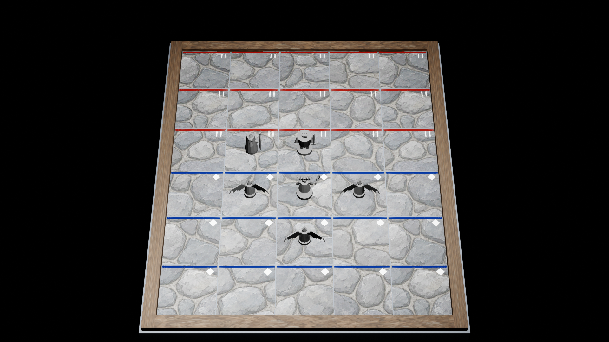

# ART-005 · проба поверхности и света Cobble City

Статус на 2026-09-27: **in_progress, технический и редакторный образец**. Направление B · Painted Miniature выбрано в [ART-002](../ART-002/README.md), но этот более ранний UE-кадр ещё не воплощает его материалы. Это не финальная доска и не закрытие GD-058. Камера/палитра, HUD, мультизоны и packaged-приёмка открыты.

**Дополнение 2026-09-28:** [самоприёмка камня v3/v4](stone-v4-self-acceptance-2026-09-28.md) выбрала более тихий тёмный v4 как рабочий BaseColor для следующего прохода. [UE K1 v4](stone-v4-combined-k1-editor-2026-09-28.png) снят в копии совместной сцены с Medusa и маркерами. Это не приёмка готового материала, ART-005 или GD-058: шов дерева, состав карт, HUD, другие схемы света и игровой K1/K2/K3 остаются открыты.

[Следующая самоприёмка деревянной рамы](wood-frame-review-2026-09-28.md) исправила продольное направление UV на четырёх планках и выбрала более тёмный BaseColor как кандидат. [Совместный K1](stone-woodPaint-combined-k1-editor-2026-09-28.png) и [близкий угол](stone-woodPaint-combined-wood-detail-editor-2026-09-28.png) сняты в отдельном ART005G. Поперечный рисунок ушёл, но торцевые соединения углов ещё требуют оформления; итоговый ART-005/GD-058 остаётся открытым.

[Отдельная самоприёмка угловых накладок ART005H](corner-bracket-review-2026-09-28.md) закрыла видимый торцевой стык **на этой редакторной пробе**: четыре модульные железные детали лежат на рамке, не перекрывая клетки. Проверены [K1](stone-corner-combined-k1-editor-2026-09-28.png), [крупный угол](stone-corner-combined-wood-detail-editor-2026-09-28.png), повторный импорт и загрузка уровня. Материал/заклёпки ещё черновые; ART-005 и GD-058 не приняты.

[ART005I сравнивает два условия света](lighting-stress-review-2026-09-28.md) на той же геометрии и камере: зелёно-янтарное и сине-индиговое. Исправленные [forest-like](stone-forestProbe-combined-k1-editor-2026-09-28.png) и [paddock-like](stone-paddockProbe-combined-k1-editor-2026-09-28.png) K1 сохраняют отделение клеток и зонных линий на проверенных участках. Это стресс-тест текущих материалов, **не** реконструкция двух игровых карт, утверждение световых схем или приёмка GD-058.

**После приёмочного ревью:** в отдельной [Blender-пробе B atlas v1](../../../../blender/ASSET-BOARD-COBBLE-001/variants/B-atlas-v1/README.md) один новый stone diffuse нанесён на поле целиком; все 30 плиток получили уникальные UV-области. [Обзорный рендер](../../../../blender/ASSET-BOARD-COBBLE-001/variants/B-atlas-v1/board-surface-k1-atlas-B-v1.png) убирает наиболее очевидный повтор камня. [Отдельный FBX](../../../../blender/ASSET-BOARD-COBBLE-001/variants/B-atlas-v1/export/SM_ART005_BoardCobbleAtlasB_v1.fbx) проверен повторным импортом в Blender: 35 частей, 1020 полигонов, тот же общий габарит, что у старой пробы. Исходный UE-уровень и его кадр ниже не менялись. Позднее кандидат [технически импортирован в отдельный UE-уровень](../../../../blender/ASSET-BOARD-COBBLE-001/variants/B-atlas-v1/ue-art-review-2026-09-27.md); повтор камня исчез и там, но K1 ещё не выдерживает художественную приёмку. Подходящих N/ORM и performance-проверки нет, поэтому [вердикт GD-058](../GD-058/acceptance-review-2026-09-27.md) остаётся отрицательным. Генерация нового old-wood была отвергнута после проверки шва; детали — в отчёте варианта.

[Отдельный Blender-кадр с шестью серыми блок-аутами](../../../../blender/ASSET-BOARD-COBBLE-001/variants/B-atlas-v1/board-six-figures-k1-atlas-B-v1.png) проверяет новый atlas вместе с составом ART-003. Фигурки и временные номера Harpy различимы на 1280×720, но таблички частично накрывают крылья. Это не UE K1: игровой зонный слой, выделение и HUD ещё не добавлены.

[Проба B-atlas с нейтральным комплектом маркеров](../../../../blender/ASSET-MARKERS-001/preview/markers-on-board-k1-v1.png) проверяет формы кольца выбора, прицела и статусной стелы в обзорной Blender-камере. [Комплект](../../../../blender/ASSET-MARKERS-001/README.md) имеет отдельные FBX и прошёл Blender roundtrip; новый слой не интегрирован с `boardState`, HUD или UE и не закрывает ART-005.
[Технический импорт семи маркеров в UE](../../../../blender/ASSET-MARKERS-001/ue-import-report.json) прошёл в отдельной папке `ArtTests/ARTMarkers`; [редакторный hit-test прицела](../../../../blender/ASSET-MARKERS-001/ue-hit-report.json) дал 9/9 ожидаемых результатов. В уровне ART-005 маркеры ещё не размещены и не связаны с состояниями партии; это не меняет статус доски.

[Совместный UE K1: B-атлас, Medusa и три маркера](combined-k1-editor-markers-v2-2026-09-27.png) снят в отдельном `ART005C`, с теми же шестью позициями и временными метками зон. [Самоприёмка](combined-acceptance-2026-09-27.md) подтверждает техническую компоновку; она выявила, что исходные тёмные кольца теряются на камне, а поднятая стела без иконки не объясняет состояние. Контрастные материалы колец пока только проба. Этот уровень не связан с игровым `boardState` и не закрывает ART-004/005 или GD-058.

## Открыть результат

- [Кадр K1 в Unreal Editor, 1920×1080](../../../../blender/ASSET-BOARD-COBBLE-001/preview/ue-art005-cobble-k1.png): материал, шесть серых блок-аутов ART-003, 30 клеток и обзорные метки двух зон. Цвет линий и форма меток — **временный способ проверки**; не утверждённый игровой HUD.
- [B-atlas K1 в Unreal Editor](../../../../blender/ASSET-BOARD-COBBLE-001/variants/B-atlas-v1/ue-art005b-k1-toned.png) и [акт самоприёмки](../../../../blender/ASSET-BOARD-COBBLE-001/variants/B-atlas-v1/ue-art-review-2026-09-27.md): повтор покрытия устранён, но светлые каменные пятна и недоработанные фигурки всё ещё мешают принятому иерархическому чтению сцены.
- [Кадр покрытия в Blender](../../../../blender/ASSET-BOARD-COBBLE-001/preview/board-surface-k1-blender.png), [редактируемый .blend](../../../../blender/ASSET-BOARD-COBBLE-001/cobble-city-probe.blend), [FBX](../../../../blender/ASSET-BOARD-COBBLE-001/export/SM_ART005_BoardCobbleProbe.fbx).
- [Отчёт Blender](../../../../blender/ASSET-BOARD-COBBLE-001/build-report.json), [манифест экспорта](../../../../blender/ASSET-BOARD-COBBLE-001/export/export-manifest.json), [отчёт импорта UE](../../../../blender/ASSET-BOARD-COBBLE-001/ue-import-report.json), [тестовый уровень](../../../../unreal/Unmatched/Content/ArtTests/ART005/L_ART005_CobbleSurfaceProbe.umap).



## Что сделано и откуда взяты данные

Геометрия Blender содержит **30 неглубоких каменных плиток**, четыре части деревянной рамы и нижний каменный блок. Одна клетка — 100×100 uu по [S04 runtime-контракту](../S04/board-contract.json); общий габарит импортированного меша 656×556×36 uu до поворота актора, затем длинная сторона совпадает с шестью рядами. Неровность поверхности не выступает над игровой плоскостью Z=0 и составляет не более 1,2 uu в этой пробе. Декоративный меш отключён от коллизии. Его 35 исходных частей объединены в UE в один static mesh с тремя материалами: камень, дерево, нижний блок.

В уровне UE отдельно созданы **30 точных невидимых областей выбора** из `cells[]`. Три центра проверены явно: `0:0 = (−200, −250)`, `4:5 = (200, 250)`, `1:0 = (−100, −250)` uu. Это только редакторная геометрическая проба; обработчик клика и живая синхронизация с `boardState` здесь не подключены. Синие/красные линии и ромбы/двойные штрихи также созданы отдельно по `cells[].zones` из S04: 15 blue и 15 red, без мультизон. Цвет не является единственным признаком в **этой пробе**, но слепая проверка доступности и контраст с итоговым HUD ещё не выполнены.

Использованы уже существующие [D/N/ORM-карты cobblestone и old-wood](../../../../art/imagegen/mvp-v1/materials/export/) в размере 1024². В UE нормали импортированы как `TC_NORMALMAP`, `sRGB=false`, без дополнительного переворота зелёного канала; ORM — `TC_MASKS`, `sRGB=false`. На финальном прогоне обе материальные схемы компилируются без fallback. Эти N/ORM вычислены из яркости исходной картинки, не запечены с геометрии ([оговорки пакета](../../../../art/imagegen/mvp-v1/PRODUCTION-NOTES.md)). Дерево не повторяется по длине борта: на исходной карте есть незакрытый шов при тайлинге. Камень на K1 заметно повторяет один и тот же рисунок и конкурирует с миниатюрами; UV плиток переиспользуют области одной картинки, то есть финальное требование уникальной UV-развёртки ещё не выполнено. Следующий художественный проход должен переработать покрытие в выбранном языке B; текущий материал не принят.

Камера FOV 35° и её положение, ровный холодный key и локальный тёплый фонарь — **параметры обзорного стенда**, не утверждённый итог D-02. Первый рендер оказался слишком тёмным вдали; заполняющий свет добавлен, локальный фонарь ослаблен, после чего получен вложенный кадр. Это не FPS-замер. Сцена снята в редакторе с `t.MaxFPS 30`, а не в packaged Development при целевых 1080p/60 FPS.

## Разные поля и световые секции

Существующие изображения полей показывают **разные схемы освещения и окрашенные области**. [ART-002](../ART-002/README.md) сохраняет миниатюры админ-каталога, ранний двухкартный эскиз и листы A/B/C по полноразмерным референсам Sherwood Forest и T. Rex Paddock. Эта ART-005-проба относится только к **Cobble City** и её зафиксированному S04 `boardState`. Её blue/red полосы обозначают **игровые зоны, а не световые секции** и не являются универсальной картой света для Yukon, Sherwood, Venice, Hell's Kitchen или других полей. Для каждого следующего поля понадобятся собственные изображение, геометрия/материал, схема локального света и достоверный `boardState.cells[].zones`. Художественный свет можно менять по карте; логика зоны и hit surface остаётся независимым игровым слоем. На картах с несколькими или пересекающимися областями требуется отдельный тестовый контракт и решение по отображению мультизоны ([AD-OPEN-21](../../17-art-production-spec.md)).

## Что проверено и что остаётся

Сквозной прогон [run-art005-ue.ps1](../../../../tools/art/run-art005-ue.ps1) прошёл: Blender 5.2.2 LTS → FBX с `UM_FBX_v1` → импорт UE 5.8.2 → отдельный уровень `/Game/ArtTests/ART005` → K1-кадр. Проверены 30 клеток, 6 серых фигур, 3 слота материалов, отсутствие коллизии у декоративного меша, 30 независимых областей выбора, 15/15 зон, размеры и параметры текстур. Исходные карты/правила боя не менялись. Для воспроизведения из корня проекта:

```powershell
& tools/art/run-art005-ue.ps1
```

Открыто перед закрытием ART-005: GD-058; приведение покрытия к выбранному B с устранением повторяемости камня/шва дерева; K2/K3 с HUD, выделением и эффектом атаки; проверка зон в grayscale/deuteranopia внешним зрителем; packaged 1080p/60 FPS на D-07. [Сравнительные листы света по двум реальным картам](../ART-002/README.md#привязка-следующего-цветового-прохода-к-готовым-картам) помогают проверить общее арт-направление; они не меняют границы Cobble City и не расширяют геометрию этой ART-005-пробы. Достоверная финальная физическая топология Cobble City также не следует из одного S04 runtime-контракта: он прямо ограничен текущей серверной фикстурой.
