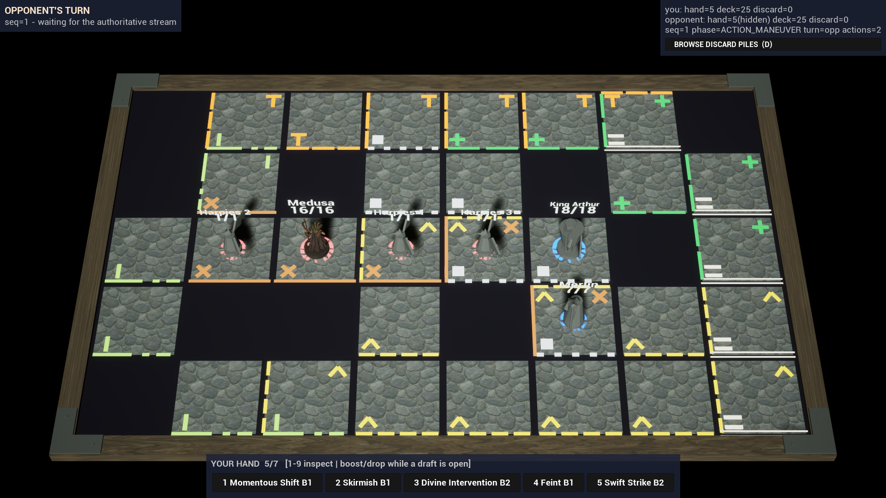
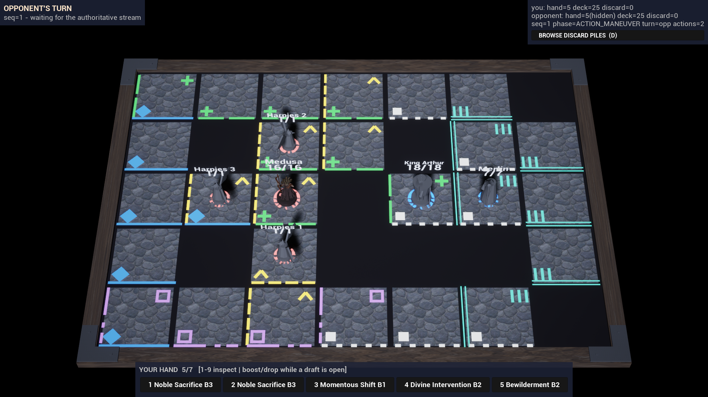

# ART-005 · этап 3 T3.2 «Арт 3: данные и код карт» — акт, 2026-09-28

**Статус:** измерено и технически проверено. Художественной приёмки нет. Доски Sherwood Forest и T. Rex Paddock — **арт-фикстуры, не правила** (вариант (а) плана этапа 3). Профили света — **предложено** (пробы ART-005I, перенесённые на координаты доски). K1/K3 на трёх досках с серыми/deuteranopia-производными — задача T5.2, MI/глифы зон как контент UE — T4.2.

Рабочая копия: арт-worktree `C:/Users/ren/.codex/worktrees/art-foundation/unmached` (база `c289737b`, дерево = `fix/admin-panel`). Главный живой редактор (PID 19540) не затронут: `UnrealEditor-Unmatched.dll` главного checkout до и после всех сборок `6a975ebd…59ff`.

## 1. Что сделано

| Часть | Файлы | Суть |
| --- | --- | --- |
| Фикстуры карт | [`tools/art/art_board_fixtures.py`](../../../../tools/art/art_board_fixtures.py), [`backend/prisma/fixtures/art-boards/*.art-fixture.json`](../../../../backend/prisma/fixtures/art-boards/), тесты [`tools/art/tests/test_art_board_fixtures.py`](../../../../tools/art/tests/test_art_board_fixtures.py) | Сеточное приближение реальной карты из `scraped-data/api/maps.json` (gitignored, только главный checkout; sha256 `476eb21b…cd6e`). Каждое реальное поле — одна клетка с **реальными ключами зон** этого поля; мультизонное поле сохраняет все зоны. Остальные клетки — `isObstacle` (не поле карты). Id досок детерминированы (`c` + 24 hex от sha256 ключа), пересев даёт те же id. Изображения карт — только sha256 (из ART-002/PROMPTS.md), не скачиваются, не кукаются, не коммитятся. |
| Сид в изолированную БД | [`backend/prisma/seed-art-fixture-boards.ts`](../../../../backend/prisma/seed-art-fixture-boards.ts) | Пишет **только** в тестовую БД S09 (`127.0.0.1:55434`); основная dev-БД (5433) и любой другой адрес отвергаются до создания клиента. Upsert только по id фикстур; отказ, если таблица Board пуста (фикстура стала бы доской по умолчанию). `--dry-run` / `--apply` / `--verify`, отчёт JSON. |
| Данные арта досок | [`unreal/Unmatched/Config/ArtBoards/S08ArtBoardProfiles.json`](../../../../unreal/Unmatched/Config/ArtBoards/S08ArtBoardProfiles.json) (sha256 `a7cc5974…69fa`) | Палитра/штрих/глиф **по ключу зоны** (11 ключей + fallback), три профиля света, три профиля досок (выбор по id строки Board, иначе по W×H + точному набору ключей зон; ожидаемые числа клеток/зон/мультизон/препятствий). В пак попадает через `RuntimeDependencies` (UFS) в [`Unmatched.Build.cs`](../../../../unreal/Unmatched/Source/Unmatched/Unmatched.Build.cs). |
| Код доски | [`S08BoardArt.h/.cpp`](../../../../unreal/Unmatched/Source/Unmatched/S08/S08BoardArt.h) (чистые функции), [`S08BoardActor.h/.cpp`](../../../../unreal/Unmatched/Source/Unmatched/S08/S08BoardActor.cpp), 2 строки в `S08FlowGameMode.cpp` | `SupportsCobbleArt` (только 5×6 blue/red) заменён данными. Любая сетка из `boardState`: N зон, мультизоны (зона i — штрих на стороне i: ближняя/левая/дальняя/правая; глиф в слоте i), препятствия. Поверхность `cobble-5x6-mesh` (плита ART-005, без изменений) или `tiles` (освещённая каменная плита на каждую проходимую клетку, тёмная пустота на месте препятствия, деревянная рама, уголки по габариту W×H). Трассы: `ARTPREVIEW board profile=… match=boardId|signature`, `board active … expectOk=`, `board zone key=…`, `board multizone cells=… zonesListed=… zonesMarked=…`, `lights applied … budgetOk=`. Строки ART-005 Cobble (`Cobble active 5x6 zones=30 blue=15 red=15 blueMarks=15 redMarks=45`, `Cobble probe lights key=4.5 fill=700 warm=85`) сохранены побайтно. |
| Автотесты | [`S08BoardArtTests.cpp`](../../../../unreal/Unmatched/Source/Unmatched/S08/S08BoardArtTests.cpp) | `Unmatched.S08.BoardArt.*` (6): данные в поставке, парсер (бюджет света, неизвестные штрих/глиф/цвет/материал глифа, схема), выбор профиля, точная геометрия и свет Cobble, мультизоны (в т.ч. 5 зон и неизвестные ключи), обе закоммиченные фикстуры через `FS08BoardModel::Decode`. |
| Скрипты | [`tools/s08/run-phase2-demo.ps1`](../../../../tools/s08/run-phase2-demo.ps1), [`tools/s09/run-combat-demo.ps1`](../../../../tools/s09/run-combat-demo.ps1), [`tools/art/art004_live_k2.py`](../../../../tools/art/art004_live_k2.py) | Реестр досок = тот же JSON клиента. Id не из реестра — явный отказ со списком. Гейт `BOARD WxH cells` по регистрации (иначе ошибка с увиденной строкой), профиль по **этому** id, `expectOk=1`, число клеток каждой зоны, `zonesListed = zonesMarked`, свет в бюджете. В `run-combat-demo` перенесены `-ArtPreviewBoardId` (с проверкой строки игры через API), `-ArtPreviewMedusaVariant`, `-ArtPreviewSelectOwnHero`, `-ArtPreviewFocusZoom`, `-ArtPreviewShotAfter`; ранний отказ при отсутствующем exe (раньше скрипт создавал `<каталог exe>\Unmatched\Saved\Config` где угодно). |

До T3.2 в C++ уже были `-ArtPreviewBoardId` (T1.1, `S08FlowController`), `-ArtPreviewSelectOwnHero`/`-ArtPreviewFocusZoom` (T1.1/T2.2, `S08FlowGameMode`) и `-ArtPreviewMedusaVariant` (T1.1). В `run-combat-demo.ps1` не было ни одного из них; перенесены только флаги скрипта, код клиента для них не менялся.

## 2. Фикстуры

Метод: центры полей берутся из `svgGroup` зон (`<circle>` — поле одной зоны; половина круга / треть круга `<path>` — доля зоны в мультизонном поле; центр — середина диаметра или вершина клина; куски в пределах 20 px — одно поле). Число полей совпадает с `spacesCount` карты. Затем оптимальное назначение (венгерский алгоритм) центров полей на решётку W×H (W 6–10, H 4–6); из решёток, где поля связны по 4 соседям (правило ходов игры), берётся решётка с наименьшим максимальным смещением. Смежность, дистанции и зоны реального графа карты **не воспроизводятся**.

| Доска | id | W×H | поля / препятствия | мультизон (из них тройных) | ключи зон (реальные) | макс. смещение |
| --- | --- | --- | --- | --- | --- | --- |
| ART FIXTURE · Sherwood Forest | `c37a3b6643a96c45fa71f10de` | 8×5 | 30 / 10 | 14 (3) | gray, light-gray, green, brown, light-green, orange, yellow | 0,59 клетки |
| ART FIXTURE · T. Rex Paddock | `c70e9f624617750c2a2b856fd` | 7×5 | 26 / 9 | 13 (0) | blue, gray, green, blue-green, purple, yellow | 0,55 клетки |

Sha256 фикстур: Sherwood `3d8f1d66…0d38`, T. Rex `9d19f5ea…8204`. `python tools/art/art_board_fixtures.py check --maps <main>/scraped-data/api/maps.json`: обе PASS, профили PASS, **повторная сборка из maps.json побайтно совпадает**. Сид: [dry-run](art-boards-t32/seed/seed-dry-run.json) → [apply](art-boards-t32/seed/seed-apply.json) → [повтор apply](art-boards-t32/seed/seed-apply-repeat.json) (existedBefore=true, идемпотентно) → [verify](art-boards-t32/seed/seed-verify.json): cells побайтно, `features.artFixture=true`, `features.fixtureSha256` совпадает, `imageUrl=null`; доска по умолчанию (`cmuhgs4b…` Cobble City) не изменилась; Board 42 → 44 строки. Попытки с `DATABASE_URL` на 5433 и на чужой хост отвергнуты (код 1).

## 3. Свет как данные

Бюджет каждого профиля: ровно 1 directional с тенью + не больше 6 point без теней; проверяется при загрузке (профиль вне бюджета → документ невалиден → серая доска) и в `art_board_fixtures.py check`. Секции света ≠ игровые зоны: для каждого не-fill point-света «секция» (клетки в пределах половины радиуса) не совпадает ни с одной зоной — максимальный Jaccard 0,27 (Sherwood) и 0,29 (T. Rex) при пороге 0,5.

| Профиль | Источник | directional | point (роль) |
| --- | --- | --- | --- |
| `cobble-probe` | ART-005 проба, прежний код без изменений | key 4,5 | fill 700, warm 85 |
| `forest-probe` | ART-005I forest (редакторная проба на Cobble), тёплые пятна перенесены в координаты доски | key 4,0 зелёный | fill 950, warm-pool-a 150, warm-pool-b 110 (тёплые), canopy-shade 80 (холодное) |
| `paddock-probe` | ART-005I paddock | key 3,5 сине-индиговый | fill 1150, warm-practical 130 (тёплое), cyan-rim 85, indigo-pool 70 (холодные) |

Все три профиля — «предложено». Утверждённым светом Sherwood/T. Rex они не являются (ART-005I прямо это оговаривает).

## 4. Сборки и тесты

- UnmatchedEditor арт-worktree: E1–E5 `Result: Succeeded`, флаги `-WaitMutex -NoXGE -NoUBA -MaxParallelActions=2 -NoHotReloadFromIDE` (мьютекс Live Coding главного редактора есть; собственная DLL арт-worktree, `WITH_LIVE_CODING 1`). Главная DLL не изменилась. Записи — [build/](art-boards-t32/build/).
- Игровой target `Unmatched` без `-NoLiveCoding`: G1–G3 Succeeded, `WITH_LIVE_CODING 1`. Итог G3 — exe sha256 `2b2a8905…6c76`. После G3/E5 в исходниках изменён только комментарий у `bTileArtReady` в `S08BoardActor.h`; код не менялся. `package-client.ps1 -SkipBuild` P1–P3: BUILD SUCCESSFUL, staged inner exe = Binaries exe, в индексе `Unmatched-Windows.pak` есть `S08ArtBoardProfiles.json`, кандидаты v2/v3 в DevelopmentAssetRegistry.
- Автотесты (UnrealEditor-Cmd арт-worktree, `-nullrhi`, отдельный процесс на группу): на итоговой DLL E5 (`ea6a4854…`) `Unmatched.S08` 61/61 (в том числе `Unmatched.S08.BoardArt` 6/6), `Unmatched.S09` 44/44, `Unmatched.S10` 50/50 — все 155 тестов проекта. Промежуточный прогон `boardart-1` (DLL E1) нашёл ошибку в самом тесте: в минимальном документе не было `zoneCellCounts`; тест исправлен, код не менялся. Логи и JSON — [tests/](art-boards-t32/tests/).
- Python: `tools/art/tests` 57/57 (20 новых), pyflakes чисто; `tsc --noEmit` сида без ошибок; PS-парсер обоих демо-скриптов 0 ошибок, `-ProbeCleanupOnly` 6/6; отказы скриптов и сида проверены офлайн (slug, незарегистрированный cuid, флаги без `-ArtPreview`, FocusZoom без SelectOwnHero, ShotAfter < 4, RunSeconds < ShotAfter+10, `DATABASE_URL` на 5433 и на чужой хост) — [build/script-guards.txt](art-boards-t32/build/script-guards.txt).
- `validate_registry.py` (главный checkout): PASS; реестр не менялся. `snapshot_baseline.py check` (главный checkout): 62 проверено, 0 различий.

## 5. Живой смок: пара packaged-клиентов по 30 FPS, один бэкенд :3120

`python tools/art/art004_live_k2.py run --board-id <id> --build-record build/G3-build.json --package-record build/P3-package.json` (`run-phase2-demo.ps1 -ArtPreviewBoardId`, 50 с, снимок на 36 с, CSV-профилировщик), бэкенд арт-worktree PID 17752 на контейнерах `codex-s09-*`. Все комнаты ABORTED (verified).

| Доска | прогон | трасса хоста и присоединившегося | FPS (хост/джойнер), p95 кадра | GPU пары, среднее / p95 |
| --- | --- | --- | --- | --- |
| Cobble 5×6 | [run-20260928-193615](art-boards-t32/cobble-5x6/run-20260928-193615/) | `BOARD 5x6`, `profile=cobble-city match=boardId`, `expectOk=1`, прежние строки ART-005 без изменений, `lights applied … points=2 budgetOk=1` | 29,91 / 29,93; 33,33 мс | 38,5 % / 41 % |
| Sherwood 8×5 | [run-20260928-193722](art-boards-t32/sherwood-forest-8x5/run-20260928-193722/) | `BOARD 8x5`, `profile=sherwood-forest-art-fixture match=boardId surface=tiles`, `cells=40 zoneCells=30 multizone=14 triple=3 obstacles=10 zoneKeys=7 … expectOk=1`, `multizone cells=14 zonesListed=31 zonesMarked=31`, `lights applied profile=forest-probe … points=4 pointShadows=0 budgetOk=1` | 29,87 / 29,89; 33,33 мс | 38,4 % / 42 % |
| T. Rex 7×5 | [run-20260928-193829](art-boards-t32/t-rex-paddock-7x5/run-20260928-193829/) | `BOARD 7x5`, `profile=t-rex-paddock-art-fixture match=boardId surface=tiles`, `cells=35 zoneCells=26 multizone=13 obstacles=9 zoneKeys=6 … expectOk=1`, `zonesListed=26 zonesMarked=26`, `lights applied profile=paddock-probe … points=4 budgetOk=1` | 29,88 / 29,91; 33,33 мс | 38,8 % / 42 % |

Шесть кадров 1920×1080: artcheck pass; [`classify_evidence --require packaged-live --strict`](art-boards-t32/classify-packaged-live.json) — 6/6 `packaged-live strict` (`BOARD 5x6/8x5/7x5`, меш `SK_Medusa_FaceNeck_v2Candidate`); негативная проверка (редакторный кадр ART-005) — код 3. Манифесты всех прогонов перепроверены: sha256 совпадают, лишних файлов нет. Производительность — «измерено» на текущем ПК (RTX 4090), не D-07; ACC-022 не заявляется. GPU пары ≈ 38–39 % при ≈ 37 % в простое у T1.1 (редактор 19540 и Blender 9876/9877 работали) — это не замер улучшения и не бюджет.

**Бой (`run-combat-demo.ps1`, перенесённые флаги):**
- Cobble 5×6, `-ArtPreviewBoardId cmuhgs4b… -ArtPreviewMedusaVariant face-neck-v2 -ArtPreviewSelectOwnHero -ArtPreviewShotAfter 30 -ArtPreviewFocusZoom 1.6`: прошёл и опубликован — [combat-20260928-194340](art-boards-t32/combat-cobble-5x6/combat-20260928-194340/). Строка игры проверена по API, `BOARD 5x6`, профиль и свет, `INPUT select src=flag`, `CAMERA focus src=flag … zoom=1.60`; `check_art003_combat_evidence`: pass, 17 CUE = 17 уникальных чисел урона у обоих клиентов, иконка цели привязана и снята; seq 141/141.
- T. Rex 7×5 с теми же флагами: **не прошёл** гейт боя ([attempt.json](art-boards-t32/combat-trex-7x5-attempt/attempt.json), трассы с вырезанным кодом комнаты). Флаги сработали (проверка строки игры, `BOARD 7x5`, профиль, variant, выбор, зум), но боя не было: автоплан S09 делает жадный шаг на одну клетку, а у Medusa на старте (2,2) все четыре соседа заняты — препятствие (3,2) и три свои Гарпии. Обе колоды кончились, игра закончилась истощением (GAME_OVER, FINISHED). Это риск плана «бой на новых сетках упрётся в правила»; решение — в T5.2 (см. «Открыто»).

## 6. Находка по ходу: материалы ART-005 без instancing usage

Первый packaged-смок (G1, заменён) показал плоские серые плитки. Клиентский лог: `Material … M_ART005_Wood_Probe missing usage flag InstancedStaticMeshes! Default Material will be used in game`, то же для `Stone_Probe`, `Undertray_Probe`. На ISM в cooked-сборке у этих материалов нет шейдеров, и рисуется материал по умолчанию. Исправление в коде T3.2: поверхность `tiles` строится из обычных `UStaticMeshComponent` (плита на клетку, 4 бруса рамы), а штрихи и глифы новых досок идут через `M_S08_Solid` с `Tint` из данных, если у авторского материала нет usage. Итоговые прогоны (G3): предупреждений по пробным материалам нет.

**Это касается и Cobble до T3.2.** Те же предупреждения есть в логах T2.2 (`hud-input-t22/k2-1p6/…/client-logs`): `M_ART005_BlueSection_Review`, `M_ART005_ZoneGlyph_Review` (default material), `RedSection_Review`, `IronCorner_Review`. На packaged-кадрах Cobble синие/красные линии зон и ромбы рисуются материалом по умолчанию, не синим и красным. В редакторе флаг ставится на лету, поэтому редакторные кадры ART-005 этого не показывали. Профиль `cobble-city` намеренно сохраняет прежнее поведение (`glyphs: review`, авторские материалы): доказательства T1.1/T2.2 остаются сопоставимыми. Нужно исправить контент: `bUsedWithInstancedStaticMeshes` у материалов ART-005/ART005H и повторить K1 Cobble (T4.2 / T5.2).

## 7. Ограничения и открыто

1. Арт-фикстуры — не правила. Смежность и дистанции реальных графов не воспроизведены, препятствия — «не поле». Решение пользователя о представлении карт (вопрос 5 плана, AD-OPEN-21) остаётся открытым.
2. Профили света и палитра зон — «предложено». Контраст зон в сером/deuteranopia и внешний зритель — T5.2/T6. У T. Rex есть пара «квадрат (gray) / контурный квадрат (purple)»: формы различаются, но при K1 их надо проверить отдельно.
3. K3 на фикстурах: автоплан S09 (`S08FlowGameMode.cpp`, жадный шаг, трасса `S09AUTO approach: no improving legal step`) не обходит своих бойцов и препятствия. Для T5.2 нужен многошаговый подход (`FS08BoardModel::BuildManeuverPath` к клетке рядом с ближайшим врагом) или стартовые клетки фикстуры, выбранные под бой. В T3.2 это не менялось.
4. После интеграции в `fix/admin-panel` у главного редактора 19540 устаревшая DLL: изменилась раскладка UCLASS `AS08BoardActor` (новые UPROPERTY), добавились `S08BoardArt.cpp` и `RuntimeDependencies`. Нужны пересборка и перезапуск в окне пользователя (как после T2.2).
5. Заменённые прогоны (G1 — поверхность default material; G2 — светлая пустота и L-образный глиф `chevron`, который путался с L-метками достижимых клеток) перенесены в `C:/tmp/t32/superseded-G1|G2` и в git не входят. Их сборочные записи G1/G2/P1/P2 оставлены в `build/` как история.

## 8. Процессы

Docker Desktop (PID 23264) я запускал сам. Контейнеры `codex-s09-postgres/redis` и Docker Desktop остановлены (`docker stop`, `docker desktop stop`), stale-сокеты отодвинуты в `*.stale-20260928-f`. Бэкенд :3120 PID 17752 остановлен по PID. Lock-файлы `C:/tmp/unmatched-package.lock` и `C:/tmp/unmatched-gpu.lock` удалены. Клиентов Unmatched и UnrealEditor-Cmd после работы нет. Редактор 19540, Blender 33220/25816 и dev-сервер :5480 не трогались.
