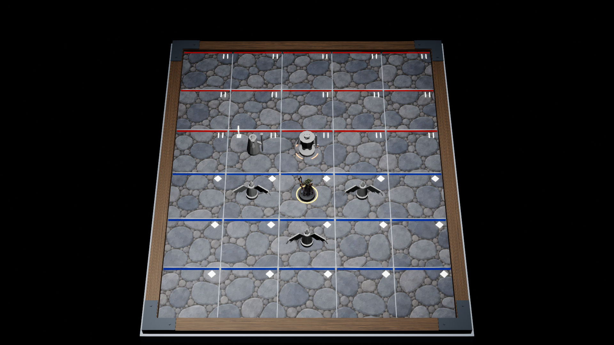

# ART-005H · самоприёмка угловых соединений рамы, 2026-09-28

**Вердикт:** четыре модульные накладки **приняты как рабочее решение видимого торцевого стыка** на редакторном образце Cobble City 5×6. Это приёмка геометрии и компоновки одного элемента, **не** готовой рамы, ART-005 или GD-058. Размеры, цвет железа и параметры материала остаются кандидатами до контрольной сцены. Предыдущий [акт рамы](wood-frame-review-2026-09-28.md) описывает состояние *до* этой пробы.

| Проверка | Доказательство | Вывод |
|---|---|---|
| Источник и экспорт | [Blender/FBX отчёт](../../../../blender/ASSET-BOARD-COBBLE-001/variants/corner-bracket-v1/build-report.json), [сборщик](../../../../blender/_tools/build_art005_corner_bracket.py), [повторное открытие](../../../../blender/_tools/verify_art005_corner_bracket.py) | Один редактируемый `.blend`, один FBX по `UM_FBX_v1`, масштаб после патча `1.0`. При повторном открытии совпали SHA-256, 44 вершины, 76 треугольников, один слот, материал и отсутствие игровой коллизии. Меш накладки отдельный; 35 частей и три слота основной доски не менялись. |
| UE-импорт и четыре угла | [Отчёт ART005H](corner-bracket-ue-report.json), [скрипт сцены](../../../../tools/art/art005h_corner_scene.py) | Импортированная накладка `55×55×3,6 uu`, один раздел/слот. После сохранения и повторной загрузки уровня четыре актора находятся в расчётных углах и ориентациях, все `NoCollision`. Сохранились 30 hit surfaces, 15 blue/15 red обзорных меток, одна Medusa, пять серых фигур и три маркера. Blue/red — игровые зоны S04, **не** световые секции поля. UE commandlet завершился с `Python script executed successfully`, 0 ошибок/предупреждений. |
| Чтение K1 и стыка | [Предыдущий K1](stone-woodPaint-combined-k1-editor-2026-09-28.png), [новый K1](stone-corner-combined-k1-editor-2026-09-28.png), [предыдущий угол](stone-woodPaint-combined-wood-detail-editor-2026-09-28.png), [новый угол](stone-corner-combined-wood-detail-editor-2026-09-28.png) | При одинаковой редакторной камере и свете четыре тёмные L-накладки закрывают торцы дерева и остаются на рамке. Первый вариант ориентации был **отклонён**: одно плечо заходило на угловую клетку. После разворота всех четырёх повторный K1 и крупный кадр визуально подтверждают, что камень и зонная линия не закрыты. Пробный железный материал затем приглушён до `BaseColor (0,032; 0,038; 0,045)` в линейном пространстве, `metallic 0,25`, `roughness 0,86`; это **не утверждённая палитра**. |
| Сравнение пикселей | Те же PNG, `RGB`, порог максимальной разницы каналов `>20/255` | Из `20 559` изменившихся пикселей K1 `20 539` лежат в четырёх прямоугольниках углов; снаружи — `20`. В центральной области поля `[x=575..1349, y=190..939]` изменились `6` из `581 250` пикселей. На контрольном участке камня крупного кадра `[x=0..799, y=0..389]` — `0` из `312 000`. Это проверка именно пары фиксированных редакторных кадров, а не универсальная гарантия отсутствия перекрытия при любой камере. |

На K1 накладки меньше фигур и не конкурируют с выбором Medusa. На близком кадре головки двух заклёпок пока читаются тёмными полумесяцами, а железо выглядит гладким. Перед финальной приёмкой рамы проверить форму головок, фаску/край и полноценный материал; плоская проба допустима только для решения стыка.

**Остаётся открытым:** материал и точный цвет рамы при свете Cobble City и отдельных световых схемах других полей; решение по Normal/ORM; связь декоративной доски с живым `boardState`, HUD и едиными K1/K2/K3; читаемость зон в grayscale/deuteranopia; актуальная физическая топология за пределами S04; packaged Development 1080p/60 на D-07. Накладки не подменяют игровой hit-test и не закрывают GD-058. Анимации не продолжались: для них требуется отдельно выбранный пайплайн с видео-референсами.

Абсолютные пути для следующего агента:

- Акт: `C:/Users/ren/WebstormProjects/unmached/unmached/docs/game-design/evidence/ART-005/corner-bracket-review-2026-09-28.md`
- Blender: `C:/Users/ren/WebstormProjects/unmached/unmached/blender/ASSET-BOARD-COBBLE-001/variants/corner-bracket-v1/corner-bracket-v1.blend`
- FBX: `C:/Users/ren/WebstormProjects/unmached/unmached/blender/ASSET-BOARD-COBBLE-001/variants/corner-bracket-v1/export/SM_ART005_CornerBracket_v1.fbx`
- K1: `C:/Users/ren/WebstormProjects/unmached/unmached/docs/game-design/evidence/ART-005/stone-corner-combined-k1-editor-2026-09-28.png`
- Крупный угол: `C:/Users/ren/WebstormProjects/unmached/unmached/docs/game-design/evidence/ART-005/stone-corner-combined-wood-detail-editor-2026-09-28.png`
- UE-сцена: `C:/Users/ren/WebstormProjects/unmached/unmached/unreal/Unmatched/Content/ArtTests/ART005H/L_ART005H_CornerReview.umap`

