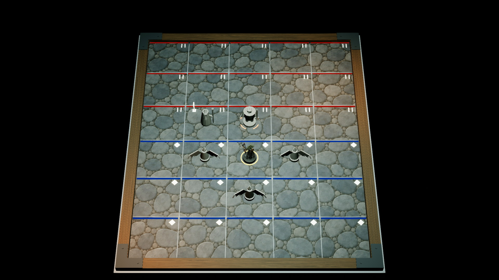
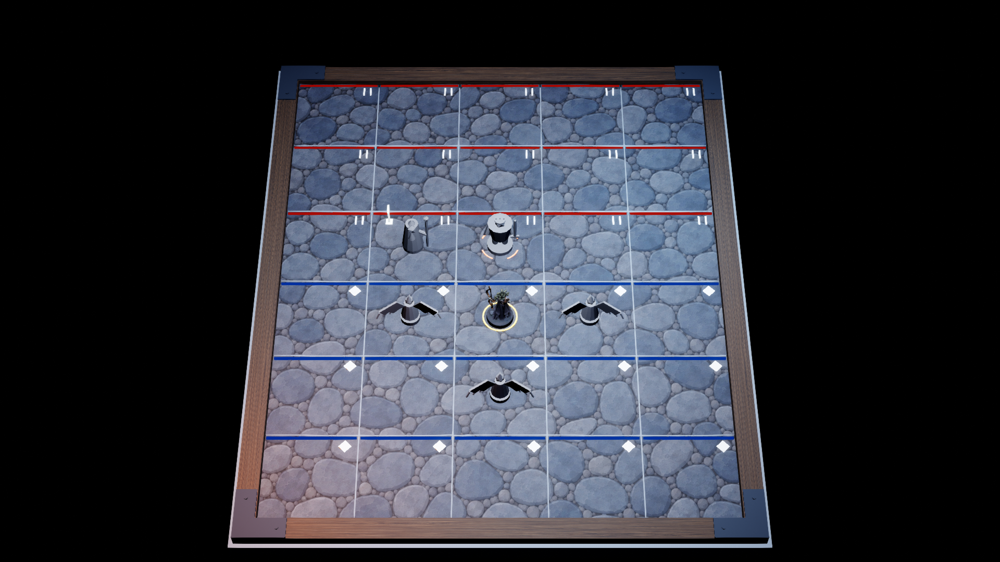

# ART-005I · самоприёмка двух условий света, 2026-09-28

**Вердикт:** два исправленных UE-профиля света **приняты как воспроизводимый стресс-тест материалов и K1-композиции**. Это **не** утверждённый свет Sherwood Forest или T. Rex Paddock, не их поверхности/топология и не закрытие ART-005/GD-058. Исходная Cobble-сцена ART005H сохранена отдельно.

[Концепт ART-002](../ART-002/lighting-real-map-conditions-concept.png) и [его происхождение](../ART-002/PROMPTS.md#свет-по-полноразмерным-референсам-двух-карт) задают только два разных цветовых условия: фильтрованную зеленью прохладу с тёплыми пятнами и сине-индиговую ночь с небольшим тёплым источником. Цветные сектора на изображениях реальных игровых полей относятся к **игровым зонам**, а не доказывают положение UE-светильников. Поэтому обе пробы ниже используют одну и ту же техническую Cobble City 5×6, а не выдают её за две другие карты.

| Проверка | Доказательство | Вывод |
|---|---|---|
| Изолированные уровни | [Сборщик профилей](../../../../tools/art/art005i_lighting_stress_scene.py), [UE-отчёт](lighting-stress-ue-report.json) | Два уровня ART005I дублируют ART005H. При неизменных мешах, материалах, позициях, 30 hit surfaces, 15/15 зонных метках, шести фигурах и четырёх углах меняются только три исходных источника света и добавляется один локальный без теней. После сохранения и повторной загрузки проверены числа акторов и интенсивности всех четырёх источников. Это **параметры проб**, не световой норматив. |
| Одинаковый K1 | [Базовый Cobble](stone-corner-combined-k1-editor-2026-09-28.png), [зелёно-янтарная проба](stone-forestProbe-combined-k1-editor-2026-09-28.png), [сине-индиговая проба](stone-paddockProbe-combined-k1-editor-2026-09-28.png), [скрипт кадра](../../../../tools/art/art005_stone_variant_capture.py) | Все 1920×1080, одна камера FOV 35° и отключённая автоэкспозиция. На обоих исправленных кадрах видны шесть фигур, границы клеток, белые маркеры, отдельные blue/red линии, стыки рамы. Локальные цветовые пятна отличаются, но не превращаются в разметку игровых зон. |
| Отвергнутый первый свет | Пробные кадры до исправления сохранены только в локальных логах `unreal/Unmatched/Artifacts/ART005I/`, в поставку не входят | Первый ночной профиль слишком насыщал доску синим. На одном фиксированном участке яркость красной линии/камня составляла примерно `40/50` из 255, внутри тёмного участка Medusa — около `4`. Этот вариант **отклонён**; повышен нейтральный заполняющий свет и уменьшена цветность. |
| Контроль яркости исправленного K1 | Те же три PNG; медиана RGB на участках 5×5 px, яркость `0,2126R + 0,7152G + 0,0722B` | В базовом/зелёном/ночном кадре красная линия против соседнего камня: `44,2/96,6`, `44,7/96,3`, `45,1/98,7`; синяя линия: `50,2/134,4`, `50,2/136,6`, `51,0/139,7`. Участок внутри Medusa: `20,9`, `18,8`, `19,3` против соседнего камня `142,7`, `146,3`, `153,5`. На этих точках границы не потеряли яркостное отделение, а силуэт остался контрастным. Это диагностические точки, **не** глобальный тест доступности и не утверждённый порог контраста. |

Тёмные детали Medusa и три Harpy на K1 по-прежнему требуют K2 и HUD-проверки; белые временные метки зон — не чистовая графика. Освещение не заменяет разделение `boardState.cells[].zones`, команды, выделения и боевых состояний. До художественной приёмки нужны настоящие сцены соответствующих полей с их данными, единые игровые K1/K2/K3, проверка grayscale/deuteranopia с внешним зрителем и packaged-замер на D-07. Дополнительный локальный свет этой пробы также нельзя переносить в игру без GPU-проверки.

Абсолютные пути для следующего агента:

- Акт: `C:/Users/ren/WebstormProjects/unmached/unmached/docs/game-design/evidence/ART-005/lighting-stress-review-2026-09-28.md`
- UE-отчёт: `C:/Users/ren/WebstormProjects/unmached/unmached/docs/game-design/evidence/ART-005/lighting-stress-ue-report.json`
- Forest-like K1: `C:/Users/ren/WebstormProjects/unmached/unmached/docs/game-design/evidence/ART-005/stone-forestProbe-combined-k1-editor-2026-09-28.png`
- Paddock-like K1: `C:/Users/ren/WebstormProjects/unmached/unmached/docs/game-design/evidence/ART-005/stone-paddockProbe-combined-k1-editor-2026-09-28.png`
- UE-сцены: `C:/Users/ren/WebstormProjects/unmached/unmached/unreal/Unmatched/Content/ArtTests/ART005I/`

