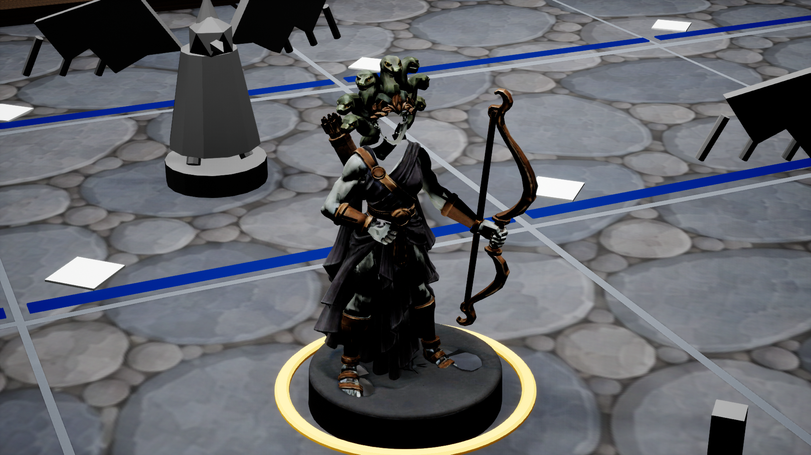

# ART-005 / ART-004 · самоприёмка крупного плана Medusa, 2026-09-28

**Вердикт: редакторная компоновочная проба принята как диагностика; игровой K2, ART-004/005 и GD-058 не приняты.** Это моё решение по кадрам, а не запрос на визуальное утверждение. Текущая модель уже убедительно показывает силуэт, лук и базу с подобранного ракурса, но лицо в UE не соответствует собственному Blender-превью и 2D-референсу. Причина расхождения ещё не доказана. Работу над анимацией этот акт не оценивает: она остановлена до пайплайна с видео-референсами.

## Что проверено

Скрипт [редакторного захвата](../../../../tools/art/art005_stone_variant_capture.py) снял статичную Medusa в изолированной совместной сцене ART005H. На основе той же геометрии и композиции затем сняты два уже существовавших световых стенда ART005I. Все четыре сохранённых кадра — 1920×1080, `SceneCapture2D`, FOV 35°, отключённая автоэкспозиция, `t.MaxFPS 30`; каждый запуск UE завершился кодом 0 и строкой `ART005_STONE_VARIANT_CAPTURE_COMPLETE`. Камера и свет — **параметры диагностики, не утверждённые параметры игрового K2**. Сцены не менялись; игровые HUD, zoom и выбор не подключены.

| Кадр | Наблюдение | Решение |
| --- | --- | --- |
| [Cobble, прежний близкий ракурс](stone-corner-combined-medusa-close-editor-2026-09-28.png) | Виден общий верхний силуэт, ткань и база. Лук почти в профиль и читается как прямой стержень; крупные серые блок-ауты входят в передний план. Лицо не читается как в референсе. | **Отклонён как K2.** |
| [Cobble, передний левый 3/4](stone-corner-combined-medusa-front-left-editor-2026-09-28.png) | Лук, тетива, кисть, плащ, бронзовые акценты, отдельная подставка и золотое кольцо одновременно видны. Лицо превращается в белую/тёмную маску без читаемых глаз и черт; семь голов нельзя надёжно пересчитать по кадру, они частично перекрывают друг друга. Серая статусная стела и тёмные блок-ауты отвлекают от модели. | **Лучший диагностический ракурс**, но **не принят как игровой K2**. |
| [Зелёно-янтарный свет, тот же 3/4](stone-forestProbe-combined-medusa-front-left-editor-2026-09-28.png) | Силуэт и лук сохраняются. Дефект чтения лица остаётся. | Стресс-проба пройдена как сравнение, K2 не принят. |
| [Сине-индиговый свет, тот же 3/4](stone-paddockProbe-combined-medusa-front-left-editor-2026-09-28.png) | Силуэт и лук сохраняются. Дефект чтения лица остаётся. | Стресс-проба пройдена как сравнение, K2 не принят. |

Дополнительно проверены ракурсы сверху и с правой/левой боковой стороны; они хуже совмещают лицо и лук либо превращают обзор в неигровой осмотр. Их пробные PNG не входят в поставку. Forest-like и paddock-like свет — только условия проверки текущей Cobble City, а не игровые сцены Sherwood Forest и T. Rex Paddock. Синие линии на поле обозначают зоны из `boardState`, а не световые секции.

## Сопоставление с источником

[2D-концепт Medusa v5, фронт](../../../../art/imagegen/mvp-v1/characters/ref-medusa-v5-front.png) и [Blender-превью текущего сегментированного кандидата](../../../../blender/ASSET-MEDUSA-001/preview/segmented-Idle.png) показывают лицо с глазами и читаемую корону из семи змей. [Отчёт импорта UE](../../../../blender/ASSET-MEDUSA-001/ue-import-result.json) подтверждает наличие BaseColor/Normal/ORM, одного слота материала на скелетном меше и импорт атласа, но **не подтверждает визуальную эквивалентность** Blender ↔ UE. На новых UE-кадрах часть головы/лица выглядит белой и фрагментированной. Это наблюдаемый дефект результата, а не доказательство конкретной причины: UV, нормали/тангенты, наложение геометрии, материал и позу нужно проверить отдельно. В первую очередь надо сопоставить один и тот же неподвижный кадр головы в Blender и UE при нейтральном свете, затем проверить UV и назначение атласа на голове, front faces/нормали и перекрывающие части меша.

[03 §2 K2](../../03-art-direction.md#к-2-максимальное-полезное-приближение-зум-16) требует различать лицо, оружие, материал, подставку, грань клетки и плашку фигурки. [QA-010](../../10-acceptance-tests.md#qa-010-общий-вид-поля-различим-без-максимального-приближения) требует увидеть лицо/оружие на K2. Новая камера повёрнута относительно обзорной исключительно для диагностики: [D-10](../../00-vision-and-scope.md) предусматривает фиксированную перспективную игровую камеру с зумом без вращения. Поэтому даже исправленная модель на этом ракурсе не закрыла бы игровой критерий K2. Нельзя выдавать эти PNG за кадры packaged-клиента или за приёмку света других карт.

## Условия повторного просмотра

1. В изолированной UE-пробе восстановить читаемое лицо, как минимум глаза/контур носа/рта, без белых разрывов и чужой геометрии. Приложить сопоставимые статичные фронтальный и 3/4 кадры Blender ↔ UE при одинаковой позе; отдельно подтвердить число **семь** видимых змеиных голов либо показать, какие головы намеренно перекрыты в игровом ракурсе. Исправлять источник модели/импорта после диагноза, не маскировать дефект пересветом.
2. Подобрать игровой K2 в рамках D-10: тот же yaw, что у игрового обзора, только допустимый зум и смещение по принятому контракту. В 1920×1080 одновременно показать лицо, лук, кисть, материал, базу, границу клетки, выбор и плашку; серые соседи и статусная стела не должны загораживать героя. Отдельный красивый свободный 3/4 оставить техническим доказательством модели.
3. Проверить этот игровой K2 в Cobble-свете и на двух **реальных** картах с их световыми секциями и подлинными зонами, когда они будут собраны. Сравнительные ART005I кадры не заменяют эти сцены. После этого повторить общий GD-058 по [акту](../GD-058/acceptance-review-2026-09-27.md), включая K1/K3, QA-009/010 и packaged D-07; текущая проверка не снимает ни одно из этих условий.

Абсолютные пути для исполнителя:

- Акт: `C:/Users/ren/WebstormProjects/unmached/unmached/docs/game-design/evidence/ART-005/medusa-k2-composition-review-2026-09-28.md`
- Лучший диагностический кадр: `C:/Users/ren/WebstormProjects/unmached/unmached/docs/game-design/evidence/ART-005/stone-corner-combined-medusa-front-left-editor-2026-09-28.png`
- Blender-превью: `C:/Users/ren/WebstormProjects/unmached/unmached/blender/ASSET-MEDUSA-001/preview/segmented-Idle.png`
- Скрипт захвата: `C:/Users/ren/WebstormProjects/unmached/unmached/tools/art/art005_stone_variant_capture.py`

