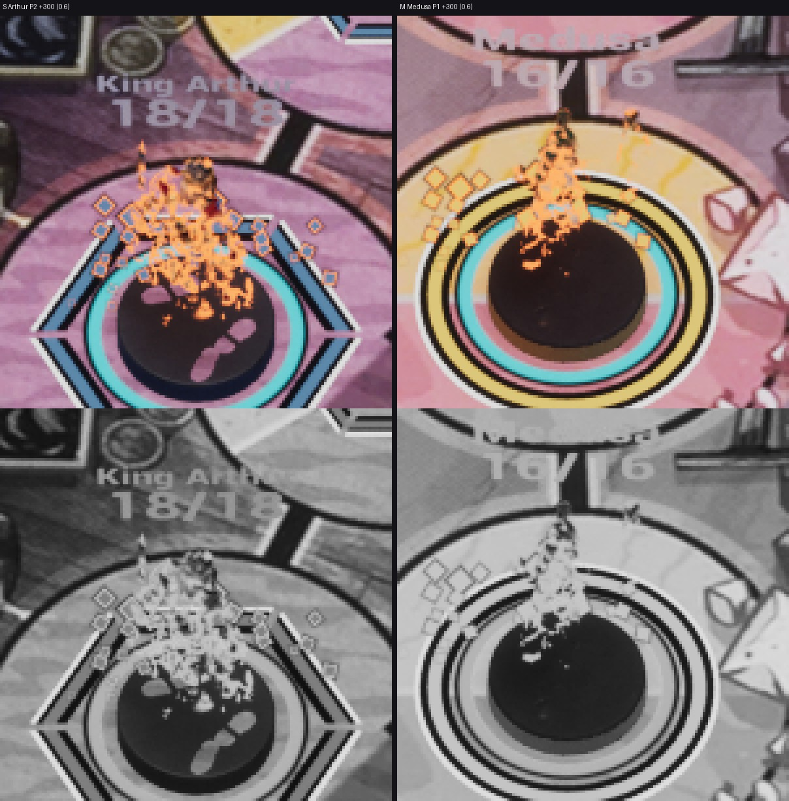

# AN-29 — смерть: растворение «пепел» по умолчанию (ВР-13), материал

Шаг VS-6 F3 (ассеты `cef3c9cc`, C++ `c10f2062`, не влито). Общий отчёт — [../VS-6-F3/README.md](../VS-6-F3/README.md).
Статус: **технически импортировано**; packaged `-Bench -BenchDissolve=0.35 / 0.7` K1 и K2×1,6, G-COST ≤ 0,1 мс, живая
смерть — Frames.

- `M_UM_Figure_v2` **v2.5** (`tools/art/material_library/ue_v2_master.py`, пересборка `tools/art/de011/de011.py apply`):
  вектор `DissolveFrontColor` (группа Cue, по умолчанию accent.warm #FFB45C в линейном виде — из hud-style-tokens.json);
  фронт = DissolveFrontColor как экранная цель через обратную тоновую кривую FX-05, маска
  saturate(Edge × DissolveEdgeEmissive), закрывает альбедо; альбедо пепла — цвет команды × DissolveAshValue, как было;
  DissolveEdgeEmissive 1,5 → 3,0 (ВР-VS6-26). Режим по умолчанию (UseDissolve off) не изменился побайтно.
- 8 MIC растворения пересобраны; `de011.py compare --evidence VISUAL/AN-29/de011` — **all_ok**
  ([отчёт](de011/de011-report.json)): мастер Opaque, умолчание = прежний вывод, MIC Masked и наследуют переключатели,
  прогресс 1 — пусто, ash ≠ fade. MIC: 889 PS-инструкций (родитель 779).
- C++ и ARTLOOK — FX-27; тест `Unmatched.S08.HeroesV2.DissolveStyle`.
- Проверочный замер (editor K2×1,6, прогресс 0,6): «тёплые» пиксели полосы — медиана RGB (228,165,100) / (232,157,99),
  ΔE76 к #FFB45C 19,4 / 21,5 (p25 10,8 / 11,6); пикселей ≥ 245 — 0,10 % / 0,001 % кадра (D3 ≤ 0,5 %). Строгий замер
  карточки (≤ 10) — Frames.

Лист DE-011 в редакторе (чистая сцена, SceneCapture): [de011/](de011/) — `after-ash-p35.jpg`, `after-ash-p70.jpg`,
`after-fade-p35.jpg` и др. Сверка со схемой AN-30: фронт тёплый снизу вверх, пятна от ног, к 70 % — обрывки силуэта,
к 100 % — пусто; подставка серая.
