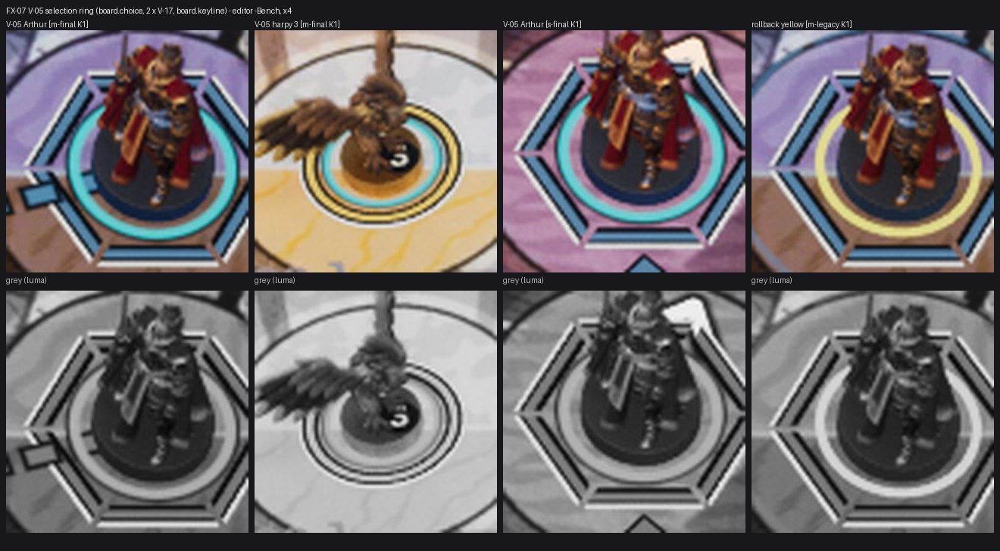

# FX-07 — CUE-002 кольцо выбора V-05

Шаг VS-6 F1, коммит `a797f97c` (ветка `feat/visual-vs6`, не влито). Общий отчёт, решения ВР-VS6-NN, тесты и остатки — [../VS-6-F1/README.md](../VS-6-F1/README.md). Кадры — editor-client `-Bench` (проверочные), приёмочные packaged `-Bench` с `RENDER` — шаг Frames. Статус: технически импортировано.

- `MI_FX_SelectionRing` (родитель `M_FX_FieldMark`, ВР-VS6-01): тело `board.choice` r 17,7–20,1 uu (2 × V-17), внешняя кромка `board.keyline` 1 uu, плоскость движка на z 1,75 (над V-17 1,6), сортировка 12.
- Кадры появления: 0 мс scale 0,85 / opacity 0 → 120 мс 1,0 / 1, удержание до 250; отмена 150 мс; перевыбор — сразу (`SetSelected(…, bOtherSelected)`); reduced motion — только прозрачность ≤ 100 мс (`S08FieldFx::SelectionAppear/Leave`, тест `FieldFx.Timing`).
- Строка CUE-002 в `S08CueRows` (local, replace cue, reduced shorten 100), трасса `CUE fx id=CUE-002` из кадра отпускания вместе со звуком UI-SELECT.
- Откат `-S08ChoiceLegacy`: `SM_Marker_SelectionRing` жёлтый на `M_S08_Solid` (последний столбец листа).
- Лист: Arthur и гарпия 3 на Marmoreal, Arthur на Sarpedon, откат; цвет и серый. В сером кольцо читается светлой полосой с тёмной кромкой и отличается от кольца команды формой и шириной.

Лист `fx07-check-x4.jpg`: кропы ×4 (FX-16 — ×2…×4) из `C:/tmp/visual/vs6f1/bench/{m-final,s-final,m-legacy}`, сверху цвет, снизу серый (яркость). Кадры доски без HUD, JPEG (ВР-VS4-01).
