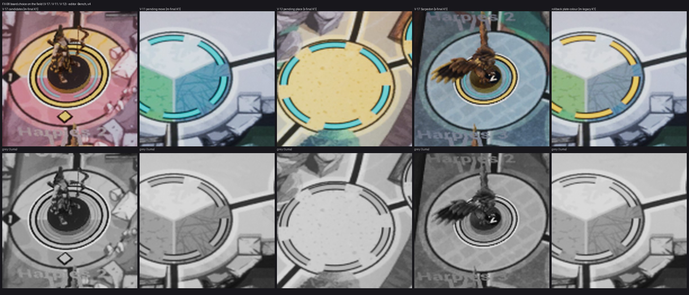

# FX-08 — Бирюза выбора на поле V-17 / V-11 / V-12 (ВР-27)

Шаг VS-6 F1, коммит `a797f97c` (ветка `feat/visual-vs6`, не влито). Общий отчёт, решения ВР-VS6-NN, тесты и остатки — [../VS-6-F1/README.md](../VS-6-F1/README.md). Кадры — editor-client `-Bench` (проверочные), приёмочные packaged `-Bench` с `RENDER` — шаг Frames. Статус: технически импортировано.

- `ES08PlateColor::Choice` (custom data [5] = 4) у V-17, V-11, V-12; `M_UM_MovePlate` graph 4: `ChoiceColor`, `CandFade` / `CandLeave` / `PendFade`.
- Профиль rev 24: `moveSelection.choice {colorSrgb #4CD2DC, token board.choice}` в корне и на обеих настоящих картах; `hud_contract.py validate` сверяет цвет с токеном и `plate.colorSrgb` с `board.reach` (ВР-76).
- V-17 появляется за 100 мс в начале манёвра и гаснет за 100 мс в кадр выбора (уходящие кольца держатся с флагом `Leaving`); V-11 / V-12 появляются за 150 мс. Без `-S08MovePlates` V-17 рисует слой выбора (ВР-VS6-03).
- Откат `-S08ChoiceLegacy` — прежний цвет подложки (последний столбец листа). V-01 / V-02 / V-04 не тронуты.
- Draw calls подложек — по-прежнему одна ISM.

Лист `fx08-check-x4.jpg`: кропы ×4 (FX-16 — ×2…×4) из `C:/tmp/visual/vs6f1/bench/{m-final,s-final,m-legacy}`, сверху цвет, снизу серый (яркость). Кадры доски без HUD, JPEG (ВР-VS4-01).
