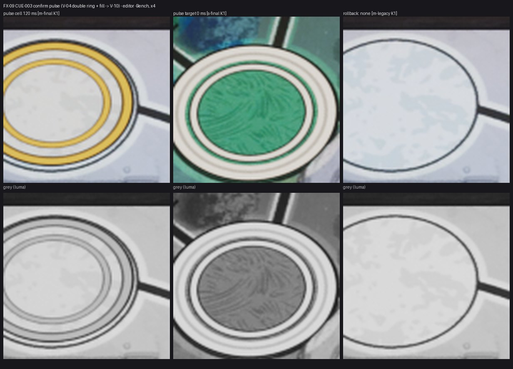

# FX-09 — CUE-003 импульс подтверждения клетки и цели

Шаг VS-6 F1, коммит `a797f97c` (ветка `feat/visual-vs6`, не влито). Общий отчёт, решения ВР-VS6-NN, тесты и остатки — [../VS-6-F1/README.md](../VS-6-F1/README.md). Кадры — editor-client `-Bench` (проверочные), приёмочные packaged `-Bench` с `RENDER` — шаг Frames. Статус: технически импортировано.

- Экземпляр импульса (канал 6) в той же ISM: двойное кольцо V-04 и заливка; scale 1,06 → 1,0 ease-out, заливка 100 % → V-10, яркость → 0,7 за 250 мс; reduced motion — без масштаба, ≤ 100 мс (`S08FieldFx::ConfirmPulse`).
- Клетка: клик по клетке черновика (`S08FxBoardInput`, тот же кадр, что UI-CONFIRM); цель: выбор цели в черновике атаки, `board.target`, центр под фигурой свободен (ВР-VS6-08).
- Строка CUE-003 (local, reduced shorten 100), трасса `CUE fx id=CUE-003`; маркер в cue-table — `M_UM_MovePlate`, канал Pulse.
- Откат `-S08MovePlatesLegacy` — без импульса (последний столбец листа).
- Кадры листа: клетка 120 мс (Marmoreal, белая), цель 0 мс (Sarpedon, зелёная); 250 мс — уже V-10 подложки.

Лист `fx09-check-x4.jpg`: кропы ×4 (FX-16 — ×2…×4) из `C:/tmp/visual/vs6f1/bench/{m-final,s-final,m-legacy}`, сверху цвет, снизу серый (яркость). Кадры доски без HUD, JPEG (ВР-VS4-01).
