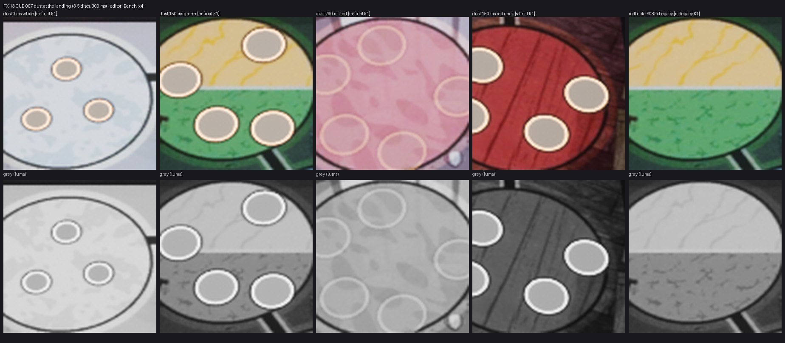

# FX-13 — CUE-007 пыль на конечной клетке

Шаг VS-6 F1, коммит `a797f97c` (ветка `feat/visual-vs6`, не влито). Общий отчёт, решения ВР-VS6-NN, тесты и остатки — [../VS-6-F1/README.md](../VS-6-F1/README.md). Кадры — editor-client `-Bench` (проверочные), приёмочные packaged `-Bench` с `RENDER` — шаг Frames. Статус: технически импортировано.

- `/Game/S08/FX/Board/NS_FX_Dust` — носитель квада (ВР-VS6-06), `MI_FX_Dust` на `M_FX_BoardPrint`: 3–5 дисков (ВР-VS6-07), 0 мс у края подставки r 6 → 180 мс разлёт на 20–35 uu, r 10 → 300 мс r 11 и opacity 0; тело `text.secondary`, кромка `card.cream`, контур `mark.keyline`; на земле +1 uu.
- Спавн в кадр посадки каждого плана (`S08FxMovePlans` → `S08FxTick`), одна пыль на (боец, seq), jump_to_final снимает пыль старого хода; reduced motion / скорость «Нет» / snap — без пыли; `-S08FxLegacy` — нет.
- CUE-007 в C++ диспетчере (server, jump_to_final, reduced snap, длительность плана), трасса `CUE fx id=CUE-007 vfx=NS_FX_Dust`; строки `MS-CUE` не менялись; cue-table `vfx.status present`.
- fx_audit: CPU, детерминизм, сид = CRC32 имени, фиксированные границы, `NET_UM_Board` — без замечаний.
- Лист: 0 / 150 / 290 мс на белой, зелёной и розовой (красной) клетке Marmoreal, 150 мс на красной палубе Sarpedon, откат. Пыль после 300 мс не живёт (частица 0,3 с).

Лист `fx13-check-x4.jpg`: кропы ×4 (FX-16 — ×2…×4) из `C:/tmp/visual/vs6f1/bench/{m-final,s-final,m-legacy}`, сверху цвет, снизу серый (яркость). Кадры доски без HUD, JPEG (ВР-VS4-01).
