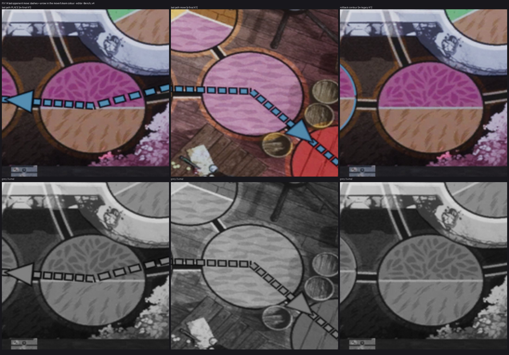

# FX-14 — След последнего хода соперника V-14 / V-15 (ВР-29)

Шаг VS-6 F1, коммит `a797f97c` (ветка `feat/visual-vs6`, не влито). Общий отчёт, решения ВР-VS6-NN, тесты и остатки — [../VS-6-F1/README.md](../VS-6-F1/README.md). Кадры — editor-client `-Bench` (проверочные), приёмочные packaged `-Bench` с `RENDER` — шаг Frames. Статус: технически импортировано.

- Канал 4 ISM подложек: по кваду на ребро, 12 штрихов, тело 4 uu в цвете команды хода (`TeamP1/TeamP2`), кромка `board.keyline`; наконечник — канал 5 той же ISM (ВР-VS6-05); PLACE — прямой пунктир от старта к финишу.
- Появление 150 мс, удержание 1500 мс, угасание 300 мс (`FS09LastMoveTracker::HoldMs / InMs`, профиль `lastMove.holdMs / inMs / dashPerEdge / widthUU`); reduced motion — сразу.
- Показ не зависит от `-S08MovePlates` (слой выбора, ВР-VS6-03). Лента и стрелка у края MS-T-17 остались.
- Откат `-S08LastMoveLegacy` — контур MS-T-17 (последний столбец листа: на Marmoreal он почти не виден — замечание G-LIVE D подтверждено и снято новым видом).

Лист `fx14-check-x4.jpg`: кропы ×4 (FX-16 — ×2…×4) из `C:/tmp/visual/vs6f1/bench/{m-final,s-final,m-legacy}`, сверху цвет, снизу серый (яркость). Кадры доски без HUD, JPEG (ВР-VS4-01).
