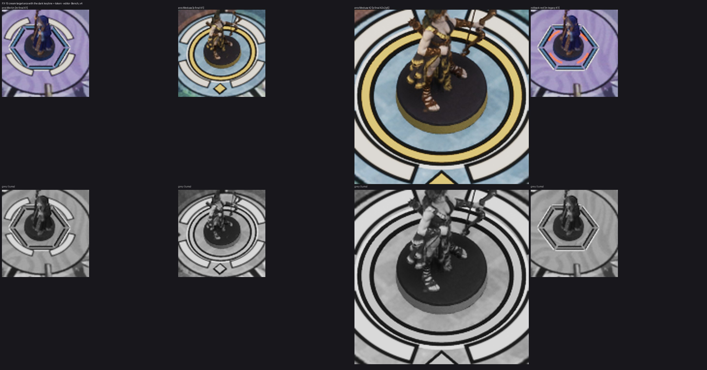

# FX-15 — Дуги цели cream и жетон атаки (ВР-30)

Шаг VS-6 F1, коммит `a797f97c` (ветка `feat/visual-vs6`, не влито). Общий отчёт, решения ВР-VS6-NN, тесты и остатки — [../VS-6-F1/README.md](../VS-6-F1/README.md). Кадры — editor-client `-Bench` (проверочные), приёмочные packaged `-Bench` с `RENDER` — шаг Frames. Статус: технически импортировано.

- `MI_FX_TargetArc` (`M_FX_FieldMark` mode 2): четыре дуги `board.target` r 30–35 uu с кромкой `mark.keyline` 1,5 uu, 56° по диагоналям, за кольцом команды (ВР-VS6-02); 1 draw call; цвета — из генератора токенов.
- Появление 1,15 → 1,0 за 150 мс, уход 120 мс, в кадр падения цели — сразу; reduced motion — только прозрачность. Жетон — экранный `action-attack-token` v3 (без изменений), мировой — IC-35.
- Откат `-S08TargetArcLegacy` — красные дуги меша (последний столбец листа).
- Лист: цель Merlin (Marmoreal), Medusa (Sarpedon) K1 и K2; красного у цели нет; в сером дуги светлые с тёмной кромкой.

Лист `fx15-check-x4.jpg`: кропы ×4 (FX-16 — ×2…×4) из `C:/tmp/visual/vs6f1/bench/{m-final,s-final,m-legacy}`, сверху цвет, снизу серый (яркость). Кадры доски без HUD, JPEG (ВР-VS4-01).
