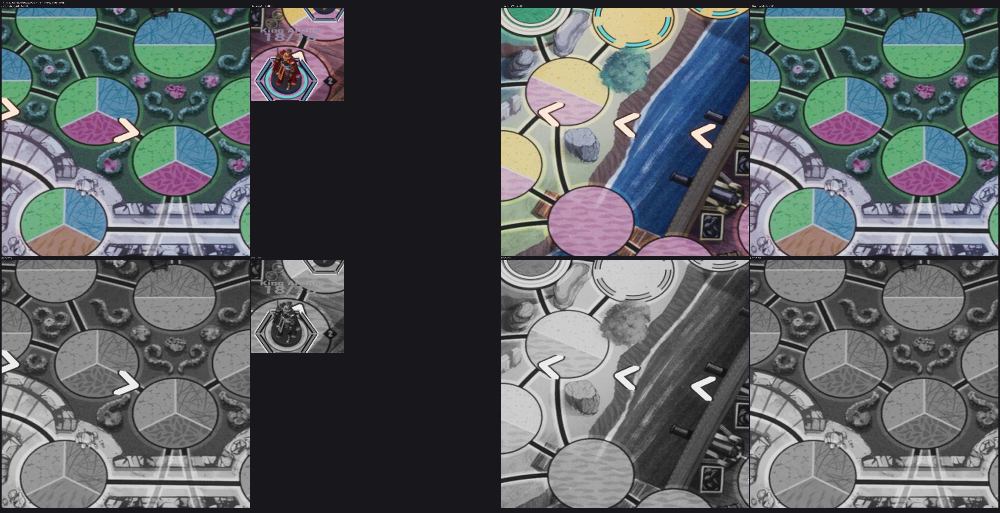

# FX-16 — CUE-008 шевроны направления атаки

Шаг VS-6 F1, коммит `a797f97c` (ветка `feat/visual-vs6`, не влито). Общий отчёт, решения ВР-VS6-NN, тесты и остатки — [../VS-6-F1/README.md](../VS-6-F1/README.md). Кадры — editor-client `-Bench` (проверочные), приёмочные packaged `-Bench` с `RENDER` — шаг Frames. Статус: технически импортировано.

- `/Game/S08/FX/Board/NS_FX_AttackChevrons` — квад от центра атакующего к центру цели (ВР-VS6-06), `MI_FX_Chevron` на `M_FX_BoardPrint`: три шеврона на 30 / 50 / 70 %, шеврон i с 120 × i мс (0,6 → 1,0 за 80 мс), все гаснут 480 → 600 мс; ширина поперёк ≥ 0,35 R (соседи ≥ 0,2 R, ≤ 0,6 R); тело `card.cream`, кромка `mark.keyline` 2 uu; z +1 uu.
- Спавн в t0 = событие + 150 мс (`S08FxAttackDeclared`), × скорость боя; reduced motion / «Нет» — ×6; строка `CUE fx done id=CUE-008 … cut=interrupt` гасит живые шевроны (ВР-VS6-09).
- Трасса `CUE fx id=CUE-008 vfx=NS_FX_AttackChevrons socket=-`; cue-table `vfx.status present`.
- Лист: Medusa → Merlin +240 (Marmoreal), Arthur → Merlin +0 и Merlin → Medusa +480 (Sarpedon), откат. Направление читается в сером.

Лист `fx16-check-x2-4.jpg`: кропы ×4 (FX-16 — ×2…×4) из `C:/tmp/visual/vs6f1/bench/{m-final,s-final,m-legacy}`, сверху цвет, снизу серый (яркость). Кадры доски без HUD, JPEG (ВР-VS4-01).
