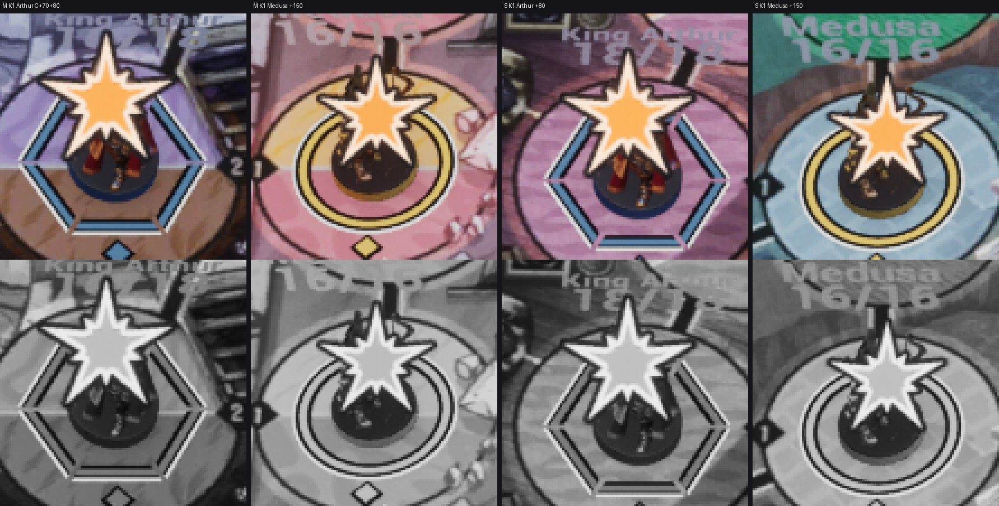
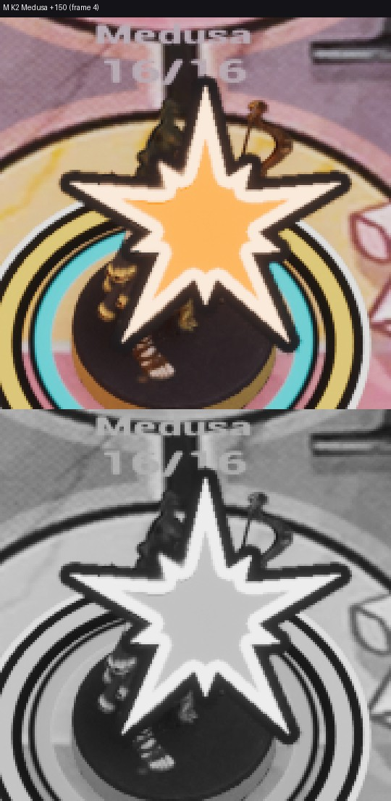

# FX-21 — звезда-всплеск удара NS_FX_HitStar

Шаг VS-6 F2 (ветка `feat/visual-vs6`, не влито): ассеты `0b36c66b`, проводка `e67def78`. Общий отчёт, решения ВР-VS6-13…21,
тесты и остатки — [../VS-6-F2/README.md](../VS-6-F2/README.md). Статус: **технически импортировано**; приёмочные кадры
packaged `-Bench` с `RENDER`, render_bench (fx-each, FX-37) и художественная приёмка по делегированию — шаг Frames.

- `/Game/S08/FX/Textures/T_FX_HitStar_4x2` — маска FX-20 как есть (BC7, sRGB off, Effects, mips, clamp; ВР-VS2-FX20-06).
- `/Game/S08/FX/Combat/NS_FX_HitStar` — CPU, 1 частица, 0,27 с, детерминизм, сид CRC32 имени, фиксированные границы,
  `NET_UM_Combat`; носитель-квад плоскости (как пыль F1), квад к камере. `MI_FX_HitStar` на `M_FX_FigurePrint`
  (без теста глубины, сортировка 20): кадр = min(7, floor(возраст · 30 / 1000)) по ParticleRelativeTime (ВР-VS6-13), цвет —
  веса R/G/B маски (fx.impact / fx.rim / mark.keyline), порог покрытия 0,4 и мип −1 (ВР-VS6-15).
- Точка ВР-FX04: центр цели на 0,6 высоты фигуры, на 0,4 радиуса капсулы к атакующему (без атакующего — без смещения);
  сторона квада = высоте фигуры → диаметр звезды 0,8 H (Arthur 48 uu, Medusa 44 uu). Спавн C+70 (`S08FxHit` из
  `PresentHit`); урон 0 / reduced motion / cut / `-S08FxLegacy` — без звезды; одна звезда на цель в кадр.
- Трассы: `FX star plan fighter=… staged=… attacker=… at=+70 [skip=…]`, `FX star … side=… diameter=… result=spawned`;
  строка диспетчера `CUE fx id=CUE-011 … vfx=NS_FX_HitStar` (cue-table vfx present).
- Проверочные кадры (editor-client `-Bench`, `-BenchFx=star,<цель>,<мс>,<атакующий>`): K1 1080p — звезда ≈ 55–58 px на
  Marmoreal и ≈ 50 px на Sarpedon (≥ 36 px); кремовая кромка и тёмный keyline видны на светлой и тёмной клетке; в сером —
  силуэт звезды с контуром. Первый прогон (мип 0, порог 0,5) терял keyline на K1 — исправлено (ВР-VS6-15). K2 — кадр 4.

Листы: кропы ×4 / ×3 из `C:/tmp/visual/vs6-f2/bench/{m-a,s-a}`, сверху цвет, снизу серый. Кадры доски без HUD, JPEG.
Подписи «King Arthur 18/18» над фигурами — мировые подписи `-ArtPreview` бенча (в живом бою их нет; остаток Z-2).
