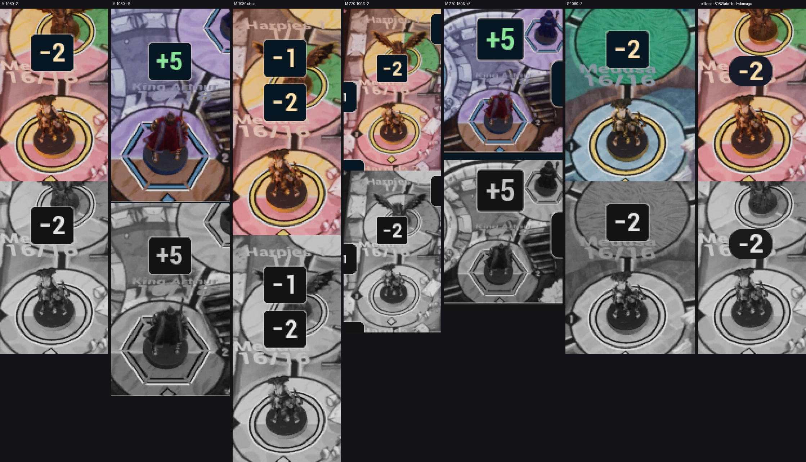

# FX-22 — числа «−N» и «+N» над фигурой

Шаг VS-6 F2, коммит `e67def78` (ветка `feat/visual-vs6`, не влито). Общий отчёт — [../VS-6-F2/README.md](../VS-6-F2/README.md).
Статус: **технически импортировано**; кадры K1 / K2 живого удара и лечения (packaged) и G-WIDGET `SHOT widget id=damage` —
шаг Frames; художественная приёмка по делегированию — после них.

- `UUmWorldDamage` (`S08/UI/UmWorldDamage.h`) — содержимое `US08ArtDamageWidget` / `WBP_S08ArtDamage` по умолчанию; откат
  `-S08SlateHud=damage` — прежний кегль 18 и фон #161A28 (ВР-H15, ВР-61). ARTLOOK `damage=v2|legacy(-S08SlateHud=damage)`.
- Капсула `card.navy`, кромка `panel.edge` 1 su, `radius.s` 4 su, отступы 8 × 4 su; текст `type.damage` 24 su; «−N» —
  `damage.text`, ключ ST_Hud `hud.damage.minus` («−{n}», U+2212); «+N» — `fx.heal`, `hud.damage.plus` (RU / EN; ST_Hud и
  locres пересобраны `hud_strings_build.py build`). Цвета и кегль — из темы.
- Движение (`S08CombatFx::NumberPose`): 0,8 → 1 за 80 мс, подъём 24 su ease-out за жизнь, последние 150 мс прозрачность → 0;
  «−N» 900 мс × скорость, «+N» 700 мс; reduced motion — 450 мс без подъёма и масштаба, уход 100 мс.
- До 4 чисел у фигуры; новое — над верхним показанным на max(28 su, высота капсулы + 4 su) (ВР-VS6-17: при 28 su капсула
  36 su наезжала, первый лист). Якорь — над FigureScreenRect по центру; если там тег, иконка, панель или край окна —
  прежний подбор W5b-R.
- Галерея `-S08IconGalleryWorld=<доска>`, состояния 10–13: `damage-medusa`, `heal-arthur`, `heal-reduced`, `damage-stack`
  (настоящий виджет на удержанных часах; фон — кадр K1 доски как картинка, HB-44).
- Открыто глазами: 1080p 100 %, 720p 100 % и 150 % Marmoreal, 1080p 100 % и 720p 150 % Sarpedon, откат — «−» и «+»
  различимы в сером; текст на navy (damage.text 14,4 : 1, fx.heal 12,1 : 1 по токенам); откат показывает старое число.

Лист: кропы ×3 из `C:/tmp/visual/vs6-f2/gallery/n-*`, сверху цвет, снизу серый.
