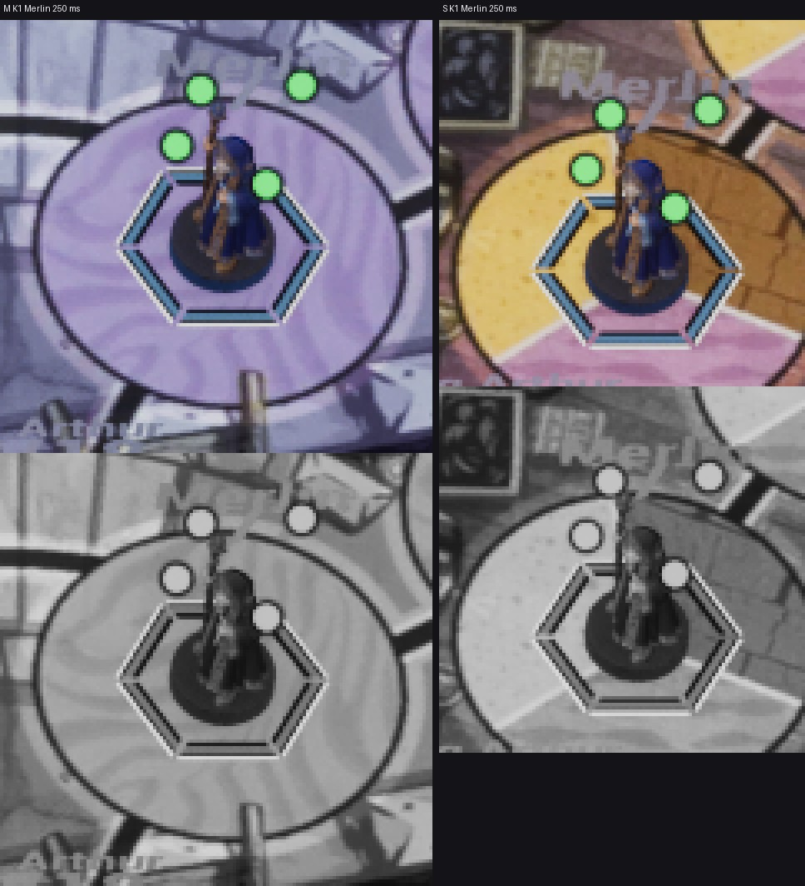

# FX-24 — точки лечения NS_FX_HealMotes

Шаг VS-6 F2: ассеты `0b36c66b`, проводка `e67def78` (ветка `feat/visual-vs6`, не влито). Общий отчёт —
[../VS-6-F2/README.md](../VS-6-F2/README.md). Статус: **технически импортировано**; кадры packaged `-Bench` 0 / 200 / 450 /
600 мс (Arthur на зелёной зоне и на белой клетке) — шаг Frames.

- `/Game/S08/FX/Combat/NS_FX_HealMotes` — CPU, 1 частица-носитель 0,6 с, детерминизм, сид CRC32 имени, `NET_UM_Combat`;
  квад к камере у подставки (сторона 0,8 H + 16 uu, основание на 6 uu выше нижнего края), прикреплён к корню фигуры
  (cue-table: сокет Base = начало фигуры) с абсолютным поворотом к камере (ВР-VS6-21).
- `MI_FX_Heal` на `M_FX_FigurePrint` mode 1: 4 диска (ВР-VS6-16), тело `fx.heal`, кромка `mark.keyline` 1,2 uu; кольцо 0,6
  радиуса подставки, старт 0 / 60 / 120 / 180 мс, подъём на 0,8 высоты фигуры с замедлением до 450 мс, снос ±6 uu,
  300–600 мс прозрачность → 0 и радиус 3 → 2 uu; без шума, без «+», без облака, без заливки фигуры.
- Reduced motion и `-S08FxLegacy` — без точек («+N» остаётся; при reduced — со значком IC-49).
- Проверочные кадры 250 мс: Marmoreal — диски ≈ 8 px, Sarpedon ≈ 5–6 px (≥ 3 px); в сером — диски с контуром, не звезда.

