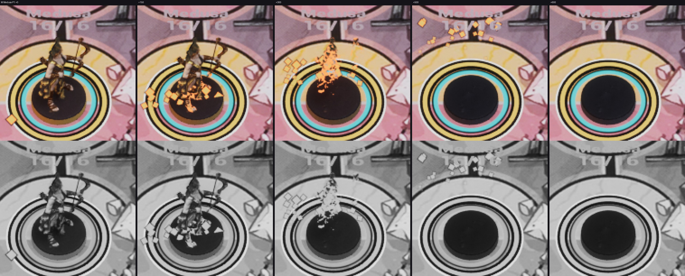
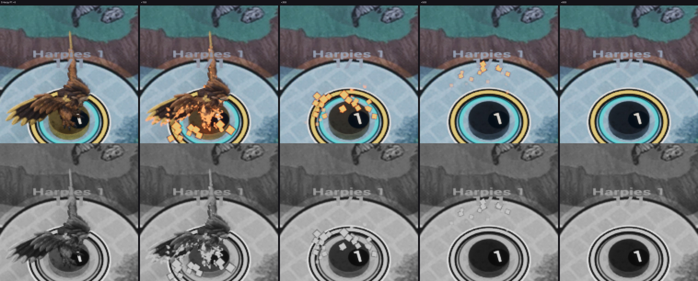
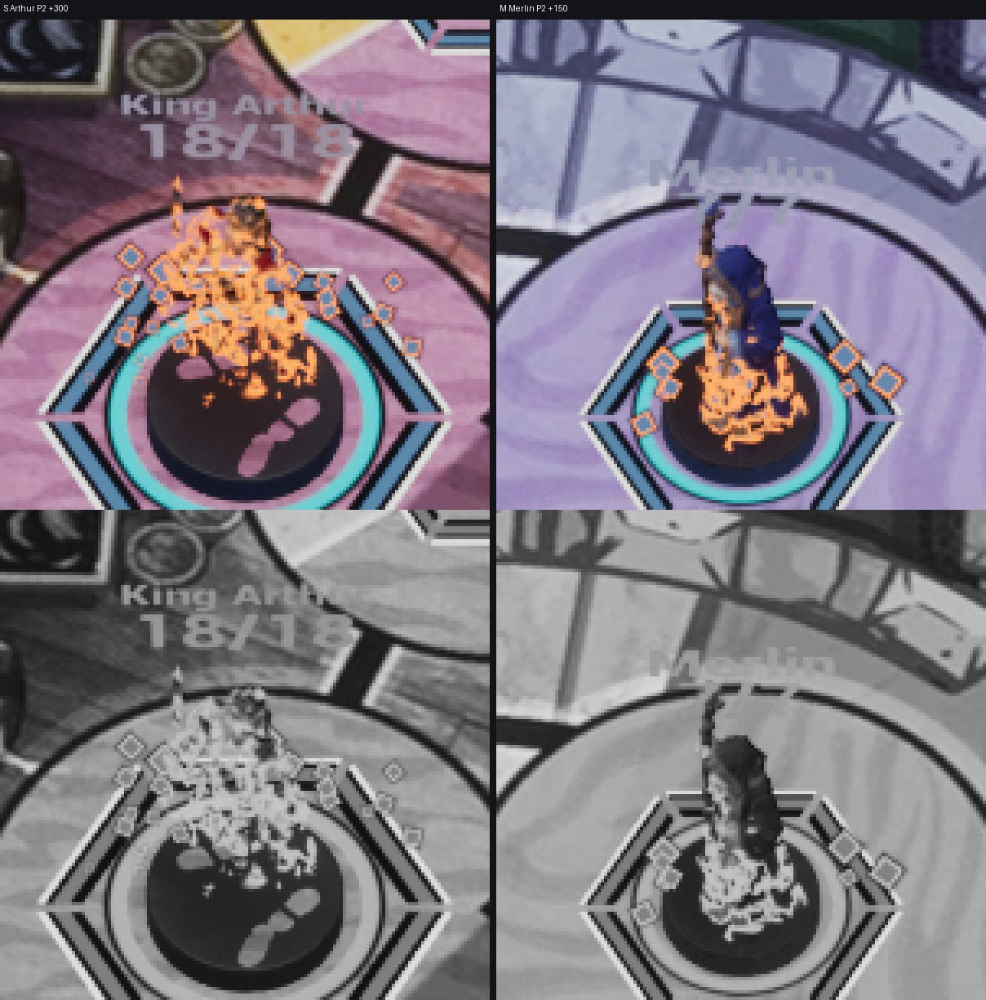

# FX-26 — угольки «пепла» NS_FX_AshEmbers (ВР-13)

Шаг VS-6 F3 (ветка `feat/visual-vs6`, не влито): ассеты `cef3c9cc`, проводка `c10f2062`. Общий отчёт, ВР-VS6-22…33,
проверки и остатки — [../VS-6-F3/README.md](../VS-6-F3/README.md). Статус: **технически импортировано**; приёмочные
кадры packaged `-Bench`, render_bench `dx12-lumen-high-v2-dissolve-ash` с угольками и приёмка по делегированию — Frames.

- `/Game/S08/FX/Combat/NS_FX_AshEmbers` — CPU, 1 частица-носитель, 0,6 с, детерминизм, сид CRC32 имени, фиксированные
  границы, `NET_UM_Combat`; user-параметры FrontHeight / DissolveMs / TeamScreenColor связаны с `MI_FX_Ember`
  (ВР-VS6-23). `MI_FX_Ember` на `M_FX_AbilityPrintDepth`, mode 2 (ВР-VS6-22): уголёк k < round(0,08 · DissolveMs)
  (герой 40, помощник 32) рождается в t_k = 12,5 k мс, когда фронт его прошёл, на высоте t_k / D · H, на цилиндре
  0,35 H; подъём 40–80 uu/с, снос ±10 uu, вращение 90–180°/с, 2–4 → 1 uu, последние 40 % жизни — opacity → 0
  (ВР-VS6-25).
- Ромб: тело team.p1.screen / team.p2.screen вида фигуры (60 %), кромка accent.warm, обводка mark.keyline; без света,
  свечения, шума, дыма.
- Спавн: FX-адаптер в первом кадре растворения (ВР-VS6-24), квад к камере над фигурой, сдвинут к камере на радиус;
  FrontHeight каждый кадр. Нет угольков: fade (`-S08DissolveFade`), reduced motion, `-S08FxLegacy`, без MIC.
- Трасса: `FX embers fighter=<id> t=<ms> dissolve=<мс> count=<n> look=<P1|P2> result=spawned|skip reason=…`.

Листы: editor `-Bench -BenchFx=ash,<боец>,<мс> -BenchFocusFighter=<боец>`, K2×1,6, кропы ×4, сверху цвет, снизу серый;
кадры доски без HUD, JPEG. Угольки видны в цвете и в сером (ромб с тёмной обводкой, вверх от фронта); на +600 последний
уголёк угас. Тёмная подставка и цифра «1» гарпии на +500/+600 — артефакт бенча (живая смерть скрывает фигуру и цифру).
