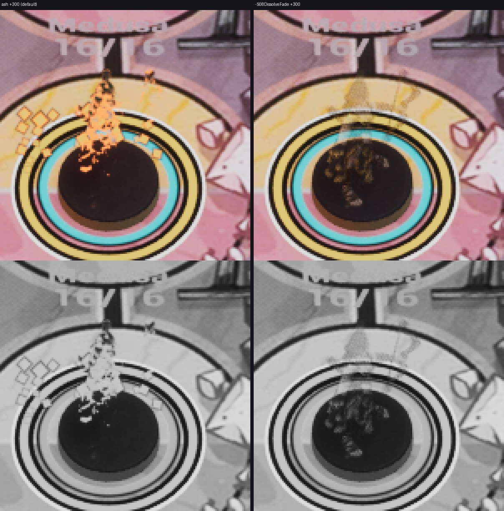

# FX-27 — CUE-013 смерть: «пепел» по умолчанию

Шаг VS-6 F3 (`c10f2062`, не влито). Общий отчёт — [../VS-6-F3/README.md](../VS-6-F3/README.md). Статус: **технически
импортировано**; живая партия до GAME_OVER (DS1–DS6, `style=ash`) и кадры +0/+250/+500 — Frames.

- `S08HeroesV2::DecideDissolveStyle(bFadeFlag, bReducedMotion)` — Ash по умолчанию, Fade при `-S08DissolveFade` (новый
  флаг отката, `DissolveFadeFlagName`) или reduced motion; `-S08DissolveAsh` — пустой псевдоним (ARTLOOK aliases).
  ARTLOOK: `death=ash | legacy(-S08DissolveFade) | fade(reduced)`, `abilityFx=on|legacy(-S08FxLegacy)`.
- Этапы F-09 и гейт DS1–DS6 не менялись: трасса `CUE death … stage=dissolve … style=ash`; угольки — отдельная строка
  `FX embers fighter=<id> t=<ms>` (FX-26). Без MIC — `style=none`, угольков нет.
- render_bench: вариант `dissolve-fade` передаёт `-S08DissolveFade`, `dissolve-ash` — псевдоним.
- Тесты: `Unmatched.S08.HeroesV2.DissolveStyle` (умолчание Ash, флаг и reduced → Fade, поле ARTLOOK); обновлены
  `HeroesV2.Dissolve` и `HeroesV2.Actor` (стиль смерти по умолчанию — ash).

Временной ряд +0/+150/+300/+500/+600 героя и помощника обеих команд — лист FX-26.
