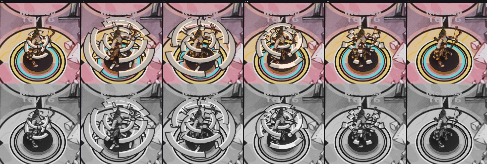
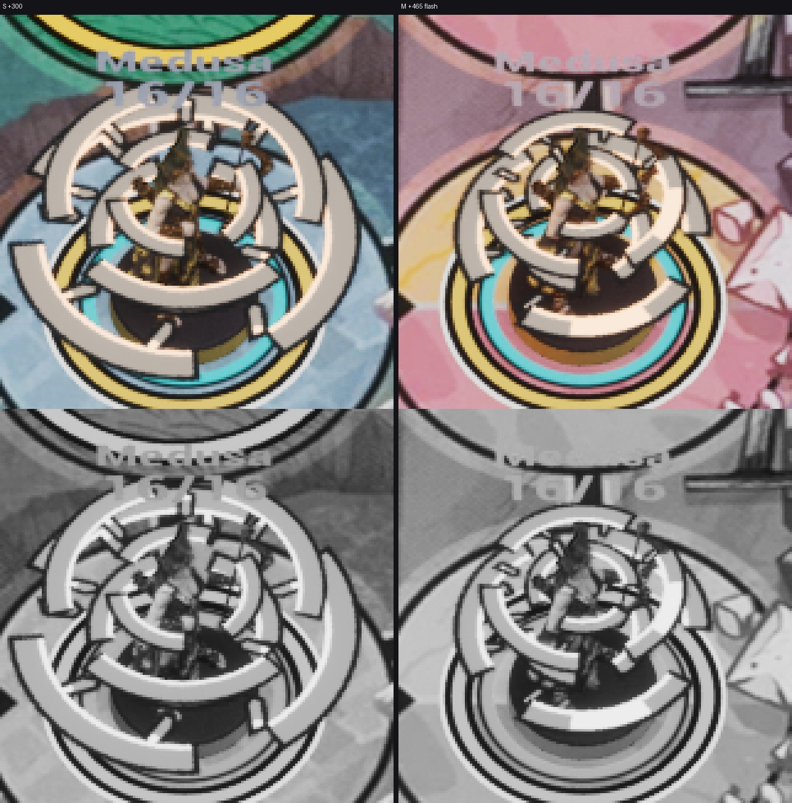

# FX-30 — вихрь Medusa: Niagara и постановка взгляда

Шаг VS-6 F3 (ассеты `cef3c9cc`, проводка `c10f2062`, не влито). Общий отчёт — [../VS-6-F3/README.md](../VS-6-F3/README.md).
Статус: **технически импортировано**; живая партия или S09-фикстура со взглядом на обеих картах (A1, G-CUE) и кадры
packaged — Frames.

- `FS09AbilityStage` (`S09/S09AbilityStage.*`, без мира, `FS09CombatStage` не тронут; ВР-FX11, ВР-VS6-30): t0 — CUE-014
  на Medusa + событие Vortex; контакт t0+454 (reduced: без вихря, t0+100) — CUE-011 цели staged и набор FX-23 без
  выпада (вспышка, звезда C+70, обод, HitReact, звук); «−N» +60; HP +80 (HUD держит старое HP до этого кадра); летально —
  падение +450; конец max(t0+800, контакт+80, падение). Удержание цели входит в виды бойцов вместе с удержанием боя.
- Трасса `CUE ability seq=<n> stage=start|contact|minus|hp|fall|end t=<ms> hero=medusa target=<id> …`; гейт
  `cue_contract.py check-trace` A1 (контакт +454 / +100, «−N» +60, HP +80, падение +450 ±17 мс, CUE-014 в start, CUE-011
  в контакт) и A2 `--min-ability N`; pytest `AbilityStageTests`. Тест UE `Unmatched.S09.AbilityStage.Timeline`.
- `NS_FX_MedusaVortex`: CPU, носитель-меш `SM_FX_VortexRings` (два горизонтальных квада 0,45 / 0,7 H, 1,4 H / 1,12 H,
  верхний зеркален — ВР-VS6-28), `MI_FX_Vortex` на `M_FX_AbilityPrintDepth` mode 1 (тест глубины), флипбук FX-29 4×4,
  16 кадров × 37,5 мс по возрасту, цвета fx.stone.2 / fx.stone / mark.keyline; рыскание — сектор кадра 12 к камере;
  не масштабируется скоростью; `NET_UM_Combat`; крепление к корню фигуры (сокет Root).
- Луча, линии, глаза, зелёного, света нет.

Листы: editor `-Bench -BenchFx=vortex,f-0-hero,<мс>`, K2×1,6, ×4, цвет и серый. Кольца закрывают фигуру на 150–454 мс —
так задан размер 1,4 H (FX-29); в сером кольца читаются по обводке.
