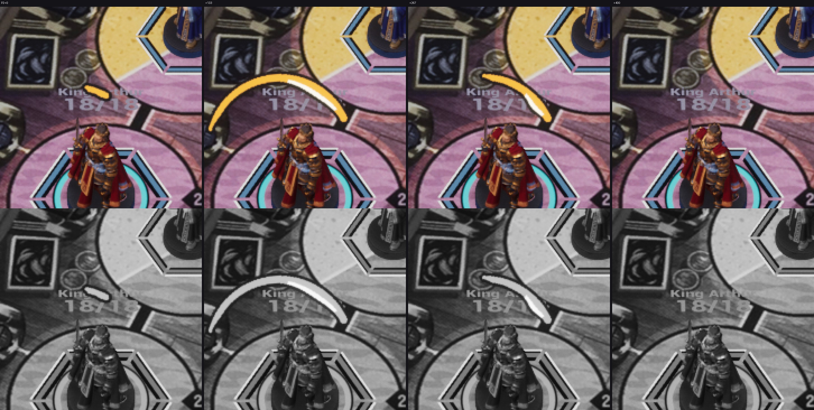
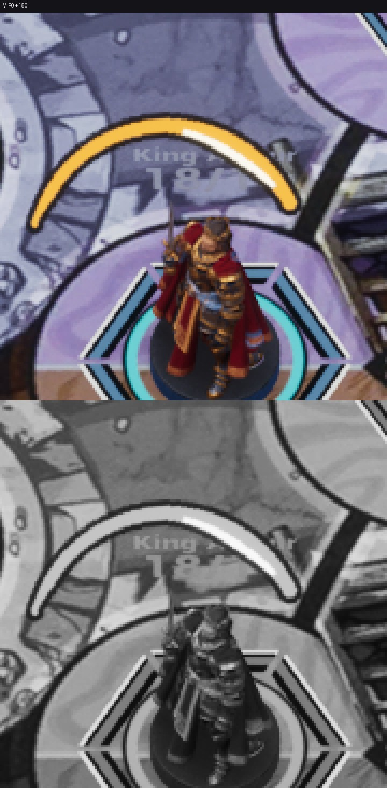

# FX-32 — дуга меча Arthur: Niagara и запуск на раскрытии

Шаг VS-6 F3 (ассеты `cef3c9cc`, проводка `c10f2062`, не влито). Общий отчёт — [../VS-6-F3/README.md](../VS-6-F3/README.md).
Статус: **технически импортировано**; живая партия (атака с бустом — CUE-014 `socket=Weapon` в кадр переворота ±17 мс,
без буста — нет, G-CUE) и кадры packaged — Frames.

- `T_FX_ArthurArc_4x4` — маска FX-31 как есть (BC7, sRGB off, Effects, mips, clamp).
- `NS_FX_ArthurArc`: CPU, 1 частица-носитель, 0,4 с, `MI_FX_Arc` на `M_FX_AbilityPrint` mode 0 (без теста глубины,
  приоритет 30 — ВР-VS6-31): квад к камере с центром на сокете Weapon, пивот ячейки (147,2; 164,0) на руке, ячейка
  1,4457 H (ВР-VS2-FX31-01), кадры 0–11 по 33,3 мс, цвет (R·fx.gold + G·card.glyph + B·mark.keyline) / Σ.
- Запуск: событие `FlipAttack` постановки боя при `bAbilityBoost` (FX-28) — CUE-014 + `SpawnSystemAttached` к сокету
  Weapon (поворот и масштаб абсолютные); наклон — по оси сокета, ближайшей к вертикали (ВР-VS6-27), ±45°; время —
  `SetCustomTimeDilation(1 / скорость)`; скорость «Нет» и reduced motion — не спавнить; `-S08FxLegacy` — нет.
- Трасса `FX arc fighter=… seq=… t=… socket=Weapon tilt=… dilation=… result=…`.

Листы: editor `-Bench -BenchFx=arc,f-1-hero,<мс>`, K2×1,6, ×4, цвет и серый. Красного нет; в сером — одна дуга с
обводкой; на +400 дуги нет.
