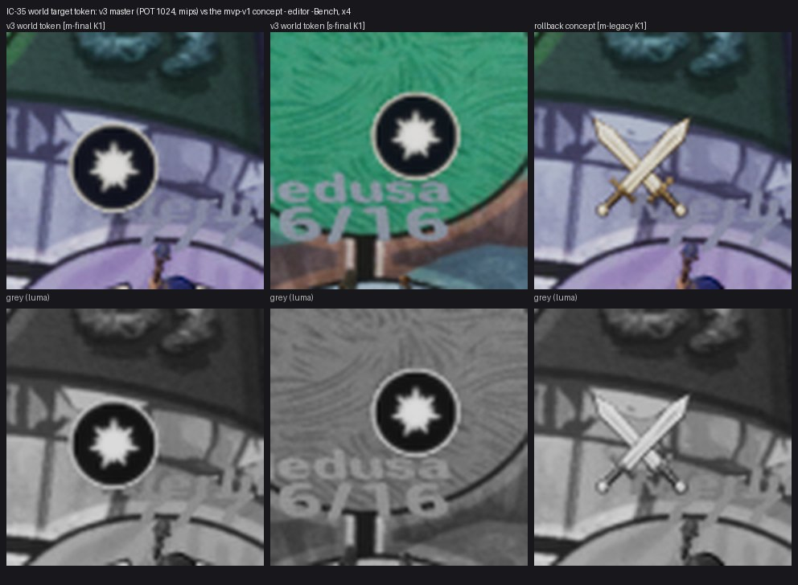

# IC-35 — Жетон цели: мировой спрайт v3 POT 1024 и маска v3

Шаг VS-6 F1, коммит `a797f97c` (ветка `feat/visual-vs6`, не влито). Общий отчёт, решения ВР-VS6-NN, тесты и остатки — [../VS-6-F1/README.md](../VS-6-F1/README.md). Кадры — editor-client `-Bench` (проверочные), приёмочные packaged `-Bench` с `RENDER` — шаг Frames. Статус: технически импортировано.

- `tools/art/icons_v3_import.py` `ICONS_V3_WORLD=1` → `/Game/S08/UI/IconsV3/T_IV3_action_attack_token_World`: мастер 1024 как есть, mips из группы, `TEXTUREGROUP_World`, sRGB, `TF_Trilinear`, без стриминга, сжатие `TC_EDITOR_ICON` — как у `T_UI_Action_AttackConcept`; строка в `art/imagegen/hud-icons-v3/ue-import-report.json`.
- `AS08FighterActor::BeginPlay`: спрайт v3, масштаб 0,042 × ширина концепта / 1024 (та же ширина в мире); `-S08IconLegacy` или `-S08TargetArcLegacy` — прежний концепт. Мировой режим — только без экранного жетона (в бенче его включает `SetFieldMarksBench`, ВР-VS6-12); оба жетона сразу не рисуются.
- Входы qa010 (`t53_readability.py`, `t5cb3_target_arcs.py`) переведены на `sizes/action-attack-token-glyphmask-<n>.png` v3 (`token_textures`, mvp-v1 — только запасной).
- Лист: жетон v3 над Merlin (Marmoreal) и Medusa (Sarpedon), откат — концепт мечей; размеры на K1 совпадают.
- Остаток: qa010 icon ≥ 3 : 1 на DX12/High — после кадров Frames.

Лист `ic35-check-x4.jpg`: кропы ×4 (FX-16 — ×2…×4) из `C:/tmp/visual/vs6f1/bench/{m-final,s-final,m-legacy}`, сверху цвет, снизу серый (яркость). Кадры доски без HUD, JPEG (ВР-VS4-01).
