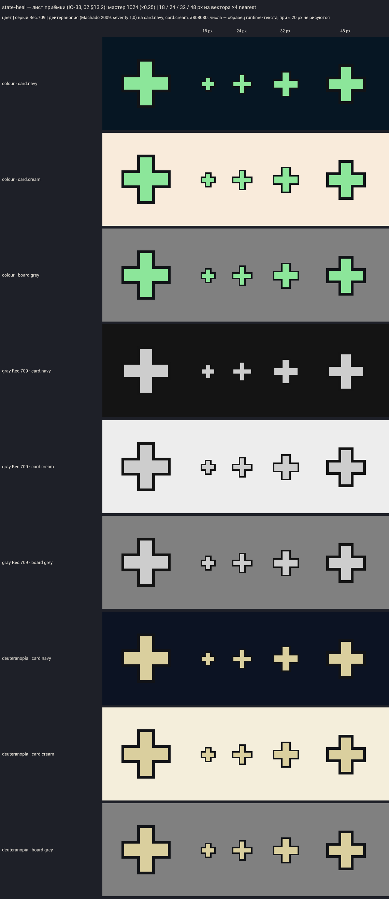
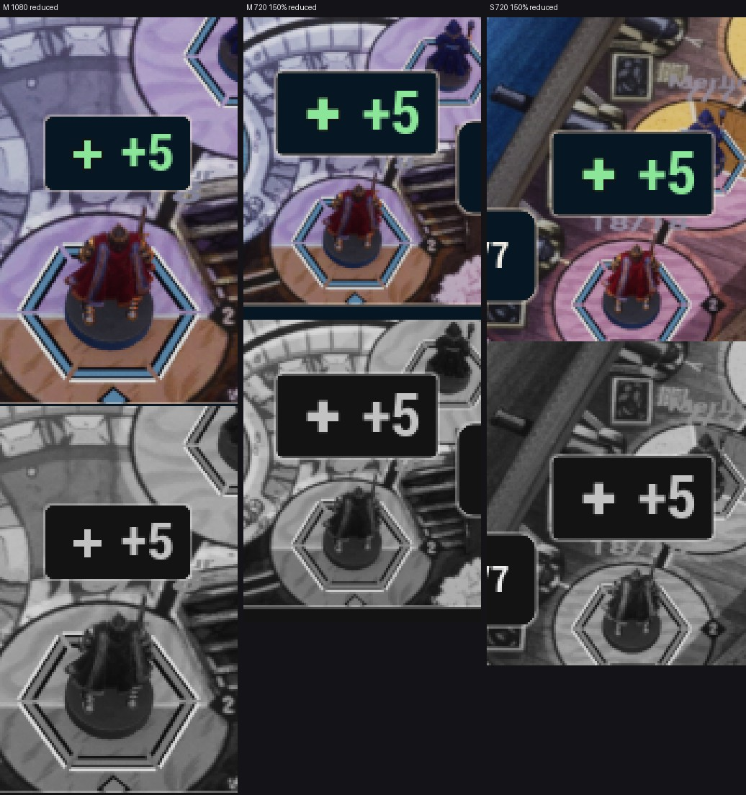

# IC-49 — state-heal, «+» лечения (reduced motion)

Шаг VS-6 F2, коммиты `042a8128` (значок, импорт), `e67def78` (капсула). Общий отчёт — [../VS-6-F2/README.md](../VS-6-F2/README.md).

- Движок v3 `draw_icons.py` `draw_state_heal`: две планки 16 × 4,5 u крестом, концы плоские, центр (16; 16), тело `fx.heal`
  #8CE69A, keyline 1 u снаружи; detail 0 — планки ≥ 3 px; крест симметричен по пиксельной сетке. Одна текстура.
- `audit.json`: margin 224 px (≥ 32), seam 0; `manifest.json` — только добавленные записи (sha1 всех прежних файлов те же);
  строка в `sheets/vr44/sheet-vr44.png`.
- Лист приёмки `accept-state-heal.png` (мастер 1024, 18 / 24 / 32 / 48 px ×4 nearest; цвет, серый Rec.709, дейтеранопия;
  фоны card.navy, card.cream, #808080) открыт: «+» читается на 18 px, в сером и при дейтеранопии; отличается от креста
  стрелок `state-pending-move` (нет бирюзового тела и головок). Вердикт: **принято по делегированию для импорта (ВР-VS6-20)**;
  кадры K1 packaged с `-S08ReducedMotion` (1080p / 720p, 100 % / 150 %) и G-ICON — шаг Frames.
- UE: `T_IV3_state_heal_{18,24,32,36,48,64}` (`ue-import-report.json`); контракт движения: appear 0,15 → 1 за 100 мс (reduced
  0 → 1 за 100 мс, по карточке), leave 100 мс; `US08ArtDamageWidget` при reduced motion ставит значок 24 su (экспорт по
  DPI × масштаб UI) слева от «+N».
- Кропы капсулы (галерея FX-22, 1080p и 720p 150 % обеих карт): `ic49-capsule-x4.jpg`.

