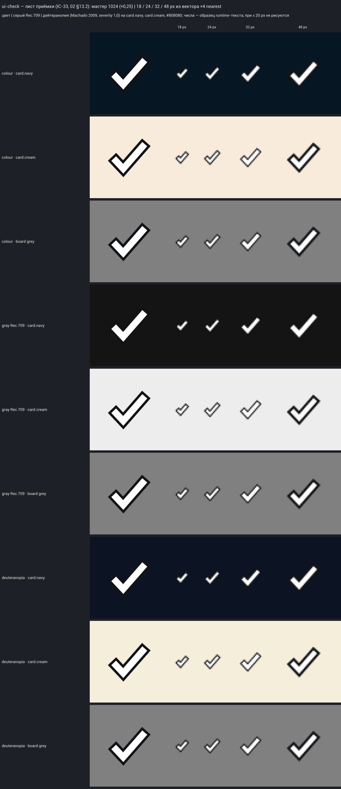

# IC-57 — ui-check, «✓» готовности и выбора

VS-7, шаг S3, 2026-10-08, ветка `feat/visual-vs7` (worktree `C:/tmp/wt-visual`). Карточка — `icons.csv` IC-57 (ВР-IC10).
Носители — ROOM: «ГОТОВ ✓» слотов и тумблера, чип «✓» доски комнаты ([SC-15](../SC-15/README.md), [SC-17](../SC-17/README.md)).

- Движок v3 `draw_icons.py` `draw_ui_check` (`g_check`): ломаная (−6; 0,5) → (−2; 4,75) → (7; −5,5) u от центра (16; 16),
  штрих 2,75 u (снэп к целым px), стык miter, концы плоские; keyline 1 u офсетом (та же ломаная, продлённая на 1 u по
  концам, штрих + 2 u). Белая маска: UMG красит `card.glyph` (на главной кнопке — `card.navy`). Не зелёный, не в круге,
  без мазка, блика, градиента и тени. Финал — только движок, без ImageGen и Codex.
- `ACCEPTED_VR44["ui-check"]`: мастер `masters/ui-check.png` (1024), `sizes/ui-check-{16,18,21,24,32,36,48,64,72,96}.png`,
  строка на `sheets/vr44/sheet-vr44.png` и листах набора; `manifest.json` — только 11 добавленных записей, sha1 всех
  прежних файлов те же (сверка с копией до сборки: 0 изменённых).
- `audit.json`: `margin_px` [242, 261, 209, 247] (≥ 32), `seam_px` 1 (набор v3 — до 21), детали ≥ 1 px.
- Контракт движения: статичный значок (`static_icon`), стандартные appear 180 / leave 120 — для импорта и галереи;
  `icon-motion.json`, `S08IconMotion.json`, `ICON-MOTION.md`, golden пересобраны (ревизия `icon-motion-2026-10-08-vr44-check`).
  Тесты `Unmatched.S08.IconMotion.*`: 55 значков, в галерее VR44 — 27.
- UE: `T_IV3_ui_check_{18,24,32,36,48,64}` (`tools/art/icons_v3_import.py`, `ICONS_V3_ONLY=ui-check`;
  `ue-import-report.json`), без mip, группа UI.

## Лист приёмки

`accept-ui-check.png` (мастер 1024, 18 / 24 / 32 / 48 px ×4 nearest; цвет, серый Rec.709, дейтеранопия; фоны card.navy,
card.cream, #808080) и `ic57-18px-pending-panel-x8.png` (18 px на теле `state.pending` #0D7A89 и на `panel.bg` #061623, ×8) —
открыты (Read). Галочка читается на 18 px на всех фонах, в сером и при дейтеранопии; keyline держит её на кремовом и сером.

**Вердикт: художественно принято, по делегированию (ВР-42, ВР-60; ВР-VS7-27)** — id в `ACCEPTED_VR44`, вид по умолчанию.

## Не сделано в этом шаге

- Кадр K1 packaged `-Bench` на Marmoreal и Sarpedon original (1080p / 720p, 100 % / 150 %) после подключения ROOM и PAUSE,
  G-ICON |Δ| ≤ 0,45, строка реестра 03 — шаг «Кадры» (носитель PAUSE — шаг SC-24…).

