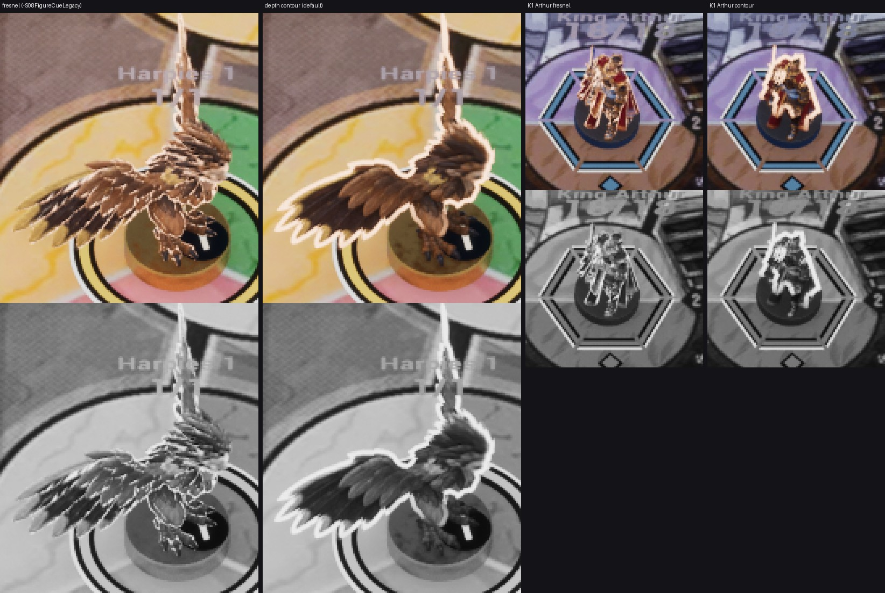
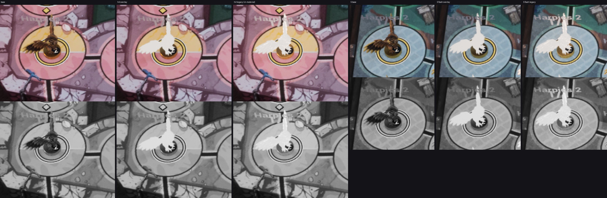

# VS-6 F2 — фигура (FX-21, FX-22, FX-23, FX-24, FX-25, IC-49 + остатки Z-2)

Шаг F2 спринта VS-6 (`docs/game-design/visual/05-production-plan.md` §3, «фигура»). Worktree `C:/tmp/wt-visual`, ветка
`feat/visual-vs6` (после F1, `fix/admin-panel` 6cbd587b влита — «Already up to date»). **Не влито.** Кадры — editor-client
`-Bench` и галерея (проверочные); приёмочные packaged `-Bench` с `RENDER`, живой бой двух клиентов, render_bench — шаг
Frames одной упаковкой (поручение: «no packaging»). Статус всех карточек — **технически импортировано**, IC-49 — принят по
делегированию для импорта (ВР-VS6-20).

## Коммиты

| коммит | что |
|---|---|
| `042a8128` | IC-49 `state-heal`: движок v3, размеры, лист VR44, контракт движения, импорт UE 18…64 px, тест IconMotion |
| `0b36c66b` | ассеты: `T_FX_HitStar_4x2`, `M_FX_FigurePrint` + `MI_FX_HitStar` / `MI_FX_Heal`, `NS_FX_HitStar`, `NS_FX_HealMotes`, `M_FX_FigureCue`; `tools/art/fx/fx_figure.py` (+ `ue_fx_figure*.py`); fx-audit |
| `e67def78` | C++ (FX-21…25, остатки Z-2, галерея), cue-table + фикстуры, ST_Hud `hud.damage.minus/plus` |
| (этот) | README карточек, листы, статусы `06-tasks/vfx.csv`, `icons.csv` |

## Что сделано (подробно — README карточек)

- **FX-21** звезда `NS_FX_HitStar` из принятой маски FX-20: квад к камере в точке ВР-FX04, диаметр 0,8 H, C+70…C+340.
- **FX-22** «−N» / «+N»: `UUmWorldDamage` в `US08ArtDamageWidget` (откат `-S08SlateHud=damage`), капсула navy, type.damage 24,
  подъём 24 su, стопка, якорь над фигурой; галерея состояний 10–13.
- **FX-23** сборка CUE-011 от кадра контакта: вспышка + звезда + обод + HitReact + «−N» + HP; урон 0 — только обод.
- **FX-24** `NS_FX_HealMotes`: 4 диска fx.heal от подставки.
- **FX-25** `FighterHealed` → CUE-012 (снимок + 200 мс или конец постановки), «+N», точки; фикстура heal-after-combat.
- **IC-49** «+» лечения (движок v3) рядом с «+N» при reduced motion.
- **Остатки Z-2:** обод — контур по глубине без внутренних складок; поле у вспышки больше не светлеет; хук живых кадров
  FX-17 / FX-19 / FX-21 / FX-25.

## Решения по делегированию (ВР-VS6, «по делегированию», 2026-10-08)

- **ВР-VS6-13** Звезда и точки — носители-квады плоскости (рецепт пыли F1, ВР-VS6-06) с мастером `M_FX_FigurePrint`, кадр
  флипбука — по ParticleRelativeTime в шейдере. У шаблона DirectionalBurst нет модуля SubUV Animation, а модули из скрипта не
  добавить; `TextureSampleParameterSubUV` мастера `M_FX_Print` без индекса кадра показывал бы только кадр 0. `MI_FX_HitStar`
  и `MI_FX_Heal` перевешены с `M_FX_Print*`, `fx_import.py` их больше не трогает. Без теста глубины, сортировка 20.
- **ВР-VS6-14** Вспышка и обод фигуры рисует оверлей `M_FX_FigureCue` (overlay material скелетного меша): обод — контур по
  глубине (16 выборок scene depth на r и r/2, порог 12 uu — силуэт и детали далеко перед другими, складки одной поверхности
  нет), вспышка — белое покрытие fx.flash × 0,82 через ту же обратную кривую тона. Свои CPD 15–17; `M_UM_Figure_v2` не
  пересобирается (Fix-группа AN-32 не тронута), его CPD 5–10 — путь отката `-S08FigureCueLegacy`. Оверлей прозрачный и не
  входит в сцену Lumen — поле у вспышки не подсвечивается. Ставится на фигуру при первом эффекте и остаётся (альфа 0
  между эффектами, без пересборки render state на каждый импульс).
- **ВР-VS6-15** Звезда сэмплится на мип ярче экранного (bias −1) с порогом покрытия 0,4: keyline 8 px ячейки (1,5–2 px на K1)
  на первом проверочном кадре пропадал.
- **ВР-VS6-16** Точек лечения всегда 4 (карточка: «4 точки (3–5 по сиду)»): кодировать число размером квада, как пыль F1,
  нельзя — шейдер берёт размер из производных, и сид дрожал бы; раскладка по индексу детерминирована.
- **ВР-VS6-17** Стопка чисел: новое — над верхним показанным на max(28 su, высота капсулы + 4 su); при 28 su капсула 36 su
  наезжала на предыдущую (первый лист галереи).
- **ВР-VS6-18** Удар без постановки (способность, истощение, каскад) показывает тот же набор, но строку диспетчера CUE-011 не
  пишет: гейт C5 связывает CUE-011 с постановкой своего seq; доказательство — `FX star plan … staged=0`.
- **ВР-VS6-19** Хук живых кадров эффекта (`-S08FxShots` или `-S08ExitShots`, нужен `-S09ShotDir`): в момент эффекта каналы
  фигуры удерживаются (`FS08FigureFxChannels::Hold`), системы FX ставятся на паузу, кадр пишется через очередь доказательств,
  затем эффект продолжается с места остановки (≥ 3 кадра и свободная очередь, тайм-аут 3 с). Кадры: 1-й удар постановки —
  `s09-fx19-flash-c20.png`, 2-й — `s09-fx21-star-c137.png`, первая защита — `s09-fx17-defense-rim.png` (событие + 270 мс),
  первое лечение — `s09-fx25-heal.png` (+200 мс). Трасса `FXSHOT hold|release`. Часы постановки не останавливаются (гейты
  C1–C6 не затронуты).
- **ВР-VS6-20** `state-heal` внесён в `ACCEPTED_VR44` после поштучного просмотра листа (как строки VS-2 A2): иначе нет импорта в
  UE и записи контракта движения; кадры K1 с `-S08ReducedMotion` — шаг Frames.
- **ВР-VS6-21** Квад точек лечения крепится к корню фигуры (сокет Base cue-table = начало фигуры у подставки) с абсолютным
  поворотом и масштабом — смотрит в камеру, даже если фигура повернётся.

## Проверки

- Сборки: UnmatchedEditor (worktree) и игровая цель `Unmatched Win64 Development` — Succeeded, без ошибок
  (`C:/tmp/visual/vs6-f2/build-*.log`).
- UE: `Unmatched.S08` + `S09` + `S10` — **528 / 528 Success**, exit 0 (`C:/tmp/visual/vs6-f2/logs/tests-2.log`), в т. ч. новые
  `Unmatched.S08.CombatFx.Star / Number / Heal / Hold`, `CueDispatcher.Table` (12 строк) / `.Fixtures`, `CueFx.*`,
  `HeroesV2.*` (FxChannelTiming), `IconMotion.Load / GalleryIds`, `S09.CombatStage.Fixtures`.
- Python: `pytest tools/s08/cue_contract tools/s08/hud_contract` — 141 passed; `cue_contract.py validate-table` PASS,
  `run-fixtures` PASS 20 / bad 0; `hud_contract.py validate` PASS; `hud_strings_build.py build` PASS; `fx_import.py --check`
  PASS; `fx_figure.py` PASS; fx_audit (в UE) ok — 5 систем.
- Поле вокруг вспышки (кольцо 6–20 px от силуэта, ΔE76 к кадру без эффекта, статичный бенч K1 / K2, ВР-Z2R-13):
  | кадр | оверлей (по умолчанию) | в материале (`-S08FigureCueLegacy`) |
  |---|---|---|
  | Marmoreal K1 вспышка | 0,54 (3–12 px: 0,81) | 2,04 (2,66) |
  | Marmoreal K1 удар (вспышка + обод) | 0,87 (1,43) | 3,69 (4,85) |
  | Marmoreal K2 вспышка | 1,28 (1,56) | 2,55 (3,24) |
  | Marmoreal K2 удар | 0,83 (1,34) | 3,37 (3,98) |
  | Sarpedon K1 гарпия A | 0,82 (1,36) | 4,62 (5,59) |
  | Sarpedon K1 гарпия B | 0,83 (1,30) | 3,40 (4,23) |
  Порог 3 выдержан везде (шум между прогонами ≈ 0,5). Средняя яркость фигуры во вспышке 0,863–0,871 (≥ 0,85).
- Цена: оверлей 184 PS-инструкции (выборки глубины — только при обводе > 0), `M_FX_FigurePrint` 221; по 1 кваду на звезду и
  на лечение. ΔGPU не мерил — FX-37 (худший набор, render_bench) после упаковки.

## Кадры, которые я открыл

`C:/tmp/visual/vs6-f2/bench/{m-a,s-a,m-base,s-base,m-legacy,s-legacy}/bench-{K1,K2x2p5}-1920x1080.png` — Marmoreal original
(нарисованный задник по умолчанию), Sarpedon original (lit3d), шесть фигур v2; кропы ×3…×4 (цвет и серый):
`crops/m-a-k1, m-a2-k1, m-a-k2, s-a-k1, rim-compare, k2-rings`; галерея `gallery/n-*` (1080p 100 %, 720p 100 % и 150 %, откат);
лист IC-49. Первые прогоны нашли: keyline звезды на K1 пропадал (ВР-VS6-15), бенч-время 70 мс давало кадр 1 вместо 2
(кадры бенча берутся на 80 / 150 мс), числа одной фигуры в стопке наезжали (ВР-VS6-17), галерея копила числа прошлых
состояний (Clear) — всё исправлено.

## Остатки и почему

1. Приёмочные кадры packaged `-Bench` с `RENDER` (все карточки), живой бой двух клиентов на обеих картах (≥ 3 удара, урон 0,
   летальный, The Holy Grail), G-CUE C5 / AU5, G-WIDGET `damage`, кадры хука FXSHOT — шаг Frames (одна упаковка). Живого
   прогона в этом шаге нет: бой требует двух клиентов, а упаковка — Frames.
2. render_bench ΔGPU (звезда ≤ 0,05 мс, точки ≤ 0,02 мс, оверлей фигур) — FX-37.
3. FX-25: HP в теге и портрете показывает новое значение с кадра снимка, а не в t0+80 (удержание HP есть только у цели боя);
   звук лечения `CMB-HEAL` / `CMB-HEAL-GRAIL` звучит в кадр снимка (`S08FlowGameModeAudio`), а не в кадр показа — перенос к
   показу — чату звука.
4. FX-22: на экране одна капсула (самый новый seq среди фигур); одновременные числа у разных фигур (каскад) не показываются
   вместе — как до F2.
5. Мировые подписи «King Arthur 18/18» в бенче `-ArtPreview` (остаток Z-2, проверка против ВР-07) не трогал.
