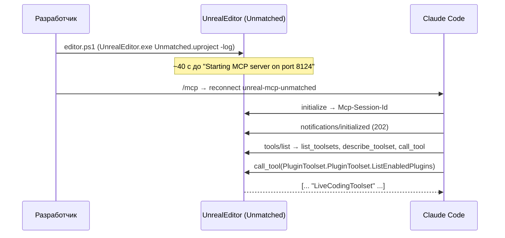
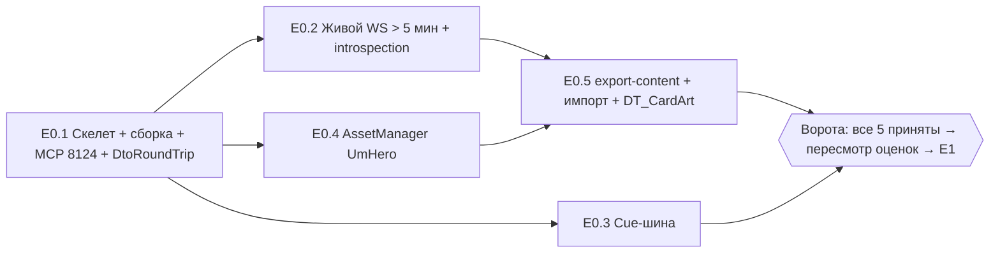

# 02. Проект, тулчейн, конфиги, Unreal MCP, фаза 0 (спайки)

> Статус: спецификация к исполнению. Дата: 2026-09-02. Ветка: `fix/admin-panel`.
> Закон — ADR `docs/unreal/01-architecture-decision.md` (далее «ADR»). Имена модулей, классов, файлов, ассетов, тегов и ключей ini берутся из ADR §3 без переименований. Всё, чего ADR не покрывает, помечено «(уточнение к ADR)» и решено в его духе.
> Обозначения: `$UE` = `C:\Program Files\Epic Games\UE_5.8\Engine` (UE 5.8.2, CL 56702186 — `$UE/Build/Build.version`); `$REPO` = `C:\Users\ren\WebstormProjects\unmached\unmached`; `$PROJ` = `$REPO\unreal\Unmatched`. Ссылки `файл:строка` — на исходники UE/бэкенда, прочитанные напрямую; `R8 §2.14` — research-файлы `docs/unreal/_research/`; `К1 §5.2` — кандидаты `docs/unreal/_design/`.
> Живой бэкенд (`localhost:3000`), Docker и редактор с MCP в сессии написания недоступны — всё, что зависит от них, помечено «требует живой проверки» и собрано в §11.

---

## 0. Назначение и границы раздела

**Что даёт раздел.** Полностью воспроизводимую процедуру, после которой существует каталог `$REPO/unreal/` с проектом `Unmatched.uproject`, четырьмя модулями, точными `Config/*.ini`, работающей сборкой из командной строки и Live Coding, MCP-сервером на порту 8124, git/LFS-правилами и Node-пакетом `unreal/Tools/`, а также пять спайков фазы 0 (E0.1–E0.5, ADR §9.1) с пошаговыми процедурами и критериями приёмки. Всё это — ворота перед эпиками MVP (ADR §2.3 G1, §9.2).

**Чего раздел не делает.** Не проектирует сетевой слой, модель контракта, состояние, UI, презентацию и контент — только создаёт для них скелет и подтверждает спайками ключевые риски. Код спайков — минимальный и одноразовый (кроме указанного «остаётся в проекте»).

**Связи** (нумерация последующих планов — по эпикам ADR §9.2; см. допущение А1 в §11):

| Раздел | Что берёт отсюда | Что отдаёт сюда |
|---|---|---|
| ADR §1, §3, §5.8, §9.1 | — (источник всех имён) | имена модулей/классов/ключей, состав плагинов, список спайков |
| Сеть (`UmNet`, эпики E1–E2) | `UmNet.Build.cs`, `UUmNetSettings` и ключи `[/Script/UmNet.UmNetSettings]`, факт авто-pong LWS (E0.2), `ini`-ключи `[WebSockets]` | `FUmGraphQLWsClient`, на который заменяется спайк-код E0.2 |
| Модель (`UmModel`, E3) | `UmModel.Build.cs`, spec `Unmatched.Model.DtoRoundTrip` (E0.1), снимок `unreal/Schema/schema.introspection.json` (E0.2), `unreal/Tools/ops-check.mjs` (каркас) | `FUmCardArtRow` для `DT_CardArt` (E0.5), `UmTags` для E0.3 |
| Состояние и контент (`UmClient/State`, `Content`, E4, E8) | `UUmHeroDefinition`/`UUmBoardDefinition` + `PrimaryAssetTypesToScan` (E0.4), `export-content.mjs` и импорт (E0.5), `UUmClientSettings` | правила фасада Baked → Runtime → Placeholder |
| UI/презентация (E5–E7) | cue-шина `UUmMatchCueSubsystem` + `DA_UmCueRegistry` + `CUE_Fighter_Move` (E0.3), `GameViewportClientClassName`, `CommonInputSettings`, `L_Main` | — |
| Тесты и dev-loop (E9) | CLI-прогон тестов, `AutomationTestToolset`, `LogsToolset`, `unreal/Tools/*.ps1`, правила параллельной работы агентов через MCP | E2E-набор, `UUmMockBackend` |
| Дорожная карта | задачи `T-02-NN` (§10), пересмотр оценок после фазы 0 | — |

---

## 1. Расположение проекта и `.uproject`

### 1.1. Пути

| Путь | Назначение | Источник |
|---|---|---|
| `$REPO/unreal/` | корень UE-части монорепозитория; сейчас **не существует** (проверено `ls`) | ADR §3.1 |
| `$REPO/unreal/Unmatched/Unmatched.uproject` | единственный `.uproject`; свой обязателен — MCP-сервер привязан к одному открытому проекту | ADR §3.1; `00-mcp-verification.md:60` |
| `$PROJ/Source/` | `Unmatched.Target.cs`, `UnmatchedEditor.Target.cs`, модули `UmNet`, `UmModel`, `UmClient`, `UmEditor` | ADR §3.3 |
| `$PROJ/Config/` | `DefaultEngine.ini`, `DefaultGame.ini`, `DefaultGameplayTags.ini`, `DefaultInput.ini`, `DefaultEditorPerProjectUserSettings.ini` | ADR §3.5; §3 ниже |
| `$PROJ/Content/` | дерево ADR §3.4 (см. §7) | ADR §3.4 |
| `$PROJ/Tests/Fixtures/{state,rules}/` | фикстуры для spec-тестов | ADR §3.7 |
| `$REPO/unreal/Ops/*.graphql` | документы операций (единственный источник) | ADR §3.7 |
| `$REPO/unreal/Schema/schema.introspection.json` | снимок introspection живого сервера (снимается в E0.2) | ADR §3.7, G2 |
| `$REPO/unreal/Tools/` | Node-пакет (скрипты экспорта/проверок) и `*.ps1`-обёртки сборки (уточнение к ADR, §4.5) | ADR §3.7 |
| `$REPO/unreal/Import/` | выход `export-content.mjs`/`export-ability-table.ts`; **в `.gitignore`** | ADR §3.7 |
| `C:\Users\ren\Documents\Unreal Projects\MCPProject\` | хост-проект MCP на порту 8123; не трогать, может быть открыт параллельно | `00-mcp-verification.md:9,12` |

### 1.2. `Unmatched.uproject` (дословно из ADR §3.1)

```json
{
  "FileVersion": 3,
  "EngineAssociation": "5.8",
  "Category": "Game",
  "Description": "Unmatched digital client (server-authoritative GraphQL client)",
  "Modules": [
    { "Name": "UmNet",    "Type": "Runtime", "LoadingPhase": "PreDefault" },
    { "Name": "UmModel",  "Type": "Runtime", "LoadingPhase": "PreDefault" },
    { "Name": "UmClient", "Type": "Runtime", "LoadingPhase": "Default",
      "AdditionalDependencies": ["Engine", "CoreUObject", "UMG", "CommonUI", "UmNet", "UmModel"] },
    { "Name": "UmEditor", "Type": "Editor",  "LoadingPhase": "PostEngineInit" }
  ],
  "Plugins": [
    { "Name": "CommonUI",               "Enabled": true },
    { "Name": "EnhancedInput",          "Enabled": true },
    { "Name": "PlatformCrypto",         "Enabled": true },
    { "Name": "ModelContextProtocol",   "Enabled": true, "TargetAllowList": ["Editor"] },
    { "Name": "AllToolsets",            "Enabled": true, "TargetAllowList": ["Editor"] },
    { "Name": "LiveCodingToolset",      "Enabled": true, "TargetAllowList": ["Editor"] },
    { "Name": "FunctionalTestingEditor","Enabled": true, "TargetAllowList": ["Editor"] },
    { "Name": "Paper2D",                "Enabled": false },
    { "Name": "ModelViewViewModel",     "Enabled": false },
    { "Name": "GameFeatures",           "Enabled": false },
    { "Name": "DataRegistry",           "Enabled": false },
    { "Name": "GameplayAbilities",      "Enabled": false }
  ]
}
```

Факты, подтверждённые по дескрипторам плагинов:

| Плагин | Факт | Источник |
|---|---|---|
| `ModelContextProtocol` | `IsExperimentalVersion: true`, `EnabledByDefault: false`, `NoRedist: true`; модули `ModelContextProtocol`, `ModelContextProtocolEngine` (Runtime), `ModelContextProtocolEditor` (Editor) + тестовые; зависит от `EngineAssetDefinitions`, `ToolsetRegistry` | `$UE/Plugins/Experimental/ModelContextProtocol/ModelContextProtocol.uplugin` |
| `AllToolsets` | агрегатор; `EditorOnly: true`; включает 21 тулсет: AIModule, AnimationAssistant, AutomationTest, ConfigSettings, Conversation, DataRegistry, DataflowAgent, EditorToolset, GameFeatures, GameplayTags, GAS, MCPClient, Niagara, PCG, Physics, Plugin, SemanticSearch, SlateInspector, StateTree, UMGToolSet, WorldConditions. **`LiveCodingToolset` в списке нет** | `$UE/Plugins/Experimental/Toolsets/AllToolsets/AllToolsets.uplugin` |
| `LiveCodingToolset` | `EditorOnly: true`, `IsExperimentalVersion: true`, `EnabledByDefault: false`; модули `LiveCodingToolset` (Editor, PostEngineInit), `LiveCodingToolsetTests`; зависит от `ToolsetRegistry`; единственный инструмент — `CompileLiveCoding()` («Live Coding must be enabled in Editor Preferences») | `$UE/Plugins/Experimental/Toolsets/LiveCodingToolset/LiveCodingToolset.uplugin`; `Source/LiveCodingToolset/Public/LiveCodingToolset.h:20-27` |
| `PlatformCrypto` | модули `PlatformCrypto`, `PlatformCryptoTypes`, `PlatformCryptoContext` (все `RuntimeAndProgram`); `PlatformCrypto` публично зависит от двух остальных | `$UE/Plugins/Experimental/PlatformCrypto/PlatformCrypto.uplugin:20-53`; `Source/PlatformCrypto/PlatformCrypto.Build.cs:9-14` |
| `CommonUI` | `EnabledByDefault: false`, `IsBetaVersion: false` | R8 §2.6 |

`"TargetAllowList": ["Editor"]` означает, что плагин не попадёт в Game/Client-таргеты и cooked-сборку (ADR §1.2 п.3). Транзитивная зависимость `ToolsetRegistry` включается движком автоматически по дескрипторам — явно в `.uproject` не нужна.

### 1.3. Таргеты (`Source/*.Target.cs`)

Форма — по шаблону движка 5.8 (`$UE/../Templates/TP_ThirdPerson/Source/TP_ThirdPerson.Target.cs`, `TP_ThirdPersonEditor.Target.cs`): `BuildSettingsVersion.V7`, `EngineIncludeOrderVersion.Unreal5_8`.

```csharp
// Source/Unmatched.Target.cs
using UnrealBuildTool;
using System.Collections.Generic;

public class UnmatchedTarget : TargetRules
{
    public UnmatchedTarget(TargetInfo Target) : base(Target)
    {
        Type = TargetType.Game;
        DefaultBuildSettings = BuildSettingsVersion.V7;
        IncludeOrderVersion = EngineIncludeOrderVersion.Unreal5_8;
        ExtraModuleNames.AddRange(new string[] { "UmNet", "UmModel", "UmClient" });
    }
}
```

```csharp
// Source/UnmatchedEditor.Target.cs
using UnrealBuildTool;
using System.Collections.Generic;

public class UnmatchedEditorTarget : TargetRules
{
    public UnmatchedEditorTarget(TargetInfo Target) : base(Target)
    {
        Type = TargetType.Editor;
        DefaultBuildSettings = BuildSettingsVersion.V7;
        IncludeOrderVersion = EngineIncludeOrderVersion.Unreal5_8;
        ExtraModuleNames.AddRange(new string[] { "UmNet", "UmModel", "UmClient", "UmEditor" });
    }
}
```

Таргеты `UnmatchedClient`/`UnmatchedServer` не создаются: MVP — Development Editor + Development Client на Win64 (ADR §1.2 п.2); «Client» здесь — конфигурация игрового таргета `Unmatched` (`-clientconfig=Development` в `BuildCookRun`, §4.2), отдельный `TargetType.Client` не нужен, т.к. серверной части в UE нет.

### 1.4. Дерево, создаваемое в E0.1

```
unreal/
  .gitignore                      # §6.1
  .gitattributes                  # §6.2
  Ops/                            # пусто до эпика E3; .gitkeep
  Schema/                         # schema.introspection.json (E0.2)
  Tools/                          # package.json, *.mjs, *.ts, *.ps1 (§4.5, §8)
  Import/                         # gitignored; создаётся скриптами
  Unmatched/
    Unmatched.uproject
    Source/
      Unmatched.Target.cs
      UnmatchedEditor.Target.cs
      UmNet/    UmNet.Build.cs,    Public/, Private/UmNetModule.cpp,    Private/Tests/
      UmModel/  UmModel.Build.cs,  Public/, Private/UmModelModule.cpp,  Private/Tests/
      UmClient/ UmClient.Build.cs, Public/, Private/UmClientModule.cpp, Private/Tests/, Private/Dev/
      UmEditor/ UmEditor.Build.cs, Public/, Private/UmEditorModule.cpp
    Config/                       # §3
    Content/                      # папки §7.1 (пустые папки UE не хранит — создаются тулсетом при первом ассете)
    Tests/Fixtures/state/, Tests/Fixtures/rules/
```

Имена файлов модулей (`Um*Module.cpp`) ADR не задаёт — (уточнение к ADR).

---

## 2. Модули и `Build.cs`

### 2.1. Зависимости (ADR §3.2, §4.0)

```mermaid
flowchart LR
  BP["Blueprint / UMG (WBP_*, BP_*)"] --> UmClient
  UmClient --> UmNet
  UmClient --> UmModel
  UmModel --> GT["GameplayTags (engine)"]
  UmEditor --> UmClient
  UmEditor --> UmModel
  UmNet -.x.- UmModel
```

Правила: `UmNet` и `UmModel` не знают друг о друге; `UmClient` — единственное место встречи транспорта и модели; `UmEditor` — только редактор, в cooked-сборку не попадает (ADR §3.2, §4.0).

### 2.2. `Build.cs` (полные)

```csharp
// Source/UmNet/UmNet.Build.cs
using UnrealBuildTool;

public class UmNet : ModuleRules
{
    public UmNet(ReadOnlyTargetRules Target) : base(Target)
    {
        PCHUsage = PCHUsageMode.UseExplicitOrSharedPCHs;

        PublicDependencyModuleNames.AddRange(new string[] {
            "Core", "CoreUObject", "Engine",
            "HTTP", "WebSockets", "Json", "JsonUtilities",
            "PlatformCrypto", "DeveloperSettings"
        });

        // (уточнение к ADR) ADR §3.2 называет «PlatformCryptoOpenSSL в Private»; такого модуля в плагине нет.
        // EncryptionContextOpenSSL.h живёт в PlatformCryptoContext (R8 §2.10), типы — в PlatformCryptoTypes.
        PrivateDependencyModuleNames.AddRange(new string[] {
            "PlatformCryptoTypes", "PlatformCryptoContext"
        });

        // DPAPI (CryptProtectData) для FUmSecureStore_Windows — ADR §4.1. (уточнение к ADR: библиотека)
        if (Target.Platform == UnrealTargetPlatform.Win64)
        {
            PublicSystemLibraries.Add("crypt32.lib");
        }
    }
}
```

```csharp
// Source/UmModel/UmModel.Build.cs
using UnrealBuildTool;

public class UmModel : ModuleRules
{
    public UmModel(ReadOnlyTargetRules Target) : base(Target)
    {
        PCHUsage = PCHUsageMode.UseExplicitOrSharedPCHs;

        PublicDependencyModuleNames.AddRange(new string[] {
            "Core", "CoreUObject", "Engine", "Json", "JsonUtilities", "GameplayTags"
        });
        // Никаких UmNet, субсистем, виджетов — ADR §3.2.
    }
}
```

```csharp
// Source/UmClient/UmClient.Build.cs
using UnrealBuildTool;

public class UmClient : ModuleRules
{
    public UmClient(ReadOnlyTargetRules Target) : base(Target)
    {
        PCHUsage = PCHUsageMode.UseExplicitOrSharedPCHs;

        PublicDependencyModuleNames.AddRange(new string[] {
            "Core", "CoreUObject", "Engine", "InputCore", "EnhancedInput",
            "UMG", "Slate", "SlateCore", "CommonUI", "CommonInput",
            "GameplayTags", "FieldNotification", "ImageWrapper", "DeveloperSettings",
            "UmNet", "UmModel"
        });

        // (уточнение к ADR) C++-наследники AFunctionalTest (FT_Um_*, ADR §4.8) — только вне Shipping.
        if (Target.Configuration != UnrealTargetConfiguration.Shipping)
        {
            PrivateDependencyModuleNames.Add("FunctionalTesting");
        }
    }
}
```

```csharp
// Source/UmEditor/UmEditor.Build.cs
using UnrealBuildTool;

public class UmEditor : ModuleRules
{
    public UmEditor(ReadOnlyTargetRules Target) : base(Target)
    {
        PCHUsage = PCHUsageMode.UseExplicitOrSharedPCHs;

        PublicDependencyModuleNames.AddRange(new string[] {
            "Core", "CoreUObject", "Engine",
            "UnrealEd", "AssetTools", "EditorSubsystem",
            "UmModel", "UmClient"
        });
    }
}
```

### 2.3. Файлы модулей и категории логов

Категории логов — по ADR §3.6: `LogUmNet`, `LogUmAuth` (в `UmNet`), `LogUmModel` (в `UmModel`), `LogUmSync`, `LogUmContent`, `LogUmUI`, `LogUmPresent` (в `UmClient`). Объявления — в публичных заголовках `UmNetLog.h`, `UmModelLog.h`, `UmClientLog.h` (`DECLARE_LOG_CATEGORY_EXTERN(LogUmNet, Log, All)`), определения — в `Um*Module.cpp` (уточнение к ADR: имена заголовков).

```cpp
// Source/UmClient/Private/UmClientModule.cpp
#include "UmClientLog.h"
#include "Modules/ModuleManager.h"

DEFINE_LOG_CATEGORY(LogUmSync);
DEFINE_LOG_CATEGORY(LogUmContent);
DEFINE_LOG_CATEGORY(LogUmUI);
DEFINE_LOG_CATEGORY(LogUmPresent);

IMPLEMENT_PRIMARY_GAME_MODULE(FDefaultGameModuleImpl, UmClient, "UmClient");   // ADR §3.1: primary game module
```

`UmNet`, `UmModel`, `UmEditor` — `IMPLEMENT_MODULE(FDefaultModuleImpl, <Имя>);`. Форма макроса — как в шаблоне `$UE/../Templates/TP_ThirdPerson/Source/TP_ThirdPerson/TP_ThirdPerson.cpp`.

### 2.4. Классы настроек (`UDeveloperSettings`)

Ключи `DefaultGame.ini` ADR §3.5 читаются классами с `Config=Game, DefaultConfig` — иначе секция `[/Script/UmNet.UmNetSettings]` не найдёт файл. Имена свойств = имена ключей (регистр важен).

```cpp
// Source/UmNet/Public/UmNetSettings.h
UCLASS(Config=Game, DefaultConfig, meta=(DisplayName="Unmatched Net"))
class UMNET_API UUmNetSettings : public UDeveloperSettings
{
    GENERATED_BODY()
public:
    UPROPERTY(Config, EditAnywhere, Category="Endpoint") FString ApiBaseUrl = TEXT("http://localhost:3000");
    UPROPERTY(Config, EditAnywhere, Category="Endpoint") FString GraphQLPath = TEXT("/graphql");
    UPROPERTY(Config, EditAnywhere, Category="Http")     float  HttpTimeoutSec = 15.f;
    UPROPERTY(Config, EditAnywhere, Category="Ws")       float  WsConnectionAckTimeoutSec = 5.f;
    UPROPERTY(Config, EditAnywhere, Category="Ws")       int32  WsReconnectMaxAttempts = 5;
    UPROPERTY(Config, EditAnywhere, Category="Ws")       int32  WsReconnectBaseDelayMs = 1000;
    UPROPERTY(Config, EditAnywhere, Category="Ws")       float  WsAppPingIntervalSec = 10.f;
    UPROPERTY(Config, EditAnywhere, Category="Auth")     float  ProactiveRefreshLeadSec = 300.f;

    FString HttpUrl() const;   // ApiBaseUrl + GraphQLPath
    FString WsUrl() const;     // http→ws, https→wss (R8 §3.1 п.3)
};
```

`UUmClientSettings` (`Source/UmClient/Public/UmClientSettings.h`) — аналогично, поля из ADR §3.5: `AssetBaseUrl`, `DefaultBoardName`, `DefenseTimeoutSec`, `AttackerAutoResolveDelaySec`, `DefenderResolveButtonDelaySec`, `RefreshFullStateDebounceMs`, `bMatchmakingEnabled`, `bPresenceEnabled`, `bVsAiEnabled`, `bMockBackend`; плюс (уточнение к ADR, нужно E0.3) `TSoftObjectPtr<UUmCueRegistry> CueRegistry` с ключом `CueRegistry=/Game/Cues/DA_UmCueRegistry.DA_UmCueRegistry`.

### 2.5. Тесты в модулях

`Private/Tests/*.spec.cpp` под `#if WITH_DEV_AUTOMATION_TESTS`; имена `Unmatched.<Net|Model|Client|E2E>.<Suite>` (ADR §3.2, §3.6). Флаги: `EAutomationTestFlags::ProductFilter | EAutomationTestFlags_ApplicationContextMask` (R8 §2.11: `AutomationTest.h:129-149`; К1 §6.1). Отдельные тестовые модули не создаются (ADR §3.2).

---

## 3. `Config/` — полные файлы

Важное правило: секция `[/Script/<Модуль>.<Класс>]` читается из того ini, который указан в `UCLASS(config=…)` класса; секция в «чужом» файле игнорируется. Отсюда два уточнения к ADR §3.5 (ключи и значения — без изменений, меняется только файл):

| Секция | `UCLASS(config=…)` | Файл | Источник |
|---|---|---|---|
| `[/Script/Engine.AssetManagerSettings]` | `config = Game, defaultconfig` | **`DefaultGame.ini`** (ADR §3.5 показывает её в `DefaultEngine.ini`; собственная ссылка ADR — `BaseGame.ini:254-255`) | `$UE/Source/Runtime/Engine/Classes/Engine/AssetManagerSettings.h:66`; `$UE/Config/BaseGame.ini:254-255` |
| `[/Script/CommonInput.CommonInputSettings]` | `config = Game, defaultconfig` | **`DefaultGame.ini`** | `$UE/Plugins/Runtime/CommonUI/Source/CommonInput/Public/CommonInputSettings.h:24` |
| `[/Script/EngineSettings.GameMapsSettings]` | `config=Engine, defaultconfig` | `DefaultEngine.ini` | `GameMapsSettings.h:100`; `BaseEngine.ini:12-13` |
| `[/Script/Engine.Engine]` | — | `DefaultEngine.ini` | `BaseEngine.ini:130-132` |
| `[/Script/GameplayTags.GameplayTagsSettings]` | `config=GameplayTags, defaultconfig` | `DefaultGameplayTags.ini` | `$UE/Source/Runtime/GameplayTags/Classes/GameplayTagsSettings.h:102-109` |
| `[/Script/ModelContextProtocolEngine.ModelContextProtocolSettings]` | `config=EditorPerProjectUserSettings` | `DefaultEditorPerProjectUserSettings.ini` | `$UE/Plugins/Experimental/ModelContextProtocol/Source/ModelContextProtocolEngine/Public/ModelContextProtocolSettings.h:17` |
| `[/Script/LiveCoding.LiveCodingSettings]` | `config=EditorPerProjectUserSettings` | `DefaultEditorPerProjectUserSettings.ini` | `$UE/Source/Developer/Windows/LiveCoding/Private/LiveCodingSettings.h:17` |

### 3.1. `DefaultEngine.ini`

```ini
[/Script/EngineSettings.GameMapsSettings]
GameInstanceClass=/Script/UmClient.UmGameInstance
GameDefaultMap=/Game/Maps/L_Main.L_Main
EditorStartupMap=/Game/Maps/L_Main.L_Main
GlobalDefaultGameMode=/Game/Core/BP_UmGameMode.BP_UmGameMode_C

[/Script/Engine.Engine]
GameViewportClientClassName=/Script/UmClient.UmGameViewportClient

[WebSockets]
TextMessageMemoryLimit=8388608

[WebSockets.LibWebSockets]
PingPongInterval=10

[HTTP]
HttpConnectionTimeout=15
HttpActivityTimeout=20
```

| Ключ | Почему именно так | Источник |
|---|---|---|
| `GameInstanceClass` в `GameMapsSettings` | принадлежит `UGameMapsSettings`, не `[/Script/Engine.Engine]` (ошибка К3 F2) | ADR §2.4 F2; `GameMapsSettings.h:203`; `BaseEngine.ini:13` |
| `EditorStartupMap` | (уточнение к ADR) чтобы редактор и `StartPIE` открывали `L_Main` без параметров | `BaseEngine.ini:14` |
| `GameViewportClientClassName` | точное имя свойства (ошибка К3 F1); `UUmGameViewportClient : UCommonGameViewportClient` обязателен для input routing CommonUI | ADR §2.4 F1; `Engine.h:807`; `BaseEngine.ini:132`; R8 §2.6 |
| `TextMessageMemoryLimit=8388608` | дефолт 1 МБ (`BaseEngine.ini:80`); при превышении LWS закрывает сокет | ADR §3.5; R8 §2.3 (`LwsWebSocket.cpp:313-318`) |
| `PingPongInterval=10` | дефолт 0 (`BaseEngine.ini:87`); страховка от `terminate()` сервера через ≈24 с; `PingPongInterval=0` К2 отвергнут (F9) | ADR §2.4 F9; R8 §2.3 (`LwsWebSocketsManager.cpp:192-194`) |
| `[HTTP]` таймауты | тотального таймаута нет (`HttpTotalTimeout=0`) — задаётся `SetTimeout` в коде | ADR §3.5; R8 §2.2 |

Ссылки на `L_Main`/`BP_UmGameMode` до их создания дают предупреждение в логе, не ошибку; создаются в E0.1 шаг 9.

### 3.2. `DefaultGame.ini`

```ini
[/Script/EngineSettings.GeneralProjectSettings]
ProjectID=<GUID, сгенерировать один раз: [guid]::NewGuid() в PowerShell, формат без скобок в верхнем регистре>
ProjectName=Unmatched
ProjectVersion=0.0.1

[/Script/UmNet.UmNetSettings]
ApiBaseUrl=http://localhost:3000
GraphQLPath=/graphql
HttpTimeoutSec=15
WsConnectionAckTimeoutSec=5
WsReconnectMaxAttempts=5
WsReconnectBaseDelayMs=1000
WsAppPingIntervalSec=10
ProactiveRefreshLeadSec=300

[/Script/UmClient.UmClientSettings]
AssetBaseUrl=http://localhost:5174
DefaultBoardName=Cobble City
DefenseTimeoutSec=30
AttackerAutoResolveDelaySec=1.5
DefenderResolveButtonDelaySec=5
RefreshFullStateDebounceMs=300
bMatchmakingEnabled=False
bPresenceEnabled=False
bVsAiEnabled=False
bMockBackend=False
CueRegistry=/Game/Cues/DA_UmCueRegistry.DA_UmCueRegistry

[/Script/UnrealEd.ProjectPackagingSettings]
+CulturesToStage=en
+CulturesToStage=ru

[/Script/CommonInput.CommonInputSettings]
InputData=/Game/UI/Input/DA_UmCommonInputData.DA_UmCommonInputData_C
bEnableEnhancedInputSupport=False

[/Script/Engine.AssetManagerSettings]
+PrimaryAssetTypesToScan=(PrimaryAssetType="UmHero",AssetBaseClass=/Script/UmClient.UmHeroDefinition,bHasBlueprintClasses=False,bIsEditorOnly=False,Directories=((Path="/Game/Heroes")),SpecificAssets=,Rules=(Priority=-1,ChunkId=-1,bApplyRecursively=True,CookRule=Unknown))
+PrimaryAssetTypesToScan=(PrimaryAssetType="UmBoard",AssetBaseClass=/Script/UmClient.UmBoardDefinition,bHasBlueprintClasses=False,bIsEditorOnly=False,Directories=((Path="/Game/Boards")),SpecificAssets=,Rules=(Priority=-1,ChunkId=-1,bApplyRecursively=True,CookRule=Unknown))
```

| Ключ | Пояснение | Источник |
|---|---|---|
| `AssetBaseUrl=http://localhost:5174` | корневые `/assets/…` раздаёт Vite-фронт на **5174** (не 5173, как в README и `FRONTEND_URL` compose) | ADR §3.5; память проекта; `docker-compose.yml` (`FRONTEND_URL: http://localhost:5173`) |
| `InputData=…_C` | `TSoftClassPtr<UCommonUIInputData>` — ссылка на Blueprint-класс, суффикс `_C` | `CommonInputSettings.h:82` |
| `bEnableEnhancedInputSupport=False` | интеграция CommonUI ↔ EI — Experimental, «not recommended to ship» | ADR §7; R8 §2.7; `CommonInputSettings.h:114` |
| `+PrimaryAssetTypesToScan` | `+` добавляет к списку `BaseGame.ini` (`Map`, `PrimaryAssetLabel`); `Directories=((Path="/Game/Heroes"))` — `/Game` уже соответствует `Content/` (ошибка К3 F7); поля — `FPrimaryAssetTypeInfo` | ADR §2.4 F7; `BaseGame.ini:254-255`; `AssetManagerTypes.h:130-180` |
| `+CulturesToStage` | en/ru | ADR §3.5; R8 §2.12 (`BaseGame.ini:111-112`) |
| `ProjectID` | (уточнение к ADR) обязательное поле, иначе редактор сам допишет секцию при первом сохранении настроек | стандартное поведение `UGeneralProjectSettings` |

Булевы значения ADR (`false`) записаны как `False` — стандартная запись UE; парсер принимает оба варианта.

### 3.3. `DefaultGameplayTags.ini`

```ini
[/Script/GameplayTags.GameplayTagsSettings]
ImportTagsFromConfig=False
WarnOnInvalidTags=True
```

Нативные теги объявляются только в C++ (`UmModel/Public/UmTags.h` + `UmTags.cpp`, `UE_DECLARE_GAMEPLAY_TAG_EXTERN`/`UE_DEFINE_GAMEPLAY_TAG` — макросы только в `.cpp`, `$UE/Source/Runtime/GameplayTags/Public/NativeGameplayTags.h:31-41`); список `+GameplayTagList` пуст, чтобы источник тегов был один (ADR §3.5). `WarnOnInvalidTags=True` — (уточнение к ADR) ловит опечатки в `FGameplayTagQuery` ассетов (`GameplayTagsSettings.h:112-113`).

### 3.4. `DefaultInput.ini`

```ini
[/Script/Engine.InputSettings]
DefaultPlayerInputClass=/Script/EnhancedInput.EnhancedPlayerInput
DefaultInputComponentClass=/Script/EnhancedInput.EnhancedInputComponent
```

(уточнение к ADR) Редакторский модуль EI выставляет эти классы сам (`EnhancedInputEditorModule.cpp:348,357`, R8 §2.7), но при первом запуске в `-NullRHI`/Cmd-режиме порядок инициализации не гарантирован — фиксируем явно. Ассеты `IA_*`/`IMC_*` — по ADR §3.4, создаются в E5–E6.

### 3.5. `DefaultEditorPerProjectUserSettings.ini`

```ini
[/Script/ModelContextProtocolEngine.ModelContextProtocolSettings]
ServerUrlPath=/mcp
ServerPortNumber=8124
bAutoStartServer=True
bEnableToolSearch=True

[/Script/LiveCoding.LiveCodingSettings]
bEnabled=True
Startup=AutomaticButHidden
bEnableReinstancing=True
bAutomaticallyCompileNewClasses=True
```

| Ключ | Пояснение | Источник |
|---|---|---|
| `ServerPortNumber=8124` | 8123 занят `MCPProject` (`…/MCPProject/Config/DefaultEditorPerProjectUserSettings.ini`: `ServerPortNumber=8123`); дефолт плагина 8000 | ADR G20, F22; `ModelContextProtocolSettings.h:38` |
| `bEnableToolSearch=True` | `tools/list` отдаёт только `list_toolsets`, `describe_toolset`, `call_tool` | `ModelContextProtocolSettings.h:45`; `00-mcp-verification.md:29` |
| `[/Script/LiveCoding.LiveCodingSettings] bEnabled=True` | (уточнение к ADR) движковый дефолт `bEnabled=False` (`$UE/Config/BaseEditorPerProjectUserSettings.ini:983-987`); без этого `CompileLiveCoding()` отказывает («Live Coding must be enabled in Editor Preferences») | `LiveCodingToolset.h:24-25`; `LiveCodingSettings.h:23-33` |
| `Startup=AutomaticButHidden` | сессия Live Coding стартует с редактором, консоль скрыта | `LiveCodingSettings.h:10-14` |

Файл — проектный дефолт per-user настроек; пользовательские правки редактор пишет в `Saved/Config/WindowsEditor/EditorPerProjectUserSettings.ini` (в `.gitignore`), дефолт при этом не портится.

### 3.6. Как править ini

- Файлы правятся напрямую (агент — через `Write`/`Edit`) **или** тулсетом `ConfigSettingsToolset`: `ListContainers()`, `ListCategories(Container)`, `ListSections(Container, Category)`, `GetSectionSchema(...)`, `GetSectionPropertyValues(...)`, `SetSectionProperties(...)`, `SaveSection(...)`, `ResetSectionToDefaults(...)` (`$UE/Plugins/Experimental/Toolsets/ConfigSettingsToolset/Source/ConfigSettingsToolset/Private/ConfigSettingsToolset.h:24-125`). Тулсет работает только с классами, зарегистрированными в Project Settings (`UDeveloperSettings`, `defaultconfig`); секции `[WebSockets]`, `[HTTP]` — только файлом.
- Изменение `.uproject` (плагины, модули) и `*.Build.cs`/`*.Target.cs` требует **закрыть редактор** и пересобрать `Build.bat` (§4.3); ini-правки `defaultconfig`-классов подхватываются при рестарте редактора; `[WebSockets.*]` читаются при загрузке модуля `WebSockets`.

---

## 4. Тулчейн

### 4.1. Требования и состояние машины

| Компонент | Требование UE 5.8 | Состояние на 2026-09-02 (проверено) | Источник |
|---|---|---|---|
| MSVC | минимум 14.38.33130; предпочтительно 14.50.35717+ (VS2026 18.0) или 14.44.35207+ (VS2022 17.14); **запрещены** 14.50.0–14.50.35722, **14.44.0–14.44.35210**, 14.40–14.43, 14.39.x | `C:\Program Files (x86)\Microsoft Visual Studio\2022\BuildTools` (17.14.38) с MSVC **14.44.35207** — попадает в запрещённый диапазон (`//03.2`: «VS2022 17.14.0 – 17.4.3: Template compile error. Resolved with 14.44.35211»); `C:\Program Files\Microsoft Visual Studio\18\Insiders` с MSVC **14.51.36231** — не запрещён, ≥ минимума, но вне «preferred» диапазонов и в канале Preview | `$UE/Config/Windows/Windows_SDK.json` (`PreferredVisualCppVersions`, `BannedVisualCppVersions`, `MinimumVisualCppVersion`); `ls` каталогов VS |
| Windows SDK | `MainVersion 10.0.22621.0`, min 10.0.19041.0 | установлены 10.0.22621.0, 10.0.26100.0, 10.0.28000.0 | `Windows_SDK.json`; `C:\Program Files (x86)\Windows Kits\10\Include` |
| .NET | `Build.bat` использует **встроенный** SDK `$UE/Binaries/ThirdParty/DotNet/10.0/win-x64` (`UE_USE_SYSTEM_DOTNET=1` — переключение на системный) | встроенный есть; системный `dotnet 10.0.300` тоже установлен | `$UE/Build/BatchFiles/GetDotnetPath.bat:2-19`; `dotnet --list-sdks` |
| IDE | не требуется: UBT/`Build.bat` + Live Coding работают без VS GUI (Build Tools достаточно) | VS GUI нет; Rider/VS Code — по желанию | R8 §2.14, §3.9 п.1 |
| Node | скрипты `unreal/Tools` | Node v24.18.0, npm 11.16.0 | `node --version` |
| Git LFS | для `*.uasset`/`*.umap` | git-lfs 3.6.1, фильтры `filter.lfs.*` уже в конфиге репозитория | `git lfs version`; `git config --get filter.lfs.clean` |

**Поведение UBT при выборе тулчейна** (важно для E0.1):

- Запрещённая версия помечается ошибкой «UnrealBuildTool has banned the MSVC {range} toolchains due to compiler issues…» (`$UE/Source/Programs/UnrealBuildTool/Platform/Windows/MicrosoftPlatformSDK.cs:1156-1159`); установка с такой ошибкой не выбирается, если есть другая.
- Не-preferred, но допустимая версия — по умолчанию только сообщение (`ToolchainVersionWarningLevel = WarningLevel.Warning`, `UEBuildWindows.cs:379-382`): «compiler version … is newer than latest preferred version … use caution» (`:1557-1561`).
- Preview-канал: установка VS Insiders распознаётся как `WindowsCompilerChannel.Preview` (`MicrosoftPlatformSDK.cs:1020`); выбирается ли она без явного указания — **требует живой проверки** (первый запуск `Build.bat`).
- Явное управление: `BuildConfiguration.xml` (`%APPDATA%\Unreal Engine\UnrealBuildTool\BuildConfiguration.xml` — существует, пустой) или флаг `-CompilerVersion=<14.51.36231|Latest|Preview>` (`UEBuildWindows.cs:383-391`):

```xml
<?xml version="1.0" encoding="utf-8" ?>
<Configuration xmlns="https://www.unrealengine.com/BuildConfiguration">
  <WindowsPlatform>
    <CompilerVersion>14.51.36231</CompilerVersion>
  </WindowsPlatform>
</Configuration>
```

**Рекомендуемое действие до E0.1** (одно из): (а) через VS Installer обновить Build Tools 2022 до MSVC ≥ 14.44.35211 (компонент `Microsoft.VisualStudio.Component.VC.14.44.17.14.x86.x64` — LTSC-компонент, рекомендованный `Windows_SDK.json` `VisualStudio2022SuggestedComponents`); (б) закрепить 14.51.36231 через `BuildConfiguration.xml`. Вариант (а) предпочтителен: VS2022 17.14 — сборочная ферма Epic для 5.8 (R8 §2.14, release notes).

### 4.2. Команды (все — из обычного `cmd`/PowerShell, пути в кавычках)

| Действие | Команда | Источник |
|---|---|---|
| Сборка редактора | `"%UE%\Build\BatchFiles\Build.bat" UnmatchedEditor Win64 Development -Project="%PROJ%\Unmatched.uproject" -WaitMutex` | ADR §3.1; `Build.bat:9-12` (`%1` target, `%2` platform, `%3` config, остальное — в UBT) |
| Сборка игры (Development) | `"%UE%\Build\BatchFiles\Build.bat" Unmatched Win64 Development -Project="%PROJ%\Unmatched.uproject" -WaitMutex` | там же |
| Полная пересборка / очистка | `Rebuild.bat` / `Clean.bat` с теми же аргументами | `$UE/Build/BatchFiles/` (листинг) |
| Проектные файлы (опционально, для Rider/VS Code) | `"%UE%\Build\BatchFiles\Build.bat" -projectfiles -project="%PROJ%\Unmatched.uproject" -game -engine -progress` | `Build.bat` передаёт аргументы UBT; точный набор флагов — требует живой проверки |
| Запуск редактора | `"%UE%\Binaries\Win64\UnrealEditor.exe" "%PROJ%\Unmatched.uproject" -log` | `00-mcp-verification.md:19-22` |
| Запуск редактора с другим портом MCP | `… -ModelContextProtocolPort=8124 -ModelContextProtocolStartServer` | `ModelContextProtocolSettings.cpp:19,33` |
| Standalone-игра на бинарниках редактора | `"%UE%\Binaries\Win64\UnrealEditor.exe" "%PROJ%\Unmatched.uproject" -game -windowed -ResX=1440 -ResY=900 -log` | стандартный режим `-game`; используется для кросс-проверки двух клиентов на одной машине (второй экземпляр — `-game` рядом с PIE) |
| Автотесты из CLI | `"%UE%\Binaries\Win64\UnrealEditor-Cmd.exe" "%PROJ%\Unmatched.uproject" -unattended -nopause -NullRHI -ExecCmds="Automation RunTests Unmatched.;Quit" -testexit="Automation Test Queue Empty" -log -ReportOutputPath="%REPO%\unreal\Saved\TestReports"` | ADR §4.8; R8 §2.11 (`AutomationControllerManager.cpp:213` — параметр `ReportOutputPath`, не `ReportExportPath`) |
| Один тест | `-ExecCmds="Automation RunTests Unmatched.Model.DtoRoundTrip;Quit"` | R8 §2.11 |
| Локаль | `-CULTURE=ru` | R8 §2.12 (`TextLocalizationManager.cpp:254`) |
| Cooked-клиент Win64 | `"%UE%\Build\BatchFiles\RunUAT.bat" BuildCookRun -project="%PROJ%\Unmatched.uproject" -platform=Win64 -clientconfig=Development -build -cook -stage -pak -archive -archivedirectory="%REPO%\unreal\Saved\Archive"` | R8 §2.15 (BuildCookRun); в 5.8 cooked output store по умолчанию — Zen (release notes 5.8) |

`%UE%` = `C:\Program Files\Epic Games\UE_5.8\Engine`, `%PROJ%` = `%REPO%\unreal\Unmatched`.

### 4.3. Live Coding

| Факт | Источник |
|---|---|
| Бинарники: `$UE/Binaries/Win64/LiveCodingConsole.exe`, модуль `$UE/Source/Developer/Windows/LiveCoding` | листинг; R8 §2.14 |
| Консольные команды редактора: `LiveCoding.Compile`, `LiveCoding.CompileSync`; CVar `LiveCoding.ConsolePath`, `LiveCoding.SourceProject` | `LiveCodingModule.cpp:431,438,450,467` |
| Горячая клавиша Ctrl+Alt+F11 | R8 §2.14 (доки) |
| Из агента: `LiveCodingToolset.CompileLiveCoding()` — запускает компиляцию, ждёт результат, возвращает статус + вывод `LogLiveCoding` и диагностику UBT одной строкой | `LiveCodingToolset.h:9-27` |
| Реинстансинг (`bEnableReinstancing=True`) покрывает новые `UCLASS/USTRUCT/UFUNCTION/UENUM`; отключать — «not recommended» | R8 §2.14 (доки) |
| Новая `UFUNCTION(meta=(AICallable))` в **тулсетах MCP** требует полного рестарта редактора — к нашим модулям не относится, пока мы не пишем свои тулсеты | R8 §2.14 (доки Unreal MCP) |
| Live Coding недоступен на консолях/мобильных | R8 §2.15 |

**Когда закрывать редактор и собирать `Build.bat`:** изменение `.uproject`, `*.Build.cs`, `*.Target.cs`, добавление/удаление модуля, смена `PCHUsage`, изменение `DefaultConfig`-класса с `ConfigRestartRequired`. Всё остальное (тела функций, новые классы/поля) — Live Coding.

### 4.4. Запуск редактора, PIE и тестов из MCP

- Редактор запускается вручную командой §4.2 (MCP не умеет стартовать процесс редактора — сервер живёт внутри него, `00-mcp-verification.md:5`). Порт слушает через ≈40 с (`00-mcp-verification.md:22`).
- PIE: `EditorToolset.EditorAppToolset.StartPIE(Options: FPIESessionOptions { bSimulate=false, PlayMode=PlayMode_InViewPort })`, `StopPIE()`, `IsPIERunning()` (`$UE/Plugins/Experimental/Toolsets/EditorToolset/Source/EditorToolset/Private/EditorAppToolset.h:27-48`, `AICallable`-список).
- Тесты: `AutomationTestToolset.DiscoverTests(bForceRediscover)`, `ListTests(NameFilter, TagFilter, Limit=200)`, `RunTests(TestNames[])`, `RunTestsByFilter(FilterExpression)`, `GetTestResults()`, `GetTestStatus()`, `StopTests()` (`$UE/Plugins/Experimental/Toolsets/AutomationTestToolset/Source/AutomationTestToolset/Public/AutomationTestToolset.h:39-92`).
- Логи: `LogsToolset.GetLogEntries(Category="", Pattern="", MaxEntries=1000)`, `GetLogCategories(Filter)`, `GetVerbosity(Category)`, `SetVerbosity(Category, Verbosity)` (`EditorToolset/Private/LogsToolset.h:29-30` и далее).

### 4.5. Скрипты-обёртки `unreal/Tools/*.ps1` (уточнение к ADR)

ADR §3.7 описывает `unreal/Tools/` как Node-пакет; PowerShell-обёртки сборки кладём туда же, чтобы не плодить каталоги:

| Скрипт | Делает |
|---|---|
| `build.ps1 [-Target UnmatchedEditor] [-Config Development] [-Rebuild]` | `Build.bat`/`Rebuild.bat` с `-WaitMutex`; код возврата пробрасывается |
| `editor.ps1 [-Port 8124]` | запускает `UnrealEditor.exe … -log`, ждёт открытия порта (`Test-NetConnection 127.0.0.1 -Port 8124` в цикле, таймаут 180 с), печатает «MCP ready» |
| `tests.ps1 [-Filter "Unmatched."] [-Report <dir>]` | `UnrealEditor-Cmd.exe … -NullRHI -ExecCmds="Automation RunTests <Filter>;Quit"`; парсит `index.json` из `ReportOutputPath`, возвращает ненулевой код при провалах |
| `game.ps1 [-Instance 2]` | `UnrealEditor.exe … -game -windowed` — второй клиент для кросс-проверки |

Все скрипты читают `$UE` из переменной `UE_ROOT` (по умолчанию `C:\Program Files\Epic Games\UE_5.8\Engine`).

---

## 5. Unreal MCP

### 5.1. Второй профиль и подключение

Сейчас в `~/.claude.json` есть только `mcpServers.unreal-mcp = { "type": "http", "url": "http://127.0.0.1:8123/mcp" }` (проверено; `00-mcp-verification.md:14`). Добавить рядом:

```json
"unreal-mcp-unmatched": { "type": "http", "url": "http://127.0.0.1:8124/mcp" }
```

(ADR §3.5, G20). Альтернатива для всей команды — проектный `$REPO/.mcp.json` с тем же блоком (уточнение к ADR; вне scope, если владелец не хочет менять корень репозитория). Плагин умеет сам сгенерировать клиентский конфиг: консоль редактора `ModelContextProtocol.GenerateClientConfig ClaudeCode` (`ModelContextProtocolEngineModule.cpp:40-70`); куда он пишет файл — требует живой проверки, ручная правка `~/.claude.json` надёжнее.

Прочие консольные команды/флаги: `ModelContextProtocol.StartServer [port]`, `.StopServer`, `.RefreshTools` (`ModelContextProtocolModule.cpp:23-59`); `-ModelContextProtocolPort=N`, `-ModelContextProtocolStartServer` (`ModelContextProtocolSettings.cpp:19,33`).

### 5.2. Процедура запуска сессии



Проверка без Claude Code (curl/python): `POST http://127.0.0.1:8124/mcp` `initialize` → заголовок `Mcp-Session-Id`, далее `tools/call name=call_tool arguments={toolset_name, tool_name, arguments}` (`00-mcp-verification.md:26-33`). Лог редактора: «Starting MCP server on port 8124 (override with -ModelContextProtocolPort=N).» (`ModelContextProtocolServer.cpp:445`).

Если `MCPProject` открыт одновременно — оба сервера живут на своих портах; профили в Claude Code не конфликтуют.

### 5.3. Имена тулсетов и инструментов, подтверждённые по исходникам

Формат имени в `call_tool`: `<Plugin>.<ToolsetClass>.<Tool>` для C++-тулсетов (пример проверенного вызова: `EditorToolset.EditorAppToolset.IsPIERunning`, `PluginToolset.PluginToolset.ListEnabledPlugins`) и `editor_toolset.toolsets.<file>.<Class>` для Python-тулсетов (`editor_toolset.toolsets.blueprint.BlueprintTools`) — `00-mcp-verification.md:33-38`. Точное имя каждого тулсета брать из `list_toolsets`; ниже — инструменты и сигнатуры.

| Тулсет | Инструменты (сигнатуры) | Источник |
|---|---|---|
| `LiveCodingToolset` | `CompileLiveCoding() → FString` | `LiveCodingToolset.h:24-26` |
| `AutomationTestToolset` | `DiscoverTests(bForceRediscover=false)`, `ListTests(NameFilter, TagFilter, Limit=200)`, `RunTests(TestNames[])`, `RunTestsByFilter(FilterExpression)`, `GetTestResults()`, `GetTestStatus()`, `StopTests()` | `AutomationTestToolset.h:39-92` |
| `EditorToolset.EditorAppToolset` | `StartPIE(FPIESessionOptions)`, `StopPIE()`, `IsPIERunning()`, `OpenEditorForAsset(AssetPath)`, `GetOpenAssets()`, `SelectAssets`, `GetSelectedActors/SelectActors`, `GetCameraTransform/SetCameraTransform`, `FocusOnActors`, `CaptureViewport`, `CaptureEditorImage`, `CaptureAssetImage`, `SearchCVars(Name)` | `EditorAppToolset.h` (`AICallable`) |
| `EditorToolset.LogsToolset` | `GetLogEntries(Category, Pattern, MaxEntries=1000)`, `GetLogCategories(Filter)`, `GetVerbosity`, `SetVerbosity` | `LogsToolset.h:29-30` |
| `ConfigSettingsToolset` | `ListContainers`, `ListCategories`, `ListSections`, `GetSectionSchema`, `GetSectionPropertyValues`, `SetSectionProperties`, `SaveSection`, `ResetSectionToDefaults` | `ConfigSettingsToolset.h:24-125` |
| `GameplayTagsToolset` | `ListTags(ParentTag)`, `GetTagInfo(TagName)`, `AddTag(TagName, Comment, TagSource)`, `RemoveTag`, `RenameTag`, `FindReferencersByTag` — для нативных тегов только чтение (`ListTags`/`GetTagInfo`) | `GameplayTagsToolset.h:44-89` |
| `PluginToolset` | `ListEnabledPlugins`, `ListDiscoveredPlugins`, `IsEnabled(Name)`, `GetPluginInfo`, `GetPluginDependencies/Dependents`, `SetPluginEnabled(Name, bEnabled)`, `GetPluginDescriptor/UpdatePluginDescriptor`, `CreatePlugin(...)` | `PluginToolset` (`AICallable`) |
| `UMGToolSet` | `CreateWidgetBlueprint(FolderPath, AssetName, ParentClass: TSubclassOf<UUserWidget>)`, `CompileWidgetBlueprint(WidgetBlueprint)`, `AddWidget`, `SetNamedSlotContent`, `BindToEventProperty`, `WrapWidgets`, `GetWidgets`, … (24) | `UMGToolSet.h:287,541`; R8 §2.16 |
| `TextureTools` (Python) | `import_file(folder_path, asset_name, source_file) → [Texture2D]` (валидация `unreal.TextureFactory` — **без webp**), `get_size(texture)` | `editor_toolset/toolsets/texture.py:13-35` |
| `DataTableTools` (Python) | `search_row_structs(struct_name='*')`, `import_file(folder_path, asset_name, source_file, schema)` (CSV через `CSVImportFactory`), `create(folder_path, asset_name, schema)`, `get_schema`, `list_rows`, `add_rows(row_names)`, `set_rows(values: JSON-строка)`, `get_rows`, `remove_rows`, `rename_rows` | `data_table.py:20-200` |
| `DataAssetTools` (Python) | `create(folder_path, asset_name, asset_type)` | `data_asset.py:16` |
| `AssetTools` (Python) | `create_folder(path)`, `exists`, `find_assets`, `load_asset`, `save_assets(paths)`, `move`, `duplicate`, `delete`, `get_referencers`, `get_dependencies`, `read_file`/`write_file` (только внутри разрешённых корней проекта) | `asset.py:73-526` |
| `ObjectTools` (Python) | `get_properties`, `set_properties`, `search_subclasses` | `00-mcp-verification.md:52` |
| `ProgrammaticToolset` (Python) | `execute_tool_script`, `get_execution_environment` — выполнение Python-скрипта с доступом к другим тулам (для пакетных операций: импорт 60+ текстур одним вызовом) | `programmatic.py`; `00-mcp-verification.md:53` |
| `SlateInspectorToolset` | `Snapshot`, `Screenshot`, `Click`, `Hover`, `Type`, `PressKey`, `FillForm`, `WaitFor`, `Drag`, `Windows`, `Observe/Unobserve` | R8 §2.16 |
| `SceneTools`/`ActorTools`/`PrimitiveTools` | `add_to_scene_from_class/asset`, `find_actors`, `load_level`, `trace_world`, transform/components/tags | `00-mcp-verification.md:40` |
| `BlueprintTools` | `read_graph_dsl`/`write_graph_dsl` (S-expression DSL, компилирует), variables, components, event dispatchers, `set_parent`, pins (53) | `00-mcp-verification.md:38`; R8 §2.16 (`blueprint_dsl.py`) |
| `MaterialTools`/`MaterialInstanceTools`, `StringTableTools`, `CurveTableTools` | по ADR §5.8 | `00-mcp-verification.md:43-45` |

Инструмент «создать Blueprint-класс из C++-родителя» (нужен для `BP_UmGameMode`, `CUE_Fighter_Move`) в `BlueprintTools` не подтверждён по именам — выяснить в E0.1 через `describe_toolset` (`00-mcp-verification.md:38` перечисляет `set_parent`, что предполагает и создание); запасной путь — `ProgrammaticToolset.execute_tool_script` с `unreal.AssetToolsHelpers.get_asset_tools().create_asset(name, path, unreal.Blueprint, unreal.BlueprintFactory(parent_class=…))`.

### 5.4. Ограничения и правила для агентов

1. Вызовы инструментов сериализованы на game thread; параллельные вызовы не допускаются (R8 §2.16, доки). Два агента в одной сессии — только по очереди через один редактор; второй агент работает с C++ и CLI-тестами (`tests.ps1`, `-NullRHI`) — ADR §5.8.
2. Один открытый проект = один MCP-сервер; `MCPProject` — на 8123, `Unmatched` — на 8124.
3. Loopback, без аутентификации — не пробрасывать порт наружу (R8 §2.16).
4. Логика с состоянием и сетью — только C++; Blueprint через DSL — тонкие обвязки (ADR §5.1; `00-mcp-verification.md:59`).
5. После каждого пакета правок ассетов — `AssetTools.save_assets([...])`, иначе изменения живут только в памяти редактора.
6. Коммит — явными путями, `--no-verify` (pre-commit hook сломан — память проекта; ADR §3.7).

### 5.5. Dev-loop одной итерации (ADR §5.8)

```
1. Правка C++ в unreal/Unmatched/Source/**            (файлы напрямую)
2. Компиляция: call_tool LiveCodingToolset.CompileLiveCoding
   └─ при изменении Build.cs/.uproject: закрыть редактор → Tools/build.ps1 → editor.ps1
3. Ассеты тулсетами (UMGToolSet, BlueprintTools, DataTableTools, …) → AssetTools.save_assets
4. EditorAppToolset.StartPIE  (bMockBackend=True — без бэкенда; иначе localhost:3000)
5. SlateInspectorToolset.* / консольные команды um.*
6. LogsToolset.GetLogEntries(Category="LogUmNet|LogUmSync|LogUmModel|LogUmPresent")
7. AutomationTestToolset.RunTestsByFilter("Unmatched.") → GetTestResults
8. EditorAppToolset.StopPIE → git add <явные пути> → git commit --no-verify
```

---

## 6. Git, LFS, `.gitignore`, `.gitattributes`

### 6.1. `unreal/.gitignore` (ADR §3.7)

```gitignore
# UE — производные артефакты
Binaries/
Intermediate/
Saved/
DerivedDataCache/
Build/
*.sln
*.VC.db
*.VC.opendb
.vs/
.idea/
.vscode/
# выход экспортёров (восстанавливается скриптами unreal/Tools)
Import/
# Node
Tools/node_modules/
Tools/.env
```

`Build/` и IDE-каталоги — (уточнение к ADR). Корневой `.gitignore` репозитория не трогаем (там уже `node_modules/`, `.idea/`, `.vscode/`, `scraped-data/`).

### 6.2. `unreal/.gitattributes` (ADR §3.7)

```gitattributes
*.uasset filter=lfs diff=lfs merge=lfs -text
*.umap   filter=lfs diff=lfs merge=lfs -text
*.png    filter=lfs diff=lfs merge=lfs -text
*.ttf    filter=lfs diff=lfs merge=lfs -text
*.otf    filter=lfs diff=lfs merge=lfs -text
# текстовые файлы UE — всегда LF
*.uproject  text eol=lf
*.ini       text eol=lf
*.cs        text eol=lf
*.h         text eol=lf
*.cpp       text eol=lf
*.graphql   text eol=lf
```

`*.png`/шрифты — (уточнение к ADR) на случай, если в `Content/` окажутся исходники; `Import/` в git не попадает. Корневого `.gitattributes` в репозитории нет (проверено) — файл в `unreal/` действует на поддерево.

### 6.3. Состояние LFS и первичная инициализация

- `git lfs version` → 3.6.1; в конфиге репозитория уже есть `filter.lfs.clean/smudge/process/required` (проверено `git config`), т.е. `git lfs install` выполнялся; повторный `git lfs install` безопасен.
- После создания `.gitattributes`: `git lfs track` покажет паттерны; `git lfs ls-files -s` — размер отслеживаемых файлов (нужен для решения §6.5).
- Хук pre-commit проекта сломан (husky/lint-staged без eslint) — `git commit --no-verify` (память проекта; ADR §3.7). LFS-хуки `git lfs` ставит в `.git/hooks/pre-push` — не конфликтуют с `--no-verify` (флаг отключает только pre-commit/commit-msg).

### 6.4. Что коммитится

| Коммитится | Не коммитится |
|---|---|
| `unreal/Unmatched/{Unmatched.uproject,Source/**,Config/**,Content/**,Tests/Fixtures/**}` | `unreal/Unmatched/{Binaries,Intermediate,Saved,DerivedDataCache}/` |
| `unreal/{Ops,Schema,Tools}/**` (без `node_modules`, `.env`) | `unreal/Import/**` |
| `docs/unreal/**` | скриншоты/временные PNG в корне репозитория (сейчас в статусе `??`) |

### 6.5. Хранилище ассетов — открытый вопрос ADR §8 п.5, решается в E0.5

Исходные данные: `public/assets/**` в git не отслеживается и весит ≈229 МБ (388 файлов, 276 WebP + 112 PNG; 90 % объёма — RU-PNG-сканы) — R9 §1 п.1-2, §2.2; оценка cooked-текстур при полном контенте 512×716 BC7 ≈ 180 МБ (R9 §3 п.10); MVP — два героя + одна доска (≈ 60 карт × 0,5 МБ ≈ 30 МБ cooked, порядок величины). Варианты для решения владельцем:

| Вариант | Плюсы | Минусы | Когда |
|---|---|---|---|
| A. Git LFS на текущем remote для `Content/**` | по умолчанию в ADR §3.7; один репозиторий; чекаут без скриптов | квоты LFS хостинга (требуют проверки); история бинарников | MVP |
| B. Текстуры и `DT_*/DA_*` — производные артефакты: в git только `unreal/Tools/**` + `Import/*.json` схемы; восстановление — `npm run content:export` + `UmContentImportCommandlet` (ADR §3.2) | репозиторий лёгкий; фасад Baked → Runtime → Placeholder (G4) переживает отсутствие текстур | первый чекаут требует бэкенда/Supabase; нельзя воспроизвести точный `uasset` без коммандлета | если квоты LFS малы |
| C. Отдельный репозиторий/сабмодуль для `Content/Textures/**` (LFS) | изоляция объёма | сложнее CI и ветвление | v1 при полном контенте |

Критерий приёмки E0.5 включает записанный выбор (§9.5).

---

## 7. Структура `Content/` и конвенции именования

### 7.1. Папки, создаваемые в фазе 0 (`AssetTools.create_folder`)

Из дерева ADR §3.4 в фазе 0 нужны: `/Game/Maps`, `/Game/Core`, `/Game/UI/Input`, `/Game/Cues`, `/Game/Data`, `/Game/Heroes/Core`, `/Game/Boards`, `/Game/Textures/Cards/medusa`, `/Game/Textures/Cards/king-arthur`, `/Game/Textures/Heroes/medusa`, `/Game/Textures/Heroes/king-arthur`, `/Game/Textures/Boards`, `/Game/Textures/UI`. Остальное — в эпиках E5–E8. Имя сета MVP — `Core` (ADR §9.1 E0.4: `PAL_Core`).

Пустые папки UE на диске не хранит — они появляются с первым ассетом; `create_folder` нужен только для порядка в Content Browser.

### 7.2. Именование (ADR §3.6 — ссылка, здесь только проверенные дополнения)

| Правило | Дополнение/проверка | Источник |
|---|---|---|
| `DA_Hero_<heroSlug>`, `T_Card_<heroSlug>_<cardSlug>_EN\|RU` со слагами вида `king-arthur` | дефис **допустим** в именах объектов/ассетов: `INVALID_OBJECTNAME_CHARACTERS = "\"' ,/.:|&!~\n\r\t@#(){}[]=;^%$\`"` — `-` отсутствует; в именах пакетов запрещены `\ : * ? " < > | ' , . & ! ~ @ #` — `-` тоже допустим | `$UE/Source/Runtime/Core/Public/UObject/NameTypes.h:191,197` |
| Ключи строк `DT_CardArt` — `<heroSlug>:<cardSlug>` | имя строки DataTable — `FName`, не имя объекта; `:` допустим | R9 §2.13 п.6; `NameTypes.h:191` (ограничение только для объектов) |
| `HeroSlug` = `FUmSlug::HeroSlug(name)` (lowercase, `[^a-z0-9]+ → -`, trim); `cardSlug` = `FUmSlug::AssetSlug(title)` (NFKD, без апострофов) | две разные функции (G15) | ADR §3.6; `fighter.model.ts:80-85`; `scripts/sync-card-assets.mjs:23-31` |
| Классы `UUm*/AUm*/FUm*/EUm*/IUm*`, `UPROPERTY` PascalCase | — | ADR §3.6 |
| Тесты `Unmatched.<Area>.<Suite>`; логи `LogUm*` | — | ADR §3.6 |
| Файлы операций `unreal/Ops/<Name>.graphql`, имя операции = PascalCase имени поля | — | ADR §3.6 |
| Фикстуры `Tests/Fixtures/state/<name>.json`, `Tests/Fixtures/rules/<pair>/<n>.json` | — | ADR §3.7, §4.8 |

---

## 8. Node-пакет `unreal/Tools/`

`package.json` (уточнение к ADR: точные версии и имена npm-скриптов):

```json
{
  "name": "unmatched-unreal-tools",
  "private": true,
  "type": "module",
  "scripts": {
    "schema:snapshot": "node snapshot-introspection.mjs",
    "ops:check":       "node ops-check.mjs",
    "content:export":  "node export-content.mjs",
    "ability:export":  "tsx export-ability-table.ts",
    "ability:check":   "tsx export-ability-table.ts --check",
    "fixtures:rules":  "node export-rules-fixtures.mjs",
    "fixtures:state":  "node snapshot-fixtures.mjs",
    "game:bootstrap":  "node bootstrap-game.mjs"
  },
  "dependencies": { "graphql": "^16.12.0", "graphql-ws": "^6.0.7", "sharp": "*", "ws": "*" },
  "devDependencies": { "tsx": "*", "typescript": "^5.6.3" }
}
```

Версии `graphql`/`graphql-ws`/`typescript` — как в корневом `package.json` (`^16.12.0`, `^6.0.7`, `^5.6.3`); `sharp`, `ws`, `tsx` — закрепить при первом `npm install` (точные версии — требуют живой проверки). Переменные окружения (`Tools/.env`, не коммитится): `UM_API_URL` (дефолт `http://localhost:3000/graphql`), `UM_EMAIL`/`UM_PASSWORD`, `UM_EMAIL2`/`UM_PASSWORD2` (учётки e2e: `<LOCAL_P1_EMAIL>/<LOCAL_P1_PASSWORD>`, `<LOCAL_P2_EMAIL>/<LOCAL_P2_PASSWORD>` — ADR §4.8, B3).

| Скрипт | Фаза | Контракт | Источник |
|---|---|---|---|
| `snapshot-introspection.mjs` | E0.2 | `POST $UM_API_URL` с `getIntrospectionQuery({descriptions:true, inputValueDeprecation:true})` → `unreal/Schema/schema.introspection.json` (pretty, 2 пробела; сервер отдаёт `sortSchema: true`) + `schema.graphql` через `printSchema(buildClientSchema(...))` для читаемых диффов (уточнение к ADR) | ADR §3.7, §5.9; `graphql.module.ts:14-15` |
| `ops-check.mjs` | E3 (каркас — фаза 0) | `validate(schema, parse(doc))` для `unreal/Ops/*.graphql`; генерация `Source/UmModel/Public/UmOps.gen.h` с SHA-256 набора | ADR §3.7, G2 |
| `bootstrap-game.mjs` | E0.2 (уточнение к ADR) | под двумя учётками: `abortGame` активных → `heroList(limit:300)`/`boardList(limit:100)` → `createGame(mode, boardId, idempotencyKey)` → `joinGame` → `selectHero`×2 → `toggleReady`×2 → `startGame`; печатает `{gameId, tokens}`; переиспользуется `export-rules-fixtures.mjs` и `snapshot-fixtures.mjs` | ADR §4.8 (E2E-сценарий), §1.3 п.10-11 |
| `export-content.mjs` | E0.5 | см. §9.5 | ADR §3.7 |
| `export-ability-table.ts`, `export-rules-fixtures.mjs`, `snapshot-fixtures.mjs` | E3/E4 | по ADR §3.7 | ADR §3.7 |

---

## 9. Фаза 0 — спайки E0.1–E0.5

### 9.0. Ворота, порядок, бюджет



- E0.1 — предпосылка всех остальных; E0.2/E0.3/E0.4 параллелимы (К3 §7: «все блокирующие, параллелимы»), но делят один редактор (§5.4) — практически E0.2 (C++ + бэкенд) идёт параллельно с E0.3/E0.4 (MCP-ассеты).
- Бюджет ≈5 ч/д (ADR §9.1); распределение по задачам — §10 (E0.1 ≈1,6; E0.2 ≈1,2; E0.3 ≈0,6; E0.4 ≈0,6; E0.5 ≈0,9; итоги ≈0,2).
- Результаты каждого спайка фиксируются в `docs/unreal/phase0-results.md` (уточнение к ADR: единый протокол фактов: тулчейн, LiveCodingToolset, авто-pong, B1/B19/формат URL, хранилище). ADR §9.2: оценка MVP пересматривается после фазы 0.
- Каждый спайк: **провал ≠ стоп**. Для каждого указан fallback; если fallback тоже не работает — вопрос в реестр §6 ADR / §8 ADR, фаза 0 закрывается с пометкой «блокер», MVP-план корректируется.

### 9.1. E0.1 — скелет проекта, сборка, MCP на 8124, `DtoRoundTrip`

**Цель.** Редактор открывает `Unmatched.uproject`; MCP отвечает на 8124; компиляция C++ из агента (`CompileLiveCoding`) или зафиксированный fallback; spec `Unmatched.Model.DtoRoundTrip` зелёный (ADR §9.1).

**Предусловия.** UE 5.8.2 установлен; тулчейн по §4.1 (решение по MSVC принято); Node ≥ 24; `MCPProject` может быть закрыт или открыт.

**Процедура.**

1. Создать дерево §1.4; записать `Unmatched.uproject` (§1.2), `*.Target.cs` (§1.3), четыре `Build.cs` (§2.2), `Um*Module.cpp` и `Um*Log.h` (§2.3).
2. Минимальные классы, на которые ссылаются ini (иначе предупреждения, не ошибки): `UUmGameInstance : UGameInstance`, `UUmGameViewportClient : UCommonGameViewportClient`, `AUmGameMode : AGameModeBase`, `AUmPlayerController : APlayerController` (пустые), `UUmNetSettings`, `UUmClientSettings` (§2.4), `UUmHeroDefinition`/`UUmBoardDefinition` (§9.4 — заглушки с полями), `UUmCueRegistry`/`UUmCueNotify`/`UUmMatchCueSubsystem` (§9.3 — заглушки). Пути заголовков — по ADR §3.3.
3. Записать `Config/*.ini` (§3).
4. Сборка с закрытым редактором: `Tools/build.ps1` → `Build.bat UnmatchedEditor Win64 Development -Project=… -WaitMutex`. Зафиксировать в `phase0-results.md`: выбранный UBT тулчейн (строка лога `Using Visual Studio … toolchain (…)`), предупреждения по версии, время сборки.
5. Запуск: `Tools/editor.ps1` → ждать «Starting MCP server on port 8124». Первое открытие соберёт шейдеры (минуты).
6. Claude Code: добавить профиль §5.1, `/mcp` → reconnect `unreal-mcp-unmatched`. `list_toolsets` → в списке должны быть `LiveCodingToolset` и 21 тулсет `AllToolsets`. `call_tool PluginToolset.PluginToolset.ListEnabledPlugins` → содержит `CommonUI`, `EnhancedInput`, `PlatformCrypto`, `ModelContextProtocol`, `AllToolsets`, `LiveCodingToolset`, `FunctionalTestingEditor`; не содержит `GameFeatures`, `DataRegistry`, `ModelViewViewModel`, `Paper2D`, `GameplayAbilities`.
7. `describe_toolset("LiveCodingToolset")` → инструмент `CompileLiveCoding` (сигнатура §5.3). Изменить тело функции (например, строку `UE_LOG(LogUmNet, Log, TEXT("UmNet up v2"))` в `StartupModule`), вызвать `CompileLiveCoding` → результат содержит статус успеха и отсутствие ошибок; `LogsToolset.GetLogEntries(Category="LogLiveCoding")` — подтверждение патча.
8. Написать `Source/UmModel/Public/UmApiDtos.h` в объёме спайка: `FUmGameMutationResultDto { FString State; double SequenceNumber; FUmDateTime Timestamp; FString Phase; FString CurrentTurnPlayerId; double TurnCount; }`, `FUmGameStateSubscriptionDto` (пять `FString` + `GameId`, `SequenceNumber`, `Phase`, `TurnCount`, `CurrentTurnPlayerId`), `FUmDateTime { FDateTime Utc; bool bSet; }` (ADR §4.2) и spec `Source/UmModel/Private/Tests/UmDtoRoundTrip.spec.cpp`:

```cpp
#if WITH_DEV_AUTOMATION_TESTS
#include "Misc/AutomationTest.h"
#include "JsonObjectConverter.h"
#include "UmApiDtos.h"

DEFINE_SPEC(FUmDtoRoundTripSpec, "Unmatched.Model.DtoRoundTrip",
            EAutomationTestFlags::ProductFilter | EAutomationTestFlags_ApplicationContextMask)

void FUmDtoRoundTripSpec::Define()
{
    It("maps camelCase JSON keys onto PascalCase UPROPERTY (case-insensitive)", [this]()
    {
        const FString Json = TEXT(R"({"state":"{}","sequenceNumber":7,"timestamp":1756800000000,)")
                             TEXT(R"("phase":"COMBAT","currentTurnPlayerId":"u1","turnCount":3})");
        FUmGameMutationResultDto Dto;
        TestTrue("parsed", FJsonObjectConverter::JsonObjectStringToUStruct(Json, &Dto));
        TestEqual("SequenceNumber (Float→double)", Dto.SequenceNumber, 7.0);
        TestEqual("Phase is wire string",           Dto.Phase, FString(TEXT("COMBAT")));
        TestEqual("TurnCount",                      Dto.TurnCount, 3.0);
    });
    It("tolerates null and unknown keys",   [this]() { /* "currentTurnPlayerId":null, "extra":1 → parsed, поле пустое */ });
    It("round-trips TMap<FString,int32>",   [this]() { /* {"a":1,"b":2} → UStructToJsonObjectString → Deserialize → равенство */ });
    It("FUmDateTime accepts epoch-ms and ISO-8601", [this]() { /* 1756800000000 и "2026-09-02T10:00:00.000Z" → одинаковый FDateTime */ });
}
#endif
```

Основание: `FJsonObjectConverter` ищет ключ через `JsonAttributes.Find(GetAuthoredNameForField)` с регистронезависимым хешем `FString` (ADR §2.3 G11, F11; `JsonObjectConverter.cpp:1338-1339`; `UnrealString.h.inl:2128-2132`). Механизм `FUmDateTime` (`CustomImportCallback` или `ImportTextItem`) — по разделу модели; в спайке допустимо реализовать любой, но тест обязателен.

9. Пересобрать (Live Coding — новые типы через реинстансинг; если UHT-ошибки — `build.ps1` с закрытым редактором). `AutomationTestToolset.RunTests(["Unmatched.Model.DtoRoundTrip"])` → `GetTestResults` — все `It` зелёные. Дублирующий прогон CLI: `Tools/tests.ps1 -Filter Unmatched.Model.DtoRoundTrip`.
10. Создать через MCP `L_Main` (пустой уровень: `SceneTools.load_level`/`AssetTools` — точный инструмент по `describe_toolset`) и `BP_UmGameMode` (родитель `AUmGameMode`, `PlayerControllerClass = AUmPlayerController`), сохранить, перезапустить редактор — предупреждения о `GameDefaultMap`/`GlobalDefaultGameMode` исчезают; `StartPIE` → `IsPIERunning() == true` → `StopPIE`.
11. Git: `.gitignore`/`.gitattributes` (§6), `git lfs track`, первый коммит явными путями `--no-verify`.

**Критерий приёмки** (ADR §9.1): (а) `Build.bat` — успех; (б) редактор открыт, `initialize` на `http://127.0.0.1:8124/mcp` отвечает, `list_toolsets` содержит `LiveCodingToolset`; (в) `CompileLiveCoding` компилирует правку **или** в `phase0-results.md` зафиксирован fallback (п. «При провале»); (г) `Unmatched.Model.DtoRoundTrip` зелёный из MCP и из CLI; (д) PIE стартует на `L_Main`.

**При провале.**

| Симптом | Действие |
|---|---|
| UBT: «has banned the MSVC 14.44.35207» / не находит тулчейн | §4.1: обновить Build Tools до 14.44.35211+ или `BuildConfiguration.xml` с `CompilerVersion=14.51.36231`; повторить |
| Порт 8124 не открывается | проверить `Saved/Logs/Unmatched.log` на «Starting MCP server on port»; `ModelContextProtocol.StartServer 8124` из консоли редактора; запуск с `-ModelContextProtocolPort=8124 -ModelContextProtocolStartServer` |
| `LiveCodingToolset` нет в `list_toolsets` | `PluginToolset.IsEnabled("LiveCodingToolset")`; CVar `LiveCodingToolset.Enable` (`LiveCodingToolsetSubsystem.h:12-13`); проверить `TargetAllowList` в `.uproject` |
| `CompileLiveCoding` возвращает «Live Coding must be enabled» | §3.5: `bEnabled=True`; Editor Preferences → Live Coding |
| `CompileLiveCoding` не работает вообще | fallback: `ProgrammaticToolset.execute_tool_script` с `unreal.SystemLibrary.execute_console_command(None, "LiveCoding.Compile")` (требует живой проверки) либо `build.ps1` при закрытом редакторе; зафиксировать в `phase0-results.md`, dev-loop §5.5 обновить |
| `DtoRoundTrip` красный на регистре ключей | это опровергает F11 — переход на `meta=(JsonName)`/ручной `FromJson` для DTO (ADR §7 отвергнуто, потребуется правка ADR — эскалация) |

**Оценка.** ≈1,6 ч/д (T-02-01…T-02-06).

### 9.2. E0.2 — живой WebSocket, подписка > 5 мин, снимок introspection, проверка данных

**Цель.** Подтвердить риск №1 ADR (§1.3 п.1): LWS-клиент UE отвечает pong-фреймом на серверные ping-фреймы (`graphql-ws` `ws`: ping каждые 12 с, `terminate()` без close-фрейма через 12 с без pong), подписка `gameStateUpdated` живёт > 5 мин; снять `schema.introspection.json`; зафиксировать факты B1 (геометрия Cobble City), B19 (фантомный «Unknown»), формат `imageUrl` (ADR §9.1 E0.2, §6 B1/B19; R9 §4.4).

**Предусловия.** Бэкенд на `localhost:3000` (`docker compose up -d --build` из корня; `NODE_ENV: development` — `docker-compose.yml`; порядок запуска и конфликт Redis 6379 — память проекта); сидированные учётки (B3); `curl http://localhost:3000/health` → OK. `unreal/Tools` установлен (`npm install`).

**Процедура.**

1. `npm run schema:snapshot` → `unreal/Schema/schema.introspection.json` + `schema.graphql`. Проверить наличие в снимке: `gameStateUpdated(gameId: String!, since: Float, userId: String)` (`game-subscription.resolver.ts:156-176`), `GameMutationResult`, `hero(id: String!)`, `board(id: String!)`, `heroes`, `heroList`, `boardList`, `contentSummary` (`content.resolver.ts:53-171`, `admin.resolver.ts:252,281`). Имя input-типа `login(input: …)` (`LoginDto` или переименованное) — взять из снимка.
2. `npm run game:bootstrap` → `{ gameId, accessTokenA, accessTokenB }` (партия Medusa vs King Arthur, `IN_PROGRESS`, seq 1). Альтернатива без скрипта — веб-клиент на `http://localhost:5174` (`/lobby → /room → /game`) в двух браузерах.
3. Спайк-код (остаётся в проекте под `Feature.DevTools`, потом заменяется на `FUmGraphQLWsClient`): консольная команда `um.spike.ws <gameId> <accessToken> [appPing=0|1]` в `Source/UmClient/Private/Dev/UmDevConsole.cpp` (уточнение к ADR: команда спайка в дополнение к списку ADR §4.8):

```cpp
// псевдокод спайка; только game thread (WebSocketsModule.cpp:77-86)
TSharedPtr<IWebSocket> Ws = FWebSocketsModule::Get().CreateWebSocket(
    GetDefault<UUmNetSettings>()->WsUrl(), TEXT("graphql-transport-ws"));   // ws://localhost:3000/graphql
// биндить ДО Connect() — иначе OnMessage не придёт (LwsWebSocket.h:327-341)
Ws->OnConnected().AddLambda([=]{ Send({"type":"connection_init","payload":{"authorization":"Bearer <token>"}}); });
Ws->OnMessage().AddLambda([=](const FString& Msg){
    Log(Now, Msg.Left(200));
    switch (type) {
      case "connection_ack": Send({"id":"1","type":"subscribe","payload":{"operationName":"GameStateUpdated",
                             "query": SUBSCRIPTION_DOC, "variables":{"gameId":GameId,"since":0}}}); break;
      case "ping":           Send({"type":"pong"}); break;          // прикладной ping сервера (не WS-фрейм)
      case "next": case "error": case "complete": Log(...); break; }});
Ws->OnClosed().AddLambda([=](int32 Code, const FString& Reason, bool bClean){ Log(...); });
Ws->OnConnectionError().AddLambda([=](const FString& E){ Log(E); });
if (appPing) Timer(10 s, [=]{ Send({"type":"ping"}); });                   // WsAppPingIntervalSec
Ws->Connect();
```

`SUBSCRIPTION_DOC`:

```graphql
subscription GameStateUpdated($gameId: String!, $since: Float) {
  gameStateUpdated(gameId: $gameId, since: $since) {
    gameId sequenceNumber phase turnCount currentTurnPlayerId
    players fighters handZones boardState metadata
  }
}
```

(поля — `game-subscription.resolver.ts:53-63`; `since: Float` — ADR §1.3 п.4).

4. Прогон A (изоляция авто-pong): `DefaultEngine.ini` временно `PingPongInterval=0`, `appPing=0`. `StartPIE` → `um.spike.ws …` → через 30 с проверить `LogsToolset.GetLogEntries(Category="LogUmNet")`: `connection_ack`, первый `next` (seq 1). Ничего не делать ≥ 6 мин (≥ 25 серверных ping-циклов). Ожидание: ни `OnClosed`, ни `OnConnectionError`.
5. Прогон B (целевая конфигурация): `PingPongInterval=10`, `appPing=1` — то же ≥ 6 мин.
6. Событие по подписке: вторым клиентом (веб или `curl` с токеном B) выполнить `endTurn(input:{gameId})`/`maneuver` → в логе `next` с `sequenceNumber` +1, `phase`, JSON-строки пяти полей; размер сообщения (проверка запаса до `TextMessageMemoryLimit`).
7. Обрыв: `docker compose stop backend` → `OnClosed`/`OnConnectionError` с кодом (ожидаемо 1006) — записать код; `docker compose start backend`; повторный `Connect()` того же объекта (`LwsWebSocket.cpp:625-648`) — `connection_ack` снова.
8. Данные (HTTP `curl` под токеном A, поля уточнить по снимку п.1):
   - `query { board(id:"Cobble City") { id name width height spaces { x y zone zones type } } }` → B1: 6×4, зоны непустые; если `null`/пусто — партия идёт на fallback 20×20 (ADR §6 B1) → вопрос владельцу (ADR §8 п.3).
   - `query { hero(id:"Medusa") { id name fighterType cards { id title imageUrl imageUrlRu } } }` → формат `imageUrl` (`/assets/…` vs `https://…supabase.co/…`, R9 §4.4) и покрытие RU. То же для `"King Arthur"`.
   - `query { heroes { name fighterType } }` → B19: есть ли `MINION` с именем «Unknown».
   - `query { contentSummary { heroesCount boardsCount } }` — ключ инвалидации кэша (ADR §4.5).
9. Сохранить в `Tests/Fixtures/state/`: `seq1_initial.json` (`gameState` под токеном A) и `subscription_payload.json` (сырое `next` из п.6) — первые фикстуры ADR §4.8.

**Критерий приёмки** (ADR §9.1): (а) прогон A и B — подписка жива > 5 мин без `terminate()` (нет `OnClosed`), получен хотя бы один `next` после мутации; (б) `unreal/Schema/schema.introspection.json` закоммичен; (в) в `phase0-results.md` зафиксированы: код закрытия при обрыве, факт B1 (геометрия), B19, формат URL, имя input-типа login, размер `next`-сообщения; (г) две фикстуры в `Tests/Fixtures/state/`.

**При провале.**

| Симптом | Действие |
|---|---|
| Прогон A обрывается через ≈24 с (1006/`OnConnectionError`) | LWS не отвечает pong автоматически. Повторить с `PingPongInterval=10` (прогон B); если и он падает — **блокер**: `IWebSocket` не даёт ручного pong (R8 §2.3), вариант WinHttp-реализации доступен только без LWS (`WebSockets.Build.cs:7-17`). Эскалация: новая предпосылка бэкенда «keep-alive без требования pong-фрейма / увеличенный таймаут» в реестр ADR §6 (правка ADR) |
| `connection_ack` нет, закрытие 4408 | `connection_init` не ушёл за 3 с (ADR §1.3 п.2) — проверить, что отправка в `OnConnected`, а не по таймеру |
| `subscribe` → `error` без `extensions.code` | токен/учётка; классификация по подстроке (ADR §5.3); проверить `Bearer` |
| `OnMessage` молчит | биндинг после `Connect()` — исправить порядок |
| `next` > 1 МБ | увеличить `TextMessageMemoryLimit` (уже 8 МБ) — записать реальный размер |
| `board(id:"Cobble City")` пустой/без зон | B1 — вопрос владельцу (ADR §8 п.3): завести через админку (валидатор геометрии есть, R6 §2.7.3) до E6 |
| Introspection выключена | Apollo `introspection` в prod — на dev-стенде `NODE_ENV=development`; если выключена и там — B-предпосылка (правка ADR §6) |

**Оценка.** ≈1,2 ч/д (T-02-07, T-02-08).

### 9.3. E0.3 — cue-шина без GAS

**Цель.** `UUmMatchCueSubsystem` + `DA_UmCueRegistry` + один `CUE_Fighter_Move`, созданный через MCP: событие `Match.Event.Fighter.Moved` проигрывает tween и возвращает длительность (ADR §9.1 E0.3, §4.7, F3).

**Предусловия.** E0.1 принят; редактор с MCP.

**Процедура.**

1. Теги (в `UmModel`): `UmTags.h` — `UE_DECLARE_GAMEPLAY_TAG_EXTERN(TAG_Match_Event_Fighter_Moved)`, `UE_DECLARE_GAMEPLAY_TAG_EXTERN(TAG_GameplayCue_Match_Fighter_Move)`; `UmTags.cpp` — `UE_DEFINE_GAMEPLAY_TAG(TAG_Match_Event_Fighter_Moved, "Match.Event.Fighter.Moved")`, `UE_DEFINE_GAMEPLAY_TAG(TAG_GameplayCue_Match_Fighter_Move, "GameplayCue.Match.Fighter.Move")` (таксономия ADR §5.6; макросы `NativeGameplayTags.h:31,41`). Корень `GameplayCue.` — намеренно, для возможной миграции на GAS (F3).
2. Классы (в `UmClient/Public/Presentation/`, имена ADR §3.3):

```cpp
USTRUCT(BlueprintType) struct FUmCueParams {                       // (уточнение к ADR: состав полей)
  GENERATED_BODY()
  UPROPERTY(BlueprintReadOnly) TObjectPtr<AActor> Target = nullptr;
  UPROPERTY(BlueprintReadOnly) FVector From = FVector::ZeroVector;
  UPROPERTY(BlueprintReadOnly) FVector To   = FVector::ZeroVector;
  UPROPERTY(BlueprintReadOnly) int32 Magnitude = 0;
  UPROPERTY(BlueprintReadOnly) FString FighterId;
};

UCLASS(Blueprintable, BlueprintType)
class UMCLIENT_API UUmCueNotify : public UObject {
  GENERATED_BODY()
public:
  UFUNCTION(BlueprintNativeEvent, Category="Cue") float Execute(UObject* WorldContext, const FUmCueParams& Params);
  virtual float Execute_Implementation(UObject*, const FUmCueParams&) { return 0.f; }
  virtual UWorld* GetWorld() const override;                          // outer = subsystem → world
};

UCLASS(BlueprintType)
class UMCLIENT_API UUmCueRegistry : public UDataAsset {
  GENERATED_BODY()
public:
  UPROPERTY(EditDefaultsOnly, meta=(Categories="Match.Event"))       TMap<FGameplayTag, FGameplayTag> EventToCue;   // Match.Event.* → GameplayCue.Match.*
  UPROPERTY(EditDefaultsOnly, meta=(Categories="GameplayCue.Match")) TMap<FGameplayTag, TSubclassOf<UUmCueNotify>> Cues;
};

UCLASS()
class UMCLIENT_API UUmMatchCueSubsystem : public UWorldSubsystem {
  GENERATED_BODY()
public:
  virtual void Initialize(FSubsystemCollectionBase&) override;        // грузит UUmClientSettings::CueRegistry (синхронно, LoadSynchronous)
  float Emit(FGameplayTag Tag, const FUmCueParams& Params);           // принимает и Match.Event.*, и GameplayCue.Match.*
private:
  UPROPERTY() TObjectPtr<UUmCueRegistry> Registry;
  UPROPERTY() TMap<TSubclassOf<UUmCueNotify>, TObjectPtr<UUmCueNotify>> Instances;   // один экземпляр на класс
};
```

`Emit`: тег `Match.Event.*` → `EventToCue` → `GameplayCue.Match.*` → `Cues` → экземпляр → `Execute` → длительность; отсутствие маппинга/класса → `0.f` + `UE_LOG(LogUmPresent, Warning, …)` (ADR §4.7). Регистрация в `UmClientSettings` — ключ `CueRegistry` (§3.2).

3. Dev-команда `um.cue.test <Tag> [dx dy]` (уточнение к ADR): находит актор с тегом `UmCueTestTarget`, вызывает `Emit(Tag, {Target, From, To = From + (dx,dy,0)*100})`, пишет `LogUmPresent: cue <Tag> duration=<s>`.
4. Через MCP: `DataAssetTools.create("/Game/Cues", "DA_UmCueRegistry", UmCueRegistry)`; создать Blueprint `CUE_Fighter_Move` с родителем `UmCueNotify` (инструмент — по результату E0.1 п.10); `BlueprintTools.write_graph_dsl` для `Execute`: `MoveComponentTo(Target.RootComponent, To, Rot, bEaseOut=true, bEaseIn=true, OverTime=0.28)` (`UKismetSystemLibrary::MoveComponentTo`, латентный) и `return 0.28` (280 мс на клетку — ADR §4.7). `ObjectTools.set_properties(DA_UmCueRegistry, { EventToCue: {"Match.Event.Fighter.Moved":"GameplayCue.Match.Fighter.Move"}, Cues: {"GameplayCue.Match.Fighter.Move": CUE_Fighter_Move_C} })` — формат значений `TMap<FGameplayTag,…>` в `set_properties` — требует живой проверки; запасной путь — `execute_tool_script` с `unreal.EditorAssetLibrary` + `set_editor_property`. `AssetTools.save_assets`.
5. `GameplayTagsToolset.ListTags("Match.Event")` и `("GameplayCue.Match")` — нативные теги видны редактору.
6. Тест-сцена: в `L_Test_Game` (создать) `SceneTools.add_to_scene_from_class(StaticMeshActor)` с мешем `/Engine/BasicShapes/Cube`, тег актора `UmCueTestTarget` (`ActorTools`). `StartPIE` → `um.cue.test Match.Event.Fighter.Moved 1 0` → `GetLogEntries("LogUmPresent")` → `duration=0.28`; `SlateInspectorToolset.Screenshot`/`CaptureViewport` до и после (куб сместился на 100 uu). `um.cue.test Match.Event.Fighter.Damaged` (не замаплен) → `duration=0` + Warning.

**Критерий приёмки** (ADR §9.1): tween проигрывается, `Emit` возвращает 0,28 с; незамапленный тег — 0 + лог; `DA_UmCueRegistry` и `CUE_Fighter_Move` созданы и заполнены через MCP, сохранены и закоммичены (LFS).

**При провале.**

| Симптом | Действие |
|---|---|
| Латентный `MoveComponentTo` не работает из `UObject` без актора | `GetWorld()` через outer/`WorldContext`; либо tween в C++ (`FTSTicker`/таймер субсистемы, `FMath::InterpEaseInOut`) — тогда BP только задаёт параметры (уточнение: допустимо, «cue-нотифай = данные + вызов C++-tween») |
| `set_properties` не принимает `TMap<FGameplayTag,…>` | `execute_tool_script`: `da.set_editor_property('cues', {unreal.GameplayTag(...): cls})` или временно заполнить в C++ (`PostLoad` дефолты) и открыть DA в редакторе |
| Blueprint от `UUmCueNotify` не создаётся тулсетом | `UBlueprintFactory` через `execute_tool_script`; либо `UUmCueNotify` сделать `UCLASS(Blueprintable, EditInlineNew)` и хранить экземпляры прямо в DA (`Instanced`) — (уточнение), решение записать |

**Оценка.** ≈0,6 ч/д (T-02-09).

### 9.4. E0.4 — `UUmHeroDefinition` + `PrimaryAssetTypesToScan` + `PAL_Core`

**Цель.** `UAssetManager::GetPrimaryAssetIdList("UmHero")` возвращает `medusa`, `king-arthur` (ADR §9.1 E0.4, §4.5, G4).

**Предусловия.** E0.1; ini §3.2 (`+PrimaryAssetTypesToScan` в **`DefaultGame.ini`**).

**Процедура.**

1. Класс (`UmClient/Public/Content/UmHeroDefinition.h`, ADR §4.5):

```cpp
UCLASS(BlueprintType)
class UMCLIENT_API UUmHeroDefinition : public UPrimaryDataAsset {
  GENERATED_BODY()
public:
  static const FPrimaryAssetType PrimaryAssetType;                         // FPrimaryAssetType("UmHero") в .cpp
  UPROPERTY(EditDefaultsOnly, BlueprintReadOnly) FString HeroSlug;         // "medusa" — FUmSlug::HeroSlug
  UPROPERTY(EditDefaultsOnly, BlueprintReadOnly) FText   Name;
  UPROPERTY(EditDefaultsOnly, BlueprintReadOnly) FName   Set;              // "Core"
  UPROPERTY(EditDefaultsOnly, BlueprintReadOnly) TSoftObjectPtr<UTexture2D> Avatar, Mini, Cover;
  UPROPERTY(EditDefaultsOnly, BlueprintReadOnly) TArray<FUmCardArtRow> Cards;
  UPROPERTY(EditDefaultsOnly, BlueprintReadOnly) FLinearColor AccentColor = FLinearColor::White;

  virtual FPrimaryAssetId GetPrimaryAssetId() const override {
    if (HasAnyFlags(RF_ClassDefaultObject)) return FPrimaryAssetId();      // CDO — не ассет (DataAsset.cpp:73-83)
    return FPrimaryAssetId(PrimaryAssetType, HeroSlug.IsEmpty() ? GetFName() : FName(*HeroSlug));
  }
};
```

Аналогично `UUmBoardDefinition` (`"UmBoard"`, `BoardSlug`, `Name`, `Texture`). Фолбэк на `GetFName()` — (уточнение к ADR) чтобы только что созданный ассет с пустым `HeroSlug` не получил невалидный id (`UmHero:` без имени). `FUmCardArtRow` берётся из `UmModel/Public/UmTableRows.h` (ADR §4.3), в спайке — минимальная версия.

2. Через MCP: `DataAssetTools.create("/Game/Heroes/Core", "DA_Hero_medusa", UmHeroDefinition)`, `…"DA_Hero_king-arthur"`; `ObjectTools.set_properties`: `HeroSlug`, `Name`, `Set="Core"`. `DataAssetTools.create("/Game/Heroes/Core", "PAL_Core", PrimaryAssetLabel)` с `bLabelAssetsInMyDirectory=True`, `bIsRuntimeLabel=False`, `Rules.ChunkId=1`, `Rules.CookRule=AlwaysCook` (поля — `PrimaryAssetLabel.h:27-46`; чанк на сет — ADR §3.4(б); `bGenerateChunks=False` по умолчанию, чанк пока номинальный). `DataAssetTools.create("/Game/Boards", "DA_Board_cobble-city", UmBoardDefinition)`. `save_assets`.
3. Spec `Unmatched.Client.AssetManagerScan` (остаётся; уточнение к ADR — имя suite):

```cpp
It("finds MVP heroes via AssetManager", [this]() {
  TArray<FPrimaryAssetId> Ids;
  UAssetManager::Get().GetPrimaryAssetIdList(FPrimaryAssetType("UmHero"), Ids);   // AssetManager.h:281
  TestTrue("medusa",      Ids.Contains(FPrimaryAssetId("UmHero", "medusa")));
  TestTrue("king-arthur", Ids.Contains(FPrimaryAssetId("UmHero", "king-arthur")));
});
```

4. `AutomationTestToolset.RunTests(["Unmatched.Client.AssetManagerScan"])` → зелёный. Дополнительно консоль `AssetManager.DumpTypeSummary` (`AssetManager.cpp:3593`) → в `LogsToolset` строки для `UmHero` (2) и `UmBoard` (1).
5. Перезапуск редактора и повторный прогон (проверка, что скан работает с холодного старта, а не только по колбэкам реестра). CLI: `tests.ps1 -Filter Unmatched.Client.AssetManagerScan` (в `-NullRHI` AssetManager сканирует так же).

**Критерий приёмки** (ADR §9.1): список содержит ровно `UmHero:medusa`, `UmHero:king-arthur`; `UmBoard:cobble-city`; `PAL_Core` существует; spec зелёный в редакторе и в CLI.

**При провале.**

| Симптом | Действие |
|---|---|
| Список пуст | секция в `DefaultEngine.ini` вместо `DefaultGame.ini` (§3); `AssetBaseClass` путь `/Script/UmClient.UmHeroDefinition`; после создания DA в живом редакторе — `UAssetManager::Get().ScanPathsForPrimaryAssets("UmHero", {"/Game/Heroes"}, UUmHeroDefinition::StaticClass(), false, false, true)` в тесте перед запросом |
| id `UmHero:DA_Hero_medusa` вместо `UmHero:medusa` | `HeroSlug` не заполнен (фолбэк на имя ассета) — заполнить; реестр обновит теги при сохранении |
| id `UmHeroDefinition:…` | не переопределён `GetPrimaryAssetId` |

**Оценка.** ≈0,6 ч/д (T-02-10).

### 9.5. E0.5 — `export-content.mjs`, импорт текстур, `DT_CardArt`, решение по хранилищу

**Цель.** Текстуры двух героев и Cobble City + `DT_CardArt` в проекте; решение по хранилищу ассетов (ADR §9.1 E0.5, §8 п.5).

**Предусловия.** E0.2 (формат URL, снимок схемы), E0.4 (`DA_Hero_*`); `sharp` установлен; доступ к Supabase (если URL абсолютные) — иначе локальный фолбэк.

**Процедура.**

1. `export-content.mjs` (ADR §3.7) с параметрами `--heroes medusa,king-arthur --boards cobble-city --out ../Import`:
   - `contentSummary` → `heroesPaginated(limit:300)` (без `cards`, N+1 — ADR §5.4) → `hero(id:<name>)` для выбранных → `boards`;
   - скачивание `cards[].imageUrl/imageUrlRu`, `urls.{avatar,mini,cardCover}`, `Board.imageUrl`; корневые `/assets/…` → `UM_ASSET_BASE_URL` (5174), абсолютные — как есть (ADR §4.5);
   - **локальный фолбэк** (уточнение к ADR): при недоступности URL — `scraped-data/api/normalized/<heroSlug>.json` → `cards[].filename` → `scraped-data/images/decks/<filename с любым из .webp/.png/.jpg>` (проверено: `medusa.json`, `king-arthur.json` есть, каталог содержит 1575 файлов по nanoid; `scraped-data/` в `.gitignore`); доска `cobble-city` → `public/assets/boards/hells-kitchen.webp` (R9 §3 п.5);
   - `sharp`: WebP/AVIF/GIF → PNG; карты 512×716 (cover-fit, R9 §2.13), аватар 512×512 cover-crop, mini 512×704, доска ≤ 2048 по большей стороне; sRGB, alpha сохраняется;
   - выход: `unreal/Import/Core/{heroes.json,cards.json,boards.json}` + `Import/Core/Cards/<heroSlug>/T_Card_<heroSlug>_<cardSlug>_EN.png` (и `_RU`), `Import/Core/Heroes/<heroSlug>/T_Hero_<heroSlug>_{Avatar,Mini,Cover}.png`, `Import/Core/Boards/T_Board_cobble-city.png`; `cards.json` строки `{ rowName: "<heroSlug>:<cardSlug>", heroSlug, cardSlug, title, en: "<asset path>", ru: "<asset path|null>" }`;
   - `Import/Core/DT_CardArt.csv` (`Name,HeroSlug,CardSlug,Title,En,Ru`) для `DataTableTools.import_file`.
2. Импорт через `ProgrammaticToolset.execute_tool_script` (один вызов — десятки текстур): для каждого PNG `TextureTools.import_file(folder_path="/Game/Textures/Cards/<heroSlug>", asset_name=..., source_file=<abs path>)`; затем `ObjectTools.set_properties(texture, { "LODGroup": "TEXTUREGROUP_UI", "MipGenSettings": "TMGS_NoMipmaps", "SRGB": true, "NeverStream": true, "CompressionSettings": "TC_BC7" })` (значения-литералы enum для `set_properties` — требуют живой проверки; свойства — `UTexture`/`UTexture2D`); R9 §2.13 п.2, §3 п.10 (NPOT допустим при `NoMipmaps` + `UI`; BC7 512×716 ≈ 0,5 МБ).
3. `DataTableTools.search_row_structs("UmCardArtRow")` → `DataTableTools.import_file("/Game/Data", "DT_CardArt", "<abs>/Import/Core/DT_CardArt.csv", UmCardArtRow)`; `get_schema`, `list_rows` — строки `medusa:*`, `king-arthur:*`; `get_rows` — `En` резолвится в `TSoftObjectPtr<UTexture2D>` (путь `/Game/Textures/Cards/medusa/T_Card_medusa_<slug>_EN.T_Card_…`).
4. `DA_Hero_medusa`/`DA_Hero_king-arthur`: `set_properties` — `Avatar/Mini/Cover` на импортированные `T_Hero_*`; `DA_Board_cobble-city.Texture = T_Board_cobble-city`. `save_assets`.
5. Визуальная проверка: `EditorAppToolset.CaptureAssetImage("/Game/Textures/Cards/medusa/T_Card_medusa_<slug>_EN")` → PNG-миниатюра.
6. Объём: `git lfs ls-files -s` после `git add unreal/Unmatched/Content` (без коммита) — суммарный размер `.uasset` текстур; записать. Принять решение §6.5 (A/B/C) с владельцем; при A — коммит текстур; при B — коммит только `DT_CardArt`/`DA_*` и скриптов, текстуры в `.gitignore` (`Content/Textures/Cards/**`, `Content/Textures/Heroes/**`, `Content/Textures/Boards/**`) с восстановлением коммандлетом `UmContentImportCommandlet` (E8).
7. Spec-заготовка `Unmatched.Model.Slug` для `AssetSlug` на реальных названиях карт Medusa/King Arthur из `cards.json` (сверка с именами файлов).

**Критерий приёмки** (ADR §9.1): все карты двух героев (EN; RU — сколько есть), 3 медиа на героя и доска импортированы с заданными настройками текстур; `DT_CardArt` содержит строку на каждую карту с валидными `En`; `DA_Hero_*`/`DA_Board_*` ссылаются на текстуры; в `phase0-results.md` — размер в LFS и выбранный вариант хранилища; скрипт `export-content.mjs` идемпотентен (повторный запуск не меняет файлы).

**При провале.**

| Симптом | Действие |
|---|---|
| Supabase недоступен/404 | локальный фолбэк п.1; если и локально нет — placeholder `T_UI_Placeholder_Card` (фасад G4), карта помечается в `cards.json` `missing:true` |
| `import_file` отвергает файл | только форматы `TextureFactory` (R8 §2.9) — проверить, что `sharp` записал PNG, а не WebP с расширением png |
| `set_properties` не принимает enum-литералы | `execute_tool_script`: `tex.set_editor_property('lod_group', unreal.TextureGroup.TEXTUREGROUP_UI)`, `('mip_gen_settings', unreal.TextureMipGenSettings.TMGS_NO_MIPMAPS)`, `('compression_settings', unreal.TextureCompressionSettings.TC_BC7)` |
| CSV-импорт не резолвит `TSoftObjectPtr` | путь в CSV в форме `/Game/Textures/Cards/medusa/T_Card_medusa_x_EN.T_Card_medusa_x_EN`; либо `create` + `set_rows(json)` |
| Объём LFS неприемлем | вариант B/C §6.5 |

**Оценка.** ≈0,9 ч/д (T-02-11).

### 9.6. Выход из фазы 0

Чек-лист ворот: пять критериев приёмки выполнены или для провалов записан fallback/эскалация; `phase0-results.md` содержит: тулчейн, способ компиляции из агента, результат прогонов A/B (авто-pong), код закрытия при обрыве, B1/B19/URL/имя input-типа login, размеры `next` и LFS, решение по хранилищу, список уточнений к ADR, вошедших в код; оценки ADR §9.2 (52 ч/д MVP, коридор 50–65) пересмотрены с учётом реальных затрат фазы 0.

---

## 10. Задачи для дорожной карты

Допущение оценки: 1 разработчик + агенты через MCP; человеко-день = 6 продуктивных часов (К3 §7); оценки ±30 %.

| id | Название | Оценка, ч/д | Зависимости | Веха | Критерий готовности |
|---|---|---|---|---|---|
| T-02-01 | Скелет проекта: `.uproject`, `*.Target.cs`, четыре `Build.cs`, `Um*Module.cpp`, `Um*Log.h`, классы-заглушки §9.1 п.2, дерево §1.4 | 0,4 | — | Phase0 | `Build.bat UnmatchedEditor Win64 Development` — успех; редактор открывает проект |
| T-02-02 | `Config/*.ini` §3 (пять файлов) + `UUmNetSettings`/`UUmClientSettings` с полями = ключам | 0,2 | T-02-01 | Phase0 | Project Settings показывают обе секции `Unmatched *`; нет предупреждений о неизвестных ключах в `Saved/Logs` |
| T-02-03 | Тулчейн: решение по MSVC (§4.1), `BuildConfiguration.xml` при необходимости, `unreal/Tools/{build,editor,tests,game}.ps1` | 0,3 | T-02-01 | Phase0 | `build.ps1`, `editor.ps1` (ждёт порт), `tests.ps1` (код возврата по результатам) работают; тулчейн записан в `phase0-results.md` |
| T-02-04 | MCP 8124: профиль `unreal-mcp-unmatched`, проверка `list_toolsets`/`ListEnabledPlugins`, `describe_toolset(LiveCodingToolset)`, `CompileLiveCoding` или fallback | 0,2 | T-02-02, T-02-03 | Phase0 | правка тела функции скомпилирована из агента **или** fallback зафиксирован; dev-loop §5.5 подтверждён |
| T-02-05 | Git: `unreal/.gitignore`, `.gitattributes`, `git lfs track`, первый коммит явными путями `--no-verify` | 0,15 | T-02-01 | Phase0 | `git lfs ls-files` показывает `.uasset/.umap`; `git status` чист по `unreal/` |
| T-02-06 | Spec `Unmatched.Model.DtoRoundTrip` + минимальные `UmApiDtos.h`/`FUmDateTime`; `L_Main`, `BP_UmGameMode`; PIE стартует | 0,35 | T-02-01, T-02-04 | Phase0 | spec зелёный из MCP и CLI; `StartPIE` → `IsPIERunning()==true` на `L_Main` |
| T-02-07 | `unreal/Tools` Node-пакет: `package.json`, `snapshot-introspection.mjs`, `bootstrap-game.mjs`, каркас `ops-check.mjs` | 0,3 | T-02-05 | Phase0 | `npm run schema:snapshot` пишет `Schema/schema.introspection.json` + `schema.graphql`; `npm run game:bootstrap` возвращает `gameId` (требует живого бэкенда) |
| T-02-08 | E0.2: `um.spike.ws`, прогоны A/B > 5 мин, обрыв/реконнект, проверки B1/B19/URL, фикстуры `seq1_initial`/`subscription_payload` | 0,9 | T-02-04, T-02-07 | Phase0 | критерий §9.2; факты в `phase0-results.md` |
| T-02-09 | E0.3: теги, `UUmCueNotify`/`UUmCueRegistry`/`UUmMatchCueSubsystem`, `um.cue.test`, `DA_UmCueRegistry` + `CUE_Fighter_Move` через MCP, `L_Test_Game` | 0,6 | T-02-04 | Phase0 | критерий §9.3 |
| T-02-10 | E0.4: `UUmHeroDefinition`/`UUmBoardDefinition`, `DA_Hero_medusa`, `DA_Hero_king-arthur`, `DA_Board_cobble-city`, `PAL_Core`, spec `Unmatched.Client.AssetManagerScan` | 0,6 | T-02-02, T-02-04 | Phase0 | критерий §9.4 |
| T-02-11 | E0.5: `export-content.mjs` (+ локальный фолбэк), пакетный импорт текстур, `DT_CardArt`, привязка DA, замер LFS, решение по хранилищу | 0,9 | T-02-07, T-02-10 | Phase0 | критерий §9.5 |
| T-02-12 | Итоги фазы 0: `docs/unreal/phase0-results.md`, список уточнений к ADR, пересмотр оценок MVP | 0,2 | T-02-06, T-02-08, T-02-09, T-02-10, T-02-11 | Phase0 | документ принят владельцем; ворота §9.6 пройдены |
| T-02-13 | CI-прогон без редактора: `tests.ps1` в `-NullRHI` с отчётом `ReportOutputPath`, `npm run ops:check` + `ability:check` как pre-merge шаг (локальный скрипт; CI-сервера в репозитории нет — `.github/workflows` отсутствует) | 0,5 | T-02-12 | MVP | один скрипт `unreal/Tools/ci.ps1` запускает всё и возвращает ненулевой код при любом провале |
| T-02-14 | Cooked-клиент Win64 Development через `RunUAT BuildCookRun`; проверка, что Editor-only плагины (MCP, тулсеты, LiveCodingToolset) не попали в сборку и клиент играет против `localhost:3000` | 1,0 | T-02-12 | v1 | архив в `unreal/Saved/Archive`; `Unmatched.exe` проходит вертикальный срез; размер сборки записан |
| T-02-15 | Платформенные конфиги для Mac/iOS/Android (`DefaultEngine.ini` платформенные секции, SDK, хранилище токенов Keychain/Keystore) | 2,0 | T-02-14 | v2 | сборка хотя бы одной мобильной платформы проходит `BuildCookRun` (R8 §2.15: SDK/Xcode нужны отдельно) |

Сумма Phase0 ≈ 5,1 ч/д (ADR §9.1: ≈5).

---

## 11. Допущения и что требует живой проверки

### Допущения

- А1. Нумерация последующих планов соответствует эпикам ADR §9.2 (03 — сеть, 04 — модель, 05 — состояние/контент, 06 — экраны, 07 — презентация, 08 — Game HUD, 09 — контент/тулзы, 10 — тесты/dev-loop, 11 — дорожная карта); в §0 ссылки даны по темам, а не по номерам.
- А2. Все «(уточнение к ADR)»: файл размещения секций `AssetManagerSettings`/`CommonInputSettings` (`DefaultGame.ini`), имена модулей `PlatformCryptoTypes`/`PlatformCryptoContext` вместо несуществующего `PlatformCryptoOpenSSL`, `crypt32.lib`, `FunctionalTesting` в `UmClient` вне Shipping, `EditorStartupMap`, `DefaultInput.ini`, `WarnOnInvalidTags`, блок `LiveCodingSettings`, `ProjectID`, ключ `CueRegistry` и состав `FUmCueParams`/`EventToCue`, фолбэк `GetFName()` в `GetPrimaryAssetId`, команды `um.spike.ws`/`um.cue.test`, скрипты `*.ps1` и `bootstrap-game.mjs` в `unreal/Tools`, spec `Unmatched.Client.AssetManagerScan`, `docs/unreal/phase0-results.md`, локальный фолбэк `scraped-data` в `export-content.mjs`, LFS-паттерны `*.png/*.ttf/*.otf`. Ни одно не меняет имён и архитектуры ADR.
- А3. MVP-герои Medusa и King Arthur отсутствуют в `public/assets/decks` (там 18 других героев, R9 §2.1) — их арт берётся из API/Supabase или из `scraped-data/` (локально есть `normalized/medusa.json`, `king-arthur.json`).
- А4. Стенд MVP — `NODE_ENV=development` (`docker-compose.yml`), т.е. dev-формат ошибок и включённая introspection; вопрос ADR §8 п.2 остаётся открытым.
- А5. Разработка ведётся на этой машине (Windows 11, UE 5.8.2 из Launcher); Linux/Mac — вне фазы 0.

### Требует живой проверки (нет бэкенда/Docker/редактора в сессии)

1. Выбор тулчейна UBT на машине: попадёт ли под запрет MSVC 14.44.35207 (`Windows_SDK.json` `BannedVisualCppVersions`) и выберет ли UBT Preview-канал 14.51.36231 без `BuildConfiguration.xml` (`MicrosoftPlatformSDK.cs:1020,1156-1159`).
2. `CompileLiveCoding` из MCP: реально компилирует и возвращает диагностику; поведение при новых `UCLASS` (реинстансинг).
3. Автоматический pong LWS на серверные ping-фреймы (риск №1 ADR §1.3 п.1) — прогоны A/B §9.2; код закрытия при `terminate()`/остановке бэкенда.
4. Точные имена тулсетов в `list_toolsets` (`LiveCodingToolset.LiveCodingToolset.CompileLiveCoding`?), инструмент создания Blueprint из C++-родителя в `BlueprintTools`, формат значений `TMap<FGameplayTag,…>` и enum-литералов в `ObjectTools.set_properties`, инструмент создания уровня.
5. Флаги генерации проектных файлов через `Build.bat -projectfiles …` (нужны только для IDE).
6. Куда пишет `ModelContextProtocol.GenerateClientConfig ClaudeCode`.
7. Имя GraphQL input-типа `login(input: …)` и точные поля `board`/`hero`/`heroes` (по снимку introspection); включена ли introspection на стенде.
8. Факты B1 (геометрия Cobble City в БД), B19 (фантомный «Unknown»), формат `imageUrl` (корневой vs Supabase), доступность Supabase-хранилища.
9. Размер `next`-сообщения подписки и cooked-размер текстур MVP в LFS; квоты LFS на remote.
10. Версии `sharp`/`ws`/`tsx` при `npm install`; корректность `sharp` для AVIF/GIF-источников (R9 §2.13).
11. Работа `DataTableTools.import_file` с `TSoftObjectPtr<UTexture2D>` из CSV.
12. Поведение `AssetManager` при создании `DA_*` в живом редакторе без рестарта (нужен ли `ScanPathsForPrimaryAssets`).
13. Латентный `MoveComponentTo` из `UUmCueNotify` (UObject без актора) в Blueprint — иначе C++-tween.

### Источники

- ADR: `docs/unreal/01-architecture-decision.md` — §1.1-1.3, §2.3 (G1–G4, G6–G8, G11, G20–G22), §2.4 (F1, F2, F7, F9, F11, F22, F23), §3.1-3.7, §4.1-4.8, §5.1, §5.6, §5.8-5.9, §6 (B1–B3, B19), §7, §8 п.2-5, §9.1-9.2.
- `docs/unreal/00-mcp-verification.md` — полностью.
- Research: `R8-ue58-capabilities.md` §1, §2.1, §2.3, §2.6-2.7, §2.9-2.16, §3.1-3.9, §4; `R9-assets-design-system.md` §1, §2.1-2.2, §2.13, §3, §4.
- Кандидаты: `candidate-1.md` §2.1-2.7, §5.1-5.2; `candidate-3.md` §2.1-2.4, §5.1-5.3, §7 (фаза 0).
- UE 5.8.2 (`$UE`, прочитано напрямую): `Build/Build.version`; `Build/BatchFiles/{Build.bat,GetDotnetPath.bat}` (листинг каталога); `Binaries/Win64/{UnrealEditor.exe,UnrealEditor-Cmd.exe,LiveCodingConsole.exe}`; `Binaries/ThirdParty/DotNet/10.0`; `Config/BaseEngine.ini:12-14,73-87,130-132`; `Config/BaseGame.ini:111-112,254-255`; `Config/BaseEditorPerProjectUserSettings.ini:983-987`; `Config/Windows/Windows_SDK.json`; `Source/Programs/UnrealBuildTool/Platform/Windows/{MicrosoftPlatformSDK.cs:1020,1145-1175, MicrosoftPlatformSDK.Versions.cs:44, UEBuildWindows.cs:379-403,1544-1561}`; `Source/Runtime/Core/Public/UObject/NameTypes.h:191-197`; `Source/Runtime/Engine/Classes/Engine/{AssetManagerSettings.h:66, AssetManagerTypes.h:130-180, PrimaryAssetLabel.h:11-46, AssetManager.h:281}`; `Source/Runtime/Engine/Private/{DataAsset.cpp:73-91, AssetManager.cpp:3593}`; `Source/Runtime/EngineSettings/Classes/GameMapsSettings.h:100`; `Source/Runtime/GameplayTags/Classes/GameplayTagsSettings.h:102-113`; `Source/Runtime/GameplayTags/Public/NativeGameplayTags.h:31-46`; `Source/Developer/Windows/LiveCoding/Private/{LiveCodingSettings.h, LiveCodingModule.cpp:431-467}`; `Plugins/Runtime/CommonUI/Source/CommonInput/Public/CommonInputSettings.h:24,82,114`; `Plugins/Experimental/PlatformCrypto/{PlatformCrypto.uplugin, Source/PlatformCrypto/PlatformCrypto.Build.cs}`; `Plugins/Experimental/ModelContextProtocol/{ModelContextProtocol.uplugin, Source/ModelContextProtocolEngine/Public/ModelContextProtocolSettings.h, Source/ModelContextProtocolEngine/Private/{ModelContextProtocolEngineModule.cpp:40-70, ModelContextProtocolSettings.cpp:19-44}, Source/ModelContextProtocol/Private/{ModelContextProtocolModule.cpp:23-59, ModelContextProtocolServer.cpp:445}}`; `Plugins/Experimental/Toolsets/{AllToolsets/AllToolsets.uplugin, LiveCodingToolset/{LiveCodingToolset.uplugin, Source/LiveCodingToolset/Public/*.h}, AutomationTestToolset/Source/AutomationTestToolset/Public/AutomationTestToolset.h:39-92, ConfigSettingsToolset/Source/ConfigSettingsToolset/Private/ConfigSettingsToolset.h:24-125, GameplayTagsToolset/Source/GameplayTagsToolset/Private/GameplayTagsToolset/GameplayTagsToolset.h:44-89, PluginToolset/Source (AICallable), UMGToolSet/Source/UMGToolSet/Private/UMGToolSet.h:287,541, EditorToolset/Source/EditorToolset/Private/{EditorAppToolset.h:27-48, LogsToolset.h:29-30}, EditorToolset/Content/Python/editor_toolset/toolsets/{texture.py:13-35, data_table.py:20-200, data_asset.py:16, asset.py:73-526, programmatic.py}}`; `../Templates/TP_ThirdPerson/Source/{TP_ThirdPerson.Target.cs, TP_ThirdPersonEditor.Target.cs, TP_ThirdPerson/TP_ThirdPerson.Build.cs, TP_ThirdPerson/TP_ThirdPerson.cpp}`.
- Бэкенд/репозиторий (прочитано напрямую): `docker-compose.yml` (сервис `backend`: `PORT 3000`, `NODE_ENV development`, `FRONTEND_URL 5173`); `backend/src/graphql/graphql.module.ts:14-36`; `backend/src/games/resolvers/game-subscription.resolver.ts:44-63,156-176`; `backend/src/content/content.resolver.ts:53-171`; `backend/src/admin/admin.resolver.ts:252,281`; `backend/src/auth/auth.resolver.ts:29-57`; `backend/src/auth/dto/{login.dto.ts, auth-response.dto.ts:44-52}`; `backend/src/content/dto/content.dto.ts:70-202`; `package.json` (`graphql ^16.12.0`, `graphql-ws ^6.0.7`, `typescript ^5.6.3`); `backend/package.json:65,70`; `scripts/sync-card-assets.mjs:1-31`; `scraped-data/api/normalized/{medusa,king-arthur}.json`, `scraped-data/images/decks/` (1575 файлов); `.gitignore` (корень); `git lfs version`, `git config filter.lfs.*`.
- Машина: `C:\Program Files (x86)\Microsoft Visual Studio\2022\BuildTools` (vswhere: 17.14.38; MSVC 14.44.35207), `C:\Program Files\Microsoft Visual Studio\18\Insiders` (MSVC 14.51.36231), `C:\Program Files (x86)\Windows Kits\10\Include\{10.0.22621.0,10.0.26100.0,10.0.28000.0}`, `dotnet --list-sdks` (10.0.300), `%APPDATA%\Unreal Engine\UnrealBuildTool\BuildConfiguration.xml` (пустой), `~/.claude.json` (профиль `unreal-mcp` → 8123), `C:\Users\ren\Documents\Unreal Projects\MCPProject\{MCPProject.uproject, Config\DefaultEditorPerProjectUserSettings.ini}`, Node v24.18.0 / npm 11.16.0.
- Память проекта: `unmatched-launch-procedure.md` (порты 5174/5480, Redis/WSL, порядок сидов, сломанный pre-commit hook, деплой бэкенда через `docker exec … npm run build`).
