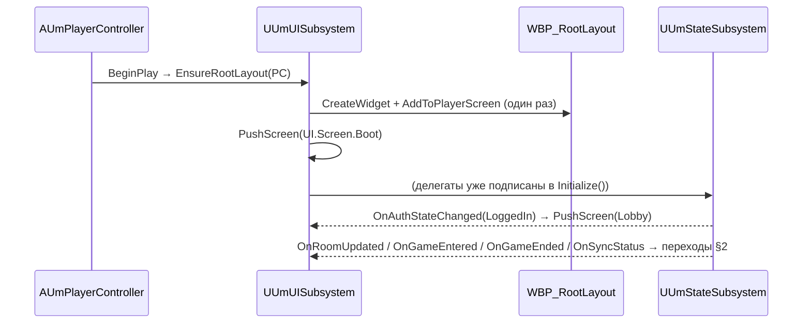

# 05. UI: CommonUI-каркас, все экраны и виджеты, биндинги, дизайн-токены, локализация

> Статус: план раздела 05 (фаза «подробные планы» по ADR). Дата: 2026-09-02. Ветка: `fix/admin-panel`.
> Закон раздела — ADR `docs/unreal/01-architecture-decision.md` (далее «ADR»): имена модулей, классов, файлов, ассетов и тегов взяты из ADR §3.3, §3.4, §3.6, §4.6, §5.6 без переименований. Там, где ADR молчит, решение принято в его духе и помечено **«(уточнение к ADR)»**. Ссылки вида `R7 §2.9.6` — на research-файлы `docs/unreal/_research/R1…R9*.md`; `К1 §3.6.3` — на `docs/unreal/_design/candidate-1.md`; `$UE` = `C:/Program Files/Epic Games/UE_5.8/Engine` (факты движка перепроверены по заголовкам напрямую). Факты, которые нельзя подтвердить без живого бэкенда/редактора, помечены «требует живой проверки» и собраны в §11.

---

## 0. Назначение и границы раздела

### 0.1. Что покрывает раздел

| Область | Содержание | Где в документе |
|---|---|---|
| Каркас | `UUmGameViewportClient`, `UUmUISubsystem`, `UUmRootLayout`, четыре слоя `UI.Layer.*`, стек экранов, модалки, back-action, `FUIInputConfig` на экран, C++-базы виджетов | §1 |
| FSM экранов | Теги `UI.Screen.*`, переходы, триггеры из субсистем | §2 |
| HUD-модель | `UUmGameHudModel` (`FieldNotify`), view-структуры, аффордансы `FGameplayTagQuery`, `WhyNot` | §3 |
| Экраны меню | `WBP_Boot`, `WBP_Login`, `WBP_Register`, `WBP_Lobby` (+ `WBP_GameListRow`, `WBP_CreateGameDialog`, `WBP_JoinByIdDialog`), `WBP_Room` (+ `WBP_PlayerSlot`, `WBP_HeroPicker`, `WBP_HeroCard`), матчмейкинг (feature-flag), `WBP_Settings` | §4 |
| Игровой HUD | `WBP_GameHUD` и все дочерние виджеты; desktop/mobile через `UCommonVisibilitySwitcher` | §5 |
| Дизайн-токены | `DA_UmTheme`, `DA_UmTextStyle_*`, `DA_UmButtonStyle_*`, палитра, шрифт `F_Inter`, размеры карт/панелей | §6 |
| Локализация | `ST_UI` ru/en, правила `FText`, тексты карт и `imageUrlRu`, `DT_ServerErrorMap` | §7 |
| Рецепты MCP | Последовательности вызовов `UMGToolSet` для каждого виджета, что делается в C++ | §8 |
| UI-тесты | Сценарии `SlateInspectorToolset`, функциональные и spec-тесты UI | §9 |
| Дорожная карта | Задачи `T-05-NN` | §10 |

### 0.2. Что не покрывает (границы с соседними разделами)

Нумерация соседних планов ниже — по договорённости фазы планирования (ADR §0: «десять подробных планов `02…11-*.md`»); точные имена файлов см. в §11 (допущение A1).

| Соседний раздел | Что берём оттуда (интерфейс) | Что отдаём туда |
|---|---|---|
| 02 — сеть и auth (`UmNet`) | `UUmAuthSubsystem::Login/Register/Logout/RestoreSession`, `OnAuthStateChanged {LoggedOut, Refreshing, LoggedIn, SessionLost(reason)}`, `UUmNetSubsystem::GetNetState() → Net.State.*`, `OnNetStateChanged` (ADR §4.1) | Ничего: UI не знает о транспорте |
| 03 — модель контракта (`UmModel`) | `FUmGameState` и вложенные, `FUmLegalActions::Enumerate → FUmLegalSet` с `WhyNot`, `FUmRules`, `FUmSlug`, нативные теги `UmTags.h`, `FUmTagMaps` (ADR §4.2–4.3) | Ничего |
| 04 — состояние и синхронизация (`UmClient/State`) | `UUmStateSubsystem`: `EnterLobby/RefreshAvailableGames`, `CreateGame`, `JoinGame`, `EnterRoom/LeaveRoom`, `SelectHero`, `ToggleReady`, `StartGame`, `EnterGame/ExitGame`, 11 `Do*()`; делегаты `OnLobbyUpdated`, `OnRoomUpdated`, `OnSnapshotApplied`, `OnActionRejected(FUmGraphQLError)`, `OnGameEnded`, `OnSyncStatus(EUmSyncStatus)`; `GetMatchTags()`, `GetLegalSet()`; `FUmServerClock`; таймеры защиты/авто-резолва (ADR §4.4, §5.5) | Кнопки вызывают только `BlueprintCallable`-действия `UUmStateSubsystem` |
| 06 — презентация доски (`UmClient/Presentation`) | `UUmPresentationSubsystem::PresentedState` (G9), очередь воспроизведения, `FUmInputStateMachine` (`Input.Mode.*`), `AUmFighterActor` с `UWidgetComponent` (ADR §4.7) | `WBP_FighterPlate` (§5.16); клики по карте руки → `UUmPresentationSubsystem` (input-FSM) |
| 07 — контент и ассеты | `UUmContentSubsystem::EnsureHero/FindCardArt/IdMap/GetStances`, `UUmImageCacheSubsystem::Get(Url, OnTexture)`, `DT_CardArt/DT_HeroArt/DT_BoardArt`, текстуры `T_UI_*` (ADR §4.5) | Требования к плейсхолдерам и размерам текстур UI (§6.5) |
| 08 — тесты | `UUmMockBackend`, фикстуры `Tests/Fixtures/state/*.json`, CLI-прогон (ADR §4.8) | Список UI-сценариев (§9) |
| 09 — dev-loop и MCP | Таблица «задача → тулсет» (ADR §5.8) | Рецепты `UMGToolSet` (§8) |
| 10 — дорожная карта | Эпики E5 «Экраны меню» (4 ч/д), E7 «Game HUD» (10 ч/д), части E8/E9/E10 (ADR §9.2) | Задачи `T-05-NN` (§10) |

Принципы, которые раздел обязан соблюдать (ADR §1.2, §5.1): логика с состоянием и сетью — только в C++; внешний вид, анимации и дерево `WBP_*` — Blueprint/UMG через MCP; каждый `WBP_*` наследует C++-базу с `BindWidget`-полями; никакой локальной копии правил — подсветки и гейты только через `FUmLegalActions`/теги; сервер — арбитр, любой отказ мутации показывается игроку (`OnActionRejected`).

---

## 1. Каркас UI (CommonUI)

### 1.1. Классы, файлы, ответственность

| Класс | Файл (`Source/UmClient/Public/…`) | Родитель | Ответственность | Источник |
|---|---|---|---|---|
| `UUmGameViewportClient` | `Core/UmGameViewportClient.h` | `UCommonGameViewportClient` (`$UE/Plugins/Runtime/CommonUI/Source/CommonUI/Public/CommonGameViewportClient.h:24`) | Обязателен для input routing CommonUI; регистрируется `GameViewportClientClassName=/Script/UmClient.UmGameViewportClient` в `DefaultEngine.ini` | ADR §3.5, §4.6; R8 §2.6 |
| `AUmPlayerController` | `Core/UmPlayerController.h` | `APlayerController` | `BeginPlay()` → `UUmUISubsystem::EnsureRootLayout(this)`; EnhancedInput только для сцены (`IMC_Board`, `IMC_Menu`) | ADR §4.6, F17 |
| `UUmUISubsystem` | `UI/UmUISubsystem.h` | `ULocalPlayerSubsystem` | Владеет `UUmRootLayout`, FSM экранов, API `PushScreen/PushModal/Toast/ShowReconnectOverlay`; слушает делегаты `UUmStateSubsystem`/`UUmAuthSubsystem`/`UUmNetSubsystem` | ADR §4.6 |
| `UUmRootLayout` | `UI/UmRootLayout.h` | `UCommonUserWidget` | C++-родитель `WBP_RootLayout`: четыре `BindWidget`-стека + статические оверлеи | ADR §4.6; К3 §5.1 |
| `UUmActivatableScreen` | `UI/UmActivatableScreen.h` | `UCommonActivatableWidget` | База всех экранов и HUD: `LayerTag`, `ScreenTag`, `GetDesiredInputConfig()`, `NativeOnHandleBackAction()`, доступ к субсистемам | ADR §4.6 |
| `UUmModalBase` | `UI/UmActivatableScreen.h` | `UUmActivatableScreen` | `bIsModal = true`, `bIsBackHandler = true`, `Payload: UUmModalPayload*`, `OnClosed` | ADR §4.6 |
| `UUmGameHudBase` | `UI/UmGameHudBase.h` | `UUmActivatableScreen` | База `WBP_GameHUD`: владеет `UUmGameHudModel`, раздаёт модель дочерним панелям, действия кнопок, хоткеи, desktop/mobile | ADR §4.6 |
| `UUmCardViewBase` | `UI/UmCardViewBase.h` | `UCommonUserWidget` | База `WBP_CardView`: `SetCard(FUmCardView)`, загрузка арта, `BlueprintImplementableEvent OnCardChanged` | ADR §4.6 |
| `UUmGameHudModel` | `UI/UmGameHudModel.h` | `UObject`, `INotifyFieldValueChanged` | Модель HUD с `FieldNotify`-полями (§3) | ADR §4.6 |
| `UUmHudLibrary` | `UI/UmHudLibrary.h` | `UBlueprintFunctionLibrary` | `IsAffordanceEnabled(Model, FGameplayTagQuery)`, `GetWhyNot(Model, ActionTag) → FText` | ADR §4.6, G3, G16 |
| `UUmHudPanelBase` **(уточнение к ADR)** | `UI/UmHudWidgets.h` | `UCommonUserWidget` | Общая база дочерних панелей HUD: получает `Model`, подписывается на нужные `FFieldId`, вызывает `NativeOnModelChanged(FieldId)`; конкретные базы `UUm<Name>Base` (по конвенции ADR §3.6 «`WBP_<Name>` / `UUm<Name>Base`») — §5 | ADR §3.6, §5.1 |
| `UUm<Screen>Base` **(уточнение к ADR)** | `UI/UmMenuScreens.h` | `UUmActivatableScreen` / `UUmModalBase` | Базы экранов меню (`UUmLoginBase`, `UUmRegisterBase`, `UUmLobbyBase`, `UUmCreateGameDialogBase`, `UUmJoinByIdDialogBase`, `UUmRoomBase`, `UUmHeroPickerBase`, `UUmSettingsBase`, `UUmGameOverBase`, `UUmConfirmDialogBase`, `UUmReconnectOverlayBase`) — §4 | ADR §3.6, §5.1 |
| `UUmThemeAsset` **(уточнение к ADR)** | `UI/UmTheme.h` | `UDataAsset` | Класс ассета `DA_UmTheme` (§6) | ADR §3.4 (`DA_UmTheme`) |

Blueprint видит только `BlueprintCallable`/`BlueprintReadOnly` API `UmClient` (ADR §3.2); дерево виджетов, стили и анимации создаются MCP (`UMGToolSet`), тонкая glue-логика — `BlueprintTools.write_graph_dsl` (ADR §5.1).

### 1.2. `WBP_RootLayout` / `UUmRootLayout`

Создание: `UUmUISubsystem::EnsureRootLayout(APlayerController* PC)` — идемпотентно; `CreateWidget<UUmRootLayout>(PC, WBP_RootLayout_C)` + `AddToPlayerScreen(ZOrder 0)`; вызывается из `AUmPlayerController::BeginPlay()` (не из `Initialize` субсистемы — ловушка F17). Единственный уровень `L_Main` гарантирует, что layout создаётся один раз за сессию (ADR §2.2, §3.4).

Дерево `WBP_RootLayout` (имена `BindWidget` — **точные**, MCP обязан создавать виджеты с этими `WidgetDisplayName`):

```
[Overlay] Root
 ├─ [UCommonActivatableWidgetStack] Stack_Game    ← UI.Layer.Game   (WBP_GameHUD)
 ├─ [UCommonActivatableWidgetStack] Stack_Menu    ← UI.Layer.Menu   (Boot/Login/Register/Lobby/Room/Settings*)
 ├─ [UCommonActivatableWidgetStack] Stack_Modal   ← UI.Layer.Modal  (ConfirmDialog, CreateGameDialog, JoinByIdDialog,
 │                                                                    ChooseOneDialog, BoostPicker, GameOver, Settings*)
 ├─ [UCommonActivatableWidgetStack] Stack_Toast   ← UI.Layer.Toast  (WBP_ReconnectOverlay — единственный активируемый
 │                                                                    обитатель; блокирует ввод)
 ├─ [WBP_Toast]            Toast_Host             ← статический, HitTestInvisible (уточнение к ADR)
 └─ [WBP_ConnectionBadge]  Badge_Connection       ← статический, HitTestInvisible (уточнение к ADR)
```

`* WBP_Settings` открывается как модалка поверх лобби/игры (§4.9).

Пояснение (уточнение к ADR): ADR §4.6 задаёт четыре стека под тегами `UI.Layer.{Game, Menu, Modal, Toast}`. `UCommonActivatableWidgetStack` показывает только верхний (активный) виджет (`$UE/…/CommonUI/Public/Widgets/CommonActivatableWidgetContainer.h:202`), поэтому несколько одновременных тостов и постоянный бейдж соединения не могут жить *внутри* стека `Stack_Toast`; они размещены статическими детьми `Overlay` над стеками. Стек `Stack_Toast` используется для `WBP_ReconnectOverlay` (полноэкранный, перехватывает ввод).

`UUmRootLayout` API:

```cpp
UCLASS(Abstract)
class UMCLIENT_API UUmRootLayout : public UCommonUserWidget {
  GENERATED_BODY()
public:
  UCommonActivatableWidgetStack* GetLayer(FGameplayTag LayerTag) const;  // UI.Layer.* → стек
  UUmToastBase*   GetToastHost() const { return Toast_Host; }
  UUmConnectionBadgeBase* GetConnectionBadge() const { return Badge_Connection; }
protected:
  UPROPERTY(meta=(BindWidget)) TObjectPtr<UCommonActivatableWidgetStack> Stack_Game;
  UPROPERTY(meta=(BindWidget)) TObjectPtr<UCommonActivatableWidgetStack> Stack_Menu;
  UPROPERTY(meta=(BindWidget)) TObjectPtr<UCommonActivatableWidgetStack> Stack_Modal;
  UPROPERTY(meta=(BindWidget)) TObjectPtr<UCommonActivatableWidgetStack> Stack_Toast;
  UPROPERTY(meta=(BindWidget)) TObjectPtr<UUmToastBase> Toast_Host;
  UPROPERTY(meta=(BindWidget)) TObjectPtr<UUmConnectionBadgeBase> Badge_Connection;
};
```

### 1.3. `UUmUISubsystem` — публичный API

```cpp
UCLASS()
class UMCLIENT_API UUmUISubsystem : public ULocalPlayerSubsystem {
  GENERATED_BODY()
public:
  UFUNCTION(BlueprintCallable) void EnsureRootLayout(APlayerController* PC);          // идемпотентно (F17)
  UFUNCTION(BlueprintCallable) UUmActivatableScreen* PushScreen(FGameplayTag ScreenTag); // UI.Screen.* → класс из UUmClientSettings::ScreenClasses
  UFUNCTION(BlueprintCallable) void PopScreen(FGameplayTag LayerTag);                  // снять верхний виджет слоя
  UFUNCTION(BlueprintCallable) UUmModalBase* PushModal(TSubclassOf<UUmModalBase> Class, UUmModalPayload* Payload);
  UFUNCTION(BlueprintCallable) void CloseModal(UUmModalBase* Modal);
  UFUNCTION(BlueprintCallable) void Toast(const FText& Text, EUmToastKind Kind /*Info,Success,Warning,Error*/, float Seconds = 4.f);
  UFUNCTION(BlueprintCallable) void ShowReconnectOverlay(bool bShow);
  UFUNCTION(BlueprintPure)     FGameplayTag GetCurrentScreen() const;                 // UI.Screen.*
  UFUNCTION(BlueprintPure)     UUmGameHudBase* GetGameHud() const;                    // активный HUD или nullptr
  DECLARE_MULTICAST_DELEGATE_TwoParams(FOnScreenChanged, FGameplayTag /*From*/, FGameplayTag /*To*/);
  FOnScreenChanged OnScreenChanged;
};
```

Правила:
1. `PushScreen(tag)` — экраны `UI.Layer.Menu` заменяют друг друга (`ClearWidgets()` слоя, затем `AddWidget`), чтобы стек меню не рос (Boot → Login → Lobby → Room — линейный маршрут, «назад» решается FSM §2, а не стеком). `UI.Screen.Game` кладётся в `Stack_Game` и одновременно очищает `Stack_Menu`; `UI.Screen.GameOver` — модалка над HUD.
2. Соответствие `UI.Screen.* → TSubclassOf<UUmActivatableScreen>` хранится в `UUmClientSettings::ScreenClasses` (`TMap<FGameplayTag, TSoftClassPtr<UUmActivatableScreen>>`) **(уточнение к ADR)** — `DefaultGame.ini`, секция `[/Script/UmClient.UmClientSettings]`.
3. `PushModal` — всегда в `Stack_Modal`; модалка получает `Payload` до `ActivateWidget()` через `AddWidget<T>(Class, InitFunc)` (`CommonActivatableWidgetContainer.h:49`). Результат модалки — делегат `UUmModalBase::OnClosed(EUmModalResult, UUmModalPayload*)`.
4. Все переходы инициируются **C++** (`UUmUISubsystem` подписан на делегаты субсистем — §2.3); Blueprint переходов не делает.
5. `Toast()` — очередь на `Toast_Host` (§5.15); ошибки `OnActionRejected` проходят через `DT_ServerErrorMap` (§7.4) до показа.

`UUmModalPayload : UObject` **(уточнение к ADR)** — базовый класс данных модалки; типизированные наследники: `UUmConfirmPayload {Title, Body, ConfirmText, CancelText, bDanger}`, `UUmChooseOnePayload {EffectId, Text, Options[], ChooseCount}`, `UUmBoostPickPayload {Context: Attack|Defense|Maneuver, PlayedCardId, Candidates[]}`, `UUmGameOverPayload {Outcome: Win|Loss|Aborted, WinnerName, AbortedByName, TurnCount}`, `UUmJoinByIdPayload {}`, `UUmCreateGamePayload {}`, `UUmSettingsPayload {bInGame}`.

### 1.4. `UUmActivatableScreen` и input config по слоям

```cpp
UCLASS(Abstract)
class UMCLIENT_API UUmActivatableScreen : public UCommonActivatableWidget {
  GENERATED_BODY()
public:
  UPROPERTY(EditDefaultsOnly, Category="Um") FGameplayTag LayerTag;   // UI.Layer.*
  UPROPERTY(EditDefaultsOnly, Category="Um") FGameplayTag ScreenTag;  // UI.Screen.* (пусто у модалок/оверлеев)
  UPROPERTY(EditDefaultsOnly, Category="Um") EUmBackPolicy BackPolicy = EUmBackPolicy::Swallow; // Swallow | Close | Confirm(ключ ST_UI)
protected:
  virtual TOptional<FUIInputConfig> GetDesiredInputConfig() const override; // по таблице ниже
  virtual bool NativeOnHandleBackAction() override;                         // по BackPolicy
  UUmStateSubsystem* State() const; UUmAuthSubsystem* Auth() const; UUmUISubsystem* UI() const; UUmContentSubsystem* Content() const;
  UFUNCTION(BlueprintImplementableEvent) void BP_OnShown();   // анимация появления
  UFUNCTION(BlueprintImplementableEvent) void BP_OnError(const FText& Message); // общая ошибка экрана
};
```

Таблица `FUIInputConfig` (конструктор `FUIInputConfig(ECommonInputMode, EMouseCaptureMode, bool bHideCursorDuringViewportCapture)` — `$UE/…/CommonUI/Public/Input/UIActionBindingHandle.h:104`; режимы `Menu/Game/All` — `CommonInput/Public/CommonInputModeTypes.h:11-18`):

| Слой / виджет | `ECommonInputMode` | `EMouseCaptureMode` | Курсор | `bIsBackHandler` | `bSupportsActivationFocus` | Примечание |
|---|---|---|---|---|---|---|
| `UI.Layer.Game` (`WBP_GameHUD`) | `All` | `NoCapture` | виден | true (`Confirm` «Покинуть игру?») | true | Ввод идёт и в UMG, и в сцену (`IA_Select/IA_Cancel/IA_Zoom/IA_Pan` через `AUmPlayerController`, ADR §4.6) |
| `UI.Layer.Menu` | `Menu` | `NoCapture` | виден | true (политика экрана) | true | |
| `UI.Layer.Modal` | `Menu` | `NoCapture` | виден | true (`Close`, кроме `WBP_GameOver` — `Swallow`) | true, `bIsModal = true` | `bIsModal` — `CommonActivatableWidget.h:216` |
| `WBP_ReconnectOverlay` (`Stack_Toast`) | `Menu` | `NoCapture` | виден | true (`Swallow`) | true, `bIsModal = true` | Блокирует HUD на время реконнекта |
| `Toast_Host`, `Badge_Connection` | — (не активируемые) | — | — | — | — | `ESlateVisibility::HitTestInvisible` |

Back-action: `NativeOnHandleBackAction()` (`CommonActivatableWidget.h:183`) возвращает `true` (обработано) всегда, чтобы Esc/геймпад-B не «проваливались» в сцену; политика `Confirm` открывает `WBP_ConfirmDialog` с ключом `ST_UI` (например `Room.Leave.Confirm`, `Game.Leave.Confirm`). Интеграция CommonUI ↔ EnhancedInput не включается (`bEnableEnhancedInputSupport=False`, ADR §3.5, R8 §2.7); back-action и «подтвердить» задаются через `DA_UmCommonInputData` (`UCommonUIInputData`: `DefaultBackAction`, `DefaultClickAction`) и таблицу `DT_UmUiActions` (`FCommonInputActionDataBase`: строки `UI.Action.Confirm` — Enter/Space/Gamepad_FaceButton_Bottom, `UI.Action.Back` — Escape/Gamepad_FaceButton_Right) **(уточнение к ADR: имя таблицы)**. Кнопкам с хоткеем назначается `SetTriggeringInputAction(FDataTableRowHandle)` (`CommonButtonBase.h:472`).

### 1.5. Жизненный цикл и владение



Подписки `UUmUISubsystem::Initialize()` (делегаты C++, не Blueprint): `UUmAuthSubsystem::OnAuthStateChanged`, `UUmStateSubsystem::OnRoomUpdated`, `OnGameEntered` **(уточнение к ADR: делегат `EnterGame` завершён — состояние seq ≥ 1 применено и `AUmGameStage` заспавнен)**, `OnGameEnded`, `OnSyncStatus`, `OnActionRejected`, `UUmNetSubsystem::OnNetStateChanged`. Отписка — `Deinitialize()`.

---

## 2. FSM экранов (`UI.Screen.*`)

### 2.1. Диаграмма (К1 §3.6.2 без изменений + модалки)

```mermaid
stateDiagram-v2
  [*] --> Boot
  Boot --> Login: нет refresh-токена / RestoreSession провален (SessionLost)
  Boot --> Lobby: RestoreSession OK (me.id получен)
  Login --> Register: «Зарегистрироваться»
  Register --> Login: «У меня есть аккаунт»
  Login --> Lobby: OnAuthStateChanged(LoggedIn)
  Register --> Lobby: OnAuthStateChanged(LoggedIn)
  Lobby --> Room: CreateGame OK / JoinGame OK / «Вернуться» из «Мои игры» (status LOBBY)
  Lobby --> Game: «Вернуться» из «Мои игры» (status IN_PROGRESS) → EnterGame
  Room --> Lobby: LeaveRoom (leaveGame) / «Игра не найдена» после ухода хоста
  Room --> Game: OnGameEntered (хост — после startGame; гость — по STATE_UPDATED seq 1 или поллингу status IN_PROGRESS)
  Game --> GameOver: phase GAME_OVER / gameEnded{reason aborted}
  GameOver --> Lobby: «В лобби» → leaveGame → ExitGame
  Game --> Lobby: «Покинуть» (Confirm) → leaveGame → ExitGame
  Lobby --> Login: OnAuthStateChanged(SessionLost) / «Выйти»
  Room --> Login: SessionLost
  Game --> Login: SessionLost (после ExitGame)
  Lobby --> Matchmaking: Feature.Matchmaking (v2)
  Matchmaking --> Room: acceptMatch → bothAccepted (v2)
  Matchmaking --> Lobby: leaveQueue / таймаут (v2)
```



Модалки (не состояния FSM, слой `UI.Layer.Modal`): `Settings` (над Lobby/Game), `ConfirmDialog`, `CreateGameDialog`, `JoinByIdDialog`, `ChooseOneDialog`, `BoostPicker`, `GameOver`. Оверлей `ReconnectOverlay` — над любым экраном по `OnSyncStatus`.

### 2.2. Теги экранов

ADR §5.6: `UI.Screen.{Boot,Login,Register,Lobby,Room,Game,GameOver,Settings}`. **(уточнение к ADR)** для v2 добавляются нативные теги `UI.Screen.Matchmaking`, `UI.Screen.MatchFound`, `UI.Screen.Profile`, `UI.Screen.Leaderboard` — объявляются в `UmTags.h` только вместе с задачами T-05-22/23, до этого не существуют.

### 2.3. Триггеры переходов (кто вызывает `PushScreen`)

| Событие (источник) | Условие | Действие `UUmUISubsystem` |
|---|---|---|
| `EnsureRootLayout` завершён | — | `PushScreen(UI.Screen.Boot)`; `WBP_Boot` вызывает `Auth()->RestoreSession()` |
| `OnAuthStateChanged(LoggedIn)` | текущий экран ∈ {Boot, Login, Register} | `PushScreen(Lobby)`; `State()->EnterLobby()` |
| `OnAuthStateChanged(SessionLost, reason)` | любой | если в игре — `State()->ExitGame()`; `PushScreen(Login)`; тост по `reason` (`Refresh token has been revoked` → «Вход с другого устройства», ADR §5.3) |
| `OnAuthStateChanged(LoggedOut)` | по кнопке «Выйти» | `PushScreen(Login)` |
| `UUmStateSubsystem::OnRoomEntered(gameId)` **(уточнение: делегат после `EnterRoom`)** | — | `PushScreen(Room)` |
| `OnRoomUpdated(FUmGameResponseDto)` | `Status == "IN_PROGRESS"` и экран Room | `State()->EnterGame(gameId)` (гость по поллингу 3 с — R7 §2.9.4; хост — после `StartGame`) |
| `OnSnapshotApplied(seq 1)` в комнате | подписка `GameStateUpdated(since:0)` установлена до `startGame` (R2 §3.9) | `State()->EnterGame(gameId)` |
| `OnGameEntered` | `PresentedState` seq ≥ 1, сцена создана | `Stack_Menu->ClearWidgets()`, `PushScreen(Game)` |
| `OnSnapshotApplied` с `Match.Phase.GameOver` или `OnGameEnded{reason}` | экран Game | `PushModal(WBP_GameOver, UUmGameOverPayload)` |
| `WBP_GameOver` «В лобби» / HUD «Покинуть» (после Confirm) | — | `State()->DoLeaveGame()` → `ExitGame()` → `PushScreen(Lobby)`; ошибка «Игра не найдена» после `leaveGame` хостом без соперника игнорируется (ADR §5.5) |
| `OnRoomUpdated` → `NotFound` («Игра не найдена») | экран Room | тост + `PushScreen(Lobby)` (R2 §3.14) |
| `OnSyncStatus(Reconnecting|Resyncing)` | экран Game/Room | `ShowReconnectOverlay(true)`; `Live` → `false`; `Failed` → оверлей с кнопкой «Переподключить» |
| `OnNetStateChanged` | всегда | `Badge_Connection->SetState(tag)` |

---

## 3. `UUmGameHudModel` — модель HUD и аффордансы

### 3.1. Назначение и источник данных

`UUmGameHudModel` — единственный объект, на который биндятся все дочерние виджеты HUD. Источник значений — `UUmPresentationSubsystem::PresentedState` (последний **проигранный** снапшот, G9), а не `Current` (последний применённый): пока очередь воспроизведения не пуста, HUD отстаёт от сети ровно на непроигранные снапшоты и несёт тег `Input.Mode.Busy` (ADR §4.7). Модель создаётся и принадлежит `UUmGameHudBase` (`UPROPERTY Model`), пересобирается методом `Rebuild(const FUmGameState& Presented, const FUmLegalSet& Legal, const FGameplayTagContainer& MatchTags)` по делегату `UUmPresentationSubsystem::OnPresentedStateChanged(const FUmGameState&, const TArray<FUmMatchEvent>&)` **(уточнение к ADR: имя делегата)**, а также по `OnSyncStatus`, `OnNetStateChanged`, `OnActionRejected` и тику таймеров.

### 3.2. Поля (`FieldNotify`)

Реализация `INotifyFieldValueChanged` на «голом» `UObject` (без MVVM-плагина — Beta, ADR §7): класс объявляется `UCLASS(BlueprintType, CustomFieldNotify)`, реализует интерфейс через `UE::FieldNotification::FFieldMulticastDelegate Delegates` (`$UE/Source/Runtime/FieldNotification/Public/FieldNotificationDelegate.h:25,73-102`) и дескриптор полей макросами `UE_FIELD_NOTIFICATION_DECLARE_CLASS_DESCRIPTOR_BEGIN(UMCLIENT_API)` / `UE_FIELD_NOTIFICATION_DECLARE_FIELD(Name, UMCLIENT_API)` / `…_DECLARE_ENUM_FIELD_BEGIN/…END` / `…_DECLARE_CLASS_DESCRIPTOR_END()` и в `.cpp` — `UE_FIELD_NOTIFICATION_IMPLEMENTATION_BEGIN(UUmGameHudModel)` + `UE_FIELD_NOTIFICATION_IMPLEMENT_FIELD(UUmGameHudModel, Name)` + `…_IMPLEMENTATION_END` (`FieldNotificationDeclaration.h:36-145`; образец — `UWidget` в `$UE/Source/Runtime/UMG/Public/Components/Widget.h:215-232`). Свойства помечаются `UPROPERTY(BlueprintReadOnly, FieldNotify, Category="Um")`. Точная композиция макросов проверяется компиляцией в T-05-07 (требует живой проверки, §11).

| Поле | Тип | Источник (`PresentedState` = `S`, `me` = `Auth()->GetUser().Id`) | Броадкаст |
|---|---|---|---|
| `TurnCount` | `int32` | `S.TurnCount` | при изменении |
| `PhaseTag` | `FGameplayTag` | `FUmTagMaps::Phase(S.Phase)` → `Match.Phase.*` (`ACTION_ATTACK` — синоним `ActionManeuver` для UI, R4 §3.2) | при изменении |
| `bIsMyTurn` | `bool` | `S.CurrentTurnPlayerId == me` | при изменении |
| `CurrentPlayerName` | `FText` | `Usernames[S.CurrentTurnPlayerId]` из `game(id).players` (`UUmStateSubsystem::GetUsernames()`), фолбэк — имя HERO-бойца, затем первые 8 символов id (R7 §2.5) | при изменении |
| `ActionsRemaining` | `int32` | `S.Metadata.ActionsRemaining` (дефолт 2, R4 §2.3) | при изменении |
| `MyHand` | `TArray<FUmCardView>` | `S.HandZones[me].Cards` (по ключу, **не** по `isVisible`, R3 §3.13); порядок сервера | при изменении набора id или playable-флагов |
| `HandMaxSize` | `int32` | `S.HandZones[me].MaxSize` (7) | при изменении |
| `OpponentHandCount` | `int32` | `S.HandZones[opp].Cards.Num()` | при изменении |
| `MyDeckCount`, `MyDiscardCount` | `int32` | `S.Decks[me].DrawPile.Num()`, `S.DiscardPiles[me].Num()` | при изменении |
| `OpponentDeckCount`, `OpponentDiscardCount` | `int32` | `S.Decks[opp].DrawPile.Num()` (только размер, содержимое не читается — B9), `S.DiscardPiles[opp].Num()` | при изменении |
| `bDecksStale` | `bool` | `FUmGameSnapshotStore::bDecksStale` (G12) | при изменении |
| `MyDiscardTop` | `FUmCardView` | последняя карта `S.DiscardPiles[me]` | при изменении id |
| `Players` | `TArray<FUmPlayerPanelView>` (2) | индекс 0 — я, 1 — соперник (контракт «локальный игрок первый», R7 §2.5) | при изменении любого поля |
| `Combat` | `FUmCombatView` | `S.Metadata.CombatInfo` (§3.3) | при изменении |
| `DefenseDeadlineServerMs` | `int64` | `CombatInfo.StartedAt + UUmClientSettings::DefenseTimeoutSec × 1000` (`timeoutAt` не приходит — ADR §1.3 п.5) | при изменении |
| `Pending` | `FUmPendingView` | `S.MyPendingEffects(me)` минус `DismissedPendingIds` | при изменении |
| `Stances` | `TArray<FUmStanceView>` | `Content()->GetStances(heroSlug моего HERO)` + `S.MyStance(me)` (дефолт `isDefault`, затем первая — R4 §2.13) | при изменении |
| `Log` | `TArray<FText>` | последние 50 записей из `FUmMatchEvent` (шаблоны `ST_UI` `Log.*`) + отказы сервера | при добавлении |
| `MatchTags` | `FGameplayTagContainer` | `UUmStateSubsystem::GetMatchTags()` ∪ `Input.Mode.*` (от `FUmInputStateMachine`) ∪ `Net.State.*` | при изменении |
| `LegalSet` | `FUmLegalSet` | `UUmStateSubsystem::GetLegalSet()` (G16) | вместе с `MatchTags` |
| `WhyNot` | `TArray<FUmRejection>` | `LegalSet.WhyNot` | вместе с `LegalSet` |
| `SelectedCardId`, `SelectedFighterId` | `FString` | `FUmInputStateMachine` (06) | при изменении |
| `InspectedCard` | `FUmCardView` | последняя карта, выбранная в руке/сбросе/бою (§5.9) | при изменении |
| `SyncTag`, `NetTag` | `FGameplayTag` | `Match.Sync.*`, `Net.State.*` | при изменении |
| `LastRejection` | `FText` | `OnActionRejected` через `DT_ServerErrorMap` | при каждом отказе |

**(уточнение к ADR)**: поля `CurrentPlayerName`, `HandMaxSize`, `MyDiscardTop`, `DefenseDeadlineServerMs`, `SelectedCardId/SelectedFighterId`, `InspectedCard`, `SyncTag/NetTag`, `LastRejection` добавлены к списку ADR §4.6.

### 3.3. View-структуры (`UI/UmGameHudModel.h`)

```cpp
USTRUCT(BlueprintType) struct FUmCardView {
  FString Id;            // instance "<cardId>::n" — именно его слать в мутации (R3 §3.10)
  FString CardId;        // cuid контента — ключ арта (DT_CardArt / hero(id).cards)
  FText   Title;         // nameRu при культуре ru, иначе name; "???" у скрытых (R7 §2.5)
  FGameplayTag TypeTag;  // Card.Type.*
  int32   AttackValue = -1, DefenseValue = -1, BoostValue = -1;   // -1 = отсутствует
  FText   BannerName;    // "" / "Any" → любой боец
  FText   Text;          // Card.text из состояния (только свои карты)
  TArray<FText> EffectTexts;
  bool    bHidden = false;        // рубашка
  bool    bPlayable = false;      // из LegalSet (Attacks/PlayableSchemes/PlayableDefenses)
  bool    bBoostEligible = false; // из LegalSet.Attacks[].bBoostAllowed / FUmRules::BoostAllowed
  FText   WhyNot;                 // причина, если !bPlayable
  TSoftObjectPtr<UTexture2D> BakedArt; FString ArtUrl; // Baked → Runtime → Placeholder (ADR §4.5)
};
USTRUCT(BlueprintType) struct FUmPlayerPanelView {
  FString UserId; FText Name; FString HeroSlug; FText HeroName;
  int32 Health = 0, MaxHealth = 0;           // FUmGameStatePlayer.Health/MaxHealth
  bool bIsCurrent = false, bIsMe = false, bIsAlive = true;
  int32 HandCount = 0, DeckCount = 0, DiscardCount = 0, ActionsRemaining = 0;
  FText StanceLabel;                          // текущая стойка (пусто у героев без стоек)
  TSoftObjectPtr<UTexture2D> Avatar; FString AvatarUrl; FLinearColor Accent; // cyan (я) / red (соперник)
};
USTRUCT(BlueprintType) struct FUmCombatView {
  bool bActive = false;                       // bHasCombatInfo
  FGameplayTag RoleTag;                       // Match.Role.{Attacker,Defender,None}
  FString AttackerFighterId, TargetFighterId; FText AttackerName, TargetName;
  FUmCardView AttackerCard;                   // из DiscardPiles[attacker.OwnerId] по AttackerCardId (ADR §5.2)
  FUmCardView DefenderCard; bool bHasDefenderCard = false;
  int32 AttackValue = 0, DefenseValue = 0;    // combatInfo (значение + boost, до модификаторов — R4 §2.7.1)
  bool bCardsStale = false;                   // bDecksStale && карта боя не найдена в сбросе
  bool bShowResolveButton = false;            // §5.10 (G10)
  FText ResolveHint;                          // «Автоматически через 1,5 с» / «Доступно через N с»
};
USTRUCT(BlueprintType) struct FUmPendingView {
  bool bHas = false; int32 QueueCount = 0;    // «в очереди: k»
  FString EffectId; FGameplayTag TypeTag;     // Pending.Type.*
  FText Text; FText FighterName; bool bTargetsOpponent = false; int32 Value = 1;
  TArray<FText> OptionLabels; int32 ChooseCount = 1;
  bool bBlockedByCombat = false;              // Match.Phase.Combat → «после боя» (G19)
  FText StepHint;                             // «Кликните бойца…» / «Кликните клетку (до N шагов)»
};
USTRUCT(BlueprintType) struct FUmStanceView { FString Id; FText Label; bool bActive = false; bool bIsDefault = false; };
```

`FUmCombatView.AttackerCard/DefenderCard` — карты боя ищутся в `DiscardPiles[attacker.OwnerId]` / `DiscardPiles[defenderId]` по instance-id (карты уходят в сброс **в момент розыгрыша** — R4 §2.14); если сброс протух (подписка без `decks/discardPiles`), `bCardsStale = true` до прихода полного снапшота (`RefreshFullStateDebounced`, ADR §5.2).

### 3.4. Аффордансы: `FGameplayTagQuery` + `FUmLegalSet`

`UUmHudLibrary::IsAffordanceEnabled(const UUmGameHudModel* Model, const FGameplayTagQuery& Query)` = `Query.Matches(Model->MatchTags)` (`$UE/Source/Runtime/GameplayTags/Classes/GameplayTagContainer.h:803`). Запросы строятся в C++ один раз (`FGameplayTagQuery::BuildQuery(FGameplayTagQueryExpression().AllExprMatch().AddExpr(…AllTagsMatch().AddTag(…)).AddExpr(…AnyTagsMatch()…).AddExpr(…NoTagsMatch()…))`, `GameplayTagContainer.h:871-938`) и хранятся в `UUmGameHudBase::Affordances: TMap<FGameplayTag /*Action.**/, FUmAffordance{Query, ExtraCheck}>`. Второй уровень — булевы из `LegalSet` (например, `bCanEndTurn`). Кнопка активна ⇔ запрос совпал **и** `LegalSet` разрешает; иначе тултип = `GetWhyNot(Model, ActionTag)`.

| Действие (`Action.*`) | `FGameplayTagQuery` (ALL / ANY / NONE) | Доп. условие из `LegalSet` | Ключ `WhyNot` по умолчанию (`ST_UI`) |
|---|---|---|---|
| `Action.Maneuver` | ALL(`Match.Turn.Mine`, `Match.Actions.Available`, `Match.Sync.Live`) ANY(`Match.Phase.ActionManeuver`, `Match.Phase.ActionAttack`) NONE(`Input.Mode.Busy`) | `ManeuverTargets` непусто (есть живой не-immobilized боец) | `WhyNot.NotYourTurn` / `WhyNot.NoActions` / `WhyNot.Syncing` / `WhyNot.Immobilized` |
| `Action.Attack` (карта) | как Maneuver | `Attacks` содержит `cardId` | `WhyNot.NoTargetInRange` |
| `Action.PlayScheme` | как Maneuver | `PlayableSchemes` содержит `cardId` | `WhyNot.BannerMismatch` |
| `Action.PlayDefense` | ALL(`Match.Phase.Combat`, `Match.Role.Defender`, `Match.Sync.Live`) NONE(`Input.Mode.Busy`) | `PlayableDefenses` содержит `cardId` | `WhyNot.NotDefender` |
| `Action.ResolveCombat` | ALL(`Match.Sync.Live`) ANY(`Match.Phase.Combat`, `Match.Phase.CombatResolve`) NONE(`Input.Mode.Busy`) | `bCanResolveCombat` **и** правило G10: атакующему — только `CombatResolve`; защитнику в `Combat` — «Без защиты», в `CombatResolve` — через 5 с | `WhyNot.WaitDefense` |
| `Action.EndTurn` | ALL(`Match.Turn.Mine`, `Match.Sync.Live`) ANY(`Match.Phase.ActionManeuver`, `Match.Phase.ActionAttack`) NONE(`Input.Mode.Busy`) | `bCanEndTurn` | `WhyNot.NotYourTurn` |
| `Action.Pass` | как EndTurn + `Match.Actions.Available` | `bCanPass` | `WhyNot.NoActions` |
| `Action.SetStance` | как EndTurn | `Stances` непусто и `id != активная` | `WhyNot.NoStances` |
| `Action.Pending.Move/Place/ChooseOne` | ALL(`Match.Sync.Live`) NONE(`Match.Phase.Combat`, `Input.Mode.Busy`) — **любой ход и любая фаза, кроме COMBAT** (G19; R4 §3.13) | `MyPending` содержит `effectId` | `WhyNot.PendingAfterCombat` |
| `Action.ToggleDoor` | — (не показывается; только `um.toggledoor`) | — | — |
| «Покинуть», «Настройки», инспектор, лог | без гейта | — | — |

Все теги — нативные из `UmTags.h` (ADR §5.6). `Match.Actions.Available` ⇔ `ActionsRemaining > 0`; `Match.Turn.Mine` ⇔ `bIsMyTurn`; `Input.Mode.Busy` — на время in-flight мутации (`FUmActionGate`) и воспроизведения очереди (ADR §4.4, §4.7).

`UUmHudLibrary::GetWhyNot(Model, ActionTag)`: первая `FUmRejection` из `Model->WhyNot` с `Action == ActionTag` → `Reason`; если пусто — общий ключ по первому несовпавшему тегу запроса (таблица выше). Кнопки CommonUI: `SetIsInteractionEnabled(false)` (`CommonButtonBase.h:354`) + `SetToolTipText(WhyNot)` — заблокированная кнопка остаётся видимой и объясняет причину.

### 3.5. Псевдокод `Rebuild`

```cpp
void UUmGameHudModel::Rebuild(const FUmGameState& S, const FUmLegalSet& Legal, const FGameplayTagContainer& Tags) {
  const FString Me = Auth->GetUser().Id;
  Set(TurnCount, S.TurnCount); Set(PhaseTag, FUmTagMaps::Phase(S.Phase));
  Set(bIsMyTurn, S.IsMyTurn(Me)); Set(ActionsRemaining, S.Metadata.ActionsRemaining);
  SetHand(BuildHand(S.MyHand(Me), Legal));                 // playable/boost флаги из Legal
  Set(OpponentHandCount, S.HandZones[Opp(S,Me)].Cards.Num()); … // счётчики
  SetPlayers({BuildPanel(S, Me, /*bIsMe*/true), BuildPanel(S, Opp(S,Me), false)});
  SetCombat(BuildCombat(S, Me));                            // роль по combatInfo.defenderId == Me (R3 §3.9)
  Set(DefenseDeadlineServerMs, Combat.bActive ? S.Metadata.CombatInfo.StartedAtMs + DefenseTimeoutSec*1000 : 0);
  SetPending(BuildPending(S.MyPendingEffects(Me), DismissedPendingIds, PhaseTag));
  SetStances(BuildStances(Content->GetStances(S.MyHeroSlug(Me)), S.MyStance(Me)));
  SetTags(Tags); SetLegal(Legal);                           // единый броадкаст MatchTags+LegalSet+WhyNot
}
// Set(...) сравнивает и вызывает BroadcastFieldValueChanged(FFieldNotificationClassDescriptor::<Field>) только при изменении.
```

Таймер защиты: `UUmGameHudBase::NativeTick` раз в 250 мс вычисляет `RemainingSec = (DefenseDeadlineServerMs − FUmServerClock::GetServerNowMs())/1000` и пишет в `Combat.RemainingSec` (без броадкаста `Combat`, отдельное поле `DefenseRemainingSec`, чтобы не перерисовывать карты) **(уточнение к ADR)**.
