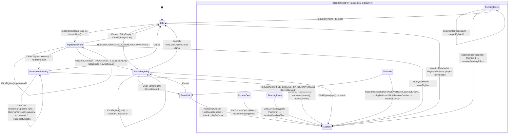

# 06. Доска, презентация, ввод, cue-шина, анимации

> Статус: план раздела (следующая фаза после ADR). Дата: 2026-09-02. Ветка: `fix/admin-panel`.
> Основание: `docs/unreal/01-architecture-decision.md` (далее ADR) — §3.3 (файлы `UmClient/Presentation/*`), §3.4 (`Content/Board`, `Content/Cues`, `Content/UI/Input`), §4.7 (классы презентации), §5.6 (теги), графты G3/G9/G13, F3, §5.5 (обходы), §9.1 E0.3, §9.2 E6. Имена классов/файлов/ассетов/тегов — из ADR без изменений; всё, чего ADR не фиксирует, помечено «(уточнение к ADR)».
> Ссылки: `R4 §2.6.1` — research-файлы `docs/unreal/_research/R*.md`; `К1 §3.7.1` — `docs/unreal/_design/candidate-1.md`; `$UE` = `C:\Program Files\Epic Games\UE_5.8\Engine`; пути бэкенда — от корня репозитория. Живой бэкенд, Docker и редактор UE в этой сессии недоступны — такие пункты помечены «требует живой проверки».

---

## 0. Назначение и границы раздела

### 0.1. Что покрывает раздел

Всё, что игрок видит и трогает **на столе** (не в HUD): построение доски из `boardState`, фишки бойцов, камера, трассировка кликов, подсветки-«советчики», конечный автомат ввода, очередь воспроизведения снапшотов с разделением `PresentedState ≠ Current` (G9), cue-шина без GAS (F3) и полная таблица cue (анимации/VFX/SFX), производительность, рецепты создания ассетов через MCP, задачи для дорожной карты.

Ключевые принципы (ADR §1.2 п.6, §5.7, R4 §3.1): клиент ничего не считает как истину — подсветки строятся функциями `UmModel` (`FUmBoardGeometry`, `FUmRules`, `FUmLegalActions`), любой клик превращается в мутацию через `UUmStateSubsystem::Do*()`, отказ сервера — тост. Презентация никогда не меняет `Current`; она лишь проигрывает диф и публикует `PresentedState`.

### 0.2. Что раздел не покрывает (границы)

| Тема | Где | Что берём оттуда / что отдаём туда |
|---|---|---|
| Транспорт, WS, ошибки | раздел 03 (`UmNet`) | ничего напрямую; `Match.Sync.*` приходит через `UUmStateSubsystem` |
| Wire-модель, парсер, `FUmSnapshotDiff`, `FUmBoardGeometry`, `FUmRules`, `FUmLegalActions`, теги `UmTags.h` | раздел 04 (`UmModel`) | **потребляем**: `FUmGameState`, `FUmMatchEvent`, `FUmLegalSet` (в т. ч. `ServerWouldAllow`, `WhyNot`), `Reachable/ShortestPath/IsAdjacent/SameLegacyZone`, `FighterFitsPending` |
| `UUmStateSubsystem`, `FUmGameSnapshotStore`, `FUmActionGate`, `FUmServerClock`, контент и картинки | раздел 05 | **потребляем**: `OnSnapshotApplied(prev,next,source,diff)`, `GetLegalSet()`, `GetMatchTags()`, `Do*()` (11 мутаций), `UUmContentSubsystem::EnsureHero`, `UUmImageCacheSubsystem::Get(url)`; **отдаём**: `PresentedState`, `Input.Mode.*` |
| `WBP_GameHUD` и все виджеты, `UUmGameHudModel`, `UUmHudLibrary`, `WBP_CombatPanel`, `WBP_PendingEffectBanner`, `WBP_ChooseOneDialog`, `WBP_BoostPicker`, `WBP_ManeuverBar`, `WBP_StanceBar`, `WBP_CardView` | раздел 07 (Game HUD) | HUD биндится на `PresentedState` (G9); HUD-кнопки шлют события в `FUmInputStateMachine` (§8); cue карт (`GameplayCue.Match.Card.*`) вызывают `UUmGameHudBase::PlayCardFlight` (§9.6); `WBP_FighterPlate` — внешний вид в 07, C++-база и данные — здесь (§6) |
| Импорт текстур, `DT_*`, `DA_Hero_*`, `DA_Board_*`, `export-content.mjs` | раздел 08 (контент) | текстуры `T_Hero_<slug>_Mini`, `T_Board_<slug>` через `UUmContentSubsystem` |
| Automation Spec, functional tests, `UUmMockBackend`, E2E | раздел 09 | здесь только перечень спеков/тестов раздела (§12), реализация — по 09 |
| Сводная дорожная карта | раздел 10 | таблица §13 |

Нумерация соседних разделов принята по порядку эпиков ADR §9.2 (02 — проект/фаза 0, 03 — `UmNet`, 04 — `UmModel`, 05 — State+Content, 07 — HUD, 08 — контент, 09 — тесты, 10 — roadmap); если фактические имена файлов отличаются, ссылки править по теме (допущение, см. §14).

### 0.3. Пункты ADR, реализуемые разделом

| ADR | Что | Где в этом разделе |
|---|---|---|
| §3.3 `UmClient/Public/Presentation/{UmPresentationSubsystem,UmInputStateMachine,UmGameStage,UmFighterActor,UmMatchCueSubsystem,UmCueRegistry}.h`; `Private/Tests/{UmInputFsm,UmPlayback}.spec.cpp` | файлы | §1, §12 |
| §3.4 `Content/Board` (`SM_Cell, M_Cell, MI_Cell_Zone_<Zone> ×12, M_Highlight, MI_Highlight_{Move,Attack,Pending,ServerWouldAllow,Selected}`), `Content/Cues` (`DA_UmCueRegistry`, 14 `CUE_*`), `Content/UI/Input` (`IA_Select, IA_Cancel, IA_Confirm, IA_Zoom, IA_Pan, IMC_Board, IMC_Menu`), `Core/BP_UmGameStage`, `Core/BP_UmFighter` | ассеты | §2, §5, §4, §9, §11 |
| §4.7 `UUmPresentationSubsystem`, `FUmInputStateMachine`, `AUmGameStage`, `AUmFighterActor`, `UUmMatchCueSubsystem`, `UUmCueRegistry`/`UUmCueNotify` | классы | §2–§9 |
| §5.6 `GameplayCue.Match.*`, `Input.Mode.*`, `Match.Event.*` | теги | §8.1, §9.3 |
| G9 `PresentedState ≠ Current` | очередь | §7 |
| G13 `ServerWouldAllow` пунктир | подсветки | §5.3 |
| F3 cue-шина без GAS, корень `GameplayCue.` | шина | §9 |
| §5.5 fallback 20×20, ranged по `SameLegacyZone`, двери/туман мертвы | геометрия/подсветки | §2.1, §5.2 |
| §9.1 E0.3 (спайк cue-шины), §9.2 E6 (6 ч/д) | задачи | §13 |

---

## 1. Реестр файлов, классов и ассетов раздела

| Файл (`unreal/Unmatched/Source/UmClient/…`) | Класс | Роль | Статус по ADR |
|---|---|---|---|
| `Public/Presentation/UmPresentationSubsystem.h` | `UUmPresentationSubsystem : UWorldSubsystem` | спавн/уничтожение `AUmGameStage`, очередь воспроизведения, `PresentedState`, владелец `FUmInputStateMachine`, маршрутизация ввода | ADR §3.3, §4.7 |
| `Public/Presentation/UmInputStateMachine.h` | `FUmInputStateMachine` (plain C++) | состояния ввода, переходы, команды подсветок/мутаций | ADR §3.3, §4.7 |
| `Public/Presentation/UmGameStage.h` | `AUmGameStage : AActor` | ISM клеток, подсветки, арт доски, камера, трассировка | ADR §3.3, §4.7 |
| `Public/Presentation/UmFighterActor.h` | `AUmFighterActor : AActor` | фишка бойца, кольцо, плашка, анимации движения/урона | ADR §3.3, §4.7 |
| `Public/Presentation/UmMatchCueSubsystem.h` | `UUmMatchCueSubsystem : UWorldSubsystem` | `Emit(tag, params) → duration` | ADR §3.3, §4.7 |
| `Public/Presentation/UmCueRegistry.h` | `UUmCueRegistry : UDataAsset`, `UUmCueNotify : UObject` | реестр тег → класс; базовый нотифай | ADR §3.3, §4.7 |
| `Public/Presentation/UmCueNotifies.h` | `UUmCueNotify_FighterMove`, `_FighterHealth`, `_FighterDefeated`, `_CombatBeat`, `_CardFlight`, `_Banner`, `_GameOver` | C++-реализации типовых cue с `EditDefaultsOnly`-таймингами; `CUE_*` — их Blueprint-дети | **(уточнение к ADR)**: ADR говорит «реализуется `CUE_*` Blueprint-ассетами»; C++-базы делают Blueprint тонкой обвязкой (ADR §5.1) |
| `Public/Presentation/UmPresentationTypes.h` | `EUmHighlightKind`, `EUmInputState`, `FUmInputEvent`, `FUmCueParams`, `FUmPlaybackEntry`, `FUmBoardHit` | общие типы раздела | **(уточнение к ADR)** — вспомогательный заголовок, новых сущностей ADR не вводит |
| `Public/UI/UmFighterPlateBase.h` | `UUmFighterPlateBase : UCommonUserWidget` | C++-база `WBP_FighterPlate` (`BindWidget`: `HpBar`, `HpText`, `StatusRow`, `StanceText`) | **(уточнение к ADR)**: ADR §4.6 требует C++-базу для каждого `WBP_*`, но не именует базу плашки |
| `Private/Tests/UmInputFsm.spec.cpp`, `Private/Tests/UmPlayback.spec.cpp` | `Unmatched.Client.InputFsm`, `Unmatched.Client.Playback` | спеки | ADR §3.3, §4.8 |

Ассеты (`unreal/Unmatched/Content/…`):

| Путь | Ассет | Назначение |
|---|---|---|
| `Core/` | `BP_UmGameStage` (родитель `AUmGameStage`), `BP_UmFighter` (родитель `AUmFighterActor`) | дефолты мешей/материалов/таймингов, правятся через MCP |
| `Board/` | `SM_Cell` (копия `/Engine/BasicShapes/Plane`, 100×100 uu — `$UE/Content/BasicShapes/Plane.uasset`), `M_Cell`, `MI_Cell_Zone_<Zone>` ×12, `M_Highlight`, `MI_Highlight_{Move,Attack,Pending,ServerWouldAllow,Selected}` | по ADR §3.4 |
| `Board/` | `M_BoardArt`, `M_Backdrop`, `M_FighterDisc`, `M_FighterArt`, `M_SelectionRing` | **(уточнение к ADR)** — материалы, без которых ADR-ассеты не собираются |
| `Cues/` | `DA_UmCueRegistry`, `CUE_Fighter_{Move,Damage,Heal,Defeated}`, `CUE_Combat_{AttackDeclared,DefenseRevealed,Resolved,Timeout}`, `CUE_Card_{Play,Draw,Discard}`, `CUE_Turn_Changed`, `CUE_Stance_Changed`, `CUE_Game_Over` | по ADR §3.4 (14 шт.) |
| `Cues/` | `CUE_Fighter_Select`, `CUE_Fighter_Immobilized`, `CUE_Card_Boost`, `CUE_Zone_Pulse`, `CUE_Pending_Added` | **(уточнение к ADR)** — под теги ADR §5.6, для которых ассетов в §3.4 нет; `CUE_Pending_Added` — под новый тег §9.3 |
| `Cues/FX/` | `NS_HitSpark`, `NS_CardFlash`, `NS_Heal`, `NS_ZonePulse` (Niagara, v1) | **(уточнение к ADR)**, референс К3 §3.10 |
| `UI/Input/` | `IA_Select`, `IA_Cancel`, `IA_Confirm`, `IA_Zoom`, `IA_Pan`, `IMC_Board`, `IMC_Menu` | по ADR §3.4 |
| `UI/Game/` | `WBP_FighterPlate` (родитель `UUmFighterPlateBase`) | по ADR §3.4; внешний вид — раздел 07 |
| `Maps/` | `L_Main` (персистентный, `AUmGameStage` спавнится субсистемой — ADR §3.4 правило (а)), `L_Test_Game` | по ADR |

---

## 2. Координаты, геометрия, `AUmGameStage`

### 2.1. Источник геометрии — только `boardState`

| Факт | Следствие для стейджа | Источник |
|---|---|---|
| `BoardState { width, height, cells[y][x], doors, fog, tokens }`; `Cell { type: 'normal'\|'wall'\|'obstacle'\|'door'\|'zone-line', x, y, zone?, zones?, isOpen?, isHighGround? }` | индексация `Rows[y].Cells[x]` (`FUmBoardState`, ADR §4.2); ширина — `Width`, высота — `Height` | `backend/src/game-engine/models/board.model.ts:12-35`; R3 §2.9 (`cells[y][x]`, строка 370) |
| Сборка из `Board.cells` БД: плоский `[{x,y,isObstacle?,zones?}]` → `type: isObstacle ? 'obstacle' : 'normal'`, `zones[]`, `zone = zones[0]`; дыры → `normal`; `doors/fog/tokens` всегда `{}` | стейдж знает только `normal`/`obstacle` из БД; `wall/door/zone-line` учитывать в материале, но данных для них нет | `backend/src/games/services/game-initialization.service.ts:277-349` |
| Невалидные `cells` (пусто, кривые координаты, размер вне 2..50) → `createEmptyBoardState(20,20)`: все `normal`, без зон | fallback 20×20 рисуется той же процедурой: серые узлы без зон; предпосылка B1 | `game-initialization.service.ts:279-315`; `board.model.ts:82-105`; ADR §5.5, §6 B1 |
| Координаты мутаций `@Min(0) @Max(19)` | стейдж не блокирует клик по клетке ≥ 20 (сервер откажет), но `FUmLegalActions` такие клетки не выдаёт | R4 §2.17; `gameplay.dto.ts:63-75` |
| Cobble City 6×4, 5 зон, мультизонные `(1,1)` blue+green, `(3,1)` green+yellow, `(1,2)` purple+red; все клетки проходимы | тестовая фикстура и функциональный тест 24 инстанса | `backend/src/content/data/boards/cobble-city.ts:14-53`; R4 §2.6.5 |
| Стартовые позиции по seatOrder `(2,2)`, `(w−3,h−3)`, `(w−3,2)`, `(2,h−3)` с клампом; сайдкики по `SIDEKICK_OFFSETS` | ничего не предвычислять — позиции всегда из `Fighters[].Position` | `game-initialization.service.ts:366-378`; R4 §2.5.3 |
| Двери, туман, возвышенность — мёртвые механики | не рисовать; `Doors` читать только dev-консолью (`um.toggledoor`) | R4 §2.6.6-2.6.7; ADR §5.5 |
| Ранжед по legacy `cell.zone` (первая зона), не по пересечению `zones[]` | подсветка ranged — `FUmBoardGeometry::SameLegacyZone`; визуально второй цвет мультизоны показываем, но в правилах он не участвует | `backend/src/game-engine/engine/adjacency.service.ts:214-218`; ADR §5.7 |

Доска в пределах партии **не меняется** (`boardState` пересобирается только на инициализации; `toggleDoor` меняет `doors`, не клетки — R4 §2.6.6). Поэтому `BuildFromBoard` вызывается один раз в `EnterGame` и повторно только при `OnResync`, если `Width/Height` изменились (защита от смены игры без `ExitGame`).

### 2.2. Система координат UE (уточнение к ADR)

| Параметр | Значение | Обоснование |
|---|---|---|
| `CellSize` | 100 uu | ADR §4.7 («100×100 uu») |
| Клетка `(x, y)` → мир | `Stage.Origin + (x·100 + 50, y·100 + 50, 0)` | центр клетки; `y` растёт «вниз» экрана как в вебе (`GameScene.ts:987-994`, R7 §2.10) |
| Мир → клетка | `x = floor((Wx − Ox)/100)`, `y = floor((Wy − Oy)/100)`, вне `[0,W)×[0,H)` → нет клетки | обратная формула (`GameScene.ts:812-829` — `floor((worldX − x)/72)`) |
| Камера | ортографическая, смотрит вдоль −Z; `Rotation = (Pitch −90°, Yaw −90°, Roll 0)` ⇒ экранное «вправо» = +X, экранное «вниз» = +Y | ADR §4.7 «ортографическая камера сверху»; знак Yaw — **требует живой проверки** проекцией клетки `(0,0)` в верхний левый угол (§14) |
| Слои по Z | backdrop −5; арт доски −1; клетки 0; подсветки +0,5; диск фишки +1; кольцо +1,5; арт фишки +2; сфера коллизии фишки центр +5; `TranslucencySortPriority` в том же порядке (0…4) | порядок depth веба: board 0, highlights 1, fighters 2 (`GameScene.ts:148-155`, R7 §2.10) |
| Стейдж | один актор на партию, `Origin = (0,0,0)`, `FightersRoot` — дочерний `USceneComponent` | ADR §4.7 |

### 2.3. Компоненты `AUmGameStage`

```cpp
// Public/Presentation/UmGameStage.h (эскиз; полные сигнатуры — §2.6)
UCLASS(Abstract, Blueprintable)
class UMCLIENT_API AUmGameStage : public AActor
{
    GENERATED_BODY()
public:
    // --- конфиг (дефолты выставляются в BP_UmGameStage через MCP, §11) ---
    UPROPERTY(EditDefaultsOnly, Category="Um|Board") TObjectPtr<UStaticMesh>        CellMesh;          // SM_Cell
    UPROPERTY(EditDefaultsOnly, Category="Um|Board") TObjectPtr<UMaterialInterface> CellMaterial;      // M_Cell
    UPROPERTY(EditDefaultsOnly, Category="Um|Board") TMap<EUmZone, TObjectPtr<UMaterialInterface>> ZoneMaterials;      // MI_Cell_Zone_* — источник палитры
    UPROPERTY(EditDefaultsOnly, Category="Um|Board") TMap<EUmHighlightKind, TObjectPtr<UMaterialInterface>> HighlightMaterials; // MI_Highlight_*
    UPROPERTY(EditDefaultsOnly, Category="Um|Board") TObjectPtr<UMaterialInterface> BoardArtMaterial;  // M_BoardArt
    UPROPERTY(EditDefaultsOnly, Category="Um|Board") TObjectPtr<UMaterialInterface> BackdropMaterial;  // M_Backdrop (#111522)
    UPROPERTY(EditDefaultsOnly, Category="Um|Board") TSubclassOf<AUmFighterActor>   FighterClass;      // BP_UmFighter
    UPROPERTY(EditDefaultsOnly, Category="Um|Board") float   CellSize = 100.f;
    UPROPERTY(EditDefaultsOnly, Category="Um|Board") float   BoardArtPaddingUu = 22.f;   // 16 px / 72 px · 100 uu (R9 §2.3)
    UPROPERTY(EditDefaultsOnly, Category="Um|Board") float   BoardArtOpacity  = 0.72f;   // R9 §2.3
    UPROPERTY(EditDefaultsOnly, Category="Um|Camera") float  FitPadding = 1.15f;         // ADR §4.7
    UPROPERTY(EditDefaultsOnly, Category="Um|Camera") FVector4 BoardViewportRect = FVector4(0.20f, 0.17f, 0.80f, 0.80f); // §3
    UPROPERTY(EditDefaultsOnly, Category="Um|Camera") float  ZoomStep = 0.2f, ZoomMin = 0.5f, ZoomMax = 1.2f;         // К1 §3.7.1 «±20 %»

    // --- компоненты ---
    UPROPERTY(VisibleAnywhere) TObjectPtr<USceneComponent>                 Root;
    UPROPERTY(VisibleAnywhere) TObjectPtr<UInstancedStaticMeshComponent>   Cells;        // W·H инстансов, индекс = y·W + x
    UPROPERTY(VisibleAnywhere) TMap<EUmHighlightKind, TObjectPtr<UInstancedStaticMeshComponent>> Highlights; // 5 ISM
    UPROPERTY(VisibleAnywhere) TObjectPtr<UStaticMeshComponent>            BoardArt;     // плоскость под сеткой
    UPROPERTY(VisibleAnywhere) TObjectPtr<UStaticMeshComponent>            Backdrop;     // фон стола
    UPROPERTY(VisibleAnywhere) TObjectPtr<USceneComponent>                 FightersRoot;
    UPROPERTY(VisibleAnywhere) TObjectPtr<UCameraComponent>                Camera;       // ProjectionMode = Orthographic
};
```

Per-instance custom data ISM `Cells` (`SetNumCustomDataFloats(10)`; API `SetCustomDataValue(InstanceIndex, DataIndex, Value, bMarkRenderStateDirty)` — `$UE/Source/Runtime/Engine/Classes/Components/InstancedStaticMeshComponent.h:194,323,327`):

| Индекс | Имя | Значение |
|---|---|---|
| 0–2 | `ZoneA.rgb` | линейный цвет первой зоны (`Cell.Zone`), 0 если зон нет |
| 3–5 | `ZoneB.rgb` | линейный цвет второй зоны (`Cell.Zones[1]`), иначе = `ZoneA` |
| 6 | `ZoneCount` | 0 / 1 / 2 |
| 7 | `IsObstacle` | 1 для `obstacle`/`wall`, иначе 0 |
| 8 | `Hover` | 1 под курсором, иначе 0 (§4.3) |
| 9 | `Dim` | 1 — приглушить (game over, `Match.Sync.Reconnecting`), иначе 0 |

ISM `Highlights[kind]` (`SetNumCustomDataFloats(2)`): 0 — `Strength` (0..1), 1 — `PhaseOffset` (рандом 0..2π для «дыхания» без синхронного мерцания).

Зачем 12 `MI_Cell_Zone_<Zone>` при одном `M_Cell` с custom data (уточнение к ADR): они — **единственный источник палитры**. При `BuildFromBoard` стейдж читает у каждого MI параметр `ZoneColor` (`UMaterialInterface::GetVectorParameterValue`, `$UE/Source/Runtime/Engine/Public/Materials/MaterialInterface.h:1217`) и пишет его в custom data; те же MI используются HUD-легендой зон (раздел 07) и превью досок. Дизайнер меняет цвет через MCP `MaterialInstanceTools.set_vector_parameter`, и он применяется везде.

Палитра (sRGB, `GameScene.ts:53-66` через R9 §2.10.3; в vector-параметр писать линейное значение `FLinearColor::FromSRGBColor(FColor::FromHex(...))`):

| `EUmZone` | Hex | sRGB (r, g, b) | `MI_Cell_Zone_*` |
|---|---|---|---|
| Blue | `#3286D9` | 0.196, 0.525, 0.851 | `MI_Cell_Zone_Blue` |
| Green | `#48A76A` | 0.282, 0.655, 0.416 | `MI_Cell_Zone_Green` |
| Yellow | `#D7B84B` | 0.843, 0.722, 0.294 | `MI_Cell_Zone_Yellow` |
| Red | `#B23A48` | 0.698, 0.227, 0.282 | `MI_Cell_Zone_Red` |
| Purple | `#7B5AC8` | 0.482, 0.353, 0.784 | `MI_Cell_Zone_Purple` |
| Brown | `#92400E` | 0.573, 0.251, 0.055 | `MI_Cell_Zone_Brown` |
| Gray | `#6B7280` | 0.420, 0.447, 0.502 | `MI_Cell_Zone_Gray` |
| Orange | `#F97316` | 0.976, 0.451, 0.086 | `MI_Cell_Zone_Orange` |
| Pink | `#EC4899` | 0.925, 0.282, 0.600 | `MI_Cell_Zone_Pink` |
| White | `#E5E7EB` | 0.898, 0.906, 0.922 | `MI_Cell_Zone_White` |
| Gold | `#D4AF37` | 0.831, 0.686, 0.216 | `MI_Cell_Zone_Gold` |
| Beige | `#D6C8A8` | 0.839, 0.784, 0.659 | `MI_Cell_Zone_Beige` |

Неизвестная строка зоны (`EUmZone::Unknown` из `UmEnums::ParseZone`, ADR F4) → цвет `Gray`, `LogUmPresent` Warning один раз на значение. Клетка без зон (fallback 20×20) → `ZoneCount = 0`: узел серый `#6B7280` с альфой 0,12, без кольца.

### 2.4. Материалы доски (что рисует шейдер)

`M_Cell` — `MaterialDomain = Surface`, `BlendMode = Translucent`, `ShadingModel = Unlit`, `TwoSided = false` (свойства `Material.h:482,486,511`). Логика (узлы для рецепта §11.2):

| Элемент | Формула (UV клетки `u,v ∈ [0,1]`) | Референс веба |
|---|---|---|
| Узел зоны | `d = length(uv − 0.5)`; заливка при `d < 0.31` альфа 0,22; кольцо `abs(d − 0.31) < 0.02` альфа 0,82 | круг-узел радиусом `72·0.31` с alpha 0.22 и обводкой 0.82 (`GameScene.ts:349-389`, R7 §2.10) |
| Мультизона | `ZoneCount == 2 ? (u + v < 1 ? ZoneA : ZoneB) : ZoneA` — диагональный split-disc | К3 §3.10 (split-disc); веб рисует свотчи второй зоны (`GameScene.ts:349-389`) — split читается лучше сверху |
| Рамка клетки | квадрат `max(abs(u−0.5), abs(v−0.5)) ∈ [0.47, 0.49]` белый альфа 0,52 | белая обводка 2 px alpha 0.52 (R9 §2.12) |
| Препятствие | `IsObstacle == 1 && abs(u−0.5) + abs(v−0.5) < 0.19` → `#1A1A2E` альфа 0,9 | ромб 28×28 при `isObstacle` (`GameScene.ts:349-389`) |
| Hover | `Hover == 1` → яркость ×1,15, рамка альфа 0,9 | hover-рамка `0x6c5ce7` (`InputHandler.ts`, R7 §2.10) |
| Dim | `Dim == 1` → цвет ×0,45 | — |

`M_Highlight` — Unlit Translucent; параметры `HighlightColor` (vector), `bDashed` (static switch), `PulseSpeed` (scalar, 4,0): круг `d < 0.36` альфа `0.16 + 0.10·sin(Time·PulseSpeed + PhaseOffset)`, обводка `abs(d − 0.36) < 0.03` альфа 0,9, при `bDashed` обводка умножается на `frac(atan2(v−0.5, u−0.5) / (2π) · 12) > 0.5` (12 штрихов). Референс: `highlightSpaces` — круг cyan alpha 0.16 + обводка 4 px (`GameScene.ts:881-901`); tween появления 150 мс (`BoardRenderer.ts:259-361`) — делается через `Strength` (custom data 0), интерполируемый в `Tick` стейджа только пока есть активные подсветки.

Инстансы (уточнение к ADR — цвета Selected/Pending ADR не фиксирует):

| MI | `HighlightColor` | `bDashed` | Источник цвета |
|---|---|---|---|
| `MI_Highlight_Move` | `#4CD2DC` (76,210,220) | нет | `scripts/generate-hud-assets.ps1:304` (R9 §2.8, §3 п.9) |
| `MI_Highlight_Attack` | `#E65C46` (230,92,70) | нет | `generate-hud-assets.ps1:305` |
| `MI_Highlight_Pending` | `#9C55FF` | нет | HUD purple (R9 §3 п.6); К2 предлагал gold — занят под Selected |
| `MI_Highlight_ServerWouldAllow` | `#4CD2DC`, альфа ×0,5 | **да** | G13, К2 `candidate-2.md:446,498` |
| `MI_Highlight_Selected` | `#FFC84A` | нет | HUD gold «фаза/выбор» (R9 §3 п.6) |

`M_BoardArt` — Unlit Translucent, `Art` (texture param), `Opacity` = 0,72 (`GameScene.ts:300-330`, R9 §2.3). Плоскость под сеткой размером `(W·100 + 2·22) × (H·100 + 2·22)` uu, растянутая (как веб: 464×320 под 432×288 — лёгкое искажение допускается, R9 §2.3); режим `Cover` с сохранением пропорций — параметр `EUmBoardArtFit` (v1). Текстура: `UUmBoardDefinition::Texture` (Baked, `cobble-city` ↔ арт `hells-kitchen` — ADR §4.5) → `UUmImageCacheSubsystem::Get(board.imageUrl)` (Runtime) → без арта плоскость скрыта (Placeholder = только сетка). `M_Backdrop` — Unlit Opaque `#111522` (фон камеры веба, `GameScene.ts:144`), плоскость 200×200 м на Z −5 — без источников света вся сцена Unlit, `L_Main` света не требует.

### 2.5. Алгоритм `BuildFromBoard` (псевдокод)

```text
BuildFromBoard(Board: FUmBoardState, ArtTexture: UTexture2D?):
    W, H := Board.Width, Board.Height          // 6×4 или 20×20 (fallback)
    Cells.ClearInstances(); for kind in Highlights: Highlights[kind].ClearInstances()
    Cells.SetStaticMesh(CellMesh); Cells.SetMaterial(0, CellMaterial); Cells.SetNumCustomDataFloats(10)
    Palette := for each (zone, MI) in ZoneMaterials: MI.GetVectorParameterValue("ZoneColor")
    transforms := []
    for y in 0..H-1: for x in 0..W-1:
        transforms += FTransform(Location = (x·100 + 50, y·100 + 50, 0), Scale = 1)   // Plane 100×100 uu
    Cells.AddInstances(transforms, /*bShouldReturnIndices*/ false)                     // ISM:275
    for y, x:
        cell := Board.Rows[y].Cells[x]; i := y·W + x
        zones := cell.Zones.Num() > 0 ? cell.Zones : (cell.Zone ? [cell.Zone] : [])    // getCellZones (board.model.ts:41-45)
        a := zones.Num() > 0 ? Palette[Parse(zones[0])] : Black
        b := zones.Num() > 1 ? Palette[Parse(zones[1])] : a
        Cells.SetCustomDataValue(i, 0..2, a.rgb); (i, 3..5, b.rgb); (i, 6, zones.Num()); (i, 7, cell.Type ∈ {obstacle, wall}); (i, 8, 0); (i, 9, 0)
    Cells.MarkRenderStateDirty()
    BoardArt.SetRelativeLocation((W·50, H·50, −1)); BoardArt.SetRelativeScale3D(((W·100 + 44)/100, (H·100 + 44)/100, 1))
    if ArtTexture: MID(BoardArt).SetTextureParameterValue("Art", ArtTexture); BoardArt.SetVisibility(true) else SetVisibility(false)
    Backdrop.SetRelativeLocation((W·50, H·50, −5))
    FitCamera(ViewportSize)                                                             // §3
    LogUmPresent: "Stage built %dx%d, %d cells, %d zoned"
```

Стоимость: 24 (или 400) инстансов × 10 float — один `MarkRenderStateDirty`; выполняется один раз за партию.

### 2.6. Публичный API стейджа

| Метод | Назначение |
|---|---|
| `void BuildFromBoard(const FUmBoardState&, UTexture2D* Art)` | §2.5 |
| `void SyncFighters(const FUmGameState& State, const FString& MyUserId, bool bInstant)` | создать недостающих `AUmFighterActor` (по `Fighters[].Id`), обновить существующих (`ApplyFighter`), скрыть отсутствующих; `bInstant = true` — без анимаций (вход/resync) |
| `FVector CellToWorld(FIntPoint Cell, float Z = 0) const` / `bool WorldToCell(const FVector&, FIntPoint& Out) const` | §2.2 |
| `TOptional<FUmBoardHit> TraceUnderCursor(APlayerController*) const` | `FUmBoardHit { TOptional<FIntPoint> Cell; TWeakObjectPtr<AUmFighterActor> Fighter; }` — §4.2 |
| `AUmFighterActor* FindFighter(const FString& FighterId) const` | по `TMap<FString, TObjectPtr<AUmFighterActor>>` |
| `void SetHighlights(EUmHighlightKind, const TArray<FIntPoint>&)`, `ClearHighlights(EUmHighlightKind)`, `ClearAllHighlights()` | §5 |
| `void SetHover(TOptional<FIntPoint>)` | custom data 8 у старой/новой клетки |
| `void SetDimmed(bool)` | custom data 9 всем клеткам |
| `void FitCamera(FIntPoint ViewportPx)`, `void Zoom(float Steps)`, `void Pan(FVector2D DeltaPx)` | §3 |
| `TArray<FIntPoint> VisualPath(FIntPoint From, FIntPoint To) const` | `FUmBoardGeometry::ShortestPath` **без** блокировки бойцами — только для tween (К1 §3.7.2); при отсутствии пути (телепорт PLACE) — `[To]` |
| `FIntPoint Size() const` | `(W, H)` |

`BlueprintCallable` — `CellToWorld`, `FindFighter`, `VisualPath`, `SetHighlights/ClearHighlights` (нужны `CUE_*`).

---

## 3. Камера и проекция

ADR §4.7 задаёт ортографическую камеру сверху с `OrthoWidth = max(W, H) × 100 × 1.15`. Для 6×4 на 16:9 это 690 uu ширины и `690 / 1.778 = 388` uu видимой высоты при 400 uu доски — четыре ряда обрезаются, а HUD (панели сверху/снизу — R9 §2.12) закрывает край. Поэтому формула обобщается с учётом aspect ratio и «безопасного прямоугольника» HUD (уточнение к ADR; при `BoardViewportRect = (0,0,1,1)` и квадратном viewport вырождается в формулу ADR):

```text
FitCamera(VW, VH):                                    // viewport в px
    (u0, v0, u1, v1) := BoardViewportRect;  rw := u1 − u0;  rh := v1 − v0
    aspect := VW / VH
    bw := W · CellSize · FitPadding;  bh := H · CellSize · FitPadding
    needW := bw / rw                                  // полная ширина проекции, чтобы доска заняла rw ширины
    needH := bh / rh                                  // полная высота проекции
    FitOrthoWidth := max(needW, needH · aspect)
    Camera.SetProjectionMode(Orthographic)            // CameraComponent.h:226-228; CameraTypes.h:20
    Camera.SetOrthoWidth(FitOrthoWidth · ZoomFactor)  // CameraComponent.h:66-68; ZoomFactor ∈ [ZoomMin, ZoomMax], старт 1.0
    Camera.SetAutoCalculateOrthoPlanes(true)          // CameraComponent.h:70-72
    visH := OrthoWidth / aspect
    center := (W·50, H·50)
    Camera.Location := (center.x + (0.5 − (u0+u1)/2) · OrthoWidth,  center.y + (0.5 − (v0+v1)/2) · visH,  2000) + PanOffset
    Camera.Rotation := (Pitch −90, Yaw −90, Roll 0)   // §2.2
```

Численно: Cobble City 6×4, 1920×1080, `Rect = (0.20, 0.17, 0.80, 0.80)`: `bw = 690`, `bh = 460`, `needW = 1150`, `needH = 730 → ×1.778 = 1298` ⇒ `OrthoWidth = 1298` uu, клетка = `100/1298·1920 ≈ 148 px`. Fallback 20×20: `OrthoWidth ≈ 6491`, клетка ≈ 30 px — играбельно с зумом. Значение `BoardViewportRect` по умолчанию выведено из раскладки финального HUD (борд по центру, верхняя полоса панелей ≈ 130/600, лоток руки от 488/600 — R9 §2.12) и **уточняется разделом 07** после вёрстки `WBP_GameHUD`; при переключении `Desktop/Mobile` (G5) HUD вызывает `UUmPresentationSubsystem::SetBoardViewportRect(rect)` → `FitCamera`.

Зум и панорама: `IA_Zoom` (ось колеса) → `ZoomFactor ·= (1 ∓ ZoomStep)` с клампом `[0.5, 1.2]` (К1 §3.7.1 «±20 %»); `IA_Pan` (Axis2D, средняя кнопка/drag) → `PanOffset += Delta · (OrthoWidth / VW)` с клампом центра камеры в прямоугольник доски ± 1 клетка; `IA_Confirm` двойное нажатие / кнопка HUD «Центрировать» → `PanOffset = 0, ZoomFactor = 1`. `FViewport::ViewportResizedEvent` → `FitCamera`. Наклон камеры (pitch 55°, К3 §3.10) отвергнут для MVP: при наклоне плоские фишки искажаются, а стоячие билборды невидимы сверху; вариант «3D-миниатюры + наклон» — v2 (§13).

---

## 4. Ввод: Enhanced Input, трассировка, hover

### 4.1. Действия и контексты (`Content/UI/Input`)

EnhancedInput — только для сцены; CommonUI ↔ EI интеграция (`bEnableEnhancedInputSupport`) выключена (ADR §3.5, §7; R8 §2.7). `UInputAction` и `UInputMappingContext` — `UDataAsset` (`$UE/Plugins/EnhancedInput/Source/EnhancedInput/Public/InputAction.h:55`, `InputMappingContext.h:87`), поэтому создаются `DataAssetTools.create` (§11.5).

| Ассет | Тип | Маппинги (`IMC_Board`) | Семантика |
|---|---|---|---|
| `IA_Select` | Digital (bool) | `LeftMouseButton`, `Touch1` | клик по клетке/бойцу (Triggered = Pressed) |
| `IA_Cancel` | Digital | `RightMouseButton`, `Escape` | сброс выделения / шаг назад в FSM |
| `IA_Confirm` | Digital | `Enter`, `SpaceBar` | подтвердить манёвр; пропустить анимацию (§7.4) |
| `IA_Zoom` | Axis1D | `MouseWheelAxis` | §3 |
| `IA_Pan` | Axis2D | `Mouse2D` с модификатором «пока зажата `MiddleMouseButton`» (Chorded Action), `W/A/S/D` (Axis2D через модификаторы Swizzle/Negate) | §3 |
| `IMC_Board` | Mapping Context | приоритет 0 | активен, пока `UI.Screen.Game` |
| `IMC_Menu` | Mapping Context | приоритет 0 | `IA_Cancel` = back-action меню; остальное пусто |

`AUmPlayerController::SetupInputComponent`: `UEnhancedInputComponent::BindAction(IA, ETriggerEvent::Triggered, this, &…)` (`EnhancedInputComponent.h:482`, R8 §2.7); `AddMappingContext(IMC_Board, 0)` при входе в `UI.Screen.Game`, `RemoveMappingContext` при выходе (`EnhancedInputSubsystemInterface.h:265`). Курсор всегда видим (`bShowMouseCursor = true`); `FUIInputConfig` HUD — `ECommonInputMode::All`, `EMouseCaptureMode::NoCapture` (ADR §4.6), чтобы UMG и сцена получали ввод одновременно; клики, съеденные UMG-кнопками, до сцены не доходят (routing CommonUI, R8 §2.6).

### 4.2. Трассировка клик → клетка / боец

Канал: `ECC_GameTraceChannel1` под именем `UmBoard` (уточнение к ADR; К1 §3.7.1 использует `ECC_GameTraceChannel1`). `DefaultEngine.ini`:

```ini
[/Script/Engine.CollisionProfile]
+DefaultChannelResponses=(Channel=ECC_GameTraceChannel1,DefaultResponse=ECR_Ignore,bTraceType=True,bStaticObject=False,Name="UmBoard")
; синтаксис — по образцу $UE/../Templates/TP_AEC_CollabBP/Config/DefaultEngine.ini:55; поле — CollisionProfile.h:172
```

`Cells` (ISM) и `AUmFighterActor::Hit` (`USphereComponent`) ставят `UmBoard = Block`, всё остальное — `Ignore`; сами `Highlights`, `BoardArt`, `Backdrop` — `NoCollision`.

```text
TraceUnderCursor(PC):
    ok := PC.GetHitResultUnderCursorByChannel(UEngineTypes::ConvertToTraceType(ECC_GameTraceChannel1), false, Hit)
                                                   // PlayerController.h:712 (не deprecated :707-708); EngineTypes.h:4075
    if ok and Hit.GetActor() is AUmFighterActor F and not F.bDefeated: return { Cell = F.Cell, Fighter = F }
    if ok and Hit.GetComponent() == Cells:
        i := Hit.Item                              // для ISM — индекс инстанса: CollisionConversions.cpp:164 (Item = BodyInst->InstanceBodyIndex)
        return { Cell = (i mod W, i div W) }
    // fallback без физики: луч на плоскость Z = 0
    if PC.DeprojectMousePositionToWorld(O, D) and D.z < 0:     // PlayerController.h:731
        P := O + D · (−O.z / D.z);  if WorldToCell(P, C): return { Cell = C }
    return none
```

Сфера коллизии фишки (радиус = диаметр/2 + 10 uu, центр на Z +5) перекрывает клетку по высоте, поэтому при наложении боец имеет приоритет (`hit-area круг r = size/2 + 10`, `GameScene.ts:402-442`). Инстансы `Cells` никогда не удаляются, поэтому `Hit.Item` стабилен (порядок добавления `y·W + x`). Соответствие `Hit.Item` ↔ индекс инстанса — **требует живой проверки** в E6 (§14).

### 4.3. Hover, drag, touch

- Hover: в `AUmPlayerController::Tick`, если экран `UI.Screen.Game` и позиция курсора изменилась ≥ 2 px (`clickThreshold 5 px`, `doubleClickDelay 300 мс` — `InputHandler.ts:24-28`, R7 §2.10, используем 2 px/0 мс, т. к. клик = одно действие) → `TraceUnderCursor` → `UUmPresentationSubsystem::HandleInput({Hover, cell, fighter})`; стейдж ставит `Hover` custom data, FSM решает про «превью пути» (§8.4). Троттлинг: не чаще 30 Гц.
- Drag: не используется для игровых действий (клик-клик, как в вебе — R7 §2.9.6); `IA_Pan` — только камера.
- Touch (v1): `Touch1` уже в `IA_Select`; pinch-zoom и long-press-инспектор — v1 вместе с мобильной раскладкой (ADR §8 п.6).

### 4.4. События ввода, поступающие в FSM

```cpp
enum class EUmInputEventKind : uint8 { ClickCell, ClickFighter, ClickEmpty, Hover, Cancel, Confirm,
    // из HUD (раздел 07):
    HudCardClicked, HudManeuver, HudQuickMove, HudEndTurn, HudPass, HudResolveCombat, HudSkipPending,
    HudStance, HudBoostChosen, HudBoostSkipped, HudChooseOption, HudSkipAnimation,
    // из подсистем:
    SnapshotPresented, MutationStarted, MutationFinished, PlaybackStarted, PlaybackFinished, SyncChanged };
struct FUmInputEvent { EUmInputEventKind Kind; FIntPoint Cell = {-1,-1}; FString FighterId; FString CardId; FString StanceId; int32 OptionIndex = -1; bool bOk = false; };
```

HUD-кнопки, которые вызывают мутацию без выбора на доске (`EndTurn`, `Pass`, `ResolveCombat`, `SetStance`, `ChooseOption`, `PlayScheme`, `PlayDefense`), всё равно проходят через FSM: она проверяет `Locked` и `FUmLegalSet`, затем выдаёт команду `Invoke` — единственная точка отправки действий с ввода (ADR G16: единая точка гейтов).

---

## 5. Подсветки

### 5.1. Виды и источники

Все множества клеток считаются в `UmModel` (раздел 04); стейдж только рисует.

| `EUmHighlightKind` | Когда | Множество клеток | Материал |
|---|---|---|---|
| `Selected` | выбран свой боец (`FighterSelected`, `ManeuverPlanning`, `PendingMove` с выбранным бойцом) | клетка бойца | `MI_Highlight_Selected` + кольцо фишки |
| `Move` | `FighterSelected` / `ManeuverPlanning` (активный боец) | `FUmBoardGeometry::Reachable(board, pos, steps, blocked)` где `steps = Movement + BoostValue(boostCardId)`, `blocked` = клетки **всех** живых бойцов (строже сервера, ADR §5.7); из результата исключаются занятые клетки | `MI_Highlight_Move` |
| `ServerWouldAllow` | там же | `Reachable(board, pos, steps, blocked = ∅) \ Reachable(..., blocked) \ Occupied` — клетки, достижимые только «сквозь» бойца; сервер их примет (`validator.ts:235-249`, `executor:800-812` — R4 §2.6.2 п.4) | `MI_Highlight_ServerWouldAllow` (пунктир) |
| `Attack` | `AttackTargeting{attackerId, cardId}` | клетки целей из `FUmLegalSet.Attacks` с этим `attackerId`/`cardId` (melee — смежность; ranged — `SameLegacyZone`; + `DT_AttackRange` стойки/героя — ADR §4.3 `FUmRules::IsInAttackRange`); дополнительно фишки целей получают `SetTargetable(true)` (красное кольцо) | `MI_Highlight_Attack` |
| `Pending` | `PendingMove` с выбранным бойцом | `Reachable(board, pos, pending.Value ?? 1, blocked = живые **чужие**)` (R4 §2.10 MOVE) | `MI_Highlight_Pending` |
| `Pending` | `PendingPlace` с выбранным бойцом | все свободные проходимые клетки (R4 §2.10 PLACE) | `MI_Highlight_Pending` |
| `Pending` | `PendingMove/Place` без выбранного бойца | клетки бойцов, подходящих под `FUmRules::FighterFitsPending` (`targetsOpponent`, `fighterName` с обрезкой суффикса и `ies→y` — R7 §2.9.6 п.2) | `MI_Highlight_Pending` + кольцо |
| `Move` (превью пути) | `ManeuverPlanning`, hover над достижимой клеткой | `VisualPath(from, hover)` с `Strength = 0.5` | `MI_Highlight_Move` |

Правило «мягкости»: если у героя нет строки `DT_AttackRange`, подсветка не расширяется, но клик по цели вне подсветки **не блокируется** — отправляется как есть, отказ сервера → тост (ADR §5.7). FSM для этого различает «подсвеченную» и «разрешённую» цель: разрешена любая живая вражеская фишка при выбранной карте `ATTACK/VERSATILE/UNIVERSAL` и `bCanAct`.

### 5.2. Правила наложения

Клетка может быть в нескольких множествах (например, `Selected` и `Move`): рисуются все — ISM разных видов лежат на одном Z +0,5 и различаются `TranslucencySortPriority` (`Selected` 4 > `Attack` 3 > `Pending` 2 > `Move` 1 > `ServerWouldAllow` 0). Занятые клетки никогда не подсвечиваются как `Move`/`ServerWouldAllow`. При `Match.Phase.Combat`/`GameOver`/`Input.Mode.Busy` подсветки очищены (`ClearAllHighlights`), кроме кольца `Targetable` у атакованной цели во время `Combat.Declared` (cue сама включает/выключает).

### 5.3. Анимация подсветок

`SetHighlights` добавляет инстансы с `Strength = 0` и запускает `Tick` стейджа, который за 150 мс поднимает `Strength` до 1 (`InterpEaseOut`, `$UE/Source/Runtime/Core/Public/Math/UnrealMathUtility.h:1287`; референс `Back.Out` 150 мс `BoardRenderer.ts:259-361`); по достижении — `Tick` выключается (`SetActorTickEnabled(false)`). Пульсация — в материале по `Time` (без CPU). `ClearHighlights` — мгновенно (`ClearInstances`, `InstancedStaticMeshComponent.h:431`).

---

## 6. `AUmFighterActor` и `WBP_FighterPlate`

### 6.1. Состав

| Компонент | Тип | Параметры | Источник |
|---|---|---|---|
| `Root` | `USceneComponent` | позиция = `CellToWorld(Cell, 0)` | — |
| `Disc` | `UStaticMeshComponent` (`/Engine/BasicShapes/Cylinder`, scale `(d/100, d/100, 0.02)`) | `d` = 62 uu герой / 48 uu MINION/HUGE (62 %/48 % клетки), `M_FighterDisc` цвет `#10131D`, акцент по владельцу: локальный `#00D4FF`, соперник `#FF3F4F` | `GameScene.ts:402-442` через R7 §2.10, R9 §2.4; акценты R9 §3 п.6 |
| `Art` | `UStaticMeshComponent` (`Plane`) | лежит горизонтально на Z +2, вписан **по высоте** в `d`: размер `(d · 558/764, d)` для mini 558×764 (не в квадрат — R9 §3 п.4); `M_FighterArt` Masked, `Art` = `T_Hero_<slug>_Mini` (Baked) → `UUmImageCacheSubsystem::Get(hero.urls.mini)` (Runtime) → скрыт, на диске инициалы (Placeholder: `M_FighterDisc` с параметром `Initials` через `WBP_FighterPlate`) | ADR §4.5, §4.7; R9 §2.4 |
| `Ring` | `UStaticMeshComponent` (`Plane`, Z +1,5) | `M_SelectionRing`: кольцо радиусом `d/2 + 4` uu; режимы `Selected` (gold `#FFC84A`), `Targetable` (attack `#E65C46`), `Hidden`; референс `fx-selection-ring` 128×128 (R9 §2.8) | ADR §4.7 «кольцо выбора» |
| `Plate` | `UWidgetComponent`, `EWidgetSpace::Screen` (`WidgetComponent.h:25,344`), `SetWidgetClass(WBP_FighterPlate)` (`:338`), `SetDrawSize(96×28)` (`:255`), pivot `(0.5, 1.0)`, смещение по экрану вверх на `d/2 + 6` uu | HP-бар 7 px над фишкой (R9 §2.4) | ADR §4.7 |
| `Hit` | `USphereComponent` | радиус `d/2 + 10`, центр Z +5, `UmBoard = Block` | §4.2 |
| `FX` | `USceneComponent` | точка привязки Niagara (v1) | — |

Тик выключен по умолчанию; включается только на время `PlayMove`/`PlayHealthChange`/`PlayDefeated`.

### 6.2. Данные и API

```cpp
UCLASS(Abstract, Blueprintable)
class UMCLIENT_API AUmFighterActor : public AActor
{
    GENERATED_BODY()
public:
    UPROPERTY(EditDefaultsOnly, Category="Um") float HeroDiameter = 62.f, MinionDiameter = 48.f;
    UPROPERTY(EditDefaultsOnly, Category="Um") float SecondsPerCell = 0.28f;      // GameScene.ts:944-963
    UPROPERTY(EditDefaultsOnly, Category="Um") float DamagePopupSeconds = 0.9f;   // GameScene.ts:908-931
    UPROPERTY(EditDefaultsOnly, Category="Um") float DefeatedFadeSeconds = 0.5f;  // К1 §3.7.2
    UPROPERTY(EditDefaultsOnly, Category="Um") TSubclassOf<UUmFighterPlateBase> PlateClass;   // WBP_FighterPlate

    UPROPERTY(BlueprintReadOnly) FString FighterId, OwnerUserId, HeroSlug, DisplayName;
    UPROPERTY(BlueprintReadOnly) FGameplayTag TypeTag;              // Fighter.Type.{Hero,Minion,Huge}
    UPROPERTY(BlueprintReadOnly) bool bIsMine, bDefeated, bImmobilized, bSelected, bTargetable;
    UPROPERTY(BlueprintReadOnly) int32 Health, MaxHealth;
    UPROPERTY(BlueprintReadOnly) FIntPoint Cell;
    UPROPERTY(BlueprintReadOnly) FString StanceId;                  // только у HERO stance-aware героя

    void Init(const FUmFighter& F, bool bMine, AUmGameStage* Stage);
    void ApplyFighter(const FUmFighter& F, const FString& StanceId, bool bInstant);   // позиция/HP/статусы; bInstant — снап без анимаций
    UFUNCTION(BlueprintCallable) float PlayMove(const TArray<FIntPoint>& Path, float SecondsPerCellOverride, bool bInstant);
    UFUNCTION(BlueprintCallable) float PlayHealthChange(int32 Delta, bool bInstant);   // −N красный / +N зелёный + shake
    UFUNCTION(BlueprintCallable) float PlayDefeated(bool bInstant);
    UFUNCTION(BlueprintCallable) void  SetSelected(bool b);  UFUNCTION(BlueprintCallable) void SetTargetable(bool b);
    UFUNCTION(BlueprintCallable) void  SetArtTexture(UTexture2D* T);
    UFUNCTION(BlueprintImplementableEvent) void OnStateChanged();    // хук для BP_UmFighter (доп. эффекты)
};
```

`ApplyFighter` — единственная точка синхронизации с `FUmFighter` (`Id, OwnerId, Name, Type, Health, MaxHealth, Position, Effects[], IsDefeated, HeroSlug` — R4 §2.5.3): `bImmobilized = Effects.ContainsByPredicate(Type == "immobilized")` (R4 §2.9); `bDefeated = IsDefeated || Health <= 0` (R4 §2.8 шаг 6); при `bInstant` — `SetActorLocation(CellToWorld(Position))`, `SetActorHiddenInGame(bDefeated)` без tween (побеждённые не рисуются — `GameScene.ts:391-400`); без `bInstant` позиция/видимость **не** трогаются — их меняют cue (`PlayMove`, `PlayDefeated`), чтобы `PresentedState` и картинка совпадали (G9). Плашка: `UUmFighterPlateBase::SetData({Health, MaxHealth, bImmobilized, StanceLabel, Accent})`; цвет HP-бара: `ratio > 0.6 → #4ECCA3`, `> 0.3 → #D7B84B`, иначе `#FF4D5F` (`GameScene.ts:1110-1112`, R9 §2.10.3); иконки статусов — теги `Fighter.Status.Immobilized` (ADR §5.6); стойка — `label` из `UUmContentSubsystem::GetStances(heroSlug)` по `metadata.heroStances[ownerId]` с фолбэком `isDefault` (R4 §3 п.14).

`PlayMove`: tween по клеткам `Path` (визуальный путь из `AUmGameStage::VisualPath`), `SecondsPerCell` на клетку, `InterpSinInOut` (`UnrealMathUtility.h:1339`; референс `Sine.easeInOut` 280 мс, `GameScene.ts:944-963`), возвращает `Path.Num() · SecondsPerCell / SpeedScale`; при `bInstant` — телепорт, 0. Для PLACE (`VisualPath` вернул `[To]`) — fade-out 100 мс, телепорт, fade-in 100 мс (К3 §3.10 «телепорт для PLACE»). `PlayHealthChange`: всплывающий текст `−N`/`+N` (Screen-space виджет `WBP_FighterPlate::PopNumber`, 30 px, подъём 52 px за 900 мс `Cubic.easeOut` — `GameScene.ts:908-931`; UE — `InterpEaseOut(…, Exp=3)`), shake фишки ±3 uu 200 мс (референс `ScreenEffects.shake 0.01/200 мс`, R7 §2.10), возвращает 0,9 с. `PlayDefeated`: fade 500 мс + `SetActorHiddenInGame(true)`; референс веба — death 1 с (`CombatAnimations.playDeath`), выбрано 0,5 с по К1 §3.7.2.

Ид бойцов — `f-{seat}-hero`, `f-{seat}-sk{i}` (`game-initialization.service.ts:140,154`, R4 §2.5.3); `bIsMine = OwnerId == MyUserId`, где `MyUserId` — только `me.id` (ADR §4.1).

---

## 7. `UUmPresentationSubsystem`: очередь воспроизведения и `PresentedState`

### 7.1. Жизненный цикл

`UWorldSubsystem` (`$UE/Source/Runtime/Engine/Public/Subsystems/WorldSubsystem.h:16`; `ShouldCreateSubsystem` :34 — только для игровых миров, не для preview/editor). `L_Main` персистентен, `OpenLevel` не вызывается (ADR §3.4 (а)), поэтому подсистема живёт всю сессию.

```mermaid
sequenceDiagram
    participant S as UUmStateSubsystem
    participant P as UUmPresentationSubsystem
    participant G as AUmGameStage
    participant C as UUmMatchCueSubsystem
    participant H as UUmGameHudModel (07)
    S->>P: EnterGame(initialState, myUserId)
    P->>G: SpawnActor(BP_UmGameStage); BuildFromBoard(state.BoardState, art)
    P->>G: SyncFighters(state, me, bInstant=true)
    P->>H: OnPresentedStateChanged(Presented = state)
    loop каждая мутация/подписка
        S->>P: OnSnapshotApplied(prev, next, source, diff)
        P->>P: Queue.Enqueue({next, diff, source})
        P->>P: PumpQueue()
        P->>C: Emit(cueTag, params) → duration (по битам, §7.3)
        C-->>G: CUE_* двигает фишки / подсветки
        P->>H: OnPresentedStateChanged(next)  (после последнего бита)
    end
    S->>P: OnResync(current)  (ForceReplace / GapDetected)
    P->>P: Queue.Empty(); G.SyncFighters(current, me, true); Presented = current
    S->>P: ExitGame()
    P->>G: Destroy()
```

Подписка на `UUmStateSubsystem::OnSnapshotApplied` и `OnSyncStatus` — в `EnterGame`, отписка — в `ExitGame`. Текстура арта доски и минi героев запрашиваются через `UUmContentSubsystem`/`UUmImageCacheSubsystem` асинхронно; контент **никогда не блокирует** построение (ADR §4.5): сначала placeholder, потом `SetArtTexture`.

### 7.2. Данные

```cpp
struct FUmPlaybackEntry { FUmGameState Snapshot; TArray<FUmMatchEvent> Diff; EUmSnapshotSource Source; double EnqueuedAt; };

UCLASS()
class UMCLIENT_API UUmPresentationSubsystem : public UWorldSubsystem
{
public:
    void EnterGame(const FUmGameState& Initial, const FString& MyUserId);
    void ExitGame();
    void OnSnapshotApplied(const FUmGameState& Prev, const FUmGameState& Next, EUmSnapshotSource Source, const TArray<FUmMatchEvent>& Diff);
    void OnResync(const FUmGameState& Current);
    const FUmGameState& GetPresentedState() const;              // G9
    bool  IsPlaybackBusy() const;                                // Queue.Num() > 0 || bBeatRunning
    FGameplayTagContainer GetInputModeTags() const;              // Input.Mode.* (+ Input.Mode.Busy при занятости)
    void  SkipCurrent();  void SkipAll();  void SetPlaybackSpeed(float Speed);   // 1 / 2 / 4
    void  SetBoardViewportRect(const FVector4& Rect);            // от WBP_GameHUD (§3)
    void  HandleInput(const FUmInputEvent& Ev);                  // §4.4 → FSM → команды
    AUmGameStage* GetStage() const;
    DECLARE_MULTICAST_DELEGATE_OneParam(FOnPresentedStateChanged, const FUmGameState&);  FOnPresentedStateChanged OnPresentedStateChanged;
    DECLARE_MULTICAST_DELEGATE_OneParam(FOnPlaybackBusyChanged, bool);                   FOnPlaybackBusyChanged  OnPlaybackBusyChanged;
    DECLARE_MULTICAST_DELEGATE_OneParam(FOnInputModeChanged, FGameplayTag);              FOnInputModeChanged     OnInputModeChanged;
private:
    TArray<FUmPlaybackEntry> Queue;  FUmGameState Presented;  TUniquePtr<FUmInputStateMachine> Fsm;
    float Speed = 1.f; bool bBeatRunning = false, bSkipCurrent = false, bSkipAll = false;  FTimerHandle BeatTimer;
    void PumpQueue();  void PlayNextBeat(FUmPlaybackEntry& E, int32 BeatIndex);  void FinishEntry(FUmPlaybackEntry& E);
    void ExecuteFsmCommands(const FUmFsmOutput&);
};
```

`Input.Mode.Busy` публикуется, пока `IsPlaybackBusy()` **или** `FUmActionGate` держит in-flight мутацию (ADR §4.4, §4.7). `UUmGameHudModel::MatchTags` собирается разделом 07 как `UUmStateSubsystem::GetMatchTags() ∪ UUmPresentationSubsystem::GetInputModeTags()` (уточнение к ADR: ADR §5.6 требует `Input.Mode.Busy` в запросах аффордансов, но не говорит, кто объединяет контейнеры; `UUmStateSubsystem` — `GameInstanceSubsystem` и не должен зависеть от мировой подсистемы).

### 7.3. Алгоритм воспроизведения: биты

Один снапшот = один `FUmPlaybackEntry`; его диф раскладывается на упорядоченные **биты**; внутри бита cue стартуют параллельно, длительность бита = max по cue; следующий бит — по таймеру (`FTimerManager::SetTimer`, `TimerManager.h:167`). После последнего бита `Presented = Snapshot` и `OnPresentedStateChanged`.

| # | Бит | События (`Match.Event.*`) | Параллельно | Примечание |
|---|---|---|---|---|
| 1 | Карты вышли | `Card.Played`, `Card.Discarded` (обоих игроков) | да | своя карта уже «улетела» из руки (07) |
| 2 | Атака объявлена | `Combat.Declared` | — | линия атаки, кольцо цели, таймер 30 с в HUD |
| 3 | Защита | `Combat.DefenseRevealed` | — | |
| 4 | Резолв | `Combat.Resolved` / `Combat.AutoResolved` | — | вскрытие карт в `WBP_CombatPanel` (07) |
| 5 | Здоровье | `Fighter.Damaged`, `Fighter.Healed` | да | итоги боя выводятся только по дифу `health` (R4 §3 п.12) |
| 6 | Гибель | `Fighter.Defeated` | да | после чисел |
| 7 | Движение | `Fighter.Moved` | **последовательно** по бойцам | манёвр двигает всех своих (R4 §2.6.2) |
| 8 | Добор | `Card.Drawn` | да | |
| 9 | Смена хода | `Turn.Changed` | — | если в дифе нет `Combat.*` и `Fighter.Moved` — этот бит идёт **первым** (turn-start урон Medusa внутри `advanceTurn` — R4 §2.4 шаг 8; баннер хода должен предшествовать урону) |
| 10 | Мета | `Actions.Changed`, `Stance.Changed`, `Pending.Added/Removed`, `Fighter.Immobilized`, `Decks.Refreshed` | да | почти всегда 0 с |
| 11 | Конец | `Game.Over` | — | после него очередь больше не пополняется анимациями (`SkipAll` неявно) |

```text
PumpQueue():
    if bBeatRunning or Queue.IsEmpty(): return
    E := Queue[0]
    if E.Diff содержит только Decks.Refreshed:            // перезапись того же seq из Query/Mutation (ADR §5.2, G23)
        Presented.Decks/DiscardPiles := E.Snapshot.…; Queue.RemoveAt(0); OnPresentedStateChanged; PumpQueue(); return
    Beats := GroupIntoBeats(E.Diff)                        // таблица выше
    PlayNextBeat(E, 0)

PlayNextBeat(E, i):
    if i >= Beats.Num(): FinishEntry(E); return
    bBeatRunning := true
    speed := EffectiveSpeed()                              // §7.4
    instant := bSkipAll or bSkipCurrent or speed == INSTANT
    dur := 0
    for ev in Beats[i]:
        params := BuildParams(ev, E.Snapshot, instant, speed)   // §9.2
        dur := max(dur, CueSubsystem.EmitForEvent(ev.EventTag, params))
    if dur <= 0: PlayNextBeat(E, i+1) else SetTimer(BeatTimer, [this,&E,i]{ PlayNextBeat(E, i+1); }, dur)

FinishEntry(E):
    Stage.SyncFighters(E.Snapshot, Me, /*bInstant*/ true)   // страховка: всё, что cue не доиграла, снапается к истине
    Presented := E.Snapshot; Queue.RemoveAt(0); bBeatRunning := false; bSkipCurrent := false
    OnPresentedStateChanged.Broadcast(Presented)           // HUD, FSM.Reevaluate
    if Queue.IsEmpty(): OnPlaybackBusyChanged(false); bSkipAll := false
    PumpQueue()
```

`SyncFighters(bInstant)` в конце каждого entry — гарантия инварианта «после проигрывания картинка == `Presented`», даже если cue отсутствует или прервана скипом (ADR §4.7: отсутствующий cue — нулевая длительность + лог).

### 7.4. Скорость, скип, бурсты

| Ситуация | Правило | Источник |
|---|---|---|
| Ответ на **свою** мутацию (`Source == Mutation`) | скорость 1× — игрок ждёт результат своего клика; на время in-flight ввод уже `Locked` | R7 §2.8 (мгновенный отклик = применение `state` из ответа) |
| Клик по доске / `IA_Confirm` / кнопка HUD «Пропустить» во время `Busy` | `SkipCurrent()`: оставшиеся биты текущего entry — `bInstant` | ADR §4.7 «fast-forward по клику/`IA_Confirm`» |
| Второе нажатие в течение 1 с | `SkipAll()`: вся очередь мгновенно | уточнение |
| Длина очереди ≥ 3 | `EffectiveSpeed = 2×`; ≥ 8 — `4×`; ≥ 16 — `INSTANT` для всех, кроме последних двух entry | бурсты VS_AI до 40 шагов без задержек (`ai-turn.service.ts:24,46-50`, R4 §2.16, §3 п.19) |
| `Match.Sync.Reconnecting/Resyncing` | очередь не пополняется; `OnResync` → `Queue.Empty()`, `SyncFighters(instant)`, `Presented = Current`, `ClearAllHighlights` | ADR §5.2 (реконнект → `ForceReplace`) |
| `Game.Over` | после бита 11 — `SetDimmed(true)`; новые снапшоты (например, `leaveGame`) проигрываются мгновенно | R4 §2.15 |
| Пользовательская настройка | `PlaybackSpeed ∈ {1, 2, 4}` из `WBP_Settings` (07); хранится в `UUmClientSettings::PresentationSpeed` (уточнение к ADR — поля в §3.5 нет) | — |

Таймер защиты в HUD (`combatInfo.startedAt + 30 с` по `FUmServerClock`, ADR §5.5) считается от `PresentedState`, но истинный дедлайн — от `Current`; при бурсте разница ≤ длительности анимаций (секунды) и не влияет на серверный auto-resolve (он всё равно не наносит урон — ADR §1.3 п.6).

### 7.5. Что публикует презентация

- `PresentedState` — источник для `UUmGameHudModel` (G9) и для `FUmInputStateMachine::Reevaluate`.
- `Input.Mode.*` — текущий тег FSM (§8.1) плюс `Input.Mode.Busy`.
- `OnPlaybackBusyChanged` — HUD показывает кнопку «Пропустить анимацию» (07).

---

## 8. `FUmInputStateMachine`

### 8.1. Состояния

Чистый C++ без UObject (тестируется спеком `Unmatched.Client.InputFsm` на фикстурах, ADR §4.8). Приоритеты — как `GameView.handlePhaserEvent` (R7 §2.9.6, §3 п.9), с добавлением манёвра (ADR §4.7, К1 §3.6.4).

| `EUmInputState` | Тег `Input.Mode.*` (ADR §5.6) | Данные | Как входим |
|---|---|---|---|
| `Locked` | `Busy` | причина: `InFlight` / `Playback` / `NotLive` | принудительно, высший приоритет |
| `ChooseOne` | `ChooseOne` | `EffectId`, `ChooseCount` | принудительно: `MyPending[0].Type == CHOOSE_ONE` и `Phase != COMBAT` (G19) |
| `PendingMove` | `PendingMove` | `EffectId`, `FighterId?`, `MaxSteps = Value ?? 1` | принудительно: `MyPending[0].Type == MOVE`, `Phase != COMBAT` |
| `PendingPlace` | `PendingPlace` | `EffectId`, `FighterId?` | принудительно: `MyPending[0].Type == PLACE`, `Phase != COMBAT` |
| `Defense` | `Defense` | `CardId?`, `BoostCardId?` | принудительно: `Phase == COMBAT && AmIDefender` (`combatInfo.defenderId == me` — userId, ADR §1.3 п.5) |
| `Idle` | `Idle` | — | по умолчанию |
| `FighterSelected` | `FighterSelected` | `FighterId` | клик по своему живому не-`immobilized` бойцу |
| `ManeuverPlanning` | `Maneuver` | `Paths: TMap<FighterId, TArray<FIntPoint>>`, `ActiveFighterId`, `BoostCardId?` | клик по достижимой клетке из `FighterSelected` или HUD «Манёвр» |
| `AttackTargeting` | `CardSelected` | `CardId`, `AttackerId?`, `BoostCardId?` | клик по карте `ATTACK/VERSATILE/UNIVERSAL` в свой ход |
| `BoostPick` | `BoostPick` | `PendingAction: Attack{attacker, card, target} \| Defense{card}`, `Candidates` | цель/карта выбрана, а `FUmRules::BoostAllowed` истинно (R4 §2.7.2) |

«Принудительные» состояния (`Locked > ChooseOne > PendingMove/Place > Defense`) вычисляются заново после каждого `SnapshotPresented`, `MutationStarted/Finished`, `PlaybackStarted/Finished`, `SyncChanged`; при их отсутствии сохраняется пользовательское состояние, если оно ещё валидно, иначе `Idle`:

```text
Reevaluate(ctx):
    if ctx.bInFlight or ctx.bPlayback or not ctx.bLive: return Enter(Locked)
    P := ctx.State.MyPendingEffects(me) без DismissedPending
    if ctx.State.Phase != COMBAT and P.Num() > 0:
        switch P[0].Type: CHOOSE_ONE → Enter(ChooseOne{P[0]}); MOVE → Enter(PendingMove{P[0]}); PLACE → Enter(PendingPlace{P[0]})
    if ctx.State.Phase == COMBAT and ctx.State.AmIDefender(me): return Enter(Defense)
    if Current ∈ {Locked, ChooseOne, PendingMove, PendingPlace, Defense}: return Enter(Idle)
    if not StillValid(Current, ctx): return Enter(Idle)        // боец погиб/чужой/immobilized; карта ушла из руки; не мой ход; actions == 0
    return Refresh(Current)                                     // пересчитать подсветки по новому LegalSet
```

`DismissedPending` — локальный набор `effectId`, «пропущенных» кнопкой баннера (ADR §4.6: «Пропустить» — локально); сервер pending не удаляет до протухания при возврате хода владельцу (R4 §2.10), поэтому баннер (07) даёт «показать снова» → `UndismissPending(id)`.

### 8.2. Диаграмма



### 8.3. Таблица переходов и обработчиков

Обозначения: `ctx` — `FUmFsmContext { State (Presented), Legal (FUmLegalSet), Me, bInFlight, bPlayback, bLive, DismissedPending }`; `Invoke(X)` — команда `UUmStateSubsystem::DoX`; `HL(kind, cells)` — подсветка; `Toast(WhyNot)` — текст из `FUmLegalSet.WhyNot` (G16).

| Состояние | Событие | Условие | Действие / переход |
|---|---|---|---|
| любое | `SnapshotPresented`, `MutationFinished`, `PlaybackFinished`, `SyncChanged` | — | `Reevaluate` (§8.1) |
| любое | `MutationStarted`, `PlaybackStarted` | — | → `Locked` (данные пользовательского состояния сохраняются для восстановления только в `ManeuverPlanning` при отказе сервера — см. ниже) |
| `Locked` | `ClickCell`/`ClickFighter`/`Confirm`/`HudSkipAnimation` | `bPlayback` | `SkipCurrent()`; второе за 1 с — `SkipAll()` |
| `Locked` | любое HUD-действие | — | игнор (кнопки уже отключены `NONE(Input.Mode.Busy)`, ADR §5.6) |
| `Locked` | `MutationFinished(bOk = false)` | предыдущее было `ManeuverPlanning` | `Reevaluate`; если снова разрешено — восстановить `ManeuverPlanning{Paths}` (игрок поправит план после тоста) |
| `ChooseOne` | клики по доске | — | игнор (R7 §2.9.6 п.1) |
| `ChooseOne` | `HudChooseOption(i)` | `0 ≤ i < Options.Num()` | `Invoke(ResolvePendingEffect{effectId, optionIndex = i})` |
| `PendingMove` / `PendingPlace` | `ClickFighter(id)` | `FUmRules::FighterFitsPending(pending, fighter, me)` | toggle `FighterId`; `HL(Selected, cell)`; `HL(Pending, Reachable(value??1, blocked=чужие живые))` / все свободные |
| `PendingMove` | `ClickCell(c)` | `FighterId` задан и `c ∈ Pending-множество` | `Invoke(ResolvePendingEffect{effectId, fighterId, x, y})` |
| `PendingPlace` | `ClickCell(c)` | `FighterId` задан, `c` свободна и проходима | то же |
| `PendingMove/Place` | `ClickCell` вне множества | — | ничего (R7: «остальное игнорируется») |
| `PendingMove/Place` | `HudSkipPending` | — | `DismissedPending += effectId`; `Reevaluate` |
| `PendingMove/Place` | `Cancel` | `FighterId` задан | снять выбор бойца |
| `Defense` | `HudCardClicked(card)` | `card.Type ∈ {DEFENSE, VERSATILE, UNIVERSAL}` и `BannerAllows(card.BannerName, targetFighter)` (цель — `combatInfo.targetFighterId`, фолбэк первый мой боец — R4 §2.7.3) | `BoostAllowed(card, target, Defense)` → `BoostPick{Defense}` иначе `Invoke(PlayDefense{cardId})` |
| `Defense` | `HudCardClicked(card)` | тип не защитный / banner не подходит | `Toast(WhyNot)`; гейт мягкий для banner (ADR §5.7) — при banner-несовпадении предупреждение + всё равно разрешить по второму клику |
| `Defense` | `HudResolveCombat` | — | `Invoke(ResolveCombat)` («Без защиты», ADR §4.6) |
| `Defense` | клики по доске | — | только hover/инспектор |
| `Idle` | `ClickFighter(id)` | свой, живой, не `immobilized`, `Legal.bCanAct` (мой ход, action-фаза, `ActionsRemaining > 0`) | → `FighterSelected{id}`; `HL(Selected)`, `HL(Move, Reachable(movement))`, `HL(ServerWouldAllow, …)` |
| `Idle` | `ClickFighter(id)` | свой, но `immobilized` | `Toast(«Боец обездвижен»)` (R4 §3 п.15) |
| `Idle` | `ClickFighter(враг)` | — | HUD-инспектор бойца (07); состояние не меняется |
| `Idle` | `HudCardClicked(card)` | `card.Type ∈ {ATTACK, VERSATILE, UNIVERSAL}`, `Legal.bCanAct` | → `AttackTargeting{cardId, attackerId = мой HERO}` (R7 §2.9.6 п.3); `HL(Attack, цели из Legal.Attacks)` |
| `Idle` | `HudCardClicked(card)` | `card.Type == SCHEME`, `Legal.PlayableSchemes ∋ card` | `Invoke(PlayScheme{cardId})` |
| `Idle` | `HudCardClicked(card)` | `SCHEME`, но нет своего живого бойца под banner | `Toast(WhyNot)` |
| `Idle` | `HudEndTurn` / `HudPass` / `HudStance(id)` | `Legal.bCanEndTurn` / `bCanPass` / `Stances ∋ id` | `Invoke(EndTurn)` / `Invoke(Pass)` / `Invoke(SetStance{id})` |
| `FighterSelected` | `ClickCell(c)` | `c ∈ Move ∪ ServerWouldAllow` | → `ManeuverPlanning{Paths = {id: ShortestPath(pos, c, blocked)}}`; путь через `ServerWouldAllow` строится без блокировки (пунктирная клетка отправляется как есть — ADR §5.7) |
| `FighterSelected` | `ClickCell(c)` | `c` не достижима | ничего |
| `FighterSelected` | `HudQuickMove(c)` (кнопка «быстрый ход» + последний hover/клик) | `c ∈ Move` (BFS за `movement`, занятые блокируют — R4 §2.6.3) | `Invoke(MoveFighter{id, x, y})` |
| `FighterSelected` | `ClickFighter(другой свой)` | как для `Idle` | сменить выбор |
| `FighterSelected` | `ClickFighter(тот же)` / `Cancel` / `ClickEmpty` | — | → `Idle` |
| `FighterSelected` | `HudCardClicked(ATTACK…)` | `Legal.bCanAct` | → `AttackTargeting{cardId, attackerId = выбранный}` |
| `ManeuverPlanning` | `ClickCell(c)` | `c` достижима для `ActiveFighterId` | `Paths[Active] = ShortestPath(…)`; превью |
| `ManeuverPlanning` | `ClickFighter(свой)` | жив, не immobilized | `ActiveFighterId = id`; `HL(Move)` для него (каждый боец — не более одного раза, `uniqueFighters` — R4 §2.6.2 п.1) |
| `ManeuverPlanning` | `HudBoostChosen(card)` | любая карта из руки (манёвр — без ограничений, R4 §2.7.2) | `BoostCardId = card`; пересчёт `steps = movement + boostValue` для всех путей |
| `ManeuverPlanning` | `Confirm` / `HudManeuver` | `Paths.Num() ≥ 1`, каждый путь ≤ `movement + boost`, 4-связные шаги, конечные клетки свободны | `Invoke(Maneuver{moves[], boostCardId?})` — только `moves[]`, legacy-поля не шлём (ADR §4.2) |
| `ManeuverPlanning` | `Cancel` | — | → `Idle` |
| `AttackTargeting` | `ClickFighter(враг)` | живой; `Legal.Attacks ∋ (attacker, card, target)` **или** цель вне подсветки (мягкий гейт `DT_AttackRange`, ADR §5.7) | `BoostAllowed(card, attacker, Attack)` (эффект `BOOST` из руки или `heroSlug == "king-arthur"`) → `BoostPick{Attack}` иначе `Invoke(Attack{attackerId, cardId, targetId})` |
| `AttackTargeting` | `ClickFighter(свой)` | жив | `AttackerId = id`; пересчёт `HL(Attack)`; banner карты ↔ боец проверяется `BannerAllows` — несовпадение = предупреждение (ADR §5.7) |
| `AttackTargeting` | `HudCardClicked(та же)` / `Cancel` | — | → `Idle` |
| `AttackTargeting` | `HudCardClicked(другая ATTACK…)` | — | заменить `CardId` |
| `BoostPick` | `HudBoostChosen(boost)` | `boost ≠ card`, в руке (R4 §2.7.2) | `Invoke(Attack{…, boostCardId})` / `Invoke(PlayDefense{…, boostCardId})` |
| `BoostPick` | `HudBoostSkipped` | — | `Invoke` без boost |
| `BoostPick` | `Cancel` | — | назад в `AttackTargeting` / `Defense` |
| все пользовательские | `Hover(cell)` | `ManeuverPlanning` и `cell ∈ Move` | превью пути (`HL(Move, VisualPath)` с `Strength 0.5`) |
| все | `Hover(fighter)` | — | HUD-тултип бойца (07) |

Гейты — только через `FUmLegalSet` (`bCanEndTurn`, `bCanPass`, `Attacks`, `PlayableSchemes`, `PlayableDefenses`, `MyPending`, `Stances`, `ServerWouldAllow`, `WhyNot`) — ADR §4.3; FSM не содержит собственных правил, кроме порядка приоритетов и запрета pending в `COMBAT` (G19, зашит в `Reevaluate`, дублирует гейт `FUmLegalActions`).

### 8.4. Команды FSM

```cpp
struct FUmFsmCommand { enum { Highlight, ClearHighlight, ClearAll, SelectFighter, SetTargetable, Invoke, Toast, OpenChooseOne, Dismiss } Kind; EUmHighlightKind HKind; TArray<FIntPoint> Cells; FString FighterId; TArray<FString> FighterIds; FUmActionRequest Action; FText Text; };
struct FUmFsmOutput { TArray<FUmFsmCommand> Commands; EUmInputState NewState; FGameplayTag NewTag; };
```

`UUmPresentationSubsystem::ExecuteFsmCommands` транслирует их в `AUmGameStage::SetHighlights/ClearHighlights`, `AUmFighterActor::SetSelected/SetTargetable`, `UUmStateSubsystem::Do*` (через `FUmActionGate`), `UUmUISubsystem::Toast` и `PushModal(WBP_ChooseOneDialog)`. Такой «чистый» FSM тестируется без мира: спек подаёт события и проверяет команды.

---

## 9. Cue-шина: `UUmMatchCueSubsystem`, `UUmCueRegistry`, `UUmCueNotify`

### 9.1. Интерфейсы

GAS не используется (ADR F3, §7): `UGameplayCueManager` требует ASC, `InitGlobalData`, `GameplayCueNotifyPaths`; собственная шина — ~100 строк. Корень тегов `GameplayCue.Match.*` сохранён для возможной миграции (ADR F3).

```cpp
USTRUCT(BlueprintType)
struct FUmCueParams
{
    GENERATED_BODY()
    UPROPERTY(BlueprintReadOnly) FGameplayTag EventTag;          // Match.Event.*
    UPROPERTY(BlueprintReadOnly) FString FighterId, TargetFighterId, UserId, CardId;
    UPROPERTY(BlueprintReadOnly) int32 Magnitude = 0;            // урон / лечение / число карт
    UPROPERTY(BlueprintReadOnly) FIntPoint From = {-1,-1}, To = {-1,-1};
    UPROPERTY(BlueprintReadOnly) TArray<FIntPoint> Path;         // AUmGameStage::VisualPath(From, To)
    UPROPERTY(BlueprintReadOnly) float SpeedScale = 1.f;         // делитель длительностей (§7.4)
    UPROPERTY(BlueprintReadOnly) bool  bInstant = false;         // применить конечное состояние без анимации
    UPROPERTY(BlueprintReadOnly) bool  bIsMine = false;          // событие про локального игрока
    UPROPERTY(BlueprintReadOnly) TWeakObjectPtr<AUmGameStage>    Stage;
    UPROPERTY(BlueprintReadOnly) TWeakObjectPtr<AUmFighterActor> Fighter, TargetFighter;
};

UCLASS(Blueprintable, Abstract)
class UMCLIENT_API UUmCueNotify : public UObject
{
    GENERATED_BODY()
public:
    /** Возвращает длительность в секундах (0 — мгновенно). Реализация — CUE_* (Blueprint) или C++-дети из UmCueNotifies.h */
    UFUNCTION(BlueprintNativeEvent, Category="Um|Cue") float Execute(UWorld* World, const FUmCueParams& Params);
    virtual float Execute_Implementation(UWorld*, const FUmCueParams&) { return 0.f; }
};

UCLASS()
class UMCLIENT_API UUmCueRegistry : public UDataAsset
{
    GENERATED_BODY()
public:
    UPROPERTY(EditDefaultsOnly) TMap<FGameplayTag, FGameplayTag>            EventToCue;   // Match.Event.* → GameplayCue.Match.*
    UPROPERTY(EditDefaultsOnly) TMap<FGameplayTag, TSubclassOf<UUmCueNotify>> Cues;      // GameplayCue.Match.* → CUE_*
};

UCLASS()
class UMCLIENT_API UUmMatchCueSubsystem : public UWorldSubsystem
{
    GENERATED_BODY()
public:
    float Emit(FGameplayTag CueTag, const FUmCueParams& Params);                 // ADR §4.7
    float EmitForEvent(FGameplayTag EventTag, const FUmCueParams& Params);       // EventToCue → Emit
    void  SetRegistry(UUmCueRegistry* Registry);                                 // DA_UmCueRegistry из UUmClientSettings (soft ref)
private:
    TMap<TSubclassOf<UUmCueNotify>, TObjectPtr<UUmCueNotify>> Instances;         // один экземпляр на класс; нотифаи без состояния
    TSet<FGameplayTag> MissingReported;                                          // лог один раз на тег
};
```

Правила: точное совпадение тега (без поиска по родителям — таблица закрытая); отсутствующая запись → `0.0` + `LogUmPresent` Warning один раз на тег (ADR §4.7); `Params.bInstant` обязателен к учёту в каждом нотифае (конечное состояние ставится всегда, анимация — только при `!bInstant`); нотифаи не хранят состояние между вызовами (всё состояние — в акторах/таймерах мира). Реестр загружается из `UUmClientSettings::CueRegistry` (`TSoftObjectPtr<UUmCueRegistry>`, уточнение к ADR §3.5) в `OnWorldBeginPlay` (`WorldSubsystem.h:43`).

### 9.2. Построение `FUmCueParams` из `FUmMatchEvent`

`FUmMatchEvent { EventTag, FighterId, Magnitude, From, To, CardId, UserId }` (ADR §4.2). `BuildParams`: `Fighter = Stage.FindFighter(FighterId)`; для `Combat.Declared` — `FighterId = combatInfo.attackerId` (боец), `TargetFighterId = combatInfo.targetFighterId` (фолбэк — первый боец `defenderId`, R4 §2.5.2), `Magnitude = attackValue`, `CardId = attackerCardId`; для `Combat.DefenseRevealed` — `CardId = defenderCardId`, `Magnitude = defenseValue`; `Path = Stage.VisualPath(From, To)` для `Fighter.Moved`; `bIsMine = UserId == Me` (или `Fighter.bIsMine`); `SpeedScale = EffectiveSpeed`.

### 9.3. Полная таблица cue

Длительности — базовые (при `SpeedScale = 1`); референсы таймингов — веб (R7 §2.10; «референс, не обязательство» — R7 §3 п.10). `Событие → cue` — содержимое `DA_UmCueRegistry.EventToCue`; `Ассет` — `DA_UmCueRegistry.Cues`. SFX — v1 (`USoundBase` в `EditDefaultsOnly` нотифая; ассеты звука не входят в MVP).

| Событие (`Match.Event.*`) | Триггер в `FUmSnapshotDiff` (ADR §4.2) | Cue-тег (`GameplayCue.Match.*`) | Ассет | Визуал / VFX | SFX (v1) | Длит., с |
|---|---|---|---|---|---|---|
| `Fighter.Moved` | `Position` бойца изменилась | `Fighter.Move` | `CUE_Fighter_Move` (`UUmCueNotify_FighterMove`) | `PlayMove(Path, 0.28/клетка, Sine in-out)`; путь `VisualPath`; PLACE/телепорт — fade 0.1 + 0.1 | шаг | `0.28 · Path.Num()` |
| `Fighter.Damaged` | `Health` уменьшился | `Fighter.Damage` | `CUE_Fighter_Damage` (`_FighterHealth`) | `PlayHealthChange(−N)`: всплывающее `−N` красное 900 мс, подъём 52 px, shake ±3 uu 200 мс; `NS_HitSpark` (v1, референс `hit-spark-strip` 8×64², R9 §2.8) | удар | 0.9 |
| `Fighter.Healed` | `Health` вырос | `Fighter.Heal` | `CUE_Fighter_Heal` (`_FighterHealth`) | `+N` зелёное `#4ECCA3` 900 мс; `NS_Heal` (v1, «сердечки» 1.2 с — `ParticleSystem.emitHeal`) | лечение | 0.9 |
| `Fighter.Defeated` | `IsDefeated` false→true или `Health == 0` | `Fighter.Defeated` | `CUE_Fighter_Defeated` | `PlayDefeated`: fade 0.5 с → hidden; плашка скрыта; серый tint (референс death 1 с `CombatAnimations.playDeath`) | падение | 0.5 |
| `Fighter.Immobilized` | появился `effects[].type == "immobilized"` | `Fighter.Immobilized` | `CUE_Fighter_Immobilized` (уточнение) | иконка `Fighter.Status.Immobilized` на плашке (мгновенно), пульс кольца 300 мс | — | 0.3 |
| — (FSM, не диф) | `SelectFighter` команда FSM | `Fighter.Select` | `CUE_Fighter_Select` (уточнение) | кольцо `Selected` gold + scale 1.0→1.08 150 мс (референс `Back.Out` 150 мс) | клик | 0.15 (не блокирует очередь) |
| `Combat.Declared` | `bHasCombatInfo` false→true | `Combat.AttackDeclared` | `CUE_Combat_AttackDeclared` (`_CombatBeat`) | кольцо `Targetable` на цели; линия атакующий→цель (`MI_Highlight_Attack` на клетке цели, `Strength` 1); HUD: `WBP_CombatPanel` показывает карту атаки и `attackValue` (07); референс `FighterAnimations.attack` замах 150 мс | объявление | 0.6 |
| `Combat.DefenseRevealed` | `bHasDefenderCard` false→true | `Combat.DefenseRevealed` | `CUE_Combat_DefenseRevealed` (`_CombatBeat`) | HUD: карта защиты в панель; на доске — `NS_DefenseShield`/материал щита над целью 400 мс (референс `fx-defense-shield`, block 300–400 мс) | щит | 0.5 |
| `Combat.Resolved` | `bHasCombatInfo` true→false (не по `GAME_OVER`-обнулению отдельно) | `Combat.Resolved` | `CUE_Combat_Resolved` (`_CombatBeat`) | HUD: вскрытие/сравнение значений (07, референс `CombatResolution` 1 с/2 с); на доске — снятие колец; урон играет **следующий бит** (`Fighter.Damaged`) | резолв | 1.0 |
| `Combat.AutoResolved` | фаза `COMBAT`→`COMBAT_RESOLVE` без `bHasDefenderCard` (auto-resolve, +1 seq, урона нет — ADR §1.3 п.6) | `Combat.Timeout` | `CUE_Combat_Timeout` (`_Banner`) | баннер «Время защиты истекло» 1.2 с; HUD включает кнопки резолва по G10 | таймер | 1.2 |
| `Card.Played` | карта ушла из моей руки в сброс (атака/схема/защита/буст) | `Card.Play` | `CUE_Card_Play` (`_CardFlight`) | UMG: `UUmGameHudBase::PlayCardFlight(cardId, From = слот руки, To = панель боя/сброс)` 400 мс (референс `CardSprite` play scale 1.5 + fade 400 мс); для чужой карты — рубашка из `WBP_OpponentHand` в панель | карта | 0.4 |
| `Card.Discarded` | сброс вырос без розыгрыша (эффекты `DISCARD`, blind boost `SELF_DECK_TOP`) | `Card.Discard` | `CUE_Card_Discard` (`_CardFlight`) | UMG: полёт рубашки/карты в `WBP_DeckDiscard` 300 мс (`DeckRenderer.animateDiscard` 300 мс) | сброс | 0.3 |
| `Card.Drawn` | рука выросла (`HandZones[u].Cards.Num()`) | `Card.Draw` | `CUE_Card_Draw` (`_CardFlight`) | UMG: полёт рубашки из `WBP_DeckDiscard` в слот руки 300 мс (`animateDraw` 300 мс), для соперника — в `WBP_OpponentHand`; при `bDecksStale` — без анимации, только счётчик | добор | 0.3 |
| `Card.Played` с `boostCardId` (второй `Card.Played` в том же снапшоте) | вторая карта ушла в сброс при атаке/защите/манёвре | `Card.Boost` | `CUE_Card_Boost` (уточнение) | UMG: полёт в панель с бейджем `+boost`; «BLIND BOOST»-UI нет (ADR F10) — blind boost виден только как `Card.Discard` | — | 0.4 |
| `Turn.Changed` | `CurrentTurnPlayerId`/`TurnCount` изменились (`turnChanged` не используется — ADR §5.5) | `Turn.Changed` | `CUE_Turn_Changed` (`_Banner`) | баннер «Ваш ход» / «Ход соперника» 1.0 с (референс `showTurnIndicator` 2 с); `WBP_TurnPhasePill` (07) | гонг | 1.0 (0.4 при `SpeedScale ≥ 2`) |
| `Actions.Changed` | `ActionsRemaining` изменился | — | — | только HUD-пипсы (07) | — | 0 |
| `Pending.Added` | появился `pendingEffects[]` с `playerId == me` | `Pending.Added` | `CUE_Pending_Added` (уточнение; **новый тег** `GameplayCue.Match.Pending.Added` — в духе ADR §5.6 «новый тип pending = новые теги + `CUE_*`») | подсветка подходящих бойцов `Pending` пульсом 600 мс; баннер — HUD (07); при `Match.Phase.Combat` — ничего (G19) | — | 0.6 |
| `Pending.Removed` | pending исчез (резолв/протухание) | — | — | `ClearHighlights(Pending)` через FSM | — | 0 |
| `Stance.Changed` | `metadata.heroStances[u]` изменился (в т. ч. авто-флип Ali — R4 §2.13) | `Stance.Changed` | `CUE_Stance_Changed` (`_Banner`) | бейдж стойки на плашке героя + всплывающий `label` 0.8 с; `WBP_StanceBar` перерисовывается по снапшоту (07) | — | 0.8 |
| `Game.Over` | `Phase == GAME_OVER` (winnerId — `metadata.winnerId`, ADR §1.3 п.9) | `Game.Over` | `CUE_Game_Over` (`_GameOver`) | `SetDimmed(true)`, победившие фишки — кольцо gold; затем HUD `WBP_GameOver` (07) с обязательным `leaveGame` (ADR §5.5) | победа/поражение | 1.5 |
| `Decks.Refreshed` | перезапись того же seq (G23) | — | — | без воспроизведения (§7.3) | — | 0 |
| — (FSM/HUD) | hover карты с зонным условием (v1) | `Zone.Pulse` | `CUE_Zone_Pulse` (уточнение) | пульс всех клеток зоны (`Highlight Pending` + `NS_ZonePulse`); референс `emitZoneActivation` | — | 0.8 |

Cue карт (`Card.*`) выполняются в UMG (карты — только UMG, К3 §3.10, ADR §4.6): нотифай находит `UUmGameHudBase` через `UUmUISubsystem` активного экрана `UI.Screen.Game` и вызывает `PlayCardFlight` (метод базы — раздел 07); если HUD не найден (тесты `-NullRHI`) — возвращает 0.

### 9.4. C++-базы нотифаев (`UmCueNotifies.h`, уточнение к ADR)

| Класс | `EditDefaultsOnly` | `Execute_Implementation` |
|---|---|---|
| `UUmCueNotify_FighterMove` | `SecondsPerCell = 0.28` | `Fighter->PlayMove(Params.Path, SecondsPerCell / SpeedScale, bInstant)` |
| `UUmCueNotify_FighterHealth` | `PopupSeconds = 0.9`, `ShakeUu = 3` | `Fighter->PlayHealthChange(±Magnitude, bInstant)`; v1: `UNiagaraFunctionLibrary::SpawnSystemAtLocation(NS_HitSpark)` (`$UE/Plugins/FX/Niagara/Source/Niagara/Public/NiagaraFunctionLibrary.h:93`) |
| `UUmCueNotify_FighterDefeated` | `FadeSeconds = 0.5` | `Fighter->PlayDefeated(bInstant)` |
| `UUmCueNotify_CombatBeat` | `Seconds`, `bRingOnTarget`, `bLineToTarget` | кольца/линия на стейдже + вызов HUD |
| `UUmCueNotify_CardFlight` | `Seconds = 0.4`, `EUmCardFlightKind` | `Hud->PlayCardFlight(...)` |
| `UUmCueNotify_Banner` | `Seconds`, `FText Key` (из `ST_UI`) | `Hud->ShowBanner(text, seconds)` |
| `UUmCueNotify_GameOver` | `Seconds = 1.5` | `Stage->SetDimmed(true)`; кольца победителя |

`CUE_*` — Blueprint-дети с настроенными дефолтами; при желании BP переопределяет `Execute`, вызывает `Parent: Execute` и добавляет Niagara/звук. Так E0.3 (ADR §9.1) закрывается одним C++-классом и одним BP.

### 9.5. Niagara и материалы

Niagara — `EnabledByDefault: true`, `IsBetaVersion: false` (`$UE/Plugins/FX/Niagara/Niagara.uplugin:13,15`), допустим по ADR §1.2 п.3. MVP обходится материалами (`M_Highlight`, `M_SelectionRing`) и tween-ами в C++; Niagara — v1: `NS_HitSpark` (burst 8–30 частиц 400 мс — `ParticleSystem.emitDamage`), `NS_Heal`, `NS_CardFlash` (референс `card-play-flash-strip` 8×96²), `NS_ZonePulse`. Бюджет: ≤ 2 одновременно активных систем, ≤ 200 частиц, спрайт-рендерер без освещения, `bAutoDestroy = true`.

### 9.6. Карты: 3D vs UMG

Решение ADR — карты только в UMG (`WBP_CardView`, `UUmCardViewBase`; ADR §4.6; К3 §3.10). Причины: арт 512×716 без мипов (R9 §3 п.10, ADR §4.5), локализация RU→EN фолбэком, инспектор, DPI-независимость. На столе карт нет; полёты карт — оверлей `FlightLayer` внутри `WBP_GameHUD` (07). «Карты на столе» (3D, наклонная камера) — v2, только при переходе на 3D-миниатюры (§13).

---

## 10. Производительность и бюджеты

| Метрика | Бюджет | Как достигается |
|---|---|---|
| Draw calls стола | ≤ 12 (1 `Cells` + 5 `Highlights` + арт + backdrop + ≤ 12 фишек × (диск+арт+кольцо батчатся по материалу)) | ISM для клеток/подсветок; Unlit-материалы; без источников света и теней |
| Инстансов | 24 (Cobble City) … 400 (fallback 20×20; максимум 50×50 = 2500 — R4 §2.17 `MAX_GRID_SIZE`) | один `AddInstances` при построении; подсветки ≤ 400 инстансов на вид |
| Акторов бойцов | ≤ 12 (2 игрока × (герой + до 5 сайдкиков по `SIDEKICK_OFFSETS`), R4 §2.5.3) | пул не нужен; побеждённые скрываются, не уничтожаются |
| `UWidgetComponent` Screen-space | ≤ 12, размер 96×28 | `bDrawAtDesiredSize = false`, обновление только в `SetData` |
| Game thread презентации | ≤ 1 мс/кадр в покое (тик выключен), ≤ 2 мс во время tween | тик стейджа/фишек только во время анимаций; hover ≤ 30 Гц; `MarkRenderStateDirty` — один раз на `SetHighlights` |
| Память текстур стола | ≤ 24 МБ: мини ≤ 12 × 512×704 BC7 ≈ 0,4 МБ; арт доски ≤ 2048×1326 BC7 ≈ 3 МБ | ADR §4.5 (512×704 mini, ≤ 2048 борд); `TextureGroup UI`, без мипов для мини (R9 §2.13 п.2) |
| Очередь снапшотов | ≤ 40 entry (бурст VS_AI) × ~50 КБ `FUmGameState` ≈ 2 МБ | политика скоростей §7.4 |
| Целевая частота | 60 fps @ 1080p на интегрированной GPU; Win64 MVP (ADR §1.2 п.2) | Unlit, без пост-процесса, `r.DefaultFeature.*` выключены в `L_Main` (уточнение) |
| Латентность клика | клик → мутация ≤ 1 кадр (трассировка + FSM синхронно) | без async traces |

Профилирование: `stat unit`, `stat scenerendering`, `LogUmPresent` с таймингами построения; функциональный тест `FT_Um_ApplySnapshotRendersBoard` проверяет число инстансов, а не время.

---

## 11. Рецепты через MCP

Вызовы — `call_tool(toolset_name, tool_name, arguments)` (`00-mcp-verification.md:28-29`), порт 8124 (ADR §3.5, G20). Имена инструментов — из исходников тулсетов (`$UE/Plugins/Experimental/Toolsets/EditorToolset/Content/Python/editor_toolset/toolsets/*.py`, `NiagaraToolsets/Source/**`). Ограничения: вызовы сериализованы на game thread, один редактор = один сервер (R8 §2.16); C++ компилируется до рецептов (`LiveCodingToolset` или `Build.bat`, ADR §5.8). Все рецепты идемпотентны: перед `create` — `AssetTools.find_assets` по имени.

### 11.1. Порядок

1. Скомпилировать C++ раздела (`AUmGameStage`, `AUmFighterActor`, `UUmCueNotify*`, `UUmCueRegistry`, `UUmFighterPlateBase`).
2. Материалы (§11.2) → инстансы зон/подсветок (§11.3).
3. `BP_UmFighter`, `WBP_FighterPlate`, `BP_UmGameStage` (§11.4).
4. Input-ассеты (§11.5).
5. `DA_UmCueRegistry` и `CUE_*` (§11.6).
6. `L_Main`/`L_Test_Game` (§11.7), Niagara (§11.8, v1), проверка (§11.9).

### 11.2. Материалы (`MaterialTools`, `material.py`)

```text
MaterialTools.create_material(folder_path="/Game/Board", asset_name="M_Cell")                      # material.py:31
ObjectTools.set_properties(instance=M_Cell, values='{"blend_mode":"BLEND_Translucent","shading_model":"MSM_Unlit"}')   # object.py:81; Material.h:486,511
MaterialTools.add_expression(M_Cell, "MaterialExpressionPerInstanceCustomData3Vector") ×2   # ZoneA (DataIndex 0), ZoneB (DataIndex 3)
MaterialTools.add_expression(M_Cell, "MaterialExpressionPerInstanceCustomData") ×4          # ZoneCount 6, IsObstacle 7, Hover 8, Dim 9
MaterialTools.add_expression(M_Cell, "MaterialExpressionTextureCoordinate")                # uv
MaterialTools.add_expression(M_Cell, "MaterialExpressionDistance"), "…LinearInterpolate", "…SmoothStep", "…Frac", "…Sine", "…Time"
MaterialTools.connect_expressions(...)                                                      # material.py:310 — по формулам §2.4
MaterialTools.connect_to_output(M_Cell, <emissive>, "EmissiveColor"); connect_to_output(M_Cell, <alpha>, "Opacity")   # material.py:431
MaterialTools.layout_expressions(M_Cell); MaterialTools.recompile(M_Cell)                  # material.py:190, 486
```

Классы узлов подтверждены: `UMaterialExpressionPerInstanceCustomData`, `…PerInstanceCustomData3Vector` (`$UE/Source/Runtime/Engine/Public/Materials/MaterialExpressionPerInstanceCustomData.h:12,38`), `…Time`, `…TextureCoordinate`, `…Distance`, `…LinearInterpolate`, `…SmoothStep`, `…Frac`, `…Sine`, `…VectorParameter`, `…ScalarParameter`, `…StaticSwitchParameter`, `…TextureSampleParameter2D` (одноимённые заголовки в `Public/Materials/`). Аналогично: `M_Highlight` (параметры `HighlightColor`, `bDashed`, `PulseSpeed`; custom data 0 `Strength`, 1 `PhaseOffset`), `M_BoardArt` (`Art`, `Opacity`), `M_Backdrop`, `M_FighterDisc` (`Accent`), `M_FighterArt` (Masked, `Art`), `M_SelectionRing` (`RingColor`, `Radius`).

### 11.3. Инстансы (`MaterialInstanceTools`, `material_instance.py`)

```text
for zone, hex in палитра §2.3:
    MaterialInstanceTools.create(parent=M_Cell, folder_path="/Game/Board", asset_name=f"MI_Cell_Zone_{zone}")     # :79
    MaterialInstanceTools.set_vector_parameter(mi, "ZoneColor", linear(hex))                                        # :182
for kind, color, dashed in таблица §2.4:
    MaterialInstanceTools.create(parent=M_Highlight, "/Game/Board", f"MI_Highlight_{kind}")
    MaterialInstanceTools.set_vector_parameter(mi, "HighlightColor", linear(color))
    MaterialInstanceTools.set_static_switch_parameter(mi, "bDashed", dashed)                                        # :248
```

Семантика цвета в `set_vector_parameter` (linear vs sRGB) — **требует живой проверки** на первом инстансе (сравнить с `#3286D9` на экране).

### 11.4. Blueprints (`BlueprintTools`, `blueprint.py`; `UMGToolSet`)

```text
BlueprintTools.create("/Game/Core", "BP_UmFighter", AUmFighterActor)                          # :177
cdo := BlueprintTools.get_default_object(BP_UmFighter)                                         # :214
ObjectTools.set_properties(cdo, '{"HeroDiameter":62,"MinionDiameter":48,"SecondsPerCell":0.28,"PlateClass":"/Game/UI/Game/WBP_FighterPlate.WBP_FighterPlate_C"}')
BlueprintTools.compile_blueprint(BP_UmFighter)                                                 # :199

UMGToolSet.CreateWidgetBlueprint(name="WBP_FighterPlate", parent=UUmFighterPlateBase, folder="/Game/UI/Game")
UMGToolSet.AddWidget(... "ProgressBar" name="HpBar"), AddWidget("CommonTextBlock" name="HpText"), AddWidget("HorizontalBox" name="StatusRow"), AddWidget("CommonTextBlock" name="StanceText")   # имена = BindWidget
UMGToolSet.CompileWidgetBlueprint(WBP_FighterPlate)

BlueprintTools.create("/Game/Core", "BP_UmGameStage", AUmGameStage)
ObjectTools.set_properties(get_default_object(BP_UmGameStage), '{"CellMesh":"/Game/Board/SM_Cell","CellMaterial":"/Game/Board/M_Cell","BoardArtMaterial":"/Game/Board/M_BoardArt","BackdropMaterial":"/Game/Board/M_Backdrop","FighterClass":"/Game/Core/BP_UmFighter.BP_UmFighter_C","ZoneMaterials":{"Blue":"/Game/Board/MI_Cell_Zone_Blue", …}, "HighlightMaterials":{"Move":"/Game/Board/MI_Highlight_Move", …}}')
BlueprintTools.compile_blueprint(BP_UmGameStage)
```

`SM_Cell`: `AssetTools.duplicate("/Engine/BasicShapes/Plane", "/Game/Board/SM_Cell")` (тулсет `AssetTools` — `00-mcp-verification.md:39`); формат словарей `TMap` в `set_properties` — **требует живой проверки** (`ObjectTools.list_properties` покажет ожидаемый текст).

### 11.5. Input (`DataAssetTools`, `data_asset.py:16` + `ObjectTools`)

```text
for name, type in [("IA_Select","Boolean"),("IA_Cancel","Boolean"),("IA_Confirm","Boolean"),("IA_Zoom","Axis1D"),("IA_Pan","Axis2D")]:
    DataAssetTools.create("/Game/UI/Input", name, unreal.InputAction)                        # UInputAction : UDataAsset (InputAction.h:55)
    ObjectTools.set_properties(ia, f'{{"value_type":"{type}"}}')
DataAssetTools.create("/Game/UI/Input", "IMC_Board", unreal.InputMappingContext)             # InputMappingContext.h:87
ObjectTools.set_properties(imc, '{"mappings":[{"action":"/Game/UI/Input/IA_Select","key":"LeftMouseButton"},{"action":"…IA_Select","key":"Touch1"},{"action":"…IA_Cancel","key":"RightMouseButton"},{"action":"…IA_Cancel","key":"Escape"},{"action":"…IA_Confirm","key":"Enter"},{"action":"…IA_Confirm","key":"SpaceBar"},{"action":"…IA_Zoom","key":"MouseWheelAxis"},{"action":"…IA_Pan","key":"Mouse2D"}]}')
DataAssetTools.create("/Game/UI/Input", "IMC_Menu", unreal.InputMappingContext)
```

Модификаторы (chorded MMB для `IA_Pan`, swizzle для WASD) добавляются в `mappings[].modifiers/triggers` — точный текстовый формат уточняется через `list_properties`.

### 11.6. Cue-реестр и нотифаи

```text
for cue in [Fighter_Move, Fighter_Damage, Fighter_Heal, Fighter_Defeated, Combat_AttackDeclared, Combat_DefenseRevealed, Combat_Resolved, Combat_Timeout, Card_Play, Card_Draw, Card_Discard, Turn_Changed, Stance_Changed, Game_Over, Fighter_Select, Fighter_Immobilized, Card_Boost, Zone_Pulse, Pending_Added]:
    BlueprintTools.create("/Game/Cues", f"CUE_{cue}", <C++-база из §9.4>)
    ObjectTools.set_properties(get_default_object(bp), '{…тайминги из §9.3…}')
    BlueprintTools.compile_blueprint(bp)
DataAssetTools.create("/Game/Cues", "DA_UmCueRegistry", UUmCueRegistry)
ObjectTools.set_properties(da, '{"EventToCue":{"Match.Event.Fighter.Moved":"GameplayCue.Match.Fighter.Move", …}, "Cues":{"GameplayCue.Match.Fighter.Move":"/Game/Cues/CUE_Fighter_Move.CUE_Fighter_Move_C", …}}')
GameplayTagsToolset: проверить наличие всех GameplayCue.Match.* и Match.Event.* (нативные из UmTags.h; ADR §3.5, §5.8)
```

Если cue требует BP-логики поверх C++-базы — `BlueprintTools.write_graph_dsl(graph, code)` (`blueprint.py:1454`); синтаксис — `get_graph_dsl_docs()` (`:1440`). Иллюстративно (форма `(event … (return …))`, R8 §2.16; точные имена пинов — по докам DSL):

```lisp
(event Execute (World Params)
  (bind Dur (Parent_Execute :World World :Params Params))
  (if (not (.bInstant Params))
      (SpawnSystemAtLocation :SystemTemplate "/Game/Cues/FX/NS_HitSpark" :Location (GetActorLocation (.Fighter Params))))
  (return Dur))
```

### 11.7. Уровни (`SceneTools`, `scene.py`)

`L_Main` не содержит стейджа (спавн в рантайме, ADR §3.4 (а)); нужен только `PlayerStart` (`SceneTools.add_to_scene_from_class(PlayerStart, location=(0,0,50))`, `scene.py:102`). `L_Test_Game` — то же плюс `AFunctionalTest`-акторы (`$UE/Source/Developer/FunctionalTesting/Classes/FunctionalTest.h:249`) `FT_Um_ApplySnapshotRendersBoard`, `FT_Um_DiffPlaysMoveTween` (раздел 09). Для ручной проверки материалов допускается временный `SceneTools.add_to_scene_from_asset(BP_UmGameStage)` с последующим `remove_from_scene` (`:127,154`); `SceneTools.trace_world(start, end)` (`:295`) — проверка канала `UmBoard`.

### 11.8. Niagara (v1; `NiagaraToolsets`)

`CreateNiagaraSystem` → `AddEmitter` → `AddRenderer` (Sprite) → `AddModule`/`SetStackInputData` (SpawnBurst 8–30, Lifetime 0,4, цвет `#E65C46`) → `GetStackIssues`/`GetSystemCompileState` (имена инструментов — `NiagaraToolset_Assets.h`, `NiagaraToolset_System.h`, `NiagaraToolset_Blueprint.h`; `ConstructNiagaraBPWrapperFromSystem` — для вызова из `CUE_*`).

### 11.9. Проверка

`EditorAppToolset.StartPIE` (с `bMockBackend=true` — ADR G6) → `SlateInspectorToolset.Screenshot` → `LogsToolset.GetLogEntries(category="LogUmPresent")` → `AutomationTestToolset.RunTests("Unmatched.Client.")` → `StopPIE` (ADR §5.8).

---

## 12. Тесты раздела (кратко; реализация — раздел 09)

| Набор | Случаи |
|---|---|
| `Unmatched.Client.InputFsm` (`UmInputFsm.spec.cpp`) | приоритет `Locked > ChooseOne > Pending > Defense > user`; G19: pending подавлен в `COMBAT`, `Defense` активен; после снапшота выбранный боец погиб → `Idle`; `AttackTargeting`: атакующий = выбранный, иначе мой HERO; `BoostPick` при `BOOST`-эффекте и у `king-arthur`, отсутствие у прочих; `ManeuverPlanning` перепланировка пути, смена активного бойца, `Confirm` → `Maneuver{moves[]}` без legacy-полей; `ServerWouldAllow` клетка отправляется как есть; `HudQuickMove` → `MoveFighter`; `DismissedPending` → следующий pending / `Idle`; отказ мутации восстанавливает `ManeuverPlanning`; `Locked` при `NotLive` |
| `Unmatched.Client.Playback` (`UmPlayback.spec.cpp`) | порядок битов (в т. ч. `Turn.Changed` первым без боя и после здоровья с боем); `PresentedState` отстаёт от `Current` ровно на непроигранные entry (ADR §4.8); `Decks.Refreshed` — 0 с и обновление колод; отсутствующий cue → 0 с + один Warning; `SkipCurrent` доигрывает мгновенно, `SkipAll` — всю очередь; политика скоростей при 3/8/16 entry; `OnResync` — очередь пуста, `Presented == Current`; `Game.Over` → `SetDimmed`; длительность бита = max по cue |
| `FT_Um_ApplySnapshotRendersBoard` (`L_Test_Game`) | фикстура `seq1_initial` (Cobble City) → 24 инстанса `Cells`, `ZoneCount == 2` у `(1,1)`, `(3,1)`, `(1,2)`; фикстура fallback → 400 инстансов, `ZoneCount == 0`; число фишек = `Fighters.Num()` фикстуры (ADR §4.8 — «8 фишек»; фактическое число зависит от сида, §14) |
| `FT_Um_DiffPlaysMoveTween` | два снапшота с `Fighter.Moved` на 1 клетку → актор в целевой клетке за ≤ 0,4 с (ADR §4.8) |
| `FT_Um_PendingBannerShown` | принадлежит разделу 07/09 (HUD) |
| Живой прогон (E6) | против `localhost:3000`: клик → `maneuver` → tween; вторая сторона — веб-клиент (ADR §1.2 п.5) |

---

## 13. Задачи для дорожной карты

Оценка — человеко-дни при «1 разработчик + агенты через MCP» (ADR §1.2 п.4). Сумма MVP-задач T-06-01…T-06-10 = 6,25 ч/д против 6 ч/д эпика E6 в ADR §9.2 (в коридоре 50–65 ч/д). `T-06-00` — часть фазы 0 (E0.3). Зависимости на другие разделы указаны тегами `E<n>` эпиков ADR.

| id | Название | Оценка, ч/д | Зависимости | Веха | Критерий готовности |
|---|---|---|---|---|---|
| T-06-00 | Спайк E0.3: `UUmMatchCueSubsystem` + `UUmCueRegistry`/`UUmCueNotify` + `UUmCueNotify_FighterMove` + `DA_UmCueRegistry` + `CUE_Fighter_Move` через MCP | 0,5 | E0.1 (скелет проекта) | Phase0 | событие `Match.Event.Fighter.Moved` из тестового вызова проигрывает tween временного актора и возвращает `0.28·N`; `AutomationTestToolset` видит `Unmatched.Client.Playback` (заглушка) |
| T-06-01 | Скелет презентации: `UUmPresentationSubsystem` (`EnterGame/ExitGame`, спавн `BP_UmGameStage`, `SnapTo`/`SyncFighters(instant)`, `PresentedState`, делегаты) | 0,5 | T-06-00, E4 (`UUmStateSubsystem::OnSnapshotApplied`, `EnterGame`) | MVP | из `um.join <gameId>` доска и фишки появляются из первого снапшота без анимаций; `ExitGame` уничтожает стейдж; `LogUmPresent` без ошибок |
| T-06-02 | `AUmGameStage`: ISM клеток, `M_Cell` + 12 `MI_Cell_Zone_*`, мультизона, препятствия, `M_BoardArt`/`M_Backdrop`, fallback 20×20 | 1,0 | T-06-01, E3 (`FUmBoardState`), E8 (`T_Board_*`) | MVP | `FT_Um_ApplySnapshotRendersBoard` зелёный (24 и 400 инстансов); скриншот Cobble City совпадает по зонам с `cobble-city.ts:14-53` |
| T-06-03 | Ортокамера `FitCamera` с aspect/`BoardViewportRect`, `IA_Zoom`/`IA_Pan`, `IMC_Board`/`IMC_Menu`, привязка EI в `AUmPlayerController` | 0,5 | T-06-02 | MVP | 6×4 и 20×20 целиком видны при 16:9 и 4:3; зум ±20 % с клампом; ресайз окна перефитит камеру |
| T-06-04 | Трассировка: канал `UmBoard`, `TraceUnderCursor` (фишка > клетка > плоскость), hover ≤ 30 Гц, `FUmInputEvent` в подсистему | 0,25 | T-06-03 | MVP | клик по каждой из 24 клеток даёт верные `(x,y)` (лог); клик по фишке возвращает её `FighterId`; `Hit.Item` ↔ индекс подтверждён |
| T-06-05 | `AUmFighterActor` + `UUmFighterPlateBase`/`WBP_FighterPlate`: диск/арт/кольцо/плашка/коллизия, `ApplyFighter`, `PlayMove/PlayHealthChange/PlayDefeated`, арт Baked→Runtime→Placeholder | 1,0 | T-06-02, E4 (`UUmContentSubsystem`, `UUmImageCacheSubsystem`), 07 (внешний вид плашки) | MVP | Medusa/Harpies/Arthur/Merlin отрисованы с мини (или инициалами), HP-бар и цвета по порогам; `immobilized` показывает иконку; побеждённый скрыт |
| T-06-06 | Подсветки: 5 ISM + `MI_Highlight_*` (включая пунктир `ServerWouldAllow`), `SetHighlights/Clear`, fade-in 150 мс, наложение | 0,5 | T-06-02, E3 (`FUmLegalSet`, `FUmBoardGeometry`) | MVP | для выбранного бойца подсвечены `Reachable` и пунктиром «сквозь бойца»; для карты атаки — цели (melee смежные; ranged в той же legacy-зоне); скриншот-сверка |
| T-06-07 | `FUmInputStateMachine`: все состояния §8, `Reevaluate`, таблица §8.3, команды, спек `Unmatched.Client.InputFsm` | 1,0 | T-06-04, T-06-06, E3 (`FUmLegalActions`) | MVP | спек зелёный (все случаи §12); в живой партии: манёвр, атака, защита, pending MOVE/PLACE/CHOOSE_ONE, стойка, конец хода — через клики |
| T-06-08 | Очередь воспроизведения: биты §7.3, скорость/скип §7.4, `Input.Mode.Busy`, `OnResync`, `Decks.Refreshed`, спек `Unmatched.Client.Playback` | 0,75 | T-06-01, T-06-00 | MVP | спек зелёный; `PresentedState` ≠ `Current` наблюдаемо (`um.dumpstate` показывает оба seq); клик во время анимации доигрывает мгновенно |
| T-06-09 | Набор cue MVP: 14 `CUE_*` ADR §3.4 + `CUE_Pending_Added`/`CUE_Fighter_Select` на C++-базах §9.4, `DA_UmCueRegistry` целиком, интеграция карт с `UUmGameHudBase::PlayCardFlight` | 0,75 | T-06-05, T-06-08, 07 (`PlayCardFlight`, `ShowBanner`) | MVP | каждое событие §9.3 проигрывается в живой партии Medusa vs King Arthur; `FT_Um_DiffPlaysMoveTween` зелёный; ни одного Warning «missing cue» в `LogUmPresent` |
| T-06-10 | Функциональные тесты `FT_Um_ApplySnapshotRendersBoard`, `FT_Um_DiffPlaysMoveTween` в `L_Test_Game`; прогон CLI `-NullRHI` | 0,25 (в E9) | T-06-02, T-06-09, E9 | MVP | оба теста в отчёте `ReportOutputPath`; выполняются без бэкенда на фикстурах |
| T-06-11 | Niagara-набор v1: `NS_HitSpark`, `NS_Heal`, `NS_CardFlash`, `NS_ZonePulse` через `NiagaraToolsets`; SFX-слоты в нотифаях | 1,0 | T-06-09 | v1 | эффекты играют в cue `Fighter.Damage/Heal`, `Card.Play`, `Zone.Pulse`; бюджет §10 не превышен |
| T-06-12 | Политика бурстов VS_AI: тюнинг §7.4 на реальных сериях до 40 снапшотов, кнопка «Пропустить», настройка `PresentationSpeed` | 0,5 | T-06-08, `bVsAiEnabled` (v1), B3 (учётка `ai@unmached.local`) | v1 | серия ходов бота проигрывается ≤ 6 с суммарно; HUD-числа совпадают с картинкой в конце |
| T-06-13 | Touch/mobile: `Touch1`, pinch-zoom, long-press инспектор, `SetBoardViewportRect` при `Mobile`-слоте `WBP_GameHUD` | 1,0 | T-06-03, 07 (G5 mobile-раскладка) | v1 | на 390×844 доска видна целиком, клик/зум работают; ADR §8 п.6 |
| T-06-14 | `FUmCombatPreview` на доске: при `AttackTargeting` hover цели показывает «Атака N · Защита ?» над фишкой | 0,5 | T-06-07, E3 (`FUmCombatPreview`, v1) | v1 | превью совпадает с `combatInfo.attackValue` после объявления атаки |
| T-06-15 | Профилирование и оптимизация: `stat unit` на интегрированной GPU, отключение тика вне анимаций, батчинг материалов фишек | 0,5 | T-06-09 | v1 | 60 fps @ 1080p, game thread презентации ≤ 1 мс в покое |
| T-06-16 | 3D-миниатюры (6 `.glb` из `scraped-data/images/heroes/models/`, R9 §4 п.12) + наклон камеры + карты на столе (исследование) | 3,0 | T-06-05, решение владельца продукта | v2 | прототип с одной моделью; решение «оставить плоские фишки / перейти на 3D» |

---

## 14. Допущения и что требует живой проверки

### 14.1. Допущения (уточнения к ADR, принятые в разделе)

1. Нумерация соседних разделов (02…10) — по порядку эпиков ADR §9.2; ссылки по темам (§0.2).
2. Формула ортокамеры обобщена aspect ratio и `BoardViewportRect` (§3); формула ADR — частный случай. Значение `BoardViewportRect` по умолчанию — из раскладки веб-HUD (R9 §2.12) и уточняется разделом 07.
3. Один `M_Cell` с per-instance custom data; 12 `MI_Cell_Zone_*` — источник палитры и легенды (§2.3). Мультизона — диагональный split-disc.
4. Цвета `Selected` (`#FFC84A`), `Pending` (`#9C55FF`), hover (`#6C5CE7`) выбраны из HUD-токенов R9 §3 п.6 и `BoardRenderer.ts`; ADR их не фиксирует.
5. Новые файлы `UmCueNotifies.h`, `UmPresentationTypes.h`, `UI/UmFighterPlateBase.h`; новые ассеты `M_BoardArt`, `M_Backdrop`, `M_FighterDisc`, `M_FighterArt`, `M_SelectionRing`, `CUE_Fighter_Select`, `CUE_Fighter_Immobilized`, `CUE_Card_Boost`, `CUE_Zone_Pulse`, `CUE_Pending_Added`, `NS_*`; новый тег `GameplayCue.Match.Pending.Added`; поля `UUmClientSettings::PresentationSpeed`, `CueRegistry`.
6. Канал коллизии `ECC_GameTraceChannel1` = `UmBoard`.
7. Состояния FSM расширены `FighterSelected` и `BoostPick` (теги есть в ADR §5.6 `Input.Mode.*`, в списке состояний §4.7 их нет).
8. `MatchTags` для аффордансов объединяет раздел 07 (`State ∪ Presentation`).
9. Порядок битов воспроизведения (§7.3) и политика скоростей (§7.4) — инженерное решение; ADR требует только последовательность, `PresentedState` и fast-forward.
10. Плоские фишки под строго вертикальной ортокамерой; 3D-миниатюры и наклон — v2.
11. Функциональный тест «8 фишек» (ADR §4.8) трактуется как «число фишек = `Fighters.Num()` фикстуры».

### 14.2. Требует живой проверки

1. Знак `Yaw` ортокамеры: клетка `(0,0)` должна проецироваться в верхний левый угол области доски (§2.2, §3).
2. `FHitResult::Item` для ISM равен индексу инстанса в порядке `AddInstances` (`CollisionConversions.cpp:164`) — проверить на `L_Test_Game`.
3. `GetHitResultUnderCursorByChannel` попадает в `UInstancedStaticMeshComponent` с коллизией `UmBoard` без включения `bHasPerInstanceHitProxies` (это editor-only флаг, `InstancedStaticMeshComponent.h:914`).
4. Семантика `MaterialInstanceTools.set_vector_parameter` (linear vs sRGB) и текстовый формат `TMap`/массивов в `ObjectTools.set_properties` (§11.3, §11.4, §11.5).
5. Синтаксис DSL `write_graph_dsl` для override `BlueprintNativeEvent` с `return` (§11.6) — сверить с `get_graph_dsl_docs`.
6. Реальная геометрия Cobble City в БД стенда (B1): при `cells=[]` вся презентация MVP идёт на 20×20 без зон — влияет на демонстрацию ranged Medusa (ADR §8 п.3).
7. Формат `Board.imageUrl` (относительный `/assets/...` vs Supabase) и доступность WebP → PNG-конвертации для арта доски (R9 §4 п.4; ADR §4.5).
8. Число и состав бойцов MVP-пары в фикстуре `seq1_initial` (сайдкики Medusa/Arthur из сида) — для порогов `FT_Um_ApplySnapshotRendersBoard`.
9. Порог «бурст ≥ 16 → INSTANT» на реальных сериях VS_AI (v1) — длительность и субъективная читаемость.
10. Производительность `UWidgetComponent` Screen-space ×12 на интегрированной GPU (§10).
11. Работа `AddMappingContext` при `bEnableEnhancedInputSupport=False` вместе с CommonUI input routing: клики, съеденные UMG, не должны доходить до `IA_Select` (R8 §2.6, §2.7).

---

## 15. Источники

- ADR: `docs/unreal/01-architecture-decision.md` §1.2, §1.3 (п.5-9), §3.1-3.7, §4.2-4.8, §5.1-5.8, §6 (B1, B3, B6, B8), §7, §8 (п.3, 6, 7), §9.1-9.2, F3, F10, F17, G3, G5, G6, G9, G13, G16, G19, G20, G23.
- Research: `R4-engine-mechanics.md` §1, §2.2-2.8, §2.10, §2.13, §2.15-2.18, §3 (п.1-22), §4 (п.1-2, 13); `R7-web-client-port-catalog.md` §2.8, §2.9.6, §2.10, §2.11, §2.13, §3 (п.9-11), §4 (п.4, 7); `R8-ue58-capabilities.md` §2.6-2.9, §2.11, §2.16, §3.3; `R9-assets-design-system.md` §2.3, §2.4, §2.8, §2.10.3, §2.11-2.13, §3 (п.4-10), §4 (п.4, 12); `R3-game-api-schema.md` §1, §2.9 (строка 370), §3 п.13, п.17.
- Кандидаты: `candidate-1.md` §3.6.4, §3.7.1-3.7.3, §6.3; `candidate-2.md:446, 498, 570`; `candidate-3.md` §3.6.4-3.6.5, §3.9-3.10.
- MCP: `docs/unreal/00-mcp-verification.md:28-29, 34-60`.
- Бэкенд: `backend/src/game-engine/models/board.model.ts:12-45, 82-112`; `backend/src/games/services/game-initialization.service.ts:140, 154, 277-349, 366-378`; `backend/src/game-engine/engine/adjacency.service.ts:35-49, 90-150, 201-218`; `backend/src/content/data/boards/cobble-city.ts:14-53`; `backend/src/games/services/ai-turn.service.ts:24, 46-50`; `backend/src/games/dto/gameplay.dto.ts:63-75`; `backend/src/game-engine/validators/game-rules.validator.ts:235-249`; `backend/src/game-engine/services/game-action-executor.service.ts:800-812`.
- Веб-клиент (через R7/R9): `src/phaser/scenes/GameScene.ts:53-66, 105-109, 144, 148-155, 300-330, 349-389, 391-442, 812-829, 881-901, 908-931, 944-963, 987-994, 1110-1112`; `src/phaser/renderers/BoardRenderer.ts:19-24, 259-361`; `src/phaser/renderers/DeckRenderer.ts:300-355`; `src/phaser/input/InputHandler.ts:24-28`; `scripts/generate-hud-assets.ps1:304-305`.
- UE 5.8.2 (`$UE`): `Source/Runtime/Engine/Classes/Components/InstancedStaticMeshComponent.h:194, 271, 275, 323, 327, 338, 431, 914`; `Classes/Camera/CameraComponent.h:66-72, 226-228`; `Classes/Camera/CameraTypes.h:20`; `Classes/GameFramework/PlayerController.h:707-708, 712, 731`; `Classes/Engine/HitResult.h:99`; `Classes/Engine/EngineTypes.h:4075`; `Classes/Engine/CollisionProfile.h:172`; `Classes/Components/PrimitiveComponent.h:1185, 1203`; `Private/Collision/CollisionConversions.cpp:164`; `Public/Subsystems/WorldSubsystem.h:16, 34, 43`; `Public/TimerManager.h:167`; `Public/Materials/Material.h:482, 486, 511`; `Public/Materials/MaterialInterface.h:1217`; `Public/Materials/MaterialInstanceDynamic.h:65, 109`; `Public/Materials/MaterialExpressionPerInstanceCustomData.h:12, 38` (+ одноимённые заголовки `…Time/TextureCoordinate/Distance/LinearInterpolate/SmoothStep/Frac/Sine/VectorParameter/ScalarParameter/StaticSwitchParameter/TextureSampleParameter2D.h`); `Source/Runtime/Core/Public/Math/UnrealMathUtility.h:1287, 1295, 1339`; `Source/Runtime/UMG/Public/Components/WidgetComponent.h:25, 255, 338, 344`; `Source/Developer/FunctionalTesting/Classes/FunctionalTest.h:249`; `Plugins/EnhancedInput/Source/EnhancedInput/Public/{InputAction.h:55, InputMappingContext.h:87, EnhancedInputComponent.h:482, EnhancedInputSubsystemInterface.h:265}`; `Plugins/FX/Niagara/Niagara.uplugin:13, 15`; `Plugins/FX/Niagara/Source/Niagara/Public/NiagaraFunctionLibrary.h:93`; `Content/BasicShapes/{Plane,Cylinder}.uasset`; `../Templates/TP_AEC_CollabBP/Config/DefaultEngine.ini:55`.
- Тулсеты MCP (`$UE/Plugins/Experimental/Toolsets/`): `EditorToolset/Content/Python/editor_toolset/toolsets/{scene.py:56, 66, 102, 127, 154, 295; actor.py:122, 392; material.py:31, 123, 190, 310, 431, 486; material_instance.py:79, 150, 182, 214, 248; blueprint.py:177, 199, 214, 1134, 1440, 1454, 1481; data_asset.py:16; data_table.py:34, 59, 200; object.py:66, 81; texture.py:15}`; `NiagaraToolsets/Source/NiagaraToolsets/Private/{NiagaraToolset_Assets.h, NiagaraToolset_System.h, NiagaraToolset_Blueprint.h}`.
