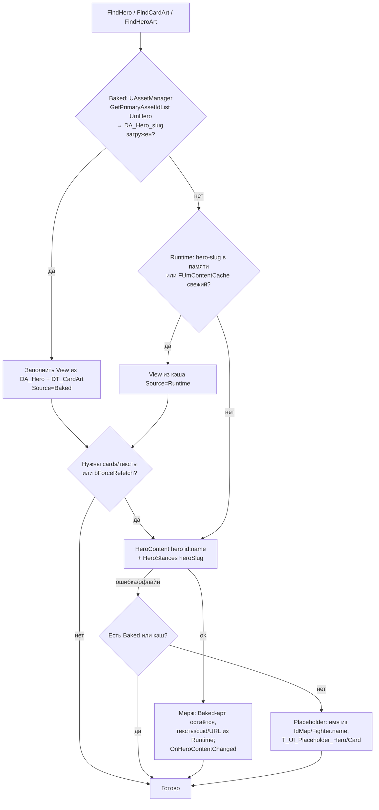

# 07. Контент и ассеты: фасад контента, загрузка из GraphQL, кэш изображений, импорт, локализация артов

> Статус: план фазы реализации. Основание — ADR `docs/unreal/01-architecture-decision.md` (§3.4, §3.7, §4.2, §4.3, §4.5, §5.4, §5.5, §6 B2/B14/B17/B18/B19, §8 п.5, §9.1 E0.4/E0.5, §9.2 E4/E8). Имена классов, файлов, ассетов, тегов и операций — из ADR; всё, чего ADR не задаёт, помечено «(уточнение к ADR)». Ссылки `файл:строка` — на репозиторий `C:/Users/ren/WebstormProjects/unmached/unmached/`; `$UE` = `C:/Program Files/Epic Games/UE_5.8/Engine`. Живой бэкенд и Docker в этой сессии недоступны — все «требует живой проверки» собраны в §12.

---

## 0. Назначение и границы раздела

**Что покрывает раздел.** Всё, что превращает данные контента бэкенда (герои, карты, доски, стойки) и их изображения в то, что видит игрок в UE-клиенте:

1. `UUmContentSubsystem` — фасад трёх провайдеров Baked → Runtime → Placeholder (ADR §4.5, графт G4), карта идентификаторов `FUmIdMap`, стойки, переопределения дефектных полей.
2. `FUmContentCache` — дисковый кэш ответов контента и правила инвалидации (ADR §4.5).
3. `UUmImageCacheSubsystem` — URL → диск → `UTexture2D` (ADR §4.5).
4. Baked-контент: `UUmHeroDefinition`, `UUmBoardDefinition`, DataTable'ы `DT_CardArt/DT_HeroArt/DT_BoardArt/DT_AttackRange/DT_ServerErrorMap`, `AssetManager` (`PrimaryAssetTypesToScan`, `PAL_<Set>`), именование `T_*`, бюджеты (ADR §3.4, §3.5, §4.3, §4.5).
5. Офлайн-конвейер: `unreal/Tools/export-content.mjs`, `unreal/Tools/convert-assets.mjs` (уточнение к ADR — модуль конвертации внутри конвейера §3.7), `unreal/Tools/export-ability-table.ts`, `UUmContentImportCommandlet` (`UmEditor`), рецепты MCP (ADR §3.7, §5.8).
6. Локализация артов (RU-карты с fallback на EN).

**Чего раздел не покрывает.** Парсинг `GameState` и правила (`UmModel`, раздел 03/04 плана); экраны и виджеты, которые *потребляют* контент — `WBP_HeroPicker`, `WBP_CardView`, `WBP_CardInspector`, `AUmFighterActor` (разделы UI/презентации); `ST_UI` и локализацию «хрома» (раздел UI); сетевой транспорт (`UUmNetSubsystem`, раздел 02). Тексты карт и способностей — с сервера, в этом разделе только правила их получения.

**Связи с другими разделами** (нумерация — по плану фазы `02…11`; при расхождении номеров ориентироваться на тему):

| Раздел | Что берёт из 07 | Что даёт в 07 |
|---|---|---|
| 02 — сеть и auth (`UmNet`) | — | `UUmNetSubsystem::Execute(FUmGraphQLRequest)` для всех контентных запросов; `UUmAuthSubsystem::OnAuthStateChanged(LoggedIn)` как триггер `RefreshIdMap()`; `IUmHttpTransport` не используется для картинок — `UUmImageCacheSubsystem` идёт напрямую в `FHttpModule` (уточнение к ADR: бинарный GET не является GraphQL-операцией) |
| 03 — модель контракта (`UmModel`) | DTO `FUmHeroDto`, `FUmCardDto`, `FUmBoardDto`, `FUmBoardSpaceDto`, `FUmContentSummaryDto`, `FUmStanceOptionDto`, `FUmHeroListItemDto`, `FUmBoardListItemDto` (ADR §4.2); `FUmSlug` (ADR §4.3); строки `UmTableRows.h`; документы `unreal/Ops/*.graphql` (§3.2) | Раздел 07 задаёт точные поля выборок для этих документов и колонки строк DataTable |
| 04 — состояние и синхронизация (`UUmStateSubsystem`) | `EnsureHero`, `EnsureBoard`, `GetStances` вызываются из `EnterRoom`/`EnterGame`; контент никогда не блокирует применение снапшота | `Fighter.heroId/heroSlug/name`, `HandCard.cardId`, `GameResponse.boardId` — ключи резолва (§1.1) |
| 05/06 — UI и HUD-модель | `FUmArtRef` / `UUmImageCacheSubsystem::Get` для `WBP_CardView`, `WBP_HeroCard`, `WBP_PlayerPanel`, `WBP_CardInspector`; плейсхолдеры `T_UI_Placeholder_*` | Требования к разрешению арта (рука 512×716, инспектор 1024×1432) |
| Презентация (`AUmGameStage`, `AUmFighterActor`) | `UUmBoardDefinition.Texture` + `ArtUvScale`, `UUmHeroDefinition.Mini`, `AccentColor` | Требование PoT-текстур с мипами для 3D-плоскостей |
| Тесты/dev-инструменты | Спеки §10, `UUmMockBackend` использует `Tests/Fixtures/content/*.json` (уточнение) | — |
| Дорожная карта | Задачи `T-07-*` (§11) ложатся в E0.4, E0.5, E4, E8 ADR §9 | — |

---

## 1. Идентификаторы и источники истины

### 1.1. Четыре пространства идентификаторов

| Пространство | Где встречается | Формат | Источник |
|---|---|---|---|
| **Имя героя** (`Hero.name`, unique) | Публичные `heroes/heroesPaginated/hero/heroesBySet`: `Hero.id == Hero.name`; `hero(id:)` принимает имя (case-insensitive) | `"Medusa"`, `"King Arthur"`, `"Ms. Marvel"` | `backend/src/content/mappers/content.mapper.ts:59,195`; `backend/src/content/content-db.service.ts:183-189` |
| **cuid героя** (`Hero.id` Prisma) | `heroList.items[].id` (JWT); `selectHero(gameId, heroId)`; `GameState.players[].heroId`, `fighters[].heroId`; `GamePlayerResponse.heroId` | cuid-строка | R6 §2.4; R3 §2.9.2-2.9.3; `backend/src/admin/dto/admin.dto.ts:1111-1145` |
| **heroSlug** | `Fighter.heroSlug`; аргумент `heroStances(heroSlug)`; ключ `ABILITY_CONFIGS[].heroId`; имена `DA_Hero_<heroSlug>`, `T_Hero_<heroSlug>_*`, папки `Textures/Cards/<heroSlug>/`; ключ скрап-данных `scraped-data/api/heroes/<slug>.json` | `slugifyHeroName(name)`: lowercase, `[^a-z0-9]+ → -`, trim `-` → `"ms-marvel"`, `"king-arthur"`, `"t-rex"` | `backend/src/game-engine/models/fighter.model.ts:80-85`; `backend/src/game-engine/abilities/ability-config.ts:389-395`; R9 §2.6 |
| **cardSlug** | Имена `T_Card_<heroSlug>_<cardSlug>_EN\|RU`, ключи `DT_CardArt` `<heroSlug>:<cardSlug>`, файлы `public/assets/decks/<heroSlug>/<cardSlug>.webp` | `slugify(title)`: NFKD, без диакритики и апострофов `'`/`’`, lowercase, `[^a-z0-9]+ → -`, trim → `"queen-annes-revenge"` | `scripts/sync-card-assets.mjs:23-31`; R9 §2.6 |
| **cuid карты** (`Card.id`) | Публичный `Card.id`; в состоянии `HandCard.cardId` (экземпляр — `"<cardId>::n"`) | cuid | R5 §2.3, §2.13 |
| **Имя доски** (`Board.name`) | Публичные `boards/board(id:)`: `Board.id == Board.name`; `board(id:)` — по имени (insensitive) | `"Cobble City"` | `content.mapper.ts:251`; `content-db.service.ts:329-331` |
| **cuid доски** | `boardList.items[].id` (JWT); `createGame(input:{boardId})`; `GameResponse.boardId` | cuid | R6 §2.4; `admin.dto.ts:1169-1195` |
| **boardSlug** (уточнение к ADR) | `DA_Board_<boardSlug>`, `T_Board_<boardSlug>`, ключ `DT_BoardArt` | `FUmSlug::HeroSlug(Board.name)` → `"cobble-city"`; арт-слаг может отличаться: `cobble-city` ↔ `hells-kitchen` | ADR §4.5; R9 §2.3 |

Правила:

- **Истина для чисел — только `GameState`** (`fighters[].health/maxHealth/movement/attackType`, `handZones[].cards[].attackValue/defenseValue/boostValue/bannerName`). Контент — арт, тексты, каталог до партии (ADR §4.5; R6 §3.4).
- **Ключ героя в клиенте — `heroSlug`**; имя и cuid — производные через `FUmIdMap` (§1.2). Ключ карты для арта — пара `(heroSlug, cardSlug)`; cuid карты — вторичный ключ (§6.2), потому что cuid меняется при пересидировании, а веб-клиент уже сопоставляет и по `id`, и по `title` (`src/lib/gameStateAdapter.ts:143-149`, R9 §2.6).
- **cuid ↔ имя — только из `heroList`/`boardList`** под JWT (ADR §1.3 п.10; R6 §3.2). Подставлять `id` из публичных `heroes`/`boards` в `selectHero`/`createGame` нельзя.

### 1.2. `FUmIdMap` и запросы `heroList`/`boardList`

Структура (уточнение к ADR — ADR задаёт только `IdMap()` с семантикой `name ↔ cuid ↔ heroSlug`):

```cpp
// UmClient/Public/Content/UmContentSubsystem.h
USTRUCT() struct FUmHeroIdEntry {
    FString Cuid;        // heroList.items[].id
    FString Name;        // heroList.items[].name  (== публичный Hero.id)
    FString HeroSlug;    // FUmSlug::HeroSlug(Name)
    FString Set;         // heroList.items[].set
    double  Health = 0;  // heroList.items[].health — в схеме Float (R6 §4.14)
    FString FighterType; // сырой Prisma: "HERO" | "MINION" | "HUGE" (R5 §2.1)
    FString AvatarUrl;   // heroList.items[].avatarUrl (nullable)
    FString ImageUrl;    // heroList.items[].imageUrl — рубашка колоды (R5 §2.1)
};
USTRUCT() struct FUmBoardIdEntry {
    FString Cuid; FString Name; FString BoardSlug; FString Set;
    int32 Width = 0; int32 Height = 0;   // для скрапнутых досок — пиксели (R5 §2.3)
    FString ImageUrl;
};
USTRUCT() struct FUmIdMap {
    TMap<FString, FUmHeroIdEntry>  HeroesByCuid;
    TMap<FString, FString>         HeroCuidBySlug;      // heroSlug → cuid
    TMap<FString, FString>         HeroCuidByNameLower; // ToLower(name) → cuid
    TMap<FString, FUmBoardIdEntry> BoardsByCuid;
    TMap<FString, FString>         BoardCuidBySlug;
    TMap<FString, FString>         BoardCuidByNameLower;
    FDateTime FetchedAt; bool bReady = false;
    // хелперы: HeroCuid(slug|name), HeroSlugByCuid(cuid), HeroNameByCuid(cuid), BoardCuid(slug|name), BoardNameByCuid(cuid)
};
```

Запросы (документы — §3.2; имена операций `HeroIdMap`/`BoardIdMap` — К3 Приложение A, на которое ссылается ADR §4.2):

| Операция | Документ | Auth | Примечания |
|---|---|---|---|
| `HeroIdMap` | `query HeroIdMap($page: Int!) { heroList(page: $page, limit: 300, sortBy: "name", sortOrder: "asc") { items { id name nameEn set health fighterType avatarUrl imageUrl } total page limit totalPages } }` | `Required` | `GqlAuthGuard`, роли не нужны (`backend/src/admin/admin.resolver.ts:252-263`); Game Tester использует `limit: 300` (`admin/src/pages/game-tester/api.ts:73-79`); `total > limit` → дозапросить страницы `2..totalPages` (защита от роста БД; сейчас ≈ 84 героя — R6 §2.9) |
| `BoardIdMap` | `query BoardIdMap($page: Int!) { boardList(page: $page, limit: 100, sortBy: "name", sortOrder: "asc") { items { id name set width height imageUrl } total page limit totalPages } }` | `Required` | `admin.resolver.ts:281-292`; ≈ 30 досок (R6 §2.9) |

Жизненный цикл: `RefreshIdMap()` вызывается из `UUmAuthSubsystem::OnAuthStateChanged(LoggedIn)` (в том числе после `RestoreSession`); результат — на сессию + дисковая копия `idmap.json` (§4) для мгновенного старта; при `Auth`-ошибке — стандартный путь refresh раздела 02. `bReady == false` блокирует **только** кнопки «Создать игру» и «Выбрать героя» (`WhyNot: «Справочник героев ещё загружается»`), не лобби и не партию.

### 1.3. Слаги — `FUmSlug` (ADR §4.3, графт G15)

Две функции, два алгоритма, тесты в `Unmatched.Model.Slug` (ADR §4.8):

| Функция | Алгоритм | Источник | Примеры |
|---|---|---|---|
| `FUmSlug::HeroSlug(Name)` | `ToLower` → `[^a-z0-9]+ → -` → trim `-` | `fighter.model.ts:80-85` | `King Arthur → king-arthur`, `Ms. Marvel → ms-marvel`, `T. Rex → t-rex`, `Dr. Jill Trent → dr-jill-trent`, `Yennefer & Triss → yennefer-triss` |
| `FUmSlug::AssetSlug(Title)` | NFKD → удалить `U+0300–U+036F` → удалить `'` и `’` → `ToLower` → `[^a-z0-9]+ → -` → trim | `scripts/sync-card-assets.mjs:23-31` | `Queen Anne's Revenge → queen-annes-revenge`, `Devil of Hell's Kitchen → devil-of-hells-kitchen`, `Deadpool™ Merc for Hire, LLC → deadpooltm-merc-for-hire-llc`, `3 of Hearts → 3-of-hearts` (R9 §2.6) |

NFKD в UE: `FTextTransformer`/ICU недоступны в рантайме без `ICU`-модуля; для `AssetSlug` достаточно таблицы декомпозиции латиницы с диакритикой (`À-ÿ`, `Ā-ž`) — уточнение к ADR; «™» → `tm` (как в примере выше, NFKD раскладывает `™` в `TM`). Полная проверка — спек на примерах из `card-assets.generated.json`.

Слаг доски: `FUmSlug::HeroSlug(Board.name)` (уточнение к ADR) — ключ скрап-карт `maps.json` (`key: "hells-kitchen"`) совпадает с этим правилом для проверенного случая («Hell's Kitchen» → `hells-kitchen` только по `AssetSlug` — апостроф!). Поэтому **для досок ключ = `AssetSlug(name)`**, а не `HeroSlug` (`HeroSlug("Hell's Kitchen") = "hell-s-kitchen"`). Уточнение к ADR: `boardSlug := FUmSlug::AssetSlug(Board.name)`; `"Cobble City" → "cobble-city"` — одинаково в обоих правилах.

### 1.4. Переопределения дефектных полей публичного контента

Клиент обязан **не доверять** перечисленным полям (R5 §3.1, R6 §3.4; ADR §5.7 «`movement` героя»). Политика реализуется в `UUmContentSubsystem` при построении представлений (§2.2), а не в виджетах.

| Поле | Дефект | Источник | Политика клиента |
|---|---|---|---|
| `Hero.movement` | константа `3` в маппере | `content.mapper.ts:64,200`; R5 §2.3 | **Игнорировать.** В партии — `Fighter.Movement` (дефолт 2). В комнате/каталоге движение не показывать (MVP); v1 — `UUmHeroDefinition.Movement` из скрапа (`move`, R5 §2.1), `0` = неизвестно → скрыть |
| `Card.value` | `attackValue ?? defenseValue ?? boostValue ?? 0` → для SCHEME и карт без печатного значения равен BOOST | `content.mapper.ts:221-225`; R5 §2.3 | `FUmCardView.bShowValue = (Type != SCHEME)`; для DEFENSE/VERSATILE без печатного значения различить нельзя — принимается (7 карт, R5 §2.3). В партии — `attackValue/defenseValue` из состояния (`-1` = отсутствует → не рисовать) |
| `Hero.sidekickHealth` | всегда `null` — ни один сид не пишет | R5 §2.3 (grep 0 вхождений) | Не запрашивать. Сайдкики — только из `GameState.fighters[] (type MINION)` |
| `Hero.sidekickCount` | может быть `1` у героев без сайдкиков (фантом «Unknown») | R5 §4.5; ADR B19 | Показывать в каталоге только как «+N» без имён; каталог и партия переживают MINION «Unknown» |
| `Card.characterName` | название карты (`nameEn \|\| name`), **не** banner | `content.mapper.ts:228` | Не использовать для banner. Banner — только `HandCard.bannerName` в партии (ADR B14) |
| `Hero.urls.mini`, `Hero.urls.cardCover` | оба = `imageUrl` (рубашка колоды) `\|\| avatarUrl` | `content.mapper.ts:350-357`; R5 §2.3 | Для фишек и обложек — **только** Baked `UUmHeroDefinition.Mini/Cover` (из `scraped-data/images/heroes/{minis,card-covers}`); Runtime-fallback для фишки — `urls.avatar` (портрет) + диск с инициалами (`AUmFighterActor`, ADR §4.7); `urls.cardCover` использовать только как **рубашку** колоды героя (`WBP_DeckDiscard`), где она и уместна |
| `Hero.fighterType` в `hero(id)`/`heroesBySet` | всегда `HERO` | `content.mapper.ts:43` | Тип — из `heroesPaginated`/`heroList` (`parseFighterType`, `content.mapper.ts:315-322`); каталог фильтрует `HERO` (R5 §3.10) |
| `Hero.abilities[0].name` | литерал `"Ability"` | `content.mapper.ts:70`; R5 §4.12 | Показывать только `text`; заголовок — необязательная эвристика «ведущие слова капсом» (R5 §3.10) |
| `Card.effects[].timing` | значения вне GraphQL-enum (`d_u_r_i_n_g_c_o_m_b_a_t`) → ожидаемая ошибка сериализации | `content.mapper.ts:378-386`; R5 §4.1; ADR B17 | **Не запрашивать `timing`.** Выборка `effects { id text }` |
| `Board.width/height` | для скрапнутых досок — пиксели картинки | `backend/prisma/backfill-board-cells.ts:4-6,16-17`; R5 §2.3 | Сетка = `max(x)+1 × max(y)+1` по `spaces`; в партии — только `boardState` (ADR §4.7) |
| `Board.recommendedPlayers`, `BoardSpace.startingPositionsJson` | константа 2 / всегда `null` | `content.mapper.ts:255`; R5 §2.3 | Не запрашивать |
| `Hero.nameRu`, `Card.nameRu` | равны английским | `backend/prisma/seed-scraped.ts:281-282`; R5 §3.13 | Не запрашивать `nameRu`; RU-локализация имён — вне контента |
| `Hero.imageUrl/avatarUrl/updatedAt` | только в `heroes/heroesPaginated`, в `hero(id)` не заполняются | `content.mapper.ts:189-210`; R5 §2.3 | Брать из каталога (`HeroesPaginated`), не из `HeroContent` |
| `Card.imageUrl/imageUrlRu` в `hero(id).cards` | появились в незакоммиченной правке маппера | `content.mapper.ts:79-81` (рабочее дерево); R6 §2.8 | До деплоя B2/правки — карты без арта → Baked/Placeholder; факт проверяется в E0.2 |
| `contentVersion` | константа `'2.0.0'`, не меняется при правках | `content-db.service.ts:12`; R6 §2.5 | Не использовать как ключ инвалидации (§4) |

---

## 2. `UUmContentSubsystem` — фасад Baked → Runtime → Placeholder

### 2.1. Публичный API

```cpp
// UmClient/Public/Content/UmContentSubsystem.h  (ADR §3.3, §4.5)
DECLARE_DELEGATE_OneParam(FUmOnContentReady, bool /*bFromNetwork*/);
DECLARE_MULTICAST_DELEGATE_OneParam(FUmOnHeroContentChanged, const FString& /*HeroSlug*/);

UCLASS()
class UMCLIENT_API UUmContentSubsystem : public UGameInstanceSubsystem {
    GENERATED_BODY()
public:
    // --- Идентификаторы ---
    const FUmIdMap& IdMap() const;
    void RefreshIdMap(FUmOnContentReady OnReady);                      // heroList/boardList (JWT)

    // --- Каталог (до партии) ---
    void EnsureCatalog(FUmOnContentReady OnReady);                     // contentSummary → heroesPaginated → boards
    TArray<FUmHeroView>  GetHeroCatalog(bool bOnlyPlayable = true) const; // fighterType == HERO
    TArray<FUmBoardView> GetBoardCatalog() const;

    // --- Герой/доска/карты ---
    void EnsureHero(const FString& HeroSlug, FUmOnContentReady OnReady, bool bForceRefetch = false);
    void EnsureBoard(const FString& BoardSlug, FUmOnContentReady OnReady);
    const FUmHeroView*  FindHero(const FString& HeroSlug) const;      // Baked ∪ Runtime; nullptr → Placeholder
    const FUmBoardView* FindBoard(const FString& BoardSlug) const;
    const FUmCardView*  FindCard(const FString& HeroSlug, const FString& CardCuid) const;
    FUmArtRef FindCardArt(const FString& HeroSlug, const FString& CardCuid, const FString& TitleEn) const; // (heroSlug, AssetSlug(title)) → cuid → placeholder
    FUmArtRef FindHeroArt(const FString& HeroSlug, EUmHeroArtKind Kind) const;   // Avatar | Mini | Cover
    FUmArtRef FindBoardArt(const FString& BoardSlug) const;

    // --- Стойки ---
    void GetStances(const FString& HeroSlug, TFunction<void(const TArray<FUmStanceView>&)> OnReady);
    const TArray<FUmStanceView>* FindStancesCached(const FString& HeroSlug) const;

    // --- Ключи резолва из состояния партии ---
    FString HeroSlugForFighter(const FUmFighter& F) const;             // F.HeroSlug → IdMap(F.HeroId) → HeroSlug(F.Name)
    FString HeroNameForQuery(const FString& HeroSlug) const;           // IdMap → Name; иначе — имя из каталога; иначе пусто

    FUmOnHeroContentChanged OnHeroContentChanged;                      // Runtime перекрыл Baked/кэш
    FUmOnContentReady       OnCatalogChanged;
private:
    FUmContentCache Cache;                                             // §4
    TMap<FString, FUmHeroView>  Heroes;   TMap<FString, FUmBoardView> Boards;
    TMap<FString, TArray<FUmStanceView>> Stances;                      // на сессию
    TSet<FString> InFlightHeroes;                                      // дедупликация EnsureHero
};
```

Инварианты (ADR §4.5):

1. **Контент никогда не блокирует старт партии.** `EnterGame` (раздел 04) применяет первый снапшот и спавнит доску независимо от `EnsureHero`; виджеты биндятся на `FUmArtRef` и обновляются по `OnHeroContentChanged`.
2. Все методы — game thread; сетевые вызовы — через `UUmNetSubsystem::Execute` (раздел 02); один in-flight запрос на ключ (`InFlightHeroes`), повторный `EnsureHero` того же слага присоединяется к ожидающим.
3. Логи — категория `LogUmContent` (ADR §3.6): `Verbose` — источник каждого резолва (`Baked|Runtime|Placeholder`), `Warning` — расхождение Baked ↔ Runtime по `title`/`cardSlug`, отсутствие cuid в `IdMap`, недекодируемый URL.
4. Blueprint видит только `BlueprintCallable` обёртки `FindHeroArt/FindCardArt/FindBoardArt/FindStancesCached` (ADR §4.0).

### 2.2. Представления

```cpp
// (уточнение к ADR: имена *View — по К3 §3.5.1, поля — по R5 §2.3 и §1.4 этого раздела)
UENUM() enum class EUmArtSource : uint8 { Baked, Runtime, Placeholder };

USTRUCT(BlueprintType) struct FUmArtRef {
    UPROPERTY() TSoftObjectPtr<UTexture2D> Baked;      // T_* (может быть RU или EN — см. §9)
    UPROPERTY() FString RuntimeUrl;                    // уже резолвленный абсолютный URL или пусто
    UPROPERTY() FString RuntimeUrlUpgrade;             // RU-кандидат для прогрессивного апгрейда (§9) или пусто
    UPROPERTY() TSoftObjectPtr<UTexture2D> Placeholder;// T_UI_Placeholder_Card | _Hero | T_UI_CardBack
    UPROPERTY() EUmArtSource BestKnown = EUmArtSource::Placeholder;
    bool HasBaked() const; bool HasRuntime() const;
};

USTRUCT(BlueprintType) struct FUmCardView {
    FString Cuid;            // Card.id (пусто, если карта известна только из Baked-экспорта по скрапу)
    FString HeroSlug, CardSlug, Title;
    FString Type;            // wire: ATTACK | DEFENSE | SCHEME | VERSATILE (контентный enum — не движковый, R5 §2.3)
    int32 Value = 0, Boost = 0, Quantity = 0;
    bool  bShowValue = true; // false для SCHEME (§1.4)
    TArray<FText> EffectTexts;  // effects[].text
    FString ImageUrl, ImageUrlRu;
    FUmArtRef Art;           // собирается фасадом
};
USTRUCT(BlueprintType) struct FUmHeroView {
    FString HeroSlug, Name, Cuid /*из IdMap*/, Set;
    int32 Health = 0; int32 SidekickCount = 0;
    FString FighterType;     // из каталога, не из hero(id)
    TArray<FText> AbilityTexts;
    FString AvatarUrl, CardBackUrl;   // urls.avatar / imageUrl
    TArray<FUmCardView> Cards;         // пусто до EnsureHero
    FUmArtRef Avatar, Mini, Cover;
    FLinearColor AccentColor;          // Baked или дефолт #4ecca3 (R9 §2.4 fallback)
    FDateTime UpdatedAt; EUmArtSource Source; bool bCardsLoaded = false;
};
USTRUCT(BlueprintType) struct FUmBoardView {
    FString BoardSlug, Name, Cuid, ImageUrl;
    int32 GridW = 0, GridH = 0;         // из spaces (не width/height)
    TArray<FUmBoardSpaceDto> Spaces;    // только после EnsureBoard
    FUmArtRef Art; FVector2D ArtUvScale = FVector2D(1, 1); // §6.1
};
USTRUCT(BlueprintType) struct FUmStanceView { FString Id; FText Label; bool bIsDefault = false; };
```

### 2.3. Порядок резолва



Правила мержа Baked + Runtime (уточнение к ADR):

| Поле | Побеждает | Почему |
|---|---|---|
| Арт (текстуры) | Baked, если есть; иначе Runtime URL (если декодируем, §5.1); иначе Placeholder | Локальная текстура мгновенна и без WebP-проблемы |
| `Cards[].Cuid`, `Title`, `Type/Value/Boost/Quantity`, `EffectTexts`, `AbilityTexts`, `Health` | Runtime (свежий `hero(id)`) | Правки в админке доезжают без пересборки; значения всё равно не истина (§1.1) |
| Соответствие карта ↔ текстура | по `(HeroSlug, AssetSlug(Title))`; при промахе — по `Cuid` из `FUmCardArtRow.CardCuid`; при промахе — `Warning` + Runtime URL/Placeholder | R9 §2.6; §6.2 |
| `AccentColor`, `Mini`, `Cover` | только Baked | Runtime `urls.mini/cardCover` — рубашка (§1.4) |

### 2.4. Стойки `heroStances`

- Запрос `HeroStances(heroSlug)` — публичный, читает `ABILITY_CONFIGS` (`backend/src/games/game.resolver.ts:100-108`); непустой только для `alice` (`big` default, `small`) и `muhammad-ali` (`float` default с `attackRange: 2`, `sting`) — `ability-config.ts:856-859, 889-891`.
- `GetStances(heroSlug)`: кэш в памяти на сессию; на диске `stances-<slug>.json` с TTL 24 ч (уточнение: данные статичны в коде, меняются только деплоем); вызывается из `EnterGame` для каждого `Fighter.type == HERO` (ADR §5.5), результат — в `UUmGameHudModel.Stances` через `UUmStateSubsystem`; `[]` → `WBP_StanceBar` скрыт (ADR §5.5).
- Стойка по умолчанию: `isDefault == true`, иначе первая (ADR §5.7); текущая — `metadata.heroStances[userId]` в состоянии (R3 §2.9).
- Дальность стойки (`float` → 2) через GraphQL **не** приходит — только `DT_AttackRange` (§7.7).

### 2.5. Теги и делегаты

Раздел не вводит новых GameplayTags. Состояние загрузки контента не участвует в `Match.Sync.*`; единственный видимый игроку эффект — плейсхолдеры и подпись «арт загружается» в `WBP_CardView` (раздел UI). `Feature.DevTools` включает консольные команды `um.content.refresh` (сброс `FUmContentCache` + `EnsureCatalog`) и `um.content.dump <heroSlug>` (уточнение к ADR §4.8 `UUmDevConsole`).

---

## 3. Порядок загрузки контента

### 3.1. Этапы

| Этап (экран/событие) | Операции (точный порядок) | Auth | Условие/кэш | Блокирует? |
|---|---|---|---|---|
| **Boot** (`UI.Screen.Boot`, до логина) | 1) `ContentSummary`; 2) если каталог не свеж (§4.2) — `HeroesPaginated(page=1..N, limit=100)`; 3) `Boards` | `None` | TTL 1 ч + счётчики; параллельно с `RestoreSession` | Нет: `WBP_Boot` ждёт только auth; каталог догружается в фоне |
| **Login OK** (`OnAuthStateChanged(LoggedIn)`) | `HeroIdMap(page=1..)`, `BoardIdMap(page=1..)` | `Required` | На сессию + `idmap.json` | Только кнопки «Создать игру»/«Выбрать героя» |
| **Lobby** (`WBP_Lobby`, `WBP_CreateGameDialog`) | — (доски из каталога `Boards` + cuid из `BoardIdMap`) | — | — | — |
| **Room** (`EnterRoom`) | По `game.boardId` → `BoardIdMap → Name → boardSlug` → `EnsureBoard` (Baked `DA_Board_*`; иначе `Board(id:name)` для превью и `imageUrl`); `WBP_HeroPicker` — каталог (аватары через `UUmImageCacheSubsystem`); при выборе героя (своего или соперника по `players[].heroId`) — `EnsureHero(slug)` лениво для колоды/способности | `None` | `hero-<name>.json` свеж, если `updatedAt` не изменился и возраст < 1 ч | Нет |
| **EnterGame** (после первого применённого снапшота) | Для каждого `Fighter.type == HERO`: `EnsureHero(HeroSlugForFighter(F), bForceRefetch = true)` → `HeroContent(id: HeroNameForQuery(slug))` **всегда** (ADR §4.5) + `HeroStances(slug)`; префетч арта: своя рука → свой сброс → сброс соперника (карты боя) → колоды не трогать; арт доски из `EnsureBoard` | `None` | Ответы кэшируются; при ошибке — Baked/кэш/Placeholder | Нет (ADR §4.5) |
| **Snapshot applied** (каждый) | Новые `cardId` в своей руке/сбросах → `FindCardArt` → префетч отсутствующего | — | — | Нет |
| **Reconnect / resync** | Ничего нового; `EnsureHero` не повторяется | — | — | — |

Резолв `HeroSlugForFighter(F)`: (1) `F.HeroSlug`, если непустой (R3 §2.9.3); (2) `IdMap.HeroSlugByCuid(F.HeroId)`; (3) `FUmSlug::HeroSlug(F.Name)` для бойца типа HERO (уточнение к ADR §5.5, где `hero(id: <Fighter.name>)`). `HeroNameForQuery(slug)`: `IdMap` → `Name`; иначе имя из каталога `HeroesPaginated` по `HeroSlug(name) == slug`; иначе `F.Name`. После деплоя B2 (`getHeroBySlug` `OR [{id},{name}]`, `content-db.service.ts:183-189`) допустим `hero(id: <cuid>)` — переключается флагом `UUmClientSettings.bHeroByCuid` (уточнение), по умолчанию `false`.

### 3.2. Документы операций `unreal/Ops/*.graphql`

Единственный источник документов — `unreal/Ops/` (ADR §3.7); ниже — точное содержимое файлов раздела. Валидируются `ops-check.mjs` против `Schema/schema.introspection.json` (ADR §5.9), генерируются в `UmOps.gen.h`. Все — `EUmAuthMode::None`, `bIsMutation = false`, `RateLimitBucket = "content"` (без `@Throttle` на контенте — R1 §2.11), кроме `HeroIdMap`/`BoardIdMap` (`Required`, bucket `"admin-list"`).

```graphql
# Ops/ContentSummary.graphql
query ContentSummary { contentSummary { version heroesCount boardsCount setsCount sets } }

# Ops/HeroesPaginated.graphql   — каталог без cards (N+1 на сервере: content.resolver.ts:25-29; R5 §2.11 п.4)
query HeroesPaginated($page: Int, $limit: Int, $set: String) {
  heroesPaginated(page: $page, limit: $limit, set: $set) {
    items { id name nameEn health set fighterType sidekickCount avatarUrl imageUrl urls { avatar mini cardCover } updatedAt }
    pagination { total page limit totalPages hasNextPage }
  }
}

# Ops/HeroContent.graphql   — колода и способности одного героя; без effects.timing (B17), без movement/sidekickHealth/nameRu
query HeroContent($id: String!) {
  hero(id: $id) {
    id name nameEn health set fighterType sidekickCount
    abilities { id name text trigger }
    urls { avatar mini cardCover }
    cards { id title type value boost quantity imageUrl imageUrlRu effects { id text } }
  }
}

# Ops/Boards.graphql   — список досок для лобби/комнаты (spaces не нужны до превью)
query Boards { boards { id name width height imageUrl } }

# Ops/Board.graphql    — одна доска с геометрией (превью в комнате; в партии — boardState)
query Board($id: String!) {
  board(id: $id) { id name width height imageUrl spaces { position { x y } zones isObstacle } }
}

# Ops/HeroStances.graphql
query HeroStances($heroSlug: String!) { heroStances(heroSlug: $heroSlug) { id label isDefault } }

# Ops/HeroIdMap.graphql  (JWT)
query HeroIdMap($page: Int!) {
  heroList(page: $page, limit: 300, sortBy: "name", sortOrder: "asc") {
    items { id name nameEn set health fighterType avatarUrl imageUrl } total page limit totalPages
  }
}

# Ops/BoardIdMap.graphql (JWT)
query BoardIdMap($page: Int!) {
  boardList(page: $page, limit: 100, sortBy: "name", sortOrder: "asc") {
    items { id name set width height imageUrl } total page limit totalPages
  }
}
```

Скаляры: `updatedAt` — `DateTime` в GraphQL-поле → epoch-миллисекунды (ADR §1.3 п.4) → `FUmDateTime`; `heroList.items[].health` — `Float` (R6 §4.14) → `double`; `Int`-поля — `int32`. Wire-enum `type`, `fighterType`, `trigger`, `zones[]` — `FString` (ADR F4).

Почему `HeroesPaginated`, а не `heroes`: `getHeroesPaginated` **не кэшируется** на сервере (R6 §2.5 таблица методов), `getAllHeroes` — кэш 1 ч `content:heroes:all`; для свежего `updatedAt` первый предпочтительнее. `boards` кэшируется (`content:boards:all`), `board(id)` — нет; `hero(id)` — кэш `content:heroes:slug:<slug>` 1 ч, который `clearContentCache` **не** чистит (R6 §4.3) — отсюда «арт/текст может отставать до часа» (R6 §4.7).

### 3.3. Чего не запрашивать

| Не запрашивать | Причина | Источник |
|---|---|---|
| `heroes { cards { … } }`, `heroesPaginated { items { cards } }` | N+1 на сервере, лимит complexity/depth | `content.resolver.ts:25-29`; R5 §2.11 п.4; ADR §5.4 |
| `cards { effects { timing } }` | ошибка сериализации enum ожидается | R5 §4.1; ADR B17 |
| `Hero.movement`, `sidekickHealth`, `nameRu`, `Board.recommendedPlayers`, `BoardSpace.startingPositionsJson`, `Card.characterName` | дефектны/бесполезны (§1.4) | R5 §3.1 |
| `contentVersion` отдельно | входит в `contentSummary.version`; константа | `content-db.service.ts:12,413` |
| `cards(heroId)`, `card(id)`, `heroesBySet`, `sets`, `boardsPaginated` | покрыты `HeroContent`/`HeroesPaginated`/`Boards`; `heroesBySet` отдаёт `fighterType` всегда HERO | R5 §2.2 |
| `clearContentCache` | публичная мутация-like query, чистит только агрегаты; не инструмент клиента (dev — только `um.content.refresh` локально) | R6 §4.2-4.3 |
| `cardList`/`cardsList` (JWT) | единственный источник `bannerName`, но в партии banner приходит в `HandCard.bannerName`; в каталоге banner не показываем до B14 | R5 §3.3; ADR B14 |

### 3.4. Диаграмма `EnterGame`

```mermaid
sequenceDiagram
    participant S as UUmStateSubsystem
    participant C as UUmContentSubsystem
    participant N as UUmNetSubsystem
    participant I as UUmImageCacheSubsystem
    participant H as UUmGameHudModel / виджеты
    S->>S: Apply(first snapshot) → OnSnapshotApplied
    S->>C: EnsureBoard(boardSlug из IdMap(game.boardId))
    C-->>H: FUmBoardView (Baked DA_Board или кэш) — доска рисуется из boardState
    loop для каждого Fighter.type == HERO
        S->>C: EnsureHero(HeroSlugForFighter(F), bForceRefetch=true)
        C->>N: Execute(HeroContent{id: HeroNameForQuery(slug)})
        C->>N: Execute(HeroStances{heroSlug: slug})
        N-->>C: FUmHeroDto / [FUmStanceOptionDto] (или ошибка)
        C->>C: Мерж Baked+Runtime; FUmContentCache.Write(hero-<name>.json)
        C-->>S: OnHeroContentChanged(slug) → Stances в HudModel
        C-->>H: OnHeroContentChanged → ребинд FUmArtRef
    end
    H->>C: FindCardArt(heroSlug, cardId, title) для карт руки/сбросов
    C-->>H: FUmArtRef {Baked | RuntimeUrl | Placeholder}
    H->>I: Get(RuntimeUrl) при отсутствии Baked
    I-->>H: UTexture2D (память → диск → HTTP) или Placeholder
```

### 3.5. Ошибки и офлайн

| Ситуация | Поведение |
|---|---|
| `Network` на `HeroContent`/`HeroStances` | `FUmRetryPolicy` для query (3 попытки, ADR §4.1); после исчерпания — Baked/кэш/Placeholder, `LogUmContent` Warning; повтор при следующем `EnsureHero` (не по таймеру) |
| `NotFound` (`Hero not found: <slug>`, `NotFoundException`, `content-db.service.ts:193`) | Placeholder + Warning; вероятная причина — рассинхрон имени (`HeroNameForQuery` вернул слаг вместо имени) — залогировать оба |
| `Validation` (`GRAPHQL_VALIDATION_FAILED`) | Схема разошлась с `UmOps.gen.h` — `ensure` в dev, тост «Обновите клиент» в prod (раздел 02) |
| `Auth` на `HeroIdMap`/`BoardIdMap` | Стандартный refresh/повтор раздела 02; при `SessionLost` — `IdMap.bReady = false` |
| Карта не найдена ни в Baked, ни в Runtime (нет `cardId` в `hero.cards`) | `FUmCardView` из полей состояния (`name`, `attackValue/defenseValue/boostValue`, `text`) + `T_UI_Placeholder_Card`; в лог — `cardId` и `heroSlug` |
| Пустой `AssetBaseUrl` или недоступен веб-фронт | Корневые `/assets/…` → Placeholder без запроса, если `AssetBaseUrl` пуст; при недоступности — обычный `Network`-путь §5.2 |

---

## 4. `FUmContentCache`: дисковый кэш и инвалидация

Расположение: `FPaths::ProjectSavedDir()/UmContent/<host>/` (ADR §4.5), где `<host>` = `ApiBaseUrl` без схемы, `:` → `_` (например `localhost_3000`), чтобы кэши dev/prod не смешивались. Файлы (ADR §4.5 + уточнения):

| Файл | Содержимое | TTL / ключ свежести |
|---|---|---|
| `summary.json` (уточнение) | `{ fetchedAt, version, heroesCount, boardsCount, maxUpdatedAt }` | 1 ч |
| `heroes.json` | массив `FUmHeroDto` каталога (`HeroesPaginated`, все страницы) + `fetchedAt` | 1 ч **и** совпадение `heroesCount`; `maxUpdatedAt` пересчитывается при каждой записи |
| `hero-<name>.json` | ответ `HeroContent` + `fetchedAt` + `updatedAtAtFetch` (из каталога) | Комната: свеж, если возраст < 1 ч и `updatedAt` в каталоге не изменился; **партия: всегда перезапрос** (ADR §4.5) |
| `boards.json` | `Boards` + `fetchedAt` | 1 ч и `boardsCount` |
| `board-<slug>.json` (уточнение) | `Board(id)` со `spaces` | 1 ч |
| `stances-<slug>.json` | `HeroStances` | 24 ч (§2.4) |
| `idmap.json` (уточнение) | `FUmIdMap` | На сессию; на диске — только для мгновенного старта, обязательно перезапрашивается после логина |

Все файлы — JSON через `FJsonObjectConverter::UStructToJsonObjectString` (те же DTO, что и в `UmModel`), с версией формата `"cacheSchema": 1`; несовпадение версии → файл игнорируется. Ошибки чтения/записи диска не фатальны (`Warning`).

### 4.1. Почему `contentVersion` бесполезен

`CONTENT_VERSION = '2.0.0'` — константа в коде с комментарием «Increment when content changes» (`content-db.service.ts:9-12`); `AdminService` не инжектит ни `ContentDbService`, ни Redis — admin-мутации не инвалидируют кэш и не меняют версию (R6 §2.5); `getContentDiff` в GraphQL не экспонирован (R6 §4.1). Следовательно, версия хранится только для лога, а ключ свежести собирается из `contentSummary.heroesCount + boardsCount` (добавление/удаление) + `max(updatedAt)` по каталогу (правки) + TTL 1 ч (равен серверному Redis-TTL, `content-db.service.ts:17`) — ADR §4.5, R5 §3.12, R6 §3.4. До фикса B18 «арт/текст в UE ≠ значения в партии до 1 часа после правки в админке» принимается как известное ограничение (R6 §4.7).

### 4.2. Алгоритм свежести каталога

```text
EnsureCatalog(OnReady):
  local = Cache.ReadSummary()                       // может отсутствовать
  Execute(ContentSummary) → live | Network-ошибка
  if ошибка:
      if Cache.HasHeroes(): загрузить heroes.json/boards.json как есть; OnReady(false); return
      else: OnReady(false) с пустым каталогом (Placeholder-каталог: имена из IdMap, если есть); return
  stale = !local || Now − local.fetchedAt > 1h
        || live.heroesCount != local.heroesCount || live.boardsCount != local.boardsCount
  if !stale: загрузить кэш; OnReady(false); return
  pages = HeroesPaginated(page=1, limit=100); while hasNextPage: page++      // total ≈ 84 → 1 страница
  newMax = max(items[].updatedAt)
  for hero in items: if Cache.Has(hero-<name>.json) && hero.updatedAt > cached.updatedAtAtFetch → Cache.Invalidate(hero-<name>.json)
  Boards → boards.json
  Cache.WriteSummary({fetchedAt: Now, version: live.version, heroesCount, boardsCount, maxUpdatedAt: newMax})
  OnCatalogChanged; OnReady(true)
```

Точечная инвалидация по `updatedAt` героя — R6 §3.4 (в); напоминание: сам ответ `hero(id)` может быть серверно-кэшированным до 1 ч.

---

## 5. `UUmImageCacheSubsystem`

### 5.1. Правила резолва URL

Вход — строка из контента (`Card.imageUrl/imageUrlRu`, `Hero.urls.*`, `Hero.avatarUrl/imageUrl`, `Board.imageUrl`). Факты: по сидам в БД лежат абсолютные Supabase-URL (`backend/prisma/seed-scraped.ts:308-311,347-348`; `seed-all-scraped.ts:306-307`), документация обещает корневые `/assets/…` (`docs/backend-api/05-engine-and-content.md:478`), fallback-модуль содержит `/assets/decks/daredevil/grappling-hook.webp` (`backend/src/content/data/heroes/daredevil.ts:84-85`) — клиент обязан принимать оба формата (R5 §3.6, R9 §3.1, ADR §4.5). Что реально в живой БД — **требует живой проверки** (R5 §4.2).

| # | Правило | Действие | Источник |
|---|---|---|---|
| 1 | Пустая строка / `null` | `Placeholder` немедленно, без запроса и без записи в лог | — |
| 2 | Начинается с `http://` или `https://` | Как есть | R5 §2.12; ADR §4.5 |
| 3 | Начинается с `/` | `UUmClientSettings.AssetBaseUrl` (без завершающего `/`) + путь; дефолт `http://localhost:5174` — Vite `publicDir` веб-фронта (`vite.config.ts:20`; ADR §3.5). Пустой `AssetBaseUrl` → `Placeholder` | R5 §2.12; R9 §2.1 |
| 4 | Относительный путь без `/` (например `assets/…`) | Трактовать как правило 3 + `Warning` один раз на URL (уточнение) | — |
| 5 | Расширение (после отсечения `?query`/`#fragment`, lowercase) ∈ `{png, jpg, jpeg, bmp, tga}` | Загружать и декодировать `IImageWrapper` | `$UE/Source/Runtime/ImageWrapper/Public/IImageWrapper.h:26-66`; R8 §2.9 |
| 6 | Расширение ∈ `{webp, avif, gif}` | **HTTP не выполнять**: (а) проверить дисковый кэш `<sha1(url)>.png` — он мог быть предзаполнен офлайн (§7.2 `--seed-image-cache`, уточнение); (б) иначе `Placeholder` + `Verbose`-лог один раз на URL. WebP/AVIF нативно не декодируются (`IImageWrapper.h:26-66`, `$UE/Source/ThirdParty/` без libwebp — R8 §2.9); GIF — тоже вне `EImageFormat` | ADR §4.5, §7 «Рантайм-декодер WebP» |
| 7 | Без расширения или неизвестное | Загрузить; формат определить `IImageWrapperModule::DetectImageFormat` (`IImageWrapperModule.h:109`); `Invalid` → негативный кэш + `Placeholder` | — |
| 8 | Заголовок `Content-Type` | Не доверять; истина — сигнатура (правило 7) | — |

Расширение RU-карт **никогда не вычислять** — брать из `imageUrlRu` (R5 §2.12: у daredevil/ms-marvel/23 карт deadpool — `.webp`, у остальных — `.png`).

Практическое следствие для MVP: **все Supabase-карты — `.webp`** (R5 §2.1: расширения `.webp/.png/.gif` в скрапе; R9 §2.5 — EN-колоды WebP), поэтому Runtime-провайдер для карт почти всегда упирается в правило 6, и рабочий путь MVP — Baked-текстуры из офлайн-конвейера (§7). Runtime-декодирование реально работает для RU-PNG-сканов (R9 §2.5), локально сконвертированных PNG на веб-фронте и будущего PNG-зеркала (v2, ADR §7).

### 5.2. Конвейер `Get(Url, OnTexture)`

```mermaid
flowchart LR
    U[Url] --> R[Resolve §5.1]
    R -->|Placeholder| P[OnTexture Placeholder, Source=Placeholder]
    R -->|Абсолютный URL| M{LRU память\n256 / MaxResidentBytes}
    M -- hit --> T[OnTexture, Source=Memory]
    M -- miss --> D{Диск Saved/UmTextures/\nsha1 url .png|.jpg}
    D -- hit --> DEC[Декод → UTexture2D → в LRU]
    D -- miss --> NEG{Негативный кэш\nсессии?}
    NEG -- да --> P
    NEG -- нет --> Q[Очередь HTTP GET\n≤4 параллельно, таймаут 15 с]
    Q -->|200 + Detect ok| W[Записать на диск] --> DEC
    Q -->|404/410| N1[В негативный кэш] --> P
    Q -->|Network/5xx| RT{1 повтор через 1 с}
    RT -- ок --> W
    RT -- нет --> P
    DEC --> T
```

Детали (ADR §4.5 + уточнения):

- **Ключ**: `sha1(ResolvedUrl)` hex (`FSHA1`, `$UE/Source/Runtime/Core/Public/Misc/SecureHash.h:313`). ADR задаёт файл `<sha1(url)>.png`; уточнение: расширение = фактический формат (`png`|`jpg`) по сигнатуре, поиск на диске — по обоим; файлы `Saved/UmTextures/<host-независимо>` (URL уже абсолютный).
- **HTTP**: `FHttpModule::Get().CreateRequest()`, `GET`, `SetTimeout(15)`, без auth-заголовков (Supabase public bucket / Vite public — R9 §1 п.1); `OnProcessRequestComplete` на game thread (R8 §2.2). Не через `IUmHttpTransport` — это не GraphQL (уточнение к ADR §4.1).
- **Параллелизм**: ≤ 4 (ADR §4.5); очередь FIFO с приоритетом: `Hand > Combat > Discard > Catalog` (уточнение; `EUmImagePriority`), чтобы рука появлялась раньше аватаров в лобби.
- **Негативный кэш**: `TSet<FString>` на сессию для 404/410/`Invalid`; не пишется на диск.
- **Дисковый лимит**: 512 МБ, LRU по `lastAccess` из `Saved/UmTextures/index.json` (уточнение); очистка — при старте субсистемы, если превышен.
- **Один callback на подписчика**: `Get` возвращает `FUmImageHandle` с `Cancel()`; виджет отменяет при `NativeDestruct`. Дубликаты URL в очереди схлопываются (multicast).

### 5.3. Декодирование, создание текстуры, лимиты памяти

| Шаг | MVP | v1 |
|---|---|---|
| Декод | `FImageUtils::ImportBufferAsTexture2D(Buffer)` (`$UE/Source/Runtime/Engine/Public/ImageUtils.h:448-449`) на game thread — один вызов, использует `DecompressImage` (`ImageUtils.cpp:1381`) | `Async(EAsyncExecution::ThreadPool)`: `IImageWrapperModule::CreateImageWrapper(DetectImageFormat(...))` (`IImageWrapperModule.h:99,109`) → `SetCompressed` → `GetRaw(ERGBFormat::BGRA, 8)`; на game thread — `UTexture2D::CreateTransient(W, H, PF_B8G8R8A8, Name, RawData)` (`$UE/Source/Runtime/Engine/Classes/Engine/Texture2D.h:342`) |
| Настройки текстуры | `SRGB = true`, `LODGroup = TEXTUREGROUP_UI` (`TextureDefines.h:46`), `NeverStream = true`, `Filter = TF_Trilinear`, имя `RT_<sha1[0:12]>`; мипов у transient нет (эквивалент `TMGS_NoMipmaps`, `TextureDefines.h:156`) | то же |
| Даунскейл | Нет | Если длинная сторона > `MaxRuntimeLongestSide = 1024` (уточнение) — `FImageCore::ResizeTo` (`$UE/Source/Runtime/ImageCore/Public/ImageCore.h:968`) до 1024 перед `CreateTransient` (RU-сканы 1030–1065 × 1477–1526, R9 §2.5 → иначе 6,3 МБ RGBA8 каждая) |
| Память | LRU 256 текстур (ADR §4.5) **и** `MaxResidentBytes = 192 МБ` (уточнение; 512×716 RGBA8 = 1,47 МБ → ≈130 карт) — вытеснение по первому достигнутому пределу; вытеснённая текстура остаётся жива, пока на неё ссылается brush виджета (GC), затем освобождается | + `TEXTUREGROUP_UI` pool budget через `r.Streaming` не участвует (NeverStream) |
| Владение | `TMap<FString, TStrongObjectPtr<UTexture2D>>` внутри субсистемы; наружу — `UTexture2D*` (виджеты держат через `FSlateBrush`) | то же |

### 5.4. Плейсхолдеры и политика локали

Плейсхолдеры (ADR §3.4 `Content/Textures/UI/`): `T_UI_Placeholder_Card` (512×716, силуэт карты с зоной под заголовок/значение), `T_UI_Placeholder_Hero` (512×512), `T_UI_CardBack` (рубашка по умолчанию, когда `urls.cardCover` недоступен), `T_UI_Vignette`. Виджет при `Source == Placeholder` рисует поверх название, тип (цвет: attack `#ef4444`, defense `#3b82f6`, versatile `#a855f7`, scheme `#eab308` — `src/design-system/design-tokens.css:197-200`, R9 §3 п.6), значение и BOOST — «fallback-рендер карты без арта» (ADR §4.5, R7 §4 п.10). При `Source ∈ {Baked, Runtime}` текст **не** дублируется поверх полного арта (R9 §3 п.2).

Политика локали — §9.

### 5.5. API

```cpp
// UmClient/Public/Content/UmImageCacheSubsystem.h (ADR §3.3)
UENUM() enum class EUmImagePriority : uint8 { Hand, Combat, Discard, Catalog };
UENUM() enum class EUmImageSource : uint8 { Memory, Disk, Http, Placeholder };
DECLARE_DELEGATE_TwoParams(FUmOnTexture, UTexture2D* /*Texture*/, EUmImageSource);

UCLASS()
class UMCLIENT_API UUmImageCacheSubsystem : public UGameInstanceSubsystem {
    GENERATED_BODY()
public:
    FUmImageHandle Get(const FString& RawUrl, FUmOnTexture OnTexture,
                       EUmImagePriority Priority = EUmImagePriority::Catalog,
                       UTexture2D* PlaceholderOverride = nullptr);
    UTexture2D* Peek(const FString& RawUrl) const;           // только память, без загрузки
    FString ResolveUrl(const FString& RawUrl, bool& bDecodable) const; // §5.1, чистая функция → spec
    void Prefetch(TArrayView<const FString> Urls, EUmImagePriority Priority);
    void ClearDisk(); void ClearMemory();
    // статистика для um.imagecache.stats: hits/misses/bytes/queue
};
```

Настройки в `UUmClientSettings` (уточнение к ADR §3.5): `AssetBaseUrl` (есть), `ImageCacheMaxTextures = 256`, `ImageCacheMaxResidentMB = 192`, `ImageCacheDiskLimitMB = 512`, `ImageMaxParallel = 4`, `ImageHttpTimeoutSec = 15`, `MaxRuntimeLongestSide = 1024`, `bPreferRuArt` (см. §9).

---

## 6. Baked-контент: классы, таблицы, AssetManager, именование, настройки текстур

### 6.1. `UUmHeroDefinition`, `UUmBoardDefinition`

```cpp
// UmClient/Public/Content/UmHeroDefinition.h (ADR §4.5)
UCLASS(BlueprintType)
class UMCLIENT_API UUmHeroDefinition : public UPrimaryDataAsset {
    GENERATED_BODY()
public:
    UPROPERTY(EditAnywhere) FString HeroSlug;                       // ключ; == FUmSlug::HeroSlug(Name)
    UPROPERTY(EditAnywhere) FString Name;                           // как в БД: "Medusa"
    UPROPERTY(EditAnywhere) FString Set;                            // как в БД: "Battle of Legends, Volume One"
    UPROPERTY(EditAnywhere) TSoftObjectPtr<UTexture2D> Avatar, Mini, Cover;
    UPROPERTY(EditAnywhere) TArray<FUmCardArtRow> Cards;            // §6.2
    UPROPERTY(EditAnywhere) FLinearColor AccentColor = FLinearColor::FromSRGBColor(FColor(0x4e,0xcc,0xa3)); // fallback R9 §2.4
    // --- уточнение к ADR: только для экранов ДО партии; в партии истина — GameState ---
    UPROPERTY(EditAnywhere) int32 Health = 0;                       // hero.health (корректное поле)
    UPROPERTY(EditAnywhere) int32 Movement = 0;                     // из скрапа `move`; 0 = неизвестно (публичный movement=3 не используется)
    UPROPERTY(EditAnywhere) FString AttackType;                     // "melee"|"range"|"melee_range" из скрапа `attack`; пусто = неизвестно
    UPROPERTY(EditAnywhere) FText AbilityText;                      // abilities[0].text
    UPROPERTY(EditAnywhere) FString SourceHash;                     // sha256 входных данных экспорта (идемпотентность коммандлета)
    UPROPERTY(EditAnywhere) FDateTime ExportedAt;

    virtual FPrimaryAssetId GetPrimaryAssetId() const override { return FPrimaryAssetId(TEXT("UmHero"), FName(*HeroSlug)); }
};

// UmClient/Public/Content/UmBoardDefinition.h
UCLASS(BlueprintType)
class UMCLIENT_API UUmBoardDefinition : public UPrimaryDataAsset {
    GENERATED_BODY()
public:
    UPROPERTY(EditAnywhere) FString BoardSlug;                      // AssetSlug(Board.name): "cobble-city"
    UPROPERTY(EditAnywhere) FString Name;                           // "Cobble City"
    UPROPERTY(EditAnywhere) FString ArtSlug;                        // уточнение: "hells-kitchen" для cobble-city (R9 §2.3)
    UPROPERTY(EditAnywhere) TSoftObjectPtr<UTexture2D> Texture;     // T_Board_<ArtSlug>
    UPROPERTY(EditAnywhere) FVector2D ArtUvScale = FVector2D(1,1);  // уточнение: доля полезной области после PoT-паддинга (§7.3)
    UPROPERTY(EditAnywhere) int32 GridW = 0, GridH = 0;             // уточнение: из spaces; 0 = неизвестно
    UPROPERTY(EditAnywhere) FString SourceHash;
    virtual FPrimaryAssetId GetPrimaryAssetId() const override { return FPrimaryAssetId(TEXT("UmBoard"), FName(*BoardSlug)); }
};
```

Загрузка: `UAssetManager::Get().GetPrimaryAssetIdList("UmHero", Ids)` (`$UE/Source/Runtime/Engine/Classes/Engine/AssetManager.h:281`) при `Initialize` субсистемы → индекс `HeroSlug → FPrimaryAssetId`; сам DA грузится `LoadPrimaryAssets` (`AssetManager.h:308,326`) лениво в `EnsureHero`/`FindHero`; текстуры — `TSoftObjectPtr` + `FStreamableManager::RequestAsyncLoad` при первом `FindCardArt` (мягкие ссылки, чтобы каталог из 70 DA не тянул 1000 текстур). Критерий E0.4: список содержит `medusa`, `king-arthur` (ADR §9.1).

### 6.2. Строки DataTable (`UmModel/Public/UmTableRows.h`, ADR §4.3)

| Таблица (`Content/Data/`) | Row struct | Колонки | Имя строки | Источник данных |
|---|---|---|---|---|
| `DT_CardArt` | `FUmCardArtRow : FTableRowBase` | `HeroSlug`, `CardSlug`, `Title` (FString); `En`, `Ru` (`TSoftObjectPtr<UTexture2D>`); **уточнение:** `CardCuid` (FString, пусто при экспорте из скрапа) | `<heroSlug>:<cardSlug>` | `Import/<set>/cards.json` (§7.4) |
| `DT_HeroArt` | `FUmHeroArtRow` | `HeroSlug`, `Name`; `Avatar`, `Mini`, `Cover` (soft); `AccentColor` (FLinearColor) | `<heroSlug>` | `Import/<set>/heroes.json`; дублирует `DA_Hero_*` для быстрых выборок без загрузки DA (ADR §3.4 задаёт обе сущности) |
| `DT_BoardArt` | `FUmBoardArtRow` | `BoardSlug`, `Name`, `ArtSlug`; `Texture` (soft); `ArtUvScale` | `<boardSlug>` | `Import/boards.json` |
| `DT_AttackRange` | `FUmAttackRangeRow` | `HeroSlug`, `StanceId` (пусто = базовая), `Range` (int32) | `<heroSlug>` или `<heroSlug>:<stanceId>` | `Import/DT_AttackRange.csv` (§7.7) |
| `DT_ServerErrorMap` | `FUmServerErrorRow` | `Substring`, `Text` (FText) | произвольное | Каталог сообщений R3 §2.14/R2 §2.5 — раздел ошибок; здесь только импорт |
| `DT_HeroCombatMods` (v1) | `FUmHeroCombatModRow` | по ADR §4.3 | | v1 |

Строки в CSV для `TSoftObjectPtr` — полный путь объекта: `/Game/Textures/Cards/medusa/T_Card_medusa_gaze_EN.T_Card_medusa_gaze_EN`; импорт — `UDataTable::CreateTableFromCSVString` (`$UE/Source/Runtime/Engine/Classes/Engine/DataTable.h:351`) в коммандлете или `DataTableTools.import_file` (§7.6).

### 6.3. AssetManager, `PAL_<Set>`, чанки, папки сетов

- `DefaultEngine.ini` — два `PrimaryAssetTypesToScan` (`UmHero` → `/Game/Heroes`, `UmBoard` → `/Game/Boards`), без правок (ADR §3.5).
- `Content/Heroes/<Set>/DA_Hero_<heroSlug>` + `Content/Heroes/<Set>/PAL_<Set>` (`UPrimaryAssetLabel`, `$UE/Source/Runtime/Engine/Classes/Engine/PrimaryAssetLabel.h:12`): `bLabelAssetsInMyDirectory = true` (`:31-32`), `Rules.ChunkId = <индекс сета>`, `Rules.CookRule = AlwaysCook` для MVP-сета и `Unknown` для остальных (`:27-28`), `bIsRuntimeLabel = false`; текстуры героев сета лежат в `Content/Textures/Cards/<heroSlug>/` и `Content/Textures/Heroes/<heroSlug>/` (ADR §3.4) — вне папки метки, поэтому они попадают в чанк как **зависимости** `DA_Hero_*` (правило `bApplyRecursively = True` в ini) — это стандартное поведение `AssetManager`, но чанковую раскладку нужно проверить в `Project Launcher`/`-cookonthefly` (см. §12).
- **Имя папки сета** (уточнение к ADR — ADR задаёт `<Set>` без правила): таблица `unreal/Tools/set-folders.json` `{ "<Hero.set как в БД>": "<PascalCaseToken>" }`; дефолт — PascalCase от `AssetSlug(set)` (`"Hell's Kitchen" → "HellsKitchen"`, `"Cobble & Fog" → "CobbleFog"`); явное переопределение `"Battle of Legends, Volume One": "Core"` — потому что ADR E0.4 называет MVP-метку `PAL_Core`, а Medusa и King Arthur оба входят в этот сет (R5 §2.9). 25 сетов — R5 §2.10.
- **Ключ `PAL_<Set>` ↔ `ChunkId`**: `Core` = 0 (базовый pak), далее по алфавиту токенов 1..24; таблица фиксируется в том же `set-folders.json` полем `chunkId`.

### 6.4. Именование ассетов (ADR §3.4, §3.6; R9 §2.13 п.6)

| Ассет | Путь и имя | Пример |
|---|---|---|
| Карта | `/Game/Textures/Cards/<heroSlug>/T_Card_<heroSlug>_<cardSlug>_EN` и `_RU` | `T_Card_king-arthur_excalibur_EN` |
| Герой | `/Game/Textures/Heroes/<heroSlug>/T_Hero_<heroSlug>_Avatar\|Mini\|Cover` | `T_Hero_medusa_Mini` |
| Доска | `/Game/Textures/Boards/T_Board_<artSlug>` | `T_Board_hells-kitchen` |
| PoT-вариант для 3D (v1, уточнение) | суффикс `_P2` | `T_Hero_medusa_Mini_P2` (512×1024, мипы) |
| DA | `/Game/Heroes/<Set>/DA_Hero_<heroSlug>`, `/Game/Boards/DA_Board_<boardSlug>` | `DA_Hero_king-arthur`, `DA_Board_cobble-city` |
| Метка | `/Game/Heroes/<Set>/PAL_<Set>` | `PAL_Core` |
| UI | `/Game/Textures/UI/T_UI_CardBack`, `T_UI_Placeholder_Card`, `T_UI_Placeholder_Hero`, `T_UI_Vignette` | |

Дефис в именах объектов допустим (не входит в `INVALID_OBJECTNAME_CHARACTERS`); слаги гарантированно `[a-z0-9-]`.

### 6.5. Настройки текстур и бюджеты

| Класс | Разрешение | `PowerOfTwoMode` / мипы | Группа | Компрессия | sRGB | Байт (оценка) |
|---|---|---|---|---|---|---|
| Карты (рука, HUD) | 512×716 (пропорция 0,716 — R9 §2.5) | NPOT, `TMGS_NoMipmaps`, `NeverStream` | `TEXTUREGROUP_UI` | `TC_BC7` (RGBA у 96 EN-карт — R9 §2.13; блок 4×4: 512 и 716 кратны 4) | да | 512×716×1 Б = 0,35 МБ (R9 §3 п.10 — ≈0,5 МБ с накладными) |
| Карты (инспектор, v1 по необходимости) | 1024×1432 | то же | `UI` | `TC_BC7` | да | 1,47 МБ (R9 §2.13 п.3); только для сетов по требованию (ADR F16) |
| Аватар | 512×512 cover-crop (ms-marvel 750×705 — R9 §2.4) | NPOT→PoT совпадает; `NoMipmaps` | `UI` | `TC_BC7`/`TC_Default` | да | 0,26 МБ |
| Mini (фишка) | 512×704 (558×764 → 0,73) | MVP: NPOT `NoMipmaps` (плоскость `AUmFighterActor`, ортокамера, фиксированный масштаб); v1: `_P2` 512×1024 с мипами | UI / `World` для `_P2` | `TC_BC7` (RGBA — прозрачный фон, R9 §2.13 п.5) | да | 0,36 МБ |
| Cover (обложка/рубашка) | 512×716 (375×523 → апскейл не делать: 384×536 ближайший кратный 4 — уточнение: сохранять исходный размер ≤ 512 по ширине) | `NoMipmaps` | `UI` | `TC_BC7` | да | ≤ 0,35 МБ |
| Доска | Исходник 1337×866 (R9 §2.3) → паддинг до 2048×1024 (`ArtUvScale = (1337/2048, 866/1024)`) | PoT, мипы `TMGS_FromTextureGroup` | `TEXTUREGROUP_World` | `TC_BC7`/`TC_Default` | да | 2048×1024×1 × 1,33 ≈ 2,8 МБ |
| UI-плейсхолдеры | 512×716 / 512×512 | `NoMipmaps` | `UI` | `TC_BC7` | да | < 1 МБ всего |

Альтернатива паддингу в конвейере — `UTexture::PowerOfTwoMode = ETexturePowerOfTwoSetting::PadToPowerOfTwo` (`$UE/Source/Runtime/Engine/Classes/Engine/TextureDefines.h:186`; `Texture.h:1395`) в коммандлете; UV-масштаб понадобится в обоих случаях, поэтому выбран офлайн-паддинг (одно место истины, детерминированный `ArtUvScale`).

Бюджеты:

| Набор | Текстур | Cooked (BC7 512×716, оценка) | Комментарий |
|---|---|---|---|
| MVP (`Core`: Medusa 11 EN + 11 RU, King Arthur 16 EN + 16 RU по `scraped-data/api/normalized/{medusa,king-arthur}.json`; 6 hero-медиа; 1 доска; 4 UI) | ≈ 65 | ≈ 25–30 МБ | Число уникальных карт по normalized — проверить при экспорте (§12) |
| v1 — 18 локальных колод EN+RU (360 карт) | 360 + медиа | ≈ 180 МБ | R9 §3 п.10 |
| v1 — все 70 героев EN (880 уникальных карт, R5 §2.10) + RU по наличию | ≈ 880–1400 | 310–500 МБ | Верхняя оценка 0,35 МБ × 1400; `TC_Default` (BC1) для 131 RGB-карт даст −50 % на них |
| 29 досок (`maps.json`, 2 AVIF — R9 §2.3) | 29 | ≈ 80 МБ | 2048×1024 BC7 с мипами |

Git LFS (ADR §3.7: `*.uasset`, `*.umap` — LFS; открытый вопрос §8 п.5): исходники `public/assets/**` (229 МБ) и `scraped-data/**` (`git ls-files scraped-data` = 0; `scraped-data/images` = 132 МБ) в git **не отслеживаются** — офлайн-конвейер невоспроизводим из одного репозитория. Рекомендация раздела: (а) `Import/` остаётся вне git (ADR §3.7); (б) `Content/Textures/**` — в LFS, по сетам, MVP-сет первым (≈30 МБ); (в) `scraped-data/api/**` (JSON, без `images/`) — закоммитить как источник метаданных (уточнение; размер малый — проверить `du`); (г) лимиты LFS хостинга — требует проверки (для GitHub: https://docs.github.com/en/repositories/working-with-files/managing-large-files/about-storage-and-bandwidth-usage). Решение — за владельцем продукта до первого коммита текстур (E0.5).

---

## 7. Офлайн-конвейер импорта

### 7.1. Обзор

```mermaid
flowchart LR
    subgraph Источники
        L[Живой бэкенд\nlocalhost:3000/graphql]
        S[scraped-data/api/**\nscraped-data/images/**]
        P[public/assets/**]
        AC[backend/src/game-engine/abilities/ability-config.ts\nms-marvel.handler.ts]
    end
    L --> EC[unreal/Tools/export-content.mjs\n--source=live|scraped]
    S --> EC
    P --> EC
    EC --> CA[unreal/Tools/convert-assets.mjs\nsharp: webp/avif/gif/png/jpg → PNG,\nнормализация, PoT, именование]
    CA --> IMP[unreal/Import/\nmanifest.json + <Set>/heroes.json cards.json + boards.json + PNG]
    AC --> EA[unreal/Tools/export-ability-table.ts]
    EA --> IMP2[unreal/Import/ability-table.json\nDT_AttackRange.csv DT_HeroStances.csv]
    EA --> FX[unreal/Unmatched/Tests/Fixtures/ability/ability-table.json\nкоммитится]
    IMP --> CMD[UUmContentImportCommandlet\n-run=UmContentImport]
    IMP --> MCP[MCP: TextureTools / DataTableTools /\nDataAssetTools / ObjectTools / AssetTools]
    IMP2 --> CMD
    CMD --> C[Content/: T_* DA_* DT_* PAL_*]
    MCP --> C
    FX --> SPEC[spec Unmatched.Model.AttackRangeSync]
    C --> SPEC
```

Правило выбора инструмента (ADR §5.1, §5.8): ≤ 20 ассетов (E0.5, точечные правки) — MCP-рецепты §7.6; полный сет/все сеты — коммандлет §7.5 (MCP сериализован на game thread, один вызов = один ассет — R8 §2.16).

Расположение `Import/` (уточнение к ADR §3.7, где указано только `Import/` в `unreal/.gitignore`): `unreal/Import/` — сосед `unreal/Unmatched/`, вне `.uproject`, чтобы редактор не сканировал PNG-исходники.

### 7.2. `unreal/Tools/export-content.mjs` (ADR §3.7)

Node ESM, зависимости `unreal/Tools/package.json`: `graphql`, `sharp`, `tsx` (ADR §3.7; в корневом `package.json` и `backend/package.json` `sharp`/`tsx` нет — ставятся отдельно).

CLI:

```text
node unreal/Tools/export-content.mjs
  --source=live|scraped          # live (ADR) — по GraphQL; scraped — офлайн из scraped-data/** (уточнение)
  --api=http://localhost:3000/graphql
  --asset-base=http://localhost:5174     # для корневых /assets/… (Vite public)
  --heroes=medusa,king-arthur    # heroSlug-и; без флага — все
  --boards=cobble-city           # boardSlug-и; без флага — все
  --out=unreal/Import
  --card-size=512x716 [--inspector]      # + 1024x1432 вариант
  --seed-image-cache=<Saved/UmTextures>  # уточнение: положить PNG под sha1(url) для правила §5.1 п.6
  --dry-run
```

Алгоритм `--source=live` (ADR §3.7; порядок doc05:637-645 по R5 §2.11):

1. `contentSummary` → `manifest.summary`.
2. `heroesPaginated(limit:100, page:1..N)` без `cards` → фильтр `fighterType == HERO` (R5 §3.10) и по `--heroes` (сравнение `HeroSlug(name)`).
3. Для каждого героя — `hero(id: name)` (`HeroContent`, §3.2) по одному (N+1 — R5 §2.11 п.4); при `null`/ошибке — запись в `manifest.errors`, герой пропускается.
4. `boards` + `board(id: name)` для выбранных.
5. Сбор URL: `cards[].imageUrl/imageUrlRu`, `urls.avatar`, `avatarUrl`, `imageUrl` (рубашка), `board.imageUrl`. **Mini/Cover** для героя берутся не из API (там рубашка, §1.4), а из `scraped-data/api/normalized/<heroSlug>.json` → `urls.mini`, `urls.cardCover` (файл `scraped-data/api/normalized/daredevil.json:1-10`; поле `model` — `.glb`, не используется).
6. Резолв каждого URL в файл: (а) если базовое имя файла (nanoid) есть в `scraped-data/images/{decks,heroes/avatars,heroes/minis,heroes/card-covers,maps}/` — локальный файл (проверено: все 22 файла Medusa из `normalized/medusa.json` присутствуют в `scraped-data/images/decks/`); (б) иначе `public/assets/<path>` для корневых URL; (в) иначе HTTP GET (Supabase; доступность не проверялась — R9 §5). Хеш содержимого → `sourceHash`.
7. `convert-assets.mjs` (§7.3) → PNG в `Import/<Set>/…`.
8. Запись `Import/manifest.json`, `Import/<Set>/heroes.json`, `Import/<Set>/cards.json`, `Import/boards.json` (§7.4).

Алгоритм `--source=scraped` (уточнение к ADR; нужен, пока бэкенд недоступен, и для воспроизводимости без сети): вместо шагов 1–4 читать `scraped-data/api/heroes/<slug>.json` (Nuxt-payload, разбор через `resolveValue` как в `scripts/sync-card-assets.mjs:17-21,51-96`: элементы `nodes[2].data` с `hero === 1|2`, `card.title`, `item.image`, `item.i18n.ru.image`) — даёт `title` (→ `cardSlug`), EN/RU-URL, `startHealth`, `move`, `attack`, `specialAbility`, `sidekicks`, `set`; `cardCuid` остаётся пустым (сопоставление в клиенте — по `(heroSlug, cardSlug)`, §2.3). Доски — `scraped-data/api/maps.json` (`nodes[2].data`, поля `name,key,width,height,zones,image,…`; ключ `hells-kitchen` → `image` Supabase `.webp` — проверено). Cobble City в скрапе отсутствует (R9 §4.6): `DA_Board_cobble-city` создаётся с `ArtSlug = "hells-kitchen"` по таблице `unreal/Tools/board-art-overrides.json` (уточнение) и локальным `public/assets/boards/hells-kitchen.webp` (1337×866).

Дубликаты `title` внутри колоды схлопываются в один файл (`sync-card-assets.mjs:88`); `quantity` остаётся в `cards.json`.

### 7.3. `unreal/Tools/convert-assets.mjs` (уточнение к ADR — модуль конвертации, вызывается из `export-content.mjs` и как самостоятельный CLI над каталогом)

CLI: `node unreal/Tools/convert-assets.mjs --in=<dir|file> --out=<dir> --kind=card|avatar|mini|cover|board|ui [--pot] [--size=WxH]`.

| `kind` | Вход | Правила | Выход |
|---|---|---|---|
| `card` | WebP/AVIF/GIF/PNG/JPEG любых размеров (EN 250×349 … 1005×1403; RU-сканы 1030–1065 × 1477–1526 — R9 §2.5) | `sharp().resize(512, 716, { fit: 'cover', position: 'centre' })` — пропорции 0,712–0,717 ⇒ обрезка ≤ 1 %; апскейл малых (250×349) разрешён (иначе размытие в HUD неизбежно — данные лучше не существуют); RGBA сохраняется, RGB → RGB; `png({ compressionLevel: 9 })`; при `--inspector` второй файл 1024×1432 | `<cardSlug>_EN.png`, `<cardSlug>_RU.png` |
| `avatar` | 402×402 … 1024², один 750×705 | `resize(512, 512, cover, attention)` | `avatar.png` |
| `mini` | 558×764 RGBA | `resize(512, 704, fit: 'contain', background: transparent)`; `--pot` → 512×1024 с прозрачным паддингом снизу + запись `uvScale` | `mini.png`, `mini_P2.png` |
| `cover` | 375×523 … 768×1051 | если ширина > 512 — `resize(512, null)`; иначе без масштабирования; выровнять до кратности 4 (BC7) | `cover.png` |
| `board` | 1337×866 WebP; Supabase WebP/AVIF | ограничить длинную сторону 2048; паддинг до ближайшей PoT по каждой оси (2048×1024) прозрачным; `uvScale = (w/W, h/H)` | `<artSlug>.png` + `uvScale` в `boards.json` |
| `ui` | PNG | без изменений | копия |

Форматы входа: `sharp` (libvips) декодирует WebP, AVIF и GIF (по документации sharp — https://sharp.pixelplumbing.com/; версия и сборка libvips с AVIF — требует проверки при `npm i`). Все выходы — PNG 8-бит (штатный импорт UE и `TextureFactory` — R8 §2.9). sRGB-профиль не встраивать (`withMetadata(false)`), гамму не трогать — UE считает PNG sRGB при `SRGB = true`.

Идемпотентность: выход перезаписывается только при изменении `sourceHash` (`sha256` входного файла), хеши хранятся в `Import/<Set>/.hashes.json`.

### 7.4. Формат `Import/`

```text
unreal/Import/
  manifest.json
  ability-table.json                 # §7.7
  DT_AttackRange.csv  DT_HeroStances.csv
  boards.json
  boards/hells-kitchen.png
  Core/                              # <Set> по set-folders.json
    heroes.json  cards.json  .hashes.json
    heroes/medusa/{avatar,mini,cover}.png
    cards/medusa/<cardSlug>_EN.png  <cardSlug>_RU.png
    cards/king-arthur/…
```

```jsonc
// manifest.json
{ "schema": 1, "generatedAt": "2026-09-02T12:00:00Z", "source": "live|scraped", "api": "http://localhost:3000/graphql",
  "summary": { "version": "2.0.0", "heroesCount": 84, "boardsCount": 30 },   // при scraped — null
  "sets": { "Core": { "dbSet": "Battle of Legends, Volume One", "chunkId": 0, "heroes": ["medusa","king-arthur"] } },
  "errors": [] }

// <Set>/heroes.json — массив
{ "heroSlug": "medusa", "name": "Medusa", "cuid": "ck…|null", "set": "Battle of Legends, Volume One",
  "health": 16, "movement": 3, "attackType": "range", "sidekickCount": 3, "abilityText": "PETRIFYING GAZE …",
  "avatar": "heroes/medusa/avatar.png", "mini": "heroes/medusa/mini.png", "cover": "heroes/medusa/cover.png",
  "accentColor": "#4ecca3", "updatedAt": 1756800000000, "sourceHash": "sha256…" }

// <Set>/cards.json — массив
{ "heroSlug": "medusa", "cardSlug": "gaze-of-stone", "title": "Gaze of Stone", "cuid": "ck…|null",
  "type": "ATTACK", "value": 4, "boost": 1, "quantity": 2,
  "en": "cards/medusa/gaze-of-stone_EN.png", "ru": "cards/medusa/gaze-of-stone_RU.png|null",
  "imageUrl": "https://…webp", "imageUrlRu": "https://…webp|null", "sourceHash": "…" }

// boards.json
{ "boardSlug": "cobble-city", "name": "Cobble City", "cuid": "ck…|null", "artSlug": "hells-kitchen",
  "texture": "boards/hells-kitchen.png", "uvScale": [0.6528, 0.8457], "gridW": 6, "gridH": 4, "sourceHash": "…" }
```

Значения `movement`/`attackType`/`abilityText` в `heroes.json` — из скрапа (`--source=scraped`) или `null` (`--source=live`, где `movement` = 3 бесполезен); коммандлет пишет `0`/пусто при `null`.

### 7.5. `UUmContentImportCommandlet` (`UmEditor`, ADR §3.2-3.3)

```text
UnrealEditor-Cmd.exe <…>/unreal/Unmatched/Unmatched.uproject -run=UmContentImport
    -ImportDir=<abs unreal/Import> [-Sets=Core] [-NoTextures] [-NoTables] [-DryRun] -unattended -nopause -log
```

`UUmContentImportCommandlet : UCommandlet` (`$UE/Source/Runtime/Engine/Classes/Commandlets/Commandlet.h:40,103`), `Main(Params)`:

1. Прочитать `manifest.json`; для каждого сета из `-Sets` (по умолчанию все).
2. **Текстуры**: для каждого PNG — если целевой ассет существует и `AssetImportData`/`SourceHash` совпадает — пропуск; иначе `IAssetTools::ImportAssetTasks` (`$UE/Source/Developer/AssetTools/Public/IAssetTools.h:542`) с `UAssetImportTask { Filename, DestinationPath, DestinationName, bAutomated = true, bReplaceExisting = true, bSave = false }`; после импорта выставить настройки §6.5 (`LODGroup`, `MipGenSettings`, `CompressionSettings`, `SRGB`, `NeverStream`, для `_P2`/досок — мипы) и `UpdateResource()`.
3. **DA героев**: `LoadObject<UUmHeroDefinition>` по пути `/Game/Heroes/<Set>/DA_Hero_<slug>` или `IAssetTools::CreateAsset(Name, PackagePath, UUmHeroDefinition::StaticClass(), nullptr)` (`IAssetTools.h:349`); заполнить поля §6.1 и `Cards[]` (`FUmCardArtRow` с soft-путями текстур); `MarkPackageDirty`.
4. **Доски**: аналогично `DA_Board_<slug>` (`ArtSlug`, `ArtUvScale`, `GridW/H`).
5. **DataTable**: `DT_CardArt`/`DT_HeroArt`/`DT_BoardArt` — создать при отсутствии (`UDataTable` с `RowStruct`), строки — `AddRow`/`RemoveRow` по ключам (полная синхронизация набора сета: строки чужих сетов не трогать); `DT_AttackRange` — `CreateTableFromCSVString` из `DT_AttackRange.csv` (`DataTable.h:351`).
6. **Метка**: `PAL_<Set>` создать при отсутствии, выставить `bLabelAssetsInMyDirectory`, `Rules.ChunkId` из `manifest.sets[].chunkId`, `CookRule`.
7. Сохранить все dirty-пакеты (`UEditorAssetLibrary::SaveDirectoryOrAsset`/`UPackage::SavePackage`), вывести отчёт: создано/обновлено/пропущено/ошибок; код возврата ≠ 0 при ошибках.
8. `-DryRun` — только отчёт.

Валидатор (там же, `UmEditor`, уточнение): `UUmContentValidator` — для каждого `DA_Hero_*`: `HeroSlug == FUmSlug::HeroSlug(Name)`; все `Cards[].En` резолвятся; `CardSlug == FUmSlug::AssetSlug(Title)`; строки `DT_CardArt` ⊆ DA; повторяющиеся `PrimaryAssetId` отсутствуют. Запуск — `-run=UmContentImport -Validate` и в CI.

### 7.6. Рецепты MCP (ADR §5.8; сигнатуры — `$UE/Plugins/Experimental/Toolsets/EditorToolset/Content/Python/editor_toolset/toolsets/*.py`)

Порядок для одного героя (E0.5, ≤ 20 вызовов):

```text
1. AssetTools.create_folder("/Game/Textures/Cards/medusa"); AssetTools.create_folder("/Game/Heroes/Core")
2. TextureTools.import_file(folder_path="/Game/Textures/Cards/medusa",
      asset_name="T_Card_medusa_gaze-of-stone_EN",
      source_file="C:/Users/ren/WebstormProjects/unmached/unmached/unreal/Import/Core/cards/medusa/gaze-of-stone_EN.png")
   # texture.py:15-31 — валидация через unreal.TextureFactory(): PNG проходит, WebP — нет (R8 §2.9)
3. ObjectTools.set_properties("/Game/Textures/Cards/medusa/T_Card_medusa_gaze-of-stone_EN",
      {"LODGroup": "TEXTUREGROUP_UI", "MipGenSettings": "TMGS_NoMipmaps", "CompressionSettings": "TC_BC7",
       "SRGB": true, "NeverStream": true})                                   # имена свойств — UTexture/UTexture2D
4. TextureTools.get_size(texture) → ожидаем (512, 716)
5. DataTableTools.search_row_structs("UmCardArtRow") → schema
   DataTableTools.create("/Game/Data", "DT_CardArt", schema) | DataTableTools.import_file("/Game/Data", "DT_CardArt",
      "…/unreal/Import/DT_CardArt.csv", schema)            # data_table.py:34-55: CSVImportFactory, ECSV_DATA_TABLE
   DataTableTools.set_rows(DT_CardArt, values=<json строк>)   # ключи <heroSlug>:<cardSlug>
6. DataAssetTools.create("/Game/Heroes/Core", "DA_Hero_medusa", asset_type=UmHeroDefinition)   # data_asset.py:16
   ObjectTools.set_properties(DA, {"HeroSlug": "medusa", "Name": "Medusa", "Set": "…", "Avatar": "/Game/Textures/Heroes/medusa/T_Hero_medusa_Avatar", …})
7. DataAssetTools.create("/Game/Heroes/Core", "PAL_Core", asset_type=PrimaryAssetLabel)
   ObjectTools.set_properties(PAL, {"bLabelAssetsInMyDirectory": true, "Rules": {"ChunkId": 0, "CookRule": "AlwaysCook"}})
8. AssetTools.save_assets([...все пути...])
9. Проверка: ProgrammaticToolset.execute_tool_script → unreal.AssetManager? — недоступно из Python напрямую;
   вместо этого AutomationTestToolset.RunTests("Unmatched.Client.ContentBaked") (§10)
```

`DT_AttackRange` — тем же `DataTableTools.import_file` из `Import/DT_AttackRange.csv` со схемой `UmAttackRangeRow`. Формат CSV UE: первая колонка — имя строки (заголовок любой, обычно `Name`), далее имена `UPROPERTY`.

### 7.7. `export-ability-table.ts`, `DT_AttackRange`, spec `AttackRangeSync` (ADR §3.7, §4.8, F19)

Факты: `attackRange` через GraphQL не экспортируется — только `heroStances` (R4 §3.6, §4 п.6; ADR §1.3 п.12); источник — `ABILITY_CONFIGS` (`ability-config.ts:436`): `t-rex` `attackRange: 2` (`:510`), `bullseye` `5` (`:722`), `muhammad-ali` стойка `float` `attackRange: 2` (`:890`); Ms. Marvel — ручной хендлер с неэкспортируемой константой `const MS_MARVEL_EXTENDED_RANGE = 2` (`ms-marvel.handler.ts:22`). `ability-config.ts` не имеет `import`-ов (grep) — чистый TS-модуль, импортируется `tsx` без окружения Nest. Семантика: стоечный `attackRange` переопределяет базовый (`ability-config.ts:365-368`); хук только добавляет разрешение (`:398-411`); дефолт у всех — 1.

Скрипт (запуск `npx tsx unreal/Tools/export-ability-table.ts [--out=unreal/Import] [--check]`):

```text
1. import { ABILITY_CONFIGS } from '../../backend/src/game-engine/abilities/ability-config.ts'
2. msMarvelRange = /const\s+MS_MARVEL_EXTENDED_RANGE\s*=\s*(\d+)/.exec(readFile('…/heroes/ms-marvel.handler.ts'))[1]  — иначе exit 2
3. ranges = []
   for c of ABILITY_CONFIGS:
     if c.attackRange > 1: ranges.push({ heroSlug: c.heroId, stanceId: '', range: c.attackRange })
     for s of c.stances ?? []: if s.attackRange > 1: ranges.push({ heroSlug: c.heroId, stanceId: s.id, range: s.attackRange })
   ranges.push({ heroSlug: 'ms-marvel', stanceId: '', range: msMarvelRange, source: 'ms-marvel.handler.ts' })
   stances = ABILITY_CONFIGS.flatMap(c => (c.stances ?? []).map(s => ({ heroSlug: c.heroId, id: s.id, label: s.label, isDefault: !!s.default, attackRange: s.attackRange ?? null, combat: s.combat ?? null })))
4. sourceHash = sha256(ability-config.ts ⧺ ms-marvel.handler.ts); backendCommit = git rev-parse HEAD
5. Записать Import/ability-table.json { schema:1, generatedAt, sourceHash, backendCommit, ranges, stances }
   Import/DT_AttackRange.csv:  Name,HeroSlug,StanceId,Range   →  t-rex,t-rex,,2 | bullseye,bullseye,,5 | muhammad-ali:float,muhammad-ali,float,2 | ms-marvel,ms-marvel,,2
   Import/DT_HeroStances.csv:  Name,HeroSlug,StanceId,Label,bIsDefault,AttackRange → alice:big,… | alice:small,… | muhammad-ali:float,… | muhammad-ali:sting,…
6. Скопировать ability-table.json → unreal/Unmatched/Tests/Fixtures/ability/ability-table.json (коммитится)
7. --check: сгенерировать во временный файл и сравнить с зафиксированной копией из п.6 (без полей generatedAt/backendCommit); расхождение → exit 1
```

Ожидаемый MVP-набор строк `DT_AttackRange`: 4 (R4 §2.7.1: bullseye 5, t-rex 2, ms-marvel 2, muhammad-ali/float 2). Список растёт с `ability-config.ts` (10 из 12 последних коммитов правят движок — ADR F19), поэтому:

- `npm run ability:export` (обновить снимок + CSV) и `npm run ability:check` (CI, падает при дрейфе `ability-config.ts` относительно снимка) — в `unreal/Tools/package.json`.
- Spec `Unmatched.Model.AttackRangeSync` (`UmModel/Private/Tests/UmAttackRangeSync.spec.cpp`): читает `Tests/Fixtures/ability/ability-table.json` (`FPaths::ProjectDir()/Tests/Fixtures/…`, только `WITH_DEV_AUTOMATION_TESTS`), грузит `DT_AttackRange` (`LoadObject<UDataTable>(nullptr, TEXT("/Game/Data/DT_AttackRange.DT_AttackRange"))`) и проверяет **равенство множеств** строк `(HeroSlug, StanceId, Range)` в обе стороны; дополнительно — что `stances` снимка совпадают с ответом `HeroStances` в фикстурах `Tests/Fixtures/content/stances-*.json` (снятых `snapshot-fixtures.mjs`, ADR §3.7).
- `DT_HeroStances.csv` в MVP — только фикстура спека; v1 (уточнение к ADR) — `DT_HeroStances` (`FUmStanceRow : FTableRowBase { HeroSlug, StanceId, Label, bIsDefault, AttackRange }`) как офлайн-фолбэк `GetStances` при недоступности сети.
- Предпосылка B12 (экспорт через GraphQL) снимает ручную таблицу — тогда `DT_AttackRange` заменяется Runtime-провайдером с тем же интерфейсом `FUmRules::IsInAttackRange(…, ranges)`.

---

## 8. Покрытие и план добора

### 8.1. Что есть (R9 §1-2.7, проверено по ФС в этой сессии)

| Источник | Есть | Нет |
|---|---|---|
| `public/assets/decks/` | 18 героев × EN WebP = 227 (blackbeard, chupacabra, ciri, daredevil, deadpool, donatello, eredin, krang, leonardo, loki, michelangelo, ms-marvel, muhammad-ali, pandora, philippa, raphael, shredder, yennefer-triss — `scripts/verify-card-asset-coverage.mjs:9-28`); RU 133/227 (42 WebP + 91 PNG-скан) | RU у krang, leonardo, philippa, raphael, shredder, yennefer-triss (полностью), eredin 9, muhammad-ali 12, donatello 2 — 94 карты |
| `public/assets/heroes/` | daredevil, ms-marvel (avatar/mini/card-cover) | остальные |
| `public/assets/boards/` | `hells-kitchen.webp` 1337×866 | всё остальное |
| `scraped-data/images/heroes/` | avatars 70, minis 77, card-covers 70 (WebP/PNG/JPEG/AVIF/GIF), models 6 `.glb` | привязка к слагу только через `scraped-data/api/normalized/<slug>.json` (88 файлов) |
| `scraped-data/images/decks/` | 1575 файлов (1480 WebP + 95 PNG) — полный пул EN+RU; Medusa: 22 записи (11 EN + 11 RU), все локально; King Arthur: 32 (16 + 16) | титулы — только через `scraped-data/api/heroes/<slug>.json` |
| `scraped-data/api/maps.json` | 29 карт с Supabase-URL (27 WebP, 2 AVIF) | `cobble-city` отсутствует (R9 §4.6) |
| `public/assets/ui/**` | 21 PNG (15 HUD + 6 FX), почти не используются вебом (R9 §2.8) | в UE не переносятся — стиль воспроизводится UMG/материалами (R9 §3 п.8) |

**MVP-герои (Medusa, King Arthur) не входят в 18 локально сконвертированных колод** — их арт берётся из `scraped-data/images/decks` по `normalized/<slug>.json` (все файлы присутствуют) с титулами из `scraped-data/api/heroes/<slug>.json` или из живого `hero(id)`.

### 8.2. План добора

| Веха | Набор | Источник | Инструмент |
|---|---|---|---|
| Phase 0 (E0.5) | `Core`: medusa, king-arthur (EN+RU), медиа обоих, `cobble-city` ↔ `hells-kitchen`, 4 UI-плейсхолдера | `--source=scraped` (бэкенд не нужен) или `--source=live` | MCP-рецепты §7.6 (≈ 65 ассетов → уже на грани; допустим коммандлет) |
| MVP (E8) | + `DT_AttackRange`, `DT_HeroArt`, `DT_BoardArt`, `DT_ServerErrorMap`; `PAL_Core` | §7.7 | коммандлет |
| v1 | 18 локальных колод (EN+RU) + все 70 героев EN из скрапа + 29 досок; RU — по наличию; `_P2` для фишек | `--source=live` (cuid) с локальным резолвом файлов | коммандлет, по сетам; чанки `PAL_<Set>` |
| v1 | Перегенерация `card-assets.generated.json` веба (устарел — R9 §2.6) не требуется UE: манифест не читается | — | — |
| v2 | PNG-зеркало на CDN для Runtime-провайдера (снимает правило §5.1 п.6) либо libwebp как ThirdParty-модуль (ADR §7) | — | — |
| v2 | `.glb`-миниатюры (6 шт., `miniModelUrl` в админке — R6 §2.8) как 3D-фишки | Interchange glTF | открытый вопрос R9 §4.12 |

---

## 9. Локализация артов

Факты: веб выбирает `imageUrl || imageUrlRu` — EN первым (`src/components/cards/Card.tsx:48`, R9 §2.6); для русского UI нужна инверсия с обязательным fallback на EN — покрытие RU 133/227 у локальных колод (R9 §3 п.2); тексты `nameRu` не локализованы (R5 §3.13); RU-текст карт (`textRu`) публично не отдаётся (R5 §3.13) → **арт RU-карты — единственный источник русского текста карты**; RU-сканы ниже качеством и разного размера (R9 §2.5) — после нормализации §7.3 это скрыто.

Политика (`UUmClientSettings.bPreferRuArt`, дефолт = `FInternationalization::Get().GetCurrentCulture()->GetTwoLetterISOLanguageName() == "ru"`; культуры `en`/`ru` стейджатся — ADR §3.5):

| Порядок кандидатов при `bPreferRuArt` | Действие |
|---|---|
| 1. Baked `FUmCardArtRow.Ru` | показать сразу (`BestKnown = Baked`) |
| 2. Baked `.En` | показать сразу; если есть кандидат 3 — запросить его и **один раз** заменить по приходу (прогрессивный апгрейд, `FUmArtRef.RuntimeUrlUpgrade`) |
| 3. Runtime `imageUrlRu` (только если декодируем по §5.1) | `UUmImageCacheSubsystem::Get(..., Priority)` |
| 4. Runtime `imageUrl` (декодируем) | то же |
| 5. `T_UI_Placeholder_Card` + текстовый оверлей (EN-название и значения из состояния) | — |

При `!bPreferRuArt`: Baked `.En` → Runtime `imageUrl` → Placeholder; RU не используется вовсе. Переключение локали в настройках (`WBP_Settings`, `settings.language`) → `OnCatalogChanged` → ребинд артов без перезапроса контента. Для героев/досок RU-вариантов нет (один арт).

Шрифт текстового оверлея плейсхолдера — `F_Inter` (OFL, кириллица — ADR §3.4); Comic Sans/Ink Free из `scripts/localize-deadpool-ru.py` не переносятся (R9 §3 п.7).

---

## 10. Тесты раздела

| Набор | Модуль | Что проверяет | Данные |
|---|---|---|---|
| `Unmatched.Model.Slug` (ADR §4.8) | `UmModel` | `HeroSlug`: `King Arthur→king-arthur`, `Ms. Marvel→ms-marvel`, `T. Rex→t-rex`, `Yennefer & Triss→yennefer-triss`, `Dr. Jill Trent→dr-jill-trent`; `AssetSlug`: `Devil of Hell's Kitchen→devil-of-hells-kitchen`, `Queen Anne's Revenge→queen-annes-revenge`, `Deadpool™ Merc for Hire, LLC→deadpooltm-merc-for-hire-llc`, `3 of Hearts→3-of-hearts`, `Avast Ye!→avast-ye`, `I'm Not Touching You→im-not-touching-you`; доска `Hell's Kitchen→hells-kitchen` через `AssetSlug` | R9 §2.6; `card-assets.generated.json` |
| `Unmatched.Model.AttackRangeSync` (ADR §4.8) | `UmModel` | §7.7 | `Tests/Fixtures/ability/ability-table.json` |
| `Unmatched.Model.DtoRoundTrip` (ADR §4.8, часть) | `UmModel` | `FUmHeroDto` (`updatedAt` числом), `FUmCardDto` без `timing`, `FUmBoardDto.spaces`, `FUmHeroListItemDto.health: double`, `FUmContentSummaryDto`, `FUmStanceOptionDto` | `Tests/Fixtures/content/*.json` (снимаются `snapshot-fixtures.mjs`, ADR §3.7 — расширить контентными ответами, уточнение) |
| `Unmatched.Client.ContentFacade` (уточнение) | `UmClient` | Порядок Baked→Runtime→Placeholder на `UUmMockBackend` (G6): герой из DA без сети; герой без DA с сетью; без DA и без сети → Placeholder с именем из `IdMap`; мерж §2.3; `HeroSlugForFighter` три ветки; `bShowValue=false` для SCHEME; `EnsureHero` дедупликация | фикстуры `content/hero-medusa.json`, `stances-alice.json`, DA в `Content/Test/` |
| `Unmatched.Client.ContentCache` (уточнение) | `UmClient` | §4.2: TTL, счётчики, точечная инвалидация по `updatedAt`, версия схемы кэша, сбой диска не фатален | temp `Saved/UmContent/test_host/` |
| `Unmatched.Client.ImageCache` (уточнение) | `UmClient` | `ResolveUrl` все 8 правил §5.1; память→диск→HTTP на `FUmFakeHttpTransport`-подобном фейке (`IUmImageFetcher`, уточнение — тонкий интерфейс над `FHttpModule` только для тестов); негативный кэш; ≤ 4 параллельно; LRU по количеству и байтам; отмена хэндла; расширение RU из данных | PNG/JPEG-фикстуры 4×4 px в `Tests/Fixtures/images/` |
| `Unmatched.Client.ContentBaked` (уточнение; критерий E0.4) | `UmClient` | `GetPrimaryAssetIdList("UmHero")` ⊇ `{medusa, king-arthur}`; `DA_Hero_*.HeroSlug == HeroSlug(Name)`; все `Cards[].En` резолвятся; `DT_CardArt` строки ⊆ DA; `DA_Board_cobble-city.ArtSlug == hells-kitchen` | реальный `Content/` |
| `Unmatched.Editor.ContentImport` (уточнение) | `UmEditor` | Коммандлет на мини-`Import/` (2 карты, 1 герой, 1 доска) в temp-папке `/Game/Test/Import`: создание, идемпотентность по `SourceHash`, настройки текстур §6.5, отчёт, `-DryRun` | `Tests/Fixtures/import-mini/` |
| Node (`unreal/Tools`, vitest/`node --test`) | — | `convert-assets`: размеры/паддинг/`uvScale`; `export-content --source=scraped --dry-run`: Medusa 11 EN + 11 RU; `export-ability-table --check` | локальные `scraped-data/**` (требуют наличия на диске) |

---

## 11. Задачи для дорожной карты

Оценки — человеко-дни при «1 разработчик + агенты через MCP» (ADR §1.2 п.4). Вехи: Phase0 (E0.4/E0.5), MVP (E4/E8), v1, v2 (ADR §9).

| id | Название | Оценка, ч/д | Зависимости | Веха | Критерий готовности |
|---|---|---|---|---|---|
| T-07-01 | `UUmHeroDefinition`/`UUmBoardDefinition` + `PrimaryAssetTypesToScan` + `PAL_Core` (E0.4) | 0,5 | E0.1 (скелет проекта) | Phase0 | `GetPrimaryAssetIdList("UmHero")` возвращает `medusa`, `king-arthur`; spec `ContentBaked` зелёный |
| T-07-02 | `unreal/Tools/package.json` (`graphql`, `sharp`, `tsx`) + `convert-assets.mjs` (все `kind`, PoT, `uvScale`, хеши) | 1,0 | — | Phase0 | Node-тесты: 512×716 PNG из WebP/AVIF/PNG-скана; доска 2048×1024 + `uvScale`; идемпотентность |
| T-07-03 | `export-content.mjs --source=scraped` (Nuxt-payload, normalized, maps, `set-folders.json`, `board-art-overrides.json`) → `Import/` для `Core` | 1,0 | T-07-02 | Phase0 | `Import/Core/` содержит Medusa 11 EN + 11 RU, King Arthur EN+RU, медиа, `boards.json` с `hells-kitchen` |
| T-07-04 | Импорт `Core` через MCP-рецепты §7.6 + `DT_CardArt` + плейсхолдеры `T_UI_*` (E0.5) | 0,5 | T-07-01, T-07-03; редактор + MCP :8124 | Phase0 | Текстуры и таблица в проекте; решение по хранилищу (ADR §8 п.5) зафиксировано в §12 |
| T-07-05 | `FUmSlug` (`HeroSlug`, `AssetSlug` с таблицей декомпозиции) + spec `Slug` | 0,5 | E3 старт | MVP | Все примеры §10 проходят |
| T-07-06 | Документы `unreal/Ops/{ContentSummary,HeroesPaginated,HeroContent,Boards,Board,HeroStances,HeroIdMap,BoardIdMap}.graphql` + DTO контента + `DtoRoundTrip` на контентных фикстурах | 0,5 | E0.2 (снимок introspection), T-07-05 | MVP | `ops-check.mjs` зелёный; `OpsGenerated`/`DtoRoundTrip` зелёные |
| T-07-07 | `FUmIdMap` + `RefreshIdMap` (paging, JWT, `idmap.json`) + гейты кнопок | 0,5 | T-07-06, E1 (auth) | MVP | На `UUmMockBackend`: cuid по слагу/имени; `bReady` управляет `WhyNot` |
| T-07-08 | `FUmContentCache` (файлы §4, алгоритм §4.2) + spec `ContentCache` | 0,5 | T-07-06 | MVP | TTL/счётчики/точечная инвалидация покрыты спеком |
| T-07-09 | `UUmContentSubsystem`: каталог, `EnsureHero/EnsureBoard`, мерж Baked+Runtime, переопределения §1.4, `HeroSlugForFighter`, стойки, делегаты, `um.content.*` | 1,5 | T-07-01, T-07-07, T-07-08 | MVP | spec `ContentFacade`; в PIE против `UUmMockBackend` герой без DA получает арт/тексты; без сети — Placeholder |
| T-07-10 | `UUmImageCacheSubsystem` MVP: резолв §5.1, очередь ≤ 4, диск, `ImportBufferAsTexture2D`, LRU, негативный кэш, плейсхолдеры + spec `ImageCache` | 1,5 | E1 (HTTP-модуль подключён) | MVP | spec зелёный; PNG-аватар с `localhost:5174` и Supabase-PNG отображаются; `.webp` → Placeholder без запроса |
| T-07-11 | Политика локали §9 (`bPreferRuArt`, прогрессивный апгрейд) в `FUmArtRef` | 0,5 | T-07-09, T-07-10 | MVP | При `ru` RU-текстура из `DT_CardArt` показывается, при её отсутствии — EN; переключение культуры ребиндит |
| T-07-12 | `export-ability-table.ts` + `Import/DT_AttackRange.csv` + фикстура снимка + `npm run ability:{export,check}` + spec `AttackRangeSync` | 0,5 | T-07-02 | MVP | 4 строки MVP; `--check` падает при правке `ability-config.ts`; spec падает при расхождении DT и снимка |
| T-07-13 | `UUmContentImportCommandlet` + `UUmContentValidator` + spec `ContentImport` | 1,5 | T-07-01, T-07-03 | MVP | `-run=UmContentImport -Sets=Core` идемпотентно создаёт/обновляет `T_*/DA_*/DT_*/PAL_*`; `-Validate` без ошибок |
| T-07-14 | `DT_HeroArt`, `DT_BoardArt`, `DT_ServerErrorMap` (импорт из `Import/`), `PAL_Core` чанк 0, интеграция с `AUmGameStage` (`ArtUvScale`) и `AUmFighterActor` (`Mini`) (E8) | 0,5 | T-07-13, E6 | MVP | Доска Cobble City с артом Hell's Kitchen под сеткой; фишки Medusa/King Arthur с мини |
| T-07-15 | `export-content.mjs --source=live` (contentSummary → heroesPaginated → hero(id) → boards, локальный резолв файлов, `--seed-image-cache`) | 0,5 | T-07-03, живой бэкенд | MVP | На стенде `localhost:3000` `Core` экспортируется с cuid; `manifest.summary` заполнен |
| T-07-16 | Кросс-проверка Runtime-провайдера против живой БД: формат URL, `hero(id).cards.imageUrl` после деплоя правки маппера, `hero(id:<cuid>)` (B2) → флаг `bHeroByCuid` | 0,5 | T-07-15, E0.2 | MVP | Факты §12 закрыты; `LogUmContent` без Warning на MVP-паре |
| T-07-17 | v1: экспорт 18 локальных колод + всех 70 героев + 29 досок по сетам; `set-folders.json` для 25 сетов; чанки `PAL_<Set>`; проверка cook/чанков | 3,0 | T-07-13, T-07-15, решение по LFS | v1 | `-run=UmContentImport` без ошибок для всех сетов; cooked-размер в бюджете §6.5; чанки видны в `Project Launcher` |
| T-07-18 | v1: `_P2`-варианты для 3D, инспекторские 1024×1432 по сетам, `MaxRuntimeLongestSide` + `ResizeTo`, async-декод | 1,0 | T-07-10, T-07-17 | v1 | Инспектор показывает 1024-арт; RU-сканы из Supabase декодируются без >6 МБ текстур |
| T-07-19 | v1: `DT_HeroStances` офлайн-фолбэк + `FUmStanceRow`; `UUmHeroDefinition.Movement/AttackType/Sidekicks` из скрапа для комнаты | 0,5 | T-07-12, T-07-17 | v1 | Без сети `WBP_StanceBar` у alice/muhammad-ali работает; в комнате показываются HP/движение из DA |
| T-07-20 | v2: PNG-зеркало на CDN или libwebp ThirdParty; Runtime-провайдер без ограничения §5.1 п.6; переход `DT_AttackRange` на B12 при появлении | 2,0 | T-07-17; B12/B18 на бэкенде | v2 | Новый герой из админки отображается с артом без пересборки клиента |

Итого: Phase0 — 3,0 ч/д (входит в E0.4/E0.5 ADR §9.1); MVP — 9,5 ч/д (покрывает контентную часть E4 и весь E8 ADR §9.2; E4 в ADR оценён 6 ч/д на State+Content вместе, E8 — 3 ч/д — суммарно раздел укладывается в коридор при условии, что State-часть E4 ≈ 3,5 ч/д); v1 — 4,5; v2 — 2,0.

---

## 12. Допущения и что требует живой проверки

### 12.1. Допущения

1. `AssetBaseUrl` для корневых `/assets/…` = хост веб-фронта (`http://localhost:5174`, Vite `publicDir`) — только пока веб-фронт запущен; в production нужен CDN/статический хост (ADR B20 не покрывает статику — открытый вопрос).
2. Все карты/герои Supabase — WebP (по скрапу и сидам), поэтому Runtime-провайдер в MVP фактически даёт только тексты/cuid, а арт — Baked. Если в живой БД окажутся `/assets/*.webp` — тот же вывод.
3. Metadata-титулы карт из `scraped-data/api/heroes/<slug>.json` совпадают с `Card.name` в БД (сид пишет `card.title` во все три имени — `seed-scraped.ts:320-350`, R5 §2.1) → `AssetSlug(title)` одинаков для обоих источников экспорта.
4. Medusa и King Arthur принадлежат сету «Battle of Legends, Volume One» (R5 §2.9) — папка `Core` содержит их обоих; при v1 переименования не требуется, сет остаётся `Core`.
5. `IAssetTools::ImportAssetTasks` с `UAssetImportTask` в UE 5.8 работает для PNG через Interchange без диалогов в `-unattended` (стандартный путь автоматизированного импорта; путь заголовка `UAssetImportTask` не сверялся).
6. `sharp` в актуальной версии собирается с libvips, поддерживающим AVIF-декод; иначе 2 AVIF-доски и 1 AVIF-обложка конвертируются вручную (ImageMagick) — затрагивает только v1.
7. Дефис в именах ассетов (`DA_Hero_king-arthur`) не конфликтует с Content Browser и cook (не входит в список запрещённых символов); если на практике возникнут проблемы с `FPrimaryAssetId` парсингом `Type:Name` — заменить на `_` **во всех** именах согласованно и зафиксировать в ADR как правку.
8. Спек `AttackRangeSync` читает JSON из `Tests/Fixtures` по `FPaths::ProjectDir()` — только в редакторе/`-NullRHI`-прогонах, не в cooked.
9. LRU в 256 текстур (ADR) дополняется байтовым лимитом 192 МБ — уточнение, а не изменение ADR.
10. Раздел не предусматривает вертикальную синхронизацию `card-assets.generated.json` веба — UE его не читает.

### 12.2. Требует живой проверки (бэкенд/Docker недоступны в этой сессии)

| # | Что проверить | Как | Влияет на |
|---|---|---|---|
| L1 | Формат `Card.imageUrl/imageUrlRu`, `Hero.avatarUrl/imageUrl/urls.*`, `Board.imageUrl` в живой БД: Supabase vs `/assets/…` | `hero(id:"Daredevil"){ urls{avatar} cards{imageUrl imageUrlRu} }`, `boards{imageUrl}` (R5 §4.2; ADR E0.2) | §5.1, §7.2 |
| L2 | Наличие `imageUrl/imageUrlRu` в `hero(id).cards` (незакоммиченная правка маппера `content.mapper.ts:79-81`) на задеплоенном бэкенде | тот же запрос | Runtime-провайдер карт |
| L3 | `hero(id:<cuid>)` возвращает героя (B2) | `hero(id:"<cuid из heroList>"){id}` | `bHeroByCuid` |
| L4 | `effects { timing }` действительно падает на бэкфилленных картах | запрос с `timing` на `Medusa` | Подтверждение B17 (запрос всё равно исключён) |
| L5 | `heroList` под токеном обычного USER (не admin) отдаёт список; `total` ≈ 84; `fighterType` значения | `heroList(limit:300){total items{fighterType}}` под `<LOCAL_P2_EMAIL>` | §1.2, фильтр каталога |
| L6 | `updatedAt` приходит числом (epoch-ms) в `heroesPaginated.items` | запрос | `FUmDateTime` |
| L7 | Cobble City в БД: сетка 6×4 с зонами или 5×6 без (B1); имя доски `"Cobble City"`; `boardList` содержит её cuid | `board(id:"Cobble City"){width height spaces{position{x y} zones}}` | `DA_Board_cobble-city.GridW/H`, превью в комнате |
| L8 | Фантомный сайдкик «Unknown» у Medusa/King Arthur — нет (у них реальные сайдкики), у bullseye/t-rex/daredevil/ms-marvel — есть (B19) | `heroes{name sidekickCount fighterType}` | §1.4 |
| L9 | Доступность Supabase-бакета из клиента (CORS не важен для UE) и скорость | `curl -I https://yptpnirqgfmxphjvsdjz.supabase.co/storage/v1/object/public/decks/<nanoid>.webp` | Runtime/экспорт по HTTP |
| L10 | Vite `public/` на `localhost:5174` отдаёт `/assets/decks/daredevil/<slug>.webp` и RU-PNG | `curl -I` | §5.1 п.3 |
| L11 | Число уникальных карт Medusa/King Arthur (11/16 по normalized) против `hero(id).cards` (титулы, `quantity`) | сравнение при `--source=live` | §8.2, `cards.json` |
| L12 | `TextureTools.import_file` + `ObjectTools.set_properties` реально выставляют `CompressionSettings=TC_BC7`, `LODGroup=TEXTUREGROUP_UI` (имена enum-значений в Python) | E0.5 через MCP :8124 | §7.6 |
| L13 | Чанковая раскладка: текстуры из `Content/Textures/**` попадают в чанк `PAL_<Set>` как зависимости DA | `Project Launcher` / `-cookonthefly`, `AssetAudit` | §6.3 |
| L14 | `UAssetImportTask` путь заголовка и поведение при `bReplaceExisting` в 5.8 | сборка коммандлета | §7.5 |
| L15 | `sharp` AVIF/GIF-декод в установленной версии | `npm i sharp` + тест на `santas-workshop` AVIF | §7.3 |
| L16 | Размер `scraped-data/api/**` для коммита как источника метаданных | `du -sh scraped-data/api` | §6.5 LFS-рекомендация |
| L17 | Лимиты Git LFS хостинга репозитория | документация хостинга | ADR §8 п.5 |

---

## 13. Источники

- ADR `docs/unreal/01-architecture-decision.md`: §1.2, §1.3 п.4/10/12, §2.3 G4/G6/G11/G15, §2.4 F4/F11/F15/F16/F19, §3.2-3.7, §4.0-4.3, §4.5, §4.7, §4.8, §5.1, §5.4, §5.5, §5.7, §5.8, §6 (B1, B2, B12, B14, B17, B18, B19, B20), §7, §8 п.5, §9.1 E0.2/E0.4/E0.5, §9.2 E4/E8.
- Research: `R5-content-cards-heroes.md` (§1, §2.1-2.3, §2.8-2.13, §3, §4 — целиком); `R6-admin.md` (§2.4, §2.5, §2.8, §2.9, §3.2-3.5, §4.1-4.5, §4.7, §4.14, §4.15); `R9-assets-design-system.md` (целиком); `R8-ue58-capabilities.md` (§2.9, §2.16, §3.4); `R3-game-api-schema.md` (§2.9.2-2.9.3, п.151-162); `R4-engine-mechanics.md` (§2.7.1, §3.6, §4 п.6); `R7-web-client-port-catalog.md` (п.100-128, 227, 390, 470).
- Кандидаты: `_design/candidate-1.md` §3.8.1-3.8.4; `_design/candidate-3.md` §3.5.1-3.5.4, Приложение A.
- `docs/unreal/00-mcp-verification.md:36-60`.
- Бэкенд: `backend/src/content/dto/content.dto.ts:25-260`; `backend/src/content/mappers/content.mapper.ts:29-100, 185-260, 315-357, 375-412`; `backend/src/content/content-db.service.ts:1-36, 170-200, 395-445`; `backend/src/admin/dto/admin.dto.ts:1105-1215`; `backend/src/admin/admin.resolver.ts:245-292`; `backend/src/games/game.resolver.ts:95-108`; `backend/src/games/dto/gameplay.dto.ts:355-375`; `backend/src/game-engine/abilities/ability-config.ts:360-440, 506-510, 718-722, 846-895`; `backend/src/game-engine/abilities/heroes/ms-marvel.handler.ts:9-30`; `backend/src/game-engine/models/fighter.model.ts:60-100`; `backend/prisma/seed-scraped.ts` (по R5); `backend/prisma/backfill-board-cells.ts` (по R5).
- Веб/скрипты: `scripts/sync-card-assets.mjs:1-35, 51-96, 138-139`; `scripts/verify-card-asset-coverage.mjs:9-28`; `src/graphql/queries/heroes.graphql`; `admin/src/pages/game-tester/api.ts:65-87`; `vite.config.ts:20`; `src/design-system/design-tokens.css:197-200` (по R9).
- Данные: `scraped-data/api/normalized/{daredevil,medusa,king-arthur}.json` (структура, счётчики, наличие файлов в `scraped-data/images/decks/`); `scraped-data/api/maps.json` (`hells-kitchen`); `git ls-files scraped-data` (0), `du -sh scraped-data/images` (132 МБ); `ls docs/unreal` (разделы 02–11 ещё не созданы; `unreal/` отсутствует).
- UE 5.8.2 (`$UE`): `Source/Runtime/ImageWrapper/Public/IImageWrapper.h:26-66`; `Source/Runtime/ImageWrapper/Public/IImageWrapperModule.h:99,109`; `Source/Runtime/Engine/Public/ImageUtils.h:440-449`; `Source/Runtime/Engine/Private/ImageUtils.cpp:1381`; `Source/Runtime/Engine/Classes/Engine/Texture2D.h:342,345`; `Source/Runtime/Engine/Classes/Engine/TextureDefines.h:46,156,178-189,393-404`; `Source/Runtime/Engine/Classes/Engine/Texture.h:1395-1398`; `Source/Runtime/Engine/Classes/Engine/AssetManager.h:263,281,308,326`; `Source/Runtime/Engine/Classes/Engine/PrimaryAssetLabel.h:12,27-57`; `Source/Runtime/Engine/Classes/Engine/DataTable.h:351,358`; `Source/Runtime/Engine/Classes/Commandlets/Commandlet.h:40,103`; `Source/Runtime/Core/Public/Misc/SecureHash.h:313`; `Source/Runtime/Core/Public/Misc/Paths.h:290,323`; `Source/Runtime/ImageCore/Public/ImageCore.h:552,968`; `Source/Editor/UnrealEd/Classes/Factories/TextureFactory.h:48,109-113,168,179`; `Source/Developer/AssetTools/Public/IAssetTools.h:349,534,542`; `Plugins/Experimental/Toolsets/EditorToolset/Content/Python/editor_toolset/toolsets/{texture.py:15-40, data_table.py:32-80, data_asset.py:10-40, asset.py}`.
- Внешние: sharp — https://sharp.pixelplumbing.com/ (форматы входа; версия — проверить); GitHub LFS — https://docs.github.com/en/repositories/working-with-files/managing-large-files/about-storage-and-bandwidth-usage (лимиты — проверить).
