# 08. Игровые потоки: от старта приложения до game over, каждая механика как клиентский FSM

> Статус: план фазы реализации. Дата: 2026-09-02. Ветка: `fix/admin-panel`.
> Основание: `docs/unreal/01-architecture-decision.md` (далее **ADR**) — имена модулей, классов, тегов и файлов взяты оттуда без переименований. Факты контракта и механик — research-файлы `docs/unreal/_research/R1…R9` (далее **R1…R9**); проработанные потоки кандидатов — `docs/unreal/_design/candidate-1.md` (**К1**), `candidate-2.md` (**К2**), `candidate-3.md` (**К3**). Ссылки вида `файл:строка` — на исходники бэкенда (`backend/src/**`) в том виде, как они процитированы в research/ADR; часть строк перепроверена напрямую (помечено «проверено»).
> Живой бэкенд и Docker в этой сессии недоступны: всё, что нельзя подтвердить кодом, помечено «требует живой проверки» и собрано в §21.

---

## 0. Назначение, границы, связи

### 0.1. Что описывает раздел

Раздел задаёт **поведение клиента во времени**: для каждого пользовательского потока — предусловия, шаги «клиент ↔ сервер», точные операции и DTO, состояния UI/FSM ввода (в терминах нативных GameplayTags ADR §5.6), обработку ошибок (класс `EUmErrorClass` → реакция → откат) и критерии приёмки. Потоки нумеруются `F1…F20`, задачи дорожной карты — `T-08-NN` (§20).

Раздел **не** описывает: структуру модулей и классов (ADR §3–4), правила парсинга/дедупликации снапшотов (ADR §5.2 — здесь только ссылки), внешний вид виджетов и cue-ассеты (их описывают разделы UI и презентации), контент-конвейер (раздел контента).

### 0.2. Связи с ADR и другими разделами плана

| Что | Где | Как используется здесь |
|---|---|---|
| Двенадцать фактов контракта | ADR §1.3 | каждое правило потока опирается на них (ссылки `ADR §1.3 п.N`) |
| Правила `FUmGameSnapshotStore::Apply`, приватность | ADR §5.2 | потоки только вызывают `Apply(…, Source)`; правила не дублируются |
| Классификатор ошибок | ADR §5.3 | таблицы ошибок потоков используют классы `Network, Auth, Validation, Conflict, Concurrent, NotFound, Forbidden, RateLimited, Opaque, Unknown` |
| Обходы дефектов бэкенда | ADR §5.5, §6 (B1–B20) | потоки реализуют обходы; при фиксе предпосылки — помечено, что меняется |
| Таксономия GameplayTags | ADR §5.6 | состояния FSM = теги `UI.Screen.*`, `Input.Mode.*`, `Match.*`, `Net.State.*` |
| Таблица паритета | ADR §5.7 | гейты `FUmLegalActions` в потоках F7–F14 |
| Фаза 0 и эпики E1–E10 | ADR §9 | задачи §20 — декомпозиция E4 (State), E5 (экраны меню), E6 (презентация), E7 (Game HUD), E9 (тесты) по потокам |

Разделы `02…07`, `09…11` на момент написания не существуют; ссылки на них даны по темам, закреплённым в ADR §1 («десять подробных планов»): раздел проекта/конфига (`.uproject`, ini — ADR §3), раздел `UmNet` (транспорт, auth, WS — ADR §4.1), раздел `UmModel` (DTO, парсер, диф, `FUmLegalActions` — ADR §4.2–4.3), раздел State/Sync (`UUmStateSubsystem`, store, реконнект — ADR §4.4, §5.2), раздел контента (ADR §4.5), раздел UI (ADR §4.6), раздел презентации и cue (ADR §4.7), раздел тестов/dev-loop (ADR §4.8, §5.8), дорожная карта (ADR §9). Точная нумерация файлов — уточнение к ADR, здесь не фиксируется.

### 0.3. Общие соглашения для всех потоков

1. **Акторы** (классы ADR §4): `UUmAuthSubsystem` (Auth), `UUmNetSubsystem` (Net, HTTP + `FUmGraphQLWsClient`), `UUmStateSubsystem` (State: лобби/комната/партия, `FUmGameSnapshotStore`, `FUmServerClock`, `FUmActionGate`), `UUmContentSubsystem` (Content), `UUmUISubsystem` (UI: стеки `UI.Layer.*`, FSM экранов `UI.Screen.*`), `UUmPresentationSubsystem` (`FUmInputStateMachine`, очередь воспроизведения, `PresentedState`), `UUmGameHudModel` (модель HUD), `UUmMatchCueSubsystem` (cue).
2. **Операции** — по именам реестра `FUmOpsRegistry` (ADR §4.2, К3 Приложение A): `Login`, `Register`, `RefreshTokens`, `Logout`, `Me`, `HeroIdMap` (= `heroList`), `BoardIdMap` (= `boardList`), `AvailableGames`, `MyGames`, `CreateGame`, `JoinGame`, `GetGame`, `SelectHero`, `ToggleReady`, `StartGame`, `LeaveGame`, `AbortGame`, `GetGameState`, `GameSequence`, `EventsSince`, `HeroStances`, `HeroContent`, `Boards`/`Board`, 11 gameplay-мутаций `Maneuver … SetStance`, подписки `GameStateUpdated`, `GameEnded`, `PlayerJoined`, `PlayerLeft`, `MatchFound`. Документы живут в `unreal/Ops/*.graphql` и валидируются `ops-check.mjs` (ADR §5.9).
3. **Единый ответ gameplay-мутаций** — `FUmGameMutationResultDto { State: FString (JSON), SequenceNumber: int32, Timestamp: FUmDateTime (epoch-ms), Phase: FString, CurrentTurnPlayerId: FString, TurnCount: int32 }` (R3 §2.8; `gameplay.dto.ts:437-458`). Каждая успешная мутация = ровно `+1` к `sequenceNumber` (R4 §2.1). Ответ применяется `FUmGameSnapshotStore::Apply(state, Mutation)` немедленно; эхо подписки того же seq отбрасывается (ADR §5.2, G23).
4. **Одна in-flight gameplay-мутация** на клиент (`FUmActionGate`, ADR §4.4): на время запроса — тег `Input.Mode.Busy`, все аффордансы выключены; ретраев нет; класс `Concurrent` → `RefetchState()` без повтора действия (R2 §3.21; R7 §3 п.7).
5. **Откат** при отказе любой мутации — тривиален: состояние не менялось (предикции нет, ADR §1.2 п.6); клиент только (а) снимает выделения/режим ввода, (б) показывает тост с `Message` через `DT_ServerErrorMap` (фолбэк «Действие отклонено»), (в) при `Concurrent`/`Opaque`/`Unknown` дополнительно `RefetchState()`.
6. **Часы**: все дедлайны — по `FUmServerClock::GetServerNow()` (`OffsetMs` из `GameMutationResult.timestamp`, ADR §4.4); `combatInfo.timeoutAt` никогда не приходит (ADR §1.3 п.5).
7. **Смена хода** детектируется только по дифу `CurrentTurnPlayerId/TurnCount` (`Match.Event.Turn.Changed`) — событийные подписки `turnChanged/attackInitiated/defensePlayed/combatResolved` не используются (ADR §5.5; R4 §4.21).
8. **HUD биндится на `PresentedState`**, а гейты действий вычисляются по `Current` только когда очередь воспроизведения пуста (`Input.Mode.Busy` пока очередь не пуста — ADR §4.7, G9). Иначе игрок мог бы действовать по состоянию, которого ещё не видел.
9. **Нотация FSM**: состояние = тег; переход = «событие → тег»; гейт = `FGameplayTagQuery` над `UUmStateSubsystem::GetMatchTags()` (ADR §5.6).

### 0.4. Карта потоков

| Поток | Экран/теги | Ключевые операции | Веха |
|---|---|---|---|
| F1 Старт и восстановление сессии | `UI.Screen.Boot` | `RefreshTokens`, `Me`, `HeroIdMap`, `BoardIdMap` | MVP |
| F2 Логин/регистрация | `UI.Screen.Login/Register` | `Login`, `Register` | MVP |
| F3 Лобби | `UI.Screen.Lobby` | `AvailableGames`, `MyGames`, `CreateGame`, `JoinGame`, `LeaveGame` | MVP |
| F4 Комната | `UI.Screen.Room` | `GetGame`, `SelectHero`, `ToggleReady`, `StartGame`, `LeaveGame`, подписки | MVP |
| F5 Матчмейкинг | `Feature.Matchmaking` | `JoinQueue`, `MatchFound`, `AcceptMatch` … | v2 (B13) |
| F6 Загрузка партии | `UI.Screen.Game`, `Match.Sync.*` | `GetGame`, `GetGameState`, `HeroContent`, `HeroStances`, `Board` | MVP |
| F7 Цикл хода | `Match.Turn.*`, `Match.Actions.*` | — | MVP |
| F8 Манёвр | `Input.Mode.Maneuver` | `Maneuver`, `MoveFighter` | MVP |
| F9 Атака | `Input.Mode.CardSelected/BoostPick` | `Attack` | MVP |
| F10 Окно защиты | `Input.Mode.Defense` | `PlayDefense`, `ResolveCombat` | MVP |
| F11 Резолв | `Match.Phase.CombatResolve` | `ResolveCombat` | MVP |
| F12 Scheme | `Input.Mode.CardSelected` | `PlayScheme` | MVP |
| F13 Pending effects | `Input.Mode.PendingMove/PendingPlace/ChooseOne` | `ResolvePendingEffect` | MVP |
| F14 Стойки | `WBP_StanceBar` | `HeroStances`, `SetStance` | MVP (данные), v1 (герои) |
| F15 Двери/туман | — | `ToggleDoor` (dev) | — |
| F16 Pass / endTurn | — | `Pass`, `EndTurn` | MVP |
| F17 Game over | `UI.Screen.GameOver` | `LeaveGame`, `AbortGame` | MVP |
| F18 Реконнект и resync | `Match.Sync.Reconnecting/Resyncing`, `Net.State.*` | `GameSequence`, `GetGameState`, подписки | MVP |
| F19 VS_AI | `Feature.VsAi` | `CreateGame(VS_AI)` | v1 (ADR §8 п.7) |
| F20 Presence/heartbeat | `Feature.Presence` | `Heartbeat` | не используется (v2) |

---

## 1. F1 — Старт приложения и восстановление сессии

**Предусловия.** `L_Main` загружен; `AUmPlayerController::BeginPlay()` вызвал `UUmUISubsystem::EnsureRootLayout` (ADR F17); `UUmNetSettings.ApiBaseUrl` задан. WS **не** открывается до логина (подписки нужны только в комнате/партии).

**Шаги.**

1. `UUmUISubsystem::PushScreen(UI.Screen.Boot)` — спиннер (К1 §3.6.3).
2. `UUmAuthSubsystem::RestoreSession()`: `IUmSecureStore::Load()` → `{RefreshToken, UserId, Email}`. Нет записи → шаг 6.
3. `RefreshTokens($refreshToken)` (`Auth = None`, бакет `refreshTokens` 3/мин — R1 §2.7). Успех → `AccessToken` в память, `AccessExp = FUmJwt::DecodeExp(access)`, новый refresh → `IUmSecureStore::Save` (ротация — старый отозван сервером, R1 §2.6 п.4). Любая ошибка `refreshTokens` → `SessionLost` → шаг 6 (R1 §2.6 «клиентский алгоритм» п.7).
4. `Me` (`Auth = Required`) → `FUmMeDto`; `me.id` — единственный источник `UserId` (ADR §4.1; R7 §3 п.6). Запускается `FTSTicker` проактивного refresh (раз в 15 с, порог 300 с — ADR §4.1).
5. Параллельно, не блокируя переход: `UUmContentSubsystem::IdMap()` ← `HeroIdMap` (`heroList(limit:300)`) + `BoardIdMap` (`boardList(limit:100)`) под JWT игрока (R6 §2.4) и `ContentSummary` для ключа кэша (ADR §4.5). Ошибка → лог `LogUmContent` + повтор при входе в лобби/комнату; экран не блокируется.
6. `OnAuthStateChanged(LoggedIn)` → `PushScreen(UI.Screen.Lobby)` (F3); `LoggedOut/SessionLost` → `PushScreen(UI.Screen.Login)` (F2).

**Операции и DTO.**

| Операция | Вход | Выход (используемые поля) | Источник |
|---|---|---|---|
| `RefreshTokens` | `refreshToken: String!` | `FUmAuthResponseDto { AccessToken, RefreshToken, User { Id } }` | R1 §2.7 |
| `Me` | — | `FUmMeDto { Id, Email, Username, Avatar, Role, Settings { Language, SoundEnabled, MusicEnabled } }` | R1 §2.8 |
| `HeroIdMap` | `page:1, limit:300, sortBy:"name", sortOrder:"asc"` | `items[] { Id (cuid), Name, Health, FighterType, AvatarUrl }` | R6 §2.4, §2.6 |
| `BoardIdMap` | `page:1, limit:100, …` | `items[] { Id (cuid), Name, Width, Height }` | R6 §2.4 |

**FSM.** `UI.Screen.Boot` → (`LoggedIn`) `UI.Screen.Lobby` | (`LoggedOut`/`SessionLost`) `UI.Screen.Login`. Сетевой статус: `Net.State.Disconnected` (WS не нужен).

**Ошибки.**

| Ошибка | Класс | Реакция | Откат |
|---|---|---|---|
| `refreshTokens` → `UNAUTHENTICATED` («Invalid refresh token», «Refresh token has been revoked», «Refresh token expired», «Невалидный refresh token» — R1 §2.7) | `Auth` (для этой операции — терминальная) | `SessionLost`; при «has been revoked» — тост «Вход выполнен с другого устройства» (ADR §5.3) | очистить `IUmSecureStore`, экран Login |
| `refreshTokens` → `Network` | `Network` | ретрай по `FUmRetryPolicy` (это не gameplay-мутация; ADR §4.1 допускает 1 повтор только для `createGame`; для `refreshTokens` — уточнение к ADR: 1 повтор через 1 с, затем `SessionLost`, поскольку сервер уже мог ротировать токен — R1 §2.6 «граничные случаи») | как выше |
| `me` → `Auth` | `Auth` | single-flight refresh → повтор 1 раз → вторая `Auth` → `SessionLost` | как выше |
| `me` → `NotFound` (`status 404`, пользователь удалён) | `NotFound` | `SessionLost` | как выше |
| `heroList/boardList` → любая | по классу | лог, `IdMap` пуст; повтор при `EnterLobby`; кнопки «Создать»/«Готов» получают `WhyNot` «Справочник не загружен» | — |

**Критерии приёмки.** (1) При валидном refresh-токене приложение открывает лобби без ввода пароля; `Me.id` совпадает с `UserId` из хранилища. (2) При отозванном токене — экран Login с тостом, хранилище очищено. (3) Отсутствие `heroList` не мешает дойти до лобби. (4) Spec `Unmatched.Net.Auth` (на `FUmFakeHttpTransport`) покрывает пункты 1–2 (ADR §4.8).

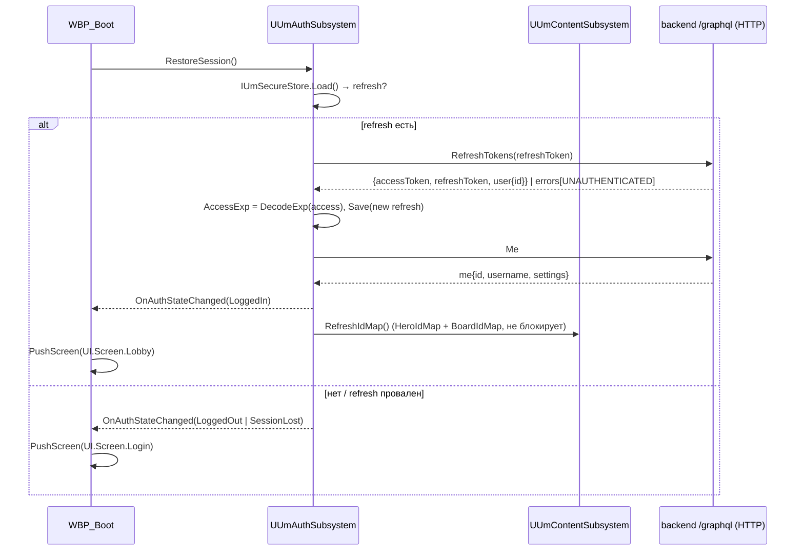

---

## 2. F2 — Логин и регистрация

**Предусловия.** `UI.Screen.Login` или `UI.Screen.Register` в стеке `UI.Layer.Menu`; WS закрыт.

**Шаги.** Валидация полей на клиенте по правилам DTO сервера (`LoginDto { email: IsEmail, password: непустая }`, `RegisterDto { email: IsEmail, username 3–20 `^[a-zA-Z0-9_]+$`, password ≥ 8 }` — R1 §2.7) → `Login`/`Register` (`Auth = None`, бакеты 10/мин и 5/мин) → `FUmAuthResponseDto` → `UUmAuthSubsystem` сохраняет пару, `UserId = user.id`, `AccessExp` из JWT → `Me` (для `settings`) → `IdMap` → `PushScreen(UI.Screen.Lobby)`. Шаги после ответа — как F1 п.4–6.

**Операции и DTO.** `Login($input: LoginDto!)`, `Register($input: RegisterDto!)` → `AuthResponseDto { accessToken, refreshToken, user { id email username avatar role createdAt emailVerified } }` (R1 §2.7; `role ∈ {USER, ADMIN, MODERATOR}`). `FUmInputs::Login/Register` эмитят только поля схемы (`forbidNonWhitelisted`, ADR §1.3 п.11).

**FSM.** `UI.Screen.Login` ⇄ `UI.Screen.Register` (ссылки); состояние формы: `Idle → Submitting → Idle(error) | LoggedIn`. Кнопка «Войти» блокируется на время `Submitting` и на окно лимитера.

**Ошибки.**

| Ошибка | Класс | Реакция | Откат |
|---|---|---|---|
| `login` → `UNAUTHENTICATED` «Неверный email или пароль» | `Validation` (ADR §5.3, строка «от `Login`») — **не** refresh | сообщение под формой | форма остаётся |
| `register` → `INTERNAL_SERVER_ERROR` + `status 409` («Пользователь с таким email уже существует» / «…именем…») | `Conflict` | сообщение у поля | форма остаётся |
| `register`/`login` → `BAD_REQUEST` (`originalError.message[]`) | `Validation` | показать первую строку массива | — |
| production-маскирование (`Internal server error`) | `Opaque` | для `Login` (`Auth == None`) — «Не удалось войти: проверьте данные» + лог (B4) | — |
| `Network` | `Network` | ретрай по `FUmRetryPolicy` не применяется к мутациям; тост, кнопка «Повторить» | — |
| `RateLimited` (429 — код не подтверждён, R2 §4.15) | `RateLimited` | тост, кнопка заблокирована до окна лимитера | — |

**Критерии приёмки.** (1) Обе формы доводят до лобби; (2) неверный пароль не запускает refresh-цикл (spec `Unmatched.Net.ErrorClassifier`, строка `Login`); (3) сброс пароля/verify не реализуются (письма не отправляются — R1 §2.7).

---

## 3. F3 — Лобби

**Предусловия.** `LoggedIn`; `IdMap` может быть ещё пуст (тогда «Создать» — `WhyNot`).

**Шаги.**

1. `UUmStateSubsystem::EnterLobby()` → `RefreshAvailableGames()` = `AvailableGames(mode: <фильтр>|null, limit: 20)` (публичная, `Auth = Optional`; только `status: LOBBY && opponentId == null`, собственные игры не исключаются — R2 §2.4) + `MyGames({ status: LOBBY })`, `MyGames({ status: IN_PROGRESS })`, `MyGames({ status: PENDING })` (сервис использует только `status`/`limit` — R2 §2.4). Поллинг списка — 30 с (`FTSTicker`), кнопка «Обновить» — немедленно (К1 §3.6.3). Один источник поллинга (веб имел двойной — R7 §2.13 п.19).
2. Вкладка «Открытые игры»: `WBP_GameListRow` на каждую игру: хост = `players[].find(userId == hostId)`, режим, доска (имя по `BoardIdMap` из `boardId`), кнопка «Присоединиться» (гейт: `status == LOBBY && players.Num() < 2 && hostId != me`).
3. Вкладка «Мои игры»: `LOBBY/IN_PROGRESS/PENDING` — действия «Вернуться» (→ F4 при `LOBBY`, → F6 при `IN_PROGRESS`) и «Покинуть» (`LeaveGame`, для `IN_PROGRESS` — подтверждение). Счётчик активных игр `N/5`; при `N >= 5` — «Создать»/«Присоединиться» заблокированы с `WhyNot` «Достигнут лимит 5 активных игр» (R2 §2.3; `game.service.ts:31,99-108`).
4. «Создать» → `WBP_CreateGameDialog` (`UI.Layer.Modal`): режим `ONE_V_ONE` (`VS_AI` только при `Feature.VsAi`, F19), доска — из `BoardIdMap` (cuid) с превью из `Boards` (имя/размер; ADR §4.6). Подтверждение → `CreateGame({ mode, boardId: cuid }, idempotencyKey: FGuid::NewGuid().ToString(DigitsWithHyphensLower))` (ADR §5.4). `boardId` можно опустить — сервер возьмёт первую доску по `createdAt` (R2 §2.3), но для MVP всегда передаём cuid Cobble City (B1).
5. Успех `CreateGame` → `EnterRoom(game.id)` (F4). Сетевая ошибка без ответа → **один** повтор с тем же `idempotencyKey` (ADR §4.1 `FUmRetryPolicy`); ключ глобально уникален (`schema.prisma:204` — R2 §2.3).
6. «Присоединиться» / «Войти по ID» (`WBP_JoinByIdDialog`, deep-link по `gameId`; обмен `code → gameId` API не поддерживает — R2 §2.3, B16) → `JoinGame({ gameId })` — только поле `gameId` (`asOpponent` игнорируется сервисом, `heroId` не передаём — R2 §2.3, §2.5) → успех → `EnterRoom(id)`.

**Операции и DTO.**

| Операция | Вход | Выход | Примечание |
|---|---|---|---|
| `AvailableGames` | `mode: String` (значение enum строкой), `limit: Float` | `[GameResponse]` (`id mode status hostId boardId createdAt players{userId username avatar heroId isReady seatOrder}`) | `seatOrder: Float` (ADR §1.3 п.4) |
| `MyGames` | `filters: { status: GameStatus, limit: Float }` | `[GameResponse]` (`id status mode hostId updatedAt`) | кэш сервера 60 с — может отставать (R2 §2.3) |
| `CreateGame` | `input: { mode: GameMode = ONE_V_ONE, boardId: String }`, `idempotencyKey: String` | `GameResponse { id code status:LOBBY hostId players[seat 0] }` | 10/мин |
| `JoinGame` | `input: { gameId }` | `GameResponse { opponent = me }` | 15/мин; идемпотентен для уже присоединившегося (R2 §3.11) |
| `LeaveGame` | `gameId` | `Boolean` (всегда `true`) | семантика по статусу — F4, F17 |

**FSM.** `UI.Screen.Lobby` с подсостояниями `List.Loading → List.Ready | List.Error(«Повторить»)`; модалки `CreateGame`, `JoinById`, `ConfirmLeave`.

**Ошибки.**

| Ошибка | Класс | Реакция | Откат |
|---|---|---|---|
| `createGame` → `MaxActiveGamesException` (`ConflictException`, «You have N active games. Maximum allowed: 5», `status 409`) | `Conflict` | тост + переключение на «Мои игры» с подсветкой «Покинуть» (ADR §5.3, §5.5) | диалог закрыт |
| `createGame` → ошибка уникальности `idempotencyKey` | `Unknown`/`Opaque` | новый GUID на следующий клик; тост | — |
| `joinGame` → «Игра не найдена» | `NotFound` | тост, `RefreshAvailableGames()` | — |
| `joinGame` → «Нельзя присоединиться к игре, которая уже началась или завершилась», «Игра уже заполнена», «Вы уже являетесь хостом этой игры» | `Validation` (`BadRequestException`; в production — `Opaque`, B4) | тост с текстом / «Действие отклонено», обновить список | — |
| `joinGame` → «Вы уже участвуете в этой игре» | `Validation` | не ошибка для UX: `GetGame(id)` → `EnterRoom` | — |
| `availableGames` → `Network` | `Network` | ретрай `FUmRetryPolicy` (query), затем `List.Error` | список прежний |
| `RateLimited` | `RateLimited` | кнопка заблокирована до окна | — |

**Критерии приёмки.** (1) Хост создаёт игру и попадает в комнату; гость видит её в списке ≤ 30 с и присоединяется; (2) при 5 активных играх «Создать» заблокировано с `WhyNot`, после «Покинуть» — разблокировано без перезапуска; (3) повтор `createGame` после таймаута с тем же ключом не создаёт вторую игру (E2E, R2 §2.5).

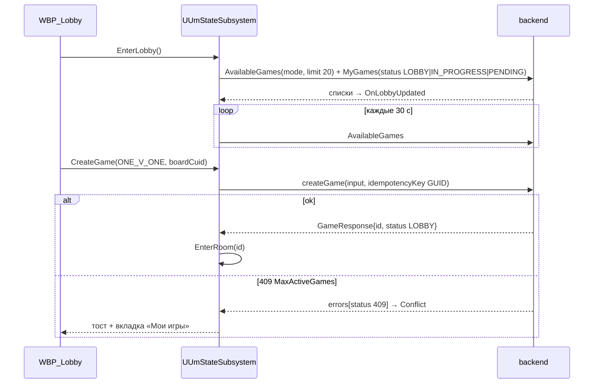

---

## 4. F4 — Комната

**Предусловия.** Есть `gameId` (создал или присоединился); `IdMap` героев загружен (иначе `WBP_HeroPicker` показывает «загрузка справочника» и повторяет `HeroIdMap`).

**Шаги.**

1. `UUmStateSubsystem::EnterRoom(gameId)`:
   - `GetGame(id)` → `FUmGameResponseDto` (`hostId`, `opponentId`, `mode`, `boardId`, `players[]`, `status`).
   - `UUmNetSubsystem` открывает WS (`connection_init` с access-токеном, `Net.State.Connecting → Connected`) и подписывает **до `startGame`**: `PlayerJoined(gameId)`, `PlayerLeft(gameId)`, `GameEnded(gameId)`, `GameStateUpdated(gameId, since: null)` (ADR §5.5; R2 §3.9). Первое `STATE_UPDATED` с `sequenceNumber == 1` — сигнал старта для гостя (R2 §2.6, `game-initialization.service.ts:260`).
   - Поллинг `GetGame(id)` каждые 3 с — для `players[].isReady/heroId` соперника: событий на `toggleReady/selectHero` нет (R2 §2.5, §3.8); кэш `game:<id>` инвалидируется этими мутациями, так что `game(id)` свежий (R2 §2.3).
2. `WBP_Room`: `gameId` для приглашения (копировать; `code` показывать только как справку — не обменивается), два `WBP_PlayerSlot`, `WBP_HeroPicker` (grid из `HeroesPaginated`/`Heroes` с `fighterType == HERO`, cuid из `IdMap` по имени, карточка героя: HP, `abilities[0].text`, стойки из `HeroStances(HeroSlug(name))`), кнопки «Готов», «Начать», «Покинуть» (К1 §3.6.3).
3. Выбор героя → `SelectHero(gameId, heroId: cuid)` (10/мин; только `LOBBY`; нужна запись `GamePlayer`). Ответ `GameResponse` → `OnRoomUpdated`. Кнопка героя `disabled`, если я уже `isReady` (веб-паритет R7 §2.9.4; сервер это не запрещает — уточнение к ADR: смена героя после «Готов» требует снять готовность).
4. «Готов» → гейт `myHeroId != null` → `ToggleReady(gameId)` с **in-flight guard**: мутация **инвертирует** флаг (не идемпотентна, статус игры не проверяется — R2 §2.5); кнопка блокируется до ответа; итоговое значение берётся только из `players[].isReady` ответа; при `Network` без ответа — **не повторять**, а `GetGame(id)` и показать фактический флаг (ADR §5.4).
5. «Начать» (только `hostId == me && players.Num() == 2 && все isReady`; для `VS_AI` — `players.Num() == 1`, F19) → обратный отсчёт 3 с (отменяемый) → `StartGame(gameId)` (5/мин). Успех → `GameResponse { status: IN_PROGRESS }` → `EnterGame(gameId)` (F6). Одновременно приходит `GameStateUpdated seq 1` — дедуплицируется store.
6. Гость: переход в F6 по первому из сигналов — `GameStateUpdated seq 1` **или** `GetGame(id).status == IN_PROGRESS` из поллинга (`initializeGameState` публикует `STATE_UPDATED` внутри `startGame`, R2 §2.3).
7. «Покинуть» → подтверждение → `LeaveGame(gameId)` → `LeaveRoom()` (отписки, стоп поллинга) → `UI.Screen.Lobby`. Семантика сервера (R2 §2.3): хост без соперника — игра **удаляется** (последующий `game(id)` → «Игра не найдена»); хост с соперником — соперник становится хостом (`seatOrder → 0`); соперник — `opponentId = null`. У оставшегося: `PlayerLeft {userId}` → `GetGame(id)` немедленно (перерисовать слоты и роль хоста — теперь «Начать» может появиться у бывшего гостя).
8. `GameEnded` в комнате (`abortGame` любым участником доступен из любого статуса — R2 §2.3) → тост «Игра прервана» → `LeaveRoom()` → лобби.

**Операции и DTO.**

| Операция | Вход | Выход / payload | Примечание |
|---|---|---|---|
| `GetGame` | `id: String!` | `GameFields` (К3 Прил. A): `id code status mode hostId opponentId boardId … players { id userId username avatar heroId isReady hasPassed seatOrder }` | `host.id`/`opponent.id` = `User.id`, `players[].id` = id `GamePlayer` — идентифицировать по `userId` (R2 §2.2) |
| `SelectHero` | `gameId, heroId (cuid)` | `GameResponse` | «Герой не найден», «Героя можно выбрать только в лобби», «Вы не участвуете в этой игре» |
| `ToggleReady` | `gameId` | `GameResponse` | не идемпотентна |
| `StartGame` | `gameId` | `GameResponse { status: IN_PROGRESS, startedAt }` | ошибки — таблица ниже |
| `LeaveGame` | `gameId` | `Boolean` | всегда `true` |
| `PlayerJoined` | `gameId` | `GameEvent { sequenceNumber: 0, payload: "{userId, username}" }` | реально публикуется (R2 §2.6) |
| `PlayerLeft` | `gameId` | `payload: "{userId}"` | без `username` (R2 §4.13) |
| `GameStateUpdated` | `gameId, since: null` | `FUmGameStateSubscriptionDto` (5 JSON-строк) | `ParsePartial`, `Apply(…, Subscription)`; seq 1 — старт |
| `GameEnded` | `gameId` | `payload: "{reason:'aborted', abortedBy}"`, seq 0 | ключ дедупликации `(gameId,"GAME_ENDED",seq)` (ADR §5.2) |

**FSM.** `UI.Screen.Room` с подсостояниями: `Room.Loading → Room.Waiting(opponent) → Room.Picking → Room.Ready → Room.Countdown(3 с) → (Game)`; независимые флаги `bToggleReadyInFlight`, `bStartInFlight`. Гейты кнопок — `FGameplayTagQuery` по тегам комнаты (уточнение к ADR: локальные теги `Room.Role.Host`, `Room.Self.HeroPicked`, `Room.Self.Ready`, `Room.AllReady` под корнем `UI.` — вводятся в `UmTags.h` рядом с `UI.Screen.*`).

**Ошибки.**

| Ошибка | Класс | Реакция | Откат |
|---|---|---|---|
| `selectHero` → «Герой не найден» (передан не cuid) | `Validation` | `ensure` в dev (баг `IdMap`), тост | выделение снято |
| `selectHero` → «Героя можно выбрать только в лобби» | `Validation` | `GetGame(id)`; если `IN_PROGRESS` → `EnterGame` | — |
| `selectHero`/`toggleReady` → «Вы не участвуете в этой игре» (`NotFound`) | `NotFound` | тост, `LeaveRoom()` → лобби | — |
| `toggleReady` → `Network` | `Network` | **без повтора**; `GetGame(id)` → фактический `isReady` | кнопка разблокирована после ответа `GetGame` |
| `startGame` → «Не все игроки готовы», «Для начала игры нужен opponent», «Только хост может начать игру», «Игру можно начать только из лобби» | `Validation` | тост, `GetGame(id)` | отсчёт отменён |
| `startGame` → «Не удалось инициализировать состояние игры: …» / «Для инициализации игры нужно минимум 2 игрока» / «Нет героев с картами для ИИ-оппонента» / «ИИ-оппонент не сидирован (ai@unmached.local)…» | `Validation` | тост с текстом; сервер откатил игру в `LOBBY` (R2 §2.3) — комната остаётся | — |
| `game(id)` → «Игра не найдена» (хост удалил, уйдя без соперника) | `NotFound` | тост «Комната закрыта», `LeaveRoom()` → лобби (R2 §3.14) | — |
| `game(id)` → `GameAccessDeniedException` (`status 409`, не участник) | `Conflict` | тост, лобби | — |
| WS `subscribe` → `next{errors:[«Неавторизованный доступ»]}` + `complete` | `Auth` (по подстроке, ADR §5.3) | single-flight refresh → `ReconnectWebSocket` → переподписка | поллинг продолжает работать |
| `GameStateUpdated` → `next{errors}` (`currentTurnPlayerId: String!` при `null`, B7) | — | лог + `GetGame(id)`; подписка сохраняется (ADR F24) | — |

**Критерии приёмки.** (1) Два клиента (UE+UE, UE+веб) доходят до `IN_PROGRESS`; гость переходит в партию ≤ 3 с после `startGame` хоста; (2) двойной клик «Готов» не даёт двух мутаций; (3) уход хоста без соперника закрывает комнату у него самого без ошибок в UI; уход хоста при госте передаёт госту кнопку «Начать»; (4) `abortGame` со стороны соперника выводит в лобби ≤ 1 с (по `GameEnded`).

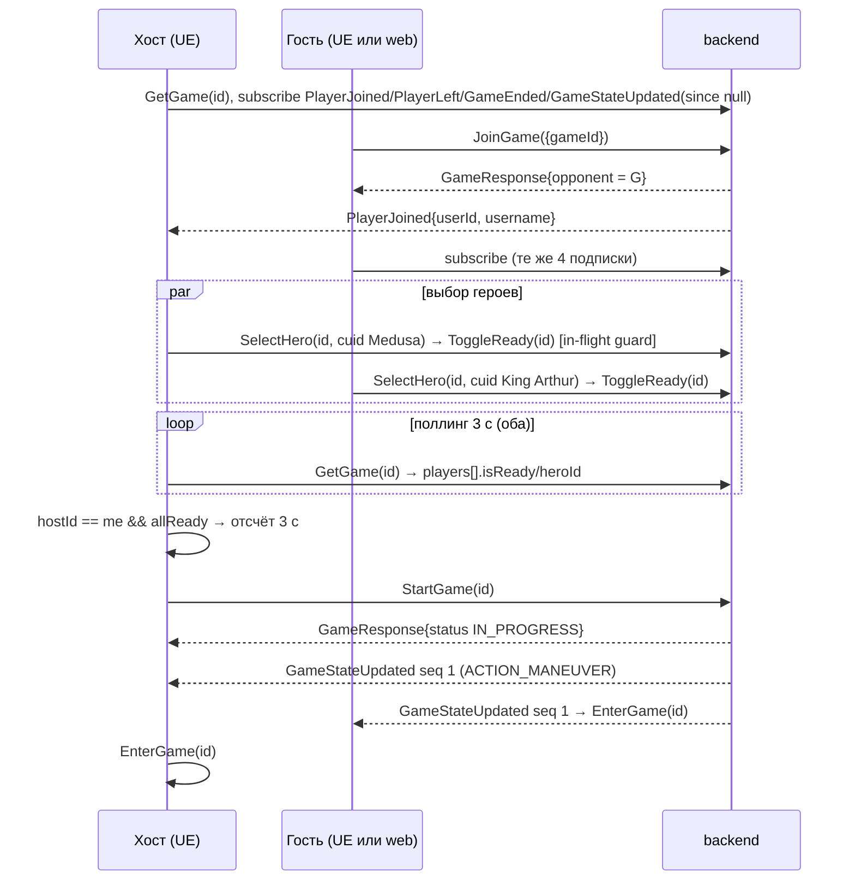

---

## 5. F5 — Матчмейкинг (за флагом `Feature.Matchmaking`)

**Статус.** В MVP и v1 выключен: `bMatchmakingEnabled=false` (ADR §3.5, §5.5). По коду matchmaking-API неработоспособен для любого клиента: нет `GqlAuthGuard`, резолверы читают `user.userId` вместо `id`, `MatchmakingGuard` берёт request через `switchToHttp()`, матч не создаёт `GamePlayer` → `selectHero/toggleReady/startGame` падают (R2 §4.1, §4.3; ADR §1.3 п.12). Предпосылка **B13** (v2).

**Целевой поток (реализуется после B13; описан, чтобы зафиксировать контракт).**

1. Предусловия: `PenaltyInfo.canJoinQueue == true`; нет игр `PENDING/LOBBY/IN_PROGRESS` (`MyGames`), иначе `Forbidden 'You are already in game …'` (R2 §3.24).
2. Подписка `MatchFound(userId: <me.id>)` (`String!`, не `ID!`) — **до** `JoinQueue`: событие публикуется один раз (R2 §3.25).
3. `JoinQueue({ mode: ONE_V_ONE, heroPref? })` — без `idempotencyKey` (R2 §3.26); только `ONE_V_ONE` (R2 §3.32).
4. Поллинг `QueueStatus(mode)` каждые 5 с; локальный таймер ожидания (поле `joinedAt` всегда `null`); `inQueue == false` без `matchFound` → очередь протухла (TTL ZSET 300 с) → предложить повторный `JoinQueue` (R2 §3.27).
5. `MatchFound { gameId, opponentUsername, opponentRating, expiresAt }` → экран подтверждения с таймером до `expiresAt` (35 с; серверный job — 30 с) → `AcceptMatch(gameId)`: `false` — ждём второго (поллинг `GetGame(id).status`: `LOBBY` — успех, `ABORTED` — отмена), `true` — оба приняли → `EnterRoom(gameId)`; `DeclineMatch` → −25 ELO/счётчик (R2 §3.29–3.30).
6. Перед сменой режима — `LeaveAllQueues` (R2 §3.28). Потеря WS → восстановление через `MyGames({status: PENDING})`.

**Ошибки (целевые).** `NotFound 'Match confirmation has expired'` → «Матч отменён», назад в очередь вручную; `Forbidden` (бан/«already in game») → тост с текстом; `Error('Could not acquire lock')` → `Unknown`, повтор через 1 с (не мутация состояния партии).

**Критерии включения флага.** B13 закрыт; живая проверка `penaltyInfo` возвращает данные под Bearer (рецепт R2 §4.21); после `acceptMatch` обоими `selectHero` не отвечает «Вы не участвуете».

---

## 6. F6 — Загрузка партии в три шага (`EnterGame`)

**Предусловия.** `gameId` с `status == IN_PROGRESS` (из F4 или «Мои игры»); `Net.State.Connected` (если нет — F18 сначала поднимает WS).

**Шаги** (R7 §3 п.2; К1 §3.5.2):

1. **Шаг 1 — мета.** `GetGame(id)` → `usernames` по `players[].userId`, `hostId`, `opponentId`, `mode` (для `Feature.VsAi` — признак бота), `boardId` (для `BoardIdMap → имя доски → DA_Board_*`). Ошибка `NotFound/Forbidden` → лобби.
2. **Шаг 2 — состояние и подписки.** Если подписки `GameStateUpdated/GameEnded` уже активны из комнаты — оставить; иначе `Subscribe(GameStateUpdated(gameId, since: LastSeq > 0 ? LastSeq : null))`, `Subscribe(GameEnded(gameId))`. Затем `GetGameState(gameId)` → `FUmGameStateParser::ParseFull(state)` → `FUmGameSnapshotStore::Apply(…, Query)` (при `LastSeq == 0` — первый снапшот; иначе — правило «равный seq перезаписывает», ADR §5.2). `SyncStatus = Live` (`Match.Sync.Live`). Порядок «подписка → запрос» гарантирует отсутствие дыры между снапшотом и первым событием (К3 §3.6.2).
3. **Шаг 3 — контент (параллельно, не блокирует).** Для каждого `Fighter.type == HERO`: `UUmContentSubsystem::EnsureHero(heroSlug)` → Baked (`DA_Hero_<slug>`) → Runtime `HeroContent(id: Fighter.name)` (до B2 — по имени; после — по cuid `Fighter.heroId`) + `UUmImageCacheSubsystem`; `HeroStances(heroSlug)` для каждого HERO (кэш на сессию); `Board(id: <имя>)` или запись `Boards` по `boardId`/совпадению `width×height` — **только для арта**; геометрия — из `boardState` (ADR §4.7, R4 §3.7).
4. `UUmPresentationSubsystem::EnterGame` спавнит `AUmGameStage` по `Current().BoardState` и `AUmFighterActor` по `Fighters[]`; `UUmUISubsystem::PushScreen(UI.Screen.Game)` → `WBP_GameHUD` на `UI.Layer.Game`. Первый снапшот проигрывается без анимаций (`PresentedState = Current`).
5. Если снапшот уже содержит `combatInfo` (вход в идущий бой) — F10/F11 стартуют с пересчитанным дедлайном `startedAt + 30 с`; если `pendingEffects` с `playerId == me` — F13; если `phase == GAME_OVER` — F17 немедленно.

**Операции и DTO.** `GetGame` (F4), `GetGameState(gameId) → { gameId, state: String, sequenceNumber: Float, currentTurnPlayerId, phase: String, turnCount: Float, updatedAt }` (R3 §2.5; `Float` → `double` → `int32`), `HeroContent(id)` (К3 Прил. A, без `effects{timing}` — B17), `HeroStances(heroSlug) → [{id,label,isDefault}]` (`@Public`, проверено `game.resolver.ts:100-108`), `Board(id)`.

**FSM.** `UI.Screen.Game` подсостояния: `Game.Loading(шаг 1–2) → Game.Ready`; `Match.Sync.Live`. Пока `Game.Loading` — `Input.Mode.Busy`.

**Ошибки.**

| Ошибка | Класс | Реакция | Откат |
|---|---|---|---|
| `game(id)` → «Игра не найдена» | `NotFound` | тост, `ExitGame()` → лобби | — |
| `gameState` → `GameAccessDeniedException` / «You are not a participant» | `Conflict`/`Forbidden` | тост, лобби | — |
| `gameState` → «Состояние игры <id> не найдено» (игра не начата) | `NotFound` | если `game.status == LOBBY` → `EnterRoom(id)`; иначе лобби | — |
| `hero(id)` → `null` (cuid до B2) | — | второй путь: `hero(id: name)`; при неудаче — Placeholder-провайдер (ADR §4.5) | партия продолжается |
| `heroStances` → любая | по классу | `WBP_StanceBar` скрыт; повтор при следующем `EnterGame` | — |
| `board` → любая | по классу | арт-плоскость без текстуры; сетка из `boardState` | — |

**Критерии приёмки.** (1) Время от `StartGame` до интерактивного HUD ≤ 2 с на localhost без учёта текстур; (2) при отсутствии контента (сервер контента недоступен) партия играется на плейсхолдерах; (3) вход в идущую партию из «Мои игры» восстанавливает бой/pending корректно (`FT_Um_ApplySnapshotRendersBoard`, фикстуры `after_attack`, `pending_move`).

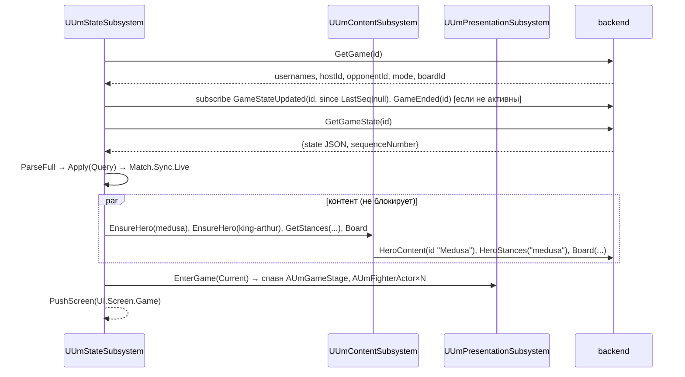

---

## 7. F7 — Цикл хода: два действия, `actionsRemaining`, авто-передача

**Факты.** `ACTIONS_PER_TURN = 2` (`game-state.model.ts:165`); действие тратят `maneuver`, `moveFighter`, `attack` (в момент объявления), `playScheme`, `pass`; **не** тратят `endTurn` (передаёт ход), `setStance`, `toggleDoor`, `resolvePendingEffect`, `playDefense` (R4 §2.3). После второго действия (или резолва боя при 0 действий) `advanceTurn` выполняется **внутри той же мутации** без отдельного seq и без `turnChanged` (R4 §2.4; ADR §5.5). Продакшен-фазы: `ACTION_MANEUVER` (+ legacy `ACTION_ATTACK` как синоним) ⇄ `COMBAT` → `COMBAT_RESOLVE` → … → `GAME_OVER` (R4 §2.2).

**Теги состояния хода** (из `PresentedState`): `Match.Turn.Mine|Opponent` (`CurrentTurnPlayerId == me`), `Match.Actions.Available|Exhausted` (`ActionsRemaining > 0`, дефолт 2 при отсутствии), `Match.Phase.*`, `Match.Role.Attacker|Defender|None` (по `combatInfo`: атакующий — владелец бойца `attackerId`; защитник — `defenderId == me`), `Match.Sync.*`.

**Шаги одного хода (я — активный игрок).**

1. Снапшот с `CurrentTurnPlayerId == me` → диф `Match.Event.Turn.Changed` → cue `GameplayCue.Match.Turn.Changed`; рука `+1` (добор в `advanceTurn`, R4 §2.4 п.3) → `Match.Event.Card.Drawn`; возможны `Match.Event.Fighter.Damaged` от turn-start способностей (Medusa, Dracula — §18) и `Match.Event.Pending.Added` (Leonardo).
2. `FUmLegalActions::Enumerate(Current, me, ranges, phaseGate) → FUmLegalSet` (ADR §4.3) → `UUmGameHudModel::LegalSet/WhyNot`; `Input.Mode.Idle`.
3. Действие 1 — любое из F8/F9/F12/F16(pass); ответ применяется; `ActionsRemaining == 1` → `Match.Event.Actions.Changed`.
4. Действие 2 — аналогично. Если это не атака: в ответе уже `CurrentTurnPlayerId == соперник`, `TurnCount + 1` → `Match.Turn.Opponent` в той же мутации. Если атака — `COMBAT` (F9–F11), ход уйдёт после `resolveCombat`.
5. В любой момент — `endTurn` (F16), `setStance` (F14), `resolvePendingEffect` (F13, вне `COMBAT`).

**Гейты (таблица `FUmLegalActions`, реализует ADR §5.7 и R3 §3.11).**

| Действие (тег `Action.*`) | Запрос тегов | Дополнительно | `WhyNot` (пример) |
|---|---|---|---|
| `Action.Maneuver`, `Action.MoveFighter` | `ALL(Match.Turn.Mine, Match.Actions.Available, Match.Sync.Live) AND ANY(Match.Phase.ActionManeuver, Match.Phase.ActionAttack) AND NONE(Input.Mode.Busy)` | есть свой живой боец без `immobilized` | «Не ваш ход», «Действия исчерпаны», «Боец обездвижен» |
| `Action.Attack` | то же | есть карта `ATTACK/VERSATILE/UNIVERSAL` и достижимая цель | «Нет целей в досягаемости» |
| `Action.PlayScheme` | то же | карта `SCHEME` + живой боец под banner | «Нет карт SCHEME» |
| `Action.Pass` | то же | — | — |
| `Action.EndTurn` | `ALL(Match.Turn.Mine, Match.Sync.Live) AND ANY(Match.Phase.ActionManeuver, Match.Phase.ActionAttack) AND NONE(Input.Mode.Busy)` | без проверки остатка | «Не ваш ход» |
| `Action.SetStance` | как `EndTurn` | `Stances.Num() > 0` | «У героя нет стоек» |
| `Action.PlayDefense` | `ALL(Match.Phase.Combat, Match.Role.Defender, Match.Sync.Live) AND NONE(Input.Mode.Busy)` | карта `DEFENSE/VERSATILE/UNIVERSAL` под banner цели | — |
| `Action.ResolveCombat` | `ANY(Match.Phase.Combat, Match.Phase.CombatResolve) AND ANY(Match.Role.Attacker, Match.Role.Defender) AND Match.Sync.Live AND NONE(Input.Mode.Busy)` | атакующему — только в `CombatResolve` (ADR §5.5); защитнику в `Combat` — «Без защиты»; в `CombatResolve` — через 5 с | — |
| `Action.Pending.*` | `ALL(Match.Sync.Live) AND NONE(Match.Phase.Combat, Input.Mode.Busy)` | есть `pendingEffects[playerId == me]`; **не** требует `Match.Turn.Mine` (R4 §2.10) | «После боя» |
| `Action.ToggleDoor` | никогда (dev-консоль) | — | — |

**Ошибки цикла хода** (общие для F8–F16): `"Not your turn. Current player: <id>"`, `"Invalid phase. Current: 
, Required: …"` (`ActionPhaseGuard`, R3 §2.2) → класс `Validation` → тост + `RefetchState()` (состояние клиента отстало); `"Game status is <S>. Required: IN_PROGRESS"` → `Forbidden` → если `S == ABORTED` — F17 (прервана), иначе лобби; `"You are not a participant in game <id>"` → `Forbidden` → лобби; `Concurrent modification detected…` → `Concurrent` → `RefetchState()`; `Unexpected error during <action>` → `Validation` с общим текстом → лог + `RefetchState()`.

**Критерии приёмки.** (1) Счётчик действий и подсветка «Ваш ход/Ходит …» совпадают с сервером после каждой мутации; (2) авто-передача после второго действия отражается в HUD без дополнительного запроса (spec `Unmatched.Model.SnapshotDiff` «смена хода без `turnChanged`»); (3) все кнопки с `WhyNot` показывают причину в тултипе (`UUmHudLibrary::GetWhyNot`).

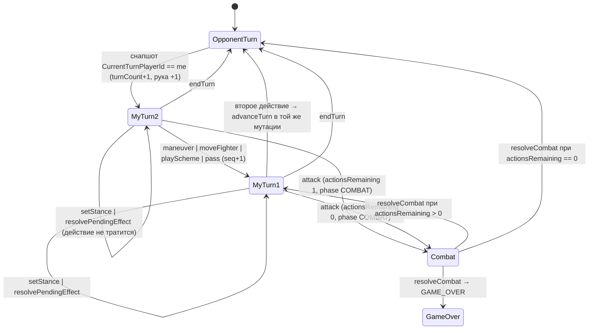

---

## 8. F8 — Манёвр (`maneuver` как основной способ, `moveFighter` — «быстрый ход»)

**Решение.** ADR §8 п.4 оставляет вопрос владельцу продукта с дефолтом: основной способ движения — `maneuver` (добор 1 карты + движение всех своих бойцов + BOOST любой картой), `moveFighter` — кнопка «Быстрый ход» одним бойцом без добора и без буста (ADR §4.7 `FUmInputStateMachine`, §5.5; R7 §4 п.4). Раздел принимает дефолт; при ином решении владельца меняется только видимость кнопок `WBP_ManeuverBar`, FSM не меняется.

**Предусловия.** Гейт `Action.Maneuver` (§7). `IdMap` не нужен.

**Шаги (планирование в `FUmInputStateMachine::ManeuverPlanning`).**

1. Клик своего живого бойца без `immobilized` → `Input.Mode.FighterSelected` → подсветка `FUmBoardGeometry::Reachable(board, pos, movement + boostValue(выбранной boost-карты), blocked = клетки живых бойцов)` (`MI_Highlight_Move`); клетки, достижимые только «через» бойца (сервер проверяет только `wall/obstacle` и занятость **конечной** клетки — R4 §2.6.2 п.4), — `ServerWouldAllow` пунктиром (`MI_Highlight_ServerWouldAllow`, G13).
2. Клик подсвеченной клетки → `path = ShortestPath(pos → cell)` (список клеток **после** старта, каждый шаг манхэттен 1 — R4 §2.6.2 п.7) → запись в `ManeuverPlanning.paths[fighterId]`; фишка показывает «призрак» в целевой клетке (локальная презентация, не состояние). Повторный клик по тому же бойцу — отмена его пути. Каждый боец — не более одного раза (`uniqueFighters`, R4 §2.6.2 п.1).
3. Кнопка «BOOST» → `WBP_BoostPicker`: любая карта руки (для манёвра ограничений нет — R4 §2.7.2), `boostValue` крупно; выбор пересчитывает подсветки (`+boostValue` **каждому** бойцу).
4. «Подтвердить» (гейт: `paths.Num() >= 1` — манёвр без ходов отклоняется сервером: «Манёвр без ходов: задай moves[] или fighterId+path», R3 §2.7.3) → `FUmActionGate` → `Maneuver({ gameId, moves: [{fighterId, path:[{x,y}…]}…], boostCardId? })` — **только `moves[]`**, legacy-поля `fighterId/path/cardId` не отправляются (R3 §4.13). Координаты `0..19` (`@Max(19)`, R4 §2.17).
5. Ответ → `Apply(Mutation)` → диф: `Match.Event.Fighter.Moved` ×N (последовательно, tween 280 мс/клетка по референсу R7 §2.10), `Match.Event.Card.Discarded` (boost), `Match.Event.Card.Drawn` (добор 1 после движения — R4 §2.6.2 п.5), `Match.Event.Actions.Changed`, при 0 действий — `Match.Event.Turn.Changed`; возможны реактивные события `onFighterMoved` (Tomoe — урон) → `Match.Event.Fighter.Damaged`.
6. «Отмена»/`IA_Cancel` → сброс планирования → `Input.Mode.Idle`.

**«Быстрый ход»** (`moveFighter`): `Input.Mode.FighterSelected` + кнопка «Быстрый ход» → подсветка `Reachable(movement)` (без буста) → клик клетки → `MoveFighter({ gameId, fighterId, x, y })` → диф `Fighter.Moved` + `Actions.Changed`; перемещение в свою клетку — валидный no-op (R4 §2.6.3), клиент его не предлагает.

**DTO.** `ManeuverDto { gameId: String!, moves: [ManeuverMoveInput { fighterId: String!, path: [PositionInput { x: Int!, y: Int! }]! }], boostCardId: String }` (`gameplay.dto.ts:81-140`); `MoveFighterDto { gameId, fighterId, x, y }` (`:142-167`).

**Ошибки.**

| Сообщение сервера (R3 §2.7.3–2.7.4; R4 §2.6.2) | Класс | Реакция | Откат |
|---|---|---|---|
| «Путь длиной N превышает очки движения бойца (M)» | `Validation` | тост; `ensure` в dev (клиентский BFS разошёлся с сервером) | планирование сброшено, `Idle` |
| «Шаг (a,b)→(c,d) не является ходом на соседнюю клетку» | `Validation` | тост + `ensure` | сброс |
| «Клетка (x, y) занята» | `Validation` | тост; `RefetchState()` (соперник мог сдвинуться — не должен в мой ход, но VS_AI-бурст возможен) | сброс |
| «Боец обездвижен до конца хода (эффект карта)» / `FIGHTER_IMMOBILIZED` | `Validation` | тост; иконка `Fighter.Status.Immobilized` | сброс |
| «Boost card not in hand» / `CARD_NOT_IN_HAND` | `Validation` | тост, `RefetchState()` (рука разошлась) | сброс |
| «Каждый боец двигается в манёвре не более одного раза» | `Validation` | `ensure` (клиент не должен допускать) | сброс |
| `Not your turn`, `Invalid phase` | `Validation` | §7 | сброс |
| «Fighter not found», «Not your fighter», «Fighter is defeated», «Invalid target position», «Недостаточно очков движения: …» (`moveFighter`) | `Validation` | тост | сброс |

**Критерии приёмки.** (1) Медуза (movement 3 по контенту — но клиент берёт `Fighter.movement` из состояния, ADR §5.7) и 3 гарпии двигаются одним манёвром с добором 1 карты; (2) BOOST-карта уходит в сброс, счётчик сброса `+1` из ответа мутации (не из подписки); (3) пунктирные клетки отправляются как есть и принимаются сервером (фикстура `medusa-vs-king-arthur/maneuver_through_fighter`); (4) spec `Unmatched.Model.Geometry` — BFS с блокировкой, `ShortestPath` без диагоналей.

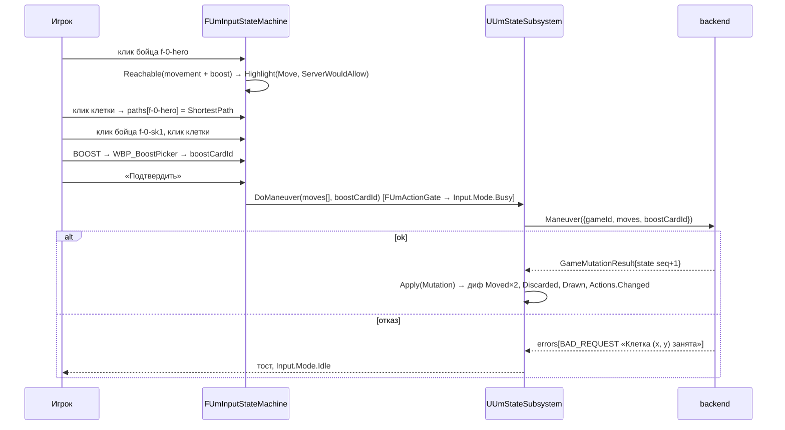

---

## 9. F9 — Атака: боец, цель, карта, BOOST, дальности, banner

**Предусловия.** Гейт `Action.Attack` (§7).

**Шаги (`FUmInputStateMachine::AttackTargeting`).**

1. Порядок выбора — как в веб-клиенте (R7 §2.9.6 п.3): клик карты `ATTACK/VERSATILE/UNIVERSAL` в руке → `Input.Mode.CardSelected` (`WBP_CardInspector` показывает карту). Атакующий боец: выбранный (`FighterSelected`) или, по умолчанию, тот, кому карта разрешена banner'ом — если `bannerName` именной (`Harpy`, `Arthur`), кандидаты фильтруются `FUmRules::BannerAllows(banner, fighter.name)` (срез числового суффикса, `ies→y`, `Arthur ⊂ King Arthur`; неизвестный banner → разрешён — R4 §2.7.5). Если под banner подходит ровно один живой боец — он выбирается автоматически; иначе просьба «выберите бойца».
2. Подсветка целей (`MI_Highlight_Attack`) = `FUmRules::IsInAttackRange(state, attacker, target, DT_AttackRange)`: живой вражеский боец, и (а) манхэттен 1; или (б) `attacker.attackType == ranged && SameLegacyZone` (`cell.zone` — первая зона, **не** пересечение `zones[]`, R4 §4.1); или (в) манхэттен ≤ `effectiveRange(stance ?? hero)` из `DT_AttackRange` (bullseye 5, t-rex 2, ms-marvel 2, muhammad-ali/float 2 — R4 §2.7.1). При отсутствии строки — не подсвечивать, но клик по любому врагу **не блокировать** (ADR §5.7). На fallback-доске 20×20 без зон ranged деградирует до смежности (B1).
3. Клик цели → если `FUmRules::BoostAllowed(card, attacker, Attack, heroSlug)` (эффект `BOOST` с `PLAYER_CHOICE_HAND`/без источника **или** `heroSlug == "king-arthur"` — `arthur.handler.ts:22-30`) → `Input.Mode.BoostPick` → `WBP_BoostPicker` (карты руки кроме играемой; «Без буста»); иначе сразу отправка.
4. `FUmActionGate` → `Attack({ gameId, attackerId, cardId: <instance id "<cardId>::n">, targetId, boostCardId? })`. Всегда instance-id (сервер принимает и базовый `cardId`, но при копиях он неоднозначен — R3 §3 п.10).
5. Ответ: `phase == COMBAT`, `combatInfo { attackerId (боец), defenderId (userId), targetFighterId, attackerCardId, attackValue = card + boost, defenseValue 0, startedAt }`, `actionsRemaining − 1` **сразу** (R4 §2.7.1). Диф: `Match.Event.Combat.Declared` (cue `AttackDeclared` — карта летит в центр лицом вверх), `Card.Played`, `Card.Discarded` (boost), `Actions.Changed`. Сервер планирует auto-resolve через 30 с (R4 §2.7.4). Клиент атакующего переходит в состояние «Ждём защиту…» (F10, сторона атакующего).

**DTO.** `AttackDto { gameId: String!, attackerId: String!, cardId: String!, targetId: String!, boostCardId: String }` (`gameplay.dto.ts:169-201`).

**Ошибки.**

| Сообщение (R3 §2.7.5; R4 §2.7.1) | Класс | Реакция | Откат |
|---|---|---|---|
| «Melee attack: target must be adjacent to attacker» / «Ranged attack: target must be adjacent or in the same zone as attacker» / «Target out of range» | `Validation` | тост; если клетка была подсвечена — `ensure` (расхождение `DT_AttackRange`/зон) | `Idle`, карта не выбрана |
| «Карту с банером «B» может играть только этот боец (играет F)» / `BANNER_MISMATCH` | `Validation` | тост; гейт мягкий (ADR §5.7) | `Idle` |
| «Картой типа X нельзя атаковать» / `INVALID_CARD_TYPE` | `Validation` | `ensure` | `Idle` |
| «Нельзя BOOST-ить атаку той же картой», «Boost card not in hand» | `Validation` | тост, `RefetchState()` | `Idle` |
| «Not your attacker», `ATTACKER_DEAD`, `TARGET_DEAD`, «Attacker or target not found» | `Validation` | тост, `RefetchState()` | `Idle` |
| `Not your turn`, `Invalid phase` | `Validation` | §7 | `Idle` |

**Критерии приёмки.** (1) Медуза (ranged) из клетки зоны `red` подсвечивает Артура в любой клетке `red` (Cobble City, B1 в БД), гарпии (melee) — только смежные; (2) у Артура слот BOOST появляется при любой атаке, у Медузы — только на картах с «You may BOOST this attack» (Second Shot); (3) при отказе сервера состояние HUD не меняется, счётчик действий прежний; (4) spec `Unmatched.Model.Banner`, `LegalActions`, `RulesParity` (фикстуры `bullseye-vs-t-rex`).

---

## 10. F10 — Окно защиты (30 с по серверным часам)

**Предусловия.** Снапшот с `phase == COMBAT && bHasCombatInfo`. Роли: `Match.Role.Defender` (`combatInfo.defenderId == me`), `Match.Role.Attacker` (владелец `fighters[attackerId]`).

**Дедлайн.** `Deadline = ParseIso(combatInfo.startedAt) + UUmClientSettings.DefenseTimeoutSec (30)`; отображаемый остаток = `Deadline − FUmServerClock::GetServerNow()` (ADR §4.4, §5.5; `timeoutAt` не приходит — `executor.service.ts:1093-1101`). Таймер показывается обоим. По истечении клиент **ничего не отправляет**, а ждёт снапшот `COMBAT_RESOLVE` (auto-resolve, F11); если через `DefenseTimeoutSec + 5 с` снапшота нет — `RefetchState()` (BullMQ-job мог не сработать; R2 §4.19).

**Сторона защитника (`Input.Mode.Defense`, приоритет выше манёвра/атаки — ADR §4.7).**

1. `WBP_CombatPanel`: открытая карта атаки — `DiscardPiles[attacker.OwnerId]` по `attackerCardId` (сброс открыт); если пришёл только снапшот подписки (без `decks/discardPiles`) — карта может отсутствовать → `bDecksStale = true` → `RefreshFullStateDebounced(300 мс)` → до рефетча карта полупрозрачна (ADR §5.2, G12, F5). `attackValue` — из `combatInfo` (печатное + boost, **до** модификаторов героев — R3 §2.9.8).
2. Рука: подсветка карт `DEFENSE/VERSATILE/UNIVERSAL`, `BannerAllows(banner, fighters[targetFighterId].name)` (фолбэк цели — первый боец защитника, R4 §2.7.3). Остальные карты затемнены с `WhyNot`.
3. Клик карты → `BoostAllowed(card, target, Defense)` (только эффект `BOOST` карты; `allowsDefenseBoost` героев нет — R4 §2.7.2) → `Input.Mode.BoostPick` при необходимости → `PlayDefense({ gameId, cardId, boostCardId? })`.
4. «Без защиты» → подтверждение (уточнение к ADR: одна модалка `WBP_ConfirmDialog`, т. к. действие необратимо) → `ResolveCombat({ gameId })` в фазе `COMBAT` (`defenseValue 0`, R4 §2.7.3).
5. Ответ `playDefense` → `phase == COMBAT_RESOLVE`, `defenderCardId`, `defenseValue` → диф `Match.Event.Combat.DefenseRevealed`, `Card.Played`, `Card.Discarded` (boost) → F11 (сторона защитника: кнопка «Разрешить бой» через `DefenderResolveButtonDelaySec` = 5 с).

**Сторона атакующего.** `WBP_CombatPanel`: «Ждём защиту…», таймер, своя карта атаки, **без** кнопки резолва (сервер разрешил бы `resolveCombat` в `COMBAT` до защиты — `game-turn.guard.ts:230-283`, R4 §4.4 — клиент не предлагает, ADR §5.5). Ввод: `Input.Mode.Idle` с выключенными `Action.*` кроме `Action.SetStance`? — нет: `setStance` требует action-фазу (`ActionPhaseGuard`), в `COMBAT` заблокирован; доступны только просмотр карт/инспектор. `Action.Pending.*` — заблокированы (G19).

**Наблюдатель-сторона (не участник).** В `ONE_V_ONE` не бывает; для `TWO_V_TWO/FREE_FOR_ALL` модель `Game` всё равно двухигроковая (R2 §2.7) — не реализуется.

**DTO.** `PlayDefenseDto { gameId: String!, cardId: String!, boostCardId: String }` (`gameplay.dto.ts:202-222`); `ResolveCombatDto { gameId }`.

**Ошибки.**

| Сообщение (R3 §2.2, §2.7.6) | Класс | Реакция | Откат |
|---|---|---|---|
| «Invalid phase for defense. Current: COMBAT_RESOLVE, Required: COMBAT» | `Validation` | таймер истёк/auto-resolve опередил: без тоста, если `LastSeq` уже продвинулся; иначе `RefetchState()` | `Defense → Idle` |
| «Only defender can play defense», «Attacker cannot play defense», «No combat in progress» | `Validation` | `ensure` (нарушен гейт) + `RefetchState()` | — |
| «Card must be DEFENSE, VERSATILE or UNIVERSAL», «Card not in hand» | `Validation` | тост, `RefetchState()` | `Defense` |
| «Нельзя BOOST-ить защиту той же картой» | `Validation` | `ensure` | `Defense` |
| banner-ошибка | `Validation` | тост (гейт мягкий) | `Defense` |
| `Network` на `playDefense` | `Network` | тост «Нет связи»; **не повторять** (мутация); при восстановлении WS — снапшот покажет, применилась ли защита | `Defense`, таймер продолжает |

**Критерии приёмки.** (1) Таймер у обоих клиентов расходится ≤ 1 с (E2E с двумя клиентами); (2) карта атаки видна защитнику ≤ 300 мс + RTT после `ATTACK` (рефетч по `bDecksStale`); (3) 31 с без защиты → панель переходит в состояние `COMBAT_RESOLVE` без действий пользователя (E2E К1 §6.2 «31 с без защиты»); (4) «Без защиты» завершает бой с `defenseValue 0`.

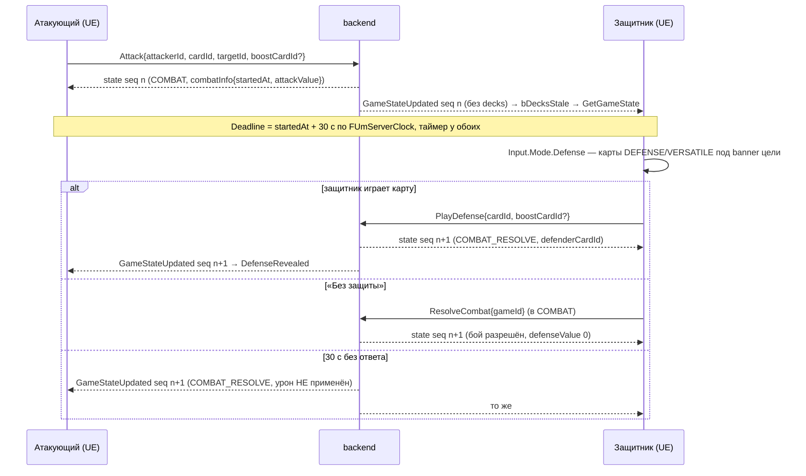

---

## 11. F11 — Резолв боя (авто-резолв 1,5 с / кнопка 5 с / бот) и дожим до B6

**Факты.** Auto-resolve по таймауту только переводит `phase → COMBAT_RESOLVE` (+1 seq) и **не** наносит урон (проверено `combat-timeout.service.ts:260-282`, `performAutoResolve` — TODO в коде); бой висит до `resolveCombat` любым участником (`CombatResolveGuard`: `COMBAT|COMBAT_RESOLVE`, участник — R3 §2.2). `resolvePendingEffect` в `COMBAT` сдвигает seq → auto-resolve пропускает срабатывание (`state.sequenceNumber > attackSequenceNumber → skip`, проверено `:220-227`) — поэтому `Pending.*` заблокированы в `Match.Phase.Combat` (G19). `combatSummary` не экспортируется — итоги считаются дифом `Fighters[].Health/IsDefeated` (R4 §3.12).

**Протокол клиента (G10, ADR §5.5; открытый вопрос ADR §8 п.1 — принят дефолт).**

| Ситуация (снапшот `COMBAT_RESOLVE && bHasCombatInfo`) | Атакующий | Защитник |
|---|---|---|
| После `playDefense` (`bHasDefenderCard == true`) | таймер `AttackerAutoResolveDelaySec` (1,5 с) → авто-`ResolveCombat`; кнопка «Разрешить бой» видна сразу как fallback | кнопка через `DefenderResolveButtonDelaySec` (5 с) — если атакующий отвалился |
| После auto-resolve таймаута (`bHasDefenderCard == false`, `defenseValue 0`) | то же: 1,5 с → авто-`ResolveCombat` | кнопка через 5 с |
| Соперник — бот (`mode == VS_AI`) | человек **не** авто-резолвит: бот сам играет защиту и резолвит (`ai-decision.service.ts:45-56`, R4 §2.16); кнопка-fallback через 5 с, если нового снапшота нет | человек-защитник после `playDefense` ждёт резолва бота; кнопка через 5 с |
| Оба нажали одновременно | второй получает «Not in combat phase» / `Concurrent` → без тоста, если `LastSeq` уже > seq снапшота, на котором нажали | то же |

Таймеры живут в `UUmStateSubsystem` (`FTSTicker`), сбрасываются при любом новом снапшоте и при `Match.Sync != Live`. Все три константы — `UUmClientSettings` (ADR §3.5). После фикса **B6** (сервер сам наносит урон / `timeoutAt`) авто-резолв атакующего отключается флагом (уточнение к ADR: `bAttackerAutoResolve` в `UUmClientSettings`, дефолт `true`), протокол кнопок не меняется.

**Результат.** Ответ/снапшот после `resolveCombat`: `combatInfo` очищен; `Fighters[].Health` изменены (ничья — победа защитника без урона, R4 §2.8 шаг 4); `isDefeated`; `phase`: `ACTION_MANEUVER` тому же игроку при `actionsRemaining > 0`, иначе `advanceTurn` (следующий игрок, `turnCount + 1`, добор), либо `GAME_OVER` (`winnerId`). Диф: `Match.Event.Combat.Resolved` (cue `Resolved`: вскрытие обеих карт из `DiscardPiles[attacker.OwnerId]`/`[defender]` по `attackerCardId/defenderCardId` — здесь тоже возможен `bDecksStale`), `Fighter.Damaged(Magnitude)` / `Fighter.Defeated`, `Card.Drawn/Discarded` от after-эффектов (Regroup, Hiss and Slither), `Actions.Changed`, `Turn.Changed`, `Pending.Added` (Dash, Swift Strike, Skirmish…), `Stance.Changed` (Ali), `Game.Over`.

**Ошибки.**

| Сообщение | Класс | Реакция | Откат |
|---|---|---|---|
| «Not in combat phase» / «Invalid phase for combat resolve. Current: ACTION_MANEUVER» | `Validation` | бой уже разрешён другим участником: молча, `RefetchState()` если `LastSeq` не продвинулся | — |
| «Only combat participants can resolve combat» | `Validation` | `ensure` | — |
| «Combat participants not found» | `Validation` | `RefetchState()`, тост «Ошибка боя» | — |
| `Concurrent` | `Concurrent` | `RefetchState()`, без повтора | — |
| `Network` | `Network` | тост; таймер авто-резолва перезапускается после восстановления `Match.Sync.Live` | — |

**Критерии приёмки.** (1) Медуза атакует Артура картой Gaze of Stone (2) при защите The Holy Grail (1): `finalAttack 2 > 1` → Артур −1, а при выигранном бою after-эффект «deal 8 damage» (если распознан парсером — §19) даёт ещё −8 → HUD показывает суммарный урон по дифу; (2) при защите равной атаке урона нет и `lostCombatThisTurn` ставится (невидимо клиенту, но `Match.Event.Combat.Resolved` без `Damaged`); (3) после таймаута атакующий-человек резолвит сам через 1,5 с, защитник видит кнопку через 5 с; (4) в `COMBAT` баннер pending показывает «после боя» и не даёт `resolvePendingEffect` (spec `Unmatched.Model.LegalActions`).

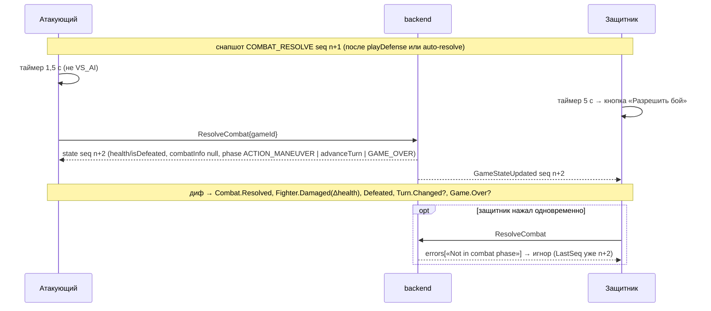

---

## 12. F12 — Scheme

**Предусловия.** Гейт `Action.PlayScheme` (§7): карта `SCHEME` (**не** `VERSATILE` — R4 §2.9), `BannerAllows` для хотя бы одного живого своего бойца (`executor.service.ts:1309-1322`).

**Шаги.** Клик карты `SCHEME` → `Input.Mode.CardSelected` → инспектор показывает `text` карты (из состояния — `Card.text`, R4 §2.5.4) → «Разыграть» (подтверждение — карта всегда уходит в сброс и тратит действие, эффекты best-effort — R4 §2.9) → `PlayScheme({ gameId, cardId })` → ответ: `Card.Played/Discarded`, `Actions.Changed`; авто-эффекты (`DRAW_CARD`, `DAMAGE`, `GAIN_ACTION`, `END_TURN`) — по дифу; эффекты с выбором → `metadata.pendingEffects` → `Match.Event.Pending.Added` → F13. Тексты `UNSUPPORTED`/`manualEffects` через GraphQL не приходят (B15) — клиент показывает **текст карты** в `WBP_ActionLog` с пометкой «применяется вручную, если движок не распознал» (R4 §3.18).

**DTO.** `PlaySchemeDto { gameId: String!, cardId: String! }`.

**Ошибки.** «Card is not a SCHEME card (got X)» → `ensure`; «Card not found in hand» → `RefetchState()`; banner («нужен живой боец под banner») → тост; общие §7.

**Критерии приёмки.** Medusa «A Momentary Glance» и «Winged Frenzy», Arthur «The Lady of the Lake», «Prophecy», «Command the Storms», «Restless Spirits» разыгрываются без зависания UI независимо от того, распознан ли текст (§19).

---

## 13. F13 — Pending effects: MOVE / PLACE / CHOOSE_ONE

**Факты.** `PendingEffect { id, type: MOVE|PLACE|CHOOSE_ONE, playerId, value?, fighterName?, targetsOpponent?, text?, options[{index,label}]?, chooseCount?, card? }` (R3 §2.9.9). Игру **не блокируют**; резолвит только `playerId` (**не** обязательно в свой ход и в любой фазе — `resolvePendingEffect` без фазового guard'а, R3 §2.7.9); действие не тратится, seq +1; протухают в `advanceTurn` при возврате хода владельцу (R4 §2.4 п.7, §2.10). Источники: карты (`MOVE/PLACE/CHOOSE_ONE`) и способности (`pending-move`: robin-hood после атаки, leonardo на старте хода, bruce-lee в конце хода — R4 §2.10).

**Кто и когда резолвит на клиенте.** `MyPendingEffects()` = `pendingEffects.filter(playerId == me)` в порядке массива; активен **первый**; остальные — «в очереди: k». Гейт `Action.Pending.*`: `NONE(Match.Phase.Combat)` (G19). В `Match.Phase.CombatResolve` резолв разрешён гейтом, но `WBP_ChooseOneDialog` не открывается автоматически, чтобы не перекрывать `WBP_CombatPanel`; баннер даёт кнопку «Выбрать» (уточнение к ADR, UX без изменения гейта).

**FSM.** Приоритет `FUmInputStateMachine`: `ChooseOne(modal)` > `PendingMove/PendingPlace` > `Defense` > … (ADR §4.7). Вход в `Input.Mode.ChooseOne/PendingMove/PendingPlace` — автоматически при появлении первого моего pending вне `COMBAT`; выход — резолв, «Пропустить» (локальный флаг `DismissedPendingIds`, баннер сворачивается; повторное открытие — из `WBP_ActionLog`/иконки) или исчезновение pending из снапшота (протух/резолвлен).

**Шаги MOVE.**

1. Баннер: `text` (+ `fighterName`, `value`), «Кликните бойца» (свой, либо чужой при `targetsOpponent`). Кандидаты — `FUmRules::FighterFitsPending(pending, fighter, me)`: владелец по `targetsOpponent`, живой, `BannerAllows(fighterName, fighter.name)`; если кандидат ровно один — выбирается автоматически.
2. Клик бойца → подсветка `Reachable(board, pos, value ?? 1, blocked = чужие живые бойцы)` (`MI_Highlight_Pending`; сервер блокирует только чужих живых, клетка занятая своим тоже отклоняется как «Клетка занята» — R4 §2.10; клиент исключает все занятые).
3. Клик клетки → `ResolvePendingEffect({ gameId, effectId, fighterId, x, y })` → диф `Fighter.Moved`, `Pending.Removed`; возможны реактивные `Fighter.Damaged` (Tomoe) и `Game.Over` (`applyMoveReactions`, R4 §2.11.3).

**Шаги PLACE.** Как MOVE, но подсветка — любая свободная проходимая клетка доски (зонные ограничения на сервере — TODO, R4 §2.10); `x/y` без `@Max` в этом DTO (R3 §2.7.9), но доска ≤ 20 в MVP.

**Шаги CHOOSE_ONE.** `WBP_ChooseOneDialog` (`UI.Layer.Modal`, доска заблокирована — R7 §2.9.6 п.1): кнопки `options[].label`, подпись «выберите N» при `chooseCount > 1`, `text` карты → `ResolvePendingEffect({ gameId, effectId, optionIndex })`. Ответ: при `chooseCount > 1` pending остаётся с `chooseCount − 1` и **перенумерованными** опциями (индексы читать заново из снапшота — R4 §2.10); вложенные `MOVE/PLACE` из опции создают новые pending → снова F13. Кнопка «Отложить» закрывает модалку локально (pending остаётся на сервере).

**DTO.** `ResolvePendingEffectDto { gameId: String!, effectId: String!, fighterId: String, x: Int, y: Int, optionIndex: Int }`; `FUmInputs::ResolvePendingEffect` опускает неиспользуемые поля (не шлёт `null`/пустые строки — `forbidNonWhitelisted` пропускает `null` в nullable, но единообразие важнее; ADR §4.2).

**Ошибки.**

| Сообщение (R4 §2.10) | Класс | Реакция | Откат |
|---|---|---|---|
| «Отложенный эффект не найден (протух или уже резолвлен)» | `Validation` | без тоста, `RefetchState()`; баннер обновится по снапшоту | `Idle` |
| «Этот выбор принадлежит другому игроку» | `Validation` | `ensure` | `Idle` |
| «MOVE/PLACE требует fighterId, x, y», «Нужен валидный optionIndex (0..N)» | `Validation` | `ensure` (клиентский баг) | `Idle` |
| «Боец не найден или повержен», «Эффект двигает не этого бойца», «Эффект двигает только «…»» | `Validation` | тост; пересчитать кандидатов | остаться в `PendingMove` |
| «Клетка вне доски», «Клетка непроходима», «Клетка занята», «До клетки (x, y) не добраться за N шаг(ов)» | `Validation` | тост; пересчитать подсветку | остаться в `PendingMove`/`PendingPlace` |
| `Concurrent` | `Concurrent` | `RefetchState()` | `Idle` |

**Критерии приёмки.** (1) После атаки Артура картой Swift Strike (если распознана) баннер MOVE появляется у атакующего и позволяет переместить бойца до 4 клеток или пропустить; (2) pending, созданный вторым действием, живёт весь ход соперника и исчезает в начале следующего хода владельца (`FT_Um_PendingBannerShown`, фикстуры `robin-hood-vs-leonardo`); (3) в `COMBAT` баннер показывает «после боя», кнопки неактивны; (4) CHOOSE_ONE с `chooseCount 2` требует двух последовательных выборов (`backend/scripts/e2e-choose-one.mjs` как эталон, R6 §3 п.10).

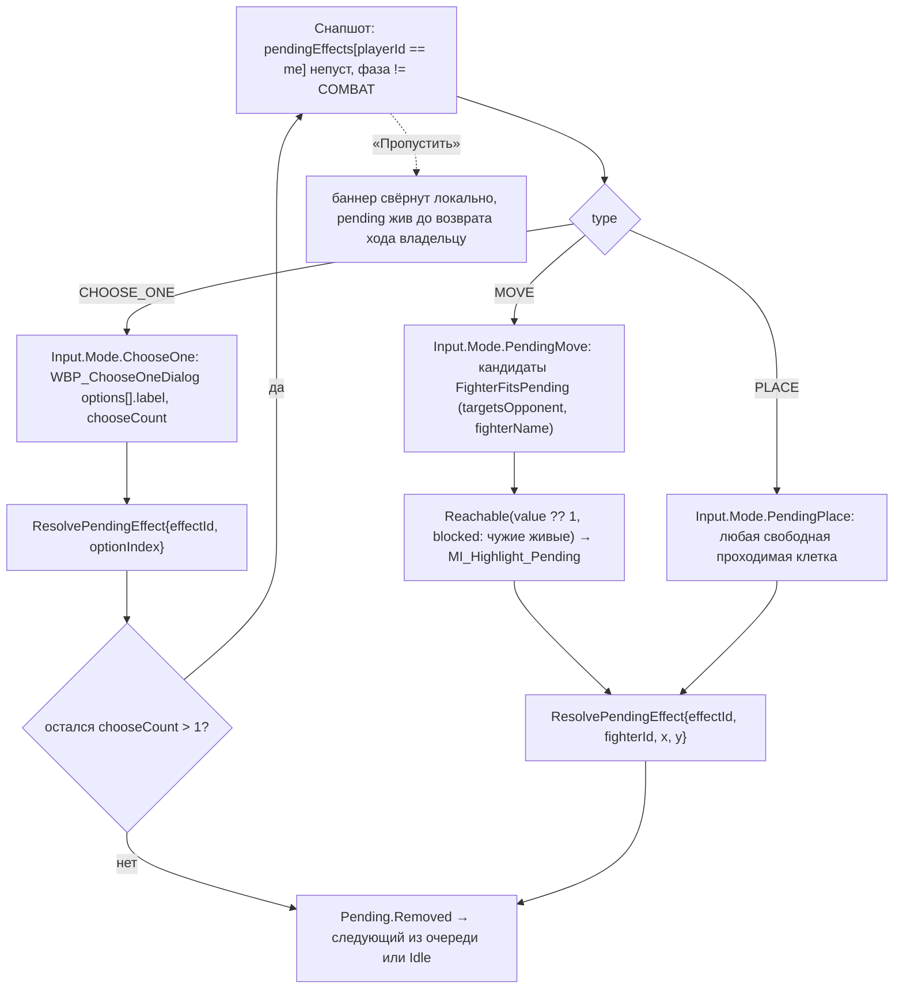

---

## 14. F14 — Стойки (`setStance`)

**Факты.** `HeroStances(heroSlug) → [{id, label, isDefault}]` из `ABILITY_CONFIGS` (`@Public`); сейчас только `alice` (`big`*, `small`) и `muhammad-ali` (`float`* с `attackRange 2`, `sting`) (R3 §2.5; `ability-config.ts:850-893`). Текущая стойка — `metadata.heroStances[userId]`, при отсутствии — `isDefault` или первая (R4 §2.13). `setStance`: `ActionPhaseGuard` (свой ход + action-фаза), бесплатно, seq +1, событие `SPECIAL_ABILITY` (R4 §2.13). Авто-смена: Ali — `toggle` после выигранной атаки (R4 §2.11.2).

**Шаги.** `EnterGame` → `GetStances(heroSlug)` для моего HERO → пустой список → `WBP_StanceBar` скрыт (ADR §5.5). Иначе кнопки `label`, активная помечена; гейт `Action.SetStance` (§7: `Match.Turn.Mine` + action-фаза — сервер требует то же, `ActionPhaseGuard`; веб-клиент гейта не имел, R7 §4 п.5) → `SetStance({ gameId, stanceId })` → ответ: `heroStances[me]` изменён → `Match.Event.Stance.Changed` → cue `Stance.Changed`; `FUmLegalActions` пересчитывает `IsInAttackRange` с новой стойкой (`DT_AttackRange.StanceId`). Авто-флип соперника/свой — тот же диф из любого снапшота → тост «Стойка изменена: Sting Like a Bee».

**DTO.** `SetStanceDto { gameId: String!, stanceId: String! }`.

**Ошибки.** «У игрока нет героя на доске», «У этого героя нет стоек», «Неизвестная стойка «X» (доступны: a, b)» → `Validation` → тост + `ensure` (кэш стоек разошёлся → `GetStances` заново); общие §7.

**Критерии приёмки.** (1) Alice переключает `big/small` в свой ход, кнопки неактивны в чужой ход и в `COMBAT`; (2) Ali после выигранной атаки показывает флип без действий игрока; в `float` подсвечиваются цели на расстоянии 2, в `sting` — только смежные; (3) фикстуры `alice-vs-muhammad-ali` (ADR §3.7).

---

## 15. F15 — Двери, туман, возвышенность (мёртвые механики)

**Факты.** `boardState.doors/fog/tokens` всегда `{}`; клетки `door` не создаются; `toggleDoor` всегда `DOOR_NOT_FOUND`; BFS читает `cell.isOpen`, а toggle меняет `doors["x:y"]` — несвязанные структуры; `fog`/`isHighGround` логикой не читаются (R4 §2.6.6–2.6.7, §4.6–4.7).

**Поведение клиента.** (1) `AUmGameStage` рендерит `Cell.type` `wall/obstacle` как непроходимые (ромб-препятствие по референсу R7 §2.10), `door` — как `obstacle` при `!isOpen` и как `normal` при `isOpen` (данных нет — на всякий случай), `zone-line` — как `normal`; `fog`/`tokens`/`isHighGround` игнорируются. (2) UI дверей нет; `toggleDoor` — только `um.toggledoor x y` (ADR §4.8). (3) Если в снапшоте `Doors.Num() > 0` — `LogUmSync` Warning «doors present: <keys>» (сигнал, что механику оживили).

**Ошибки.** «No door at (x, y)» / `DOOR_NOT_FOUND` → только в консоль.

---

## 16. F16 — `pass` и `endTurn`

**Факты.** `pass` тратит действие, **не** сбрасывает карту (`passCount + 1`, TODO в коде — R4 §2.14, §4.8); `endTurn` валиден из `ACTION_MANEUVER/ACTION_ATTACK/TURN_END` без требования «≥ 1 манёвр» (R3 §4 п.6) и вызывает `advanceTurn` (добор сопернику, снятие `turn`-эффектов, очистка pending соперника).

**Шаги.** «Пропустить действие» (подпись именно такая — ADR §5.7) → `Pass({ gameId })` → `Actions.Changed` (и `Turn.Changed` при 0). «Завершить ход» → если `ActionsRemaining > 0` — `WBP_ConfirmDialog` «Осталось N действий. Завершить ход?» (уточнение к ADR) → `EndTurn({ gameId })` → `Turn.Changed`. Hotkey `IA_Confirm` на «Завершить ход» — нет (только явная кнопка), чтобы не совпасть с fast-forward очереди воспроизведения (ADR §4.7).

**DTO.** `PassDto { gameId }`, `EndTurnDto { gameId }`.

**Ошибки.** «Cannot end turn in current phase» → `Validation` → `RefetchState()`; общие §7.

**Критерии приёмки.** `endTurn` при 2 действиях передаёт ход и сопернику приходит +1 карта; `pass` дважды передаёт ход без изменения руки.

---

## 17. F17 — Game over → обязательный `leaveGame`/`abortGame`

**Факты.** `phase == GAME_OVER` ставится `checkAndApplyGameOver` (`winnerId = alivePlayers[0]?.userId`, `combatInfo` очищен — R4 §2.15); резолвер дополнительно публикует `GameEnded` с seq состояния (R2 §2.6). `Game.status` остаётся `IN_PROGRESS` и занимает лимит 5, пока участник не вызовет `leaveGame` (в `IN_PROGRESS` → `abortGame('player_left')` → `ABORTED`, `endedAt`) или `abortGame` (ADR §1.3 п.9; R2 §2.3, §3.13; B11). `Game.winnerId` не заполняется — победитель только из `metadata.winnerId`.

**Шаги.**

1. Триггеры: (а) снапшот с `phase == GAME_OVER` → `Match.Event.Game.Over` (после проигрывания всех cue очереди — `PresentedState`); (б) `GameEnded { sequenceNumber: 0, payload: {reason:'aborted', abortedBy} }` — соперник прервал/вышел (R2 §3.16); (в) `GameEnded` с seq состояния — дублирует (а), дедуплицируется по `(gameId,"GAME_ENDED",seq)`.
2. `UUmUISubsystem::PushScreen(UI.Screen.GameOver)` → `WBP_GameOver` (`UI.Layer.Modal`): «Победа» (`winnerId == me`), «Поражение» (`winnerId` = соперник), «Ничья/нет победителя» (`winnerId` пуст — 0 живых, R4 §2.8 шаг 8), «Партия прервана соперником» (`reason: 'aborted'`, `abortedBy != me`). Ввод на доске заблокирован (`Input.Mode.Busy`), просмотр карт разрешён.
3. Единственная кнопка «В лобби» → `LeaveGame(gameId)` → независимо от результата (`true` или ошибка) → `ExitGame()` (отписки `GameStateUpdated/GameEnded`, очистка `FUmGameSnapshotStore`, `UUmPresentationSubsystem::ExitGame` — уничтожение `AUmGameStage`) → `UI.Screen.Lobby` → `RefreshAvailableGames()` + `MyGames`.
4. Выход из идущей партии («Покинуть» в HUD) → `WBP_ConfirmDialog` «Вы проиграете партию» → тот же `LeaveGame` (сервер прервёт игру с `reason: 'player_left'`; соперник получит `GameEnded` seq 0). `AbortGame` в UI не используется (семантика та же, но нет причины `player_left`; оставлен для dev-консоли и «Мои игры» при `PENDING`).
5. «Мои игры» (F3) показывает «зависшие» `IN_PROGRESS` партии, которые клиент по какой-то причине не покинул (крах, второй клиент) — «Покинуть» → `LeaveGame`.

**Ошибки.** `leaveGame` → «Игра не найдена» (`NotFound`) — игнорировать (хост уже удалил/прервал, R2 §3.14); `ForbiddenException('Вы не участвуете в этой игре')` — игнорировать, лобби; `Network` — тост «Не удалось освободить слот: повторите из «Мои игры»», лобби.

**Критерии приёмки.** (1) После `GAME_OVER` оба клиента показывают согласованный результат; (2) после «В лобби» `MyGames({status: IN_PROGRESS})` не содержит эту игру (статус `ABORTED`); (3) `abortGame` со стороны соперника в бою снимает таймеры защиты/резолва.

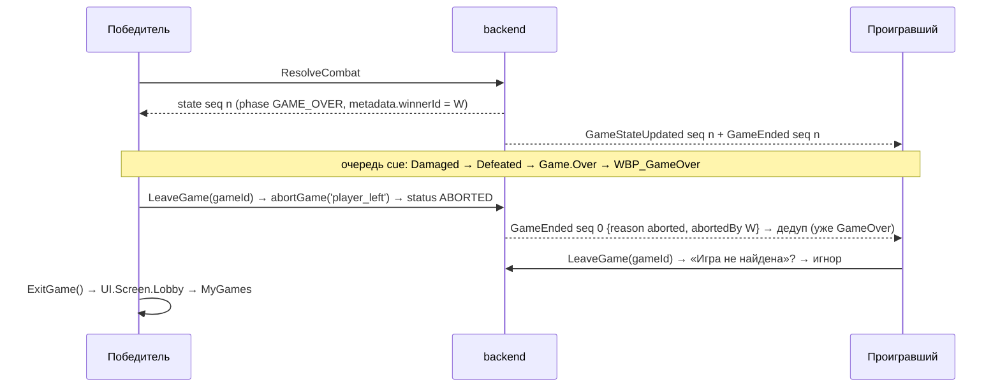

---

## 18. F18 — Реконнект и resync (gap, полный рефетч, повторная подписка)

**Факты.** Сервер шлёт ping-фрейм каждые 12 с, `terminate()` без close-фрейма при отсутствии pong 12 с (ADR §1.3 п.1); `connection_init` ≤ 3 с (4408); `connection_ack` не подтверждает токен — auth-ошибка приходит на `subscribe` (ADR §1.3 п.2). `gameStateUpdated(since)` фильтрует `sequenceNumber > since` (R2 §2.6); `gameSequence` возвращает `Float`, `0` если состояния нет (R2 §2.4). `eventsSince` для восстановления **не используется** (ADR §5.2).

**Шаги (`UUmNetSubsystem` + `UUmStateSubsystem`, ADR §4.1, §5.2; К1 §3.5.3).**

1. `IUmWebSocket::OnClosed/OnConnectionError` → `Net.State.Reconnecting`, `Match.Sync.Reconnecting`, `WBP_ReconnectOverlay` (`UI.Layer.Toast`), `Input.Mode.Busy`; таймеры защиты/авто-резолва **останавливаются** (не отправлять `resolveCombat` вслепую).
2. Backoff `1 с × 2^(n−1)`, 5 попыток (`WsReconnectMaxAttempts`, `WsReconnectBaseDelayMs`): `Connect` → `connection_init { authorization: "Bearer <access>" }` немедленно в `OnConnected` → `connection_ack` → `Net.State.Connected`.
3. Переподписка с актуальными переменными: `GameStateUpdated(gameId, since: LastSeq)`, `GameEnded(gameId)` (в комнате — также `PlayerJoined/PlayerLeft`).
4. Resync: `GameSequence(gameId)` → `== LastSeq` → `Match.Sync.Live`; `> LastSeq` → `Match.Sync.Resyncing` → `GetGameState(gameId)` → `ForceReplace` (диф от старого `Current` проигрывается ускоренно — fast-forward очереди) → `Live`. Дополнительно, если `bDecksStale` — тот же `GetGameState`.
5. `Live` → пересчёт дедлайна защиты от `combatInfo.startedAt`; если `phase == COMBAT_RESOLVE && bHasCombatInfo` — правило F11 запускается заново (таймер 1,5 с/5 с от момента `Live`).
6. Gap на живой подписке (`Incoming.Seq > LastSeq + 1`) → снапшот применяется (он полный) **и** `RefetchState()` (ADR §5.2) без смены `Net.State`.
7. `next{errors}` на живой `GameStateUpdated` (например, B7) → лог + `RefetchState()`, подписка сохраняется; `complete` без нашего `Unsubscribe` → переподписка (F24).
8. Auth-ошибка на `subscribe` (`next{errors:[«Неавторизованный доступ»]}` + `complete` или `error` без `extensions.code`) → класс `Auth` по подстроке → `UUmAuthSubsystem::RefreshTokens()` (single-flight) → `ReconnectWebSocket("token-refreshed")` → шаги 2–5. Проактивный refresh (за 300 с до `exp`) тоже завершается `ReconnectWebSocket` — токен фиксируется в `connection_init` (ADR §5.3).
9. Исчерпание попыток → `Net.State.Error`, overlay «Нет связи» с кнопкой «Переподключиться» (сброс счётчика) и «В лобби» (`ExitGame` без `leaveGame` — слот остаётся занят, «Мои игры» покажет партию).
10. Возврат приложения из фона / `FCoreDelegates::ApplicationHasReactivatedDelegate` — принудительный `GameSequence` (mobile — v2; на Win64 — по таймеру `WsAppPingIntervalSec` прикладного `ping`).
11. HTTP-мутация, отправленная до обрыва, могла примениться: клиент **не** повторяет её; resync покажет результат (ADR §5.4).

**Close-коды** (ADR §4.1): 4406 — конфигурация, без ретрая (тост «Несовместимый протокол»); 4400/4401/4409/4429 — баг клиента (лог Error, один реконнект); 4408/4500/1001/1006 — backoff.

**Ошибки HTTP во время resync.** `GameSequence/GetGameState` → `Network` → ретрай `FUmRetryPolicy` (3 попытки) → затем `Net.State.Error`; `NotFound` («Игра не найдена») → игра удалена/прервана → F17 с «Партия прервана»; `Forbidden` → лобби.

**Критерии приёмки** (К1 §1.5 п.2–3; ADR E0.2). (1) Обрыв WS (`um.wsdrop` в dev-консоли — уточнение к ADR: добавить команду) в середине боя восстанавливается без перезапуска, таймер защиты продолжается от `startedAt`; (2) подписка idle > 5 мин не рвётся (LWS авто-pong); (3) истечение access (1 ч) в партии не ломает подписку (проактивный refresh + `ReconnectWebSocket`); (4) пропуск 3 seq во время обрыва даёт один `GetGameState` и корректный HUD (spec `Unmatched.Client.SnapshotStore` «gap → refetch», E2E «обрыв WS → gameSequence/gameState»).

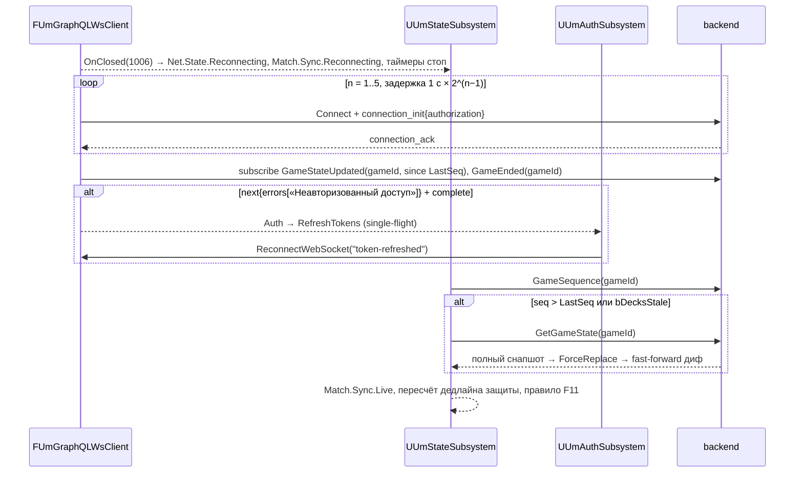

---

## 19. F19 — VS_AI (бурсты, ai-аккаунт), F20 — presence/heartbeat

### 19.1. F19 — VS_AI (`Feature.VsAi`, v1 — ADR §8 п.7)

**Факты.** `createGame({ mode: VS_AI })` → `selectHero` → `toggleReady` → `startGame`: бот добавляется сервером (`ai@unmached.local`, проверено `game.service.ts:32`; сильнейший по `health` герой с картами, `isReady: true` — R2 §2.3); без сидированного бота — «ИИ-оппонент не сидирован (ai@unmached.local) — запустите prisma/seed-ai.ts». После **каждой** мутации человека сервер fire-and-forget выполняет до `MAX_STEPS = 40` шагов бота (проверено `ai-turn.service.ts:24`), каждый — `saveState` + `publishGameUpdate`, **без задержек** (R4 §2.16). Бот-защитник играет лучшую защиту и резолвит; бот-атакующий резолвит, как только человек сыграл защиту (`ai-decision.service.ts:45-56`).

**Отличия потоков.**

| Поток | Изменение |
|---|---|
| F3/F4 | `WBP_CreateGameDialog` — режим `VS_AI` при `bVsAiEnabled`; в комнате второй слот — «AI Bot» (появится только после `startGame`), кнопка «Начать» доступна при `players.Num() == 1 && я готов`; поллинг не нужен |
| F6 | `GetGame.mode == VS_AI` → `bOpponentIsBot = true` (имя `opponent.username == "AI Bot"` — только для отображения) |
| F7 | после моей мутации приходит **бурст** `GameStateUpdated` seq n+1…n+k (до 40) — `UUmPresentationSubsystem` ставит их в очередь; `PresentedState` отстаёт, `Input.Mode.Busy` до конца воспроизведения; fast-forward по клику/`IA_Confirm` (ADR §4.7) |
| F10 | мой `attack` → бот сразу `playDefense` + `resolveCombat` → в ответе мутации ещё `COMBAT`, а через мгновение два снапшота; окно защиты у бота не показываем (таймер не рисуем, если `bOpponentIsBot`) |
| F11 | человек **не** авто-резолвит (§11); кнопка-fallback через 5 с без нового снапшота |
| F13 | бот резолвит свои pending первыми (R4 §2.16 п.2) — приходят в бурсте |
| F17 | `GameEnded` может прийти из хода бота (`ai-turn.service.ts:82-83`) — обработка та же |
| F18 | бурст во время обрыва — gap → `GetGameState` |

**Ошибка.** `startGame` → «Нет героев с картами для ИИ-оппонента» / «ИИ-оппонент не сидирован…» → тост, комната остаётся (B3 — сид).

**Критерии приёмки.** Партия против бота проходит до `GAME_OVER` без ручного `resolveCombat` со стороны человека-атакующего; бурст из ≥ 5 снапшотов проигрывается последовательно и fast-forward работает (spec `Unmatched.Client.Playback`).

### 19.2. F20 — Presence / heartbeat (не используется)

`bPresenceEnabled=false` (ADR §3.5). Причины: `heartbeat` без guard'а читает `user.userId` → `TypeError` (R1 §2.9; R2 §4.1); `presenceUpdated` возвращает `Promise<void>` — нерабочая (R2 §4.4). Никаких вызовов `Heartbeat/GetPresence/GetOnlineUsers` из клиента; индикатор «соперник онлайн» в комнате — по факту `PlayerJoined`/`GetGame.players`. Включение — только после B13 (v2): heartbeat каждые 60–120 с с `status: INGAME|INQUEUE|ONLINE` и `currentGameId` (R2 §3.33).

---

## 20. Реестр героев: что клиент показывает и спрашивает

Сводка по 29 героям реестра способностей (R5 §2.8; R4 §2.11.2; `ability-config.ts:436-905`). «Показывает» — пассивное отображение через диф/лог; «Спрашивает» — интерактив (мутация/выбор). Дальности — `DT_AttackRange` (генерируется `export-ability-table.ts`, spec `AttackRangeSync` — ADR F19).

| slug | Герой (атака, HP, сайдкики) | Серверная механика | Клиент показывает | Клиент спрашивает | Веха |
|---|---|---|---|---|---|
| `medusa` | ranged, 16, 3× Harpy 1/3 melee | turn-start: 1 урон первому врагу в зоне Медузы (`turn-damage`, «you may» не моделируется) | `Fighter.Damaged` в начале хода → cue + строка лога «Petrifying Gaze»; ranged-подсветка по `SameLegacyZone`; banner `Harpy` ↔ `Harpy 1..3` | ничего | **MVP** |
| `king-arthur` | melee, 18, Merlin 7/2 ranged | `allowsAttackBoost: true` (`arthur.handler.ts:22-30`) | — | слот BOOST при **любой** атаке (`WBP_BoostPicker`); Merlin — ranged по `Fighter.attackType` | **MVP** |
| `luke-cage` | melee, 13, Misty Knight ranged | +2 defense всегда | итог по дифу; подпись «+2 защита» в `WBP_CombatPanel` (v1, `DT_HeroCombatMods`) | — | v1 |
| `annie-christmas` | melee, 14, Charlie ranged | +2 attack при HP атакующего < HP защитника | индикатор условия (опц.) | — | v1 |
| `eredin` | melee, 14, 4× Red Rider | +1/+1 когда все Red Rider повержены | бейдж (опц.) | — | v1 |
| `bloody-mary` | melee, 16 | turn-start при 3 картах: +1 действие | `Actions.Changed` (3 действия) | — | v1 |
| `philippa` | ranged, 12, Dijkstra | turn-end: добор до 4 | `Card.Drawn` ×N | — | v1 |
| `t-rex` | melee, 27 | `attackRange 2`; turn-end добор 1 | подсветка целей на 2 (манхэттен, игнорируя зоны) | — | v1 |
| `bigfoot` | melee, 16, Jackalope | turn-end добор 1 без врагов в зоне | `Card.Drawn` | — | v1 |
| `chupacabra` | melee, 14 | after-attack добор 1 | `Card.Drawn` | — | v1 |
| `deadpool` | melee, 10 | after-attack +1 HP | `Fighter.Healed` | — | v1 |
| `michelangelo` | melee, 14, April ranged | after-attack добор 1 | `Card.Drawn` | — | v1 |
| `angel` | melee, 16, Faith | after-attack при проигрыше добор 1 | `Card.Drawn` | — | v1 |
| `golden-bat` | melee, 18, Daisy | +2 attack без манёвра в этом ходу | индикатор «манёвра не было» (опц., по `maneuveredThisTurn`) | — | v1 |
| `ancient-leshen` | ranged, 13, 2× Wolf | +3 attack при второй атаке за ход | индикатор `attackedThisTurn` (опц.) | — | v1 |
| `raphael` | melee, 17, Casey Jones ranged | +1 действие при первом проигрыше в ходу | `Actions.Changed` | — | v1 |
| `robin-hood` | ranged, 13, 4× Outlaw | after-attack: pending MOVE атаковавшего до 2 | `Pending.Added` | **F13 MOVE** (fighterName = атаковавший) | v1 |
| `leonardo` | melee, 16, Splinter | turn-start: pending MOVE любого своего на 1 | `Pending.Added` | **F13 MOVE** с выбором бойца | v1 |
| `dracula` | melee, 13, 3× Sister | turn-start: 1 урон первому смежному врагу, затем добор 1 | `Fighter.Damaged` + `Card.Drawn` в начале хода | — | v1 |
| `bullseye` | ranged, 14 | `attackRange 5` | подсветка целей ≤ 5 (манхэттен) | — | v1 |
| `bruce-lee` | melee, 14 | turn-end: pending MOVE героя на 1 | `Pending.Added` — **внимание**: создаётся в `advanceTurn` завершающего игрока, живёт весь ход соперника, протухнет при возврате хода → баннер у неактивного игрока | **F13 MOVE** вне своего хода | v1 |
| `raptors` | melee, 7×3 (стая) | +1 attack за каждого другого раптора, смежного с защитником | превью (v1 `FUmCombatPreview`) | — | v1 |
| `oda-nobunaga` | melee, 13, 2× Honor Guard | аура +1/+1 союзникам в зоне Оды (кроме себя) | подсветка «под аурой» бойцов в зоне Оды (опц.) | — | v1 |
| `achilles` | melee, 18, Patroclus | +2 attack пока Patroclus повержен; добор при победе; при гибели Patroclus сброс 2 карт (первые 2) | `Card.Discarded` ×2 при гибели сайдкика → cue + лог | — | v1 |
| `tomoe-gozen` | ranged, 14 | вражеский HERO покидает её зону → 1 урон (`onFighterMoved`) | `Fighter.Damaged` после чужого манёвра/pending MOVE → лог «Unwavering Resolve» | — | v1 |
| `alice` | melee, 13, Jabberwock | стойки `big` (+2 attack) / `small` (+1 defense); смена только `setStance` | `WBP_StanceBar`, `Stance.Changed` | **F14** | MVP (механизм), v1 (герой) |
| `muhammad-ali` | melee, 16 | `float` (default, `attackRange 2`) / `sting` (+2 attack); авто-toggle после выигранной атаки | `WBP_StanceBar`; подсветка на 2 только в `float`; тост при авто-флипе | **F14** | v1 |
| `daredevil` | melee, 17 | ручной хендлер `executeBlindBoost` в потоке **не вызывается**; blind boost работает как эффект карты `BOOST/SELF_DECK_TOP` (парсер `effect-text-parser.ts:461`) | сброс верха колоды + `boostValue` — по дифу `MyDeckCount −1`, `MyDiscardCount +1` → cue `Card.Boost` с подписью «BLIND BOOST»; **UI «BLIND BOOST» нет** (ADR F10) | — | v1 |
| `ms-marvel` | melee, 14 | `range ≤ 2` (`ms-marvel.handler.ts:22,75`); turn-start сдвиг на 1 (`executeTurnStartMove`) — мутации в GraphQL **нет** (R5 §2.8; не найдено в `game-actions.resolver.ts`) | подсветка целей ≤ 2 | turn-start move — **не реализуется** (нет мутации; требует живой проверки/предпосылки) | v1 |

Прочие 41 герой — только текст способности с пометкой «применяется вручную» (R5 §3 п.11).

---

## 21. MVP-пара Medusa vs King Arthur: карты → эффекты → что потребует UI

Ожидаемый разбор — по регулярным выражениям `backend/src/game-engine/effects/effect-text-parser.ts` (строки указаны, проверено grep'ом): BOOST `:464`, blind boost `:461`, cancel `:350`, draw `:355`, «Draw 1 card. If you won…» `:168`, damage `:359`, move `:367/:382`, «choose one of the fighters in the combat and move» `:400`, place `:415`, set-value `:422`, per-count `:436`, opponent discard `:469`, prevent `:512`, условие «If you won the combat» `:325`. **Наличие эффектов в живой БД зависит от запуска `backend/prisma/backfill-card-effects.ts`** (идемпотентный, `--dry-run`, `--hero=Medusa`; в порядке сидов из памяти проекта его нет) — **требует живой проверки**; до этого движок применит только то, что лежит в `Card.effects` (`normalizeCardEffects` при `startGame`, проверено `game-initialization.service.ts:207`).

### 21.1. Medusa (11 карт, R5/doc09 `09-cards-and-effects.md:963-979`)

| Карта | Тип | Знач./BOOST | Текст | Ожидаемый разбор | Что потребует UI в MVP |
|---|---|---|---|---|---|
| Second Shot | attack 3 | boost 3 | during: You may BOOST this attack | `BOOST/PLAYER_CHOICE_HAND` | слот BOOST (F9 шаг 3) |
| A Momentary Glance | scheme | boost 4 | Deal 2 damage to any one fighter in Medusa's zone | цель «any one fighter in Medusa's zone» не в списке целей парсера → вероятно `UNSUPPORTED` (**живая проверка**) | текст в логе; если распознано как `DAMAGE` — `Fighter.Damaged` |
| Winged Frenzy | scheme (Any) | boost 2 | Move each of your fighters up to 3 spaces… return a defeated Harpy… | первое предложение → `MOVE` (`each …`), остаток → `UNSUPPORTED` (**живая проверка**) | возможен pending MOVE ×N (F13); текст в логе |
| Gaze of Stone | attack 2 | boost 4 | after: If you won the combat, deal 8 damage to the opposing fighter | `DAMAGE 8`, `AFTER_COMBAT`, `when: WON_COMBAT`, `OPPOSING_FIGHTER` | `Fighter.Damaged(9)` суммарно по дифу — cue с большим числом |
| Hiss and Slither | defense 4 | boost 3 | after: Your opponent discards 1 card | `OPPONENT_DISCARD 1` | у соперника `Card.Discarded`; `bDecksStale` рефетч |
| Feint (Any) | versatile 2 | boost 2 | immediately: Cancel all effects on your opponent's card | `CANCEL_EFFECTS`, `ON_REVEAL` | подпись «эффекты отменены» недоступна (нет `combatSummary`, B15) — только текст карты |
| Regroup (Any) | versatile 1 | boost 2 | after: Draw 1 card. If you won the combat, draw 2 cards instead | спец-правило `:168` | `Card.Drawn` ×1/2 |
| Snipe (Any) | versatile 3 | boost 1 | after: Draw 1 card | `DRAW_CARD 1` | `Card.Drawn` |
| The Hounds of Mighty Zeus (Harpy) | versatile 4 | boost 3 | after: Move each Harpy up to 3 spaces | `MOVE` с `each Harpy` (**живая проверка**, вероятно pending с `fighterName: Harpy`) | F13 MOVE с фильтром `Harpy` |
| Clutching Claws (Harpy) | versatile 3 | boost 2 | after: Your opponent discards 1 card | `OPPONENT_DISCARD 1` | как Hiss and Slither; banner `Harpy` |
| Dash (Any) | versatile 3 | boost 1 | after: Move your fighter up to 3 spaces | `MOVE 3`, `SELF` → pending MOVE | F13 MOVE |

### 21.2. King Arthur (16 карт, `09-cards-and-effects.md:847-868`)

| Карта | Тип | Знач./BOOST | Текст | Ожидаемый разбор | Что потребует UI в MVP |
|---|---|---|---|---|---|
| The Lady of the Lake (Arthur) | scheme | 2 | Search your deck and discard pile for EXCALIBUR… | `UNSUPPORTED` | текст в логе («вручную») |
| The Aid of Morgana (Arthur) | attack 4 | 2 | after: Draw 2 cards | `DRAW_CARD 2` | `Card.Drawn` ×2 |
| Prophecy (Merlin) | scheme | 2 | Look at the top 4 cards… | `UNSUPPORTED` | текст |
| Excalibur (Arthur) | attack 6 | 3 | — | — | слот BOOST (способность) |
| Momentous Shift (Any) ×3 | versatile 3 | 1 | during: If your fighter started this turn in a different space, this card's value is 5 instead | `SET_VALUE 5` с условием (`MOVED_THIS_TURN` — **живая проверка** маппинга условия) | итоговое значение недоступно (B15) — показать текст |
| Bewilderment (Merlin) ×2 | defense 0 | 2 | during: Prevent all damage · after: You may place your fighter in any space | `PREVENT_DAMAGE` + `PLACE` | F13 PLACE (после боя) |
| Command the Storms (Merlin) ×2 | scheme | 2 | Move each fighter up to 3 spaces (includes opposing) | `MOVE` `each fighter` (**живая проверка**: возможно pending с `targetsOpponent`) | F13 MOVE ×N |
| Regroup (Any) ×3 | versatile 1 | 1 | Draw 1 / 2 | `:168` | `Card.Drawn` |
| Swift Strike (Any) ×2 | attack 3 | 2 | after: Move your fighter up to 4 spaces | `MOVE 4` pending | F13 MOVE |
| Aid the Chosen One (Merlin) | attack 4 | 2 | after: If you won the combat, draw 2 cards | `DRAW_CARD 2` при `WON_COMBAT` | `Card.Drawn` |
| Divine Intervention (Arthur) ×2 | versatile 3 | 2 | after: Move King Arthur up to 5 spaces | `MOVE 5`, `fighterName: King Arthur` | F13 MOVE с фильтром (`BannerAllows("King Arthur", "King Arthur")`) |
| Feint (Any) ×3 | versatile 2 | 1 | Cancel all effects… | `CANCEL_EFFECTS` | текст |
| Noble Sacrifice (Arthur) ×3 | attack 2 | 3 | during: You may BOOST this attack (in addition to ability) | `BOOST/PLAYER_CHOICE_HAND` | один слот BOOST (сервер: одна boost-карта на розыгрыш — R5 §2.7 п.2; «двойной» буст не моделируется) |
| Restless Spirits (Merlin) | scheme | 2 | Choose any space in Merlin's zone. Deal 2 damage… | `UNSUPPORTED` (выбор клетки — нет такого pending-типа) | текст |
| Skirmish (Any) ×3 | versatile 4 | 1 | after: If you won, choose one of the fighters in the combat and move them up to 2 | `:400` → pending MOVE (**живая проверка**: свой или чужой боец — `targetsOpponent`?) | F13 MOVE |
| The Holy Grail (Arthur) | defense 1 | 2 | after: If King Arthur has 4 or less health…, set his health to 8 | `UNSUPPORTED` | текст |

**Вывод для MVP.** Обязательные интерактивы пары: слот BOOST (атака Артура всегда; Second Shot, Noble Sacrifice), pending MOVE (Dash, Swift Strike, Divine Intervention, Skirmish, Hounds), pending PLACE (Bewilderment), защита/резолв, лог текстов для `UNSUPPORTED` (5 карт Артура, 1–2 Медузы). CHOOSE_ONE в паре **не встречается** — покрывается `e2e-choose-one.mjs` и фикстурой `pending_choose_one` (ADR §4.8). Стойки — не встречаются (Alice/Ali — фикстуры).

---

## 22. Сводная матрица «поток → теги → виджеты → операции → cue»

| Поток | Теги входа | Виджеты | Операции | Cue (`GameplayCue.Match.*`) |
|---|---|---|---|---|
| F1 | `UI.Screen.Boot` | `WBP_Boot` | `RefreshTokens`, `Me`, `HeroIdMap`, `BoardIdMap` | — |
| F2 | `UI.Screen.Login/Register` | `WBP_Login`, `WBP_Register` | `Login`, `Register` | — |
| F3 | `UI.Screen.Lobby` | `WBP_Lobby`, `WBP_GameListRow`, `WBP_CreateGameDialog`, `WBP_JoinByIdDialog` | `AvailableGames`, `MyGames`, `CreateGame`, `JoinGame`, `LeaveGame` | — |
| F4 | `UI.Screen.Room` | `WBP_Room`, `WBP_PlayerSlot`, `WBP_HeroPicker`, `WBP_HeroCard` | `GetGame`, `SelectHero`, `ToggleReady`, `StartGame`, `LeaveGame`, `PlayerJoined/Left`, `GameStateUpdated`, `GameEnded` | — |
| F6 | `UI.Screen.Game`, `Match.Sync.Live` | `WBP_GameHUD` | `GetGame`, `GetGameState`, `HeroContent`, `HeroStances`, `Board` | — |
| F7 | `Match.Turn.*`, `Match.Actions.*` | `WBP_TurnPhasePill`, `WBP_PlayerPanel` | — | `Turn.Changed` |
| F8 | `Input.Mode.FighterSelected/Maneuver/BoostPick` | `WBP_ManeuverBar`, `WBP_BoostPicker` | `Maneuver`, `MoveFighter` | `Fighter.Move`, `Card.Discard`, `Card.Draw` |
| F9 | `Input.Mode.CardSelected/BoostPick` | `WBP_HandTray`, `WBP_CardInspector`, `WBP_BoostPicker` | `Attack` | `Combat.AttackDeclared`, `Card.Play`, `Card.Boost` |
| F10 | `Input.Mode.Defense`, `Match.Role.*` | `WBP_CombatPanel`, `WBP_HandTray` | `PlayDefense`, `ResolveCombat` | `Combat.DefenseRevealed`, `Combat.Timeout` |
| F11 | `Match.Phase.CombatResolve` | `WBP_CombatPanel` | `ResolveCombat` | `Combat.Resolved`, `Fighter.Damage/Heal/Defeated` |
| F12 | `Input.Mode.CardSelected` | `WBP_CardInspector`, `WBP_ActionLog` | `PlayScheme` | `Card.Play` |
| F13 | `Input.Mode.PendingMove/PendingPlace/ChooseOne` | `WBP_PendingEffectBanner`, `WBP_ChooseOneDialog` | `ResolvePendingEffect` | `Fighter.Move` |
| F14 | — | `WBP_StanceBar` | `HeroStances`, `SetStance` | `Stance.Changed` |
| F16 | — | `WBP_GameHUD` кнопки, `WBP_ConfirmDialog` | `Pass`, `EndTurn` | `Turn.Changed` |
| F17 | `UI.Screen.GameOver` | `WBP_GameOver` | `LeaveGame` | `Game.Over` |
| F18 | `Net.State.*`, `Match.Sync.Reconnecting/Resyncing` | `WBP_ReconnectOverlay`, `WBP_ConnectionBadge` | `GameSequence`, `GetGameState`, подписки | — |

---

## 23. Задачи для дорожной карты

Оценки — человеко-дни при «1 разработчик + агенты через MCP» (ADR §1.2 п.4); задачи — декомпозиция эпиков ADR §9.2 по потокам (E4 State, E5 экраны, E6 презентация, E7 HUD, E9 тесты) и не суммируются с ними повторно. Зависимости на эпики ADR обозначены `E1…E10`, на фазу 0 — `E0.x`.

| id | Название | Оценка (ч/д) | Зависимости | Веха | Критерий готовности |
|---|---|---|---|---|---|
| T-08-01 | Живая проверка фактов потоков: `NODE_ENV` стенда и формат ошибок (`extensions.code` для `BadRequestException`), геометрия Cobble City в БД (B1), результат `backfill-card-effects.ts --dry-run --hero=Medusa` и `--hero=King Arthur`, состав `players[]` после `startGame` | 0,5 | E0.2 | Phase0 | Протокол с ответами на §24 п.1–6 приложен к разделу; `Tests/Fixtures/state/seq1_initial.json` снят |
| T-08-02 | F1 Boot/RestoreSession: `WBP_Boot`, `RestoreSession`, проактивный refresh, `IdMap` после логина | 1,0 | E1 | MVP | Критерии §1; spec `Unmatched.Net.Auth` зелёный |
| T-08-03 | F2 Login/Register экраны и валидация, классификация `UNAUTHENTICATED` от `Login` как `Validation` | 1,0 | T-08-02 | MVP | Критерии §2 |
| T-08-04 | F3 Лобби: списки, поллинг 30 с, `CreateGame` с GUID и 1 повтором, `JoinGame`, «Войти по ID», лимит 5 с `WhyNot`, «Мои игры»/«Покинуть» | 1,5 | T-08-03, E3 | MVP | Критерии §3 |
| T-08-05 | F4 Комната: подписки до старта, поллинг 3 с, `SelectHero` по cuid, `ToggleReady` in-flight guard, `StartGame` с отсчётом, детект старта у гостя, host-migration, `GameEnded` в комнате | 2,0 | T-08-04, E2 | MVP | Критерии §4; E2E `createGame → … → startGame` двумя клиентами |
| T-08-06 | F6 `EnterGame/ExitGame` в три шага + `PresentationSubsystem::EnterGame`, обработка входа в идущий бой/pending/game over | 1,5 | T-08-05, E4 | MVP | Критерии §6; `FT_Um_ApplySnapshotRendersBoard` |
| T-08-07 | F7 Цикл хода: теги `Match.*`, `FUmLegalActions` таблица §7, `WhyNot`-тултипы, детект авто-передачи | 1,5 | E3, T-08-06 | MVP | Критерии §7; spec `Unmatched.Model.LegalActions` |
| T-08-08 | F8 Манёвр: `ManeuverPlanning` FSM, `WBP_ManeuverBar`, `ServerWouldAllow`, `WBP_BoostPicker` для манёвра, «Быстрый ход» | 2,5 | T-08-07, E6 | MVP | Критерии §8; фикстура `maneuver_through_fighter` |
| T-08-09 | F9 Атака: `AttackTargeting` FSM, banner-автовыбор бойца, подсветка целей (`SameLegacyZone`, `DT_AttackRange`), BOOST-слот, отправка instance-id | 2,0 | T-08-08 | MVP | Критерии §9; spec `Banner`, `RulesParity(bullseye-vs-t-rex)` |
| T-08-10 | F10 Окно защиты: `FUmServerClock`-таймер, `WBP_CombatPanel` для обеих ролей, `bDecksStale`-визуализация карты атаки, «Без защиты» с подтверждением | 1,5 | T-08-09, E7 | MVP | Критерии §10; E2E «31 с без защиты» |
| T-08-11 | F11 Протокол резолва: таймеры 1,5 с / 5 с, ветка бота, гейт `Pending.*` в `COMBAT`, идемпотентная обработка «Not in combat phase», флаг отключения после B6 | 1,0 | T-08-10 | MVP | Критерии §11 |
| T-08-12 | F12 Scheme + `WBP_ActionLog` с текстами карт для нераспознанных эффектов | 0,5 | T-08-07 | MVP | Критерии §12 |
| T-08-13 | F13 Pending: три режима ввода, `FighterFitsPending`, подсветки, `WBP_PendingEffectBanner`/`WBP_ChooseOneDialog`, «Пропустить», перенумерация опций | 2,0 | T-08-08, E7 | MVP | Критерии §13; `FT_Um_PendingBannerShown`; фикстуры `robin-hood-vs-leonardo`, `pending_choose_one` |
| T-08-14 | F14 Стойки: кэш `HeroStances`, `WBP_StanceBar`, гейт, авто-флип, дальность по стойке | 1,0 | T-08-09 | MVP | Критерии §14; фикстуры `alice-vs-muhammad-ali` |
| T-08-15 | F16 Pass/EndTurn + подтверждение; F15 политика дверей/тумана и `um.toggledoor` | 0,5 | T-08-07 | MVP | Критерии §15–16 |
| T-08-16 | F17 Game over: триггеры, `WBP_GameOver`, обязательный `LeaveGame`, «Покинуть» из HUD, очистка «Мои игры» | 1,0 | T-08-11 | MVP | Критерии §17 |
| T-08-17 | F18 Реконнект/resync: overlay, стоп/перезапуск таймеров, `GameSequence → GetGameState → ForceReplace`, обработка `next{errors}`, auth на `subscribe`, `um.wsdrop` | 2,0 | E2, E4, T-08-06 | MVP | Критерии §18; E2E «обрыв WS»; E0.2 idle > 5 мин |
| T-08-18 | Экспорт паритет-фикстур по потокам: `medusa-vs-king-arthur` (манёвр, атака ranged/melee, защита, резолв, pending MOVE/PLACE, game over), `bullseye-vs-t-rex`, `robin-hood-vs-leonardo`, `alice-vs-muhammad-ali` | 1,5 | E3, T-08-01, B3 | MVP | `Tests/Fixtures/rules/**` в репозитории; spec `RulesParity` зелёный |
| T-08-19 | E2E `Unmatched.E2E.FullMatch`: сценарий К1 §6.2 расширен потоками F3–F17 (два UE-клиента и UE+веб) | 2,0 | T-08-02…T-08-17 | MVP | Критерии К1 §1.5 п.1–2, 4 подтверждены прогоном из CLI |
| T-08-20 | Dev-консоль потоков: `um.login`, `um.join`, `um.refetch`, `um.dumpstate`, `um.wsdrop`, `um.resolve`, `um.stance <id>`, `um.pending list/resolve` | 0,5 | E4 | MVP | Все 11 gameplay-мутаций вызываемы из консоли (К1 §1.5 п.4) |
| T-08-21 | F19 VS_AI: режим в `WBP_CreateGameDialog`, `bOpponentIsBot`, отличия F4/F10/F11, тест бурста | 1,5 | T-08-16, `seed-ai.ts` (B3) | v1 | Критерии §19.1; spec `Playback` с бурстом ≥ 5 |
| T-08-22 | Герои v1 (§20): `DT_HeroCombatMods`, индикаторы условий, тосты авто-эффектов, `FUmCombatPreview` подпись в `WBP_CombatPanel` | 2,0 | T-08-11, E8 | v1 | Для 29 героев таблица §20 выполнена; фикстуры по 4 парам |
| T-08-23 | Отключение клиентского авто-резолва после B6, переход на `timeoutAt`/серверный урон; переход `hero(id: cuid)` после B2 | 0,5 | B6, B2 | v1 | Флаги переключены, E2E зелёный на новом бэкенде |
| T-08-24 | F5 Матчмейкинг за `Feature.Matchmaking`: `MatchFound` до `JoinQueue`, `QueueStatus` поллинг, подтверждение, `AcceptMatch/DeclineMatch`, восстановление через `MyGames(PENDING)` | 3,0 | B13 | v2 | §5 критерии включения флага; E2E matchmaking |
| T-08-25 | F20 Presence: heartbeat 60–120 с, статусы `INGAME/INQUEUE`, индикатор в комнате | 0,5 | B13, T-08-24 | v2 | `getPresence` соперника отображается |

Итого MVP: 24,0 ч/д (в пределах E4–E7, E9 ADR §9.2 = 30 ч/д с учётом непотоковой работы); v1: 4,0; v2: 3,5; фаза 0: 0,5.

---

## 24. Допущения и что требует живой проверки

### 24.1. Допущения (решения раздела в духе ADR)

1. `maneuver` — основной способ движения, `moveFighter` — «Быстрый ход» (дефолт открытого вопроса ADR §8 п.4).
2. Протокол авто-резолва G10 (1,5 с атакующий / 5 с защитник / не резолвить против бота) принят как дефолт ADR §8 п.1; отключается флагом после B6 (уточнение к ADR: `bAttackerAutoResolve`).
3. Гейт `Pending.*` — строго `NONE(Match.Phase.Combat)`; в `CombatResolve` модалка CHOOSE_ONE не открывается автоматически (уточнение UX, гейт не меняется).
4. Локальные теги комнаты `Room.*` под корнем `UI.` и команда `um.wsdrop` — уточнения к ADR.
5. Смена героя после «Готов» требует снятия готовности (веб-паритет; сервер не запрещает).
6. `AbortGame` в UI не используется; выход из партии — всегда `LeaveGame`.
7. Подтверждения: «Без защиты», «Завершить ход» при остатке действий, «Покинуть партию».
8. `refreshTokens` при `Network` повторяется один раз (уточнение к `FUmRetryPolicy` ADR §4.1, где повтор описан только для `createGame`).
9. Разделы плана 02–07, 09–11 названы по темам ADR §1; точная нумерация файлов не фиксируется.

### 24.2. Требует живой проверки (стенд `localhost:3000`, `docker compose up`)

1. `NODE_ENV` MVP-стенда и реальный `extensions.code` для `BadRequestException` gameplay-мутаций (`BAD_REQUEST` vs `BAD_USER_INPUT`) — влияет на класс `Validation`/`Opaque` во всех таблицах ошибок (R3 §4.9; ADR §8 п.2, B4).
2. Геометрия Cobble City в БД (`Board.cells` 6×4 с зонами) — иначе ranged-подсветка Медузы деградирует до смежности (B1; R4 §4.13).
3. Заполнены ли `Card.effects` для Medusa/King Arthur (`backfill-card-effects.ts --dry-run`) и как парсер разобрал пометки «живая проверка» в §21 (Winged Frenzy, Hounds, Command the Storms, Skirmish, Momentous Shift, A Momentary Glance).
4. Порядок «эхо подписки раньше HTTP-ответа» (ADR §1.3 п.8) и фактическая задержка между `ATTACK` и доступностью карты атаки у защитника после рефетча.
5. Поведение `gameStateUpdated` при `currentTurnPlayerId == null` (B7) — приходит ли `next{errors}` или `complete`.
6. Формат `combatInfo.startedAt` (ISO-строка) и точность `FUmServerClock` на реальных RTT; расхождение таймеров двух клиентов.
7. `heartbeat`/`penaltyInfo` под Bearer — падают ли (`Cannot read properties of undefined (reading 'userId')`, R2 §4.21) — подтверждение неработоспособности F5/F20.
8. `leaveGame` хостом без соперника → действительно ли следующие `game(id)` дают «Игна не найдена» и не приходит ли лишний `PlayerLeft` самому хосту.
9. `ThrottlerGuard` не активен — подтвердить, что при отсутствии `Origin` лимиты не срабатывают (R2 §2.14).
10. `hero(id: <cuid>)` после деплоя правки B2; до этого — путь по имени.
11. Ms. Marvel turn-start move — существует ли мутация в схеме (introspection E0.2); в `game-actions.resolver.ts` не найдена.
12. Фантомный сайдкик «Unknown» (B19) у героев без сайдкиков — не MVP, но влияет на F6 (лишний `MINION`).
13. Бурст VS_AI: реальная длина серии и порядок `GameEnded` относительно последнего `STATE_UPDATED`.

### 24.3. Источники

- ADR `docs/unreal/01-architecture-decision.md`: §1.2, §1.3 (п.1–12), §2.3 (G3, G8–G13, G16, G19, G21, G23), §2.4 (F5, F6, F10, F17, F18, F19, F24), §3.4–3.6, §4.1–4.8, §5.2–5.7, §6 (B1–B20), §8, §9.
- R1 `_research/R1-transport-auth.md`: §2.5–2.10 (auth-модель, refresh-цикл, DTO, коды ошибок).
- R2 `_research/R2-lobby-matchmaking-internals.md`: §1, §2.2–2.6, §2.7–2.9, §2.10–2.14, §3 (п.7–35), §4 (п.1–21).
- R3 `_research/R3-game-api-schema.md`: §2.2, §2.4–2.5, §2.7 (DTO 2.7.1–2.7.12), §2.8–2.15, §3, §4.
- R4 `_research/R4-engine-mechanics.md`: §2.1–2.18, §3, §4.
- R5 `_research/R5-content-cards-heroes.md`: §2.5–2.8, §2.13, §3, §4.
- R6 `_research/R6-admin.md`: §2.4, §2.6, §2.8, §2.9, §3.
- R7 `_research/R7-web-client-port-catalog.md`: §2.2–2.3, §2.6–2.9, §2.13, §3, §4.
- К1 `_design/candidate-1.md`: §1.4–1.5, §3.5.2–3.5.5, §3.6.2–3.6.4, §4.1–4.7; К2 `_design/candidate-2.md`: §3.5.3–3.5.4, §4.1–4.6; К3 `_design/candidate-3.md`: §3.6.1–3.6.5, §4.1–4.6, Приложение A.
- Исходники бэкенда (проверено напрямую в этой сессии): `backend/src/games/services/combat-timeout.service.ts:199-282`; `backend/src/games/game.resolver.ts:100-108`; `backend/src/games/game.service.ts:32`; `backend/src/games/services/ai-turn.service.ts:24,46`; `backend/src/games/services/game-initialization.service.ts:185-215`; `backend/src/game-engine/effects/effect-text-parser.ts:105-517` (регулярные выражения); `backend/prisma/backfill-card-effects.ts:1-45`.
- Карты MVP-пары: `docs/backend-api/09-cards-and-effects.md:847-868` (King Arthur), `:963-979` (Medusa).
- Память проекта: `memory/unmatched-launch-procedure.md` (порядок сидов, порты), `memory/game-tester-and-logic-gaps.md`.
