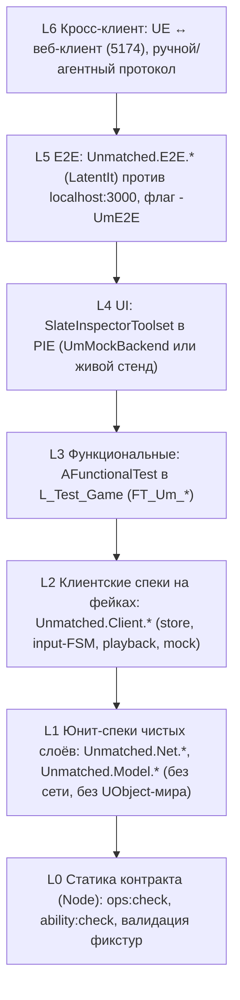
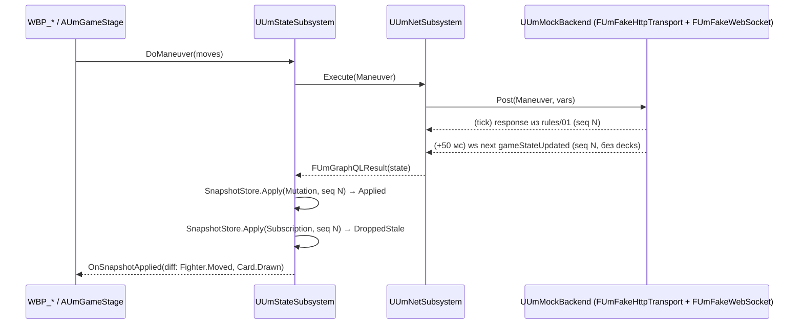
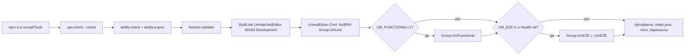
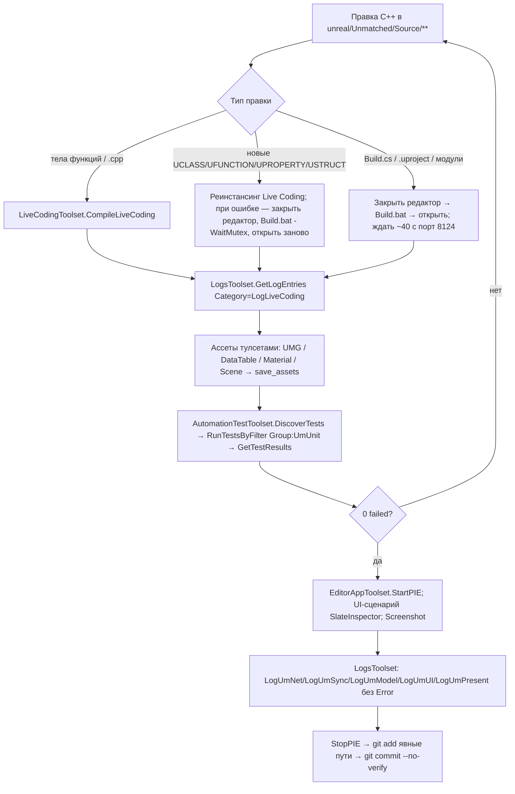

# 09. Тестирование, QA, CI и агентный dev-loop через Unreal MCP

> Статус: план фазы реализации (после ADR). Дата: 2026-09-02. Ветка: `fix/admin-panel`.
> Фундамент: `docs/unreal/01-architecture-decision.md` (далее — ADR); имена модулей, классов, спеков, файлов и тегов взяты из ADR §3.2–3.7, §4.8, §5.1, §5.8, §5.9 без переименований. Всё, чего в ADR нет, помечено «(уточнение к ADR)». Ссылки вида `файл:строка` — на исходники UE 5.8.2 (`$UE` = `C:\Program Files\Epic Games\UE_5.8\Engine`), бэкенда (`backend/**`) и research-файлы `docs/unreal/_research/R1…R9`; `К1 §6.2` — на кандидатов `docs/unreal/_design/candidate-N.md`.
> Живой бэкенд, Docker и редактор UE в сессии написания недоступны: всё, что нельзя было проверить по исходникам, помечено «требует живой проверки» и собрано в §12.

---

## 0. Назначение и границы раздела

### 0.1. Что покрывает раздел

1. **Пирамида тестов** UE-клиента: статические проверки контракта (Node), Automation Spec по модулям `UmNet`/`UmModel`/`UmClient`, функциональные тесты в PIE, UI-прогоны через `SlateInspectorToolset`, e2e против `localhost:3000`, кросс-клиентская проверка с веб-клиентом.
2. **Фикстуры** — формат, каталог, экспортёры `unreal/Tools/*.mjs|ts`, наборы для MVP-пары Medusa vs King Arthur.
3. **`UmMockBackend`** — фейковые транспорт и сокет, сценарии для прогонов без бэкенда.
4. **Командная строка и CI** — `UnrealEditor-Cmd` флаги, отчёты, группы тестов, квоты покрытия, Definition of Done по эпикам, quality gates.
5. **Агентный dev-loop** — полная таблица «задача → тулсет/инструмент MCP → аргументы», протокол итерации, ограничения MCP, правила C++ (Live Coding vs полная сборка), чек-лист ревью.
6. **Задачи дорожной карты** `T-09-NN`.

### 0.2. Чего раздел не делает

- Не переопределяет архитектуру, имена классов и правила поведения (ADR — закон). Поведение, которое тесты проверяют, описано в ADR §4–5 и в предметных разделах плана; здесь — только *как это проверяется*.
- Не проектирует UI и сцену: имена виджетов/акторов берутся из ADR §3.4; ниже вводится лишь конвенция **имён интерактивных элементов** для `SlateInspectorToolset` (уточнение к ADR, §6.2).
- Не меняет бэкенд (ADR §1.2 п.1). Все экспортёры фикстур работают через публичное GraphQL-API (F15).

### 0.3. Связи с ADR и соседними разделами

| Источник | Что берём | Что отдаём |
|---|---|---|
| ADR §3.2, §3.3 | расположение тестов `Private/Tests/*.spec.cpp` под `WITH_DEV_AUTOMATION_TESTS`, список файлов спеков | — |
| ADR §3.6 | имена `Unmatched.<Net\|Model\|Client\|E2E>.<Suite>`, лог-категории `LogUm*` | — |
| ADR §3.7 | `unreal/Tools/*`, `unreal/Ops/*.graphql`, `unreal/Schema/schema.introspection.json`, `Tests/Fixtures/{state,rules}` | точный формат фикстур, скрипты `package.json` |
| ADR §4.1–4.7 | тестируемые классы и их контракты (`FUmGraphQLWsClient`, `FUmErrorClassifier`, `FUmGameStateParser`, `FUmGameSnapshotStore`, `FUmLegalActions`, …) | требования к тестопригодности (фейки, чистые функции) |
| ADR §4.8, §5.1, §5.8, §5.9 | реестр спеков, разделение C++/BP/MCP, таблица тулсетов, схема как контракт | детализация: `Describe`/`It`, аргументы инструментов, протокол агента |
| ADR §6 (B1–B3) | предпосылки стенда e2e | список «требует живой проверки» |
| ADR §9 | эпики E0–E10 | Definition of Done по эпикам, задачи `T-09-*` |
| Раздел плана о сети (`UmNet`) | публичные интерфейсы `IUmHttpTransport`/`IUmWebSocket` и state machine WS | спеки `Unmatched.Net.*`, фейки |
| Раздел о модели (`UmModel`) | DTO, парсер, диф, правила-подсказки, `FUmInputs`, `UmOps.gen.h` | спеки `Unmatched.Model.*`, фикстуры |
| Раздел о состоянии/синхронизации (`UmClient/State`) | правила `FUmGameSnapshotStore::Apply`, таймеры | `Unmatched.Client.SnapshotStore`, e2e-сценарий реконнекта |
| Разделы UI и презентации | `WBP_*`, `AUmGameStage`, cue-шина | UI-сценарии SlateInspector, `FT_Um_*`, конвенция имён элементов |
| Раздел дорожной карты | вехи Phase0/MVP/v1/v2 | задачи `T-09-*` с оценками |

Нумерация соседних файлов (`02…11-*.md`, ADR строка 5) на момент написания не зафиксирована — связи даны по предмету (см. §12, допущение A1).

---

## 1. Пирамида тестов и принципы

### 1.1. Уровни



| Уровень | Где живёт | Чем запускается | Нужен бэкенд | Нужен редактор/RHI | Веха |
|---|---|---|---|---|---|
| L0 | `unreal/Tools/*.mjs`, `*.ts` | `npm run ops:check`, `npm run ability:check` (ADR §4.8, §5.9) | нет (снимок introspection в репозитории) | нет | MVP |
| L1 | `UmNet/Private/Tests`, `UmModel/Private/Tests` | `Automation RunTests Unmatched.Net`/`Unmatched.Model` | нет | `-NullRHI` достаточно | Phase0 (`DtoRoundTrip`), MVP |
| L2 | `UmClient/Private/Tests` | `Automation RunTests Unmatched.Client` | нет | `-NullRHI` | MVP |
| L3 | `Content/Maps/L_Test_Game`, `AFunctionalTest`-акторы | `Automation RunTests` по имени карты/теста; `AutomationTestToolset.RunTestsByFilter` | нет | PIE (рендер не обязателен для счётчиков ISM — требует живой проверки под `-NullRHI`) | MVP |
| L4 | `unreal/Unmatched/Tests/Agent/ui-*.md` (сценарии агента) | агент через MCP: `StartPIE` → `SlateInspectorToolset.*` | нет (mock) / да (живой вариант) | редактор с MCP `:8124` | MVP |
| L5 | `UmClient/Private/Tests/UmE2E.spec.cpp` | `UnrealEditor-Cmd … -UmE2E` | да | `-NullRHI` | MVP (E0.2 — часть) |
| L6 | протокол §7.6 | человек + агент | да | редактор + браузер | MVP (критерий К1 §1.5 п.1) |

### 1.2. Принципы

1. **Сервер — арбитр, тесты не воспроизводят правила.** Спеки `UmModel` проверяют *подсказки* (`FUmLegalActions`, `FUmRules`, `FUmBoardGeometry`) против снимков реальных ответов сервера (паритет-фикстуры, G14), а не против «своей» реализации правил (ADR §1.2 п.6, §7).
2. **Никакой сети в L1–L3.** `UmNet` тестируется на `FUmFakeHttpTransport`/`FUmFakeWebSocket` (G17), `UmClient` — на `UUmMockBackend` (G6). Сеть — только L5/L6.
3. **Контракт — данные в репозитории.** `unreal/Schema/schema.introspection.json`, `unreal/Ops/*.graphql`, `Tests/Fixtures/**` — коммитятся; расхождение со схемой ловится в L0 до e2e (ADR §5.9).
4. **Один факт — один тест.** Каждая строка таблиц ADR §1.3 (12 фактов), §5.2 (правила `Apply`), §5.3 (классификатор), §5.7 (паритет) имеет именованный `It` (квоты §9.4).
5. **Детерминизм.** Спеки не зависят от времени/случайности: серверные часы — `FUmServerClock` с подменяемым `Now`; таймеры защиты/авто-резолва — через инжектируемый `TFunction<double()>`; колода в фикстурах — снимок, а не сценарий (§3.5).
6. **Флаги.** Все спеки: `EAutomationTestFlags::ProductFilter | EAutomationTestFlags_ApplicationContextMask` (`$UE/Source/Runtime/Core/Public/Misc/AutomationTest.h:133,144`; макрос `DEFINE_SPEC`/`BEGIN_DEFINE_SPEC` — `:4339-4349`); e2e-спеки — те же флаги, но регистрируют `xLatentIt` (`AutomationTest.h:3370`) при отсутствии `-UmE2E` в командной строке (§7.2).
7. **Ожидаемые предупреждения объявляются.** Тесты, намеренно скармливающие парсеру неизвестные enum-строки, вызывают `AddExpectedMessage(...)` (`AutomationTest.h:1782`) для `LogUmModel`, иначе Warning в логе засчитывается как ошибка теста.

---

## 2. Реестр Automation Spec

### 2.1. Сводная таблица

Имена суит — ADR §4.8; файлы — ADR §3.3. Псевдонимы из задания раздела, не совпадающие с ADR буквально, сопоставлены со структурой `Describe` внутри суит ADR (столбец «Describe-блоки»), чтобы не плодить имена.

| Суита (ADR) | Файл | Describe-блоки (уточнение к ADR) | Данные | Эпик |
|---|---|---|---|---|
| `Unmatched.Net.WsStateMachine` | `UmNet/Private/Tests/UmWsStateMachine.spec.cpp` | `Handshake`, `Subscriptions`, `PingPong`, `CloseCodes`, `Backoff`, `Resubscribe`, `ReconnectAfterRefresh` | `Tests/Fixtures/ws/*.json` | E2 |
| `Unmatched.Net.ErrorClassifier` | `UmErrorClassifier.spec.cpp` | по строкам ADR §5.3 | inline JSON | E1 |
| `Unmatched.Net.RateLimiter` | `UmRateLimiter.spec.cpp` | `Buckets`, `Refill` | — | E1 |
| `Unmatched.Net.Auth` | `UmAuth.spec.cpp` | `JwtExp`, `RefreshSingleFlight` (= псевдоним `Net.AuthRefreshSingleFlight`), `ProactiveRefresh`, `RetryQueue`, `SessionLost`, `LogoutWithoutAccess` | `FUmFakeHttpTransport` | E1 |
| `Unmatched.Model.DtoRoundTrip` | `UmModel/Private/Tests/UmDtoRoundTrip.spec.cpp` | по одному `Describe` на DTO §4.2 ADR | inline JSON | **E0.1** |
| `Unmatched.Model.OpsGenerated` | `UmOpsGenerated.spec.cpp` | `HashMatchesFiles`, `RegistryComplete` | `unreal/Ops/*.graphql` | E3 |
| `Unmatched.Model.InputsWhitelist` | `UmInputsWhitelist.spec.cpp` | по одному `Describe` на билдер `FUmInputs::*` | `unreal/Schema/schema.introspection.json` | E3 |
| `Unmatched.Model.StateParser` (= псевдоним `Model.GameStateParser`) | `UmStateParser.spec.cpp` | `Full`, `Partial`, `Repair`, `Report`, `Privacy` | `Tests/Fixtures/state/*.json` | E3 |
| `Unmatched.Model.SnapshotDiff` | `UmSnapshotDiff.spec.cpp` | по типам `Match.Event.*` | пары фикстур `state/` | E3 |
| `Unmatched.Model.Geometry` | `UmGeometry.spec.cpp` | `Reachable`, `ShortestPath`, `Adjacency`, `Zones` | синтетика + `board_cobble_city.json` | E3 |
| `Unmatched.Model.Banner` | `UmBanner.spec.cpp` | `Singularize`, `NumericSuffix`, `Unknown` | таблица случаев | E3 |
| `Unmatched.Model.LegalActions` | `UmLegalActions.spec.cpp` | `Gates`, `WhyNot`, `ServerWouldAllow`, `PendingInCombat` | `state/` + `rules/` | E3 |
| `Unmatched.Model.Slug` | `UmSlug.spec.cpp` | `HeroSlug`, `AssetSlug` | таблица случаев | E3 |
| `Unmatched.Model.RulesParity` | `UmRulesParity.spec.cpp` | по одному `Describe` на пару героев | `Tests/Fixtures/rules/<pair>/*.json` | E3 |
| `Unmatched.Model.AttackRangeSync` | `UmAttackRangeSync.spec.cpp` | `RowsMatchExport` | `Import/ability-table.json`, `DT_AttackRange` | E3/E8 |
| `Unmatched.Client.SnapshotStore` (= псевдоним `Model.SnapshotStore`; класс живёт в `UmClient/State`, ADR §3.3) | `UmClient/Private/Tests/UmSnapshotStore.spec.cpp` | по строкам ADR §5.2 | `state/` | E4 |
| `Unmatched.Client.InputFsm` | `UmInputFsm.spec.cpp` | `Priorities`, `Transitions`, `Gating` | синтетика | E6 |
| `Unmatched.Client.Playback` | `UmPlayback.spec.cpp` | `Order`, `FastForward`, `PresentedLag` | `state/burst_*.json` | E6 |
| `Unmatched.Client.MockBackend` | `UmMockBackend.spec.cpp` | по сценариям §4.4 | `Tests/Fixtures/mock/*.json` | E9 |
| `Unmatched.E2E.Lobby`, `.Match`, `.Auth`, `.Ws`, `.Content`, `.ChooseOne` (v1), `.VsAi` (v1) | `UmE2E.spec.cpp` | §7 | живой стенд | E9 (E0.2 — `.Ws`) |
| *(не спек UE)* `Schema.OpsAgainstIntrospection` | `unreal/Tools/ops-check.mjs` | — | `Ops/*.graphql` + introspection | E3 |

`Schema.OpsAgainstIntrospection` намеренно не является UE-спеком: валидация документов против схемы делается `graphql-js validate` в Node (ADR §4.8 строка `OpsGenerated`, §5.9); в UE проверяется только, что `UmOps.gen.h` не устарел относительно файлов.

### 2.2. `Unmatched.Net.WsStateMachine`

Объект — `FUmGraphQLWsClient` на `FUmFakeWebSocket` (ADR §4.1). Факты протокола — R1 §2.4 (`connection_init` ≤ 3 с → 4408; коды 4400/4401/4406/4408/4409/4429; ping-фреймы сервера каждые 12 с).

```text
Describe("Handshake")
  It("отправляет connection_init с payload.authorization немедленно в OnConnected")        // ADR §4.1: init в OnConnected
  It("переходит Connecting → AwaitingAck → Ready по connection_ack")
  It("не отправляет subscribe до connection_ack (иначе сервер закроет 4401)")               // R1 §2.4
  It("таймаут ack WsConnectionAckTimeoutSec=5 → Backoff")                                   // DefaultGame.ini ADR §3.5
Describe("Subscriptions")
  It("subscribe несёт уникальный id, operationName, query из FUmOpsRegistry, variables")
  It("next по id доставляется подписчику; чужой id — лог Warning, без краша")
  It("next{errors} на живой подписке → колбэк ошибки, подписка НЕ закрывается")             // F24
  It("complete от сервера → подписка помечается завершённой → переподписка")                // F24
  It("error по id → классификация по подстроке сообщения (без extensions.code)")             // ADR §5.3
Describe("PingPong")
  It("на JSON {type:ping} отвечает {type:pong}")
  It("прикладной ping каждые WsAppPingIntervalSec=10 с в Ready")                            // F9
Describe("CloseCodes")
  It("4406 → Failed без ретрая (конфигурация)")
  It("4400/4401/4409/4429 → лог Error + ровно 1 реконнект")
  It("4408/4500/1001/1006 → Backoff")
Describe("Backoff")
  It("задержки 1/2/4/8/16 с, 5 попыток, затем Failed + Net.State.Error")                   // ADR §4.1
Describe("Resubscribe")
  It("после connection_ack повторяет subscribe с актуальными variables (since = LastSeq)")
Describe("ReconnectAfterRefresh")
  It("Reconnect(bForce=true) закрывает сокет, новый connection_init несёт новый токен")   // ADR §5.3
```

Фикстуры `Tests/Fixtures/ws/*.json` — скриптованные последовательности серверных фреймов (уточнение к ADR): `{"steps":[{"after_ms":0,"recv":{"type":"connection_ack"}}, {"after_ms":10,"recv":{"id":"1","type":"next","payload":{"data":{"gameStateUpdated":{…}}}}}, {"after_ms":50,"close":{"code":1006,"reason":"","clean":false}}]}`.

### 2.3. `Unmatched.Net.ErrorClassifier`

По одному `It` на строку таблицы ADR §5.3 плюс форматы тел R1 §2.10: dev-формат (`extensions.code`), prod-формат (верхнеуровневый `code` без `extensions`), `extensions.status 409/404`, `originalError.message[]`, auth-тексты на русском («Неавторизованный доступ», «Token revoked», «Пользователь не найден»), `Concurrent modification|sequence`, `Opaque` (`INTERNAL_SERVER_ERROR` + «Internal server error» + `Auth==Required` + `exp` в ±2 мин → один раз `Auth`; вне окна → `Opaque`), тело при HTTP 400 и HTTP 200, не-JSON тело → `Network`. Отдельно: `UNAUTHENTICATED` от операций `Login`/`ChangePassword` → `Validation`, не `Auth`.

### 2.4. `Unmatched.Net.RateLimiter` и `Unmatched.Net.Auth`

- `RateLimiter`: бакеты по ADR §4.1 (login 10/мин … maneuver 30/мин); `It("11-й login за минуту → RateLimited локально, запрос не уходит")`, `It("пополнение по времени через инжектируемые часы")`.
- `Auth` (объект — `UUmAuthSubsystem` нельзя создать без `UGameInstance` в спеке; тестируется его чистое ядро `FUmAuthCore` — уточнение к ADR: логика refresh/single-flight/очереди выделяется в F-класс, которым субсистема владеет; публичный API субсистемы ADR §4.1 не меняется):
  - `JwtExp`: `FUmJwt::DecodeExp` на base64url-payload с `exp`, без проверки подписи; повреждённый токен → `bSet=false`.
  - `RefreshSingleFlight`: N=5 одновременных `Execute` с классом `Auth` → ровно 1 `RefreshTokens` на `FUmFakeHttpTransport`, затем 5 повторов исходных запросов по одному разу.
  - `ProactiveRefresh`: тикер раз в 15 с; при `AccessExp − Now < 300 с` → refresh; после успеха вызван `ReconnectWebSocket("token-refreshed")`.
  - `SessionLost`: вторая `Auth` подряд, любая ошибка `refreshTokens`, `Refresh token has been revoked` → `SessionLost(reason)`.
  - `LogoutWithoutAccess`: при истёкшем access серверный `logout` не вызывается, локальное хранилище очищено (R1 §4.9, B5).

### 2.5. `Unmatched.Model.DtoRoundTrip` (ворота E0.1)

Для каждой `FUm*Dto` из ADR §4.2: JSON с camelCase-ключами → `FJsonObjectConverter::JsonObjectToUStruct(bStrictMode=false)` → сравнение полей → `UStructToJsonObject` → ключи по `GetAuthoredNameForField`. Обязательные `It`:

- `SequenceNumber`/`TurnCount`/`SeatOrder`/`Version` как `Float` → `double` (ADR §1.3 п.4);
- `FUmDateTime` из числа (epoch-ms) и из ISO-строки; отсутствие поля → `bSet=false`;
- `TMap<FString,…>` (`Doors`, `HandZones`);
- `null` в nullable-поле (`currentTurnPlayerId`) не роняет структуру;
- **wire-enum как `FString`**: неизвестное значение `"FOO"` в `Phase` сохраняется строкой (F4 — падение всей структуры при `UENUM` фиксируется как антипример: отдельный `It` на «локальную» структуру с `UENUM`-полем должен *провалить* конверсию, документируя причину запрета);
- регистронезависимое сопоставление `sequenceNumber ↔ SequenceNumber` (`$UE/Source/Runtime/JsonUtilities/Private/JsonObjectConverter.cpp:1338-1339`).

### 2.6. `Unmatched.Model.OpsGenerated` и `Unmatched.Model.InputsWhitelist`

- `OpsGenerated`: читает `unreal/Ops/*.graphql` (путь `FPaths::ProjectDir() / TEXT("../Ops")`), нормализует (UTF-8, `\n`), сортирует по имени файла, конкатенирует `"<name>\n<doc>\n"`, считает `FSHA1::HashBuffer` (`$UE/Source/Runtime/Core/Public/Misc/SecureHash.h:366,375`) и сравнивает с `UM_OPS_HASH_SHA1` из `UmOps.gen.h`. Уточнение к ADR §3.7: ADR требует SHA-256 набора документов — генератор пишет **оба** значения (`UM_OPS_HASH_SHA256` для людей/CI, `UM_OPS_HASH_SHA1` для спека, т.к. SHA-1 есть в `Core` без зависимостей). `RegistryComplete`: каждое имя файла присутствует в `FUmOpsRegistry` с `EUmAuthMode`, `bIsMutation`, `RateLimitBucket`.
- `InputsWhitelist`: загружает `schema.introspection.json` (`FPaths::ProjectDir() / TEXT("../Schema/schema.introspection.json")`), для каждого билдера `FUmInputs::*` (ADR §4.2) собирает объект с *всеми* аргументами и с *опущенными* optional-аргументами: (а) множество ключей ⊆ `inputFields` соответствующего `INPUT_OBJECT` (`ManeuverDto`, `AttackDto`, …); (б) опущенный optional-ключ **отсутствует** в объекте (не `""`/`null`) — `forbidNonWhitelisted` (R1 §2.3); (в) `Maneuver` эмитит только `moves[]` (R3 §4.13); (г) `idempotencyKey` есть только у `CreateGame` (R1 §2.12).

### 2.7. `Unmatched.Model.StateParser`, `Unmatched.Model.SnapshotDiff`

`StateParser` — на фикстурах §3.3: `seq1_initial` (фаза `ACTION_MANEUVER`, `turnCount 1`, `seq 1`, рука 5, `actionsRemaining 2`, бойцы `f-<seat>-hero`/`f-<seat>-sk<i>` — R3 §2.15), `after_attack` (`bHasCombatInfo`, `AttackerId` — боец, `DefenderId` — userId), `after_defense` (`bHasDefenderCard`), `pending_move/place/choose_one`, `game_over` (`metadata.winnerId`), `subscription_payload` (5 строк, `bHasDecks=false`), `opponent_view` (чужая рука `???`, `bHidden`), синтетические `handzones_cards_string` (R6 §2.6), `unknown_enums` (→ `Unknown` + запись в `FUmParseReport`, тест объявляет `AddExpectedMessage`), `fallback_board_20x20` (без зон), `dates_iso_and_epoch`.

`SnapshotDiff` — на парах фикстур: `Fighter.Moved` (позиция), `Fighter.Damaged/Healed/Defeated` (по `Health`/`bIsDefeated`), `Combat.Declared` (появился `combatInfo`), `Combat.DefenseRevealed`, `Combat.Resolved` (пропал `combatInfo` + диф HP), `Combat.AutoResolved` (`COMBAT_RESOLVE` без `defenderCard`), `Turn.Changed` по `CurrentTurnPlayerId/TurnCount` без `turnChanged` (R4 §3.3), `Actions.Changed`, `Pending.Added/Removed`, `Stance.Changed`, `Game.Over`, `Decks.Refreshed` (единственное событие при перезаписи того же seq — G23).

### 2.8. `Unmatched.Model.Geometry`, `.Banner`, `.LegalActions`, `.Slug`

- `Geometry`: BFS 4-связности с блокировкой (`wall/obstacle/door && !isOpen` + живые бойцы), старт исключён; `IsAdjacent` = манхэттен 1; `SameLegacyZone` на Cobble City с мультизонными клетками `(1,1)`, `(3,1)`, `(1,2)` (`backend/src/content/data/boards/cobble-city.ts:14-53`) — по **первой** зоне; `SharesAnyZone` — пересечение (только для условий).
- `Banner`: `Harpy ↔ Harpies 2`, `Arthur ↔ King Arthur`, `Wolves ↔ Wolf`, `Any`, регистр, неизвестный банер → разрешён (`backend/src/game-engine/validators/game-rules.validator.ts:559-604`).
- `LegalActions`: гейты таблицы ADR §5.7 + `WhyNot` с тегом действия и `FText`; `Pending.*` заблокированы при `Match.Phase.Combat` (G19); `ServerWouldAllow` — клетки, достижимые только «через» бойца; при отсутствии строки `DT_AttackRange` — не подсвечивать, но не блокировать.
- `Slug`: `HeroSlug("King Arthur") == "king-arthur"` (`backend/src/game-engine/models/fighter.model.ts:80-85`); `AssetSlug("Queen Anne's Revenge") == "queen-annes-revenge"`, `AssetSlug("Devil of Hell's Kitchen") == "devil-of-hells-kitchen"` (`scripts/sync-card-assets.mjs:23-31`; R9 §2.6).

### 2.9. `Unmatched.Model.RulesParity` (G14)

Для каждого файла `Tests/Fixtures/rules/<pair>/<nn>-<slug>.json` (формат §3.4):

```text
Describe(pair)
  for fixture in files:
    It(fixture.name + ": LegalSet содержит действие ⇔ response без ошибки (с поправкой на намеренную строгость §5.7)")
       // если fixture.expectParity == "strict": ok ⇔ !error
       // если "client-stricter": error ⇒ !contains; ok ⇒ (contains || ServerWouldAllow.contains)
       // если "server-only": пропуск гейта (toggleDoor, resolveCombat атакующим в COMBAT)
    It(fixture.name + ": SnapshotDiff(stateBefore, stateAfter) содержит ожидаемые события fixture.expectEvents")
    It(fixture.name + ": stateAfter.sequenceNumber == stateBefore.sequenceNumber + 1 при успехе")   // R6 §3.6
```

Расхождение версии бэкенда (`meta.backendCommit`) с текущим `HEAD` `backend/` — Warning в лог, не провал (фикстуры — снимки; `git log` показывает частые правки движка — F19).

### 2.10. `Unmatched.Model.AttackRangeSync` (F19)

Читает `Import/ability-table.json` (создаётся `npm run ability:export`, каталог `Import/` в `.gitignore` — ADR §3.7) и `DT_AttackRange` (через `LoadObject<UDataTable>`); множество строк `{HeroSlug, StanceId, Range}` совпадает в обе стороны; ожидаемые строки MVP-набора: `bullseye 5`, `t-rex 2`, `ms-marvel 2`, `muhammad-ali/float 2` (ADR §4.3). Если `Import/ability-table.json` отсутствует — тест **падает** с указанием команды (а не пропускается), чтобы CI не «зеленел» молча.

### 2.11. `Unmatched.Client.SnapshotStore`

По строкам ADR §5.2: `Subscription && Seq <= LastSeq → DroppedStale`; `Query/Mutation && Seq < LastSeq && !bForce → DroppedStale`; `Query/Mutation && Seq == LastSeq → Applied`, диф ровно `[Decks.Refreshed]`, `bDecksStale=false`; `LastSeq==0 || Seq == LastSeq+1 → Applied`; `Seq > LastSeq+1 → Applied + GapDetected`; `Subscription && !bHasDecks → мерж Decks/DiscardPiles из Current`, при изменении размеров руки/сброса/фазы/`bHasCombatInfo`/`bHasDefenderCard` → `bDecksStale=true`; `ForceReplace` сбрасывает guard; дедупликация `gameEnded` по ключу `(gameId, "GAME_ENDED", seq)`.

### 2.12. `Unmatched.Client.InputFsm`, `Unmatched.Client.Playback`, `Unmatched.Client.MockBackend`

- `InputFsm`: приоритеты `Locked → ChooseOne → PendingMove/PendingPlace → Defense → ManeuverPlanning → AttackTargeting → Idle` (ADR §4.7); переходы гейтятся `FUmLegalSet`; `Input.Mode.Busy` при in-flight и при непустой очереди воспроизведения.
- `Playback`: очередь из `state/burst_ai_40.json` (40 снапшотов — `MAX_STEPS` бота, R4 §2.16): порядок, `PresentedState.Seq == Current.Seq − (число непроигранных)`, fast-forward схлопывает очередь и выставляет `PresentedState == Current`; cue-шина в тесте — `UUmMatchCueSubsystem` с пустым реестром (длительность 0 + лог).
- `MockBackend`: §4.4.

---

## 3. Фикстуры

### 3.1. Каталог

```
unreal/
  Ops/*.graphql                              # документы операций (ADR §3.7)
  Schema/schema.introspection.json           # снимок introspection (ADR §3.7)
  Schema/ability-table.snapshot.json         # (уточнение) закоммиченный снимок для ability:check
  Tools/                                     # Node: snapshot-introspection.mjs, ops-check.mjs, export-content.mjs,
                                             #       export-ability-table.ts, export-rules-fixtures.mjs, snapshot-fixtures.mjs,
                                             #       (уточнение) validate-fixtures.mjs, ci.ps1
  Unmatched/
    Import/                                  # gitignored: ability-table.json, DT_AttackRange.csv, DT_HeroStances.csv, контент
    Tests/
      Fixtures/
        state/*.json                         # снимки gameState/подписки (ADR §3.7, §4.8)
        rules/<pair>/<nn>-<slug>.json        # паритет-фикстуры (ADR §3.7)
        ws/*.json                            # (уточнение) скрипты серверных WS-фреймов для FUmFakeWebSocket
        http/*.json                          # (уточнение) скриптованные HTTP-ответы (login, me, heroList, …)
        mock/<scenario>.json                 # (уточнение) сценарии UUmMockBackend (§4.4)
      Agent/ui-<nn>-<slug>.md                # (уточнение) пошаговые UI-сценарии для агента (§6.4)
```

`Tests/` лежит вне `Content/` — в cooked-сборку не попадает; спеки читают файлы через `FPaths::ProjectDir()` + `FFileHelper::LoadFileToString`. Загрузчик — `UmModel/Public/UmTestFixtures.h` (уточнение к ADR; содержимое под `#if WITH_DEV_AUTOMATION_TESTS`): `FUmTestFixtures::Load(TEXT("state/seq1_initial.json")) → TSharedPtr<FJsonObject>`, `LoadState(name, FUmGameState&, FUmParseReport&)`, `ListDir(TEXT("rules/medusa-vs-king-arthur"))`.

### 3.2. Конверт снимка состояния (`state/*.json`) — уточнение к ADR

```json
{
  "meta": {
    "capturedAt": "2026-09-02T12:00:00.000Z",
    "backendCommit": "<git rev-parse HEAD в backend/>",
    "schemaSha256": "<sha256 файла schema.introspection.json>",
    "gameId": "<cuid>", "viewerUserId": "<userId>", "pair": "medusa-vs-king-arthur",
    "source": "gameState" | "mutation" | "subscription",
    "synthetic": false
  },
  "wire": { "state": "<JSON-строка>", "sequenceNumber": 1, "turnCount": 1, "phase": "ACTION_MANEUVER", "currentTurnPlayerId": "…" }
}
```

Для `source: "subscription"` поле `wire` — payload `gameStateUpdated` (пять строк, без `decks/discardPiles` — `backend/src/games/resolvers/game-subscription.resolver.ts:53-63`). Для `source: "mutation"` — `GameMutationResult` целиком (включая `timestamp` epoch-ms). `synthetic: true` — файл выведен вручную из реального снимка (например, `unknown_enums`), с комментарием `meta.derivedFrom`.

### 3.3. Набор `state/` для MVP

| Файл | Источник | Что фиксирует |
|---|---|---|
| `seq1_initial.p1.json`, `seq1_initial.p2.json` | `gameState` под токенами P1/P2 сразу после `startGame` | R3 §2.15; чужая рука `???` во втором |
| `after_maneuver.json` | ответ `maneuver` | seq 2, рука +1, позиции |
| `after_attack.json` | ответ `attack` | `COMBAT`, `combatInfo{attackerId(боец), defenderId(userId), targetFighterId, attackerCardId, startedAt}` без `timeoutAt` (ADR §1.3 п.5) |
| `after_defense.json` | ответ `playDefense` | `COMBAT_RESOLVE`, `defenderCardId` |
| `after_resolve.json` | ответ `resolveCombat` | диф HP, возможно передача хода |
| `auto_resolve_no_damage.json` | `gameState` через 31 с без защиты | `COMBAT_RESOLVE`, `!defenderCard`, HP не изменились (ADR §1.3 п.6) |
| `pending_move.json`, `pending_place.json`, `pending_choose_one.json` | пары из соответствующих сценариев (для `choose_one` — `backend/scripts/e2e-choose-one.mjs`, Jill Trent vs King Arthur) | `metadata.pendingEffects[]` трёх типов |
| `game_over.json` | конец партии | `GAME_OVER`, `metadata.winnerId`; `Game.status` остаётся `IN_PROGRESS` (ADR §1.3 п.9) |
| `subscription_payload.json` | фрейм `next` из WS | пять строк |
| `burst_ai_40.json` | серия `gameStateUpdated` в партии `VS_AI` (v1; требует `ai@unmached.local` — R2 §3.12) | до 40 подряд |
| `board_cobble_city.json` | `board(id:"Cobble City")` | сетка 6×4, 5 зон, мультизонные клетки (B1 — требует живой проверки данных) |
| синтетика: `handzones_cards_string.json`, `unknown_enums.json`, `fallback_board_20x20.json`, `dates_iso_and_epoch.json` | из `seq1_initial` | ремонт парсера |

### 3.4. Формат паритет-фикстуры (`rules/<pair>/<nn>-<slug>.json`) — детализация G14

```json
{
  "meta": { "capturedAt": "…", "backendCommit": "…", "pair": "medusa-vs-king-arthur", "n": 3,
            "expectParity": "strict" | "client-stricter" | "server-only",
            "expectEvents": ["Match.Event.Fighter.Moved", "Match.Event.Card.Drawn"] },
  "actorUserId": "<userId>",
  "stateBefore": { "actor": "<JSON-строка gameState под токеном актора>", "opponent": "<под токеном соперника>" },
  "action": { "operation": "Maneuver", "variables": { "input": { "gameId": "…", "moves": [ { "fighterId": "f-0-hero", "path": [ {"x":3,"y":2} ] } ] } } },
  "response": { "state": "…", "sequenceNumber": 3, "timestamp": 1756800000000, "phase": "ACTION_ATTACK", "currentTurnPlayerId": "…", "turnCount": 1 },
  "error": null,
  "stateAfter": { "actor": "…", "opponent": "…" }
}
```

`response` и `error` взаимоисключающие; `error` — `{ "message": "…", "code": "BAD_REQUEST"|…, "status": 400, "raw": {…errors[0]} }` (форматы — R1 §2.10). `stateAfter` при ошибке равен `stateBefore` (перечитывается, чтобы зафиксировать отсутствие побочных эффектов). Имена операций — PascalCase из `unreal/Ops/` (ADR §3.6).

### 3.5. Набор `rules/medusa-vs-king-arthur/` (MVP)

Сценарии повторяют гарантированные проверки `backend/scripts/e2e-card-effects.mjs:5-13` (B — манёвр, C — BOOST-манёвр, D — бой, E — банер) и добавляют отказы. Колода тасуется сервером (R3 §2.15) — экспортёр выбирает карты **из фактической руки по типу**, поэтому фикстура — снимок конкретной партии, а не детерминированный сценарий (см. §12).

| nn | slug | Действие (актор) | Ожидание | `expectParity` |
|---|---|---|---|---|
| 01 | `maneuver-hero-1-step` | P1 `maneuver(moves:[hero→соседняя])` | ok, seq+1, рука +1 (добор) | strict |
| 02 | `maneuver-all-fighters` | P1 `maneuver(moves:[hero, sk0, sk1, sk2])` | ok; все 4 сдвинулись | strict |
| 03 | `maneuver-boost-required` | P1 `maneuver(path длиной movement+1)` без `boostCardId` | error (путь превышает) | strict |
| 04 | `maneuver-boost-ok` | то же с `boostCardId` (карта с `boostValue ≥ 1`) | ok; карта в сбросе | strict |
| 05 | `maneuver-through-fighter` | путь через клетку живого бойца (не конечная) | ok у сервера (`validator.ts:235-249`), клиент строже | client-stricter |
| 06 | `attack-melee-adjacent` | P2 `attack(Arthur→смежный)` | ok → `COMBAT` | strict |
| 07 | `attack-melee-not-adjacent` | P2 `attack` на дистанции 2 | error | strict |
| 08 | `attack-ranged-same-zone` | P1 `attack(Medusa→цель в той же legacy-зоне)` | ok | strict |
| 09 | `attack-ranged-other-zone` | P1 `attack` в другую зону, не смежно | error | strict |
| 10 | `attack-banner-mismatch` | P1 играет карту с банером `Harpy` героем | error `BANNER_MISMATCH`-текст | strict (гейт мягкий — предупреждение; фиксирует текст ошибки для `DT_ServerErrorMap`) |
| 11 | `attack-arthur-boost` | P2 `attack(…, boostCardId)` — `allowsAttackBoost` | ok | strict |
| 12 | `attack-boost-same-card` | `boostCardId == cardId` | error | strict |
| 13 | `defense-ok` | защитник `playDefense` | ok → `COMBAT_RESOLVE` | strict |
| 14 | `defense-by-attacker` | атакующий `playDefense` | error | strict |
| 15 | `resolve-after-defense` | атакующий `resolveCombat` | ok; диф HP | strict |
| 16 | `resolve-in-combat-by-attacker` | атакующий `resolveCombat` в `COMBAT` до защиты | ok у сервера (R4 §4.4), клиент не предлагает | server-only |
| 17 | `end-turn` | `endTurn` | ok; ход перешёл, добор у следующего | strict |
| 18 | `pass` | `pass` | ok; действие потрачено, карта не сброшена (R4 §4.8) | strict |
| 19 | `two-actions-auto-advance` | второе действие при `actionsRemaining 1` | ok; ход перешёл в той же мутации (seq +1 суммарно) | strict |
| 20 | `not-your-turn` | P2 действует в ход P1 | error | strict |
| 21 | `toggle-door` | `toggleDoor(0,0)` | error `DOOR_NOT_FOUND` (R4 §2.6.6) | server-only |
| 22 | `timeout-auto-resolve` (медленный, `--slow`) | ожидание 31 с после `attack` | `gameState`: `COMBAT_RESOLVE`, HP без изменений | strict |

Пары v1 (ADR §3.7): `bullseye-vs-t-rex` (дальности), `robin-hood-vs-leonardo` (pending MOVE/PLACE), `alice-vs-muhammad-ali` (стойки, `setStance`); `jill-trent-vs-king-arthur` (CHOOSE_ONE — по `e2e-choose-one.mjs:1-13`, опортунистически: карта «Utility Belt» должна прийти в руку, иначе новая партия).

### 3.6. `unreal/Tools/export-rules-fixtures.mjs` (псевдокод)

```js
// node unreal/Tools/export-rules-fixtures.mjs --pair medusa-vs-king-arthur [--slow] [--out unreal/Unmatched/Tests/Fixtures/rules]
const HTTP = process.env.UM_API ?? 'http://localhost:3000/graphql';                    // R6 §2.9
const P1 = { email: '<LOCAL_P1_EMAIL>',   password: '<LOCAL_P1_PASSWORD>' };                  // e2e-card-effects.mjs:18
const P2 = { email: '<LOCAL_P2_EMAIL>', password: '<LOCAL_P2_PASSWORD>' };                 // e2e-card-effects.mjs:19; при неудаче — register (R6 §2.6)
const ops = loadOps('unreal/Ops');                                                       // те же документы, что в UmOps.gen.h

async function gql(doc, variables, token) { /* fetch POST, Authorization: Bearer; вернуть {data, errors, status} без throw */ }

const p1 = await login(P1), p2 = await login(P2);
for (const u of [p1, p2]) await abortActive(u);           // myGames → abortGame для LOBBY|IN_PROGRESS|PENDING (setup-test-game.mjs:23-28)
const [medusa, arthur] = await Promise.all([findHero(p1, 'Medusa'), findHero(p1, 'King Arthur')]);  // heroList(limit:5, search) — cuid (setup-test-game.mjs:30-37)
const board = await findBoard(p1, 'Cobble City');         // boardList(limit:100) — cuid (R6 §2.4)
const game = await createGame(p1, { mode: 'ONE_V_ONE', boardId: board.id }, idempotencyKey: crypto.randomUUID());
await joinGame(p2, game.id); await selectHero(p1, game.id, medusa.id); await selectHero(p2, game.id, arthur.id);
await toggleReady(p1, game.id); await toggleReady(p2, game.id); await startGame(p1, game.id);

let n = 0;
async function capture(slug, actor, opName, variables, expect) {
  const before = { actor: await state(actor), opponent: await state(other(actor)) };
  const res = await gql(ops[opName], variables, actor.token);
  const after  = { actor: await state(actor), opponent: await state(other(actor)) };
  writeJson(`${out}/${pair}/${String(++n).padStart(2,'0')}-${slug}.json`,
    { meta: {…, expectParity: expect.parity, expectEvents: expect.events}, actorUserId: actor.userId,
      stateBefore: before, action: { operation: opName, variables }, response: res.data?.[field(opName)] ?? null,
      error: res.errors ? normalizeError(res.errors[0], res.status) : null, stateAfter: after });
}
// сценарии 01..22 (§3.5): выбор карт из фактической руки по типу/значению; недостижимые (карта не пришла) — пропускаются с пометкой в stdout
await leaveGame(p1, game.id); await leaveGame(p2, game.id);   // освобождение слота (ADR §1.3 п.9)
```

`snapshot-fixtures.mjs` — тот же каркас, но пишет `state/*.json` (§3.3) и дополнительно держит живого `graphql-ws`-клиента (npm `graphql-ws`, как в `backend/test`), чтобы записать `subscription_payload.json` в конверте `source: "subscription"`.

`validate-fixtures.mjs` (уточнение к ADR) — L0-проверка: каждый файл соответствует конверту §3.2/§3.4, `state` парсится, `sequenceNumber` монотонен внутри пары, `meta.schemaSha256` совпадает с текущим снимком (иначе Warning).

---

## 4. Фейки и `UmMockBackend`

### 4.1. `FUmFakeHttpTransport` (`UmNet/Public/Transport/IUmHttpTransport.h`, ADR §3.3)

```cpp
struct FUmFakeHttpResponse { int32 HttpCode = 200; FString BodyJson; int32 DelayMs = 0; bool bTransportFail = false; bool bHang = false; };
class FUmFakeHttpTransport : public IUmHttpTransport {
public:
  void Enqueue(FName OperationName, FUmFakeHttpResponse Response);           // очередь ответов по операции (FIFO)
  void SetDefault(FName OperationName, TFunction<FUmFakeHttpResponse(const FUmGraphQLRequest&)> Handler);
  TArray<FUmGraphQLRequest> Requests;                                          // журнал для утверждений (порядок, заголовки, тело)
  // IUmHttpTransport
  virtual void Post(const FUmGraphQLRequest&, const FString& AccessToken, FUmOnHttpResponse OnDone) override; // ответ — на следующем тике (FTSTicker), не синхронно
  void FlushPending();                                                         // для спеков: доставить все отложенные ответы
};
```

Асинхронность «на следующем тике» обязательна: синхронный ответ маскирует гонки single-flight (§2.4).

### 4.2. `FUmFakeWebSocket` (`UmNet/Public/Transport/IUmWebSocket.h`)

```cpp
class FUmFakeWebSocket : public IUmWebSocket {
public:
  TArray<FString> Sent;                        // исходящие фреймы (JSON)
  int32 ConnectCalls = 0, CloseCalls = 0;
  void SimulateConnected();
  void SimulateMessage(const FString& Json);
  void SimulateClosed(int32 Code, const FString& Reason, bool bClean);
  void SimulateError(const FString& Msg);
  void PlayScript(const TSharedPtr<FJsonObject>& WsFixture, TFunction<void(int32 Ms)> Sleep);   // Tests/Fixtures/ws/*.json (§2.2)
  // IUmWebSocket: Connect/Close/Send/IsConnected + делегаты OnConnected/OnMessage/OnClosed/OnError
};
```

Контракт обёртки (ADR §4.1): `OnMessage` биндится **до** `Connect()`; объект переиспользуется после закрытия — фейк проверяет оба условия и пишет ошибку теста при нарушении.

### 4.3. `UUmMockBackend` (`UmClient/Public/Dev/UmMockBackend.h`, G6)

Активация: `bMockBackend=true` в `DefaultGame.ini` (`[/Script/UmClient.UmClientSettings]`, ADR §3.5) **или** консоль `um.mock on` (ADR §4.8) — до первого запроса `UUmNetSubsystem`; подменяет `IUmHttpTransport`/`IUmWebSocket` фейками §4.1–4.2 через `UUmNetSubsystem::SetTransports(...)` (уточнение к ADR: метод только под `#if !UE_BUILD_SHIPPING`), выставляет тег `Feature.MockBackend`.

Мок **не реализует правил** (ADR §1.2 п.6): он воспроизводит фикстуры. Сценарий — `Tests/Fixtures/mock/<scenario>.json`:

```json
{
  "http": {
    "Login":   { "fixture": "http/login_ok.json" },
    "Me":      { "fixture": "http/me_p1.json" },
    "HeroList":{ "fixture": "http/hero_list.json" }, "BoardList": { "fixture": "http/board_list.json" },
    "AvailableGames": { "fixture": "http/available_games.json" },
    "CreateGame": { "fixture": "http/create_game.json" }, "GetGame": { "sequence": ["http/game_lobby.json", "http/game_ready.json", "http/game_in_progress.json"] },
    "GetGameState": { "fixture": "state/seq1_initial.p1.json" },
    "Maneuver": { "fromRules": "rules/medusa-vs-king-arthur/01-maneuver-hero-1-step.json" },
    "*": { "error": { "message": "Mock: unexpected operation", "code": "BAD_REQUEST", "status": 400 } }
  },
  "ws": { "afterSubscribe": [ { "after_ms": 300, "stateFixture": "state/subscription_payload.json" } ],
          "timeline": [ { "at_ms": 60000, "close": { "code": 1006 } } ] }
}
```

Правило `fromRules`: если входящие `variables` совпадают с `action.variables` фикстуры по `operation` и ключевым полям (`fighterId`, `cardId`, `targetId`), мок отдаёт `response` **и** через 50 мс шлёт эхо `gameStateUpdated` с тем же seq (воспроизводит факт ADR §1.3 п.8, порядок регулируется `"echoBeforeHttp": true`); иначе — `error` фикстуры или `"*"`. Консоль: `um.mock burst <n>` — выталкивает `n` снапшотов из `burst_ai_40.json` подряд; `um.mock drop` — `SimulateClosed(1006)`; `um.mock expire` — выставляет `AccessExp = Now` для сценария refresh.

### 4.4. Сценарии мока и спек `Unmatched.Client.MockBackend`

| Сценарий | Файл | Что проходит | Проверка в спеке | Используется в UI-прогонах |
|---|---|---|---|---|
| S1 | `mock/s1_login_lobby.json` | `Login → Me → HeroList/BoardList → AvailableGames` | `UUmAuthSubsystem` в `LoggedIn`, `IdMap` заполнен, `OnLobbyUpdated` 1 раз | UI-01, UI-02 |
| S2 | `mock/s2_room_start.json` | `CreateGame → GetGame×3 (поллинг 3 с) → StartGame → GetGameState seq1 + подписка` | `UI.Screen.Room → UI.Screen.Game`, `LastSeq == 1` | UI-03 |
| S3 | `mock/s3_turn.json` | S2 + `Maneuver`, `Attack` из `rules/01`, `06` | диф содержит `Fighter.Moved`, затем `Combat.Declared`; `Match.Phase.Combat` в `GetMatchTags()` | UI-04 |
| S4 | `mock/s4_defense_timeout.json` | S3 с точки зрения защитника, `auto_resolve_no_damage` через 31 с (ускоряется `FUmServerClock` тестовыми часами) | кнопка «Разрешить бой» появляется у защитника через 5 с после `COMBAT_RESOLVE` (G10) | UI-05 |
| S5 | `mock/s5_pending.json` | `pending_move` → `ResolvePendingEffect`; `pending_choose_one` | баннер/модалка; гейт при `COMBAT` (G19) | UI-06 |
| S6 | `mock/s6_ws_drop.json` | подписка → `close 1006` на 60-й секунде → реконнект → `GameSequence > LastSeq` → `GetGameState` → `ForceReplace` | `Match.Sync.Reconnecting → Resyncing → Live`, `WBP_ReconnectOverlay` показан/скрыт | UI-07 |
| S7 | `mock/s7_auth_expired.json` | `um.mock expire` → проактивный refresh → `ReconnectWebSocket` | один `RefreshTokens`, `ConnectCalls` +1 | — |
| S8 | `mock/s8_ai_burst.json` | 40 снапшотов подряд | очередь презентации проигрывает по порядку; `Input.Mode.Busy` пока не пуста | v1 |
| S9 | `mock/s9_game_over.json` | `game_over` → `LeaveGame` | `UI.Screen.GameOver`, `LeaveGame` вызван ровно 1 раз | UI-08 |



---

## 5. Функциональные тесты в PIE (`AFunctionalTest`, `L_Test_Game`)

- Плагин `FunctionalTestingEditor` — `Enabled`, `TargetAllowList: ["Editor"]` (ADR §3.1); `IsBetaVersion: false`, `EnabledByDefault: false` (`$UE/Plugins/Tests/FunctionalTestingEditor/FunctionalTestingEditor.uplugin:13,15`). Базовый класс — `AFunctionalTest` (`$UE/Source/Developer/FunctionalTesting/Classes/FunctionalTest.h:380-388` — `OnTestPrepare/OnTestStart/OnTestFinished`; `AssertTrue` `:415`, `AssertEqual_Int` `:492`, `FinishTest` `:678`).
- Уточнение к ADR: C++-база `AUmFunctionalTestBase : AFunctionalTest` в `UmClient/Public/Dev/UmFunctionalTestBase.h` с хелперами `LoadStateFixture(FString Name) → FUmGameState`, `ApplyAsCurrent(State)` (через `UUmStateSubsystem` в mock-режиме), `WaitForPlaybackIdle(TimeoutSec, OnDone)`, `CountStageInstances()`, `FindFighterActor(Id)`.
- Карта `Content/Maps/L_Test_Game.umap` (ADR §3.4): пустой уровень с `BP_UmGameMode`; `AUmGameStage` спавнится `UUmPresentationSubsystem` при `EnterGame` (ADR §4.7), а не размещается вручную.

| Тест (актор на карте) | Шаги | Утверждения | Веха |
|---|---|---|---|
| `FT_Um_ApplySnapshotRendersBoard` | `seq1_initial.p1` → `ApplyAsCurrent` → ждать спавна | `CountStageInstances() == W×H` (24 для Cobble City 6×4, 400 для fallback-фикстуры); число `AUmFighterActor` == `State.Fighters.Num()` (для Medusa vs King Arthur — 6: герой + 3 Harpies, герой + Merlin — К1 §1.4; в ADR §4.8 указано «8 фишек» — значение берётся из фикстуры, не из константы) | MVP |
| `FT_Um_DiffPlaysMoveTween` | `seq1_initial` → `after_maneuver` | актор `f-0-hero` достиг новой позиции за ≤ 0,4 с; `PresentedState.Seq == 2` после `WaitForPlaybackIdle` | MVP |
| `FT_Um_PendingBannerShown` | `pending_move` под токеном владельца | `WBP_PendingEffectBanner` видим; при `after_attack` (фаза `COMBAT`) — скрыт (G19) | MVP |
| `FT_Um_HighlightsFollowLegalSet` (уточнение, из К2 §6.2) | `seq1_initial`, выбрать `f-0-hero` | подсвечены ровно `LegalSet.MoveTargets`, `ServerWouldAllow` — пунктиром (`MI_Highlight_ServerWouldAllow`) | v1 |
| `FT_Um_AiBurstPlayback` (уточнение, из К2 §6.2) | `burst_ai_40` | очередь проиграна по порядку, fast-forward по `IA_Confirm` схлопывает | v1 |
| `FT_Um_DefenseTimer` (уточнение, из К2 §6.2) | `after_attack` + тестовые часы | дедлайн `startedAt + 30 с` по `FUmServerClock`, кнопка защитнику через 5 с после `COMBAT_RESOLVE` | v1 |

Запуск: в дереве Automation функциональные тесты регистрируются под веткой «Project.Functional Tests» с именем карты — точный путь получить `AutomationTestToolset.ListTests(NameFilter="FT_Um_")` (требует живой проверки); CLI-фильтр — по подстроке имени (`Automation RunTests FT_Um_;Quit`).

---

## 6. UI-тесты через `SlateInspectorToolset`

### 6.1. Инструменты (сигнатуры — `$UE/Plugins/Experimental/Toolsets/SlateInspectorToolset/Source/SlateInspectorToolset/Public/SlateInspectorToolset.h`)

| Инструмент | Сигнатура | Заметки |
|---|---|---|
| `Snapshot` | `(Ref, MaxDepth=30, bIncludeSourceLocations=false) → FString` (`:92`) | дерево доступности с refs; refs остаются валидными между вызовами |
| `Observe` / `Unobserve` / `ListObservers` | `(Ref, MaxDepth=30)` (`:102`), `(Identifier)` (`:107`), `()` (`:113`) | перед работой с окном PIE — `Observe` на нём (глубокое покрытие, обход каждые ~100 мс) |
| `Screenshot` | `(Ref) → FToolsetImage` (`:119`) | пустой `Ref` = активное окно; для 3D-вьюпорта — `SceneTools`, не этот инструмент |
| `Click` | `(Ref, Button="left", DoubleClick=false, Modifiers)` (`:129`) | |
| `Hover` | `(Ref)` (`:134`) | тултипы `WhyNot` |
| `Type` | `(Ref, Text, Submit=false)` (`:142`) | фокусирует и шлёт по символу |
| `PressKey` | `("Enter" \| "Ctrl+A" \| "Shift+Tab")` (`:148`) | |
| `SelectOption` | `(Ref, Value)` (`:155`) | комбобокс по точному тексту |
| `Drag` | `(StartRef, EndRef, Modifiers)` (`:162`) | перетаскивание карты в слот BOOST |
| `Windows` | `(Action="list"\|"select"\|"close", Index)` (`:168`) | найти окно PIE |
| `WaitFor` | `(Text="", TextGone="") → bool` (`:175`) | **неблокирующий**: проверяет один раз («Non-blocking: checks once and returns immediately. Poll to wait.» — `:171-172`); ожидание — цикл агента |
| `FillForm` | `([{Ref, Value, FieldType: "textbox"\|"checkbox"\|"combobox"}])` (`:181`; структура `:37-50`) | логин одним вызовом |

Ввод симулируется через прямые Slate-события, а не `AutomationDriver` (комментарий `:69-74`: `AutomationDriver` дедлочит на game thread, где исполняются вызовы MCP).

### 6.2. Конвенция имён интерактивных элементов (уточнение к ADR)

Чтобы refs и текстовые якоря были стабильны, все интерактивные виджеты `WBP_*` именуются по схеме `<Тип>_<Назначение>` и **являются `BindWidget`-полями C++-базы** (ADR §4.6): `Btn_Login`, `Txt_Email`, `Txt_Password`, `Btn_Register`, `Btn_CreateGame`, `Cmb_Board`, `Btn_Confirm`, `Btn_JoinById`, `Txt_GameId`, `Btn_Ready`, `Btn_Start`, `Btn_SelectHero_<heroSlug>`, `Btn_EndTurn`, `Btn_Pass`, `Btn_Resolve`, `Btn_NoDefense`, `Btn_Maneuver`, `Btn_QuickMove`, `Hand_Slot_<0..6>`, `Btn_Option_<i>` (choose-one), `Btn_Leave`. Заголовки экранов — уникальные строки `ST_UI` (`Screen.Login.Title`, `Screen.Lobby.Title`, `Screen.Room.Title`, `Screen.Game.Title`), по которым работает `WaitFor(Text)`. Окончательные имена утверждает раздел UI; тесты ссылаются на них через один файл `Tests/Agent/refs.md`.

**Ограничение:** клетки доски — инстансы ISM в 3D (ADR §4.7), не Slate-виджеты; `SlateInspectorToolset` их не кликает. Для UI-сценариев с доской используется dev-консоль: `um.click <x> <y>` и `um.pick <fighterId>` (уточнение к ADR: команды `UUmDevConsole`, маршрутизируют событие в `FUmInputStateMachine` как результат трассировки) либо кнопки HUD (`Btn_QuickMove` + подсветки). Клик по 3D-вьюпорту через `SceneTools`/`EditorAppToolset` для PIE не подтверждён — требует живой проверки.

### 6.3. Протокол одного UI-прогона (агент)

```text
1. EditorAppToolset.IsPIERunning() == false  → иначе StopPIE()
2. ConfigSettingsToolset: убедиться, что bMockBackend=true (для mock-прогона) — либо консоль um.mock on сразу после StartPIE
3. EditorAppToolset.StartPIE({ "bSimulate": false, "PlayMode": "PlayMode_InViewPort" })   // EditorAppToolset.h:27-57, 365
4. SlateInspectorToolset.Windows("list") → ref окна редактора/PIE; Observe(ref)
5. цикл ≤ 40 × 500 мс: WaitFor(Text="<Screen.Login.Title>") == true
6. FillForm([{Ref: Txt_Email, Value: "<LOCAL_P1_EMAIL>", FieldType: "textbox"}, {Ref: Txt_Password, Value: "<LOCAL_P1_PASSWORD>", FieldType: "textbox"}]); Click(Btn_Login)
7. цикл: WaitFor(Text="<Screen.Lobby.Title>")
8. … шаги сценария (Click/SelectOption/Type) …
9. Screenshot("") → сохранить как артефакт шага; Snapshot(ref окна, MaxDepth=12) — для утверждений о видимости/тексте
10. LogsToolset.GetLogEntries(Category="LogUmNet", Pattern="Error|Warning", MaxEntries=200) — и то же для LogUmSync, LogUmModel, LogUmUI, LogUmPresent; пусто == успех
11. EditorAppToolset.StopPIE(); Unobserve(identifier)
```

### 6.4. Сценарии (`Tests/Agent/ui-<nn>-<slug>.md`)

| ID | Сценарий | Режим | Шаги (кратко) | Критерий |
|---|---|---|---|---|
| UI-01 | Логин | mock S1 | `FillForm` → `Click(Btn_Login)` | `WaitFor(Screen.Lobby.Title)`; логи без Error |
| UI-02 | Лобби → создание → комната | mock S1+S2 | `Click(Btn_CreateGame)` → `SelectOption(Cmb_Board, "Cobble City")` → `Click(Btn_Confirm)` | `WaitFor(Screen.Room.Title)`; скриншот |
| UI-03 | Комната → старт → HUD | mock S2 | `Click(Btn_SelectHero_medusa)` → `Click(Btn_Ready)` → `Click(Btn_Start)` | `WaitFor(Screen.Game.Title)`; `Snapshot` содержит 7 `Hand_Slot_*`, 5 занятых |
| UI-04 | Ход: манёвр + атака | mock S3 | `um.pick f-0-hero` → `um.click 3 2` → `Click(Btn_Maneuver)`; `Click(Hand_Slot_0)` (ATTACK) → `um.pick <цель>` | фаза `COMBAT` в `WBP_TurnPhasePill`; `WBP_CombatPanel` без кнопки резолва у атакующего |
| UI-05 | Бой: защита и резолв | mock S4 | как защитник: `Click(Hand_Slot_<DEFENSE>)`; ждать `COMBAT_RESOLVE`; `Click(Btn_Resolve)` | HP изменились в `WBP_PlayerPanel`; при таймауте кнопка защитника появляется через 5 с |
| UI-06 | Pending и choose-one | mock S5 | баннер → `um.pick` + `um.click`; модалка → `Click(Btn_Option_1)` | баннер скрыт после резолва; в `COMBAT` баннер «после боя» |
| UI-07 | Обрыв WS и реконнект | mock S6 | `um.mock drop` | `WBP_ReconnectOverlay` показан → скрыт; `WBP_ConnectionBadge` `Net.State.Connected` |
| UI-08 | Game over | mock S9 | `WBP_GameOver` → `Click(Btn_Leave)` | `WaitFor(Screen.Lobby.Title)`; `LeaveGame` в логах ровно 1 раз |
| UI-09 | Desktop/Mobile раскладка | mock S3 | PIE в отдельном окне с `NewWindowWidth/Height` (`ULevelEditorPlaySettings`, `$UE/Source/Editor/UnrealEd/Classes/Settings/LevelEditorPlaySettings.h:325,329`, config `EditorPerProjectUserSettings` `:213`) 1280×720 и 390×844 | два скриншота; `UCommonVisibilitySwitcher` в слоте `Desktop`/`Mobile` (требует живой проверки переключения по aspect ratio) |
| UI-10 | Живой логин и комната | `localhost:3000` | как UI-01/02 без мока; второй игрок — `node backend/scripts/setup-test-game.mjs` (печатает `gameId` и токены — `setup-test-game.mjs:49-54`) → `um.join <gameId>` | партия открывается у UE-клиента с seq 1 |

Скриншоты хранятся в `unreal/Unmatched/Saved/Agent/<date>/ui-NN-step-K.png` (`Saved/` в `.gitignore`); эталоны визуального сравнения — v1 (T-09-22).

---

## 7. E2E против `localhost:3000`

### 7.1. Предпосылки стенда

| Что | Значение | Источник |
|---|---|---|
| Endpoint | `http://localhost:3000/graphql`, `ws://localhost:3000/graphql`, `GET /health` | R6 §2.9 |
| Учётки | `<LOCAL_P1_EMAIL> / <LOCAL_P1_PASSWORD>`, `<LOCAL_P2_EMAIL> / <LOCAL_P2_PASSWORD>` (регистрируется Game Tester'ом при отсутствии — R6 §2.9) | `backend/scripts/e2e-card-effects.mjs:18-19` |
| Лимит активных игр | 5 → перед прогоном `myGames → abortGame` для `LOBBY\|IN_PROGRESS\|PENDING` | `setup-test-game.mjs:23-28` |
| cuid героев/доски | `heroList(limit:5, search)`, `boardList(limit:100)` | `setup-test-game.mjs:30-37`; R6 §2.4 |
| Формат ошибок | `NODE_ENV=development` на dev-стенде (ADR §8 п.2) | `docker-compose.yml:44` (по ADR) |
| Данные | Cobble City 6×4 с зонами (B1), правка `getHeroBySlug` задеплоена (B2), учётки посеяны (B3) | ADR §6 |

### 7.2. Харнес

- Спеки `Unmatched.E2E.*` в `UmClient/Private/Tests/UmE2E.spec.cpp` (ADR §3.3). В `Define()`: `const bool bE2E = FParse::Param(FCommandLine::Get(), TEXT("UmE2E"));` → при `false` все кейсы регистрируются `xLatentIt` (пропуск, видимый в отчёте), при `true` — `LatentIt(desc, FTimespan::FromSeconds(90), [](const FDoneDelegate& Done){…})` (`AutomationTest.h:3417-3426`).
- Уточнение к ADR: два игрока в одном процессе реализуются **без** `UGameInstance` — классами `UmNet` напрямую (`FUmHttpTransport`, `FUmGraphQLWsClient`, `FUmErrorClassifier`) плюс `FUmGameStateParser` и `FUmGameSnapshotStore` (plain F-классы). Обёртка `FUmE2ESession { Token, UserId, Http, Ws, Store }` с методами `Login`, `Call(OpName, Vars)`, `Subscribe(gameId, since)`, `WaitSeq(N, timeout)`. Субсистемный путь (через `UUmStateSubsystem`) покрывается L4 (UI-10) и L6.
- Базовый URL — `UUmNetSettings::ApiBaseUrl` (по умолчанию `http://localhost:3000`, ADR §3.5); переопределение `-UmApiBaseUrl=`.

### 7.3. Сценарий `Unmatched.E2E.Match` (ADR §4.8 + К1 §6.2)

```mermaid
sequenceDiagram
    participant P1 as P1 (admin)
    participant S as backend :3000
    participant P2 as P2 (tester2)
    P1->>S: login; myGames→abortGame×N; heroList(search)/boardList
    P2->>S: login; myGames→abortGame×N
    P1->>S: createGame(ONE_V_ONE, boardId, idempotencyKey)
    P2->>S: joinGame(gameId)
    P1->>S: selectHero(medusa cuid); toggleReady
    P2->>S: selectHero(king-arthur cuid); toggleReady
    P1->>S: ws subscribe gameStateUpdated(gameId, since:0)
    P2->>S: ws subscribe gameStateUpdated(gameId, since:0)
    P1->>S: startGame
    S-->>P1: next seq 1 (5 строк)
    S-->>P2: next seq 1
    P1->>S: gameState → полный снапшот (decks)
    P1->>S: maneuver(moves[1]) → seq 2
    S-->>P2: next seq 2 (ровно один)
    P1->>S: attack(hero, ATTACK-карта, цель) → COMBAT
    P2->>S: playDefense → COMBAT_RESOLVE
    P1->>S: resolveCombat → диф HP; ход перешёл (actionsRemaining 0)
    P2->>S: attack; (ожидание 31 с без защиты) → gameState: COMBAT_RESOLVE без урона
    P2->>S: resolveCombat
    P1-->>P1: Ws.Close(1006) → reconnect → subscribe(since: LastSeq) → gameSequence → gameState → ForceReplace
    P1->>S: leaveGame; P2->>S: leaveGame
```

| Шаг | Утверждение | Источник |
|---|---|---|
| после `startGame` | `seq == 1`, `phase == ACTION_MANEUVER`, рука 5, `actionsRemaining 2`, бойцы `f-0-hero`, `f-0-sk0..2`, `f-1-hero`, `f-1-sk0` | R3 §2.15; К1 §1.4 |
| подписки | у второго ровно один `next` с тем же seq на каждую мутацию первого; дубликатов нет (`DroppedStale` на эхо после HTTP-ответа) | ADR §1.3 п.8, §5.2 |
| `maneuver` | `seq + 1`, рука +1 | R6 §3.6 |
| `attack` | `COMBAT`, `combatInfo.attackerId` — id бойца, `defenderId` — userId P2, `timeoutAt` отсутствует | ADR §1.3 п.5 |
| `playDefense` → `resolveCombat` | HP по дифу; при `actionsRemaining == 0` ход перешёл | R6 §3.6 |
| 31 с без защиты | `COMBAT_RESOLVE`, HP не изменились, `seq + 1` | ADR §1.3 п.6 |
| обрыв WS | после реконнекта `gameSequence(gameId) == LastSeq` либо `> LastSeq` → `gameState` → `ForceReplace`; пропусков нет | ADR §5.2 |
| `leaveGame` обоими | `myGames` не содержит игру в статусе `IN_PROGRESS` | ADR §1.3 п.9 |

### 7.4. Прочие суиты

| Суита | Содержание | Веха |
|---|---|---|
| `Unmatched.E2E.Lobby` | `availableGames`, `game(id)` поллинг, `toggleReady` дважды (не идемпотентен — R2 §3.11), `MaxActiveGames` → класс `Conflict` (6-я игра) | MVP |
| `Unmatched.E2E.Auth` | подмена `AccessExp = Now` → проактивный refresh → новый WS → подписка жива; `logout` только с валидным access | MVP |
| `Unmatched.E2E.Ws` (спайк E0.2; флаг `-UmE2ELong`) | подписка idle > 5 мин без `terminate()` — единственная проверка факта ADR §1.3 п.1 (авто-pong LWS на ping-фреймы при `PingPongInterval=10`) | **Phase0** |
| `Unmatched.E2E.Content` | `hero(id:"Medusa"){cards{imageUrl imageUrlRu effects{id text}}}` без `timing`; `board(id:"Cobble City")` — 6×4; `heroStances("medusa") == []`; `heroes{fighterType}` — фантом «Unknown» (B19) | Phase0/MVP |
| `Unmatched.E2E.ChooseOne` | по `backend/scripts/e2e-choose-one.mjs:1-13` (Jill Trent vs King Arthur, Utility Belt → `resolvePendingEffect{optionIndex}`); опортунистический — при отсутствии карты в руке новая партия, ≤ 3 попыток | v1 |
| `Unmatched.E2E.VsAi` | `createGame(mode: VS_AI)`, бурст снапшотов бота ≤ 40 (R4 §2.16); требует `ai@unmached.local` (R2 §3.12) | v1 |
| `Unmatched.E2E.Matchmaking` | `Disabled` до B13 | v2 |

### 7.5. Связь с тестами бэкенда

`backend/test/playwright/*` (Playwright, `baseURL http://localhost:5174`, `workers: CI ? 1 : 4` — `playwright.config.ts:33,53`) тестирует веб-клиент и не переиспользуется UE-стороной; переиспользуются только `backend/scripts/setup-test-game.mjs` (второй игрок/сетап партии) и паттерны `e2e-*.mjs`. Jest-юниты бэкенда (`backend/package.json:21-25`) к клиенту отношения не имеют.

### 7.6. Кросс-клиентская проверка (L6, критерий К1 §1.5 п.1)

Чек-лист, выполняется перед закрытием E9 и E10 (агент ведёт UE через MCP, человек — браузер 5174; либо два UE-клиента):

1. UE-хост создаёт игру, веб-гость входит по `gameId` (`WBP_JoinByIdDialog`/URL), оба выбирают героев, ready, старт — у обоих seq 1.
2. Обратная роль: веб-хост, UE-гость; первое `STATE_UPDATED` seq 1 — сигнал старта для гостя (ADR §5.5).
3. Полный ход с каждой стороны: манёвр, атака (+BOOST у Arthur), защита, резолв, конец хода; отказ сервера у одной стороны показывается тостом без рассинхрона (К1 §1.5 п.4).
4. Защита по таймауту: у веб-клиента и UE одинаковая фаза `COMBAT_RESOLVE`; UE-атакующий авто-резолвит через 1,5 с (G10).
5. Обрыв сети у UE (отключить адаптер/`um.mock drop` недоступен в live — использовать `netsh`/выключение Wi-Fi) → восстановление без перезапуска (К1 §1.5 п.2).
6. `GAME_OVER` → `leaveGame` из `WBP_GameOver`; веб-клиент видит завершение.

Результат — протокол в `docs/unreal/qa/cross-client-<date>.md` (уточнение).

---

## 8. Статические проверки контракта (Node, L0)

`unreal/Tools/package.json` (зависимости `graphql`, `sharp`, `tsx` — ADR §3.7); скрипты (имена `schema:snapshot` и `ability:check` — ADR §5.9, §4.8; остальные — уточнение):

| Скрипт | Команда | Что делает | Нужен бэкенд |
|---|---|---|---|
| `schema:snapshot` | `node snapshot-introspection.mjs` | introspection → `unreal/Schema/schema.introspection.json` (+ SHA-256 в stdout) | да |
| `ops:check` | `node ops-check.mjs` | `validate(schema, parse(doc))` для `unreal/Ops/*.graphql`; проверяет `since: Float`, `sinceSequence: Float!`, отсутствие `idempotencyKey` вне `createGame`, `matchFound(userId: String!)` (К3 Приложение A; R7 §2.13 п.9-10); генерирует `Source/UmModel/Public/UmOps.gen.h` с `UM_OPS_HASH_SHA256`/`UM_OPS_HASH_SHA1`; `--check` — падает, если заголовок отличается от сгенерированного | нет |
| `ability:export` | `npx tsx export-ability-table.ts` | `ABILITY_CONFIGS` (`backend/src/game-engine/abilities/ability-config.ts`) + `MS_MARVEL_EXTENDED_RANGE` (`ms-marvel.handler.ts:22`) → `Import/ability-table.json`, `Import/DT_AttackRange.csv`, `Import/DT_HeroStances.csv` | нет |
| `ability:check` | `npx tsx export-ability-table.ts --check` | свежий экспорт vs `unreal/Schema/ability-table.snapshot.json`; расхождение → exit 1 с диффом (обновление — `--update`) | нет |
| `fixtures:rules` | `node export-rules-fixtures.mjs --pair …` | §3.6 | да |
| `fixtures:state` | `node snapshot-fixtures.mjs` | §3.3 | да |
| `fixtures:validate` | `node validate-fixtures.mjs` | конверты §3.2/§3.4, `schemaSha256` | нет |
| `content:export` | `node export-content.mjs` | ADR §3.7 (E0.5) | да |

Порядок в CI: `ops:check --check` → `ability:check` → `ability:export` (для спека `AttackRangeSync`) → `fixtures:validate` → сборка UE → спеки.

---

## 9. Командная строка, CI, покрытие, DoD

### 9.1. Команды

Сборка (ADR §3.1; R8 §2.14): `"C:\Program Files\Epic Games\UE_5.8\Engine\Build\BatchFiles\Build.bat" UnmatchedEditor Win64 Development -Project="C:\Users\ren\WebstormProjects\unmached\unmached\unreal\Unmatched\Unmatched.uproject" -WaitMutex`.

Тесты (ADR §4.8; R8 §2.11) — уточнение к ADR по имени параметра отчёта:

```text
"C:\Program Files\Epic Games\UE_5.8\Engine\Binaries\Win64\UnrealEditor-Cmd.exe" "<…>\unreal\Unmatched\Unmatched.uproject"
  -unattended -nopause -NullRHI -log
  -ExecCmds="Automation RunTests Unmatched.Net+Unmatched.Model+Unmatched.Client;Quit"
  -testexit="Automation Test Queue Empty"
  -ReportExportPath="<…>\unreal\Unmatched\Saved\Automation\Reports\unit"
```

- В UE 5.8.2 контроллер читает **и** `ReportOutputPath=` (с предупреждением «Argument -ReportOutputPath= is now -ReportExportPath=» — `$UE/Source/Developer/AutomationController/Private/AutomationControllerManager.cpp:213-219`), **и** новое имя `ReportExportPath=` (`:233`). Использовать `-ReportExportPath=`; ADR §4.8 указывает устаревшее имя — оно работает, но замусоривает лог Warning'ом.
- Отчёт: `<ReportExportPath>/index.json` (`AutomationControllerManager.cpp:369,746`) + HTML.
- Команды `Automation`: `RunTests`/`RunTest <фильтр>` (`AutomationCommandline.cpp:610`), `RunFilter` (`:688`), `RunAll` (`:714`); несколько фильтров — через `+` (R8 §2.11). Финальная строка «`**** TEST COMPLETE. EXIT CODE: %d ****`» (`:503`) отражает `GIsCriticalError`, а не провалы тестов → CI **обязан парсить `index.json`** (число failed > 0 → красный), а не полагаться на код выхода (соответствие кода выхода провалам — требует живой проверки).
- `-testexit="Automation Test Queue Empty"` — завершение процесса по фразе в логе (`$UE/Source/Runtime/Launch/Private/LaunchEngineLoop.cpp:421,1923`; фраза печатается `AutomationCommandline.cpp:122`).
- Группы тестов (ini, `config=Engine` — `$UE/Source/Developer/AutomationController/Public/AutomationControllerSettings.h:38,47`; фильтр — `Contains`/`MatchFromStart`/`MatchFromEnd`, `:25-31`), `DefaultEngine.ini` (уточнение к ADR §3.5):

```ini
[/Script/AutomationController.AutomationControllerSettings]
+Groups=(Name="UmUnit",Filters=((Contains="Unmatched.Net"),(Contains="Unmatched.Model"),(Contains="Unmatched.Client")))
+Groups=(Name="UmFunctional",Filters=((Contains="FT_Um_")))
+Groups=(Name="UmE2E",Filters=((Contains="Unmatched.E2E")))
```

Запуск группы: `-ExecCmds="Automation RunTests Group:UmUnit;Quit"` (R8 §2.11) и из MCP — `AutomationTestToolset.RunTestsByFilter("Group:UmUnit")` (`$UE/Plugins/Experimental/Toolsets/AutomationTestToolset/Source/AutomationTestToolset/Public/AutomationTestToolset.h:57-73`).

### 9.2. Конвейер CI (`unreal/Tools/ci.ps1`; self-hosted Windows runner — уточнение к ADR)



| Стадия | Команда/условие | Бюджет времени | Блокирует мерж |
|---|---|---|---|
| L0 | `npm run ops:check -- --check && npm run ability:check && npm run fixtures:validate` | < 1 мин | да |
| Сборка | `Build.bat … -WaitMutex` | 5–15 мин (инкрементально) | да |
| L1–L2 | `Group:UmUnit`, `-NullRHI` | < 3 мин | да |
| L3 | `Group:UmFunctional` (PIE; под `-NullRHI` — требует живой проверки, иначе с RHI на runner'е с GPU) | < 5 мин | да для MVP-набора |
| L5 | `Group:UmE2E` + `-UmE2E`, только при `curl http://localhost:3000/health` == ok | ~4 мин (31 с ожидание + реконнект) | нет (nightly/по требованию), кроме `E2E.Content` |
| Артефакты | `Saved/Automation/Reports/**/index.json`, `Saved/Logs/Unmatched.log`, `Saved/Agent/**/*.png` | — | — |

Локальный эквивалент для агента: `AutomationTestToolset.DiscoverTests()` → `RunTestsByFilter("Group:UmUnit")` → `GetTestResults()` (JSON с per-test state/duration/errors — `AutomationTestToolset.h:75-79`).

### 9.3. Требования к среде

MSVC ≥ 14.38 (рекомендуется 14.44/VS2022 17.14 или 14.50/VS2026), Windows SDK ≥ 10.0.22621.0, .NET; IDE не нужен — Build Tools + `Build.bat` (R8 §2.14, §3.9). Node ≥ 20 для `unreal/Tools` (fetch/`crypto.randomUUID` — как в `backend/scripts/*.mjs`). Git LFS для `*.uasset`/`*.umap` (ADR §3.7).

### 9.4. Покрытие и квоты

Построчного покрытия C++ в тулчейне UE без сторонних инструментов нет (OpenCppCoverage — опция v1, T-09-24, не проверялась). Вместо него — **покрытие по контракту**: измеримые квоты, проверяемые ревью и `ListTests`:

| Квота | Норма | Как проверяется |
|---|---|---|
| Факты контракта ADR §1.3 (12) | каждый — ≥ 1 `It` (номер факта в описании: `"[F1.3.5] …"`) | `ListTests(NameFilter="[F1.3.")` ≥ 12 |
| Строки классификатора ADR §5.3 (11) | по одному `It` на строку + по одному на формат тела (dev/prod) | `Unmatched.Net.ErrorClassifier` ≥ 22 `It` |
| Правила `Apply` ADR §5.2 (7 строк) | по одному `It` | `Unmatched.Client.SnapshotStore` ≥ 7 |
| Close-коды WS (8) и backoff | по одному `It` | `Unmatched.Net.WsStateMachine` ≥ 12 |
| Билдеры `FUmInputs` (16) | по одному `Describe` с 2 `It` (полный/минимальный набор) | `Unmatched.Model.InputsWhitelist` ≥ 32 |
| DTO §4.2 (≈30) | по одному `Describe` | `Unmatched.Model.DtoRoundTrip` |
| Паритет-фикстуры | 100 % файлов `rules/**` прочитаны (спек падает на нечитаемом) | `RulesParity` |
| Теги `Match.Event.*` (19) | каждый порождается хотя бы одним `It` в `SnapshotDiff` | ревью |
| Публичные функции `UmModel` | ≥ 1 `It` на функцию | ревью по чек-листу §10.6 |

### 9.5. Definition of Done по эпикам (ADR §9)

| Эпик | Тестовые артефакты, без которых эпик не закрыт |
|---|---|
| E0.1 | `Unmatched.Model.DtoRoundTrip` зелёный из CLI (`-NullRHI`); `describe_toolset("LiveCodingToolset")` выполнен, результат `CompileLiveCoding()` зафиксирован в `docs/unreal/qa/e0-1-livecoding.md` (уточнение); MCP `:8124` отвечает |
| E0.2 | `Unmatched.E2E.Ws` (idle > 5 мин) зелёный; `schema.introspection.json` закоммичен; `E2E.Content` зафиксировал факты B1/B19/формат URL |
| E0.3 | `Unmatched.Client.Playback` минимальный + `FT_Um_DiffPlaysMoveTween` |
| E0.4 | `It("GetPrimaryAssetIdList(UmHero) == {medusa, king-arthur}")` в `UmClient` (уточнение: файл `UmContent.spec.cpp` — v1, в E0.4 достаточно проверки консолью/MCP `ObjectTools`) |
| E0.5 | `DT_CardArt` импортирован, `T_Card_*` есть; решение по LFS (ADR §8 п.5) |
| E1 | `Unmatched.Net.ErrorClassifier`, `.RateLimiter`, `.Auth` — все `It` квоты §9.4 |
| E2 | `Unmatched.Net.WsStateMachine`; `E2E.Ws`, `E2E.Auth` |
| E3 | `Unmatched.Model.*` (11 суит) + `ops:check`/`ability:check` в CI + `rules/medusa-vs-king-arthur/` ≥ 20 файлов |
| E4 | `Unmatched.Client.SnapshotStore`; `E2E.Match` реконнект-шаг; S6/S7 мока |
| E5 | UI-01, UI-02, UI-03 (mock) пройдены агентом со скриншотами |
| E6 | `Unmatched.Client.InputFsm`, `.Playback`; `FT_Um_ApplySnapshotRendersBoard`, `FT_Um_DiffPlaysMoveTween` |
| E7 | UI-04…UI-08 (mock); `FT_Um_PendingBannerShown`; тултипы `WhyNot` видны в `Hover` |
| E8 | `Unmatched.Model.AttackRangeSync`; `ST_UI` en/ru — UI-01 на обеих культурах (`-culture=ru`) |
| E9 | `Unmatched.Client.MockBackend` (S1–S7, S9); `E2E.{Lobby,Match,Auth,Content}`; CI-скрипт; протокол L6 |
| E10 | все группы зелёные три прогона подряд; критерии К1 §1.5 п.1–5 подтверждены протоколом |

### 9.6. Quality gates перед мержем в `main`

1. `ops:check --check`, `ability:check`, `fixtures:validate` — зелёные.
2. `Build.bat UnmatchedEditor` без warnings уровня `error`; новые `UCLASS` собраны полной сборкой (не только Live Coding).
3. `Group:UmUnit` — 0 failed, 0 unexpected Warning/Error в логе (`AddExpectedMessage` для ожидаемых).
4. Для правок `UmClient/Presentation`, `Content/Board`, `Content/Cues` — `Group:UmFunctional`.
5. Для правок `WBP_*` — соответствующий UI-сценарий §6.4 пройден агентом, скриншот приложен к PR.
6. Для правок `unreal/Ops/`, `UmApiDtos.h`, `UmInputs.h` — обновлён `UmOps.gen.h`, `DtoRoundTrip`/`InputsWhitelist` зелёные, `E2E.Content` или `E2E.Match` прогнан против стенда (или явная пометка «стенд недоступен»).
7. Чек-лист ревью §10.6 пройден; коммит — явные пути, `--no-verify` (pre-commit hook сломан — ADR §3.7).
8. Ассеты `.uasset/.umap` — через LFS; `Import/`, `Saved/` не в коммите.

---

## 10. Агентный dev-loop через Unreal MCP

### 10.1. Подключение

- Проект: `unreal/Unmatched/Unmatched.uproject` с `ModelContextProtocol`, `AllToolsets`, `LiveCodingToolset` (`TargetAllowList: ["Editor"]`, ADR §3.1); `DefaultEditorPerProjectUserSettings.ini`: `ServerPortNumber=8124`, `ServerUrlPath=/mcp`, `bAutoStartServer=True`, `bEnableToolSearch=True` (ADR §3.5, G20).
- Запуск: `"C:\Program Files\Epic Games\UE_5.8\Engine\Binaries\Win64\UnrealEditor.exe" "<…>\Unmatched.uproject" -log`; порт открывается через ~40 с; при `ConnectionRefused` в Claude Code — `/mcp` → reconnect (`00-mcp-verification.md:18-22`).
- Профиль `~/.claude.json`: `mcpServers.unreal-mcp-unmatched = { "type": "http", "url": "http://127.0.0.1:8124/mcp" }` рядом с `unreal-mcp` (8123, хост `MCPProject`) — ADR §3.5.
- В режиме `bEnableToolSearch=True` доступны три мета-инструмента: `list_toolsets`, `describe_toolset`, `call_tool` (`00-mcp-verification.md:29-31`); реальный вызов — `call_tool { "toolset_name": "<…>", "tool_name": "<…>", "arguments": {…} }`.

### 10.2. Таблица «задача → тулсет → инструмент → пример аргументов» (G7, ADR §5.8)

Имена тулсетов в столбце «toolset_name» — как в `00-mcp-verification.md:36-54` (проверенные: `EditorToolset.EditorAppToolset`, `PluginToolset.PluginToolset`); остальные полные имена уточняются `list_toolsets` при первом подключении (требует живой проверки). Сигнатуры — из исходников `$UE/Plugins/Experimental/Toolsets/**` (Python-тулсеты `EditorToolset` — `Content/Python/editor_toolset/toolsets/*.py`).

| Задача | toolset_name | tool_name | Пример `arguments` | Источник сигнатуры |
|---|---|---|---|---|
| Проверить плагины проекта | `PluginToolset.PluginToolset` | `ListEnabledPlugins`, `IsEnabled`, `GetPluginInfo` | `{}`; `{"PluginName":"LiveCodingToolset"}` | `PluginToolset.h:170,186,194` |
| Включить плагин (только из списка ADR §3.1) | то же | `SetPluginEnabled` | `{"PluginName":"FunctionalTestingEditor","bEnabled":true}` | `:293` |
| Найти/создать папки и ассеты | `editor_toolset.toolsets.asset.AssetTools` | `find_assets`, `create_folder`, `exists`, `load_asset`, `save_assets`, `get_referencers`, `get_dependencies` | `{"path":"/Game/UI/Game"}`; `{"asset_paths":["/Game/UI/Game/WBP_GameHUD"]}` | `asset.py:73,108,177,315,330,408,427` |
| Создать `WBP_*` с C++-родителем | `UMGToolSet.UMGToolSet` | `CreateWidgetBlueprint` | `{"FolderPath":"/Game/UI/Game","AssetName":"WBP_CombatPanel","ParentClass":"/Script/UmClient.UmActivatableScreen"}` | `UMGToolSet.h:287` |
| Дерево виджета | то же | `AddWidget`, `WrapWidgets`, `SetNamedSlotContent`, `MoveWidget`, `RenameWidget`, `ToggleWidgetAsVariable`, `GetWidgets` | `{"WidgetBlueprint":"/Game/UI/Game/WBP_CombatPanel","WidgetClass":"/Script/CommonUI.CommonButtonBase","WidgetDisplayName":"Btn_Resolve","ParentWidget":"Root_VBox"}` | `:300,311,323,366,383,392,426` |
| Биндинг события/свойства | то же | `BindToEventProperty` | `{"WidgetBlueprint":"…","EventName":"OnClicked","PropertyName":"Btn_Resolve","PropertyClass":"/Script/CommonUI.CommonButtonBase"}` | `:411` |
| Компиляция виджета | то же | `CompileWidgetBlueprint` | `{"WidgetBlueprint":"/Game/UI/Game/WBP_CombatPanel"}` | `:541` |
| Glue-логика BP (S-expression DSL) | `editor_toolset.toolsets.blueprint.BlueprintTools` | `get_graph_dsl_docs`, `read_graph_dsl`, `write_graph_dsl` | `{"graph":"<EdGraph ref из list_graphs>","code":"(event OnClicked () (call UUmStateSubsystem::DoResolveCombat))"}` (синтаксис — по `get_graph_dsl_docs`) | `blueprint.py:1440,1454,1481` |
| Родитель BP, переменные, компиляция | то же | `set_parent`, `add_variable`, `compile_blueprint`, `list_graphs`, `get_graph` | `{"blueprint":"/Game/Core/BP_UmGameStage","parent_class":"/Script/UmClient.UmGameStage"}` | `:1134,1154,199,233,247` |
| DataTable из CSV / вручную | `DataTableTools` | `search_row_structs`, `create`, `import_file`, `get_schema`, `list_rows`, `add_rows`, `set_rows` | `{"folder_path":"/Game/Data","asset_name":"DT_AttackRange","source_file":"C:/…/unreal/Unmatched/Import/DT_AttackRange.csv","schema":"/Script/UmModel.UmAttackRangeRow"}`; `set_rows` — `{"data_table":"/Game/Data/DT_AttackRange","values":"{\"bullseye\":{\"heroSlug\":\"bullseye\",\"range\":5}}"}` (ключи **camelCase** — `data_table.py:200-205`) | `data_table.py:20,34,59,83,98,111,200` |
| DataAsset (`DA_UmCueRegistry`, `DA_Hero_*`) | `DataAssetTools` | `create` | `{"folder_path":"/Game/Heroes/Core","asset_name":"DA_Hero_medusa","asset_type":"/Script/UmClient.UmHeroDefinition"}` | `data_asset.py:16` |
| Свойства любого объекта/CDO | `editor_toolset.toolsets.object.ObjectTools` | `list_properties`, `get_properties`, `set_properties`, `search_subclasses` | `{"instance":"/Game/Heroes/Core/DA_Hero_medusa","values":"{\"HeroSlug\":\"medusa\",\"Name\":\"Medusa\"}"}` | `object.py:16,51,66,81` |
| `ST_UI` | `StringTableTools` | `create`, `import_file` (CSV с колонками `Key`, `SourceString`), `set_entry`, `list_keys` | `{"folder_path":"/Game/Data","asset_name":"ST_UI","source_file":"C:/…/Import/ST_UI.csv"}` | `string_table.py:20-33,63,142,112` |
| Текстуры (PNG; webp не поддерживается — R8 §2.9) | `TextureTools` | `import_file`, `get_size` | `{"folder_path":"/Game/Textures/Cards/medusa","asset_name":"T_Card_medusa_gaze-of-stone_EN","source_file":"C:/…/Import/core/cards/medusa/gaze-of-stone_EN.png"}` | `texture.py:15,35` |
| Материалы зон/подсветок | `MaterialTools`, `MaterialInstanceTools` | `create`, `set_vector_parameter`, `set_scalar_parameter`, `set_texture_parameter`, `set_parent` | `{"instance":"/Game/Board/MI_Highlight_ServerWouldAllow","parameter_name":"Color","value":{"r":1,"g":0.8,"b":0.2,"a":1}}` | `material_instance.py:79,150,182,214,268` |
| Сцена `L_Main`/`L_Test_Game` | `SceneTools` | `load_level`, `add_to_scene_from_class`, `find_actors`, `trace_world`, `save_actor` | `{"actor_type":"/Script/Engine.DirectionalLight","name":"Sun","xform":{"rotation":{"pitch":-60,"yaw":30,"roll":0}}}` | `scene.py:28,102,66,295,445` |
| Акторы: трансформ, теги, компоненты | `ActorTools` | `set_actor_transform`, `add_tag`, `add_component`, `set_label` | `{"actor":"<ref>","label":"UmGameStage"}` | `actor.py:122,73,392,30` |
| Ini-настройки (только секции ADR §3.5 и §9.1) | `ConfigSettingsToolset` | `ListContainers`, `ListCategories`, `ListSections`, `GetSectionSchema`, `GetSectionPropertyValues`, `SetSectionProperties`, `SaveSection` | `{"ContainerName":"Project","CategoryName":"Game","SectionName":"UmClientSettings","PropertiesJson":"{\"bMockBackend\":true}"}` | `ConfigSettingsToolset.h:25,34,44,59,75,96,111` |
| Проверка нативных тегов (не создание) | `GameplayTagsToolset` | `ListTags`, `GetTagInfo`, `FindReferencersByTag` | `{"ParentTag":"Match.Phase"}` | `GameplayTagsToolset.h:45,54,89` |
| PIE | `EditorToolset.EditorAppToolset` | `IsPIERunning`, `StartPIE`, `StopPIE` | `{"Options":{"bSimulate":false,"PlayMode":"PlayMode_InViewPort"}}` | `EditorAppToolset.h:27-57,365,372,379` |
| Скриншот вьюпорта/ассета | то же | `CaptureAssetImage`, захват вьюпорта (`bShowUI`) | `{"AssetPath":"/Game/Textures/Cards/medusa/T_Card_medusa_gaze-of-stone_EN"}` | `:216,239-244` |
| Логи | `EditorToolset.LogsToolset` | `GetLogEntries`, `GetLogCategories`, `GetVerbosity`, `SetVerbosity` | `{"Category":"LogUmSync","Pattern":"Error\|Warning\|GapDetected","MaxEntries":200}`; `{"Category":"LogUmNet","Verbosity":"Verbose"}` | `LogsToolset.h:21-29,39,49,58` |
| Тесты | `AutomationTestToolset` | `DiscoverTests`, `ListTests`, `RunTests`, `RunTestsByFilter`, `GetTestResults`, `GetTestStatus`, `StopTests` | `{"bForceRediscover":false}`; `{"NameFilter":"Unmatched.Model","Limit":0}`; `{"FilterExpression":"StartsWith:Unmatched.Model+Unmatched.Net"}` | `AutomationTestToolset.h:39-92` |
| UI-автоматизация | `SlateInspectorToolset` | §6.1 | `{"Fields":[{"Ref":"<ref>","Value":"<LOCAL_P1_EMAIL>","FieldType":"textbox"}]}` | `SlateInspectorToolset.h:92-181` |
| Компиляция C++ из агента | `LiveCodingToolset` | `CompileLiveCoding` | `{}` → строка «статус + вывод компилятора» | `LiveCodingToolset.h:23-27` |
| Пакетирование вызовов | `ProgrammaticToolset` | `execute_tool_script` | `{"script":"…python над API тулсетов…"}` (модули — по `get_execution_environment`) | `programmatic.py:906-912` |
| Вне MCP | — | `unreal/Tools/*.mjs`, `*.ts`; `Build.bat` | §8, §9.1 | ADR §3.7 |

`LiveCodingToolset.CompileLiveCoding()` подтверждён по исходникам: «Triggers a Live Coding compile and waits for the result… Live Coding must be enabled in Editor Preferences» (`LiveCodingToolset.h:9-27`); плагин `EditorOnly`, `IsExperimentalVersion: true`, `EnabledByDefault: false`, вне `AllToolsets` (`LiveCodingToolset.uplugin`; `00-mcp-verification.md:58`). Работоспособность в проекте — спайк E0.1.

### 10.3. Протокол одной итерации агента



Правила итерации:

1. Перед первой командой тулсета — `list_toolsets`/`describe_toolset` (кэшируется на сессию); перед `RunTests*` — `DiscoverTests` (занимает секунды; обязателен — `AutomationTestToolset.h:32-36`).
2. Один вызов MCP за раз: «Tool calls run serially on the game thread; clients should not issue overlapping Tool calls» (доки Unreal MCP — R8 §2.16). Длинные операции (`RunTests`, `StartPIE`, `DiscoverTests`) возвращают async-результат — ждать завершения, не запускать вторую.
3. `WaitFor` не блокирует — опрашивать с паузой ≤ 500 мс и лимитом попыток; логировать число попыток в отчёт шага.
4. После каждого блока правок ассетов — `AssetTools.save_assets` явным списком; без сохранения `Build.bat`/перезапуск редактора потеряет изменения.
5. `StopPIE` перед любой правкой ассетов и перед `FocusOnActors` («Cannot be called while PIE is active» — `EditorAppToolset.h:281`); `StartPIE` при уже идущей сессии бросает ошибку (`:360`).
6. Логи читать по категориям ADR §3.6, а не `GetLogEntries` без фильтра.
7. Коммит: только явные пути (`unreal/Unmatched/Source`, `unreal/Unmatched/Content/<изменённое>`, `unreal/Ops`, `unreal/Schema`, `unreal/Tools`, `unreal/Unmatched/Tests`), `--no-verify` (ADR §3.7).

### 10.4. Ограничения MCP и запреты

| Ограничение | Следствие для агента | Источник |
|---|---|---|
| Сервер живёт внутри `UnrealEditor`, один открытый проект = один сервер | Для `Unmatched` — свой `.uproject`; `MCPProject` (8123) и `Unmatched` (8124) могут быть открыты одновременно | `00-mcp-verification.md:5,60`; G20 |
| Вызовы сериализованы на game thread | Параллельные агенты делят редактор по очереди; второй агент — C++ + CLI-тесты (`UnrealEditor-Cmd -NullRHI`) | R8 §2.16; ADR §5.8 |
| Только loopback, без аутентификации | Не пробрасывать порт наружу | R8 §2.16 |
| Нет инструмента «создать C++ класс» | C++ — файлами; сборка — `CompileLiveCoding`/`Build.bat` | `00-mcp-verification.md:58` |
| Новая `UFUNCTION(meta=(AICallable))` в тулсетах — рестарт редактора | Собственные тулсеты не пишем (не нужны) | R8 §2.14, §2.16 |
| `TextureTools.import_file` — только форматы `TextureFactory` (без webp/avif) | Конвертация офлайн `export-content.mjs` | R8 §2.9; `texture.py:26-31` |
| `SlateInspectorToolset` — только Slate; ISM-клетки доски не кликаются | `um.click`/`um.pick` (§6.2) | `SlateInspectorToolset.h:116-118` |
| `WaitFor` неблокирующий | цикл опроса | `SlateInspectorToolset.h:171-175` |
| `DiscoverTests` обязателен перед `ListTests`/`RunTests` | см. §10.3 п.1 | `AutomationTestToolset.h:32-36` |
| `GameplayTagsToolset.AddTag/RemoveTag/RenameTag` | **запрещены**: единственный источник тегов — `UmTags.h` (`DefaultGameplayTags.ini` пуст) | ADR §3.5 |
| `ConfigSettingsToolset.SetSectionProperties` | только секции/ключи из ADR §3.5 и §9.1 этого раздела; любые новые ключи — через правку `Default*.ini` в PR с пометкой | ADR §3.5 |
| `PluginToolset.SetPluginEnabled` | только плагины из ADR §3.1; Beta/Experimental в рантайме запрещены | ADR §1.2 п.3 |
| `AssetTools.delete/move` | только внутри задачи; никаких массовых удалений; `UmOps.gen.h` не править руками | ADR §3.7 |
| `ProgrammaticToolset.execute_tool_script` | допустим для пакетирования read-only и импорт-операций; изменения ассетов — с последующим `save_assets` и перечислением путей в отчёте | `programmatic.py:906-912` |
| `bEnableToolSearch=True` | Схемы инструментов на русском (локаль редактора) — аргументы всё равно английские | `00-mcp-verification.md:33` |

### 10.5. Правила для C++: Live Coding vs полная сборка

| Изменение | Метод | Обоснование |
|---|---|---|
| Тело функции в `.cpp`, локальные статики, новые non-UObject F-классы в `.cpp` | `CompileLiveCoding()` (или Ctrl+Alt+F11 / `LiveCoding.Compile`) | «rebuild … and patch its binaries while the engine is running» — R8 §2.14 |
| Новые `UCLASS`/`USTRUCT`/`UFUNCTION`/`UPROPERTY`/`UENUM`, правка сигнатур | Live Coding с реинстансингом (`bEnableReinstancing`, `LiveCodingSettings.h:23-47`); при любой ошибке/крэше — **полная сборка** при закрытом редакторе | Отключённый реинстансинг + новые члены «will usually result in crashes» — R8 §2.14 |
| `*.Build.cs`, `.uproject`, `.Target.cs`, новые модули, изменение `PublicDependencyModuleNames` | Полная сборка `Build.bat … -WaitMutex` при закрытом редакторе | UBT-уровень |
| Правки в `Private/Tests/*.spec.cpp` | Live Coding; затем `DiscoverTests(bForceRediscover=true)` | `AutomationTestToolset.h:37-38` |
| Перед коммитом любой C++-правки | полная сборка хотя бы один раз (Live Coding патчит бинарники, не проверяет линковку с нуля) | quality gate §9.6 п.2 |
| Shutdown после Live Coding | возможен крэш при выходе (R8 §2.14) — сохранять ассеты до закрытия редактора | R8 §2.14 |

`Build.bat` во время открытого редактора с тем же таргетом не использовать: линковка `UnrealEditor-UmClient.dll` при загруженном модуле завершится ошибкой (общее правило UBT; конкретное поведение с `-WaitMutex` — требует живой проверки).

### 10.6. Чек-лист ревью кода (C++/BP/ассеты/тесты)

**Контракт и модель**
- [ ] `UPROPERTY` — PascalCase; camelCase-JSON сопоставляется регистронезависимо (F11), новые DTO добавлены в `DtoRoundTrip`.
- [ ] Wire-enum в DTO/состоянии — `FString`, конверсия через `UmEnums::Parse*` (F4); неизвестное → `Unknown` и `FUmParseReport`.
- [ ] `Float`-скаляры (`since`, `sinceSequence`, `gameSequence`, `sequenceNumber`, `turnCount`, `seatOrder`, `version`) — `double` (ADR §1.3 п.4).
- [ ] `FUmInputs`: optional-поля опускаются, лишних ключей нет (`forbidNonWhitelisted`); `idempotencyKey` только у `CreateGame`; `Maneuver` — только `moves[]`.
- [ ] Документ операции добавлен в `unreal/Ops/`, `ops:check` пройден, `UmOps.gen.h` перегенерирован (не правлен руками).
- [ ] `combatInfo.attackerId` трактуется как боец, `defenderId` — как userId; дедлайн защиты — `startedAt + DefenseTimeoutSec` по `FUmServerClock`.

**Синхронизация и сеть**
- [ ] Нет локальной истины правил и предикции; подсветки — через `FUmLegalActions`, отказ сервера — тост (ADR §1.2 п.6).
- [ ] Gameplay-мутации не ретраятся; одна in-flight (`FUmActionGate`); `Concurrent` → `RefetchState()` без повтора.
- [ ] Снапшоты применяются только через `FUmGameSnapshotStore::Apply` с источником; эхо подписки не ломает `bDecksStale`.
- [ ] `eventsSince` не используется для догоняния; реконнект — `since` → `gameSequence` → `gameState` → `ForceReplace`.
- [ ] После refresh — `ReconnectWebSocket`; `logout` на сервер только с валидным access.
- [ ] `Pending.*` заблокированы в `Match.Phase.Combat` (G19); `resolveCombat` атакующему в `COMBAT` не предлагается.
- [ ] Чужой `drawPile`/`cardId`/`bannerName` не читаются (ADR §5.2).

**UE/архитектура**
- [ ] Зависимости модулей по ADR §4.0 (`UmNet` ↔ `UmModel` не знают друг о друге; Blueprint видит только `UmClient`).
- [ ] Никаких Beta/Experimental плагинов в рантайме; MCP-плагины — `TargetAllowList: ["Editor"]`.
- [ ] Теги — только нативные в `UmTags.h`; cue-теги под `GameplayCue.Match.*`; новый тип pending = теги + `CUE_*` + строка `FUmLegalActions`, без правки виджетов.
- [ ] Blueprint — тонкая обвязка (`write_graph_dsl`); логика с состоянием/сетью — C++.
- [ ] Все `WBP_*` наследуют C++-базу с `BindWidget`; интерактивные элементы названы по §6.2 и объявлены в `Tests/Agent/refs.md`.
- [ ] Логи — в категориях `LogUm*`; ошибки пользователя не логируются как `Error`.
- [ ] `L_Main` единственный уровень; `OpenLevel` в игре не вызывается.

**Тесты и данные**
- [ ] Новое поведение покрыто `It` с именем по контракту (квоты §9.4); ожидаемые Warning'и объявлены `AddExpectedMessage`.
- [ ] Фикстуры — в конвертах §3.2/§3.4 с `meta.backendCommit`; синтетика помечена `synthetic: true`.
- [ ] Спеки не спят по реальному времени (инжектируемые часы), e2e — под `-UmE2E`.
- [ ] `Import/`, `Saved/`, `Binaries/`, `Intermediate/` не в коммите; `.uasset/.umap` — LFS.
- [ ] Коммит явными путями, `--no-verify`; `git diff --stat` сверен со scope задачи (память проекта: verify-агент ранее выходил за scope).

---

## 11. Задачи для дорожной карты

Оценки — человеко-дни при «1 разработчик + агенты через MCP» (ADR §1.2 п.4). Столбец «Эпик ADR» показывает, в чей бюджет ADR §9.2 входит задача; задачи с эпиком E1–E8 **уже учтены** в оценках этих эпиков, задачи E9/E0 — это расшифровка их бюджета.

| ID | Название | Оценка, ч/д | Зависит от | Веха | Эпик ADR | Критерий готовности |
|---|---|---|---|---|---|---|
| T-09-01 | Тестовый каркас: флаги, `FUmTestFixtures`, шаблон `*.spec.cpp`, каталог `Tests/Fixtures`, `Tests/Agent` | 0,5 | — | Phase0 | E0.1 | `Automation RunTests Unmatched.` из CLI находит ≥ 1 спек; загрузчик читает JSON из `Tests/Fixtures` |
| T-09-02 | `Unmatched.Model.DtoRoundTrip` для всех DTO ADR §4.2 (включая антипример `UENUM`) | 0,5 | T-09-01 | Phase0 | E0.1 | зелёный под `-NullRHI`; ворота E0.1 закрыты |
| T-09-03 | Спайк Live Coding из агента: `describe_toolset(LiveCodingToolset)`, `CompileLiveCoding()` на правке тела и на новом `UCLASS`; зафиксировать fallback | 0,25 | T-09-01 | Phase0 | E0.1 | `docs/unreal/qa/e0-1-livecoding.md` с матрицей §10.5, заполненной фактами |
| T-09-04 | `Unmatched.E2E.Ws` (idle > 5 мин) + `Unmatched.E2E.Content` + `snapshot-introspection.mjs` | 0,75 | T-09-01 | Phase0 | E0.2 | подписка жива > 5 мин; `schema.introspection.json` закоммичен; факты B1/B19/URL записаны |
| T-09-05 | `FUmFakeHttpTransport`, `FUmFakeWebSocket`, формат `ws/*.json`, `http/*.json` | 1,0 | T-09-01 | MVP | E1/E2 | оба фейка используются ≥ 1 спеком; проверка «`OnMessage` до `Connect`» |
| T-09-06 | `Unmatched.Net.ErrorClassifier`, `.RateLimiter`, `.Auth` (с выделением `FUmAuthCore`) | 1,5 | T-09-05 | MVP | E1 | квоты §9.4 (≥ 22 `It` классификатора; single-flight N=5 → 1) |
| T-09-07 | `Unmatched.Net.WsStateMachine` (7 `Describe`) | 1,0 | T-09-05 | MVP | E2 | все close-коды и backoff 1/2/4/8/16 покрыты |
| T-09-08 | `ops-check.mjs` + генерация `UmOps.gen.h` (SHA-256 + SHA-1) + `OpsGenerated` + `InputsWhitelist` | 1,0 | T-09-04 | MVP | E3 | `ops:check --check` в CI; ≥ 32 `It` whitelist |
| T-09-09 | `snapshot-fixtures.mjs` + набор `state/` §3.3 + `StateParser`, `SnapshotDiff` | 1,0 | T-09-04, T-09-01 | MVP | E3 | 14 фикстур `state/`; все `Match.Event.*` порождаются |
| T-09-10 | `Geometry`, `Banner`, `LegalActions`, `Slug` | 1,0 | T-09-09 | MVP | E3 | мультизонные клетки Cobble City; `WhyNot` для каждого гейта §5.7 |
| T-09-11 | `export-rules-fixtures.mjs` + `rules/medusa-vs-king-arthur/` (01–22) + `RulesParity` + `validate-fixtures.mjs` | 1,5 | T-09-09 | MVP | E3 | ≥ 20 файлов; спек зелёный; `--slow` даёт 22 |
| T-09-12 | `export-ability-table.ts` (`ability:export`/`ability:check`, снимок) + `AttackRangeSync` | 0,5 | T-09-01 | MVP | E3/E8 | расхождение `ability-config.ts` ↔ снимок валит CI; спек сверяет `DT_AttackRange` |
| T-09-13 | `Unmatched.Client.SnapshotStore` (7 правил + `gameEnded`-дедуп) | 0,5 | T-09-09 | MVP | E4 | все строки ADR §5.2 |
| T-09-14 | `Unmatched.Client.InputFsm`, `.Playback` + `burst_ai_40` (синтетический до v1) | 1,0 | T-09-09 | MVP | E6 | `PresentedState` отстаёт ровно на непроигранные; fast-forward |
| T-09-15 | `UUmMockBackend`: формат `mock/*.json`, `fromRules`, `um.mock on/off/burst/drop/expire`, сценарии S1–S7, S9, спек `Client.MockBackend` | 1,5 | T-09-05, T-09-11, T-09-13 | MVP | E9 | S1–S7, S9 проходят в спеке; PIE стартует с `bMockBackend=true` без бэкенда |
| T-09-16 | `AUmFunctionalTestBase`, `L_Test_Game`, `FT_Um_ApplySnapshotRendersBoard`, `FT_Um_DiffPlaysMoveTween`, `FT_Um_PendingBannerShown` | 1,0 | T-09-15 | MVP | E6/E9 | три FT зелёные из `RunTestsByFilter("FT_Um_")`; поведение под `-NullRHI` зафиксировано |
| T-09-17 | Конвенция имён §6.2 (`Tests/Agent/refs.md`), `um.click`/`um.pick`, сценарии UI-01…UI-09, прогон агентом | 1,0 | T-09-15, E5, E7 | MVP | E9 | скриншоты и логи по каждому сценарию; 0 Error в `LogUm*` |
| T-09-18 | E2E-харнес `FUmE2ESession` + `Unmatched.E2E.{Lobby,Match,Auth}` | 1,25 | T-09-07, T-09-13 | MVP | E9 | сценарий §7.3 зелёный против стенда 3 прогона подряд |
| T-09-19 | `ci.ps1`: L0 → сборка → группы → парсинг `index.json` → артефакты; ini-группы `UmUnit/UmFunctional/UmE2E` | 0,75 | T-09-08, T-09-12, T-09-16 | MVP | E9 | красный при 1 failed; отчёты в артефактах; время L1–L2 < 3 мин |
| T-09-20 | Кросс-клиентская проверка UE ↔ веб (§7.6) и UI-10 (живой стенд) | 0,5 | T-09-18, E7 | MVP | E9/E10 | протокол `docs/unreal/qa/cross-client-<date>.md`; К1 §1.5 п.1–4 подтверждены |
| T-09-21 | Документация dev-loop: профиль 8124, playbook агента §10.3, чек-лист §10.6 в `unreal/README.md` | 0,25 | T-09-03 | Phase0 | E0.1 | новый агент проходит итерацию по документу без подсказок |
| T-09-22 | v1: фикстуры пар `bullseye-vs-t-rex`, `robin-hood-vs-leonardo`, `alice-vs-muhammad-ali`, `jill-trent-vs-king-arthur`; `E2E.ChooseOne`, `E2E.VsAi`; реальный `burst_ai_40` | 1,5 | T-09-11, T-09-18, B19-проверка | v1 | v1 | `RulesParity` по 4 парам; `E2E.VsAi` ≤ 40 снапшотов проиграны |
| T-09-23 | v1: `FT_Um_HighlightsFollowLegalSet`, `FT_Um_AiBurstPlayback`, `FT_Um_DefenseTimer` | 1,0 | T-09-16, T-09-22 | v1 | v1 | три FT зелёные |
| T-09-24 | v1: эталонные скриншоты desktop/mobile (UI-09) и сравнение агентом; RU-культура (`-culture=ru`) в UI-01 | 0,5 | T-09-17 | v1 | v1 | эталоны в `docs/unreal/qa/screens/`; отчёт сравнения |
| T-09-25 | v1 (опционально): OpenCppCoverage для `Group:UmUnit` в CI | 0,5 | T-09-19 | v1 | v1 | отчёт покрытия `UmModel` ≥ 80 % строк (порог уточнить) |
| T-09-26 | v2: `E2E.Matchmaking` после B13; тест-лейны Mac/iOS/Android (без Live Coding — R8 §2.15) | 1,0 | B13 | v2 | v2 | `Disabled` снят; прогон на второй платформе |

Сумма задач, относимых к E9 (T-09-15…T-09-20): 6,0 ч/д против 4 ч/д в ADR §9.2 — расхождение за счёт E2E-харнеса двух клиентов и CI-скрипта; ADR предусматривает пересмотр оценок после фазы 0 (F20). Задачи Phase0 (T-09-01…04, 21): 2,25 ч/д — внутри 5 ч/д фазы 0.

---

## 12. Допущения и что требует живой проверки

### 12.1. Допущения (уточнения к ADR, введённые этим разделом)

| # | Допущение | Где |
|---|---|---|
| A1 | Нумерация соседних разделов плана (`02…11-*.md`) не зафиксирована; связи даны по предмету | §0.3 |
| A2 | Псевдонимы спеков из задания сопоставлены `Describe`-блокам суит ADR (`Net.AuthRefreshSingleFlight` → `Unmatched.Net.Auth/RefreshSingleFlight`; `Model.GameStateParser` → `Unmatched.Model.StateParser`; `Model.SnapshotStore` → `Unmatched.Client.SnapshotStore`; `Schema.OpsAgainstIntrospection` → Node `ops:check`) | §2.1 |
| A3 | Конверты фикстур `state/`, `rules/`, `ws/`, `http/`, `mock/`; каталог `Tests/Agent/`; загрузчик `UmModel/Public/UmTestFixtures.h` под `WITH_DEV_AUTOMATION_TESTS` | §3 |
| A4 | `UmOps.gen.h` несёт и SHA-256 (по ADR), и SHA-1 (для `FSHA1` в спеке) | §2.6 |
| A5 | Логика refresh/single-flight выделена в `FUmAuthCore`, которым владеет `UUmAuthSubsystem` (публичный API субсистемы — по ADR) | §2.4 |
| A6 | `UUmNetSubsystem::SetTransports(...)` под `!UE_BUILD_SHIPPING` для подмены фейками | §4.3 |
| A7 | Дополнительные консольные команды `um.click`, `um.pick`, `um.mock burst/drop/expire` | §4.3, §6.2 |
| A8 | `AUmFunctionalTestBase` и FT v1 (`HighlightsFollowLegalSet`, `AiBurstPlayback`, `DefenseTimer`) | §5 |
| A9 | Конвенция имён интерактивных элементов `Btn_*/Txt_*/Cmb_*/Hand_Slot_*` и заголовки экранов в `ST_UI` как якоря `WaitFor` | §6.2 |
| A10 | E2E-харнес на «голых» классах `UmNet`/`UmModel`/`FUmGameSnapshotStore` без `UGameInstance` | §7.2 |
| A11 | Скрипты `package.json` кроме `schema:snapshot`/`ability:check`; `unreal/Schema/ability-table.snapshot.json`; `ci.ps1`; ini-группы `AutomationControllerSettings` | §8, §9 |
| A12 | `-ReportExportPath=` вместо `-ReportOutputPath=` (оба работают в 5.8.2) | §9.1 |
| A13 | Покрытие измеряется квотами по контракту, не построчно | §9.4 |
| A14 | Число фишек в `FT_Um_ApplySnapshotRendersBoard` берётся из фикстуры (6 для MVP-пары), а не константа «8» из ADR §4.8 | §5 |

### 12.2. Требует живой проверки

| # | Что | Почему не проверено | Где влияет |
|---|---|---|---|
| L1 | `LiveCodingToolset.CompileLiveCoding()` реально компилирует проект и возвращает диагностику; поведение на новом `UCLASS` | редактор недоступен | §10.2, §10.5, T-09-03 |
| L2 | Полные `toolset_name` для `DataTableTools`, `StringTableTools`, `TextureTools`, `MaterialTools`, `SceneTools`, `ActorTools`, `ObjectTools`, `AssetTools`, `ConfigSettingsToolset`, `GameplayTagsToolset`, `AutomationTestToolset`, `SlateInspectorToolset`, `LiveCodingToolset` в `list_toolsets` | известны только два проверенных имени (`00-mcp-verification.md:33-34`) | §10.2 |
| L3 | Формат ссылок `Ref` `SlateInspectorToolset` для виджетов PIE и доступность окна PIE через `Windows("list")`; клик по 3D-вьюпорту | редактор недоступен | §6 |
| L4 | Путь функциональных тестов в дереве Automation («Project.Functional Tests.…») и их запуск под `-NullRHI` | редактор недоступен | §5, §9.2 |
| L5 | Код выхода `UnrealEditor-Cmd` при провале тестов (строка `AutomationCommandline.cpp:503` печатает только `GIsCriticalError`) | не запускалось | §9.1 |
| L6 | Поведение `Build.bat -WaitMutex` при открытом редакторе того же таргета | не запускалось | §10.5 |
| L7 | Сидированные учётки, лимит 5 игр, Cobble City 6×4 в БД (B1), деплой `getHeroBySlug` (B2), формат ошибок `NODE_ENV=development` | бэкенд/Docker недоступны | §7.1 |
| L8 | Наличие героев `Bullseye`, `T-Rex`, `Robin Hood`, `Leonardo`, `Alice`, `Muhammad Ali`, `Jill Trent` в живой БД и их `heroStances` | бэкенд недоступен | §3.5, T-09-22 |
| L9 | Авто-pong LWS на серверные ping-фреймы при `PingPongInterval=10` (idle > 5 мин) | спайк E0.2 | §7.4 |
| L10 | Переключение `Desktop/Mobile` в `WBP_GameHUD` по размеру окна PIE (`NewWindowWidth/Height`) | редактор недоступен | UI-09 |
| L11 | `PlayNumberOfClients=2` (`LevelEditorPlaySettings.h:394`) как способ поднять два UE-клиента с разными токенами в одном редакторе | не проверялось | альтернатива §7.2/§7.6 |
| L12 | Ускорение серверных часов в mock-сценарии S4 (31 с) без реального ожидания — инжекция `Now` в `FUmServerClock` | зависит от реализации E4 | §4.4 |
| L13 | `AutomationTestToolset.RunTestsByFilter("Group:…")` читает группы из `DefaultEngine.ini` проекта (комментарий заголовка говорит об `AutomationControllerSettings ini Groups`) | редактор недоступен | §9.1 |
| L14 | Точная семантика `Automation RunTests <A>+<B>` (подстрока vs префикс) в 5.8.2 | не запускалось | §9.1 |

### 12.3. Источники

- ADR: `docs/unreal/01-architecture-decision.md` — §1.2, §1.3, §2.3 (G2, G6, G7, G11, G14, G17, G19, G20, G22, G23), §2.4 (F4, F11, F15, F19, F20, F24), §3.1–3.7, §4.0–4.8, §5.1–5.9, §6 (B1–B3, B13, B19), §8, §9.
- `docs/unreal/00-mcp-verification.md` — целиком (протокол, мета-инструменты, таблица тулсетов, ограничения).
- Research: `R1-transport-auth.md` §1 п.2, п.9; §2.4 (коды 4400–4429, окно 3 с); §2.10; §4.9. `R3-game-api-schema.md` §2.15. `R4-engine-mechanics.md` §2.16, §2.17. `R6-admin.md` §2.6, §2.9, §3 п.6, п.10. `R7-web-client-port-catalog.md` §3, §4. `R8-ue58-capabilities.md` §2.11, §2.14, §2.15, §2.16, §3.6, §3.9, §4 п.1-2.
- Кандидаты: `candidate-1.md` §1.4, §1.5, §3.4.5, §5–6; `candidate-2.md` §3.5.5, §6, Приложение B; `candidate-3.md` §5–6.
- Исходники UE 5.8.2 (`$UE`): `Source/Runtime/Core/Public/Misc/AutomationTest.h:93-144,1782,2789,2897,3370-3426,4339-4384`; `Source/Runtime/Core/Public/Misc/SecureHash.h:366-378`; `Source/Developer/AutomationController/Private/AutomationControllerManager.cpp:213-236,369,746`; `Source/Developer/AutomationController/Private/AutomationCommandline.cpp:122,503,610,688,714`; `Source/Developer/AutomationController/Public/AutomationControllerSettings.h:25-47`; `Source/Runtime/Launch/Private/LaunchEngineLoop.cpp:421,1923`; `Source/Developer/FunctionalTesting/Classes/FunctionalTest.h:380-388,415,492,678`; `Source/Editor/UnrealEd/Classes/Settings/LevelEditorPlaySettings.h:213,325,329,394`; `Plugins/Tests/FunctionalTestingEditor/FunctionalTestingEditor.uplugin:13,15`; `Plugins/Experimental/Toolsets/LiveCodingToolset/{LiveCodingToolset.uplugin, Source/LiveCodingToolset/Public/LiveCodingToolset.h:9-27}`; `Plugins/Experimental/Toolsets/AutomationTestToolset/Source/AutomationTestToolset/Public/AutomationTestToolset.h:25-92`; `Plugins/Experimental/Toolsets/SlateInspectorToolset/Source/SlateInspectorToolset/Public/SlateInspectorToolset.h:37-181`; `Plugins/Experimental/Toolsets/EditorToolset/Source/EditorToolset/Private/{EditorAppToolset.h:27-57,216,239-244,281,360-379, LogsToolset.h:21-58}`; `Plugins/Experimental/Toolsets/ConfigSettingsToolset/Source/ConfigSettingsToolset/Private/ConfigSettingsToolset.h:25-125`; `Plugins/Experimental/Toolsets/GameplayTagsToolset/Source/GameplayTagsToolset/Private/GameplayTagsToolset/GameplayTagsToolset.h:45-89`; `Plugins/Experimental/Toolsets/PluginToolset/Source/PluginToolset/Private/PluginToolset.h:170-333`; `Plugins/Experimental/Toolsets/UMGToolSet/Source/UMGToolSet/Private/UMGToolSet.h:287-541`; `Plugins/Experimental/Toolsets/EditorToolset/Content/Python/editor_toolset/toolsets/{asset.py, blueprint.py:199-1481, data_asset.py:16, data_table.py:20-243, material_instance.py:79-294, object.py:16-98, programmatic.py:906-912, scene.py:28-445, string_table.py:20-159, texture.py:15-35, actor.py:30-392}`.
- Бэкенд и скрипты: `backend/scripts/setup-test-game.mjs:1-54`; `backend/scripts/e2e-card-effects.mjs:1-100`; `backend/scripts/e2e-choose-one.mjs:1-60`; `backend/package.json:21-40`; `backend/test/playwright/{README.md, playwright.config.ts:33,53}`; `backend/src/games/resolvers/game-subscription.resolver.ts:53-63` (по ADR); `backend/src/content/data/boards/cobble-city.ts:14-53` (по ADR); `backend/src/game-engine/validators/game-rules.validator.ts:559-604` (по ADR); `backend/src/game-engine/models/fighter.model.ts:80-85` (по ADR); `scripts/sync-card-assets.mjs:23-31` (по ADR).
- Память проекта: `unmatched-launch-procedure.md` (порты, сломанный pre-commit hook), `game-tester-and-logic-gaps.md` (Game Tester, e2e-паттерны), `workflow-verify-agent-scope-creep.md` (ревью `git diff` против scope).
