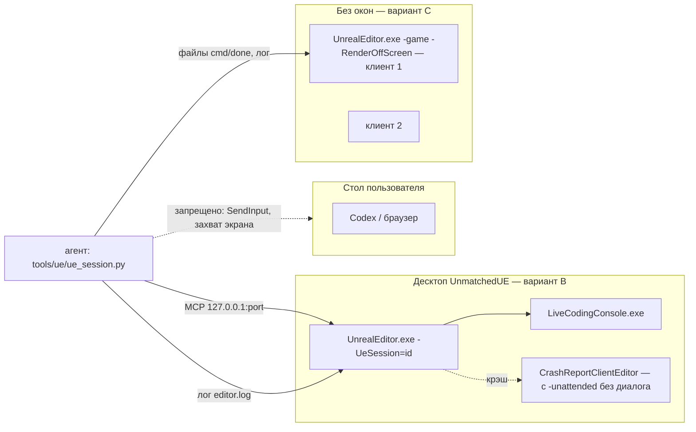
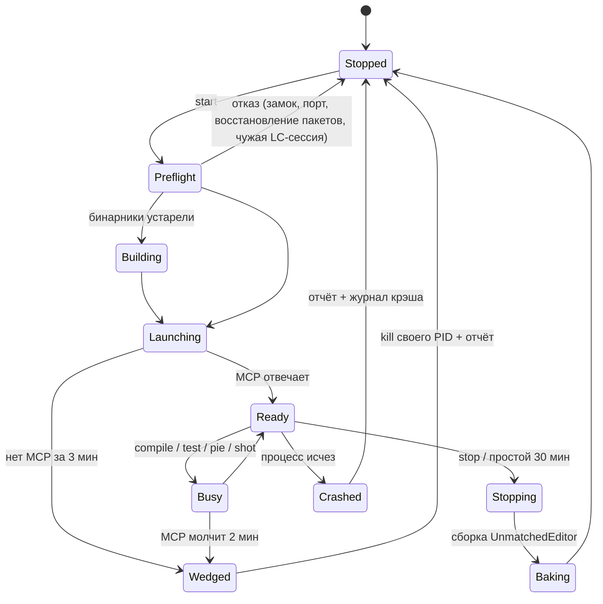

# Сессия Unreal Editor на втором рабочем столе и Live Coding — дизайн

| | |
|---|---|
| Статус | проект от 2026-10-04: только дизайн, кода нет |
| Реализация | только после «да» пользователя: 04.10 он остановил всю работу с Unreal (AGENTS.md, «Known gap») |
| Связано | AGENTS.md: «Iteration speed», «Agent and process lifecycle», «Unreal GPU load»; `docs/unreal/09-testing-qa-and-devloop.md` §10; `tools/art/render/LIVE-TUNE.md` |

Запрос пользователя (2026-10-04): «нужно параллельно проработать вообще принцип запуска Unreal Engine и лайфкодинга.
редактирование прям в окне вот этого игрового движка ... на втором рабочем столе Windows потому что я могу параллельно
работать например в кодексе или в браузере на другом рабочем столе». И ещё: «я не собираюсь вмешиваться в работу
редактора».

Метки достоверности:

- **[UE]** — проверено по исходникам установленного UE 5.8, указаны файл и строки. `$UE` = `C:\Program Files\Epic Games\UE_5.8\Engine`.
- **[WIN]** — документированное поведение Windows, ссылки в §15.
- **[ГИП]** — гипотеза. Её проверяет спайк из §11. Пока гипотеза не проверена, правила на ней не строятся.

## 0. Итог в пяти пунктах

1. **Виртуальный стол Windows не гарантирует, что редактор не помешает пользователю.**
   - После каждого успешного патча сервер Live Coding сам вызывает `SetForegroundWindow` для окон редактора (F4).
   - Если окно становится активным, Windows переключает стол на тот, где оно лежит (F5).
   - Консоль Live Coding показывается при каждой компиляции (F3).
   - Новые окна появляются на столе пользователя (F15).
2. **Рекомендация.**
   - Редактор запускать на отдельном Win32-десктопе (`CreateDesktop`). Там изоляцию обеспечивает сама ОС.
   - Клиенты `-game` запускать вообще без окон (`-RenderOffScreen`).
   - Виртуальный стол брать, только если пользователю нужно заглядывать в редактор (вопрос В1) и спайк S1 прошёл без помех.
3. **Сессия редактора — общий ресурс машины.** Пока хоть один `UnrealEditor.exe` этого движка держит Live Coding, UBT не собирает `UnmatchedEditor` ни в одном чекауте (F9). Поэтому сессии нужен замок, общий для всей машины.
4. **Патчи Live Coding живут только в запущенном процессе (F12).**
   - Тесты во время итераций гонять внутри редактора.
   - Проверка перед коммитом: остановить сессию, собрать редактор, прогнать `tools/s08/run-ue-tests.cjs`.
5. **Снимки делать только средствами движка.** Захват экрана ОС не использовать никогда.

## 1. Цель и критерии

Цель: агент правит C++ и ассеты в работающем редакторе и применяет правки через Live Coding. Он гоняет тесты и снимает
кадры без упаковки. Пользователь в это время спокойно работает на своём столе.

| № | Требование | Как проверяется |
|---|---|---|
| R1 | Окна процессов сессии не крадут фокус: ни одно не становится активным (foreground) | журнал `EVENT_SYSTEM_FOREGROUND` (§11, S1): 0 событий от PID сессии |
| R2 | Рабочий стол не переключается сам | журнал смен виртуального стола: 0 |
| R3 | На столе пользователя не появляются окна сессии: ни вспышек, ни диалогов, ни кнопок на панели задач | журнал `EVENT_OBJECT_SHOW` + проверка, на каком столе окно: 0 окон (для варианта A допуск решается в S1) |
| R4 | Агент не посылает ОС никакого ввода: `SendInput`, клики computer-use и Windows-MCP, горячие клавиши (в том числе Ctrl+Alt+F11) | ревью кода `tools/ue/*`; в правилах AGENTS.md |
| R5 | Нагрузка на GPU ограничена: правила «Unreal GPU load» действуют, в простое редактор не рендерит вьюпорты | `t.MaxFPS`, троттлинг в фоне (F7), замок GPU |
| R6 | Сессия уживается с другими сессиями, `safe-integrate.sh`, упаковкой, live tune и бенчем. Неизбежный конфликт блокирует работу явно, а не тихо | кейсы §10, группа «Сосуществование» |
| R7 | После падения агента или редактора не остаются сироты-процессы, модальные окна и несохранённые пакеты без отчёта | сторож (§4.5), кейсы §10, группа «Жизненный цикл» |
| R8 | Доказательства честные: кадры редактора, PIE и uncooked `-game` годятся только для итераций, а для приёмки нужен свежий packaged `-Bench` | правило в AGENTS.md (§12) |

Вне задачи: игровая логика, новые MCP-тулсеты, удалённый доступ, CI, RDP-сессии.

## 2. Факты, на которых стоит дизайн

**F1 [UE] В UE 5.8 Live Coding по умолчанию выключен.**
- Значения по умолчанию: `bEnabled=False`, `Startup=AutomaticButHidden`, `bEnableReinstancing=True`, `bAutomaticallyCompileNewClasses=True` (`$UE/Config/BaseEditorPerProjectUserSettings.ini:983-987`).
- В `Saved/Config` проекта такой секции нет. Значит, сейчас Live Coding у нас не стартует.

**F2 [UE] Как Live Coding стартует.**
- Флаг `-unattended` отключает автостарт (`$UE/Source/Developer/Windows/LiveCoding/Private/LiveCodingModule.cpp:501`).
- Флаг `-LiveCoding` форсирует старт в режиме Manual (`:490-505`).
- Скрытой (`-Hidden`) консоль стартует только в режиме `AutomaticButHidden` (`:1102-1108`).
- `EnableForSession(true)` не проверяет настройку `bEnabled` (`:548-563`). Поэтому первая же `LiveCoding.Compile` поднимет Live Coding, даже если он выключен.

**F3 [UE] Окно консоли показывается при каждой компиляции.**
- Цепочка вызовов: `Compile()` (`:705`) → `EnableForSession(true)` (`:561`, `:571`) → `ShowConsole()` (`:664-671`) → `LppSetVisible(true)`, `LppSetActive(true)`, `LppShowConsole()`. Это происходит даже в режиме `AutomaticButHidden`.
- Консоль — отдельный процесс `$UE/Binaries/Win64/LiveCodingConsole.exe` (LC_VERSION=1: `LiveCoding.Build.cs:8,46-51`).
- Исходника самой программы консоли в установленном движке нет. Что именно она делает со своим окном по `ShowConsole` — [ГИП], проверяет спайк S2.

**F4 [UE] После успешного патча сервер Live Coding активирует окна пропатченных процессов.**
- Он вызывает `SetForegroundWindow` для каждого видимого окна каждого пропатченного процесса: `FocusApplicationWindows` (`$UE/Source/Developer/Windows/LiveCodingServer/Private/External/LC_ServerCommandThread.cpp:647-660`), вызов в ветке SUCCESS (`:1095-1111`).
- Настройки, которая это отключает, нет.
- Отдельная настройка `receive_focus_on_recompile` (по умолчанию `ON_SHORTCUT`, `LC_AppSettings.cpp:188-195`) поднимает окно консоли при компиляции по горячей клавише. Горячую клавишу мы не используем.

**F5 [WIN] Активное окно переключает рабочий стол.**
- Когда окно становится активным (foreground), Windows переключается на виртуальный стол этого окна.
- Фоновому процессу `SetForegroundWindow` обычно запрещён. Но в части случаев он разрешён: например, когда нет активного окна или когда процесс запущен активным процессом.
- Поэтому F4 — остаточный риск для R1 и R2 в варианте A.

**F6 [UE] Модальные окна движка и `-unattended`.**
- Собственные MessageBox-диалоги движка делают себя активными и TOPMOST (`$UE/Source/Runtime/Core/Private/Windows/WindowsPlatformMisc.cpp:1736-1743`). С `-unattended` они не показываются (`Runtime/Core/Private/Misc/MessageDialog.cpp:41,62`).
- Крэш-репортер с `-unattended` работает без диалога (`WindowsPlatformCrashContext.cpp:777,977`). Без этого флага редактор разрешает ему стать активным окном (`:915`).

**F7 [UE] Редактор без фокуса не рендерит вьюпорты.**
- Это включает опция «Use Less CPU when in Background» (`bThrottleCPUWhenNotForeground`). По умолчанию она `true` (`EditorPerformanceSettings.cpp:21`) и хранится в конфиге `EditorSettings` (`EditorPerformanceSettings.h:31`). Конфиг общий для всех проектов этого движка у пользователя.
- Без фокуса все вьюпорты редактора теряют realtime (`$UE/Source/Editor/UnrealEd/Private/EditorEngine.cpp:1802-1816`), а цикл редактора троттлится (`:5325-5372`).
- Троттлинга нет, пока идут автотесты (`GIsAutomationTesting`), компилируются шейдеры или грузятся ассеты.
- `FApp::HasFocus()` значит «окно процесса активно» (`Runtime/Core/Private/Misc/App.cpp:345-366`, `WindowsPlatformApplicationMisc.cpp:41`). На втором столе редактор всегда «в фоне».

**F8 [UE] С `-RenderOffScreen` у процесса нет окон.** Флаг подменяет платформенное приложение на Null (`WindowsPlatformApplicationMisc.cpp:171-176`), и у процесса нет ни одного HWND. Так уже работают S08-клиенты (`tools/s08/run-phase2-demo.ps1:471`) и live tune (`tools/art/render/live_tune.py:212`).

**F9 [UE] Пока жив мьютекс Live Coding, UBT отказывается собирать редактор.**
- Мьютекс называется `Global\LiveCoding_<путь exe>`. Его создаёт редактор при старте Live Coding (`LiveCodingModule.cpp:1129-1150`); проверяет UBT (`$UE/Source/Programs/UnrealBuildTool/System/HotReload.cs:271-300`).
- Exe у `UnmatchedEditor` — `$(EngineDir)/Binaries/Win64/UnrealEditor.exe` (поле `Launch` в `unreal/Unmatched/Binaries/Win64/UnmatchedEditor.target`).
- Отсюда правило: пока хоть один `UnrealEditor.exe` этого движка держит сессию Live Coding, сборка `UnmatchedEditor` через Build.bat падает **во всех чекаутах** с ошибкой «Unable to build while Live Coding is active…». Неважно, какой это проект и какой чекаут: в том числе MCPProject и uncooked `-game` с Live Coding.
- Игровой таргет `Unmatched` (exe проекта) этим мьютексом не блокируется.

**F10 [UE] Редактор и uncooked `-game` одного проекта входят в одну группу Live Coding.**
- Группа процессов называется `UE_<Project>_0x<хэш каталога проекта>` (`LiveCodingModule.cpp:1200-1203`).
- Патчатся ли клиенты вместе с редактором и получает ли новый клиент уже собранные патчи — [ГИП], проверяет спайк S4.

**F11 [UE] Компиляцию через MCP лучше запускать асинхронно.**
- `LiveCodingToolset.CompileLiveCoding` ждёт результата (`WaitForCompletion`, `$UE/Plugins/Experimental/Toolsets/LiveCodingToolset/Source/LiveCodingToolset/Private/LiveCodingToolset.cpp:132`). Ожидание открывает модальное окно прогресса `FScopedSlowTask::MakeDialog` (`LiveCodingModule.cpp:726-729`).
- Асинхронный путь: консольная команда `LiveCoding.Compile` (`:430-435`) плюс чтение лога.
- Маркеры в логе:
  - `Starting Live Coding compile.` (`:1677`);
  - `Live coding succeeded`;
  - `Live coding succeeded, no code changes detected`;
  - `Live coding canceled`;
  - `Live coding failed, please see Live console for more information` (`:918-959`).
- После патча с реинстансингом в логе есть предупреждение `data type changes may cause packaging to fail if assets reference the new or updated data types` (`:938`).

**F12 [UE] Патч Live Coding не меняет DLL модуля на диске.**
- Патч собирается в отдельные файлы: UBT переименовывает выходы действий (`HotReload.cs:262-265`, `PatchActionGraphWithNames`). DLL модуля на диске остаётся старой.
- Старый код видят:
  - отдельный `UnrealEditor-Cmd` (`tools/s08/run-ue-tests.cjs`);
  - новый `-game` без Live Coding;
  - следующий запуск редактора.
- Так продолжается до полной сборки.

**F13 [UE] Командная строка переопределяет любой ini.**
- Синтаксис: `-ini:<Ini>:[Section]:Key=Value` (`Runtime/Core/Private/Misc/ConfigCacheIni.cpp:1716`, `:2322-2324`).
- Так можно поменять троттлинг только для сессии и не трогать общий `EditorSettings.ini` пользователя.
- Работает ли это для `EditorSettings` — проверяет спайк S1.

**F14 [WIN] Перенос окон между виртуальными столами возможен только через недокументированный API.**
- Публичный `IVirtualDesktopManager::MoveWindowToDesktop` переносит только окна своего процесса. Для чужих окон он возвращает `E_ACCESSDENIED`.
- Создавать столы и переносить чужие окна можно только через недокументированный `IVirtualDesktopManagerInternal`. Его GUID меняются между сборками Windows.
- Обёртка VirtualDesktopAccessor требует Windows 11 24H2 26100.2605 или новее. У пользователя 10.0.26200; совместимость проверяет S1.

**F15 [ГИП] Где появляются окна при виртуальных столах.**
- Новое верхнеуровневое окно появляется на текущем столе пользователя.
- Окно, которое спрятали и показали снова, тоже может «переехать» на текущий стол.
- Owned-окна (меню, тултипы, уведомления Slate) живут на столе своего владельца.

**F16. Что уже есть в проекте.**
- MCP редактора слушает `127.0.0.1:8123`; запуск: `-ModelContextProtocolPort=8123 "-ExecCmds=ModelContextProtocol.StartServer 8123"`. В `09 §10.1` написано 8124 — это устарело.
- У live tune файловый протокол: `cmd-<seq>.json` → `done-<seq>.json`.
- Замки:
  - `C:/tmp/ue-editor.lock` — правки в живом редакторе;
  - `C:/tmp/unmatched-gpu.lock` — бенч и live tune.
- `tools/git/safe-integrate.sh:55` отказывает, если запущен UnrealEditor, UBT или клиент main-чекаута.

## 3. Изоляция окон: три варианта

| | A. Виртуальный стол Windows | B. Отдельный Win32-десктоп | C. Без окон (`-RenderOffScreen`) |
|---|---|---|---|
| Как | Агент создаёт стол «Unmatched UE» и запускает редактор. Сторож ловит каждое новое окно редактора и его потомков (WinEvent hook на `EVENT_OBJECT_SHOW`) и переносит окно туда | Лаунчер создаёт десктоп `WinSta0\UnmatchedUE` (`CreateDesktopW`) и запускает редактор с `STARTUPINFO.lpDesktop` | У процесса нет HWND (F8) |
| Дочерние окна (консоль LC, крэш-репортер) | Рождаются на столе пользователя, сторож их переносит (F15) | Наследуют десктоп родителя [WIN] и никогда не попадают на стол пользователя | Консоль LC — отдельный процесс с настоящим окном. Нужен A или B |
| Кража фокуса, F4 | Остаточный риск: если Windows разрешит, стол переключится (F5) | Окно может стать активным только на своём десктопе. Показать пользователю другой десктоп может только `SwitchDesktop` [WIN] | Нечего активировать (кроме консоли LC) |
| Вспышки окон | Консоль на каждой компиляции, PIE в новом окне, диалоги без владельца | Нет | Нет |
| API | Недокументированный, ломается от обновлений Windows (F14); нужна сторонняя DLL, скачивание только с согласия пользователя | Документированный (`CreateDesktopW`, `CreateProcessW`, `SwitchDesktop`), ctypes без зависимостей | Флаг движка |
| Пользователь видит редактор | Win+Ctrl+→ / Task View | Только переключением `peek` (§4.6); в Task View его нет | Нет |
| Рендер GPU | Как обычно; окно скрыто (cloaked), но процесс рендерит | [ГИП] Рендер идёт, `Present` возвращает OCCLUDED. Аналогия: заблокированный экран, при котором UE продолжает рендерить. Проверяет S1 | Проверено практикой для `-game`. Для редактора [ГИП] |
| Захват экрана ОС | Невозможен (окно скрыто) и не нужен (§9) | Невозможен и не нужен | Невозможен и не нужен |

**Рекомендация.**

- **Редактор — вариант B, клиенты `-game` — вариант C.**
- **Вариант A** — только если пользователь хочет смотреть на редактор через Win+Ctrl+→ (вопрос В1) и спайк S1 показал 0 нарушений R1–R3.
- **Почему так.** Вариант A может только снизить вероятность помех: F3, F4 и F15 он не устраняет. Вариант B исключает их устройством ОС, без недокументированных API и без сторонних бинарников.
- **Если S1 провалит B** (нет рендера на неактивном десктопе): переходить к A со сторожем. Если A тоже нарушает R1–R3, остаётся один выход: сессия редактора только тогда, когда пользователь не работает за машиной. Это решает пользователь.



## 4. Жизненный цикл редактора



### 4.1. Состояние и замок

- Замок `C:/tmp/ue-session.lock` — один на машину (F9).
  - Создаётся атомарно (`O_CREAT|O_EXCL`), как в `tools/art/material_library/ue_lock.py`.
  - Содержимое: `owner`, `checkout`, `branch`, `pid`, `mcpPort`, `lc` (`off`/`on`), `since`.
- Замок считается брошенным, если процесса с этим PID нет или в его командной строке нет `-UeSession=<id>`.
- Каталог сессии `C:/tmp/ue-session/<id>/`: `state.json`, `editor.log`, `shots/`, `focus.log` (журнал сторожа фокуса).
- `C:/tmp/ue-editor.lock` остаётся замком на правки в живом редакторе (память, ловушка 12): один агент — одна операция.

### 4.2. Предстартовые проверки (при любом сбое — отказ)

1. Замок свободен.
2. Нет другого `UnrealEditor` или `UnrealEditor-Cmd` на этом `.uproject`. Проверка по `CommandLine`, как в `safe-integrate.sh:55`. Чужие редакторы (пользователя, MCPProject) не трогать, но предупредить: их Live Coding тоже блокирует сборку (F9).
3. Порт MCP свободен: 8123, иначе первый свободный из 8124–8133. Выбранный порт записать в замок.
4. Нет файла `Saved/Autosaves/PackageRestoreData.json` (память, ловушка 13). Если он есть и диск совпадает с HEAD — перенести его в `C:/tmp/ue-restore-backup/<ts>/`. Если не совпадает — стоп и отчёт.
5. Бинарники актуальны. Инкрементальная сборка `UnmatchedEditor` через `tools/s08/build-editor.cjs`:
   - по замерам 10–40 с (память «Оценки по логам»);
   - успех определять не по коду выхода, а по отсутствию `Result: Failed` в логе (ловушка 1);
   - после правок заголовков ставить `-MaxParallelActions=2` (PCH OOM).
   Собрать можно, только пока ни один редактор этого движка не держит Live Coding (F9).

### 4.3. Команда запуска (вариант B)

```
UnrealEditor.exe <abs>\unreal\Unmatched\Unmatched.uproject
  -UeSession=<id>                     # маркер своего PID; UE игнорирует неизвестные флаги
  -nosplash -unattended -log -abslog=C:\tmp\ue-session\<id>\editor.log
  -LiveCoding                         # нужен, потому что -unattended гасит автостарт (F2); без него — «ленивый» старт при первой компиляции
  -ModelContextProtocolPort=<port> "-ExecCmds=ModelContextProtocol.StartServer <port>"
  -S08Fixtures=<…> -S09Fixtures=<…>   # тесты в сессии читают те же флаги, что run-ue-tests.cjs (§7)
```

- **Чем запускать.** Только Python или PowerShell. Из Git Bash нельзя: MSYS переписывает пути (память, ловушка 2026-10-03).
- **Флаги процесса.** Наши консольные помощники запускать с `CREATE_NO_WINDOW`; редактор — GUI-приложение, консоли у него нет. Для варианта B: `lpDesktop = "WinSta0\\UnmatchedUE"`.
- **Вариант A.** Дополнительно `STARTF_USESHOWWINDOW` + `SW_SHOWMINNOACTIVE` для первого `ShowWindow` [ГИП].
  - Родитель редактора не должен быть потомком активного окна, иначе редактор может унаследовать право стать активным (F5). `DETACHED_PROCESS` родителя не меняет. Запускать через задачу планировщика (`schtasks /run`) или другой процесс вне этой цепочки [ГИП].
- **Режим Live Coding: `on` или `lazy`.**
  - `on` (`-LiveCoding`) — Live Coding работает с первой секунды, мьютекс F9 тоже живёт с первой секунды.
  - `lazy` (флага нет) — мьютекс появится только при первой `LiveCoding.Compile` (F2). Подходит сессиям, где правят только ассеты и гоняют тесты.
  - Выбранный режим записывается в замок.
- **Флаг `-unattended` нужен обязательно** (F6): без него модальные диалоги и крэш-репортер могут стать активными. Цена: Live Coding не стартует сам, поэтому `-LiveCoding` выше.
  - Как ведёт себя редактор с `-unattended` (UI, сохранение, вопросы при выходе) — проверяют спайки S1 и S6.

### 4.4. Готовность и работа

- **Готов**, когда на порт MCP отвечают `initialize` и `tools/list`.
  - Первый старт с прогревом DDC и шейдеров ждать до 3 минут.
  - В обычном случае порт открывается за 10–40 с (память unreal-mcp-setup; `09 §10.1`).
- **Один вызов MCP за раз.** Вызовы выполняются последовательно на игровом потоке (`09 §10.3`, п. 2).
- **Компиляцию не запускать** во время PIE, автотестов и сохранения ассетов.
- **Как выполнять консольные команды** (`LiveCoding.Compile`, `HighResShot`, `t.MaxFPS`). Канал выбирает спайк S1:
  - (а) Python-песочница MCP `ProgrammaticToolset.execute_tool_script`. Нужно проверить, пускает ли она `unreal.SystemLibrary.execute_console_command`.
  - (б) Remote execution PythonScriptPlugin. Плагин в проекте включён, но remote execution выключен; включается настройкой `-ini:`. Привязка к 127.0.0.1.
  - (в) Свой файловый канал `cmd/done` в редакторе, по образцу live tune. Нужен C++ editor-модуль, поэтому это крайний вариант.
- **GPU в простое.**
  - Редактор в фоне сам перестаёт рендерить вьюпорты (F7) — это и есть желаемый режим.
  - Для снимков троттлинг временно выключается (§9).
  - Кроме того, при старте ставится `t.MaxFPS 30`.

### 4.5. Остановка, сторож, падения

**Остановка `stop`:**

1. Через MCP получить список несохранённых пакетов.
2. Сохранить явным списком то, что меняла задача. Остальное перечислить в отчёте и не сохранять.
   - Сама `stop` ничего не сохраняет.
   - На вопрос «Save changes?» при `-unattended` редактор отвечает сам, ответ по умолчанию. Какой это ответ — выясняет S6.
3. Мягкий выход: команда `QUIT_EDITOR`, ожидание до 60 с.
4. Если редактор не вышел — убить только свой PID. Перед этим проверить, что в его командной строке есть `-UeSession=<id>`. Дочерний `LiveCodingConsole.exe` убивать только после проверки, что его родитель — этот PID (AGENTS.md, «Agent and process lifecycle»).
5. **Baking.** Собрать `UnmatchedEditor` (мьютекс F9 к этому моменту уже снят), чтобы DLL на диске совпала с кодом (F12). `--no-bake` допустим, только если C++ не меняли.
6. Снять замок. Win32-десктоп исчезает сам, когда закрыт последний дескриптор.

**Сторож** — маленький процесс лаунчера без окна:

- **Простой.** Нет команд через `ue_session.py` дольше 30 минут → мягкая остановка (как `-ArtLiveTuneIdleExit`).
- **Процесс исчез** → состояние `Crashed`. Собрать последний `Saved/Crashes/*` и хвост лога, снять замок, сообщить агенту.
- **Процесс жив, но MCP молчит 2 минуты** → состояние `Wedged`. Убить свой PID по правилам выше, отчёт.
- **Журнал фокуса `focus.log`** нужен для спайков, а в варианте A — постоянно.
  - Сторож записывает каждое событие `EVENT_SYSTEM_FOREGROUND` и `EVENT_OBJECT_SHOW` окон процессов сессии.
  - В варианте A при любом нарушении R1–R3 сессия ставит новые компиляции и PIE на паузу и сообщает о нарушении.

### 4.6. Как пользователь смотрит на редактор (вариант B)

- Команда `ue_session.py peek` выполняется только по прямой просьбе пользователя. Она вызывает `SwitchDesktop` на `UnmatchedUE` и регистрирует горячую клавишу возврата. Хук работает в потоке, привязанном к тому десктопу (`SetThreadDesktop`).
- Пока пользователь смотрит, фокус у него. Агент не шлёт команды, которые меняют UI (PIE, открытие редакторов ассетов), до возврата пользователя на свой стол.
- Альтернатива [ГИП]: назвать десктоп так, как называет свои десктопы Sysinternals Desktops. Тогда пользователь переключится его горячими клавишами. Это хрупко, по умолчанию не делаем.

## 5. Live Coding в UE 5.8: что можно и что нельзя

| Правка | Путь | Примечание |
|---|---|---|
| Тело функции в `.cpp`; новые не-UObject функции и классы внутри `.cpp` | `LiveCoding.Compile` | основной сценарий |
| Тело inline-функции в `.h` | `LiveCoding.Compile` | пересобираются все TU, которые включают этот заголовок. Долго, но должно работать [ГИП, S2] |
| Новые или изменённые `UPROPERTY`, `UFUNCTION`, `USTRUCT`, `UCLASS`, `UENUM` | `LiveCoding.Compile` с реинстансингом (включён по умолчанию, F1) | в логе будет предупреждение (F11). Ассеты, которые ссылаются на новые типы, не сохранять до полной сборки и перезапуска. Перед упаковкой обязательна полная сборка |
| Конструкторы, значения CDO по умолчанию, статические инициализаторы | стоп → сборка → старт | патч не пересоздаёт существующие объекты [ГИП, S2] |
| Новые `virtual`, изменение раскладки не-UObject типов | стоп → сборка → старт | патч ломает таблицы виртуальных функций и раскладку |
| Новый `.cpp` или `.h` файл | по умолчанию стоп → сборка → старт | `bAutomaticallyCompileNewClasses` рассчитан на мастер «New C++ Class». Подхватит ли Live Coding файл, добавленный вручную, — [ГИП, S2] |
| `*.Build.cs`, `.uproject`, `.Target.cs`, новые модули и плагины; новый `Config/**.json` для pak | стоп → сборка → старт | уровень UBT. Ловушка упаковки — AGENTS.md, «Packaging trap» |
| Новые автотесты (`IMPLEMENT_*`, spec) | `LiveCoding.Compile` + `DiscoverTests(bForceRediscover=true)` | `09 §10.5`. Регистрируются ли статически новые тесты из патча — [ГИП, S3] |
| Ассеты, BP, UMG, ini через MCP | без компиляции | `save_assets` с явным списком (`09 §10.3`) |

Правила компиляции:

1. **Запуск.** Компилировать только командой `LiveCoding.Compile` (асинхронно) и опрашивать лог по маркерам F11.
   - `LiveCodingToolset.CompileLiveCoding` использовать, только если S2 покажет, что его модальное окно прогресса (F11) не нарушает R1–R3.
   - Это меняет рекомендацию `09 §10.2`.
2. **Текст ошибок** брать из UBT-лога, как это делает тулсет (`LiveCodingToolset.cpp:124,158-170`).
3. **Без горячей клавиши.** Ctrl+Alt+F11 никогда не нажимать (R4).
4. **Когда перезапускать.** Патчи копятся в памяти. После каждой странности после реинстансинга, а также после N патчей — путь «стоп → сборка → старт». Порог N меряет S2: память процесса до и после патчей.
5. **Цена пути «стоп → сборка → старт».** Стоп до 1 мин, инкрементальная сборка 10–40 с, старт 10–40 с. Точную цифру даёт S6.

## 6. Сосуществование с другими сессиями

- **Ресурс всей машины.** Сессия с Live Coding блокирует сборку редактора во всех чекаутах (F9).
  - Блокируется пересборка `UnmatchedEditor` после `safe-integrate.sh --apply` в main-чекауте.
  - Блокируются сборки в ворктри, а значит и `run-ue-tests.cjs` на свежей DLL.
  - Упаковка игрового таргета (`package-client.ps1`) не блокируется.
- **Чужую сессию не трогать.** Сессия, которой нужна сборка редактора, ждёт или пишет владельцу (замок §4.1). Чужую сессию она не останавливает и не убивает.
- **Где запускать.** Сессия идёт в чекауте своей задачи, лучше в ворктри.
  - Сессия в main-чекауте блокирует `safe-integrate.sh` для изменений в `unreal/` (проверка `:55`). Перед интеграцией её надо остановить.
- **Git-операции.** В чекауте с запущенным редактором нельзя делать `checkout`, `merge`, `rebase` и `stash`: редактор держит пакеты и DLL. Мерж базовой ветки в ворктри — только после `stop`.
- **Бенч и live tune.**
  - Клиенты `-game`, запущенные сессией, берут `C:/tmp/unmatched-gpu.lock` так же, как live tune.
  - Перед `render_bench.py` или приёмочным `-Bench` сессия должна стоять в фоне (троттлинг, F7) или быть остановлена: замеры делают на тихой машине (AGENTS.md).
- **Одна сессия на машину.** Две сессии редактора одновременно (main и ворктри) запрещены. Причины: GPU, память (PCH OOM при параллельных сборках) и правило F9, которое и так сводит всё к одной.

## 7. Тесты в запущенном редакторе

- **Путь.** Тулсет `AutomationTestToolset` (`$UE/Plugins/Experimental/Toolsets/AutomationTestToolset/Source/AutomationTestToolset/Public/AutomationTestToolset.h:39-86`):
  `DiscoverTests` → `RunTestsByFilter` → `GetTestStatus` (опрос не чаще раза в 500 мс) → `GetTestResults`.
  Запасной путь — консольная `Automation RunTests <filter>`. Никогда не добавлять `; Quit`.
- **Почему внутри редактора.** После патча новый код есть только в процессе редактора (F12). `run-ue-tests.cjs` проверил бы старую DLL, а пересобрать её не дала бы F9.
- **Троттлинг.** На время автотестов он выключается сам (F7, `GIsAutomationTesting`).
- **Влияние на редактор.** Тесты идут на игровом потоке редактора и могут грузить карты, создавать миры и менять выделение.
  - Перед прогоном: нет PIE, несохранённые пакеты задачи сохранены.
  - Тесты, которые открывают карты, гонять через `run-ue-tests.cjs` после `stop`. Их список собрать при реализации: поиск `AutomationOpenMap` и `LoadMap` в `unreal/Unmatched/Source/**/Tests`.
- **Флаги фикстур.** S08- и S09-тесты читают `-S08Fixtures` и `-S09Fixtures` из командной строки, поэтому сессию запускают с ними (§4.3).
- **Проверка перед коммитом:**
  1. `stop` с baking;
  2. `run-ue-tests.cjs <filter>` в свежем процессе на DLL с диска.
  Результаты внутри редактора считаются только для итераций. Это совпадает с `09 §10.5`: «полная сборка хотя бы один раз».

## 8. PIE против uncooked `-game` (без упаковки)

| | PIE во вьюпорте | uncooked `-game` (`UnrealEditor.exe <uproject> -game`) | packaged |
|---|---|---|---|
| Процесс | тот же, что у редактора | отдельный на каждого клиента | отдельный |
| Патчи Live Coding | сразу | DLL с диска (F12). Без `-LiveCoding` клиент в группу не входит. Патчит ли группа клиента — [ГИП, S4] | нет |
| Флаги и аккаунты | командная строка редактора, одна на все PIE-экземпляры | своя командная строка у каждого клиента: хост и джойнер, свои флаги S08 | своя |
| Два клиента S08 | не годится: общие статики и `FCommandLine`, один набор аккаунтов | годится. `run-phase2-demo.ps1` сейчас берёт packaged exe (`:207`); для uncooked нужен режим «exe = UnrealEditor.exe + `<uproject> -game`» | годится |
| Окна | PIE «In Viewport» — нового HWND нет. «New Editor Window» и «Standalone» запрещены: это новое верхнее окно | `-RenderOffScreen -ForceRes -ResX=1920 -ResY=1080` — окон нет (F8, ловушка `-ForceRes`) | так же |
| GPU | рендерит ли PIE, пока редактор в фоне, — [ГИП, S5] | `-ExecCmds="t.MaxFPS 30"`, замок GPU | 60/30 по AGENTS.md |
| Мьютекс F9 | есть (редактор) | нет, если `-unattended` без `-LiveCoding` (F2) | нет |
| Доказательства | только итерации | только итерации (live tune меряет точность против `-Bench`) | приёмка |

Рекомендация:

- **PIE во вьюпорте** — быстрые проверки одного клиента на пропатченном коде.
- **Uncooked `-game`** — потоки с двумя клиентами и бэкендом. Запускать после baking или если S4 подтвердит патчинг группы.
- **Packaged** — один раз на задачу, для приёмки (AGENTS.md, «One package per change»).

## 9. Снимки, когда стол не виден

- **Захват экрана ОС запрещён:** BitBlt, PrintWindow, Windows.Graphics.Capture, скриншоты computer-use и Windows-MCP. Причины:
  - на неактивном виртуальном столе окно скрыто (cloaked), DWM его не компонует;
  - на Win32-десктопе B компоновки нет вовсе;
  - захват рабочего стола снял бы экран пользователя (приватность, R3);
  - WGC рисует рамку захвата, а такие рамки пользователю мешают (память).
- **Игра, `-game` и PIE.** Снимать средствами движка: `HighResShot filename="<name>" 1920x1080` через `GameViewport->Exec` (ловушка 4) или проектный `TakeEvidenceShot` (S08, live tune). Кадр рендерится в свою цель и не зависит от видимости окна. С `-RenderOffScreen` нужен `-ForceRes`.
- **Вьюпорт редактора.** Снимать захватом вьюпорта через `EditorAppToolset` (`09 §10.2`) или `HighResShot` во вьюпорте. Из-за F7 в фоне вьюпорт не realtime, поэтому на время снимка:
  - либо выключить `bThrottleCPUWhenNotForeground` через MCP (`ObjectTools.set_properties` на CDO `EditorPerformanceSettings`) и после снимка вернуть;
  - либо для сессий с частыми снимками стартовать с `-ini:EditorSettings:[/Script/UnrealEd.EditorPerformanceSettings]:bThrottleCPUWhenNotForeground=False` (F13) и `t.MaxFPS 30`.
  Какой способ работает — [ГИП, S5].
- **UI редактора (Slate).** `SlateInspectorToolset` и захват с `bShowUI`. Рисует ли Slate в back buffer на неактивном десктопе, когда `Present` возвращает OCCLUDED, — [ГИП, S5].
- **Куда класть.**
  - Снимки итераций — в `C:/tmp/ue-session/<id>/shots/`.
  - Кадры-доказательства несут отпечаток `RENDER`. Кадры редактора и PIE доказательствами не считаются (R8).
  - Перед отчётом агент сам открывает PNG (AGENTS.md, «Look before you report»).

## 10. Кейсы

**Запуск и размещение**

| Кейс | Что происходит | Решение |
|---|---|---|
| Пользователь сам на втором столе (A) или смотрит через `peek` (B) | окна появляются там, где он | вариант A: сторож всё равно закрепляет окна; вариант B: агент ждёт его возврата (§4.6) |
| Стол «Unmatched UE» не существует | — | A: создать через недокументированный API, без переключения. B: `CreateDesktopW` |
| Пользователь удалил стол A, пока работает редактор | Windows переносит окна на соседний стол, то есть к пользователю [ГИП] | сторож пересоздаёт стол и переносит окна; это нарушение R3, пишется в `focus.log`. В B удалить десктоп из UI нельзя |
| Перезапуск `explorer.exe` или обновление Windows сменило GUID (A) | недокументированный COM отказывает (F14) | закрытый отказ: новые компиляции и PIE на паузе, отчёт. Окна на стол пользователя не выпускать |
| Лаунчер — потомок активного окна (приложение Claude) | редактор может унаследовать право стать активным (F5) | B: не важно. A: запуск через задачу планировщика вне цепочки активного окна, плюс `SW_SHOWMINNOACTIVE` [ГИП] |
| Заставка (splash) | лишнее окно | `-nosplash` |
| Модальное окно «Restore Packages» после kill (ловушка 13) | редактор висит на кадре 0, MCP не открывается | предстартовая проверка §4.2, п. 4 |
| Устаревшая DLL модуля при старте | диалог «пересобрать?»; при `-unattended` ответ по умолчанию, и редактор выходит | предстартовая сборка §4.2, п. 5; сам редактор никогда ничего не собирает |
| Порт 8123 занят (MCPProject, второй редактор) | `HttpListener unable to bind` (память) | поиск свободного порта 8124–8133, запись в замок |
| Запуск из Git Bash | MSYS переписывает `/Game/...`, модальное окно «map not found» появляется на экране пользователя | только Python или PowerShell |

**Окна во время работы**

| Кейс | Что происходит | Решение |
|---|---|---|
| Консоль Live Coding при каждой компиляции (F3) | A: окно может мелькнуть у пользователя (F15) | B: невидимо. A: сторож переносит окно; длительность вспышки меряет S1 |
| `SetForegroundWindow` после патча (F4) | A: Windows может переключить стол (F5) | B: не может. A: остаточный риск, `focus.log`, правило «при нарушении — пауза» |
| MessageBox движка | активное окно, TOPMOST (F6) | `-unattended` |
| Крэш | крэш-репортер становится активным окном (F6) | `-unattended`; журнал крэша собирает сторож |
| Уведомления, меню, тултипы Slate | owned-окна [ГИП F15] | B: не важно. A: проверить в S1 |
| PIE «New Editor Window» или «Standalone» | новое верхнее окно | запрещено; только «In Viewport» или uncooked `-game` с `-RenderOffScreen` |
| `DrawAttention` → `FlashWindowEx` с флагами `FLASHW_TRAY` и `FLASHW_TIMERNOFG` (`WindowsWindow.cpp:1175-1190`) | A: может мигать индикатор в Task View или на панели задач [ГИП] | B: не видно. A: S1 |
| Модальное окно прогресса `CompileLiveCoding` (F11) | новое модальное окно | асинхронная `LiveCoding.Compile` |
| Пользователь кликнул в редактор во время `peek` | фокус у редактора, троттлинг выключен, ввод пользователя смешивается с вызовами MCP | пользователь в приоритете: агент ставит изменения UI на паузу до возврата (§4.6) |

**Live Coding и сборка**

| Кейс | Что происходит | Решение |
|---|---|---|
| Сборка редактора при живой LC-сессии в любом чекауте | `Unable to build while Live Coding is active…` (F9) | замок §4.1: ждать или писать владельцу. Не убивать |
| Пересборка в main после `safe-integrate.sh --apply` | то же | выполняется после `stop` сессии |
| Тесты в Cmd после патчей | проверяется старый код (F12) | тесты внутри редактора (§7); гейт — после baking |
| Упаковка во время сессии | игровой таргет не блокируется | можно, но пакет собирается из исходников. Работает и без baking, но для доказательств нужен чистый коммит |
| Патч с реинстансингом | предупреждение о packaging (F11) | ассеты с новыми типами не сохранять до полного цикла |
| Неудачная компиляция | `Live coding failed…` | текст ошибки из UBT-лога, правка, повтор. Редактор не перезапускать без причины |
| Компиляция во время PIE или тестов | гонки на игровом потоке | запрещено (§4.4) |
| Много патчей подряд | растёт память, копятся патчи [ГИП] | порог N из S2, затем полный цикл |
| Новый `.cpp` или правка `Build.cs` | Live Coding не применит [ГИП / уровень UBT] | полный цикл |

**Жизненный цикл и сосуществование**

| Кейс | Что происходит | Решение |
|---|---|---|
| Агент упал или сессия чата закрылась | редактор остался сиротой | сторож: простой 30 мин → мягкий стоп |
| Редактор завис (MCP молчит) | — | `Wedged` → убить свой PID после проверки командной строки |
| Несохранённые пакеты при остановке | при `-unattended` ответ по умолчанию [ГИП, S6] | `stop` сначала сохраняет явным списком и перечисляет остальные |
| `stop` в main-чекауте перед интеграцией | — | обязателен для изменений в `unreal/` (`safe-integrate.sh:55`) |
| Git-операции в чекауте сессии | конфликты пакетов и DLL | запрещено до `stop` |
| Live tune или бенч во время сессии | борьба за GPU | замок GPU; редактор в фоне троттлится; клиенты сессии берут замок |
| Блокировка экрана или сон | при блокировке рендер идёт [ГИП]; во сне процессы стоят | после пробуждения сторож проверяет MCP; если MCP молчит → `Wedged` |
| Пользовательский редактор или MCPProject открыт | порт и F9 | предупреждение в `doctor`; чужой редактор не трогать |

**Тесты и снимки**

| Кейс | Что происходит | Решение |
|---|---|---|
| Тест открывает карту в редакторе | заменяет уровень редактора | такие тесты гонять через Cmd после `stop` |
| Тесты без флагов фикстур | падают или SKIP | флаги в команде запуска (§4.3) |
| Снимок вьюпорта, пока редактор в фоне | вьюпорт не realtime (F7) | выключить троттлинг на время снимка (§9) |
| Нужен кадр «как у пользователя» | — | только средствами движка; захват экрана ОС запрещён |

## 11. Спайки: порядок и критерии

Спайки запускать только после «да» пользователя (Unreal на паузе с 04.10) и на тихой машине. S1 проверяет помехи на
столе пользователя, поэтому его время согласуется с пользователем. Для B риск минимален. Во всех спайках пишет
журнал `focus.log` (§4.5).

| Спайк | Что проверить | Критерий прохода |
|---|---|---|
| S1 изоляция | B: старт редактора на `UnmatchedUE`; MCP; `HighResShot` вьюпорта и игры; переход D3D12 в OCCLUDED. Затем A (если В1 = «да»): создание стола, сторож, длительность вспышек. Применяются ли `-ini:` к `EditorSettings` и `EditorPerProjectUserSettings`. Канал консольных команд (§4.4). Работает ли UI редактора с `-unattended` | R1 = R2 = 0; R3 = 0 для B (для A записать мс и число окон); кадр не чёрный и совпадает с видимым прогоном той же сцены; D3D-устройство не теряется 30 мин |
| S2 Live Coding | матрица §5; окно консоли; события фокуса после патча (F4); время компиляции; память после 1/10/30 патчей; `LiveCoding.Compile` против `CompileLiveCoding` | каждая строка §5 подтверждена или исправлена; нет нарушений R1–R3 в B; порог N |
| S3 тесты | `Unmatched.S08` (подмножество) внутри редактора против `run-ue-tests.cjs`; новый тест через Live Coding | те же результаты; ясно, регистрируются ли новые тесты из патча |
| S4 `-game` и группа LC | клиент с `-LiveCoding -RenderOffScreen` получает патч? Новый клиент после патча? Без флага — старый код (F12) | ответ да/нет по каждому пункту, лог-доказательство |
| S5 снимки | вьюпорт с троттлингом и без; PIE в фоне; `HighResShot` `-game` на B; захват Slate UI | для каждого способа: кадр есть / нет, чёрный / нормальный |
| S6 жизненный цикл | `stop` с несохранёнными пакетами при `-unattended`; kill → restore json; выход по простою; воспроизвести F9 со сборкой в ворктри; запасной порт; время полного цикла | все переходы §4 отработаны; цифры записаны |

Итоги спайков записываются в этот документ: метки [ГИП] заменяются на [ПРОВЕРЕНО <дата>] или на исправленный факт.
Кадры и журналы — в `docs/game-design/evidence/UE-SESSION/<дата>/`.

## 12. Правила для AGENTS.md (черновик, ещё не действуют)

Принять после спайков и «да» пользователя. Текст по-английски, в стиле AGENTS.md:

```markdown
## Unreal editor session (own desktop, Live Coding)

User request 2026-10-04: «редактирование прям в окне вот этого игрового движка ... на втором рабочем столе Windows»;
«я не собираюсь вмешиваться в работу редактора». Design: `docs/unreal/UE-SESSION-DESIGN.md`.

- One editor session per machine. Start and stop it only with `tools/ue/ue_session.py`. The lock
  `C:/tmp/ue-session.lock` names the owner, checkout, PID and MCP port. Never kill an editor you did not start:
  check `-UeSession=<id>` in its command line first.
- The editor runs on its own desktop (`UnmatchedUE`); `-game` clients run with `-RenderOffScreen -ForceRes`.
  Never send OS input to it (clicks, keys, Ctrl+Alt+F11) and never use screen capture; drive it through MCP
  and console commands only. Take frames with engine commands (`HighResShot`, evidence shots).
- Live Coding: compile with `LiveCoding.Compile` and read the result from the log. Function bodies go through
  Live Coding. Build.cs, .uproject, new modules, new source files, constructor or default-value changes and new
  virtuals go through stop → build → start.
- While a Live Coding session is up, no checkout can build UnmatchedEditor (UBT refuses). Packaging the game
  target still works. Do not stop another session's editor to build; wait or message its owner.
- Live Coding patches exist only in the running process. Before a commit, a package or a hand-over: `stop`
  (it builds UnmatchedEditor), then run the affected tests with `tools/s08/run-ue-tests.cjs`.
- No git checkout, merge, rebase or stash in a checkout whose editor is running; integrate with
  `safe-integrate.sh` only after `stop`.
- Frames from the editor, PIE and uncooked `-game` are for iteration only; acceptance frames still come from a
  fresh packaged `-Bench`.
- An idle session stops itself after 30 minutes. `stop` saves nothing by itself: save the assets the task
  changed first.
```

Вместе с этим поправить `docs/unreal/09-testing-qa-and-devloop.md` §10:

- порт 8123 вместо 8124;
- `LiveCoding.Compile` вместо `CompileLiveCoding` (F11);
- в §10.5 ответ на «требует живой проверки»: Build.bat при живом Live Coding блокируется, причём во всех чекаутах (F9).

## 13. Эскиз реализации (после спайков)

- `tools/ue/ue_session.py` — Python, как `live_tune.py`; все процессы с `CREATE_NO_WINDOW`. Команды:
  - `start [--lc on|lazy|off] [--port] [--isolation desktop|vdesk] [--capture-mode]`;
  - `status`;
  - `exec "<console cmd>"`;
  - `compile` — асинхронная Live Coding плюс опрос лога; возвращает результат и ошибки;
  - `test <filter>`;
  - `pie start|stop`;
  - `shot editor|pie --out <dir>`;
  - `clients start|stop` — uncooked `-game`;
  - `stop [--no-bake]`;
  - `bake`;
  - `peek`;
  - `doctor`;
  - `--check` — самопроверка без UE, как у live tune.
- `tools/ue/desktop_isolation.py`:
  - B — ctypes: `CreateDesktopW`, `CreateProcessW` с `lpDesktop`, `SwitchDesktop` для `peek`;
  - A — VirtualDesktopAccessor с закреплённой версией и sha256, плюс сторож WinEvent. Скачивание DLL — только с согласия пользователя.
- `tools/ue/focus_guard.py` — журнал фокуса и показов окон: для спайков, а в варианте A ещё и защита.
- Тесты: `--check`, юнит-тесты машины состояний, замка и проверки командной строки.
- Документация: `tools/ue/UE-SESSION.md` (как пользоваться), правки AGENTS.md и `09 §10` (§12).

## 14. Вопросы к пользователю

- **В1.** Нужно ли вам самому смотреть на редактор, пока работают агенты?
  - Нет или только по просьбе → вариант B и команда `peek`. Это рекомендация.
  - Да, через Win+Ctrl+→ → вариант A с остаточным риском F3–F5.
- **В2.** Разрешаете спайки S1–S6? Unreal на паузе с 04.10. Если да, то когда: S1 проверяет помехи на вашем столе.
- **В3.** Только для варианта A: можно скачать VirtualDesktopAccessor? Это сторонняя DLL; версия и хэш будут закреплены.

## 15. Источники

- Исходники UE 5.8: пути и строки указаны в §2.
- [IVirtualDesktopManager::MoveWindowToDesktop](https://learn.microsoft.com/en-us/windows/win32/api/shobjidl_core/nf-shobjidl_core-ivirtualdesktopmanager-movewindowtodesktop); почему переносятся только окна своего процесса — [The Old New Thing, 2020-11-23](https://devblogs.microsoft.com/oldnewthing/?p=104476).
- Активное окно переключает виртуальный стол: [The Old New Thing, 2017-10-02](https://devblogs.microsoft.com/oldnewthing/20171002-00/?p=97116), [meziantou: per-virtual-desktop single instance](https://www.meziantou.net/per-virtual-desktop-single-instance-application.htm).
- Условия `SetForegroundWindow`: [SetForegroundWindow](https://learn.microsoft.com/en-us/windows/win32/api/winuser/nf-winuser-setforegroundwindow).
- Win32-десктопы: [CreateDesktopW](https://learn.microsoft.com/en-us/windows/win32/api/winuser/nf-winuser-createdesktopw), [STARTUPINFO.lpDesktop](https://learn.microsoft.com/en-us/windows/win32/api/processthreadsapi/ns-processthreadsapi-startupinfow), [SwitchDesktop](https://learn.microsoft.com/en-us/windows/win32/api/winuser/nf-winuser-switchdesktop).
- VirtualDesktopAccessor (winvd), требование 26100.2605+: [docs.rs/winvd](https://docs.rs/crate/winvd/latest).

## 16. Ревью автора

Ревью сделано одним проходом: проверены факты, кейсы, расхождения с проектом и пробелы.

**Что перепроверено.**

- Каждая метка [UE] сверена с исходником: файл и строки открыты, процитированный код совпадает.
- Отдельно проверены места, на которых держится рекомендация:
  - F3: `Compile` → `ShowConsole`;
  - F4: `FocusApplicationWindows` в ветке SUCCESS;
  - F9: имя мьютекса из пути exe и `Launch` у `UnmatchedEditor.target`;
  - F2: `-unattended` гасит автостарт.

**Найдено и исправлено в черновике.**

1. **Рекомендация расходилась с буквальной просьбой.** Пользователь просил виртуальный стол, а документ рекомендует Win32-десктоп. Это не решено молча: вынесено в вопрос В1, а A оставлен вариантом с измеримым критерием.
2. **План из памяти от 04.10 запускал бы редактор без Live Coding.** План: «окна редактора и консоли LC на столе Unmatched UE». Но с `-unattended`, который нужен против модальных окон, Live Coding сам не стартует (F2). Исправлено: добавлены `-LiveCoding` и режим `lazy`.
3. **`09 §10.2` советовал `CompileLiveCoding`.** Он открывает модальное окно прогресса (F11). Заменено на асинхронную `LiveCoding.Compile`. Поправка `09` внесена в план (§12).
4. **Блокировка сборки шире, чем казалось.** В памяти записано «нет Build.bat, пока идёт сессия LC». На деле блок охватывает все чекауты и все проекты этого движка (F9). Это меняет политику: одна сессия на машину и замок.
5. **В черновике редактор включал Live Coding через `-ini:` `bEnabled=True`.** Это лишнее: `EnableForSession` не смотрит на `bEnabled` (F2). Убрано, `-ini:` оставлен только для троттлинга.
6. **Устаревший порт.** В `09 §10.1` указан порт 8124, в памяти и в запусках — 8123. Помечено (F16, §12).
7. **Неверная защита при запуске.** В черновике против наследования права на передний план стоял `DETACHED_PROCESS`. Но этот флаг не меняет родителя процесса. Заменено на запуск вне цепочки активного окна (§4.3), помечено [ГИП].

**Остаточные риски.**

- **Вся рекомендация B держится на непроверенном рендере D3D12 на неактивном Win32-десктопе.** Если S1 провалится, порядок отступления задан в §3.
- **Поведение окна консоли LC (F3) не проверить без живого запуска.** Программа консоли в установленном движке поставляется без исходника.
- **Вариант A принципиально не гарантирует R1 и R2** (F4 + F5). Правило «при нарушении — пауза» только ограничивает ущерб.
- **Неясно, как ведёт себя `-unattended` при выходе с несохранёнными пакетами.** Поэтому `stop` сначала сохраняет явным списком (S6).

**Сознательно не покрыто.** RDP, несколько GPU, Windows Sandbox, отдельная учётная запись Windows. Это более
тяжёлые формы изоляции; они нужны, только если не пройдут ни B, ни A.
