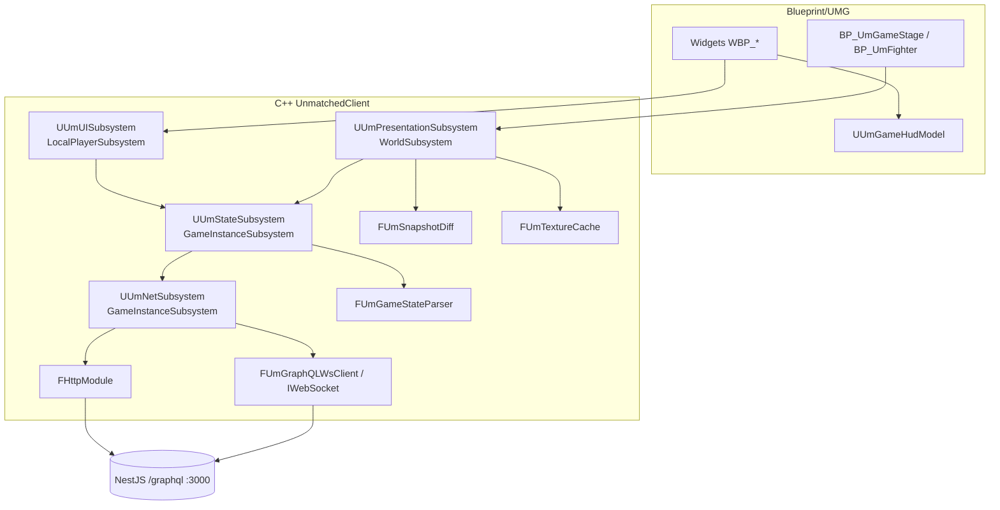
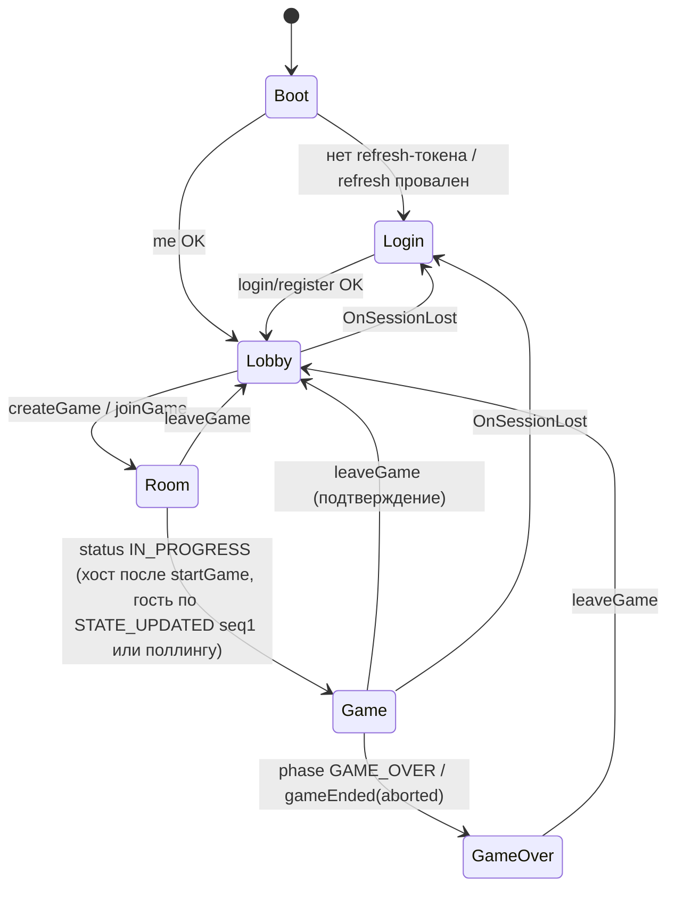
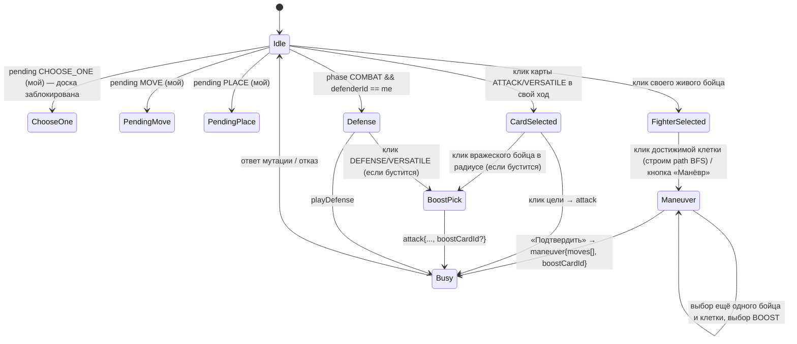
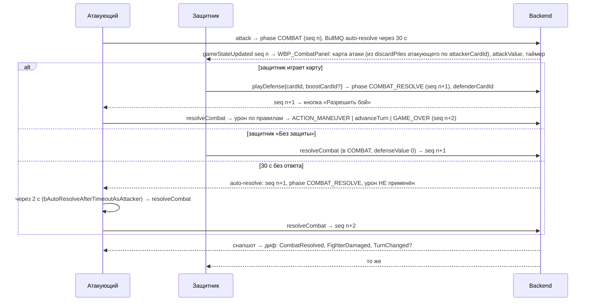

# Кандидат 1 — «Тонкий server-authoritative клиент» на UE 5.8

> Архитектор №1. Дата: 2026-09-02. Ветка репозитория: `fix/admin-panel`.
> Источники: `docs/unreal/00-mcp-verification.md` и research-файлы `docs/unreal/_research/R1…R9`. Ссылки вида `R3 §2.7.5` указывают на раздел research-файла; ссылки `backend/src/…:строка` — на код репозитория, как он процитирован в research (сам код в этом документе не перечитывался). Всё, чего нет в источниках, помечено «не найдено» или «допущение».
> Целевой угол: UE — рендерер и машина состояний экранов; локальной копии правил нет; вся валидация на сервере; минимум C++ (четыре субсистемы); Blueprint/UMG для экранов; максимально быстрая первая партия Medusa vs King Arthur.

---

## 1. Резюме подхода и целевые ограничения

### 1.1. Тезис

UE-клиент — это **проектор серверного `GameState` на экран плюс конечный автомат экранов и ввода**. Он:

1. отправляет GraphQL-мутации по HTTP и применяет `state` из ответа сразу (R3 §2.8: `GameMutationResult.state` — полный отфильтрованный JSON, `backend/src/games/resolvers/game-actions.resolver.ts:72-80,222-227`);
2. получает полные снапшоты по подписке `gameStateUpdated` (R3 §2.12; `backend/src/games/resolvers/game-subscription.resolver.ts:44-63,150-179`) и дедуплицирует их по `sequenceNumber`;
3. **не считает правила как истину** — только подсвечивает кандидатов (BFS 4-связности, смежность, `cell.zone`, `attackRange`) и обрабатывает отказ сервера (`BadRequestException` → `errors[0].message`, R4 §3.1);
4. не делает оптимистичных обновлений — ровно так же, как production-путь веб-клиента (`src/store/remoteGameStore.ts:458-490`, R7 §2.8), где «мгновенный отклик» достигается применением ответа мутации.

Всё «игровое» на клиенте сводится к трём C++ вещам: транспорт (HTTP + graphql-transport-ws), парсер снапшота в `USTRUCT`, и диф двух снапшотов для анимаций. Остальное — UMG/Blueprint, генерируемые через Unreal MCP.

### 1.2. Чего клиент сознательно НЕ делает

| Нет в клиенте | Почему (источник) |
|---|---|
| Локального движка правил, предсказания состояния, отката | Production-веб не использует оптимистику; всё deprecated (R7 §2.8, §2.14). Сервер — единственный арбитр (R4 §3.1) |
| Реплея через `eventsSince` для догоняния | Журнал без состояния, без ходов ИИ и auto-resolve, пишется асинхронно (R3 §2.13 п.7, §4.10). Восстановление — только `gameState` |
| Матчмейкинга и presence в MVP | По коду резолверы без guard и читают `user.userId`, `GamePlayer` не создаются (R2 §4.1-4.4) — под feature-flag до серверного фикса |
| Оффлайн-копии всех 880 карт в MVP | Контент — только для арта/текста; истина по значениям — `GameState` (R6 §3.4). MVP печёт арт двух героев |
| Sceneграфа правил карт (исполнения `CardEffect`) | Эффекты исполняет сервер; клиент показывает `pendingEffects` и текст (R5 §2.5, R4 §2.10) |
| Дверей, тумана, возвышенности | Мёртвые механики (R4 §2.6.6-2.6.7) |

### 1.3. Ограничения и допущения

| Параметр | Значение | Источник |
|---|---|---|
| Движок | UE 5.8.2 (`C:\Program Files\Epic Games\UE_5.8`, CL 56702186) | R8 §2.1 |
| Платформа MVP | Win64 (Development Editor + Development Client); Mac/iOS/Android — v2 | R8 §2.15 |
| Бэкенд | `http://localhost:3000/graphql` (HTTP POST) и `ws://localhost:3000/graphql` (сабпротокол **`graphql-transport-ws`**) | R1 §2.1, §2.4; `backend/src/graphql/graphql.module.ts:19-33` |
| Сторонние плагины | Нет. Только модули движка `HTTP`, `WebSockets`, `Json`, `JsonUtilities`, плагины `CommonUI`, `EnhancedInput`, `PlatformCrypto`, `ModelContextProtocol`+`AllToolsets` (editor) | R8 §2.5 (вердикт), §3.1 |
| Инструментарий сборки | MSVC ≥ 14.38 (реком. 14.44/14.50), Windows SDK ≥ 10.0.22621.0, `Build.bat`, Live Coding | R8 §2.14 |
| Стенд | `NODE_ENV=development` → dev-формат ошибок (`code` дублируется на верхнем уровне, есть `extensions`) | R1 §2.10, §2.13 |
| Допущение | Незакоммиченная правка `getHeroBySlug` (cuid ИЛИ имя) будет задеплоена; до этого контент по имени героя | R6 §2.8 |

### 1.4. Целевой MVP-сценарий: Medusa vs King Arthur

Две учётки (например `<LOCAL_P1_EMAIL>/<LOCAL_P1_PASSWORD>` и `<LOCAL_P2_EMAIL>/<LOCAL_P2_PASSWORD>` — R6 §2.9), два UE-клиента (или UE + веб-клиент на 5174 как соперник). Последовательность вызовов, которую MVP обязан пройти без ручных костылей:

```
login → me → heroList(limit:300) + boardList(limit:100)            (cuid героев/доски; R6 §2.4)
host:  createGame(input:{mode:ONE_V_ONE, boardId}, idempotencyKey:<GUID>)
guest: joinGame(input:{gameId, asOpponent:true})
both:  selectHero(gameId, heroId=cuid) ; toggleReady(gameId)
both:  subscribe gameStateUpdated(gameId) + gameEnded(gameId)      (до startGame; R2 §3.9)
host:  startGame(gameId) → STATE_UPDATED seq 1, phase ACTION_MANEUVER
both:  gameState(gameId) → полный снапшот (decks/discardPiles)
loop:  maneuver / attack(+boostCardId для Arthur) / playDefense / resolveCombat / endTurn / resolvePendingEffect
end:   phase GAME_OVER → leaveGame(gameId)                         (освободить слот; R2 §3.13)
```

Что должно работать по героям (R5 §2.8; `backend/src/game-engine/abilities/ability-config.ts`, `heroes/arthur.handler.ts:22-30`):

| Герой | Слаг (`Fighter.heroSlug`) | Что клиент обязан уметь |
|---|---|---|
| Medusa (range; HP 16; move 3; 3× Harpies 1/3/melee) | `medusa` | ranged-подсветка целей: смежные ∪ одинаковый `cell.zone` (R4 §2.6.1); отображение авто-урона Petrifying Gaze в начале хода через диф снапшотов; гейт карт по `bannerName` для Harpy 1..3 (правила `bannerAllows`: срез числового суффикса, `harpies→harpy`, R4 §2.7.5) |
| King Arthur (melee; HP 18; move 2; Merlin 7/2/range) | `king-arthur` | слот BOOST при **любой** атаке (`allowsAttackBoost: true`), запрет бустить той же картой; ranged-подсветка для Merlin по `Fighter.attackType` из состояния |

### 1.5. Критерии готовности MVP

1. Партия проходит от `createGame` до `GAME_OVER` между двумя UE-клиентами и между UE и веб-клиентом (кросс-проверка контракта).
2. Обрыв WS во время партии восстанавливается без перезапуска (переподписка `since`, `gameSequence` → `gameState`).
3. Истечение access-токена (1 ч) во время партии не ломает игру (проактивный refresh + пересоздание WS).
4. Все 11 gameplay-мутаций вызываемы из UI или dev-консоли; отказ сервера показывается тостом без рассинхрона.
5. Automation-тесты сетевого слоя и парсера проходят из CLI против `localhost:3000`.

---

## 2. Структура проекта

### 2.1. Расположение и `.uproject`

Проект живёт в монорепозитории: `C:/Users/ren/WebstormProjects/unmached/unmached/ue/Unmatched/Unmatched.uproject`. Свой `.uproject` обязателен: MCP-сервер привязан к одному открытому проекту (`docs/unreal/00-mcp-verification.md:60`).

```json
{
  "FileVersion": 3,
  "EngineAssociation": "5.8",
  "Category": "Game",
  "Modules": [
    { "Name": "UnmatchedClient", "Type": "Runtime", "LoadingPhase": "Default",
      "AdditionalDependencies": ["Engine", "CoreUObject", "UMG", "CommonUI"] },
    { "Name": "UnmatchedClientEditor", "Type": "Editor", "LoadingPhase": "PostEngineInit" }
  ],
  "Plugins": [
    { "Name": "CommonUI", "Enabled": true },
    { "Name": "EnhancedInput", "Enabled": true },
    { "Name": "PlatformCrypto", "Enabled": true },
    { "Name": "ModelContextProtocol", "Enabled": true, "TargetAllowList": ["Editor"] },
    { "Name": "AllToolsets", "Enabled": true, "TargetAllowList": ["Editor"] },
    { "Name": "FunctionalTestingEditor", "Enabled": true, "TargetAllowList": ["Editor"] },
    { "Name": "Paper2D", "Enabled": false }
  ]
}
```

Обоснование плагинов: CommonUI — не beta, стек экранов и input routing (R8 §2.6); EnhancedInput — по умолчанию (R8 §2.7); PlatformCrypto — AES-256-GCM для токенов (R8 §2.10); MCP + AllToolsets — агентный dev-loop (`00-mcp-verification.md:5,60`); Paper2D не нужен — доска в 3D + UMG (R8 §2.8).

### 2.2. Модули

| Модуль | Тип | Содержимое | Зависимости (`.Build.cs`) |
|---|---|---|---|
| `UnmatchedClient` | Runtime | 4 субсистемы, модель данных, парсер, диф, акторы доски, `UDeveloperSettings`, автотесты (`Private/Tests/*.spec.cpp` под `WITH_DEV_AUTOMATION_TESTS`) | `Core, CoreUObject, Engine, InputCore, EnhancedInput, UMG, Slate, SlateCore, CommonUI, CommonInput, GameplayTags, HTTP, WebSockets, Json, JsonUtilities, ImageWrapper, PlatformCrypto, PlatformCryptoOpenSSL(Context), DeveloperSettings` |
| `UnmatchedClientEditor` | Editor | Коммандлет `UUmImportContentCommandlet` (JSON → DataTable арта/справочников), редакторские утилиты для MCP-тулсетов проекта (опционально) | `UnmatchedClient, UnrealEd, AssetTools, EditorSubsystem` |

Два модуля — минимум, при котором тесты/коммандлеты не тянут UnrealEd в клиент.

### 2.3. Дерево `Source/`

```
Source/UnmatchedClient/
  UnmatchedClient.Build.cs
  Public/
    UmClientSettings.h            # UDeveloperSettings: URL-ы, таймауты, флаги
    Net/UmNetSubsystem.h          # HTTP GraphQL + auth/refresh + WS фасад
    Net/UmGraphQLTypes.h          # FUmGraphQLRequest/Result/Error
    Net/UmGraphQLWsClient.h       # state machine graphql-transport-ws поверх IWebSocket
    Net/UmSecureStore.h           # интерфейс защищённого хранения токенов
    Net/UmGraphQLDocuments.h      # константы всех операций (строки GraphQL)
    Model/UmEnums.h               # UENUM + тolerant-парсеры строк
    Model/UmApiDtos.h             # USTRUCT для GraphQL-ответов (Auth, Game, Content, ...)
    Model/UmGameState.h           # USTRUCT JSON-состояния
    Model/UmGameStateParser.h     # FUmGameStateParser
    Model/UmStateDiff.h           # FUmSnapshotDiff + FUmPresentationEvent
    State/UmStateSubsystem.h      # сессия, лобби/комната, GameSnapshotStore, контент-кэш
    State/UmGameSnapshotStore.h
    State/UmContentCache.h
    UI/UmUISubsystem.h            # стек слоёв, FSM экранов, тосты/модалки
    UI/UmGameHudModel.h           # UObject-модель для биндинга HUD (BlueprintReadOnly)
    Presentation/UmPresentationSubsystem.h
    Presentation/UmGameStage.h    # AUmGameStage (доска, бойцы, камера)
    Presentation/UmFighterActor.h
    Presentation/UmBoardGeometry.h # BFS/смежность/зоны для подсветки
    Presentation/UmTextureCache.h  # загрузка PNG/JPEG по URL + DataTable арта
  Private/ ... (реализации)
  Private/Tests/
    UmGraphQLErrors.spec.cpp
    UmGameStateParser.spec.cpp
    UmWsClient.spec.cpp           # LatentIt против localhost:3000 (опц., по флагу)
    UmSnapshotDiff.spec.cpp
    UmBoardGeometry.spec.cpp
Source/UnmatchedClientEditor/
  Commandlets/UmImportContentCommandlet.h/.cpp
```

### 2.4. Дерево `Content/`

```
Content/
  Maps/           L_Boot.umap, L_Menu.umap, L_Game.umap
  Core/           BP_UmGameInstance, BP_UmGameMode_Menu, BP_UmGameMode_Game, BP_UmPlayerController,
                  BP_UmGameViewportClient (родитель CommonGameViewportClient)
  UI/
    Root/         WBP_RootLayout (4 стека слоёв)
    Auth/         WBP_Login, WBP_Register
    Lobby/        WBP_Lobby, WBP_GameListRow, WBP_CreateGameDialog
    Room/         WBP_Room, WBP_PlayerSlot, WBP_HeroPicker, WBP_HeroCard
    Game/         WBP_GameHUD, WBP_PlayerPanel, WBP_TurnPhasePill, WBP_HandTray, WBP_CardView,
                  WBP_OpponentHand, WBP_DeckDiscard, WBP_CombatPanel, WBP_BoostPicker,
                  WBP_PendingEffectBanner, WBP_ChooseOneDialog, WBP_StanceBar, WBP_CardInspector,
                  WBP_ActionLog, WBP_ManeuverBar, WBP_GameOver
    Common/       WBP_ConfirmDialog, WBP_Toast, WBP_ConnectionBadge, WBP_ReconnectOverlay,
                  WBP_UmButton (CommonButtonBase), DA_UmButtonStyle_*, DA_UmTextStyle_*
    Input/        DA_CommonInputData, IA_Select, IA_Cancel, IA_Confirm, IA_Zoom, IMC_Game, IMC_Menu
  Board/          BP_UmGameStage, BP_UmFighter, SM_Cell (plane 100×100), M_Cell, MI_Cell_Zone_*,
                  M_Highlight, MI_Highlight_Move (76,210,220), MI_Highlight_Attack (230,92,70)
  Data/           DT_CardArt (FUmCardArtRow), DT_HeroArt (FUmHeroArtRow), DT_BoardArt,
                  DT_ServerErrorMap, DT_AttackRange (слаг → дальность), ST_UI (StringTable)
  Textures/
    Cards/<heroSlug>/T_Card_<heroSlug>_<cardSlug>_EN|RU
    Heroes/<heroSlug>/T_Hero_<heroSlug>_Avatar|Mini|Cover
    Boards/T_Board_<boardSlug>
    UI/             T_UI_CardBack, T_UI_Vignette, ...
  Fonts/          F_Inter (OFL, кириллица)
```

Именование текстур — как предложено в R9 §2.13 п.6.

### 2.5. Конфигурация (`Config/`)

`DefaultGame.ini`:

```ini
[/Script/UnmatchedClient.UmClientSettings]
ApiBaseUrl=http://localhost:3000
GraphQLPath=/graphql
AssetBaseUrl=http://localhost:5174          ; для корневых /assets/... (R5 §2.12, R9 §3.1)
DefaultBoardName=Cobble City
HttpTimeoutSec=15
WsConnectionAckTimeoutSec=5
WsReconnectMaxAttempts=5
WsAppPingIntervalSec=10
DefenseTimeoutSec=30                        ; DEFAULT_DEFENSE_TIMEOUT (R4 §2.7.4)
ProactiveRefreshLeadSec=300
bMatchmakingEnabled=false                   ; R2 §4.1-4.3
bPresenceEnabled=false                      ; R2 §4.4
bAutoResolveAfterTimeoutAsAttacker=true     ; R3 §3.8
```

`DefaultEngine.ini`:

```ini
[/Script/Engine.Engine]
GameViewportClientClassName=/Game/Core/BP_UmGameViewportClient.BP_UmGameViewportClient_C   ; требование CommonUI (R8 §2.6)
[WebSockets]
TextMessageMemoryLimit=8388608              ; 8 МБ вместо 1 МБ (R8 §2.3)
[WebSockets.LibWebSockets]
PingPongInterval=10                         ; страховка от terminate() сервера через 24 с (R1 §2.4, R8 §2.3)
```

`DefaultEditorPerProjectUserSettings.ini` — тот же MCP-блок, что в хост-проекте (`00-mcp-verification.md:12`): `ServerPortNumber=8123`, `ServerUrlPath=/mcp`, `bAutoStartServer=True`, `bEnableToolSearch=True`.

### 2.6. Конвенции именования

| Сущность | Префикс/шаблон | Пример |
|---|---|---|
| C++ классы проекта | `UUm*`, `AUm*`, `FUm*`, `EUm*` | `UUmNetSubsystem`, `FUmGameState`, `EUmGamePhase` |
| USTRUCT для GraphQL-ответов | `FUm<Type>Dto` | `FUmGameResponseDto`, `FUmGameMutationResultDto` |
| USTRUCT JSON-состояния | `FUm<Name>` без суффикса | `FUmFighter`, `FUmCombatState` |
| Widget Blueprint | `WBP_` | `WBP_GameHUD` |
| Акторы/BP | `BP_`, `AUm*` | `BP_UmGameStage` |
| Данные | `DT_`, `DA_`, `ST_`, `MI_`, `T_`, `L_`, `IA_`, `IMC_` | `DT_CardArt` |
| GameplayTags | `UI.Layer.{Game,Menu,Modal,Toast}`, `UI.Screen.{Boot,Login,Lobby,Room,Game}`, `Input.Mode.{Idle,FighterSelected,CardSelected,Maneuver,PendingMove,PendingPlace,ChooseOne,Defense,BoostPick,Busy}` | |
| Поля UPROPERTY в DTO | camelCase как в JSON (`sequenceNumber`) — чтобы не зависеть от регистра `StandardizeCase` на импорте (R8 §4.5) | `int32 sequenceNumber;` |
| GraphQL-операции | PascalCase, как во фронте (`GetGameState`, `Attack`) | R7 §2.4 |

### 2.7. Git и хранение ассетов

`ue/.gitignore`: `Binaries/`, `Intermediate/`, `Saved/`, `DerivedDataCache/`, `*.sln`, `.vs/`. Текстуры карт (`Content/Textures/Cards/**`) — Git LFS (`.gitattributes: *.uasset filter=lfs`), т.к. исходники `public/assets` в git не отслеживаются и весят 229 МБ (R9 §1 п.1-2). Источник арта для UE-пайплайна — `scraped-data/images/**` + `scraped-data/api/normalized/<slug>.json` (R9 §2.4).

---

## 3. Слои и классы

### 3.1. Обзор



Правило зависимостей: Blueprint видит только `UUmUISubsystem`, `UUmGameHudModel` и `UUmPresentationSubsystem` (BlueprintCallable/ReadOnly). Сеть и парсинг из Blueprint недоступны.

### 3.2. Субсистемы

| Класс | База | Ответственность | Публичный API (сокращённо) | Делегаты |
|---|---|---|---|---|
| `UUmNetSubsystem` | `UGameInstanceSubsystem` | HTTP GraphQL, auth-состояние, single-flight refresh, secure store, владение `FUmGraphQLWsClient`, rate-limiter, clock offset | `Execute(FUmGraphQLRequest, FUmGraphQLCallback)`, `Login/Register/Logout/RefreshNow()`, `Subscribe(...)→FUmSubscriptionHandle`, `Unsubscribe(handle)`, `GetUserId()`, `GetServerNow()` | `OnSessionChanged(EUmSessionState)`, `OnWsStateChanged(EUmWsState)`, `OnSessionLost(FText reason)` |
| `UUmStateSubsystem` | `UGameInstanceSubsystem` | Модели лобби/комнаты/игры, `FUmGameSnapshotStore`, синхронизация (seq/gap/refetch), таймеры (защита 30 с), контент-кэш и карта cuid, feature-flags | `EnterLobby()/RefreshAvailableGames()`, `CreateGame(mode, boardCuid)`, `JoinGame(gameId)`, `EnterRoom(gameId)`, `SelectHero(cuid)`, `ToggleReady()`, `StartGame()`, `LeaveGame()`, `EnterGame(gameId)`, `ExitGame()`, `Do*()` для 11 gameplay-мутаций, `GetSnapshot()`, `GetHud()` | `OnLobbyUpdated`, `OnRoomUpdated`, `OnSnapshotApplied(prev,next,source)`, `OnActionRejected(FUmGraphQLError)`, `OnGameEnded`, `OnSyncStatus(EUmSyncStatus)` |
| `UUmUISubsystem` | `ULocalPlayerSubsystem` | `WBP_RootLayout` с 4 стеками `UCommonActivatableWidgetStack`, FSM экранов по `UI.Screen.*`, тосты, модалки, `FUIInputConfig` | `PushScreen(tag)`, `PushModal(class, payload)`, `Toast(FText, EUmToastKind)`, `ShowReconnectOverlay(bool)` | `OnScreenChanged` |
| `UUmPresentationSubsystem` | `UWorldSubsystem` (только `L_Game`) | Спавн `AUmGameStage`, очередь `FUmPresentationEvent`, подсветки, FSM ввода в игре, курсор/трассировка, текстуры | `BindToState()`, `SetInputMode(tag)`, `Highlight(cells, kind)`, `PlayQueue()`, `ResolveTexture(url)→UTexture2D*` (async) | `OnCellClicked(x,y)`, `OnFighterClicked(id)`, `OnQueueDrained` |

Почему четыре, а не больше: каждая соответствует одному «слою» из формулировки задачи (Network, State, UI, Presentation); `FUmTextureCache`, `FUmGraphQLWsClient`, `FUmGameSnapshotStore` — обычные C++ классы, не субсистемы.

### 3.3. Сетевой слой

#### 3.3.1. HTTP GraphQL-клиент

```cpp
USTRUCT() struct FUmGraphQLRequest {
  FString OperationName;                 // "Attack", "GetGameState", ...
  FString Query;                         // из UmGraphQLDocuments.h
  TSharedPtr<FJsonObject> Variables;     // {"input": {...}}
  bool bRequiresAuth = true;             // false для login/register/refreshTokens/контента/availableGames/heroStances
  bool bRetryOnNetworkError = false;     // true только для query; мутации не ретраятся (R7 §3.7)
  float TimeoutSec = 15.f;               // HttpTotalTimeout по умолчанию 0 → задаём явно (R8 §2.2)
};
USTRUCT() struct FUmGraphQLError {
  FString Message; FString Code; int32 Status = 0;  // code: extensions.code ИЛИ верхнеуровневый code (R1 §2.10)
  TArray<FString> Path; TArray<FString> OriginalMessages; // extensions.originalError.message[] (BAD_REQUEST)
};
struct FUmGraphQLResult {
  bool bTransportOk = false; int32 HttpCode = 0;
  TSharedPtr<FJsonObject> Data;          // может быть null при non-null корневом поле (R1 §2.3)
  TArray<FUmGraphQLError> Errors;
  EUmErrorClass Class() const;           // Network | Auth | Validation | Conflict | NotFound | Forbidden | RateLimited | Concurrent | Unknown
};
```

Реализация `UUmNetSubsystem::Execute`:

1. `FHttpModule::Get().CreateRequest()`; `SetVerb("POST")`; `SetURL(ApiBaseUrl + GraphQLPath)`; `SetHeader("Content-Type","application/json")`; при `bRequiresAuth` — `SetHeader("Authorization","Bearer "+AccessToken)`; заголовок `Origin` не отправляется (CORS не применяется, `backend/src/main.ts:105-122`, R1 §2.3); `X-Idempotency-Key` не отправляется (сервер не читает, R1 §2.12). `SetTimeout(TimeoutSec)`. Тело: `{"query","variables","operationName"}`.
2. В `OnProcessRequestComplete` (game thread по умолчанию, R8 §2.2): парсим тело **независимо от HTTP-кода** — 200 при ошибках резолверов, 400 при ошибках валидации/complexity (R1 §2.3). Если тело не JSON → `Network`.
3. Классификация ошибок (таблица ниже) → при `Auth` и `bRequiresAuth` → single-flight refresh → повтор запроса один раз.

Таблица классификации (R1 §2.10; `@nestjs/apollo/dist/drivers/apollo-base.driver.js:17-22,170-190`; `backend/src/graphql/graphql.module.ts:60-103`):

| Признак | `EUmErrorClass` | Реакция |
|---|---|---|
| `bTransportOk=false`, таймаут, `HttpCode==0` | `Network` | ретрай для query (300 мс → 10 с, jitter, 3 попытки, как `src/lib/retry-link.ts`), тост для мутации |
| `Code==UNAUTHENTICATED` **или** сообщение ∈ {«Неавторизованный доступ», «Token revoked», «Пользователь не найден»} и операция не `Login`/`ChangePassword` | `Auth` | refresh → повтор; при провале refresh → `OnSessionLost` |
| `Code==UNAUTHENTICATED` от `Login`/`ChangePassword` | `Validation` | показать сообщение |
| `Code∈{BAD_REQUEST, BAD_USER_INPUT, GRAPHQL_VALIDATION_FAILED, GRAPHQL_PARSE_FAILED}` | `Validation` | для gameplay — «ход отклонён» с `Message`; `OriginalMessages` в лог |
| `Code==INTERNAL_SERVER_ERROR` и `Status==409` (или сообщение содержит `Concurrent modification`) | `Concurrent` | `RefetchState()` один раз, без автоповтора действия (R2 §3.21) |
| `Code==INTERNAL_SERVER_ERROR` и `Status==409` иначе (`MaxActiveGames`, email занят) | `Conflict` | тост |
| `Status==404` или сообщение содержит `not found`/«не найдена» | `NotFound` | тост / уйти в лобби |
| `Code==FORBIDDEN` | `Forbidden` | тост |
| `Status==429` / `THROTTLED`/`TOO_MANY_REQUESTS` (код не подтверждён, R2 §4.15) | `RateLimited` | тост, без ретрая |
| остальное | `Unknown` | тост «Ошибка сервера» + лог |

В production сообщение может быть заменено на `Internal server error` (R1 §2.10) — все тексты идут через `DT_ServerErrorMap` (подстрока → `FText`), фолбэк — «Действие отклонено сервером».

#### 3.3.2. Аутентификация и refresh

```cpp
struct FUmAuthState {
  FString AccessToken, RefreshToken, UserId, Username, Email; EUmUserRole Role;
  FDateTime AccessExpUtc;   // из base64url payload.exp (без проверки подписи), R1 §3.14
};
```

- `Login(email,password)` / `Register(email,username,password)` → `AuthResponseDto {accessToken, refreshToken, user{id,email,username,avatar,role,createdAt,emailVerified}}` (R1 §2.7; `backend/src/auth/dto/auth-response.dto.ts:19-53`). `UserId` берём из `user.id` (не из внешнего хранилища — веб-баг `localStorage.userId`, R7 §2.13 п.6).
- Клиентская валидация: `username` 3–20 `^[a-zA-Z0-9_]+$`, `password ≥ 8`, `email` (`backend/src/auth/dto/register.dto.ts:4-26`).
- **Проактивный refresh**: `FTSTicker` раз в 15 с; если `AccessExpUtc − Now < ProactiveRefreshLeadSec (300)` → `RefreshNow()`. Это единственный надёжный путь в production, где `UNAUTHENTICATED` маскируется (R1 §2.10 п.6).
- **Single-flight**: `TOptional<TSharedRef<FUmRefreshInFlight>>`; параллельные операции с `Auth` ждут в `PendingAfterRefresh` и повторяются после успеха.
- `refreshTokens(refreshToken)` → новая пара; любая ошибка (`Invalid refresh token`, `Refresh token has been revoked`, `Refresh token expired`, «Невалидный refresh token» — `backend/src/auth/auth.service.ts:224-233,281`) → `OnSessionLost` с текстом «Сессия потеряна (вход с другого устройства?)» для `revoked` (R1 §2.6).
- После успешного refresh: `WsClient->Reconnect(/*bForce*/true)` — токен фиксируется в `connection_init` на всё время сокета (R1 §2.4; веб этого не делает — R7 §2.13 п.17).
- `Logout()`: мутация `logout` только при валидном access (R1 §4.9: без токена сервер может ревокнуть чужие refresh-токены), затем локальная очистка всегда. Помнить: `logout` ревокует refresh на всех устройствах (R1 §2.5).
- Хранение: access — только в памяти; refresh — через `IUmSecureStore` (§3.10).

#### 3.3.3. Идемпотентность, ретраи, лимиты

| Механизм | Решение |
|---|---|
| `createGame(idempotencyKey)` | `FGuid::NewGuid().ToString(EGuidFormats::DigitsWithHyphens)` на каждый клик; повтор при сетевой ошибке — тот же ключ (сервер вернёт ту же игру, `backend/src/games/game.service.ts:160-168`) |
| `joinGame`, `joinQueue`, `leaveQueue`, `leaveAllQueues` | **без** `idempotencyKey` (аргумента нет в схеме — R1 §2.12, `src/gql/graphql.ts:867-884`); лишние поля DTO → `BAD_REQUEST` (`forbidNonWhitelisted`, `backend/src/main.ts:66-75`) |
| `toggleReady` | не идемпотентен (инвертирует); клиентский `bBusy` на кнопке, состояние берём из `players[].isReady` ответа (R2 §3.11) |
| Gameplay-мутации | одна in-flight мутация на клиент (`FUmActionGate`); не ретраятся автоматически; при `Concurrent` — `RefetchState()` |
| Rate limits | `FUmRateLimiter` по объявленным значениям (login 10/мин, register 5/мин, refreshTokens 3/мин, attack/playDefense/resolveCombat/playScheme/pass 20/мин, maneuver/moveFighter/endTurn/toggleDoor/setStance/resolvePendingEffect 30/мин, createGame 10, joinGame 15, startGame/abortGame 5, toggleReady 20, selectHero 10 — R1 §2.11) — «мягко»: кнопка блокируется до окна; сервер сейчас лимиты не применяет (`ThrottlerGuard` не привязан) |
| Complexity/depth | все документы ≤ depth 7; `heroes { cards }` не запрашиваем (N+1 и complexity, R5 §2.11 п.4) |

#### 3.3.4. WebSocket-клиент `FUmGraphQLWsClient`

```cpp
enum class EUmWsState : uint8 { Idle, Connecting, AwaitingAck, Ready, Backoff, Failed, Closing };
class FUmGraphQLWsClient : public TSharedFromThis<FUmGraphQLWsClient> {
public:
  void Configure(FString WsUrl, TFunction<FString()> AccessTokenProvider);
  void Connect(); void Reconnect(bool bForce); void Shutdown();
  FUmSubscriptionHandle Subscribe(const FString& Query, TFunction<TSharedPtr<FJsonObject>()> VariablesProvider,
                                  FOnNext OnNext, FOnError OnError, FOnComplete OnComplete);
  void Unsubscribe(FUmSubscriptionHandle);
private:
  TSharedPtr<IWebSocket> Socket; EUmWsState State; int32 Attempt = 0;
  TMap<FString /*id*/, FUmActiveSubscription> Active;   // id = FGuid string
  FTSTicker::FDelegateHandle AckTimeout, AppPing;
};
```

Поведение (R1 §2.4, R8 §2.3, спецификация graphql-transport-ws):

1. Создание: `FWebSocketsModule::Get().CreateWebSocket(WsUrl, TEXT("graphql-transport-ws"))` **только на game thread** (`check(IsInGameThread())`, `WebSocketsModule.cpp:77-86`). Без сабпротокола сервер закроет 4406 (`graphql-ws server-3ewaJSjp.js:33-37`).
2. Все `OnMessage/OnConnected/OnClosed/OnConnectionError` биндятся **до** `Connect()` (иначе `OnMessage` не вызовется, `LwsWebSocket.h:327-341`).
3. `OnConnected` → немедленно `{"type":"connection_init","payload":{"authorization":"Bearer <token>"}}` (окно 3 с, иначе 4408, `server-3ewaJSjp.js:12,42-48`); `State=AwaitingAck`, таймер `WsConnectionAckTimeoutSec`.
4. `connection_ack` → `State=Ready`; для каждой записи `Active` заново отправляется `subscribe` с **новым** id и переменными из `VariablesProvider()` (так `since` берётся актуальный). `connection_ack` не означает валидность токена (R1 §2.4 п.10).
5. `next` → `OnNext(payload.data)`; если в `next` есть `errors` (auth-ошибка на subscribe приходит как `next{errors}`+`complete`, `server-3ewaJSjp.js:223-261`) → классифицируем сообщение как в §3.3.1; при `Auth` → `Net->RefreshNow()` → `Reconnect(true)`.
6. `error` → `OnError(payload[])`, подписка удаляется; `complete` от сервера → `OnComplete`, удаляется; `Unsubscribe` → шлём `complete {id}`.
7. `ping` от сервера → `pong` немедленно. Раз в `WsAppPingIntervalSec` шлём `{"type":"ping"}` и ждём `pong` ≤ 5 с — прикладной liveness (WS-ping/pong на уровне LWS выключен по умолчанию, `LwsWebSocketsManager.cpp:192-194`; серверные ping-фреймы каждые 12 с требуют pong-фрейма — R1 §2.4; страховка `PingPongInterval=10` в ini).
8. Закрытие/ошибка → объект переиспользуем (`LwsWebSocket.cpp:625-648`): `State=Backoff`, задержка `1000 мс × 2^(Attempt−1)`, максимум `WsReconnectMaxAttempts=5`, затем `Failed` + `WBP_ReconnectOverlay` с кнопкой «Переподключить» (сброс `Attempt`). Коды 4400/4401/4409/4429 — баг клиента (лог `Error`, без бесконечного цикла); 4406 — ошибка конфигурации (без ретрая); 4408/4500/1001/1006 — reconnect.
9. `Reconnect(true)` (после refresh): `Socket->Close(1000)`, ждём `OnClosed`, `Connect()`; активные подписки переустанавливаются.
10. `SetTextMessageMemoryLimit(8 МБ)` (снапшот `gameStateUpdated` — 5 JSON-строк без колод; при 20×20 fallback-доске `boardState` ≈ 400 клеток).

Запросы/мутации по WS не используем (нет IP/UA для аудита логина, R1 §2.4).

### 3.4. Модель данных

#### 3.4.1. Принципы

1. Два яруса: **DTO GraphQL** (`Model/UmApiDtos.h`, парсятся `FJsonObjectConverter::JsonObjectToUStruct(bStrictMode=false)`) и **JSON-состояние** (`Model/UmGameState.h`, парсится `FUmGameStateParser` из строки `state` / пяти строк подписки).
2. Строковые enum'ы на проводе хранятся как `FString`/`FName` и конвертируются в `UENUM` **толерантными** функциями (`UmEnums::ParsePhase("COMBAT")`, неизвестное → `Unknown`) — `FJsonObjectConverter` при неизвестном значении enum ломает импорт (R8 §2.4), а список `EffectType` содержит `UNSUPPORTED` и может расти (R3 §3.4).
3. Серверные дефолты зашиты как значения по умолчанию полей: `movement=2`, `attackType="melee"`, `actionsRemaining=2`, флаги `*ThisTurn=false` (R3 §3.3); присутствие опциональных объектов (`combatInfo`) отмечается флагом `bHas*`, выставляемым парсером по DOM.
4. `Float`-скаляры (`since`, `sinceSequence`, `gameSequence`, `GameStateResponse.sequenceNumber/turnCount`, `seatOrder`, `version`) — `double` в DTO, конверсия в `int32` в аксессорах (R3 §2.4).
5. `DateTime`: в GraphQL-полях — epoch-миллисекунды (`backend/src/graphql/scalars/date-time.scalar.ts:13-16`, R3 §2.4), внутри JSON-состояния — ISO-строки (`lastActionAt`, `combatInfo.startedAt`). R1 §3.26 утверждает, что `createdAt` — ISO-строка — расхождение исследований; парсер `UmJson::ParseDateTime(JsonValue)` принимает **оба** формата (число → epoch-ms, строка → ISO 8601).
6. Рекурсивные/вложенные структуры эффектов (`CardEffect.options[].effects`, `PendingEffect.optionEffects: CardEffect[][]`) клиенту не нужны — тонкий клиент их не исполняет; хранятся как `FJsonObjectWrapper RawJson` (R8 §2.4: `FJsonObjectWrapper` проходит как есть).
7. `TMap<FString, …>` для `decks/discardPiles/handZones/heroStances/doors` — ключи-строки поддерживаются конвертером (`JsonObjectConverter.cpp:716-760`).

#### 3.4.2. UENUM

| Enum | Значения | Источник |
|---|---|---|
| `EUmGamePhase` | `SETUP, TURN_START, ACTION_MANEUVER, ACTION_ATTACK, COMBAT, COMBAT_RESOLVE, TURN_END, GAME_OVER, Unknown` | R3 §2.3.1; `backend/src/game-engine/models/game-state.model.ts:15-24` |
| `EUmGameStatus` | `PENDING, LOBBY, IN_PROGRESS, PAUSED, FINISHED, ABORTED, Unknown` | `backend/src/games/dto/create-game.dto.ts:16-23` |
| `EUmGameMode` | `ONE_V_ONE, TWO_V_TWO, FREE_FOR_ALL, VS_AI` | `create-game.dto.ts:9-14` |
| `EUmGameEventType` | 22 значения из `gameplay.dto.ts:24-48` + `Unknown` | R3 §2.3.1 |
| `EUmUserRole` | `USER, ADMIN, MODERATOR` | `backend/prisma/schema.prisma:17-21` |
| `EUmPresenceStatus` | `OFFLINE, ONLINE, INGAME, INQUEUE` | `backend/src/presence/models/presence.model.ts:1-6` |
| `EUmFighterType` | `HERO, MINION, HUGE, Unknown` | `fighter.model.ts:10-14` |
| `EUmAttackType` | `Melee, Ranged` (строки `melee`/`ranged`) | `fighter.model.ts:56-58,90-104` |
| `EUmCardType` (engine) | `ATTACK, DEFENSE, SCHEME, UNIVERSAL, VERSATILE, MANEUVER, Unknown` | `card.model.ts:10-19` |
| `EUmContentCardType` | `ATTACK, DEFENSE, SCHEME, VERSATILE` (публичный контент; `MANEUVER/UNIVERSAL→VERSATILE` на сервере) | R5 §2.3; `content.mapper.ts:395-410` |
| `EUmPendingEffectType` | `MOVE, PLACE, CHOOSE_ONE, Unknown` | `game-state.model.ts:132-139` |
| `EUmCellType` | `normal, wall, obstacle, door, zone-line` | `board.model.ts:24-26` |
| `EUmZone` | `BLUE, GREEN, YELLOW, RED, PURPLE, BROWN, GRAY, ORANGE, PINK, WHITE, GOLD, BEIGE` (в состоянии — lowercase строки) | R5 §2.3; `board-definition.interface.ts:43-56` |
| `EUmBoostSource` | `PLAYER_CHOICE_HAND, SELF_DECK_TOP, OPPONENT_RANDOM_HAND, None` | `card.model.ts:142-149` |
| `EUmWsState`, `EUmErrorClass`, `EUmSyncStatus{Idle,Loading,Live,Reconnecting,Resyncing,Failed}`, `EUmInputMode` | клиентские | — |

Полный `EffectType` (21), `EffectTiming` (8), `EffectTarget` (10), `EffectConditionKind` (14) в UENUM **не переносятся** — клиент читает из `CardEffect` только `type`, `boostSource`, `text`, `optional` (для решения «показывать ли слот BOOST» и для лога). Расширение — добавить поля позже.

#### 3.4.3. DTO GraphQL-ответов (`Model/UmApiDtos.h`)

| USTRUCT | Поля (тип UE) | Источник |
|---|---|---|
| `FUmAuthUserDto` | `id, email, username: FString; avatar: FString; role: FString; createdAt: FUmDateTime; emailVerified: FUmDateTime` | R1 §2.7 |
| `FUmAuthResponseDto` | `accessToken, refreshToken: FString; user: FUmAuthUserDto` | `auth-response.dto.ts:19-53` |
| `FUmMeDto` (`UserWithSettingsResponse`) | как `FUmAuthUserDto` + `settings: FUmUserSettingsDto{ id, theme, language: FString; soundEnabled, musicEnabled, profileVisible, showOnlineStatus: bool }` | R1 §2.8 |
| `FUmGamePlayerDto` | `id, userId, username, avatar, heroId: FString; isReady, hasPassed: bool; seatOrder: double` | R2 §2.2; `game-player.model.ts:4-28` |
| `FUmGameResponseDto` | `id, code, status, mode, hostId, opponentId, boardId, boardState, winnerId, phase: FString; host: FUmGamePlayerDto; opponent: FUmGamePlayerDto; bHasOpponent: bool (парсер); createdAt, updatedAt, startedAt, endedAt: FUmDateTime; version: double; players: TArray<FUmGamePlayerDto>; currentTurn: int32` | `game.model.ts:6-63`; примечание: `host.id/opponent.id` = `User.id`, `players[].id` = id записи `GamePlayer` — идентифицировать по `userId` (R2 §2.2) |
| `FUmGameStateResponseDto` | `id, gameId, state, currentTurnPlayerId, phase: FString; sequenceNumber, turnCount: double; updatedAt: FUmDateTime` | `game.model.ts:66-90`; `phase` — `String!`, не enum |
| `FUmGameMutationResultDto` | `state: FString; sequenceNumber: int32; timestamp: FUmDateTime (epoch-ms); phase: FString; currentTurnPlayerId: FString; turnCount: int32` | `gameplay.dto.ts:437-458` |
| `FUmGameStateSubscriptionDto` | `gameId, phase, currentTurnPlayerId: FString; sequenceNumber, turnCount: int32; players, fighters, handZones, boardState, metadata: FString (JSON)` | `gameplay.dto.ts:461-495` |
| `FUmGameEventDto` | `type, gameId, payload: FString; sequenceNumber: int32; timestamp: FUmDateTime` — `payload` = JSON `{phase, turnCount, currentTurnPlayerId}` либо `{userId, username}` / `{userId}` / `{reason, abortedBy}` | `gameplay.dto.ts:395-413`; R2 §2.6 |
| `FUmTurnStateDto` | `playerId, phase: FString; turnCount: int32` | `gameplay.dto.ts:380-392` |
| `FUmEventsSinceDto` | `gameId: FString; events: TArray<FUmGameEventDto>; lastSequence: int32; hasMore: bool` | `gameplay.dto.ts:569-582` |
| `FUmStanceOptionDto` | `id, label: FString; isDefault: bool` | `gameplay.dto.ts:362-375` |
| `FUmHeroListItemDto` (admin `heroList`) | `id (cuid), name, nameEn, nameRu, set, fighterType, ability, imageUrl, avatarUrl: FString; health: double; createdAt: FUmDateTime` | R6 §2.2 п.3/4; `07-graphql-schema-reference.md:408-410` |
| `FUmBoardListItemDto` (admin `boardList`) | `id (cuid), name, set, imageUrl, imageUrlDark: FString; width, height: int32; createdAt` | R6 §2.2 п.9/10 |
| `FUmHeroDto` (контент) | `id (= name!), name, nameEn, nameRu, set, fighterType, imageUrl, avatarUrl: FString; health, movement (не доверять: константа 3), sidekickCount: int32; abilities: TArray<FUmHeroAbilityDto{id,name,text,trigger}>; cards: TArray<FUmCardDto>; urls: FUmHeroUrlsDto{avatar, mini, cardCover}; updatedAt` | R5 §2.3; `content.dto.ts:102-155` |
| `FUmCardDto` (контент) | `id (cuid), title, type, characterName, imageUrl, imageUrlRu: FString; value, boost, quantity: int32; effects: TArray<FUmContentEffectDto{id, text}>` — `timing` не выбираем (риск ошибки сериализации enum, R5 §4.1) | `content.dto.ts:69-100` |
| `FUmBoardDto` | `id (= name), name, imageUrl: FString; width, height, recommendedPlayers: int32; spaces: TArray<FUmBoardSpaceDto{position{x,y}, zones: TArray<FString>, isObstacle: bool}>` — размер сетки выводить из `spaces` (R5 §3.5) | `content.dto.ts:157-203` |
| `FUmContentSummaryDto` | `version: FString; heroesCount, boardsCount, setsCount: int32; sets: TArray<FString>` | `content.dto.ts:245-260` |
| `FUmQueueStatusDto`, `FUmMatchFoundDto`, `FUmPenaltyInfoDto`, `FUmPresenceDto`, `FUmHeartbeatDto` | как в R2 §2.2 — под feature-flag | `matchmaking/dto/*.ts`, `presence/dto/*.ts` |

`FUmDateTime` — `USTRUCT { FDateTime Utc; bool bSet; }` с кастомным импортом через `CustomImportCallback` (число/строка).

#### 3.4.4. JSON-состояние (`Model/UmGameState.h`)

| USTRUCT | Поля | Дефолты/примечания | Источник |
|---|---|---|---|
| `FUmPosition` | `x, y: int32` | | `fighter.model.ts:19-22` |
| `FUmFighterEffect` | `type: FString; value: int32; duration: FString (permanent/turn/round); source: FString` | `immobilized`/`turn` → блок движения | `fighter.model.ts:27-33` |
| `FUmFighter` | `id, ownerId, heroId (cuid), name, type, heroSlug: FString; health, maxHealth: int32; position: FUmPosition; effects: TArray<FUmFighterEffect>; hasSidekick, isDefeated: bool; sidekickIds: TArray<FString>; movement: int32 = 2; attackType: FString = "melee"` | `IsAlive() = !isDefeated && health>0` | R3 §2.9.3; `fighter.model.ts:38-62` |
| `FUmGameStatePlayer` | `userId, heroId: FString; health, maxHealth: int32; fighterIds: TArray<FString>; isAlive: bool` | | `game-state.model.ts:60-67` |
| `FUmCardEffect` | `id, type, timing, target, text, boostSource, source: FString; value: int32; optional, blind: bool; optionLabels: TArray<FString>; chooseCount: int32 = 1; RawJson: FJsonObjectWrapper` | `IsBoostFromHand() = type=="BOOST" && (boostSource.IsEmpty() || boostSource=="PLAYER_CHOICE_HAND")` (R4 §2.7.2) | `card.model.ts:50-84` |
| `FUmCard` | `id (instance "<cardId>::n"), cardId, name, nameEn, nameRu, cardType, text, bannerName: FString; attackValue, defenseValue, boostValue: int32 = -1 (−1 = отсутствует); effects: TArray<FUmCardEffect>; isVisible: bool; bHidden (парсер: name=="???")` | В мутации слать `id`, не `cardId` (R3 §3.10) | `card.model.ts:25-48,282-284` |
| `FUmDeckState` | `cards, drawPile: TArray<FUmCard>; topCard: FUmCard; bHasTopCard` | Чужой `drawPile` не показывать (утечка, R4 §3.11) | `card.model.ts:289-293` |
| `FUmHandZone` | `cards: TArray<FUmCard>; maxSize: int32 = 7` | `cards` может прийти строкой → второй парс (R6 §2.6) | `card.model.ts:298-301` |
| `FUmCell` | `type, zone: FString; x, y: int32; zones: TArray<FString>; isOpen, isHighGround: bool` | `zone` — legacy первая зона; ranged по ней (R4 §2.6.1) | `board.model.ts:24-35` |
| `FUmBoardState` | `width, height: int32; rows: TArray<FUmCellRow{cells: TArray<FUmCell>}> (cells[y][x]); doors: TMap<FString,bool>` | `fog/tokens` игнорируются (всегда `{}`) | `board.model.ts:12-20`; `game-initialization.service.ts:320-349` |
| `FUmCombatState` | `attackerId (fighter!), defenderId (userId!), targetFighterId, attackerCardId, defenderCardId: FString; attackValue, defenseValue: int32; startedAt: FDateTime; bHasDefenderCard` | `timeoutAt` никогда не приходит (R3 §4.2) — таймер локальный | `game-state.model.ts:73-84` |
| `FUmPendingEffect` | `id, type, playerId, fighterName, text: FString; value: int32 = 1; targetsOpponent: bool; options: TArray<FUmPendingOption{index: int32; label: FString}>; chooseCount: int32 = 1; card: FUmCard; bHasCard` | | `game-state.model.ts:132-163` |
| `FUmGameStateMetadata` | `lastActionAt: FDateTime; lastActionBy: FString; version: int32; combatInfo: FUmCombatState; bHasCombatInfo; passCount: int32; winnerId: FString; actionsRemaining: int32 = 2; pendingEffects: TArray<FUmPendingEffect>; maneuveredThisTurn, attackedThisTurn, lostCombatThisTurn: bool; heroStances: TMap<FString,FString>; turnStartPositions: TMap<FString,FUmPosition>` | | `game-state.model.ts:90-130` |
| `FUmGameState` | `gameId, phase, currentTurnPlayerId: FString; sequenceNumber, turnCount: int32; players: TArray<FUmGameStatePlayer>; fighters: TArray<FUmFighter>; decks: TMap<FString,FUmDeckState>; discardPiles: TMap<FString,FUmCardList>; handZones: TMap<FString,FUmHandZone>; boardState: FUmBoardState; metadata: FUmGameStateMetadata; bHasDecks (парсер)` | Хелперы: `GetPhase()`, `FindFighter(id)`, `MyHand(userId)`, `IsMyTurn(userId)`, `AmIDefender(userId)`, `MyPendingEffects(userId)`, `MyStance(userId, options)` | `game-state.model.ts:30-53` |

Начальное состояние после `startGame` (для тестовых фикстур): `phase ACTION_MANEUVER`, `turnCount 1`, `seq 1`, ходит хост (seatOrder 0), `actionsRemaining 2`, бойцы `f-<seat>-hero` / `f-<seat>-sk<i>`, старты `(2,2)` и `(w−3,h−3)`, рука 5, `maxSize 7` (R3 §2.15).

#### 3.4.5. Парсер и его тесты

`FUmGameStateParser::ParseFull(const FString& StateJson, FUmGameState& Out, FUmParseReport& Report)` и `ParsePartial(const FUmGameStateSubscriptionDto&, FUmGameState& InOut)`:

1. `FJsonSerializer::Deserialize` → DOM; `FJsonObjectConverter::JsonObjectToUStruct(bStrictMode=false)`; затем «ремонт» по DOM: `cells[y][x]` в `rows`, строковые `handZones.cards`, флаги `bHas*`, значения `-1` для отсутствующих чисел карт.
2. `ParsePartial`: пять `JSON.parse`, поля `decks/discardPiles` не трогаются (мерж делает `FUmGameSnapshotStore`, как `src/lib/gameStateAdapter.ts:176-201`).
3. `Report` содержит неизвестные enum-значения и отсутствующие обязательные поля — уходит в лог `LogUmParse` (Warning), не роняет применение.
4. Фикстуры для Automation Spec: снапшоты, снятые с живого бэкенда скриптом `backend/scripts/setup-test-game.mjs` и `gameState` под обоими токенами (R6 §2.6), сохраняются в `Source/UnmatchedClient/Private/Tests/Fixtures/*.json`.

### 3.5. Синхронизация состояния

#### 3.5.1. `FUmGameSnapshotStore`

```cpp
class FUmGameSnapshotStore {
public:
  enum class EApplyResult { Applied, DroppedStale, GapDetected };
  EApplyResult ApplyFull(FUmGameState&& Full, EUmSnapshotSource Src);        // gameState / ответ мутации
  EApplyResult ApplyPartial(const FUmGameStateSubscriptionDto& Sub);          // подписка: мерж decks/discardPiles из Current
  void ForceReplace(FUmGameState&& Full);                                     // refetch: guard сбрасывается
  const FUmGameState& Current() const; int32 LastSeq() const;
  TArray<FUmGameState> Buffered; // снапшоты для последовательного проигрывания (VS_AI бурсты)
};
```

Правила применения (R2 §3.17-3.21, R3 §2.13, R7 §3.1):

| Условие | Действие |
|---|---|
| `seq <= LastSeq` | `DroppedStale` (эхо подписки после ответа мутации — норма) |
| `seq == LastSeq + 1` или `LastSeq == 0` | применить, `OnSnapshotApplied(prev, next)` |
| `seq > LastSeq + 1` | применить (снапшот полный), **и** пометить `GapDetected` → `RefetchState()` (полный `gameState` ради `decks/discardPiles` и на случай пропущенных промежуточных состояний для анимаций) |
| Подписка без `decks/discardPiles` | мерж из `Current`; если после снапшота изменился размер руки/сброса кого-либо или фаза → `RefreshFullStateDebounced(300 мс)` (R4 §3.10) |

Дедупликация событий: ключ `(gameId, sequenceNumber)`; для `gameEnded` — `(gameId, "GAME_ENDED", seq)`.

#### 3.5.2. Вход в игру и подписки

`UUmStateSubsystem::EnterGame(gameId)`:

1. `GetGame(id)` → `usernames`, `boardId`, `hostId`, `players[].heroId` (R7 §3.2).
2. Подписки **до** запроса состояния: `GameStateUpdated(gameId, since: LastSeq||null)`, `GameEnded(gameId)`. Событийные `attackInitiated/defensePlayed/combatResolved/turnChanged` **не используются** — их payload только `{phase,turnCount,currentTurnPlayerId}` (R3 §2.12), а `turnChanged` молчит при авто-передаче хода (R4 §4.21); все триггеры анимаций — из дифа снапшотов.
3. `GetGameState(gameId)` → `ApplyFull` (или `ForceReplace`).
4. Параллельно контент: `hero(id: <имя HERO-бойца>)` для арта (до деплоя правки cuid — по имени, R6 §2.8), `heroStances(heroSlug)` для каждого `Fighter.heroSlug` с типом HERO, `board(id: <имя>)` или запись `boards` по `boardId`/совпадению `width×height` — не блокирует игру (R7 §3.2).
5. `SyncStatus=Live`.

В комнате (`EnterRoom`): подписки `PlayerJoined(gameId)`, `PlayerLeft(gameId)` (реально публикуются, R2 §2.6), `GameStateUpdated(gameId)` — первое `STATE_UPDATED` seq 1 = сигнал старта для гостя (R2 §3.9); плюс поллинг `game(id)` каждые 3 с для `isReady/heroId` соперника (событий нет; R2 §3.8).

#### 3.5.3. Реконнект

```
WS OnClosed/Error → EUmSyncStatus::Reconnecting → backoff → connection_ack
  → resubscribe GameStateUpdated(since: LastSeq), GameEnded
  → HTTP gameSequence(gameId)                        (R2 §2.4)
      ├─ == LastSeq → Live
      └─  > LastSeq → gameState(gameId) → ForceReplace → Live
```

`eventsSince` не вызывается для восстановления (R3 §4.10); в v1 он читается один раз при входе для заполнения `WBP_ActionLog` историей `{action,input}`.

#### 3.5.4. Таймеры и серверное время

- `ClockOffsetMs = GameMutationResult.timestamp − LocalUtcNowMs` (epoch-ms из ответа мутации) — обновляется каждым ответом; `GetServerNow()`.
- Таймер защиты: `Deadline = combatInfo.startedAt + DefenseTimeoutSec` (30 с; `game-actions.resolver.ts:173-178`), отображается обоим; по истечении ожидаем снапшот `COMBAT_RESOLVE` (auto-resolve только меняет фазу, урон не наносит — `combat-timeout.service.ts:260-277`, R4 §2.7.4). Если `phase==COMBAT_RESOLVE && bHasCombatInfo && !bHasDefenderCard && я — владелец attackerId && bAutoResolveAfterTimeoutAsAttacker` → через 2 с клиент атакующего сам вызывает `resolveCombat` (R3 §3.8). Против бота человек `resolveCombat` не вызывает — бот резолвит сам (R4 §2.16).

#### 3.5.5. Конец партии и освобождение слота

`phase == GAME_OVER` (или `gameEnded` с `{reason:'aborted'}`) → `WBP_GameOver` (победитель из `metadata.winnerId`, не из `Game.winnerId` — R2 §3.13) → кнопка «В лобби» → `leaveGame(gameId)` (в `IN_PROGRESS` превращается в `abortGame('player_left')`, статус станет `ABORTED`; иначе игра занимает лимит 5 активных — `game.service.ts:31,99-108`). Ошибку «Игра не найдена» после `leaveGame` игнорируем (хост без соперника удаляет игру, R2 §3.14).

#### 3.5.6. Оптимистичные обновления — отсутствуют

Одна in-flight gameplay-мутация (`FUmActionGate`), на время запроса `Input.Mode.Busy` и мягкий индикатор на выбранном элементе. Ответ мутации применяется через `ApplyFull` немедленно (обычно быстрее, чем подписка). При отказе — `OnActionRejected` → тост с `Message`, состояние не трогаем (оно и не менялось).

### 3.6. Экраны и UI

#### 3.6.1. Стек слоёв (CommonUI)

`WBP_RootLayout` (создаётся `UUmUISubsystem::Initialize` для локального игрока) содержит четыре `UCommonActivatableWidgetStack`, зарегистрированных под тегами:

| Слой | Тег | Что лежит | `FUIInputConfig` |
|---|---|---|---|
| Game | `UI.Layer.Game` | `WBP_GameHUD` | `ECommonInputMode::All`, курсор виден |
| Menu | `UI.Layer.Menu` | `WBP_Login/Register/Lobby/Room` | `Menu` |
| Modal | `UI.Layer.Modal` | `WBP_ConfirmDialog`, `WBP_ChooseOneDialog`, `WBP_BoostPicker`, `WBP_GameOver`, `WBP_CreateGameDialog` (`bIsModal=true`) | `Menu` |
| Toast | `UI.Layer.Toast` | `WBP_Toast`, `WBP_ConnectionBadge`, `WBP_ReconnectOverlay` | не перехватывает ввод |

Интеграцию CommonUI↔EnhancedInput (`bEnableEnhancedInputSupport`) не включаем (Experimental, R8 §2.7); EI — только для сцены (`IMC_Game`), UI — стандартные UMG-кнопки CommonUI.

#### 3.6.2. FSM экранов



Переходы выполняет C++ (`UUmUISubsystem::PushScreen(tag)` по делегатам `UUmStateSubsystem`), визуал — Blueprint.

#### 3.6.3. Экраны и виджеты

| Виджет | Состояния / содержимое | Данные |
|---|---|---|
| `WBP_Boot` | спиннер; `me` → далее | `Net->TryRestoreSession()` |
| `WBP_Login`, `WBP_Register` | поля, ошибки полей, общая ошибка, «отправка»; сброс пароля/verify не делаем (токены недоставляемы, R1 §2.7) | `Login/Register` |
| `WBP_Lobby` | вкладки «Открытые игры» (`availableGames(mode, limit:20)`, поллинг 30 с, кнопка «Обновить»), «Мои игры» (`myGames({status: LOBBY|IN_PROGRESS})` — вернуться в активную партию/освободить слот), «Создать», «Войти по ID» (deep-link по `gameId`, т.к. обмен `code`→`gameId` API не поддерживает, R2 §3.7); `WBP_ConnectionBadge` | `AvailableGames`, `MyGames` |
| `WBP_CreateGameDialog` | режим `ONE_V_ONE`/`VS_AI` (v1), доска из `boardList` (cuid) с превью из `boards` | `CreateGame` |
| `WBP_Room` | код/ID для приглашения (копировать), два `WBP_PlayerSlot` (аватар, имя, «герой выбран», «готов»), `WBP_HeroPicker` (grid из `heroes` fighterType==HERO с cuid из `heroList`, поиск по имени, карточка героя: HP, способность `abilities[0].text`, стойки), кнопки «Готов» (гейт `heroId`), «Начать» (только `hostId == me && все isReady`), «Покинуть»; обратный отсчёт 3 с перед `startGame` | `RoomInfo`, `HeroList`, `Heroes`, `Hero`, `SelectHero`, `ToggleReady`, `StartGame`, `LeaveGame`, подписки `PlayerJoined/Left`, `GameStateUpdated` |
| `WBP_GameHUD` | раскладка по финальному HUD веба (R9 §2.12): оппонент TL (`WBP_PlayerPanel`), фаза/ход TC (`WBP_TurnPhasePill`), рука оппонента TR (`WBP_OpponentHand` — рубашки по количеству), локальный игрок BL, рука BC (`WBP_HandTray`, 7 слотов `WBP_CardView`), колода/сброс BR (`WBP_DeckDiscard`), справа инспектор (`WBP_CardInspector`); внизу `WBP_ManeuverBar` (кнопки «Манёвр», «Подтвердить», «Отмена», выбранный BOOST), кнопки «Пас», «Конец хода», «Покинуть»; `WBP_CombatPanel`, `WBP_PendingEffectBanner`, `WBP_StanceBar`, `WBP_ActionLog` | `UUmGameHudModel` |
| `WBP_CombatPanel` | `COMBAT` + я защитник: открытая карта атаки (`attackerCardId` ищется в `discardPiles[attacker.ownerId]`), `attackValue`, таймер 30 с, подсказка «выберите карту DEFENSE/VERSATILE», кнопка «Без защиты» (= `resolveCombat`); `COMBAT` + я атакующий: «Ждём защиту…», таймер; `COMBAT_RESOLVE`: обе карты, `defenseValue`, кнопка «Разрешить бой» (атакующему, R4 §3.9) | `combatInfo` |
| `WBP_BoostPicker` (modal) | карты руки кроме играемой, `boostValue` крупно, «Без буста» | R4 §2.7.2 |
| `WBP_PendingEffectBanner` | первый из `MyPendingEffects()`: MOVE/PLACE — «Кликните бойца (`fighterName`) → клетку (до `value`)», кнопка «Пропустить» (закрывает баннер локально; на сервере протухнет при возврате хода, R4 §2.10); CHOOSE_ONE → `WBP_ChooseOneDialog` (кнопки `options[].label`, «выберите N» при `chooseCount>1`); «в очереди: k» | `metadata.pendingEffects` |
| `WBP_StanceBar` | если `heroStances(heroSlug)` непуст: кнопки `label`, активная из `metadata.heroStances[me]` или `isDefault`; активны только в свой ход в action-фазе (`ActionPhaseGuard`, R4 §2.13) | `SetStance` |
| `WBP_GameOver` | «Победа»/«Поражение»/«Прервана» (`gameEnded.reason`), «В лобби» → `leaveGame` | |
| `WBP_ReconnectOverlay` | статус `Reconnecting/Resyncing/Failed`, кнопка «Переподключить» | `OnSyncStatus` |

`UUmGameHudModel` (UObject, `BlueprintReadOnly`, `FieldNotify`): `TurnCount, PhaseText, IsMyTurn, ActionsRemaining, MyHand: TArray<FUmCardView>, OpponentHandCount, MyDeckCount, MyDiscardCount, OpponentDeckCount, OpponentDiscardCount, Players[2]: FUmPlayerPanelView{Name, Avatar, HP, MaxHP, IsCurrent}, Combat: FUmCombatView, Pending: FUmPendingView, Stances: TArray<FUmStanceView>, Log: TArray<FText>`. MVVM-плагин (Beta) не используем — свои делегаты (R8 §3.3 п.4).

#### 3.6.4. FSM ввода в игре и гейты действий

Приоритеты как в веб-`GameView.handlePhaserEvent` (R7 §2.9.6 / §3.9), дополненные манёвром:



Гейты (клиентская проверка перед отправкой; сервер проверяет всё сам — R4 §2.18):

| Действие | Гейт на клиенте | Мутация |
|---|---|---|
| Манёвр | `IsMyTurn`, `phase ∈ {ACTION_MANEUVER, ACTION_ATTACK}`, `actionsRemaining > 0`, бойцы живы и без `immobilized`; путь ≤ `movement + boostValue`, 4-связные шаги, не через `wall/obstacle`, конечная клетка свободна (клиент строже сервера: не ведёт путь через занятые клетки — R4 §3.5) | `maneuver{gameId, moves:[{fighterId, path}], boostCardId?}` — только `moves[]`, legacy-поля не используем (R3 §4.13) |
| Быстрое перемещение (dev/v1-опция) | как манёвр, BFS за `movement` | `moveFighter{gameId, fighterId, x, y}` |
| Атака | мой ход, action-фаза, `actionsRemaining > 0`; карта `ATTACK|VERSATILE` (+`UNIVERSAL`), `bannerName` ↔ атакующий; цель живая вражеская: melee — манхэттен 1; ranged — 1 или `cell.zone` совпадает; плюс `DT_AttackRange` (bullseye 5, t-rex 2, ms-marvel 2, muhammad-ali/float 2 — R4 §3.6, вручную синхронизируемая таблица) | `attack{gameId, attackerId, cardId, targetId, boostCardId?}` |
| BOOST-слот | атака: `card.effects.Any(IsBoostFromHand)` или мой герой `king-arthur`; защита: аналогично (`allowsDefenseBoost` — героев нет, R4 §2.7.2); манёвр: любая карта; не та же карта | `boostCardId` |
| Защита | `phase==COMBAT && combatInfo.defenderId==me`; карта `DEFENSE|VERSATILE|UNIVERSAL`, banner против `targetFighterId` | `playDefense{gameId, cardId, boostCardId?}` |
| Разрешить бой / Без защиты | `phase ∈ {COMBAT, COMBAT_RESOLVE}`, я участник; атакующему кнопка только в `COMBAT_RESOLVE` | `resolveCombat{gameId}` |
| Scheme | мой ход, action-фаза, `actionsRemaining > 0`, карта `SCHEME`, есть живой свой боец под banner | `playScheme{gameId, cardId}` |
| Pending MOVE/PLACE | `pending.playerId==me` (любая фаза, не только мой ход); боец по `targetsOpponent`/`fighterName` (сравнение с отрезанным числовым суффиксом и `ies→y`); MOVE — BFS за `value??1` с блокировкой чужими живыми, PLACE — любая свободная проходимая | `resolvePendingEffect{gameId, effectId, fighterId, x, y}` |
| Pending CHOOSE_ONE | как выше | `resolvePendingEffect{gameId, effectId, optionIndex}` |
| Конец хода | мой ход, action-фаза | `endTurn{gameId}` |
| Пас | мой ход, action-фаза, `actionsRemaining > 0`; подпись «пропустить действие» (карта не сбрасывается, R4 §3.17) | `pass{gameId}` |
| Стойка | мой ход, action-фаза, `heroStances` непуст | `setStance{gameId, stanceId}` |
| Дверь | скрыто (нет данных, R4 §2.6.6); доступно из dev-консоли | `toggleDoor{gameId, x, y}` |

### 3.7. Презентация доски и боя

#### 3.7.1. Сцена `L_Game`

- `AUmGameStage` (спавнится `UUmPresentationSubsystem` при `BindToState`): `UInstancedStaticMeshComponent Cells` (плоскость 100×100 uu, per-instance custom data: zoneColor, isObstacle, highlightKind), `USceneComponent FightersRoot`, `UCameraComponent` ортографическая сверху (`OrthoWidth` = `max(width, height) × 100 × 1.15`), декаль/плоскость арта доски под сеткой (alpha 0.72 как в вебе — R9 §2.3). Геометрия — **только из `boardState`** (`width/height/cells[y][x]`), не из контента: возможен fallback 20×20 без зон (R4 §3.7). Координаты мутаций 0..19 (`gameplay.dto.ts:63-75`).
- `AUmFighterActor` (BP_UmFighter): плоскость с `T_Hero_<slug>_Mini` (вписывается по высоте, не в квадрат — R9 §3.4) или цветной диск с инициалами при отсутствии арта; `UWidgetComponent` (Screen space) с HP-баром и иконками `effects[]` (`immobilized`); кольцо выбора (материал); герой 62 %, MINION 48 % клетки (пропорции из `GameScene.ts:405-430`). Побеждённые скрываются.
- Ввод: `IA_Select` → `GetHitResultUnderCursor(ECC_GameTraceChannel1)` → `Cells` instance index → `(x,y)`; `AUmFighterActor` имеет приоритет (капсула коллизии). `IA_Cancel` → сброс выделения. `IA_Zoom` — колесо, ±20 %.
- Подсветки: `MI_Highlight_Move` (76,210,220) / `MI_Highlight_Attack` (230,92,70) / выбор — через custom data инстансов (цвета из `generate-hud-assets.ps1:304-305`, R9 §3.9).

`FUmBoardGeometry` (чистый C++, тестируемый): `Reachable(board, start, maxSteps, blocked) → TMap<FIntPoint,int32>` (BFS 4-связность, непроходимы `wall/obstacle/door&&!isOpen` + занятые), `ShortestPath(...)`, `IsAdjacent(a,b)` (манхэттен==1), `SameLegacyZone(a,b)` (`cells[a.y][a.x].zone == cells[b.y][b.x].zone`, оба непусты) — копия `AdjacencyService` (R4 §2.6.1; `backend/src/game-engine/engine/adjacency.service.ts:90-150,201-218`).

#### 3.7.2. Диф снапшотов и анимации

`FUmSnapshotDiff::Compute(Prev, Next) → TArray<FUmPresentationEvent>`:

| Событие | Как определяется | Анимация (референс — веб, R7 §2.10) |
|---|---|---|
| `FighterMoved{id, from, to}` | позиция изменилась | tween 280 мс `Sine.easeInOut` по клеткам пути (путь — BFS между from/to, только визуально) |
| `FighterDamaged{id, delta}` / `FighterHealed` | `health` уменьшился/вырос | всплывающее `-N` 900 мс красное / `+N` зелёное; shake фишки |
| `FighterDefeated{id}` | `isDefeated` стал true или `health==0` | fade 500 мс |
| `CombatStarted{attackerFighter, targetFighter, attackValue, cardId}` | `bHasCombatInfo` false→true | линия атаки, карта атаки «летит» в центр, старт таймера |
| `DefensePlayed{defenseValue}` | `bHasDefenderCard` false→true | карта защиты в центр |
| `CombatResolved{attackerWon, dmgA, dmgD}` | `bHasCombatInfo` true→false; урон по диффу `health` бойцов (числа боя через GraphQL не приходят — R4 §3.12) | вскрытие карт, затем урон |
| `CardsDrawn{userId, n}`, `CardsDiscarded{userId, ids}` | размер руки/сброса | карта из колоды в руку / в сброс 300 мс |
| `TurnChanged{userId, turnCount}` | `currentTurnPlayerId`/`turnCount` (turnChanged-подписка не нужна) | пилюля фазы, тост «Ваш ход» |
| `PhaseChanged`, `ActionsChanged`, `StanceChanged{userId, stance}` (авто-флип Ali), `PendingAdded{effect}`, `GameOver{winnerId}` | соответствующие поля | HUD |

Очередь событий проигрывается последовательно; снапшоты VS_AI-бурста буферизуются и проигрываются по одному (R4 §3.19). Пока очередь не пуста, `Input.Mode.Busy` (кроме кнопки «пропустить анимации»).

#### 3.7.3. Карты и приватность

- Своя рука — `handZones[myUserId].cards` (не по `isVisible`, R3 §3.13); рендер `WBP_CardView`: арт `imageUrlRu` → `imageUrl` → фолбэк (обложка `T_Hero_<slug>_Cover` + значение + название); поверх полного арта заголовок/значение не дублируем (`imagegen-hud-asset-plan:56`, R9 §3.2).
- Чужая рука — только рубашки по `handZones[opp].cards.Num()`; `cardId/bannerName` чужих карт и чужой `drawPile` не используются (R4 §3.11).
- Сброс/колода: счётчики из последнего полного снапшота (`decks[u].drawPile.Num()`, `discardPiles[u].Num()`), открытые карты боя — из `discardPiles[attacker.ownerId]` по `attackerCardId`/`defenderCardId`.

### 3.8. Контент и ассеты

#### 3.8.1. Источники и карта идентификаторов

| Что | Откуда | Когда |
|---|---|---|
| cuid героев/досок для `selectHero`/`createGame` | `heroList(page:1, limit:300, sortBy:"name", sortOrder:"asc"){items{id name health fighterType avatarUrl}}`, `boardList(page:1, limit:100){items{id name width height imageUrl}}` (JWT игрока, без роли) | после логина, кэш на сессию (R6 §2.4; `admin/src/pages/game-tester/api.ts:73-87`) |
| Каталог героев для комнаты | `heroes{id name nameEn nameRu health set fighterType sidekickCount avatarUrl imageUrl urls{avatar mini cardCover} updatedAt}` — без `cards` | при входе в комнату; фильтр `fighterType==HERO` (R5 §3.10) |
| Колода/арт героя | `hero(id:<имя>){cards{id title type value boost quantity imageUrl imageUrlRu effects{id text}} abilities{text}}` | по одному при выборе героя и при входе в игру (R5 §2.11 п.4) |
| Доска | `board(id:<имя>)` / `boards` | при входе в комнату/игру |
| Стойки | `heroStances(heroSlug)` | при входе в игру для каждого `Fighter.heroSlug` типа HERO |
| Версия | `contentSummary{version heroesCount boardsCount}` + `max(heroes.updatedAt)` | старт клиента |

Связки: `Fighter.heroId` (cuid) ↔ `heroList.items[].id`; `Fighter.name`/`heroSlug` ↔ `heroes[].name` / файловый слаг (`slugifyHeroName`: lowercase, не-alnum → `-`, `fighter.model.ts:80-85`); `HandCard.cardId` ↔ `hero.cards[].id` (R5 §2.13).

#### 3.8.2. Кэш и инвалидация

`FUmContentCache` пишет ответы в `Saved/UmContent/<host>/{heroes.json, hero-<name>.json, boards.json, stances-<slug>.json}` с полем `fetchedAt`. `contentVersion` — константа `'2.0.0'` и не меняется при правках в админке (R6 §2.5) → ключ инвалидации: `contentSummary.heroesCount|boardsCount` + `max(updatedAt)` + TTL 1 ч (равен серверному Redis TTL). При входе в партию `hero(id)` перезапрашивается всегда (арт может отстать до часа от значений в партии — R6 §4.7; значения берём из `GameState`).

#### 3.8.3. Текстуры

- `FUmTextureCache::Resolve(FString Url, FOnTexture)`: (1) `DT_CardArt`/`DT_HeroArt`/`DT_BoardArt` по ключу `<heroSlug>:<cardSlug>` (slug по правилу `sync-card-assets.mjs:23-31`: NFKD → без диакритики → без `'`/`’` → lowercase → `[^a-z0-9]+`→`-`); (2) дисковый кэш `Saved/UmTextures/<sha1(url)>.png`; (3) HTTP GET; корневые `/assets/...` → `AssetBaseUrl + path`, абсолютные Supabase-URL — как есть (R5 §2.12, R9 §3.1). Декод `IImageWrapper` PNG/JPEG → `UTexture2D::CreateTransient`, `SRGB`, `NoMipmaps`, `TextureGroup UI`.
- **WebP/AVIF нативно не декодируются** (`IImageWrapper.h:26-66`, libwebp нет — R8 §2.9). Решение MVP: арт Medusa и King Arthur (≈60 карт + аватары/мини/обложки + 1 борд) конвертируется офлайн (`scripts/ue-export-assets.mjs`: sharp, webp/avif → PNG 512×716, RU-сканы даунскейл) и импортируется через MCP `TextureTools.import_file` в `DT_CardArt`. Для URL, оканчивающихся на `.webp/.avif/.gif`, при промахе по DataTable — фолбэк-рендер карты без арта. v1: экспорт всех 70 героев (18 уже локальны, остальные — из `scraped-data/images/**` через `normalized/<slug>.json`, R9 §2.4); v2: libwebp как ThirdParty-модуль либо PNG-зеркало на CDN.
- `Hero.urls.mini/cardCover` = рубашка колоды, не миниатюра (R5 §2.3) — для фишек использовать `DT_HeroArt.Mini` из `scraped-data/images/heroes/minis`.

#### 3.8.4. DataTables (импорт коммандлетом/MCP)

| Таблица | Row struct | Источник |
|---|---|---|
| `DT_CardArt` | `FUmCardArtRow{ heroSlug, cardSlug, title: FString; en, ru: TSoftObjectPtr<UTexture2D> }` | `card-assets.generated.json` (перегенерировать: устарел, R9 §2.6) + экспорт |
| `DT_HeroArt` | `FUmHeroArtRow{ heroSlug, name; avatar, mini, cover: TSoftObjectPtr<UTexture2D>; accentColor }` | `scraped-data/api/normalized/<slug>.json` |
| `DT_BoardArt` | `FUmBoardArtRow{ boardSlug, name; texture }` | `scraped-data/api/maps.json` (29 карт; `cobble-city` ↔ арт `hells-kitchen`, R9 §2.3) |
| `DT_AttackRange` | `FUmAttackRangeRow{ heroSlug, stanceId, range }` | `ability-config.ts:510,722,890`, `ms-marvel.handler.ts:22` — ручная синхронизация (R4 §3.6) |
| `DT_ServerErrorMap` | `FUmErrorMapRow{ substring; text: FText }` | каталог сообщений R3 §2.14, R2 §2.5 |

### 3.9. Локализация

- Весь «хром» — `FText` через `ST_UI` (StringTable CSV `Key,SourceString`), `+CulturesToStage=en,ru`, переключение `SetCurrentLanguageAndLocale` из настроек; тест `-CULTURE=ru` (R8 §2.12).
- Тексты карт/способностей — с сервера (`Card.text`/`effects[].text` в состоянии; `nameRu` = английское, R5 §3.13); RU-арт карты — `imageUrlRu` при `ru`, фолбэк EN.
- Ошибки сервера — `DT_ServerErrorMap` по подстроке (тексты смешаны рус/англ, R4 §4.19).
- Шрифт `F_Inter` с кириллицей (R9 §3.7).

### 3.10. Сохранения

| Что | Где | Как |
|---|---|---|
| Refresh-токен, `userId`, `ApiBaseUrl` | `IUmSecureStore` | Windows: `CryptProtectData` (DPAPI) в `UmSecureStore_Windows.cpp` (обёрток в движке нет, R8 §2.10); прочие платформы: `PlatformCrypto Encrypt_AES_256_GCM` с ключом из `FPlatformMisc::GetDeviceId()`+соль (честно: обфускация, не защита) в `USaveGame` `UUmSessionSave` |
| Access-токен | только память | никогда на диск (R8 §3.5) |
| Настройки (язык, звук, масштаб HUD) | `UUmSettingsSave` (`USaveGame`, слот `UmSettings`) | открытым текстом |
| Контент-кэш, текстуры | `Saved/UmContent`, `Saved/UmTextures` | JSON/PNG |

### 3.11. Полная карта операций API → клиент

| Операция | Аргументы (точно) | Auth | Где вызывается | Статус в клиенте |
|---|---|---|---|---|
| `login(input:{email,password})`, `register(input:{email,username,password})`, `refreshTokens(refreshToken)`, `logout` | | публичные / `logout` — только с токеном | `UUmNetSubsystem` | MVP |
| `me` | | JWT | `Boot` | MVP |
| `updateProfile`, `updateSettings`, `changePassword`, `deleteAccount`, `uploadAvatar`, `removeAvatar`, `myStats`, `mySettings`, `user`, `userByUsername`, `stats`, `leaderboard*` | | | экран профиля | v2 |
| `heroList`, `boardList` (admin-резолвер, любой JWT) | `page, limit, sortBy, sortOrder` | JWT | `FUmContentCache` | MVP |
| `heroes`, `heroesPaginated`, `hero(id)`, `boards`, `board(id)`, `heroStances(heroSlug)`, `contentSummary`, `contentVersion`, `sets`, `heroesBySet` | | публичные | `FUmContentCache` | MVP (`sets/heroesBySet` — v1) |
| `cards(heroId)`, `card(id)`, `cardList` | | | инспектор вне матча | v1 |
| `availableGames(mode: String, limit: Float)` | | публичная | `WBP_Lobby` | MVP |
| `myGames(filters:{status, limit})` | `mode/offset` игнорируются сервером | JWT | `WBP_Lobby` | MVP |
| `game(id)` | | JWT, только участник (кроме FINISHED/ABORTED) | Room/Game | MVP |
| `createGame(input:{mode, boardId}, idempotencyKey)` | | JWT | `CreateGame` | MVP |
| `joinGame(input:{gameId, asOpponent:true})` (`heroId` не шлём) | без `idempotencyKey` | JWT | Lobby | MVP |
| `selectHero(gameId, heroId=cuid)`, `toggleReady(gameId)`, `startGame(gameId)`, `leaveGame(gameId)`, `abortGame(gameId)` | | JWT | Room/Game | MVP |
| `gameState(gameId)`, `gameSequence(gameId)` | | JWT | `EnterGame`, reconnect | MVP |
| `eventsSince(gameId, sinceSequence: Float!)` | | JWT | `WBP_ActionLog` история | v1 |
| `maneuver`, `moveFighter`, `attack`, `playDefense`, `playScheme`, `resolvePendingEffect`, `resolveCombat`, `endTurn`, `pass`, `toggleDoor`, `setStance` — все `input: <Dto>!`, ответ `{state sequenceNumber timestamp phase currentTurnPlayerId turnCount}` | DTO из R3 §2.7 | JWT + guard'ы | `UUmStateSubsystem::Do*` | MVP (`toggleDoor` — только dev-консоль) |
| subscription `gameStateUpdated(gameId: String!, since: Float)` | `userId` не передаём (игнорируется) | JWT | `EnterRoom/EnterGame` | MVP |
| subscription `gameEnded(gameId)`, `playerJoined(gameId)`, `playerLeft(gameId)` | | JWT | Game / Room | MVP |
| subscription `attackInitiated`, `defensePlayed`, `combatResolved`, `turnChanged` | | JWT | не используются (диф снапшотов) | — |
| `joinQueue(input:{mode, heroPref})`, `leaveQueue(mode: String!)`, `leaveAllQueues`, `acceptMatch(gameId)`, `declineMatch(gameId)`, `queueStatus(mode: String!)`, `penaltyInfo`, subscription `matchFound(userId: String!)` | без `idempotencyKey`; переменная `String!`, не `ID!` | по коду сломаны (R2 §4.1-4.3) | `bMatchmakingEnabled` | v2, после серверного фикса |
| `heartbeat(input:{status, currentGameId})`, `getPresence`, `getOnlineUsers`, `getOnlineCount`, subscription `presenceUpdated` | | сломаны (R2 §4.1, §4.4) | `bPresenceEnabled` | v2 |
| admin-мутации, `adminStats`, `auditLogs`, `usersList`, `gamesList`, `matchmakingQueue`, `clearContentCache` | | | не используются | — |

Документы операций хранятся в `Net/UmGraphQLDocuments.h` как `constexpr TCHAR*`; поля ответов повторяют фронтовые `.graphql` (`src/graphql/queries/game.graphql`, `mutations/game.graphql`, `subscriptions/game.graphql` — R7 §2.4).

---

## 4. Потоки

### 4.1. Логин, восстановление сессии, refresh

```mermaid
sequenceDiagram
  participant UI as WBP_Boot/Login
  participant Net as UUmNetSubsystem
  participant S as /graphql (HTTP)
  participant WS as FUmGraphQLWsClient
  UI->>Net: TryRestoreSession()
  Net->>Net: SecureStore.Load(refreshToken)
  alt refresh есть
    Net->>S: refreshTokens(refreshToken)
    S-->>Net: {accessToken, refreshToken, user}  (или UNAUTHENTICATED → OnSessionLost → Login)
    Net->>Net: AccessExp = jwt.exp; SecureStore.Save(new refresh)
  else нет
    UI->>Net: Login(email,password)
    Net->>S: login(input)
    S-->>Net: AuthResponseDto | errors[UNAUTHENTICATED «Неверный email или пароль»] (Validation, не refresh)
  end
  Net->>S: me
  S-->>Net: UserWithSettingsResponse
  Net-->>UI: OnSessionChanged(Authenticated) → Lobby
  loop каждые 15 с
    Net->>Net: if AccessExp − Now < 300 с → RefreshNow()
    Net->>S: refreshTokens
    S-->>Net: новая пара
    Net->>WS: Reconnect(true)  (новый connection_init с новым токеном)
  end
```

Реактивная ветка: любая защищённая операция с классом `Auth` → `RefreshNow()` (single-flight) → повтор операции один раз → при второй `Auth` → `OnSessionLost`.

### 4.2. Лобби → комната → партия

```mermaid
sequenceDiagram
  participant H as Хост (UE)
  participant G as Гость (UE/web)
  participant S as Backend
  H->>S: heroList, boardList (cuid)
  H->>S: createGame({mode:ONE_V_ONE, boardId}, idempotencyKey:GUID)
  S-->>H: GameResponse{id, code, status:LOBBY, players:[host]}
  H->>S: subscribe playerJoined(id), playerLeft(id), gameStateUpdated(id)
  H->>H: WBP_Room показывает gameId для приглашения
  G->>S: joinGame({gameId, asOpponent:true})
  S-->>G: GameResponse{opponent=G}
  S-->>H: playerJoined{userId, username}
  G->>S: subscribe playerJoined/playerLeft/gameStateUpdated(id)
  par выбор героев
    H->>S: selectHero(id, cuid(Medusa)) ; toggleReady(id)
    G->>S: selectHero(id, cuid(King Arthur)) ; toggleReady(id)
  end
  loop поллинг 3 с
    H->>S: game(id) → players[].isReady/heroId
    G->>S: game(id)
  end
  H->>S: startGame(id)  (hostId==me && все isReady; отсчёт 3 с)
  S-->>H: GameResponse{status:IN_PROGRESS}
  S-->>H: gameStateUpdated seq 1 (phase ACTION_MANEUVER)
  S-->>G: gameStateUpdated seq 1 → гость переходит в Game
  H->>S: gameState(id) ; hero(id:"Medusa") ; hero(id:"King Arthur") ; heroStances("medusa"|"king-arthur") ; board
  G->>S: то же
```

Ошибки: `MaxActiveGamesException` (409 → `Conflict`) — предложить «Мои игры» и `leaveGame` старых; `'Игра уже заполнена'`, `'Вы уже являетесь хостом этой игры'` — тост (R2 §2.5).

### 4.3. Ход (2 действия) с манёвром и атакой

```mermaid
sequenceDiagram
  participant P as Игрок (UE)
  participant St as UUmStateSubsystem
  participant S as Backend
  participant O as Соперник
  Note over P: phase ACTION_MANEUVER, currentTurnPlayerId==me, actionsRemaining 2
  P->>P: клик бойца → BFS-подсветка ≤ movement(+boost) → клик клетки → path; ещё боец; выбор BOOST-карты
  P->>St: DoManeuver(moves[], boostCardId?)
  St->>S: maneuver{gameId, moves, boostCardId}
  S-->>St: GameMutationResult{state seq+1, actionsRemaining 1} → ApplyFull → анимации (движение, сброс буста, добор 1)
  S-->>O: gameStateUpdated seq+1 (без decks) → ApplyPartial → RefreshFullStateDebounced
  P->>P: клик карты ATTACK → подсветка целей (melee: смежные; ranged: смежные ∪ zone) → клик цели
  alt герой king-arthur или карта с BOOST(PLAYER_CHOICE_HAND)
    P->>P: WBP_BoostPicker → boostCardId | none
  end
  St->>S: attack{gameId, attackerId, cardId, targetId, boostCardId?}
  S-->>St: state{phase COMBAT, combatInfo{attackerId, defenderId, attackValue, startedAt}, actionsRemaining 0}
  Note over P,O: таймер 30 с от startedAt у обоих; авто-передача хода произойдёт внутри resolveCombat при actionsRemaining 0
```

Смена хода после второго действия детектируется по `currentTurnPlayerId`/`turnCount` в снапшоте (без `turnChanged`, R4 §3.3).

### 4.4. Бой: attack → defense (30 с) → resolve



Ничья — победа защитника; урон = разница; `combatSummary` не приходит — результат вычисляется по диффу `health` (R4 §2.8, §3.12). Кнопка «Разрешить бой» атакующему показывается только в `COMBAT_RESOLVE`, хотя сервер разрешает и в `COMBAT` (R4 §3.9).

### 4.5. Отложенный эффект (MOVE / PLACE / CHOOSE_ONE)

```mermaid
sequenceDiagram
  participant P as Игрок
  participant St as UUmStateSubsystem
  participant S as Backend
  S-->>St: снапшот с metadata.pendingEffects[{id, type, playerId==me, ...}] (после playScheme/атаки/способности heroя)
  St-->>P: WBP_PendingEffectBanner (любая фаза, не только мой ход)
  alt CHOOSE_ONE
    P->>P: WBP_ChooseOneDialog: options[].label (chooseCount раз)
    St->>S: resolvePendingEffect{gameId, effectId, optionIndex}
  else MOVE
    P->>P: клик бойца (targetsOpponent? чужой : свой; fighterName) → BFS ≤ value??1 → клик клетки
    St->>S: resolvePendingEffect{gameId, effectId, fighterId, x, y}
  else PLACE
    P->>P: клик бойца → любая свободная проходимая клетка
    St->>S: resolvePendingEffect{...}
  else «Пропустить»
    P->>P: баннер скрыт локально; сервер удалит pending при возврате хода владельцу
  end
  S-->>St: state seq+1 (действие не тратится); при chooseCount>1 pending остаётся с перенумерованными опциями
```

Ошибки `'Отложенный эффект не найден (протух или уже резолвлен)'`, `'Клетка занята'` и т.д. → тост, баннер обновляется по следующему снапшоту (R4 §2.10).

### 4.6. Реконнект и восстановление

```mermaid
sequenceDiagram
  participant WS as FUmGraphQLWsClient
  participant St as UUmStateSubsystem
  participant S as Backend
  WS-->>St: OnClosed(1006) → SyncStatus Reconnecting, WBP_ReconnectOverlay
  loop backoff 1s,2s,4s,8s,16s (5 попыток)
    WS->>S: Connect + connection_init{authorization}
    S-->>WS: connection_ack
  end
  WS->>S: subscribe gameStateUpdated(gameId, since: LastSeq) ; subscribe gameEnded(gameId)
  St->>S: gameSequence(gameId)
  alt seq > LastSeq
    St->>S: gameState(gameId)
    S-->>St: полный снапшот → ForceReplace → диф → анимации «догона» (ускоренно)
  end
  St-->>St: SyncStatus Live; таймер защиты пересчитан от combatInfo.startedAt
  Note over WS,S: если на subscribe пришёл next{errors:[«Неавторизованный доступ»]} → RefreshNow → Reconnect(true)
```

### 4.7. Конец партии

`phase==GAME_OVER` в снапшоте **или** `gameEnded{payload:{reason:'aborted', abortedBy}}` → `WBP_GameOver` → «В лобби» → `leaveGame(gameId)` → `ExitGame()` (отписки, очистка стора) → `Lobby`. Поле `Game.status` останется `IN_PROGRESS`, пока участник не вызовет `leaveGame/abortGame` (R2 §2.3) — поэтому кнопка «В лобби» обязательна, а `myGames` в лобби показывает «зависшие» партии с действием «Покинуть».

---

## 5. Разделение: C++ / Blueprint / Unreal MCP и dev-loop агента

### 5.1. Что где

| Слой | C++ | Blueprint/UMG | Генерируется/создаётся через MCP |
|---|---|---|---|
| Сеть | `UUmNetSubsystem`, `FUmGraphQLWsClient`, `IUmSecureStore`, документы операций, классификация ошибок | — | — (только тесты: `AutomationTestToolset.RunTests`, `LogsToolset.GetLogEntries("LogUmNet")`) |
| Модель/парсер/диф | все `USTRUCT/UENUM`, `FUmGameStateParser`, `FUmSnapshotDiff`, `FUmBoardGeometry` | — | фикстуры и `DT_*` через `DataTableTools.import_file/add_rows` |
| Состояние | `UUmStateSubsystem`, `FUmGameSnapshotStore`, `FUmContentCache`, `UUmGameHudModel` | — | — |
| UI | `UUmUISubsystem` (стек, FSM, тосты), базовые C++-родители `UUmActivatableScreen : UCommonActivatableWidget`, `UUmCardViewBase : UCommonUserWidget` (BlueprintImplementableEvent `OnCardChanged`) | все `WBP_*`: дерево виджетов, стили, анимации, биндинг к `UUmGameHudModel`, обработчики кнопок → `BlueprintCallable` API субсистем | `UMGToolSet.CreateWidgetBlueprint/AddWidget/BindToEventProperty/CompileWidgetBlueprint`; графы — `BlueprintTools.write_graph_dsl`; стили — `DataAssetTools`; строки — `StringTableTools`; проверка — `SlateInspectorToolset.Screenshot/Click/WaitFor` |
| Презентация | `UUmPresentationSubsystem`, `AUmGameStage` (ISM, трассировка), `AUmFighterActor` (базовые компоненты, tween-хелперы), очередь событий | `BP_UmGameStage`/`BP_UmFighter`: меши, материалы, тайминги анимаций (`Timeline`), VFX | `SceneTools/ActorTools/PrimitiveTools` для `L_Game`, `MaterialTools/MaterialInstanceTools` для зон/подсветок, `TextureTools.import_file` (PNG) |
| Ввод | `IA_*`/`IMC_*` — биндинг в C++ (`UEnhancedInputComponent::BindAction`) | ассеты действий | `AssetTools.create`/`ObjectTools.set_properties` |
| Тесты | `*.spec.cpp`, `AFunctionalTest`-наследники | тестовые карты `L_Test_*` | `AutomationTestToolset`, `SlateInspectorToolset` |

Принцип: **логику с состоянием и сетью — только в C++**, потому что `write_graph_dsl` компилирует BP, но сложную логику лучше держать в C++ (`00-mcp-verification.md:59`), а BP-графы через DSL остаются тонкими обвязками (кнопка → `BlueprintCallable`).

### 5.2. Dev-loop агента (одна итерация)

1. Агент правит C++ в `ue/Unmatched/Source/**` (файлы напрямую — MCP не создаёт C++ классы, `00-mcp-verification.md:58`).
2. Сборка: `"C:\Program Files\Epic Games\UE_5.8\Engine\Build\BatchFiles\Build.bat" UnmatchedEditor Win64 Development -Project="<…>\Unmatched.uproject" -WaitMutex` (R8 §2.14) — при закрытом редакторе; при открытом — Live Coding (`LiveCoding.Compile` через `LiveCodingToolset`, если `describe_toolset` подтвердит инструмент — открытый вопрос R8 §4.1; иначе Ctrl+Alt+F11 вручную). Новые `UCLASS/UFUNCTION` → перезапуск редактора.
3. Запуск редактора: `UnrealEditor.exe <uproject> -log`, ~40 с до порта 8123 (`00-mcp-verification.md:22`); Claude Code `/mcp` reconnect.
4. UI/сцена: агент через `UMGToolSet`/`BlueprintTools`/`SceneTools` создаёт или правит ассеты; `CompileWidgetBlueprint`; `AssetTools.save_assets`.
5. Проверка: `EditorAppToolset.StartPIE` → `SlateInspectorToolset.Screenshot/Click/Type/WaitFor` (например, логин тестовой учёткой и создание игры против бэкенда на `localhost:3000`) → `LogsToolset.GetLogEntries(category:"LogUmNet|LogUmSync|LogUmParse")` → `StopPIE`.
6. Автотесты: `AutomationTestToolset.RunTests("Unmatched.")` → `GetTestResults`.
7. Коммит: `git add ue/Unmatched/Source ue/Unmatched/Content/<изменённое>` (явные пути; pre-commit hook сломан — `--no-verify`, память проекта).

Ограничение: вызовы MCP сериализованы на game thread, один редактор = один MCP-сервер (R8 §2.16) — параллельные агенты делят один редактор по очереди либо второй агент работает только с C++ и CLI-тестами (`UnrealEditor-Cmd -NullRHI`).

---

## 6. Тестирование

### 6.1. Юнит (Automation Spec, `*.spec.cpp`, флаги `ProductFilter | ApplicationContextMask`)

| Спек | Что проверяет |
|---|---|
| `UmGraphQLErrors.spec` | классификация: dev-формат (`extensions.code`), prod-формат (верхнеуровневый `code` без `extensions`), `status 409/404`, `originalError.message[]`, auth-сообщения на русском, `Concurrent modification`, тело при HTTP 400/200 |
| `UmGameStateParser.spec` | фикстуры: начальное состояние после `startGame`, `COMBAT` с `combatInfo`, `pendingEffects` всех трёх типов, чужая рука `???`, подписка (5 строк) → мерж `decks`, `handZones.cards` строкой, неизвестные enum-значения, fallback-доска 20×20, `DateTime` числом и строкой |
| `UmSnapshotDiff.spec` | движение, урон, гибель, смена хода без `turnChanged`, начало/конец боя, авто-флип стойки |
| `UmBoardGeometry.spec` | BFS с блокировкой, манхэттен-смежность, `SameLegacyZone` на мультизонной клетке (только первая зона), путь ≤ movement+boost |
| `UmWsProtocol.spec` | state machine на фейковом `IWebSocket`: init→ack, subscribe/next/error/complete, ping→pong, 4406/4408/4429, backoff-серия, resubscribe с новым `since` |
| `UmRateLimiter.spec`, `UmSlugify.spec` | лимиты; slug «Devil of Hell's Kitchen» → `devil-of-hells-kitchen`, «Deadpool™ Merc for Hire, LLC» → `deadpooltm-merc-for-hire-llc` (R9 §2.6) |

CLI: `UnrealEditor-Cmd.exe <uproject> -unattended -nopause -NullRHI -ExecCmds="Automation RunTests Unmatched.Unit;Quit" -testexit="Automation Test Queue Empty" -log -ReportOutputPath=<dir>` (параметр по коду — `ReportOutputPath`, R8 §2.11).

### 6.2. Интеграционные (LatentIt против `localhost:3000`, по флагу `-UmE2E`)

Сценарий повторяет Game Tester и `backend/scripts/*.mjs` (R6 §2.6, §3.6):

1. `login` admin и tester2; `myGames` → `abortGame` для `LOBBY|IN_PROGRESS|PENDING` (лимит 5).
2. `heroList` → cuid Medusa / King Arthur; `boardList`.
3. `createGame → joinGame → selectHero×2 → toggleReady×2 → startGame → gameState×2`; проверка `seq==1`, `phase==ACTION_MANEUVER`, рука 5, `actionsRemaining 2`.
4. WS: подписка обоими; мутация одним → у второго ровно один `next` с тем же `seq`; проверка дедупликации.
5. Ход: `maneuver(moves[1])` → `seq+1`, рука +1; `attack` → `COMBAT`; `playDefense` → `COMBAT_RESOLVE`; `resolveCombat` → диф здоровья; второй `attack` → после `resolveCombat` ход перешёл.
6. Ожидание 31 с без защиты → снапшот `COMBAT_RESOLVE` без урона → `resolveCombat`.
7. Разрыв WS (`Socket->Close(1006)` эмулируется) → reconnect → `gameSequence`/`gameState`.
8. Refresh: подмена `AccessExp` на «истёк» → проактивный refresh → новый WS → подписка жива.
9. `leaveGame` → статус `ABORTED`.

Отдельный спек `UmContent.spec` (живой бэкенд): `hero(id:"Medusa"){cards{imageUrl effects{id text}}}` — формат URL, отсутствие ошибок при выборке без `timing`; `board(id:"Cobble City")` — размер сетки; `heroStances("medusa")` — `[]`.

### 6.3. Функциональные (`AFunctionalTest`, карта `L_Test_Game`)

`FT_Um_ApplySnapshotRendersBoard` (загрузка фикстуры → 24/400 инстансов клеток, 8 фишек), `FT_Um_DiffPlaysMoveTween` (два снапшота → актор переместился за ≤ 0.4 с), `FT_Um_PendingBannerShown`.

### 6.4. UI-тесты через SlateInspector (агентные, воспроизводимые)

Сценарий `ui-login-create-room.md` (сохраняется как список шагов для агента): `StartPIE` → `WaitFor(WBP_Login)` → `Type(email)`, `Type(password)`, `Click(Btn_Login)` → `WaitFor(WBP_Lobby)` → `Click(Btn_Create)` → `SelectOption(board)` → `Click(Btn_Confirm)` → `WaitFor(WBP_Room)` → `Screenshot` → сверка `LogsToolset` на отсутствие `Error`. Второй игрок — веб-клиент или скрипт `backend/scripts/setup-test-game.mjs`, печатающий `gameId` и токены (R6 §2.6).

### 6.5. Кросс-клиентская проверка контракта

Обязательный прогон: UE-хост против веб-гостя (5174) и наоборот; UE против `VS_AI` (v1) — бот резолвит бой и генерирует бурст снапшотов (R4 §2.16).

---

## 7. Дорожная карта и оценка трудоёмкости

Допущения: 1 senior UE-разработчик + агентная генерация UI/сцены через MCP; бэкенд доступен на `localhost:3000` с сидированными учётками; оценка в человеко-днях (ч/д) включает тесты, но не серверные правки; ±30 %.

### 7.1. MVP — «Medusa vs King Arthur» (приватная комната)

| # | Эпик | Содержание | ч/д | Зависит от |
|---|---|---|---|---|
| E0 | Бутстрап | `.uproject`, 2 модуля, `UUmClientSettings`, CommonUI viewport/root layout, ini MCP, `Build.bat`-скрипт, git/LFS | 2 | — |
| E1 | Net/HTTP+Auth | `Execute`, классификация ошибок, refresh (проактивный + реактивный, single-flight), `IUmSecureStore` (DPAPI + AES fallback), rate-limiter, спеки | 4 | E0 |
| E2 | Net/WS | `FUmGraphQLWsClient`, backoff, resubscribe, ping/pong, refresh-reconnect; фейковый сокет для спеков; живой тест | 4 | E1 |
| E3 | Модель | все DTO/UENUM, `FUmGameStateParser`, фикстуры с живого бэкенда, `FUmSnapshotDiff`, `FUmBoardGeometry` | 4 | E1 |
| E4 | State | `UUmStateSubsystem`, snapshot store, `EnterRoom/EnterGame`, reconnect-resync, таймеры, `UUmGameHudModel`, `FUmContentCache` + cuid-карта | 4 | E2, E3 |
| E5 | Экраны меню | `WBP_Boot/Login/Register/Lobby/CreateGameDialog/Room/HeroPicker` через MCP, FSM экранов | 4 | E4 |
| E6 | Презентация | `AUmGameStage` (ISM, камера, трассировка), `AUmFighterActor`, подсветки, FSM ввода, очередь анимаций | 5 | E3 |
| E7 | Game HUD | `WBP_GameHUD` и 15 дочерних виджетов, `WBP_CombatPanel`, `WBP_BoostPicker`, pending/choose-one, стойки, game over, тосты/reconnect overlay | 7 | E4, E6 |
| E8 | Контент/арт MVP | `scripts/ue-export-assets.mjs` (webp→png, 512×716), импорт арта Medusa/Arthur/борда, `DT_CardArt/HeroArt/BoardArt`, `FUmTextureCache`, `DT_ServerErrorMap`, `ST_UI` en/ru | 3 | E0 |
| E9 | E2E | LatentIt-сценарий §6.2, функциональные тесты, кросс-проверка с веб-клиентом | 3 | E4–E7 |
| E10 | Полировка MVP | UX ошибок, `myGames`/освобождение слота, локализация, настройки, стабилизация | 3 | E9 |
| | **Итого MVP** | | **43 ч/д** | ≈ 9 недель одним разработчиком; с двумя параллельными агентами (UI/презентация против сети/состояния) — календарно 5–6 недель |

Вертикальный срез «первая партия» (день ~15): E0 → E1 → E3 → E2 → E4 (ядро) → E6 (доска без анимаций) → минимальный `WBP_GameHUD` (рука, кнопки атаки/защиты/резолва/конца хода) → экран «Войти по gameId» вместо лобби; вторым игроком — веб-клиент. Лобби/комната (E5) и анимации (E7) — после первой партии.

### 7.2. v1 — «полноценный клиент против текущего бэкенда» (+≈30 ч/д)

| Эпик | Содержание | ч/д |
|---|---|---|
| Все 29 героев реестра | `DT_AttackRange`, стойки Alice/Ali с авто-флипом, ranged/зоны, отображение способностей в комнате, `manualEffects`-подсказка «прочитайте текст карты» | 5 |
| VS_AI | `createGame(VS_AI)` → бот; буферизация бурстов; отсутствие `resolveCombat` у человека против бота | 2 |
| Контент 70 героев | экспорт `scraped-data` → PNG → `DT_*` (18 локализованных + 52), инвалидация кэша, RU-арт по локали | 6 |
| `maneuver` UX 2.0 | мультибойцовый путь с редактированием, превью добора | 3 |
| Лог действий | `eventsSince` при входе + локальный лог из дифа; инспектор карт; `cardList` для banner вне матча | 3 |
| Профиль/настройки | `me/myStats/updateSettings/changePassword` | 3 |
| Устойчивость | `PingPongInterval` проверка на реальном разрыве, rate-limit UX, long-session (24 ч refresh) | 3 |
| Packaging Win64 | `RunUAT BuildCookRun`, Zen-store, установка ini на прод-URL (`wss://`) | 3 |
| CI | GitHub Actions/локальный раннер: сборка + `-NullRHI` тесты | 2 |

### 7.3. v2 — «после серверных фиксов и новых платформ» (+≈35 ч/д, зависит от бэкенда)

| Эпик | Зависимость от бэкенда | ч/д |
|---|---|---|
| Матчмейкинг (`joinQueue` → `matchFound` → `acceptMatch/declineMatch`, таймер 35 с, `penaltyInfo`) | guard + `user.id`, создание `GamePlayer` (R2 §4.1-4.3) | 6 |
| Presence/друзья онлайн | `heartbeat` guard, `presenceUpdated` AsyncIterator (R2 §4.4) | 3 |
| Инвайт по коду | серверная `gameByCode` (R2 §4.16) | 1 |
| Полный лог боя (`combatSummary`, `manualEffects` в `GameMutationResult`) | расширение DTO (R4 §4.12) | 3 |
| Mobile-раскладка HUD, iOS/Android packaging, тач-ввод | — (SDK/Xcode) | 10 |
| 3D-миниатюры из `miniModelUrl` (.glb) | glTF-импорт (плагин или конвертация в FBX офлайн) | 6 |
| Реплей партии | журнал со состоянием (сейчас `eventsSince` без состояния, R3 §4.10) | 4 |
| WebP на лету (libwebp ThirdParty) / CDN | — | 2 |

---

## 8. Риски и открытые вопросы

### 8.1. Риски и способы гашения

| # | Риск | Вероятность/влияние | Как гасим |
|---|---|---|---|
| 1 | Сервер рвёт WS через ~24 с, если libwebsockets не отвечает pong-фреймом автоматически (R1 §2.4 п.9; R8 §2.3 — LWS-ping выключен, входящий PONG игнорируется; про авто-ответ на серверный PING в источниках не найдено) | ср./выс. | Проверить в E2 первым тестом (idle 60 с); включить `[WebSockets.LibWebSockets] PingPongInterval=10`; прикладной `ping/pong` graphql-transport-ws; агрессивный reconnect с `since` делает даже разрыв безвредным |
| 2 | В production `UNAUTHENTICATED` маскируется как `INTERNAL_SERVER_ERROR` (R1 §2.10) | выс./ср. | Проактивный refresh по `exp` за 5 мин; распознавание auth по русским сообщениям; запрос к бэкенду добавить коды в список бизнес-ошибок |
| 3 | `FJsonObjectConverter` ломается на неизвестных enum/регистре ключей (R8 §4.5) | ср./ср. | Все wire-enum — строки; camelCase-имена `UPROPERTY`; парсер с `Report`, спеки на фикстурах |
| 4 | WebP-арт не импортируется/не декодируется (R8 §2.9) | выс./низ. для MVP | Офлайн-конвертация в PNG для MVP-героев; фолбэк-рендер карты; libwebp — v2 |
| 5 | Доска в БД — fallback 20×20 без зон (комментарий в коде, R4 §2.6.5) против «`Board.cells` у 30/30 досок после backfill» (R6 §2.7.2) | ср./ср. | Геометрия только из `boardState`; ортокамера масштабируется; ranged-подсветка деградирует до смежности |
| 6 | Auto-resolve не наносит урон (R4 §2.7.4) — партия «зависает» в `COMBAT_RESOLVE`, если атакующий ушёл | ср./ср. | Авто-`resolveCombat` клиентом атакующего; кнопка у защитника тоже (guard пускает обоих); запрос бэкенду доделать TODO |
| 7 | После `GAME_OVER` игра остаётся `IN_PROGRESS` и блокирует лимит 5 (R2 §2.3) | выс./ср. | Обязательный `leaveGame` из `WBP_GameOver`; `myGames` с «Покинуть» в лобби |
| 8 | Чужой `drawPile` и `cardId` утекают в состояние (R4 §4.10) | низ./ср. (честность) | Клиент не читает; запрос бэкенду фильтровать |
| 9 | `hero(id:<cuid>)` не работает до деплоя незакоммиченной правки (R6 §2.8) | ср./низ. | Контент по имени бойца (`Fighter.name`); переключатель в `FUmContentCache` |
| 10 | Rate limits могут включить внезапно (`ThrottlerGuard`) (R1 §2.11) | низ./ср. | Клиентский лимитер по объявленным цифрам уже в MVP |
| 11 | `LiveCodingToolset` может не давать компиляцию из агента (R8 §4.1) | ср./низ. | Fallback: `Build.bat` при закрытом редакторе, Live Coding вручную |
| 12 | Большие снапшоты > 1 МБ по WS (20×20 доска, длинные `effects`) | низ./выс. | `TextMessageMemoryLimit=8 МБ`; подписка без колод; при `OnClosed` с причиной «exceeded memory limit» — refetch по HTTP |
| 13 | Один in-flight action + очередь анимаций замедляет опытных игроков | ср./низ. | Кнопка «пропустить анимации», очередь ускоряется при накоплении > 3 событий |
| 14 | Незакоммиченные правки контента/сидов и «смешанное» рабочее дерево (R6 §2.8) | ср./ср. | Фиксировать версию бэкенда, против которой снимались фикстуры; `contentSummary` в логах e2e |
| 15 | Скрап-данные содержат prompt-injection (R6 §2.7.4) | низ./низ. | Тексты карт рендерятся как обычный текст; агентам не скармливать сырые тексты как инструкции |

### 8.2. Открытые вопросы (требуют ответа бэкенда или живой проверки)

1. Форма WS-ошибки при невалидном токене на `subscribe`: `next{errors}`+`complete` или `error` — и есть ли `extensions.code` (R1 §4.3). Влияет на ветку refresh в `FUmGraphQLWsClient`.
2. Автоответ libwebsockets на серверные ping-фреймы (риск 1) — проверить на стенде в первый день E2.
3. `DateTime` в GraphQL-полях: epoch-ms (R3 §2.4 по коду скаляра) или ISO-строки (R1 §3.26) — парсер принимает оба, но тесты нужно снять с живого ответа `me{createdAt}`.
4. Реальный `extensions.code` для `BadRequestException` под Apollo (`BAD_REQUEST` vs `BAD_USER_INPUT`) — от этого зависит, доживут ли тексты движка до клиента в production (R3 §4.9).
5. Геометрия доски в живой БД для «Cobble City» (5×6 из `seed.ts` vs 6×4 из статического модуля vs backfill) и какой `boardId` считать дефолтным для MVP (R5 §4.8, R9 §4.6).
6. Формат `imageUrl` в живой БД (`/assets/…` vs Supabase) и расширения RU-карт (R5 §4.2-4.3) — определяет долю фолбэк-рендера в MVP.
7. `bannerAllows` для `Harpies`/`Harpy 2`, `Merlin`, «Arthur» в «King Arthur» — правила известны частично (R4 §2.7.5, R5 §4.10); клиентский гейт делать мягким (предупреждение, а не блок).
8. Действует ли `allowsAttackBoost` King Arthur на атаки Merlin (владелец — тот же игрок) — по коду `boostAllowed(playedCard, fighter, role)` (R4 §2.7.2), уточнить по хендлеру.
9. Фантомный сайдкик «Unknown» у героев без сайдкиков (R5 §4.5) — Medusa/Arthur не затронуты, но каталог в комнате должен переживать `MINION` с именем `Unknown`.
10. `combatInfo.timeoutAt` и `getTimeUntilResolve` — появится ли серверный дедлайн, чтобы убрать локальный таймер (R4 §4.5).
11. Ms. Marvel `executeTurnStartMove` и Daredevil `executeBlindBoost` — через GraphQL не экспонированы (в списке 11 мутаций отсутствуют, R3 §2.7; R5 §2.8 называет их «отдельной мутацией») — нужны ли новые мутации для v1.
12. Планы бэкенда по матчмейкингу/presence (guard, `user.id`, `GamePlayer`, AsyncIterator) — граница между v1 и v2.
13. `LiveCodingToolset`: имена инструментов и работает ли компиляция из MCP (R8 §4.1).
14. Разрешает ли сервер `setStance` вне своего хода — по коду `ActionPhaseGuard` (нет), веб-HUD гейта не имеет (R7 §4.5); клиент гейтит по ходу.
15. Политика продакшен-транспорта: `wss://`/reverse-proxy, таймауты прокси для WS (не найдено, R1 §4.7).
