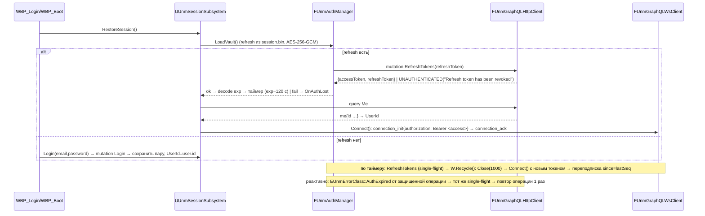
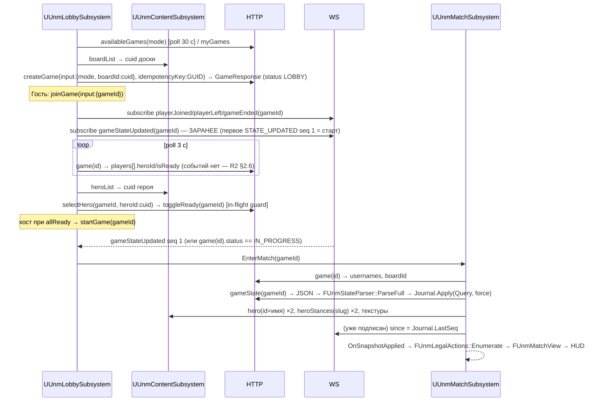
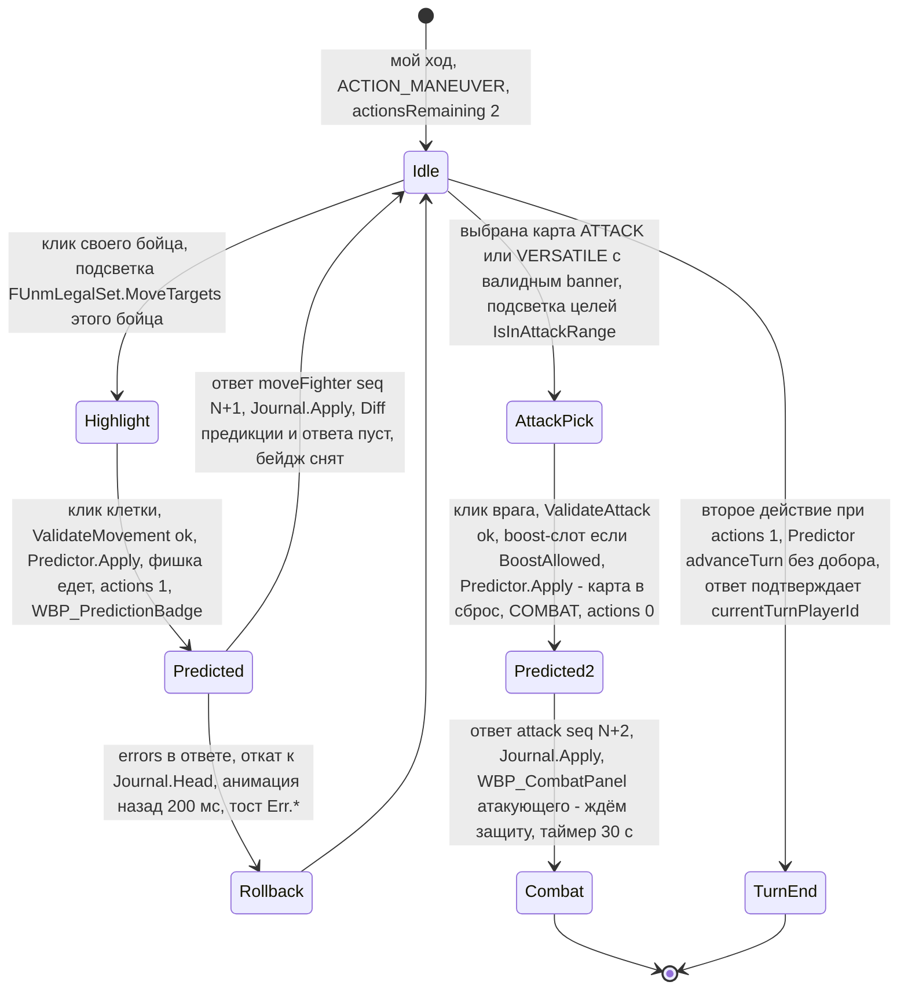
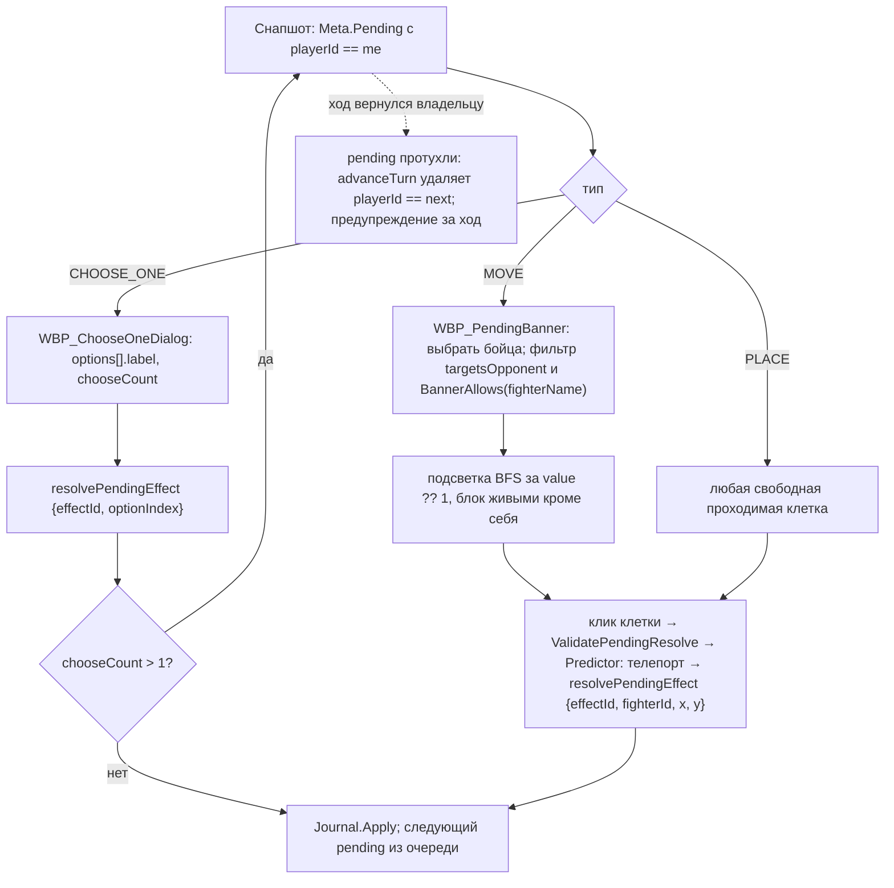

# Кандидат 2 — «Предиктивный клиент с зеркалом правил» (UE 5.8.2)

> Архитектор №2. Дата: 2026-09-02. Ветка: `fix/admin-panel`.
> Источники: `docs/unreal/00-mcp-verification.md`, `docs/unreal/_research/R1…R9`, точечная сверка с кодом `backend/src/**` (ссылки вида `файл:строка` от корня репозитория `C:/Users/ren/WebstormProjects/unmached/unmached/`), исходники UE 5.8.2 (`$UE` = `C:\Program Files\Epic Games\UE_5.8\Engine`, по R8).
> Всё, что не подтверждено источником, помечено «не найдено» или «предложение». Оценки трудоёмкости — экспертные, с явными допущениями (§7).

---

## 1. Резюме подхода и целевые ограничения

### 1.1. Идея в одном абзаце

Сервер остаётся единственным арбитром (`GameActionExecutorService` — «валидация → выполнение → `ActionResult`», ровно +1 `sequenceNumber` на мутацию; R4 §2.1, `backend/src/game-engine/services/game-action-executor.service.ts`). Клиент на UE 5.8 при этом получает **зеркало клиентской части правил** — модуль `UnmatchedRules` на чистом C++ (без `UObject`, `UWorld`, GC), который повторяет функции бэкенда 1:1 по строкам кода: BFS-досягаемость, смежность, legacy-зона, валидаторы манёвра/движения/атаки/защиты/scheme, banner-матчинг, таблицу дальностей/стоек/буста героев. Зеркало даёт три вещи: (а) **мгновенную подсветку** легальных ходов без круга к серверу; (б) **предикцию** — локальное применение своего действия до ответа сервера с гарантированным откатом по `sequenceNumber`; (в) **фундамент офлайн-режима против бота** (v2), где то же ядро становится локальным «рефери». Честность подхода обеспечивается **паритет-тестами**: каждая функция зеркала проверяется против фикстур, экспортированных с бэкенда, и любое расхождение «предикция ≠ ответ сервера» логируется как дефект зеркала, а не как ошибка игрока.

### 1.2. Что зеркало делает и чего не делает (граница честности)

| Зеркало **умеет** (детерминировано по доступному клиенту состоянию) | Зеркало **не умеет** (скрытая информация / серверная логика) — только «приблизительная оценка» или ожидание сервера |
|---|---|
| Досягаемость движения (BFS 4-связность, блокировка живыми бойцами, wall/obstacle/закрытая дверь) — `backend/src/game-engine/engine/adjacency.service.ts:90-150` | Результат добора карты (манёвр, `advanceTurn`, эффекты `DRAW_CARD`) — колода перетасована на сервере |
| Валидность манёвра (длина пути ≤ `movement + boostValue`, шаги манхэттен 1, конечная клетка свободна) — `backend/src/game-engine/validators/game-rules.validator.ts:278-372`, `game-action-executor.service.ts:796-812` | Итог боя при чужой карте защиты/атаки (карта соперника скрыта до розыгрыша; `DURING_COMBAT`-эффекты, `VALUE_PER_COUNT`) — R4 §2.8 |
| Легальные цели атаки: melee (манхэттен 1), ranged (смежная или совпадение legacy `cell.zone`), `attackRange` героя/стойки (T-Rex 2, Bullseye 5, Ms. Marvel 2, Ali FLOAT 2) — `game-action-executor.service.ts:1008-1058`, `adjacency.service.ts:214-218`, `generic-hero-ability.handler.ts:635-645` | Реактивные хуки других героев (Tomoe «покинул зону» → урон; Dracula/Medusa turn-damage; Achilles сброс 2 карт) — показываются по диффу авторитетного снапшота |
| Тип карты/banner для атаки/защиты/scheme — `game-rules.validator.ts:135-215, 440-466, 559-604`, `game-action-executor.service.ts:1296-1322` | `UNSUPPORTED`/`manualEffects` (не экспортируются в GraphQL — R4 §2.1) |
| Разрешён ли BOOST из руки (эффект `BOOST` с `PLAYER_CHOICE_HAND`/null или `allowsAttackBoost` у `king-arthur`) — `game-action-executor.service.ts:136-154`, `abilities/heroes/arthur.handler.ts:22-30` | Auto-resolve по таймауту (серверный BullMQ, 30 с; урон не применяется — `combat-timeout.service.ts:260-277` по R4 §2.7.4) |
| Экономика «2 действия за ход», авто-передача хода после второго действия (без добора) — `game-state.model.ts:165-175`, R4 §2.3 | Зачем ходил бот (VS_AI) — только серия авторитетных снапшотов |
| Резолв `pendingEffects` MOVE/PLACE (BFS-радиус `value ?? 1`, `fighterName` через `bannerAllows`, `targetsOpponent`) — `game-action-executor.service.ts:432-520` | Что породит `CHOOSE_ONE` (эффекты опции исполняет сервер) |

Практическое следствие: **предикция включается только для действий из левой колонки**, остальные ждут авторитетного ответа (§3.5.4).

### 1.3. Целевые ограничения (жёсткие факты контракта, которые архитектура обязана соблюдать)

1. Один endpoint `/graphql` (порт 3000): HTTP POST для queries/mutations, WebSocket с субпротоколом **`graphql-transport-ws`** для подписок; токен в `Authorization: Bearer` и в `connection_init.payload.authorization`; `connection_init` не позже 3 с (иначе 4408); `connection_ack` **не** означает валидность токена — ошибка приходит на `subscribe` (R1 §2.4).
2. Ошибки — в теле при HTTP 200/400; `code` читать из `extensions.code` **и** верхнеуровневого `code`; в production `UNAUTHENTICATED` маскируется под `INTERNAL_SERVER_ERROR` → обязателен проактивный refresh по `exp` из JWT (R1 §2.10, `backend/src/graphql/graphql.module.ts:60-103`).
3. `GameMutationResult.state` и `gameState.state` — одна JSON-строка полного состояния; `gameStateUpdated` — пять JSON-строк **без** `decks`/`discardPiles` (R3 §2.11). Дедупликация и gap-детект по `sequenceNumber`; закрытие gap — только повторный `gameState` (R3 §2.13 п.7).
4. Скаляры: `DateTime` в GraphQL-полях — epoch-миллисекунды; даты внутри JSON состояния — ISO-строки; ряд полей — `Float`, а не `Int` (`since`, `sinceSequence`, `gameSequence`, `GameStateResponse.sequenceNumber/turnCount`, `seatOrder`, `version`) (R3 §2.4).
5. `selectHero(heroId)` и `createGame(boardId)` принимают Prisma cuid, которые публичные `heroes/boards` не отдают (`id = name`); cuid — только из `heroList`/`boardList` под JWT (R6 §2.4).
6. `idempotencyKey` есть только у `createGame`; `ValidationPipe` с `forbidNonWhitelisted` отклоняет лишние поля (R1 §2.12, R2 §2.1).
7. Матчмейкинг и presence по коду неработоспособны (нет guard'ов, `user.userId` vs `id`, нет `GamePlayer` после `acceptMatch`) — в клиенте за feature-flag до серверного фикса (R2 §4 п.1, 3, 4).
8. WebP нативно не импортируется и не декодируется в UE 5.8 (`$UE/Source/Runtime/ImageWrapper/Public/IImageWrapper.h:26-66`; R8 §2.9) при 276 WebP-ассетах и Supabase-URL в БД (R9 §2.1, R5 §2.12).
9. Unreal MCP — встроенный экспериментальный плагин, loopback, один открытый проект = один сервер, C++ собирается вне MCP (`docs/unreal/00-mcp-verification.md:5-14, 56-60`).

### 1.4. Платформы и объём MVP

- Основная платформа — **Win64** (всё есть локально, R8 §2.15); Mac/iOS/Android — v2 после проверки SDK; Linux — только кросс-компиляция.
- MVP: **Medusa vs King Arthur**, лобби (список/создание/присоединение по `gameId`) → комната (герой/готовность/старт) → партия (ход из 2 действий, бой с окном защиты 30 с, pending-эффекты MOVE/PLACE/CHOOSE_ONE, стойки как HUD-заготовка). Пара выбрана не случайно: Medusa — ranged герой с 3 сайдкиками «Harpies» и turn-start-уроном (проверяет legacy-зону, banner «Harpy» ↔ «Harpies 1», авто-хук), King Arthur — melee с `allowsAttackBoost` и ranged-сайдкиком Merlin (проверяет BOOST-слот в атаке и смешанные типы атаки) — R5 §2.8, `abilities/heroes/arthur.handler.ts:22-30`.

---

## 2. Структура проекта

### 2.1. Расположение и `.uproject`

Предложение: отдельный каталог в этом же репозитории `unreal/UnmatchedClient/` (ассеты — Git LFS; см. риск в §8), чтобы фикстуры паритет-тестов и экспорт контента лежали рядом с бэкендом.

```
unreal/UnmatchedClient/
├── UnmatchedClient.uproject
├── Config/
│   ├── DefaultEngine.ini            # GameViewportClient=CommonGameViewportClient, [WebSockets], [HTTP]
│   ├── DefaultGame.ini              # [/Script/UnmatchedNet.UnmNetSettings] — см. §2.4
│   ├── DefaultInput.ini             # Enhanced Input по умолчанию
│   ├── DefaultGameplayTags.ini      # UI.Layer.*, Input.Mode.*, Unm.Action.*
│   └── DefaultEditorPerProjectUserSettings.ini  # блок ModelContextProtocol (порт 8123, /mcp)
├── Source/
│   ├── UnmatchedRules/              # чистое C++ ядро правил (Core, Json)                      — §3.5
│   ├── UnmatchedNet/                # GraphQL HTTP/WS, auth, DTO, синхронизация (HTTP, WebSockets, Json, JsonUtilities, PlatformCrypto)
│   ├── UnmatchedClient/             # основной игровой модуль: субсистемы, акторы, UI-базы (CommonUI, EnhancedInput, UMG)
│   ├── UnmatchedClientEditor/       # редакторский модуль: коммандлеты импорта контента, генерация DataTable, MCP-хелперы
│   └── UnmatchedClient.Target.cs / UnmatchedClientEditor.Target.cs
├── Content/                          # см. §2.3
├── Plugins/
│   └── UnmWebP/                      # (v1, опционально) тонкая обёртка libwebp для рантайм-декодирования — §3.8.3
└── Tools/
    ├── export-rules-fixtures.mjs     # (предложение) экспорт фикстур паритета с бэкенда → Content/Tests/Fixtures
    ├── export-content-tables.mjs     # GraphQL → JSON/CSV для DataTable (арт, дальности, стойки)
    └── convert-assets.mjs            # sharp: webp/avif → png, нормализация 512×716 / 1024×1432
```

`UnmatchedClient.uproject` (ключевые поля):

```json
{
  "FileVersion": 3,
  "EngineAssociation": "5.8",
  "Modules": [
    { "Name": "UnmatchedRules",  "Type": "Runtime", "LoadingPhase": "PreDefault" },
    { "Name": "UnmatchedNet",    "Type": "Runtime", "LoadingPhase": "PreDefault" },
    { "Name": "UnmatchedClient", "Type": "Runtime", "LoadingPhase": "Default" },
    { "Name": "UnmatchedClientEditor", "Type": "Editor", "LoadingPhase": "PostEngineInit" }
  ],
  "Plugins": [
    { "Name": "CommonUI", "Enabled": true },
    { "Name": "EnhancedInput", "Enabled": true },
    { "Name": "PlatformCrypto", "Enabled": true },
    { "Name": "ModelContextProtocol", "Enabled": true, "TargetAllowList": ["Editor"] },
    { "Name": "AllToolsets", "Enabled": true, "TargetAllowList": ["Editor"] },
    { "Name": "FunctionalTestingEditor", "Enabled": true, "TargetAllowList": ["Editor"] },
    { "Name": "ModelViewViewModel", "Enabled": false },
    { "Name": "GameFeatures", "Enabled": false },
    { "Name": "Paper2D", "Enabled": false }
  ]
}
```

Обоснование: CommonUI — стек экранов и input routing (`$UE/Plugins/Runtime/CommonUI/CommonUI.uplugin`, `IsBetaVersion: false`; R8 §2.6); Enhanced Input включён по умолчанию (R8 §2.7); PlatformCrypto — AES-256-GCM для refresh-токена (R8 §2.10); MCP/AllToolsets — только Editor (`NoRedist: true` у ModelContextProtocol; R8 §2.16); MVVM/GameFeatures — Beta и избыточны для одного клиента (R8 §2.13); Paper2D не нужен — доска в 3D + UMG (R8 §2.8).

### 2.2. Модули и зависимости (`.Build.cs`)

| Модуль | `PublicDependencyModuleNames` | Что внутри | Правило |
|---|---|---|---|
| `UnmatchedRules` | `Core`, `Json` | `Unm::Rules` — модель состояния (plain structs), парсер JSON → модель, геометрия, валидаторы, таблица способностей, перечислитель легальных действий, предиктор, оценка боя | **Запрещены** `CoreUObject`/`Engine`; никаких `UCLASS/USTRUCT`; проверяется `PrivateIncludePathModuleNames` + spec-тест «модуль не линкует CoreUObject» (по списку зависимостей в Build.cs) |
| `UnmatchedNet` | `Core`, `CoreUObject`, `Engine`, `HTTP`, `WebSockets`, `Json`, `JsonUtilities`, `PlatformCrypto`, `UnmatchedRules` | GraphQL HTTP-клиент, graphql-transport-ws клиент, менеджер токенов, DTO (USTRUCT), реестр операций, журнал снапшотов, реконнект | Сеть только здесь; UI сюда не смотрит |
| `UnmatchedClient` | `Core`, `CoreUObject`, `Engine`, `InputCore`, `UMG`, `Slate`, `SlateCore`, `CommonUI`, `CommonInput`, `EnhancedInput`, `GameplayTags`, `UnmatchedNet`, `UnmatchedRules` | Субсистемы, ViewModel-объекты, акторы доски/бойцов, C++-базы виджетов, презентация | Blueprint-наследники живут в `Content/` |
| `UnmatchedClientEditor` | `UnrealEd`, `AssetTools`, `UnmatchedRules`, `UnmatchedNet` | Коммандлеты `UnmImportContent`, `UnmGenAbilityTable`, `UnmRunParity`; регистрация MCP-тулсета `UnmDevToolset` (Python в `Content/Python`) | Только редактор |

### 2.3. Папки `Content/` и конвенции именования

```
Content/Unmatched/
├── Core/            BP_UnmGameInstance, BP_UnmGameMode, BP_UnmPlayerController, GV_Common (viewport)
├── Maps/            L_Boot, L_Menu, L_Match, L_TestMatch (functional tests)
├── UI/
│   ├── Layers/      WBP_RootLayout (стек CommonUI: Game / GameMenu / Menu / Modal)
│   ├── Auth/        WBP_Login, WBP_Register
│   ├── Lobby/       WBP_Lobby, WBP_GameCard, WBP_CreateGameDialog, WBP_JoinByIdDialog
│   ├── Room/        WBP_Room, WBP_HeroPicker, WBP_HeroCard, WBP_PlayerSlot, WBP_ReadyBar
│   ├── Match/       WBP_MatchHud, WBP_PlayerPanel, WBP_TurnPhasePill, WBP_HandTray, WBP_Card, WBP_OpponentHand,
│   │                WBP_DeckDiscard, WBP_CardInspector, WBP_CombatPanel, WBP_PendingBanner, WBP_ChooseOneDialog,
│   │                WBP_StanceSwitch, WBP_ActionLog, WBP_ConnectionBadge, WBP_PredictionBadge, WBP_GameOver, WBP_LeaveConfirm
│   ├── Common/      WBP_Toast, WBP_Modal, WBP_Spinner, WBP_Button (CommonButtonBase-стиль), CommonTextStyles, CommonBorderStyles
│   └── Styles/      DA_UnmTheme (цвета из §3.7.4), F_Inter (Font Face + Font)
├── Board/           BP_BoardActor, BP_FighterActor, BP_HighlightActor, BP_TableCamera, M_Cell, MI_Cell_<zone>, M_Highlight, SM_CellDisc, SM_TokenBase
├── Data/            DT_AbilityMirror (FUnmAbilityRow), DT_CardArt (FUnmCardArtRow), DT_HeroArt, DT_BoardArt, DT_ServerErrorMap, ST_UI (StringTable)
├── Art/             T_Card_<heroSlug>_<cardSlug>_EN|RU, T_Hero_<heroSlug>_Avatar|Mini|Cover, T_Board_<boardSlug>, T_UI_* (по R9 §2.13 п.6)
├── Input/           IA_Select, IA_Cancel, IA_EndTurn, IA_Pass, IA_ZoomAxis, IA_PanAxis, IMC_Match, IMC_Menu
└── Tests/           Fixtures/*.json (паритет), FT_* (Functional Test акторы)
```

Именование: классы C++ с префиксом `Unm` (`UUnmSessionSubsystem`, `FUnmGraphQLWsClient`, `AUnmBoardActor`), plain-структуры ядра — `FUnm*` в `namespace Unm::Rules`; Blueprint `BP_`, виджеты `WBP_`, таблицы `DT_`, текстуры `T_`, материалы `M_`/`MI_`, Input Actions `IA_`, контексты `IMC_`, уровни `L_`. Gameplay-теги: `UI.Layer.Game|GameMenu|Menu|Modal`, `Input.Mode.Menu|Match`, `Unm.Action.Move|Maneuver|Attack|Defense|Scheme|Pending|Stance|EndTurn|Pass|Resolve`.

### 2.4. Конфигурация (`DefaultGame.ini`, `DefaultEngine.ini`)

```ini
[/Script/UnmatchedNet.UnmNetSettings]
ApiBaseUrl=http://localhost:3000            ; R1 §2.1: порт 3000, путь /graphql
GraphQLPath=/graphql
AssetBaseUrl=http://localhost:5174          ; корневые /assets/… раздаёт веб-фронт (R6 §3 п.5, R9 §2.1)
HttpTimeoutSeconds=15                       ; HttpTotalTimeout по умолчанию 0 (R8 §2.2) — задаём явно
HttpRetryAttempts=3                         ; эталон веб-клиента 300 мс → 10 с с jitter (R1 §2.15)
HttpRetryInitialMs=300
HttpRetryMaxMs=10000
WsConnectionAckTimeoutSeconds=5             ; сервер ждёт init 3 с (4408); ack ждём 5 с
WsAppPingIntervalSeconds=25                 ; прикладной {"type":"ping"}; серверный ping-фрейм каждые 12 с (R1 §2.4)
WsReconnectMaxAttempts=5                    ; 1 с × 2^n (эталон SubscriptionHandler, R7 §2.7)
WsReconnectBaseDelayMs=1000
RefreshLeadSeconds=120                      ; проактивный refresh за 2 мин до exp (R1 §2.6 п.14)
DefenseTimeoutSeconds=30                    ; жёстко 30 на сервере (game-actions.resolver.ts:173-178)
AutoResolveAfterTimeout=true                ; атакующий сам вызывает resolveCombat в COMBAT_RESOLVE (R3 §3 п.8)
PredictionEnabled=true
PredictionMismatchIsError=false             ; в dev — true (падать в тестах при расхождении зеркала)
EnableMatchmaking=false                     ; R2 §4 п.1, 3 — до серверного фикса
EnablePresenceHeartbeat=false               ; R2 §4 п.1
MaxActiveGames=5                            ; MaxActiveGamesException (R2 §2.3)

[/Script/Engine.Engine]
GameViewportClientClassName=/Script/CommonUI.CommonGameViewportClient   ; требование CommonUI (R8 §2.6)

[WebSockets]
TextMessageMemoryLimit=8388608              ; дефолт 1 МБ (R8 §2.3); state с decks/эффектами может быть сотни КБ

[WebSockets.LibWebSockets]
PingPongInterval=0                          ; WS-ping на уровне LWS не используем; liveness — прикладной ping (R8 §2.3)

[HTTP]
HttpConnectionTimeout=10
HttpActivityTimeout=30
```

`DefaultEditorPerProjectUserSettings.ini`: тот же блок `[/Script/ModelContextProtocolEngine.ModelContextProtocolSettings]` с `ServerPortNumber=8123`, `ServerUrlPath=/mcp`, `bAutoStartServer=True`, `bEnableToolSearch=True` (`docs/unreal/00-mcp-verification.md:12`). Один открытый редактор = один MCP-сервер, поэтому `MCPProject` и `UnmatchedClient` одновременно не открывать (или менять порт).

---

## 3. Слои и классы

### 3.1. Обзор слоёв

```
┌──────────────────────────── UnmatchedClient (UObject-мир) ────────────────────────────┐
│ UI (CommonUI/UMG, WBP_*)  ←  ViewModel (UUnmMatchViewModel, UUnmLobbyViewModel)       │
│ Презентация: AUnmBoardActor, AUnmFighterActor, AUnmHighlightActor, AUnmTableCamera    │
│ Субсистемы: UUnmSessionSubsystem, UUnmContentSubsystem, UUnmLobbySubsystem,           │
│             UUnmMatchSubsystem, UUnmPresenceSubsystem, UUnmUIManagerSubsystem (LP)    │
├──────────────────────────── UnmatchedNet (UObject-совместимо) ────────────────────────┤
│ FUnmGraphQLHttpClient  FUnmGraphQLWsClient  FUnmAuthManager  FUnmTokenVault           │
│ FUnmOperations (документы)  FUnmGqlError  FUnmStateJournal  FUnmResyncController      │
│ USTRUCT DTO: FUnmGql*, FUnmIn*  |  UUnmNetSettings (UDeveloperSettings)                │
├──────────────────────────── UnmatchedRules (чистый C++) ──────────────────────────────┤
│ Unm::Rules::{FGameState,…}  FUnmStateParser  FUnmGeometry  FUnmValidator               │
│ FUnmAbilityTable  FUnmLegalActions  FUnmPredictor  FUnmCombatPreview  FUnmDiff         │
└────────────────────────────────────────────────────────────────────────────────────────┘
```

Поток данных: сеть → `FUnmStateParser` → `Unm::Rules::FGameState` → `FUnmStateJournal` (авторитетные снапшоты по `seq`) → `UUnmMatchSubsystem` (объединяет авторитетное и предсказанное) → `UUnmMatchViewModel` (делегаты `OnStateChanged`, `OnDiff`) → виджеты/акторы. Обратный поток: ввод → `UUnmMatchSubsystem::TryAction(FUnmActionIntent)` → `FUnmLegalActions`/`FUnmValidator` (мгновенный отказ с локализованной причиной) → `FUnmPredictor` (предсказанный снапшот) → `FUnmGraphQLHttpClient` (мутация) → согласование по `sequenceNumber`.

### 3.2. Субсистемы (GameInstance / World / LocalPlayer)

| Класс | База | Ответственность | Ключевые методы / делегаты |
|---|---|---|---|
| `UUnmSessionSubsystem` | `UGameInstanceSubsystem` | Вход/регистрация/выход, `me`, хранение `UserId`, проактивный refresh, пересоздание WS после refresh | `Login(Email,Password)`, `Register(...)`, `Logout()`, `RestoreSession()`, `GetUserId()`, `OnSessionChanged`, `OnAuthLost(Reason)` |
| `UUnmNetSubsystem` | `UGameInstanceSubsystem` | Владеет `FUnmGraphQLHttpClient`, `FUnmGraphQLWsClient`, `FUnmAuthManager`; единая точка `Execute(op)`/`Subscribe(op)` | `ExecuteAsync<T>(const FUnmOperation&, Vars) → TFuture<FUnmResult<T>>`, `Subscribe(op, Vars, OnNext, OnError, OnComplete) → FUnmSubscriptionHandle`, `OnConnectivityChanged(EUnmConnectivity)` |
| `UUnmContentSubsystem` | `UGameInstanceSubsystem` | Каталог героев/досок (публичные query), карты `name → cuid` (`heroList`/`boardList`), `heroStances` по слагу, резолвер URL ассетов и дисковый кэш текстур, таблицы `DT_AbilityMirror`/`DT_CardArt` | `EnsureCatalog()`, `GetHeroCuid(Name)`, `GetBoardCuid(Name)`, `GetHeroByAnyId(cuid|name)`, `GetStances(HeroSlug)`, `RequestTexture(Url, OnReady)`, `OnCatalogReady` |
| `UUnmLobbySubsystem` | `UGameInstanceSubsystem` | `availableGames` (poll 30 с), `myGames`, `createGame`/`joinGame`/`leaveGame`/`abortGame`, комната: poll `game(id)` 3 с, `selectHero`, `toggleReady` (с in-flight guard), `startGame`; подписки `playerJoined/playerLeft/gameEnded`; ранняя подписка `gameStateUpdated` до `startGame` (сигнал старта — seq 1) | `RefreshAvailable(Mode)`, `CreateGame(Mode, BoardCuid)`, `JoinGame(GameId)`, `EnterRoom(GameId)`, `SelectHero(Cuid)`, `ToggleReady()`, `StartGame()`, `OnRoomUpdated`, `OnGameStarted(GameId)` |
| `UUnmMatchSubsystem` | `UGameInstanceSubsystem` | Загрузка партии (`game` → `gameState` → контент), `FUnmStateJournal`, подписка `gameStateUpdated(since)` + `gameEnded`, реконнект/resync, предикция и согласование, таймер защиты, буфер серии снапшотов (VS_AI), выход/освобождение слота после `GAME_OVER` | `EnterMatch(GameId)`, `LeaveMatch()`, `TryAction(FUnmActionIntent) → FUnmTryResult`, `GetView() → const FUnmMatchView&`, `OnSnapshotApplied(seq, source)`, `OnDiff(FUnmStateDiff)`, `OnActionRejected(FUnmRejection)`, `OnPredictionMismatch(FUnmMismatchReport)` |
| `UUnmPresenceSubsystem` | `UGameInstanceSubsystem` | `heartbeat` каждые 90 с (TTL 300 с), статусы `ONLINE/INGAME/INQUEUE` — **выключено** флагом `EnablePresenceHeartbeat` до серверного фикса (R2 §3 п.35) | `SetStatus(EUnmPresenceStatus, CurrentGameId)` |
| `UUnmMatchmakingSubsystem` | `UGameInstanceSubsystem` | `penaltyInfo` → `matchFound(userId)` до `joinQueue` → poll `queueStatus` 5 с → `acceptMatch`/`declineMatch` → poll `game(id).status`; **выключено** флагом `EnableMatchmaking` (R2 §3 п.24-32) | `JoinQueue(Mode)`, `LeaveQueue()`, `Accept()`, `Decline()`, `OnMatchFound`, `OnQueueTimedOut` |
| `UUnmUIManagerSubsystem` | `ULocalPlayerSubsystem` | Стек CommonUI (`UCommonActivatableWidgetStack` на слой), тосты, модалки, `FUIInputConfig` по слою (`Menu` для меню, `All` в партии) | `PushToLayer(Tag, WidgetClass)`, `PopFromLayer(Tag)`, `ShowToast(FText, Severity)`, `ShowModal(Class) → Handle` |
| `UUnmBoardWorldSubsystem` | `UWorldSubsystem` | Спавн/обновление `AUnmBoardActor`/`AUnmFighterActor`/`AUnmHighlightActor` по `FUnmMatchView`, проигрывание диффов как анимаций (очередь), выбор клеток/бойцов через трассировку | `BindToMatch(UUnmMatchSubsystem*)`, `PlayDiff(FUnmStateDiff) → TFuture<void>`, `SetHighlights(FUnmHighlightSet)` |

Все субсистемы — `GameInstance`-уровня, т.к. партия переживает смену карт (`L_Menu` ↔ `L_Match`), а WS-соединение должно жить между экранами (лобби уже подписано на `gameStateUpdated` до старта — R2 §3 п.9).

### 3.3. Сетевой слой (`UnmatchedNet`)

#### 3.3.1. `FUnmGraphQLHttpClient`

- Транспорт: `FHttpModule::Get().CreateRequest()` → `POST {ApiBaseUrl}{GraphQLPath}`, заголовки `Content-Type: application/json`, `Authorization: Bearer <access>` (для публичных операций заголовок не шлём), тело `{"query","variables","operationName"}`; `SetTimeout(HttpTimeoutSeconds)`; делегат `OnProcessRequestComplete` на game thread (`$UE/Source/Runtime/Online/HTTP/Private/GenericPlatform/HttpRequestCommon.h:142`; R8 §2.2). `Origin` не отправляем (нативный клиент проходит CORS безусловно — `backend/src/main.ts:105-122` по R1 §2.3).
- Ответ анализируется по телу независимо от статуса (200 при ошибках резолверов, 400 при валидации — R1 §2.3): `FUnmGqlEnvelope { TSharedPtr<FJsonObject> Data; TArray<FUnmGqlError> Errors; int32 HttpCode; }`.
- `FUnmGqlError { FString Message; FString Code /* extensions.code ?? code ?? "" */; int32 Status /* extensions.status ?? originalError.statusCode ?? 0 */; TArray<FString> OriginalMessages /* originalError.message[] */; TArray<FString> Path; }` — парсер терпим к prod-формату без `extensions` (`graphql.module.ts:60-103`).
- Классификация `EUnmErrorClass`: `AuthExpired` (код `UNAUTHENTICATED` или сообщение ∈ {«Неавторизованный доступ», «Token revoked», «Пользователь не найден»} и операция защищённая), `InputError` (`BAD_REQUEST`/`BAD_USER_INPUT`/`GRAPHQL_VALIDATION_FAILED`, а также `UNAUTHENTICATED` от `login`/`changePassword`), `Conflict` (status 409 — `MaxActiveGames`, `Concurrent modification`, `GameAccessDenied`), `NotFound` (404), `Forbidden`, `RateLimited` (429/`THROTTLED`/`TOO_MANY_REQUESTS` — сейчас не выдаётся, R2 §2.14), `Network`, `Server`.
- Ретраи (`FUnmRetryPolicy`): только `query` и только при `Network`/`Server` — 3 попытки, 300 мс → 10 000 мс, jitter; **мутации не ретраятся никогда** (веб-ловушка `retryIf` — R7 §2.13 п.18); `ConcurrentModification` → `UUnmMatchSubsystem` делает `refetch gameState` и предлагает повтор пользователю.
- Клиентский лимитер `FUnmRateLimiter` (token bucket по классу операции): `login 10/мин`, `register 5/мин`, `refreshTokens 3/мин`, `createGame 10`, `joinGame 15`, `toggleReady 20`, `selectHero 10`, `startGame/abortGame 5`, `attack/playDefense/playScheme/resolveCombat/pass 20`, `maneuver/moveFighter/endTurn/toggleDoor/setStance/resolvePendingEffect 30` — по объявленным `@Throttle` (R3 §2.1), хотя `ThrottlerGuard` не привязан (R1 §2.11).
- Тестируемость: конструктор принимает `TSharedRef<IUnmHttpTransport>` (реализация над `IHttpRequest` и фейк для spec-тестов).

#### 3.3.2. `FUnmGraphQLWsClient` (graphql-transport-ws)

Создание: `FWebSocketsModule::Get().CreateWebSocket(WsUrl, TEXT("graphql-transport-ws"))` (`$UE/Source/Runtime/Online/WebSockets/Public/WebSocketsModule.h:72`; субпротокол обязателен — иначе close 4406, R1 §2.4). `OnMessage` биндится **до** `Connect()` (`$UE/.../Private/Lws/LwsWebSocket.h:327-341`). Все вызовы — на game thread.

Машина состояний:

```
Idle ──Connect()──▶ Connecting ──OnConnected──▶ InitSent ──connection_ack──▶ Ready
  ▲                     │                            │(ack timeout 5 с)         │
  │                     │OnConnectionError           ▼                          │
  │                     └──────────────────────▶ Backoff(n) ◀── OnClosed(code) ─┘
  │                                                  │ n<5: wait 1000·2^(n-1) мс → Connecting
  └──────────── n>=5 → Failed (UI: «Переподключиться») ┘
```

- В `InitSent` отправляется `{"type":"connection_init","payload":{"authorization":"Bearer <access>"}}` немедленно после `OnConnected` (окно 3 с — `server-3ewaJSjp.js:12` по R1 §2.4).
- В `Ready` — таблица активных операций `TMap<FString /*id*/, FUnmSubscription>`; `id` = `FGuid::NewGuid().ToString(EGuidFormats::Short)`; `subscribe {id, payload:{query, variables, operationName}}`; маршрутизация `next/error/complete` по `id`; при `next` с `payload.errors` (форма ошибки guard'а на WS — R1 §2.4) → `OnError` подписки + классификация `AuthExpired` по тексту.
- `ping` от сервера → `pong` немедленно; собственный прикладной `ping` каждые `WsAppPingIntervalSeconds`; отсутствие `pong` 2 интервала подряд → закрыть и реконнект.
- Close-коды: `4400/4401/4409/4429` — ошибка клиента (лог `LogUnmNet` Error, без реконнекта, `ensure` в dev); `4406` — конфигурация субпротокола (без реконнекта); `4408` — ретрай; `4500/1001/1006/1011` — Backoff; `1000` от себя — штатно.
- После `Ready` — автоматическая переподписка всех активных операций (для `gameStateUpdated` переменная `since` подставляется из `FUnmStateJournal::LastSeq()`), затем `UUnmMatchSubsystem::Resync()` (§3.4.4).
- После успешного refresh токена — `Recycle()`: штатный `Close(1000)`, новый `connection_init` с новым токеном, переподписка (веб этого не делает — R7 §2.13 п.17).
- Абстракция `IUnmSocket` (Connect/Close/Send/делегаты) над `IWebSocket` — для spec-тестов машины состояний без сети.

#### 3.3.3. `FUnmAuthManager` и `FUnmTokenVault`

- В памяти: `AccessToken`, `AccessExp` (base64url-декод payload JWT без проверки подписи, поле `exp`), `RefreshToken`, `UserId` (`sub`).
- На диске (`FUnmTokenVault`): только `RefreshToken` + `UserId` + `Email`, файл `Saved/Unm/session.bin`, шифрование `PlatformCrypto` `Encrypt_AES_256_GCM` (`$UE/Plugins/Experimental/PlatformCrypto/.../EncryptionContextOpenSSL.h:189-201`), nonce случайный на запись; ключ: на Windows — из DPAPI (`CryptProtectData`, собственная обёртка `#if PLATFORM_WINDOWS` в `UnmPlatformSecret.cpp`; в движке обёрток нет — R8 §2.10), на прочих платформах v1 — ключ, производный от `FPlatformMisc::GetDeviceId()` + соль (честно: слабее DPAPI, помечено риском §8).
- Проактивный refresh: таймер на `AccessExp − RefreshLeadSeconds`; при срабатывании — `refreshTokens(refreshToken)` single-flight (`TSharedPtr<TPromise<bool>> InFlight`), очередь ожидающих операций повторяется после успеха; неуспех любой природы → `OnAuthLost` → экран входа (сообщения `Invalid refresh token` / `has been revoked` / `expired` — R1 §2.6).
- Реактивный refresh: по `EUnmErrorClass::AuthExpired` от защищённой операции — тот же single-flight, затем повтор операции один раз.
- `logout`: только при валидном access (иначе серверный `user?.id = undefined` — R1 §4 п.9); локальная очистка всегда; помнить, что сервер отзывает refresh на всех устройствах.
- Различение по операции: `UNAUTHENTICATED` от `Login`/`ChangePassword` — `InputError`, а не refresh (R1 §3 п.16).

#### 3.3.4. Идемпотентность и защита от дублей

- `createGame` — `idempotencyKey = FGuid::NewGuid().ToString(EGuidFormats::DigitsWithHyphensLower)` (глобально уникален в БД — `prisma/schema.prisma:204` по R2 §2.3).
- `joinGame`, `joinQueue`, `leaveQueue`, `leaveAllQueues` — без `idempotencyKey` (аргумента нет в схеме — R1 §2.12).
- `toggleReady` инвертирует флаг — клиентский in-flight guard (`bReadyRequestInFlight`) и чтение `players[].isReady` из ответа; повтор по сети запрещён (R2 §3 п.11).
- Gameplay-мутации — одна в полёте на партию (`UUnmMatchSubsystem::PendingAction`), UI блокирует остальные (аналог `busy` в веб-`GameView`, R7 §2.8).
- Заголовок `X-Idempotency-Key` не шлём (сервер не читает — R1 §2.12).

#### 3.3.5. Реестр операций `FUnmOperations`

Документы GraphQL — константы `FStringView` в `UnmOperations.h`, сгруппированы по доменам; имена операций совпадают с веб-клиентом там, где они PROD (R7 §2.4), но без невалидных аргументов:

| Группа | Операции (operationName → корневое поле, выборка) |
|---|---|
| Auth | `Login(input:LoginDto!)`, `Register(input:RegisterDto!)`, `RefreshTokens(refreshToken:String!)` → `{accessToken refreshToken user{id email username avatar role}}`, `Logout`, `Me` → `me{id email username avatar role createdAt emailVerified settings{theme language soundEnabled musicEnabled profileVisible showOnlineStatus}}`, `UpdateSettings(input:SettingsDto!)` |
| Content | `ContentSummary`, `HeroesPaginated(page,limit,set)` без `cards`, `HeroDetails(id)` → `hero{id name nameEn nameRu health movement set fighterType sidekickCount abilities{id name text trigger} urls{avatar mini cardCover} avatarUrl imageUrl cards{id title type value boost quantity characterName imageUrl imageUrlRu effects{id text}}}` (**без** `effects{timing}` — R5 §4 п.1), `Boards` → `boards{id name width height recommendedPlayers imageUrl spaces{position{x y} zones isObstacle}}`, `HeroStanceOptions(heroSlug)`, `HeroList(page:1,limit:300,sortBy:"name",sortOrder:"asc")` → `heroList{items{id name nameEn nameRu set health fighterType avatarUrl imageUrl}}`, `BoardList(page:1,limit:100,...)` → `boardList{items{id name set width height imageUrl}}` (R6 §2.4) |
| Lobby | `AvailableGames(mode:String,limit:Float)`, `MyGames(filters)`, `GetGame(id)` → полный `GameResponse` (`players{id userId username avatar heroId isReady hasPassed seatOrder}`), `CreateGame(input,idempotencyKey)`, `JoinGame(input:{gameId})`, `LeaveGame(gameId)`, `AbortGame(gameId)`, `ToggleReady(gameId)`, `SelectHero(gameId,heroId)`, `StartGame(gameId)` |
| Match | `GetGameState(gameId)` → `{id gameId state sequenceNumber currentTurnPlayerId phase turnCount updatedAt}`, `GameSequence(gameId)`, `EventsSince(gameId,sinceSequence:Float!)`, 11 gameplay-мутаций с выборкой `{state sequenceNumber timestamp phase currentTurnPlayerId turnCount}` |
| Subscriptions | `GameStateUpdated(gameId:String!,since:Float)` → `{gameId sequenceNumber phase turnCount currentTurnPlayerId players fighters handZones boardState metadata}`, `GameEnded(gameId)`, `PlayerJoined(gameId)`, `PlayerLeft(gameId)`, `AttackInitiated/DefensePlayed/CombatResolved(gameId)` (для триггеров анимаций, payload без урона — R7 §4 п.8), `MatchFound(userId:String!)` (флаг) |
| Matchmaking / Presence (за флагами) | `JoinQueue(input:{mode,heroPref})`, `LeaveQueue(mode:String!)`, `LeaveAllQueues`, `QueueStatus(mode:String!)`, `PenaltyInfo`, `AcceptMatch(gameId)`, `DeclineMatch(gameId)`, `Heartbeat(input:{status,currentGameId})` |

Ограничения complexity 1000 / depth 7 (R1 §2.11) соблюдаются: самая глубокая выборка — `hero{cards{effects{...}}}` (глубина 4).

### 3.4. Модель данных

#### 3.4.1. UENUM (в `UnmatchedNet`, по GraphQL-именам) и plain-enum ядра

| UENUM (`UnmatchedNet`) | Значения | Источник |
|---|---|---|
| `EUnmGamePhase` | `SETUP, TURN_START, ACTION_MANEUVER, ACTION_ATTACK, COMBAT, COMBAT_RESOLVE, TURN_END, GAME_OVER, Unknown` | R3 §2.3.1 |
| `EUnmGameStatus` | `PENDING, LOBBY, IN_PROGRESS, PAUSED, FINISHED, ABORTED, Unknown` | R2 §2.2 |
| `EUnmGameMode` | `ONE_V_ONE, TWO_V_TWO, FREE_FOR_ALL, VS_AI` | R2 §2.2 |
| `EUnmGameEventType` | 22 значения `ATTACK_INITIATED … SPECIAL_ABILITY` + `Unknown` | R3 §2.3.1 |
| `EUnmUserRole` | `USER, ADMIN, MODERATOR` | R1 §2.7 |
| `EUnmPresenceStatus` | `OFFLINE, ONLINE, INGAME, INQUEUE` | R2 §2.2 |
| `EUnmContentCardType` | `ATTACK, DEFENSE, SCHEME, VERSATILE` (контентный) | R5 §2.3 |
| `EUnmContentFighterType` | `HERO, SIDEKICK` | R5 §2.3 |
| `EUnmZone` | `BLUE, GREEN, YELLOW, RED, PURPLE, BROWN, GRAY, ORANGE, PINK, WHITE, GOLD, BEIGE` | R5 §2.3 |

Plain `enum class` в `UnmatchedRules` (парсятся из строк JSON состояния; неизвестное → `Unknown`/`Unsupported`, не падать — R3 §3 п.4): `EFighterType {Hero, Minion, Huge}`, `EAttackType {Melee, Ranged}`, `ECardType {Attack, Defense, Scheme, Universal, Versatile, Maneuver}`, `EEffectType` (21: `ModifyAttack … ChooseOne, Unsupported`), `EEffectTiming` (8), `EEffectTarget` (10), `EConditionKind` (14), `ECountSource` (5), `EBoostSource` (3), `ECellType {Normal, Wall, Obstacle, Door, ZoneLine}`, `EPendingType {Move, Place, ChooseOne}`, `EEffectDuration {Permanent, Turn, Round}`, `EPhase` (зеркало `EUnmGamePhase`). Соответствие имён UENUM ↔ plain-enum фиксируется таблицей `UnmEnumBridge.h` и spec-тестом на равенство списков (защита от расхождения при добавлении значений).

#### 3.4.2. USTRUCT — GraphQL-обёртки (`UnmatchedNet`, десериализация `FJsonObjectConverter::JsonObjectToUStruct(..., bStrictMode=false, OutFailReason)`)

В UE нет мета-атрибута для переименования JSON-ключей у `UPROPERTY`, поэтому свойства именуются в PascalCase, а разбор делается **вручную** методами `FromJson(const TSharedPtr<FJsonObject>&)` через хелперы `FUnmJson::GetString/GetInt/GetEpochMs(Obj, TEXT("sequenceNumber"))`; `FJsonObjectConverter::JsonObjectToUStruct` допускается только для простых DTO и только после spec-теста на регистр ключей (открытый вопрос R8 §4 п.5). Ниже — поля и типы на проводе.

| USTRUCT | Поля (тип на проводе → тип в UE) |
|---|---|
| `FUnmGqlUser` | `id:String→FString`, `email`, `username`, `avatar:String?`, `role:UserRole→EUnmUserRole`, `createdAt:DateTime(epoch-ms)→int64`, `emailVerified:DateTime?→TOptional<int64>` |
| `FUnmGqlAuthResponse` | `accessToken:FString`, `refreshToken:FString`, `user:FUnmGqlUser` |
| `FUnmGqlUserSettings` | `id`, `theme`, `language`, `soundEnabled`, `musicEnabled`, `profileVisible`, `showOnlineStatus` (bool) |
| `FUnmGqlGamePlayer` | `id` (id записи GamePlayer), `userId`, `username`, `avatar?`, `heroId?` (cuid), `isReady:bool`, `hasPassed:bool`, `seatOrder:Float→int32` |
| `FUnmGqlGameResponse` | `id`, `code?`, `status→EUnmGameStatus`, `mode→EUnmGameMode`, `hostId`, `host:FUnmGqlGamePlayer`, `opponentId?`, `opponent?`, `boardId`, `boardState?:FString`, `createdAt/updatedAt:int64`, `startedAt?/endedAt?`, `winnerId?`, `version:Float→int32`, `players:TArray<FUnmGqlGamePlayer>`, `phase?→EUnmGamePhase`, `currentTurn?:int32` (ненадёжны для геймплея — R3 §4 п.16) |
| `FUnmGqlGameStateResponse` | `id`, `gameId`, `state:FString` (JSON), `sequenceNumber:Float→int32`, `currentTurnPlayerId?`, `phase:String→EUnmGamePhase`, `turnCount:Float→int32`, `updatedAt:int64` |
| `FUnmGqlMutationResult` | `state?:FString`, `sequenceNumber:Int`, `timestamp:DateTime→int64`, `phase→EUnmGamePhase`, `currentTurnPlayerId?`, `turnCount:Int` |
| `FUnmGqlStateUpdated` | `gameId`, `sequenceNumber:Int`, `phase`, `turnCount`, `currentTurnPlayerId` (non-null в схеме), `players/fighters/handZones/boardState/metadata:FString` (JSON) |
| `FUnmGqlGameEvent` | `type→EUnmGameEventType`, `gameId`, `sequenceNumber:Int`, `timestamp:int64`, `payload?:FString` (JSON `{phase,turnCount,currentTurnPlayerId}` или `{userId,username}` / `{reason,abortedBy}`) |
| `FUnmGqlTurnState` | `playerId`, `turnCount`, `phase` |
| `FUnmGqlEventsSince` | `gameId`, `events:TArray<FUnmGqlGameEvent>`, `lastSequence:Int`, `hasMore:bool` |
| `FUnmGqlStanceOption` | `id`, `label`, `isDefault:bool` |
| `FUnmGqlHeroAbility` | `id`, `name` (для скрапнутых — литерал `"Ability"`, R5 §2.3), `text`, `trigger:FString` |
| `FUnmGqlHeroUrls` | `avatar?`, `mini?`, `cardCover?` (оба последних = рубашка колоды — R5 §2.3) |
| `FUnmGqlCard` (контент) | `id` (cuid), `title`, `type→EUnmContentCardType`, `value:int32` (для SCHEME = boost — не рисовать), `boost:int32`, `quantity:int32`, `characterName` (= название карты, не banner), `effects:TArray<{id,text}>`, `imageUrl?`, `imageUrlRu?` |
| `FUnmGqlHero` (контент) | `id` (= name), `name`, `nameEn?`, `nameRu?`, `health:int32`, `movement:int32` (константа 3 — игнорировать), `set`, `fighterType→EUnmContentFighterType`, `sidekickCount?`, `sidekickHealth?` (всегда null), `abilities`, `urls?`, `imageUrl?`, `avatarUrl?`, `cards:TArray<FUnmGqlCard>`, `updatedAt?:int64` |
| `FUnmGqlBoardSpace` | `position{x,y}:FIntPoint`, `zones:TArray<EUnmZone>`, `isObstacle:bool` |
| `FUnmGqlBoard` (контент) | `id` (= name), `name`, `width`, `height` (пиксели у скрапнутых — сетку выводить из `spaces`, R5 §3 п.5), `recommendedPlayers`, `imageUrl?`, `spaces` |
| `FUnmGqlHeroListItem` / `FUnmGqlBoardListItem` | `id` (**cuid**), `name`, `nameEn`, `nameRu`, `set`, `health:Float→int32`, `fighterType:FString`, `avatarUrl?`, `imageUrl?` / `id`(cuid), `name`, `set`, `width`, `height`, `imageUrl?` |
| `FUnmGqlContentSummary` | `version`, `heroesCount`, `boardsCount`, `setsCount`, `sets:TArray<FString>` |
| `FUnmGqlQueueStatus` | `inQueue`, `mode?`, `position?`, `totalPlayers`, `estimatedWaitTime`, `joinedAt?` (всегда null) |
| `FUnmGqlMatchFound` | `gameId`, `opponentId`, `opponentUsername`, `opponentRating`, `mode`, `expiresAt:int64` |
| `FUnmGqlPenaltyInfo` | `canJoinQueue`, `declineCount`, `tempBanUntil?`, `penaltyElo?`, `reason?` |
| `FUnmGqlPresence` / `FUnmGqlHeartbeatResponse` | `userId`, `status`, `currentGameId?`, `lastSeenAt:Float(epoch-ms)→int64` / `presence`, `ttl:Float→int32` |
| `FUnmGqlError` | см. §3.3.1 |

Input-DTO (сериализуются вручную, **только поля схемы** — `forbidNonWhitelisted`):

| USTRUCT | Поля | Мутация |
|---|---|---|
| `FUnmInLogin` / `FUnmInRegister` | `email, password` / `email, username(3–20 `[A-Za-z0-9_]`), password(≥8)` | `login`, `register` |
| `FUnmInCreateGame` | `mode?:EUnmGameMode`, `boardId?:FString(cuid)` + аргумент `idempotencyKey` | `createGame` |
| `FUnmInJoinGame` | `gameId`, `heroId?` | `joinGame` (`asOpponent` игнорируется сервером — не слать) |
| `FUnmInPosition` | `x:int32, y:int32` (0..19 — `@Max(19)`, R3 §2.7.1) | — |
| `FUnmInManeuverMove` | `fighterId`, `path:TArray<FUnmInPosition>` | — |
| `FUnmInManeuver` | `gameId`, `moves:TArray<FUnmInManeuverMove>`, `boostCardId?` (legacy `fighterId/cardId/path` не используем) | `maneuver` |
| `FUnmInMoveFighter` | `gameId`, `fighterId`, `x`, `y` | `moveFighter` |
| `FUnmInAttack` | `gameId`, `attackerId` (боец), `cardId` (instance `<cuid>::n`), `targetId` (боец), `boostCardId?` | `attack` |
| `FUnmInPlayDefense` | `gameId`, `cardId`, `boostCardId?` | `playDefense` |
| `FUnmInPlayScheme` | `gameId`, `cardId` | `playScheme` |
| `FUnmInResolvePending` | `gameId`, `effectId`, `fighterId?`, `x?`, `y?`, `optionIndex?` | `resolvePendingEffect` |
| `FUnmInGameId` | `gameId` | `resolveCombat`, `endTurn`, `pass` |
| `FUnmInToggleDoor` | `gameId`, `x`, `y` | `toggleDoor` (в текущих данных всегда `DOOR_NOT_FOUND` — R4 §2.6.6; UI не показывает) |
| `FUnmInSetStance` | `gameId`, `stanceId` | `setStance` |
| `FUnmInJoinQueue` | `mode:EUnmGameMode`, `heroPref?` | `joinQueue` (флаг) |
| `FUnmInHeartbeat` | `status:EUnmPresenceStatus`, `currentGameId?` | `heartbeat` (флаг) |
| `FUnmInSettings` | `theme? language? soundEnabled? musicEnabled? profileVisible? showOnlineStatus?` | `updateSettings` |

#### 3.4.3. Модель состояния партии — `Unm::Rules` (plain C++, `UnmatchedRules`)

Не `USTRUCT` намеренно: ядро должно компилироваться без `CoreUObject`, копироваться/сравниваться дёшево и жить в TArray без GC. Поля названы по JSON (R3 §2.9).

```cpp
namespace Unm::Rules {
struct FPos { int32 X = 0, Y = 0; };
struct FCell { ECellType Type = ECellType::Normal; int32 X = 0, Y = 0;
               TArray<FName> Zones; TOptional<FName> LegacyZone; /* cell.zone */
               bool bIsOpen = true; bool bIsHighGround = false; };
struct FBoard { int32 Width = 0, Height = 0; TArray<FCell> Cells /* [Y*Width+X] */;
                TMap<FString,bool> Doors /* "x:y" */; };
struct FFighterEffect { FString Type; TOptional<int32> Value; EEffectDuration Duration = EEffectDuration::Permanent;
                        TOptional<int64> ExpiresAt; FString Source; };
struct FFighter { FString Id, OwnerId, HeroId, Name; TOptional<FString> HeroSlug; EFighterType Type = EFighterType::Hero;
                  int32 Health = 0, MaxHealth = 0; FPos Position; TArray<FFighterEffect> Effects; bool bHasSidekick = false;
                  TArray<FString> SidekickIds; bool bIsDefeated = false;
                  int32 Movement = 2 /* getFighterMovement: мусор→2 */; EAttackType AttackType = EAttackType::Melee /* 'range'→Ranged, мусор→Melee */;
                  FString EffectiveSlug() const; /* HeroSlug ?? slugifyHeroName(Name) — fighter.model.ts:80-85 */ };
struct FEffectCondition { EConditionKind Kind; TOptional<int32> Value; };
struct FCountSpec { ECountSource Source; TOptional<FString> NamePrefix; int32 Per = 1; };
struct FCardEffect { FString Id; EEffectType Type; EEffectTiming Timing; TOptional<EEffectTarget> Target; TOptional<int32> Value;
                     TOptional<FEffectCondition> When; TOptional<FCountSpec> Count; bool bOptional = false; TOptional<FString> FighterName;
                     TOptional<EBoostSource> BoostSource; bool bBlind = false;
                     TArray<struct FChooseOption> Options; int32 ChooseCount = 1; FString Text; FString Source; };
struct FChooseOption { FString Label; TArray<FCardEffect> Effects; };
struct FCard { FString InstanceId /* "<cuid>::n" */, CardId /* cuid */, Name, NameEn, NameRu; ECardType CardType;
               TOptional<int32> AttackValue, DefenseValue, BoostValue; TArray<FCardEffect> Effects; TOptional<FString> Text;
               TOptional<FString> BannerName; bool bIsVisible = false; bool bHidden = false /* name=="???" && !isVisible */;
               bool bPlaceholder = false /* предсказанный добор: карта неизвестна */; };
struct FDeck { TArray<FCard> Cards, DrawPile; TOptional<FCard> TopCard; };
struct FHand { TArray<FCard> Cards; int32 MaxSize = 7; };
struct FPlayer { FString UserId, HeroId; int32 Health = 0, MaxHealth = 0; TArray<FString> FighterIds; bool bIsAlive = true; };
struct FCombat { FString AttackerFighterId /* attackerId */, DefenderUserId /* defenderId */; TOptional<FString> TargetFighterId;
                 FString AttackerCardId; TOptional<FString> DefenderCardId; int32 AttackValue = 0, DefenseValue = 0;
                 FDateTime StartedAt; TOptional<FDateTime> TimeoutAt /* никогда не приходит — R4 §2.5.2 */; };
struct FPendingOption { int32 Index; FString Label; };
struct FPendingEffect { FString Id; EPendingType Type; FString PlayerId; TOptional<int32> Value; TOptional<FString> FighterName;
                        bool bTargetsOpponent = false; FString Text; TArray<FPendingOption> Options; int32 ChooseCount = 1; };
struct FMetadata { FDateTime LastActionAt; FString LastActionBy; int32 Version = 1; TOptional<FCombat> Combat; int32 PassCount = 0;
                   TOptional<FString> WinnerId; int32 ActionsRemaining = 2 /* getActionsRemaining: мусор→2 */;
                   TMap<FString,FPos> TurnStartPositions; TArray<FPendingEffect> Pending;
                   bool bManeuveredThisTurn = false, bAttackedThisTurn = false, bLostCombatThisTurn = false;
                   TMap<FString,FString> HeroStances /* userId→stanceId */; };
struct FGameState { FString GameId; int32 Seq = 0; EPhase Phase = EPhase::Unknown; int32 TurnCount = 0; FString CurrentTurnPlayerId;
                    TArray<FPlayer> Players; TArray<FFighter> Fighters; TMap<FString,FDeck> Decks; TMap<FString,TArray<FCard>> DiscardPiles;
                    TMap<FString,FHand> Hands; FBoard Board; FMetadata Meta;
                    bool bHasDecks = false /* false для payload подписки */; };
}
```

Парсер `FUnmStateParser` (в `UnmatchedRules`): `ParseFull(const FString& StateJson) → TValueOrError<FGameState, FString>`, `ParseSubscriptionParts(players, fighters, handZones, boardState, metadata, seq, phase, turnCount, currentTurnPlayerId)`; ручной обход `FJsonObject` (толерантность к отсутствующим/мусорным полям, серверные дефолты `movement→2`, `attackType→melee`, `actionsRemaining→2`, `*ThisTurn→false` — R3 §3 п.3); даты ISO → `FDateTime::ParseIso8601`; `Decks/DiscardPiles` при отсутствии оставляют `bHasDecks=false` (мерж из последнего полного снапшота — §3.4.4).

`FUnmMatchView` (в `UnmatchedClient`, USTRUCT/BlueprintType) — тонкая проекция для виджетов: `MyUserId`, `bIsMyTurn`, `ActionsRemaining`, `Phase`, `bAmIDefender`, `MyPending`, `MyStanceOptions`, `MyStance`, `HandCards:TArray<FUnmCardView>`, `Fighters:TArray<FUnmFighterView>`, `OpponentHandCount`, `DeckCount/DiscardCount` (свои и чужие — по последнему полному снапшоту), `Combat:FUnmCombatView`, `bProvisional` (есть непринятая предикция), `DefenseDeadlineUtc`. Обновляется из `UUnmMatchSubsystem` при каждом применённом снапшоте.

#### 3.4.4. Синхронизация: журнал, предикция, реконнект

**`FUnmStateJournal`** (в `UnmatchedNet`, plain C++):
- `TArray<FUnmSnapshot> Ring` (ёмкость 64): `{int32 Seq; EUnmSnapshotSource Source /*Query|MutationResponse|Subscription|Prediction*/; Unm::Rules::FGameState State; double ReceivedAt;}`; отдельно `LastFullWithDecks` (последний снапшот с `bHasDecks`).
- `Apply(FGameState&& S, Source)`: если `S.Seq <= LastSeq` и не `bForce` → `Dropped` (дедупликация эхо подписки после ответа мутации — R7 §2.6); если `Source==Subscription` и `!S.bHasDecks` → `S.Decks = LastFullWithDecks.Decks`, `S.DiscardPiles = LastFullWithDecks.DiscardPiles`, **но** если между ними были события `ATTACK_INITIATED/DEFENSE_PLAYED/MANEUVER/CARD_PLAYED` от соперника — помечаем `bDecksStale=true` и `UUnmMatchSubsystem` делает `refetch gameState` (счётчики колоды/сброса соперника иначе отстают — R4 §3 п.10); если `S.Seq > LastSeq + 1` → `GapDetected` (обработка ниже); иначе `Applied`. Возвращает `FUnmStateDiff` (позиции, HP, руки, сбросы, фаза, ход, pending, стойки) для анимаций.
- `Resync()` инициируется `UUnmMatchSubsystem`: `gameSequence(gameId)`; если `> LastSeq` → `gameState(gameId)` с `bForce` → переподписка `gameStateUpdated(since: LastSeq)`. `eventsSince` используется **только** для лога/реплея (не содержит состояния, ходов ИИ и auto-resolve — R3 §4 п.10), не для восстановления.

**Предикция** (`FUnmPredictor` в `UnmatchedRules`, оркестрация в `UUnmMatchSubsystem`):

```cpp
struct FUnmPendingAction { FGuid ActionId; EUnmActionKind Kind; int32 BaseSeq; Unm::Rules::FGameState Predicted; double SentAt; };
```
1. `TryAction(Intent)`: `FUnmValidator` проверяет локально; отказ → `OnActionRejected` без сети (тексты — те же, что у сервера, из `DT_ServerErrorMap`).
2. Если `PredictionEnabled` и `Kind ∈ {MoveFighter, Maneuver, Attack, PlayDefense, SetStance, Pass, PendingMove, PendingPlace, EndTurn(частично)}` — `FUnmPredictor::Apply(State, Intent) → Predicted` с `Seq = BaseSeq+1`, `bProvisional`; неизвестные добор-карты — `bPlaceholder`; `advanceTurn` предсказывается только в части `currentTurnPlayerId/actionsRemaining/phase` (добор и хуки — нет). Презентация применяет предсказанный снапшот сразу (фишка едет, карта уходит в сброс, счётчик действий −1) с бейджем `WBP_PredictionBadge`.
3. Мутация уходит; UI блокирует другие gameplay-действия до ответа (одна в полёте).
4. Ответ `GameMutationResult`: авторитетный снапшот `Apply(Source=MutationResponse)`; `FUnmDiff::Compare(Predicted, Authoritative)` — расхождения в полях, которые зеркало **обязано** знать (позиции, фаза, `actionsRemaining`, `combatInfo.attackValue`, состав сброса), пишутся в `LogUnmPredict` как `FUnmMismatchReport` и (в dev) валят тест; поля, которые зеркало не знает (добор, реактивные хуки), исключены из сравнения.
5. Ошибка мутации: откат к последнему авторитетному снапшоту (`Journal.Head()`), `OnActionRejected(message)`; при `/Concurrent modification|sequence/i` — `Resync()` (R7 §2.6).
6. Эхо `gameStateUpdated` с тем же `seq` — `Dropped`.

**VS_AI и серии снапшотов**: после своей мутации бот делает до 40 шагов без задержек (`ai-turn.service.ts:24, 36-90` по R4 §2.16) → подписка приносит пачку `seq+1…seq+k`; `UUnmMatchSubsystem` кладёт их в `PlaybackQueue` и проигрывает через `UUnmBoardWorldSubsystem::PlayDiff` последовательно (минимум 350 мс на шаг, пропуск при клике «ускорить»), при этом `Journal` уже содержит последний авторитетный снапшот (ввод игрока разрешён только когда очередь пуста).

**Таймер защиты**: дедлайн = `Combat.StartedAt + 30 с` (поле `timeoutAt` не приходит — R4 §2.7.4); поправка на рассинхрон часов — по разнице `GameMutationResult.timestamp`/`GameEvent.timestamp` (epoch-ms сервера) и локального `FDateTime::UtcNow()` при получении, скользящее среднее. По истечении: ждём `STATE_UPDATED` с `COMBAT_RESOLVE`; если я атакующий и `AutoResolveAfterTimeout` — вызываем `resolveCombat` автоматически (урон auto-resolve не наносит — R4 §2.7.4).

**Конец партии**: `phase == GAME_OVER` (или `gameEnded`) → `WBP_GameOver` (победитель — `Meta.WinnerId`, не `Game.winnerId` — R2 §3 п.13) → кнопка «В лобби» вызывает `leaveGame` (иначе игра остаётся `IN_PROGRESS`, занимает лимит 5 и блокирует `joinQueue`).

### 3.5. Зеркало правил (`UnmatchedRules`) — главный компонент кандидата

#### 3.5.1. Принципы

1. **Одна серверная функция — одна функция зеркала — один паритет-тест.** В заголовке каждой функции — комментарий с путём и строками бэкенда.
2. **Зеркало советует, сервер решает.** Результат зеркала используется для подсветки/предикции/мгновенного отказа, но любая мутация всё равно отправляется, если пользователь настаивает (`bBypassMirror` в dev-меню), чтобы ловить расхождения.
3. **Паритет, а не «правильные правила Unmatched».** Там, где сервер отклоняется от настольных правил (`pass` не сбрасывает карту, `toggleDoor` бесплатен, ranged по legacy `zone`), зеркало повторяет сервер, а «правильное» поведение вынесено во флаги `FUnmRulesProfile` (`bRangedByZoneIntersection`, `bManeuverBlocksIntermediate`) для будущего офлайн-режима.
4. **Строже сервера — можно, мягче — нельзя.** Единственное намеренное ужесточение по умолчанию: манёвр не прокладывается через занятые клетки (сервер проверяет только конечную — `game-action-executor.service.ts:796-812`); это не создаёт ложных отказов серверу, но скрывает от игрока путь, который сервер бы принял — поэтому подсветка помечает такие клетки «серверу допустимо» пунктиром (dev-флаг).

#### 3.5.2. API ядра (файлы `Source/UnmatchedRules/Public/Unm*.h`)

| Класс / функция | Что повторяет | Бэкенд |
|---|---|---|
| `FUnmGeometry::Manhattan(a,b)`, `IsAdjacent(a,b)` (= 1) | смежность 4-связная | `adjacency.service.ts:181, 201-204` |
| `FUnmGeometry::IsCellBlocked(cell)` (`wall`, `obstacle`, `door && !isOpen`) | | `adjacency.service.ts:146-150` |
| `FUnmGeometry::GetAdjacentCells(board, pos)` (4 ортогональных смещения, cost 1, диагонали выключены) | | `adjacency.service.ts:53-84` |
| `FUnmGeometry::GetReachableCells(board, start, maxCost, blocked:TSet<FString "x:y">) → TMap<FString, {pos, cost}>` — BFS, старт не включается, заблокированные не расширяются | | `adjacency.service.ts:90-141` |
| `FUnmGeometry::IsInSameZoneLegacy(board, a, b)` (`cell.zone` обеих не null и равны) | ranged-досягаемость | `adjacency.service.ts:214-218` |
| `FUnmGeometry::SharesAnyZone(board, a, b)` (пересечение `zones[]` через `getCellZones`) | условия `SHARES_ZONE_WITH_OPPONENT`, бот; **не** для атаки | `board.model.ts:41-45`; R4 §4 п.1 |
| `FUnmGeometry::BlockedByLivingFighters(state, exceptFighterId)` | множество `"x:y"` живых бойцов | `game-rules.validator.ts:414-418` |
| `FUnmValidator::CanPlayerAct(state, userId)` (`currentTurnPlayerId == userId`, игрок жив) | | `game-rules.validator.ts:219-227` |
| `FUnmValidator::IsValidPosition(state, pos)` (границы, не `wall/obstacle`) | | `game-rules.validator.ts:232-247` |
| `FUnmValidator::ValidateManeuver(state, fighterId, boostCardId?, path, userId)` — свой, жив, не `immobilized`, action-фаза, boost-карта в руке, путь непуст, все клетки валидны, `len ≤ movement + boostValue`, каждый шаг манхэттен 1 от предыдущей (старт не включён) + проверка занятости **конечной** клетки живым бойцом; последовательное применение `moves[]`, каждый боец ≤ 1 раза | манёвр | `game-rules.validator.ts:278-372`; `game-action-executor.service.ts:764-812` |
| `FUnmValidator::ValidateMovement(state, fighterId, target, userId)` — как выше, но цель BFS-достижима за `movement` с блокировкой живыми; цель = своя клетка → валидно (no-op) | `moveFighter` | `game-rules.validator.ts:374-436` |
| `FUnmValidator::ValidateAttack(state, attackerId, targetId, cardId, userId)` — ход, бойцы существуют, свой, action-фаза, оба живы, карта в руке (`id` или `cardId`), тип `ATTACK/VERSATILE/UNIVERSAL`, banner; затем `IsInAttackRange` | атака | `game-rules.validator.ts:135-215`; `game-action-executor.service.ts:1008-1058` |
| `FUnmValidator::IsInAttackRange(state, attacker, target, abilityTable) → {bInRange, Reason}` — `adjacent`; иначе `ranged && IsInSameZoneLegacy`; иначе `abilityTable.CanAttackAtRange(slug, manhattan, stance = Meta.HeroStances[ownerId])` | досягаемость | `game-action-executor.service.ts:1008-1050`; `generic-hero-ability.handler.ts:635-645`; `ms-marvel.handler.ts:22, 72-75` |
| `FUnmValidator::ValidateDefense(state, cardId, userId)` — рука, тип `DEFENSE/VERSATILE/UNIVERSAL`; плюс guard-условия: `phase == COMBAT`, `Combat.DefenderUserId == userId`, владелец атакующего не защищается; banner против `TargetFighterId` (fallback — первый боец защитника) | защита | `game-rules.validator.ts:440-466`; `games/guards/game-turn.guard.ts:163-222`; R4 §2.7.3 |
| `FUnmValidator::ValidateScheme(state, cardId, userId)` — тип `SCHEME`, banner: есть живой свой боец, проходящий `ValidateBanner` | scheme | `game-action-executor.service.ts:1296-1322` |
| `FUnmValidator::ValidateEndTurn/ValidatePass/ValidateToggleDoor` — ход + фазы (`ACTION_MANEUVER/ACTION_ATTACK`, для endTurn ещё `TURN_END`); дверь — ключ `"x:y"` в `Doors` | | `game-rules.validator.ts:471-550` |
| `FUnmValidator::ValidateSetStance(state, stanceId, userId, abilityTable)` — ход, action-фаза, есть свой `HERO`-боец, у героя есть стойки, `stanceId` в списке | стойки | `game-action-executor.service.ts:1898-1934` (по R4 §2.13) |
| `FUnmValidator::ValidatePendingResolve(state, dto, userId)` — pending найден, `playerId == me`; CHOOSE_ONE: `optionIndex` в диапазоне; MOVE/PLACE: боец жив, владелец по `targetsOpponent`, `fighterName` через `BannerAllows`, клетка в доске/не `wall|obstacle`/не занята; MOVE: BFS за `value ?? 1` с блокировкой живыми (кроме себя) | pending | `game-action-executor.service.ts:432-520` |
| `FUnmValidator::ValidateBanner(state, card, fighter)` + `BannerAllows(banner, fighterName)` — `'Any'`/пусто → ok; `sing()` (`ies→y`, `ves→f`, `([^s])s$→$1`), срез числового суффикса, целое слово внутри имени; неизвестный в партии банер → ok (warn) | banner | `game-rules.validator.ts:559-604` |
| `FUnmValidator::BoostAllowed(playedCard, fighter, role, abilityTable)` — эффект `BOOST` с `boostSource ∈ {PLAYER_CHOICE_HAND, null}` или `allowsAttackBoost/allowsDefenseBoost` героя; нельзя той же картой; boost-карта в руке | BOOST | `game-action-executor.service.ts:136-154, 1066-1084` |
| `FUnmEconomy::ActionsRemaining(state)` (мусор → 2), `Consume()` → `advanceTurn` при 0 | экономика | `game-state.model.ts:165-175`; R4 §2.3 |
| `FUnmAbilityTable` — `TMap<FString slug, FUnmAbilityRow>`; `FUnmAbilityRow { TOptional<int32> AttackRange; TArray<FUnmStanceRow{Id,Label,bDefault,TOptional<int32> AttackRange, int32 AtkMod, int32 DefMod}> Stances; bool bAllowsAttackBoost, bAllowsDefenseBoost; TArray<FUnmPreviewModifier> Modifiers; }`; `CanAttackAtRange(slug, range, stance?)` = `stanceCfg.AttackRange ?? row.AttackRange`, `range <= effective`; `DefaultStance(slug)` = `bDefault` или первая; источник — `DT_AbilityMirror` (CSV, сгенерирован `Tools/export-content-tables.mjs` из `ability-config.ts`), встроенный fallback-набор в коде на случай отсутствия таблицы | способности | `ability-config.ts:510, 722, 856-858, 889-891`; `arthur.handler.ts:22-30`; `ms-marvel.handler.ts:22` |
| `FUnmLegalActions::Enumerate(state, me, abilityTable) → FUnmLegalSet` | «что можно сейчас» для подсветки | все выше |
| `FUnmPredictor::Apply(state, intent) → FGameState` | предикция (§3.5.4) | executor (детерминированная часть) |
| `FUnmCombatPreview::Estimate(state, attackerFighterId, cardId, boostCardId?, targetId, abilityTable) → {AttackKnown, DefenseKnownMin, Unknowns[]}` | «предварительная оценка» | R4 §2.8 (шаги 2-4) |
| `FUnmDiff::Compare(a, b, mask) → FUnmStateDiff` | согласование/анимации | — |
| `FUnmSlug::HeroSlug(name)` (`toLowerCase`, `[^a-z0-9]+→-`, trim `-`) и `FUnmSlug::AssetSlug(title)` (NFKD, без диакритики и апострофов, lowercase, `[^a-z0-9]+→-`, trim) — **две разные** функции | слаги героя и ассетов | `fighter.model.ts:80-85`; `scripts/sync-card-assets.mjs:23-31` |

`FUnmLegalSet` (что получает UI):
```cpp
struct FUnmLegalSet {
  TMap<FString /*fighterId*/, TSet<FIntPoint>> MoveTargets;          // moveFighter: BFS за movement, блок живыми
  TMap<FString, TSet<FIntPoint>> ManeuverTargets;                    // manёvr: BFS за movement+boost выбранной карты, конечная свободна
  TArray<FUnmAttackOption> Attacks;                                  // {attackerId, cardInstanceId, targetId, bBoostAllowed}
  TArray<FString> PlayableSchemes; TArray<FString> PlayableDefenses; // instance ids (banner учтён)
  TArray<FUnmPendingEffect> MyPending; TArray<FUnmStanceRow> Stances;
  bool bCanEndTurn, bCanPass, bCanResolveCombat, bCanBlindBoost /* v1: daredevil — рука ≤2 && колода непуста */;
  TArray<FUnmRejection> WhyNot;                                      // причины для tooltip («не ваш ход», «нет действий», …)
};
```

#### 3.5.3. Таблица паритета и намеренных отличий

| Правило | Сервер | Зеркало (профиль `Parity`, по умолчанию) | Профиль `Tabletop` (v2 офлайн) |
|---|---|---|---|
| Ranged-досягаемость | смежная или legacy `cell.zone` совпадает | то же | пересечение `zones[]` |
| Промежуточные клетки манёвра | не проверяются (кроме wall/obstacle) | путь строится BFS с блокировкой живыми (строже); клетки, достижимые только «через» бойца, помечаются `bServerWouldAllow` | как зеркало |
| Закрытые двери в манёвре | не проверяются | не проверяются (двери в данных отсутствуют) | блокируют |
| `pass` | тратит действие, карту не сбрасывает | то же | сброс карты (не реализуем без сервера) |
| `toggleDoor` | бесплатно, всегда `DOOR_NOT_FOUND` | не показываем | — |
| Атакующий `resolveCombat` в `COMBAT` до защиты | разрешено guard'ом | UI показывает атакующему кнопку только в `COMBAT_RESOLVE` (честная игра) | как зеркало |
| Неизвестный banner | разрешён | разрешён | — |
| Стойка по умолчанию | `default: true` или первая | то же | — |
| `movement` героя | `Fighter.movement` (дефолт 2), не контентный 3 | `Fighter.Movement` | — |

#### 3.5.4. Что именно предсказывает `FUnmPredictor`

| Действие | Предсказание | Не предсказывается (ждём сервер) |
|---|---|---|
| `moveFighter` | позиция бойца; `actionsRemaining−1`; при 0 → `currentTurnPlayerId` следующий живой, `phase=ACTION_MANEUVER`, `actionsRemaining=2`, `turnCount+1`, сброс флагов, очистка pending нового игрока | реакции `onFighterMoved` (Tomoe), добор нового игрока, turn-start хуки |
| `maneuver` | позиции всех бойцов по `moves[]`; boost-карта → в сброс; **+1 placeholder-карта** в руку (если рука < 7); `maneuveredThisTurn=true`; экономика как выше | какая карта добрана; реактивные хуки |
| `attack` | карта (и boost) → в сброс; `Meta.Combat = {attackerId, defenderUserId=target.ownerId, targetFighterId, attackerCardId, attackValue=card+boost, defenseValue=0, startedAt=now}`; `phase=COMBAT`; `actionsRemaining=max(0, n−1)` | ничего больше (сервер планирует таймер) |
| `playDefense` | карта (и boost) → сброс; `Combat.DefenderCardId`, `DefenseValue=card+boost`; `phase=COMBAT_RESOLVE` | — |
| `setStance` | `Meta.HeroStances[me]=id` | — |
| `pass` | `PassCount+1`; экономика | — |
| `endTurn` | `currentTurnPlayerId`, `turnCount`, `actionsRemaining=2`, `phase`, снятие `duration:'turn'`-эффектов, очистка pending нового игрока | добор, turn-end/turn-start хуки, `turnStartPositions` |
| `resolvePendingEffect` MOVE/PLACE | позиция бойца; удаление pending | реакции on-move; game-over |
| `resolvePendingEffect` CHOOSE_ONE | удаление/уменьшение `ChooseCount` | эффекты опции |
| `playScheme` | карта → сброс; `actionsRemaining−1` | эффекты (`ON_PLAY`), новые pending — поэтому по умолчанию **не предсказывается** (только отправка) |
| `resolveCombat` | **не предсказывается**; вместо этого `FUnmCombatPreview` показывает «оценку» | урон, хуки, `GAME_OVER` |

`FUnmCombatPreview` учитывает известное: печатные значения, boost, стойки Alice (BIG +2 атк / SMALL +1 защ) и Ali (STING +2 атк), Luke Cage +2 защ, Golden Bat +2 (если `!bManeuveredThisTurn`), Leshen +3 (если `bAttackedThisTurn`), Annie +2 (HP атакующего < HP защитника), Eredin +1/+1 (все Red Rider повержены), Raptors (+1 за раптора, смежного с защитником), Achilles +2 (Patroclus повержен), аура Oda (+1 союзникам в legacy-зоне Оды) — из `DT_AbilityMirror.Modifiers` (R4 §2.11.2; `ability-config.ts:436-905`); свои `DURING_COMBAT`-эффекты карты (`SET_VALUE`, `MODIFY_*`, `VALUE_PER_COUNT` со счётчиками `CARDS_IN_HAND`/`FRIENDLY_ADJACENT_TO_OPPONENT`) считаются, чужая карта — `Unknown`. Вывод в UI: «Атака ≥ 6 · Защита ?» — с пометкой «оценка».

#### 3.5.5. Паритет-фикстуры

- `Tools/export-rules-fixtures.mjs` (предложение; на бэкенде такого скрипта **нет**, есть только `backend/scripts/e2e-*.mjs` — R6 §2.6): поднимает партию через API как Game Tester (`createGame → joinGame → selectHero×2 → toggleReady×2 → startGame`), затем для набора действий сохраняет `{stateBefore, action, response|error, stateAfter}` в `Content/Tests/Fixtures/<hero-pair>/<n>.json`. Пары для MVP: `medusa-vs-king-arthur`, `luke-cage-vs-alice`, `bullseye-vs-t-rex` (дальности), `robin-hood-vs-leonardo` (pending), `daredevil-vs-ms-marvel`.
- Spec `UnmatchedRules.Parity.*`: для каждого файла — `Validator` даёт тот же вердикт (ок/ошибка с той же строкой), `Predictor` даёт состояние, совпадающее с `stateAfter` по маске известных полей, `LegalActions` содержит выполненное действие.
- Версионирование: `FUnmAbilityTable::MirrorVersion` = git-хеш бэкенда, с которого экспортированы таблицы; `UUnmContentSubsystem` при старте сравнивает с `contentVersion` (константа `2.0.0`, ненадёжна — R6 §2.5) и с `HEAD` бэкенда (dev-only через `/health` `uptime` невозможно — поэтому просто хранится в `DT_AbilityMirror` и печатается в лог/дев-меню).

#### 3.5.6. Заготовка офлайн-режима против бота (v2, честная оценка)

`FUnmLocalReferee` — реализация серверной части для подмножества: инициализация (`f-<seat>-hero`, старты `(2,2)/(w−3,h−3)` — R3 §2.15), детерминированная колода с сидом, `advanceTurn` полностью, `resolveCombat` без карточных эффектов (только числа + модификаторы из таблицы), pending MOVE/PLACE, стойки; порт `AiDecisionService` (greedy, ~120 строк — R4 §2.16). **Не** входит: 21 тип карточных эффектов и 29 хендлеров способностей — это ≈ 2 000 строк исполнителя + парсер; без них офлайн-бот играет «числами». Оценка в §7.

### 3.6. Экраны и UI

Стек CommonUI (`WBP_RootLayout` с четырьмя `UCommonActivatableWidgetStack`): `UI.Layer.Game` (HUD партии, `FUIInputConfig(All)`), `UI.Layer.GameMenu` (пауза/выход, `Menu`), `UI.Layer.Menu` (логин/лобби/комната, `Menu`), `UI.Layer.Modal` (диалоги, `bIsModal`). Все C++-базы наследуют `UCommonActivatableWidget`/`UCommonUserWidget`; Blueprint-виджеты — только компоновка и стиль.

| Виджет (WBP) | C++-база | Данные | Состояния |
|---|---|---|---|
| `WBP_Boot` | `UUnmBootWidget` | `RestoreSession()` → `me` | спиннер → меню/логин |
| `WBP_Login`, `WBP_Register` | `UUnmAuthWidget` | `FUnmInLogin/Register`, клиентская валидация (username 3–20 `[A-Za-z0-9_]`, пароль ≥ 8) | ошибка ввода (`UNAUTHENTICATED` от login, 409 «занят») |
| `WBP_Lobby` (+`WBP_GameCard`, `WBP_CreateGameDialog`, `WBP_JoinByIdDialog`) | `UUnmLobbyWidget` | `availableGames(mode)` poll 30 с, `boardList` (cuid) для создания, `myGames` для «мои активные» + кнопка «Покинуть» (лимит 5) | пусто/ошибка/загрузка; invite — `gameId`, не `code` (API по коду нет — R2 §2.3) |
| `WBP_Room` (+`WBP_HeroPicker`, `WBP_HeroCard`, `WBP_PlayerSlot`, `WBP_ReadyBar`) | `UUnmRoomWidget` | `game(id)` poll 3 с, `heroList` (cuid) + `heroesPaginated` (арт), `selectHero`, `toggleReady`, `startGame` (хост = `hostId == MyUserId`) | «ждём соперника», «выберите героя», «готов», «старт» (только хост при `allReady`), автопереход при первом `STATE_UPDATED` или `status IN_PROGRESS` |
| `WBP_MatchHud` | `UUnmMatchHudWidget` | `FUnmMatchView` | см. дочерние |
| `WBP_PlayerPanel` ×2 | `UUnmPlayerPanelWidget` | HP героя/сайдкиков, действия (пипсы), рука/колода/сброс счётчики, стойка | текущий ход (подсветка) |
| `WBP_TurnPhasePill` | `UUnmTurnPhaseWidget` | `TurnCount`, `Phase`, `bIsMyTurn` | 4 реальные фазы + «переходная» |
| `WBP_HandTray` (+`WBP_Card`) | `UUnmHandWidget`, `UUnmCardWidget` | своя рука (по `Hands[MyUserId]`), арт по `DT_CardArt`/URL, playable-состояние из `FUnmLegalSet` | выбрана / недоступна (tooltip «почему») / placeholder («?» до ответа) / boost-слот |
| `WBP_OpponentHand` | `UUnmOpponentHandWidget` | количество карт (рубашки) | — |
| `WBP_DeckDiscard` | `UUnmDeckWidget` | счётчики, открытые карты боя (`attackerCardId/defenderCardId` ищутся в сбросе) | `bDecksStale` → полупрозрачно |
| `WBP_CardInspector` | `UUnmCardInspectorWidget` | арт 1024×1432, текст (`Text`/`Effects[].Text` из состояния) | — |
| `WBP_CombatPanel` | `UUnmCombatWidget` | атакующий/цель, `AttackValue`, таймер до дедлайна, `FUnmCombatPreview`, кнопки «Защита (выбрать карту)», «Без защиты» (= `resolveCombat`), «Разрешить бой» (атакующему только в `COMBAT_RESOLVE`), BOOST-слот, BLIND BOOST (v1) | `COMBAT`(защитник/атакующий), `COMBAT_RESOLVE`, «ожидание таймаута» |
| `WBP_PendingBanner` + `WBP_ChooseOneDialog` | `UUnmPendingWidget` | `MyPending[0]`, `Options`, `ChooseCount`, подсказки MOVE/PLACE | очередь «ещё k», предупреждение о протухании при возврате хода |
| `WBP_StanceSwitch` | `UUnmStanceWidget` | `Stances`, `MyStance` | активна только в свой ход в action-фазе (гейт по `ActionPhaseGuard` сервера — R4 §2.13) |
| `WBP_ActionLog` | `UUnmActionLogWidget` | лента диффов (урон, добор, авто-хуки, отмены), `eventsSince` при входе | — |
| `WBP_ConnectionBadge`, `WBP_PredictionBadge` | `UUnmStatusBadgeWidget` | `EUnmConnectivity`, `bProvisional` | online/reconnecting(n/5)/offline; «ожидание сервера» |
| `WBP_GameOver`, `WBP_LeaveConfirm` | `UUnmModalWidget` | `WinnerId`, `leaveGame/abortGame` | — |
| `WBP_Settings` | `UUnmSettingsWidget` | `updateSettings` (theme/language/sound/music), локальные (громкость, качество) | — |
| `WBP_Matchmaking`, `WBP_MatchFound` | `UUnmMatchmakingWidget` | за флагом `EnableMatchmaking`; `acceptMatch/declineMatch`, таймер до `expiresAt`, poll `game(id).status` | — |

Ввод в партии — конечный автомат `UUnmMatchInputController` (приоритеты как в веб-`GameView.handlePhaserEvent`, R7 §2.9.6): `CHOOSE_ONE` блокирует доску → режим MOVE/PLACE pending → обычный: клик своего бойца — выбор; клик чужого бойца при выбранной ATTACK/VERSATILE — `Attack`; клик клетки при выбранном бойце — `MoveFighter` (или `Maneuver`, если включён режим «манёвр» — по умолчанию в MVP: кнопка «Манёвр» открывает режим планирования путей для всех бойцов + выбор boost-карты, т.к. `maneuver` даёт добор карты, а веб его не использует — R7 §4 п.4); карта: `COMBAT` и я защитник — `PlayDefense`, SCHEME — `PlayScheme`, ATTACK/VERSATILE — выбор. Все переходы гейтятся `FUnmLegalSet`.

### 3.7. Презентация доски и боя

#### 3.7.1. Сцена (`L_Match`)

- `AUnmTableCamera` — перспективная камера над столом (угол 55°, FOV 40°), `IA_ZoomAxis`/`IA_PanAxis` с ограничением по размеру доски; ортографический режим — опция.
- `AUnmBoardActor` — строит сетку из `FBoard` (не из контентного `Board.spaces` — на fallback 20×20 они не совпадают, R4 §3 п.7): `UInstancedStaticMeshComponent` для клеток (`SM_CellDisc`, per-instance custom data: цвет первой зоны, цвет второй зоны для мультизонных, `isObstacle`), декаль/плоскость с артом борда под сеткой (alpha 0,72 как в Phaser — R9 §2.3), рамка. Размер клетки 100 UU; координата клетки `(x, y)` → `(x·100, y·100, 0)`.
- `AUnmFighterActor` — `UStaticMeshComponent` основание (`SM_TokenBase`, цвет игрока cyan/red), вертикальная плоскость с `T_Hero_<slug>_Mini` (вписывать по высоте, не в квадрат — R9 §3 п.4), `UWidgetComponent` (screen-space) с `WBP_FighterPlate` (HP-бар, имя, статусы `immobilized`), кольцо выбора; побеждённые — прозрачность 0,3 и «повержен» (в вебе не рисуются — здесь оставляем для читаемости).
- `AUnmHighlightActor` — пул декалей: `move` (76,210,220), `attack` (230,92,70), `pending` (gold), `serverWouldAllow` (пунктир) — цвета из `scripts/generate-hud-assets.ps1:304-305` (R9 §2.8).
- Выбор: `APlayerController::GetHitResultUnderCursor` по каналу `ECC_GameTraceChannel1` (клетки/бойцы) → `UUnmMatchInputController`.

#### 3.7.2. Анимации из диффов

`UUnmBoardWorldSubsystem::PlayDiff(FUnmStateDiff)` проигрывает последовательность: движение фишки (tween 280 мс, `EaseInOut`), розыгрыш карты (полёт из руки к центру 400 мс), вскрытие боя (карты атаки/защиты 600 мс), урон (всплывающее число 900 мс + встряска 200 мс), гибель (1 с), добор (300 мс), смена стойки (иконка 400 мс), авто-хуки (тост в `WBP_ActionLog`). Тайминги — референс из веб-библиотеки (`FighterAnimations`, `CombatAnimations`, R7 §2.10), не обязательства. Предсказанный дифф проигрывается сразу; при откате — обратная анимация 200 мс.

#### 3.7.3. Бой как последовательность

`attack` → предикция (карта в сброс, фаза COMBAT) → ответ сервера → подписка `attackInitiated` (триггер для соперника) → у защитника `WBP_CombatPanel` с таймером → `playDefense`/`resolveCombat` → у обоих `COMBAT_RESOLVE` → `resolveCombat` (кнопка атакующего / авто после таймаута) → авторитетный снапшот → `PlayDiff` (вскрытие, урон, гибель) → продолжение хода или передача.

#### 3.7.4. Дизайн-токены (из Phaser-HUD и CSS, R9 §2.10, §3 п.6)

`DA_UnmTheme`: фон `#040711/#08101d/#111827`, латунь `#f2b84b`, cyan `#00d4ff` (локальный игрок), red `#ff3f4f` (соперник), gold `#ffc84a` (фаза/выбор), purple `#9c55ff` (инспектор), текст `#fff4c7`, muted `#9fb0ca`; HP `#4ecca3/#d7b84b/#ff4d5f`; типы карт attack `#ef4444`, defense `#3b82f6`, versatile `#a855f7`, scheme `#eab308`; 12 цветов зон `ZONE_COLORS` (`GameScene.ts:53-66`). Шрифт — Inter (OFL) с кириллицей, `F_Inter`. Композиция HUD: соперник TL, фаза TC, рука соперника TR, борд по центру, локальный BL, рука BC (7 слотов), колода/сброс BR, инспектор — правая панель (desktop) / bottom-sheet (mobile, v1) — по финальному Phaser-HUD (R9 §2.12).

### 3.8. Контент и ассеты

#### 3.8.1. Источник истины и порядок загрузки (`UUnmContentSubsystem::EnsureCatalog`)

1. `contentSummary` (версия — константа `2.0.0`, счётчики) → сравнение с локальным кэшем `Saved/Unm/content-cache.json` по `heroesCount/boardsCount` + `max(updatedAt)` героев (версия ненадёжна — R6 §2.5).
2. После логина: `heroList(limit:300)`, `boardList(limit:100)` → карты `name→cuid` (обязательно для `selectHero`/`createGame` — R6 §2.4).
3. `heroesPaginated` без `cards` (каталог, аватары), фильтр `fighterType == HERO` (в базе ≈ 84 записи с NPC — R5 §4 п.9).
4. `hero(id)` по одному для героев партии (колода, `imageUrl/imageUrlRu`; N+1 на сервере при вложенном `cards` — R5 §2.11); `id` = имя героя (после коммита правки `content-db.service.ts:182-190` — и cuid; R6 §2.8).
5. `boards` → зоны/арт для превью в лобби; в партии геометрия — из `boardState`.
6. `heroStances(heroSlug)` для героев партии (сейчас непусто только у `alice`, `muhammad-ali`).
7. Текстуры — лениво через `FUnmAssetResolver`.

Источник истины для значений в партии — **только `GameState`** (HP, значения карт, `movement`, `attackType`); контент — арт и текст (R6 §3 п.4).

#### 3.8.2. `FUnmAssetResolver`

- Вход: URL из контента — абсолютный (`https://yptpnirqgfmxphjvsdjz.supabase.co/...`) или корневой `/assets/...` (→ `AssetBaseUrl + path`) (R5 §2.12, R9 §2.6).
- Порядок: (1) запечённая текстура из `DT_CardArt`/`DT_HeroArt`/`DT_BoardArt` по ключу `<heroSlug>:<cardSlug>` (`FUnmSlug::AssetSlug(title)`), локаль RU → EN fallback по текущей культуре (RU-покрытие 133/227 — R9 §2.5); (2) дисковый кэш `Saved/Unm/TexCache/<sha1(url)>.<ext>`; (3) HTTP-загрузка → `IImageWrapperModule` (PNG/JPEG) → `UTexture2D::CreateTransient` (`TextureGroup=UI`, `NoMipmaps`); (4) WebP/AVIF: если есть плагин `UnmWebP` — декод; иначе — плашка «нет арта» (обложка + значение + название, как fallback Phaser).
- Кэш в памяти `TMap<FString, TWeakObjectPtr<UTexture2D>>` + LRU 256 текстур.

#### 3.8.3. Офлайн-конвейер (880 карт, ≈70 героев, 30 досок)

`Tools/convert-assets.mjs` (sharp): `public/assets/**/*.webp` + Supabase-URL из `scraped-data/api/normalized/<slug>.json` → PNG; карты нормализуются к 512×716 (HUD) и 1024×1432 (инспектор), RU-сканы 1060×1484 даунскейлятся; аватары 512×512 cover-crop; mini 512×704; борды ≤ 2048 по длинной стороне (R9 §2.13). Импорт: `TextureTools.import_file` через MCP (PNG проходит `TextureFactory` — R8 §2.9) или `UnmImportContent` коммандлет (`UAssetImportTask`) батчем; `DT_CardArt` — `DataTableTools.import_file` из CSV `Key,HeroSlug,CardSlug,TextureEn,TextureRu`. Бюджет: 360 карт × 2 разрешения × BC7 ≈ 200–250 МБ cooked (оценка R9 §3 п.10) — приемлемо для Win64; для мобильных (v2) — только 512×716.

Рантайм-WebP (`Plugins/UnmWebP`, v1): тонкий third-party модуль с libwebp (BSD-3), `IUnmWebPDecoder::Decode(bytes) → FImage`; нужен, потому что в БД лежат Supabase-`.webp` и новые карты будут приходить без запечённых PNG. Риск/трудоёмкость — §7, §8.

### 3.9. Локализация

- Весь «хром» — `FText` через `ST_UI` (StringTable-ассет; ключи `Auth.Login.Title`, `Match.Combat.NoDefense`, …), культуры `en`, `ru` (`+CulturesToStage=en,ru`; `SetCurrentLanguageAndLocale`; тесты `-CULTURE=ru`) (R8 §2.12).
- Тексты сервера (карты, способности, ошибки движка) — как есть; ошибки мутаций маппятся `DT_ServerErrorMap` (подстрока → ключ `ST_UI`): «Not your turn» → `Err.NotYourTurn`, «Клетка занята» → `Err.CellOccupied`, «Target out of range»/«must be adjacent» → `Err.OutOfRange`, «Concurrent modification» → `Err.Concurrent`, иначе `Err.ActionRejected` («Ход отклонён») — потому что в production сообщение может стать `Internal server error` (R3 §3 п.14).
- Арт карт: RU-текстура при культуре `ru`, иначе EN; `nameRu` героев/карт = английские (сид не переводит — R5 §3 п.13).

### 3.10. Сохранения

- `UUnmLocalSettings : USaveGame` (`Saved/SaveGames/UnmSettings.sav`): громкости, качество, последний `ApiBaseUrl` профиль (dev/prod), `bPredictionEnabled`, `LastEmail` — без секретов.
- Сессия — `FUnmTokenVault` (§3.3.3), не `USaveGame` (пишет незашифрованный `.sav` — `$UE/Source/Runtime/Engine/Public/SaveGameSystem.h:140-171` по R8 §2.10).
- Состояние партии на диске не сохраняем: при перезапуске — `myGames({status: IN_PROGRESS})` → «Вернуться в игру» → `EnterMatch`.

---

## 4. Потоки

### 4.1. Логин, восстановление сессии, refresh



Факты: TTL access 1 ч / refresh 24 ч, ротация refresh (`auth.service.ts:195-283` по R1 §2.6); prod-маскирование `UNAUTHENTICATED` → проактивный refresh обязателен (R1 §4 п.6).

### 4.2. Лобби → комната → партия



### 4.3. Ход: два действия с предикцией



Правила: атака списывает действие в момент объявления (`game-action-executor.service.ts:1117` по R4 §2.3); авто-передача хода после второго действия приходит в той же мутации без `turnChanged` (R4 §3 п.3) — детектируется по `currentTurnPlayerId`.

### 4.4. Бой: attack → defense (30 с) → resolve

```mermaid
sequenceDiagram
  participant A as Клиент атакующего
  participant S as Сервер
  participant D as Клиент защитника
  A->>S: attack{attackerId, cardId, targetId, boostCardId?}
  S-->>A: GameMutationResult seq=N (phase COMBAT, combatInfo{attackValue, startedAt})
  S-->>D: gameStateUpdated seq=N (+ attackInitiated)
  Note over D: WBP_CombatPanel: дедлайн = startedAt+30 с (timeoutAt не приходит); ValidateDefense → карты DEFENSE/VERSATILE (banner vs targetFighterId); Preview
  alt защитник играет карту
    D->>S: playDefense{cardId, boostCardId?}  (предикция: карта в сброс, COMBAT_RESOLVE)
    S-->>D: seq=N+1 COMBAT_RESOLVE
    S-->>A: gameStateUpdated seq=N+1 (+ defensePlayed) → кнопка «Разрешить бой»
    A->>S: resolveCombat{gameId}
  else защитник «Без защиты»
    D->>S: resolveCombat{gameId} (в COMBAT, defenseValue 0)
  else 30 с без ответа
    S-->>A: gameStateUpdated seq=N+1 COMBAT_RESOLVE (auto-resolve: урона нет — combat-timeout.service.ts:260-277)
    S-->>D: то же
    A->>S: resolveCombat (авто при AutoResolveAfterTimeout)
  end
  S-->>A: seq=N+2: health/isDefeated/phase (ACTION_MANEUVER тому же игроку при actions>0, иначе advanceTurn, либо GAME_OVER)
  S-->>D: gameStateUpdated seq=N+2 (+ combatResolved)
  Note over A,D: PlayDiff: вскрытие карт (из сброса по attackerCardId/defenderCardId), урон по диффу health, гибель; combatSummary не приходит (R4 §2.1)
```

В VS_AI бот сам играет защиту и резолвит (`ai-decision.service.ts:45-56` по R4 §2.16) — человек-атакующий обычно `resolveCombat` не вызывает; клиент показывает кнопку только если через 1,5 с после `COMBAT_RESOLVE` нового снапшота нет.

### 4.5. Pending effect (MOVE / PLACE / CHOOSE_ONE)



`resolvePendingEffect` — без фазового guard'а и не тратит действие (R3 §2.7.9); в `COMBAT` клиент **не** предлагает резолв (сдвиг seq отменит auto-resolve — R3 §4 п.12).

### 4.6. Реконнект и resync

```mermaid
sequenceDiagram
  participant W as FUnmGraphQLWsClient
  participant M as UUnmMatchSubsystem
  participant H as HTTP
  W-->>M: OnClosed(1006) → Backoff(1): 1 с … Backoff(5): 16 с
  W->>W: Connect() → connection_init → connection_ack → Ready
  W->>W: resubscribe gameStateUpdated(gameId, since: Journal.LastSeq), gameEnded
  M->>H: gameSequence(gameId)
  alt seq > LastSeq или bDecksStale
    M->>H: gameState(gameId) → Journal.Apply(Query, force) → PlayDiff(суммарный)
  end
  M->>H: eventsSince(gameId, LastSeq) [только для WBP_ActionLog; hasMore → цикл]
  Note over M: если Backoff исчерпан → WBP_ConnectionBadge «offline» + кнопка «Переподключиться»; ввод заблокирован
  Note over M: при ошибке подписки с auth-текстом → FUnmAuthManager.Refresh → W.Recycle()
```

Ошибка подписки при истёкшем токене приходит как `next{errors}`+`complete` или `error` без `extensions.code` (R1 §2.4) — распознаётся по сообщению.

---

## 5. Что в C++, что в Blueprint, что через Unreal MCP; dev-loop агента

### 5.1. Разделение

| Слой | C++ | Blueprint | Через MCP создаётся/правится |
|---|---|---|---|
| Ядро правил, парсер, предиктор | 100 % (`UnmatchedRules`) | — | — (файлы пишет агент; тесты запускает `AutomationTestToolset`) |
| Сеть, auth, DTO, журнал | 100 % (`UnmatchedNet`) | — | — |
| Субсистемы, ViewModel, акторы (логика) | 100 % (`UnmatchedClient`) | `BP_*` наследники только для назначения мешей/материалов/дефолтов | `BlueprintTools.write_graph_dsl` для тривиальной обвязки (например, `BeginPlay → Bind`), `set_parent`, компоненты; `SceneTools.add_to_scene_from_class` для `L_Match` |
| Виджеты | C++-базы `UUnm*Widget` (`BindWidget`/`BindWidgetOptional`), вся логика в C++ | `WBP_*` — дерево виджетов, стили, анимации UMG | `UMGToolSet.CreateWidgetBlueprint` (parent = C++-база), `AddWidget`, `WrapWidgets`, `BindToEventProperty`, `CompileWidgetBlueprint`; проверка `SlateInspectorToolset.Snapshot/Screenshot` |
| Материалы/стили | — | `M_Cell`, `MI_Cell_<zone>` ×12, `M_Highlight`, `DA_UnmTheme` | `MaterialTools`/`MaterialInstanceTools` (создание инстансов из таблицы цветов), `ObjectTools.set_properties` |
| Данные | структуры `FUnmAbilityRow`, `FUnmCardArtRow`, `FUnmErrorMapRow` в C++ | `DT_*`, `ST_UI` | `DataTableTools.create/import_file/add_rows`, `StringTableTools` |
| Ассеты | конвейер `Tools/*.mjs` (вне UE) | — | `TextureTools.import_file` (PNG), `AssetTools.move/save_assets` |
| Ввод | `IA_*`/`IMC_*` — ассеты, биндинги в C++ (`UEnhancedInputComponent::BindAction`) | ассеты | `AssetTools`/`ObjectTools` для создания IA/IMC |
| Тесты | Spec/Functional в C++ | `FT_*` акторы на `L_TestMatch` | `AutomationTestToolset.RunTests/GetTestResults` |

Обоснование: «сложную логику … лучше держать в C++ (сеть, парсинг JSON, state sync)» (`docs/unreal/00-mcp-verification.md:59`); Blueprint-графы через DSL — для мелкой обвязки (R8 §2.16).

### 5.2. Dev-loop агента (один цикл)

1. **Правка C++** файлами (`Source/**`). Сборка: `"%UE%\Build\BatchFiles\Build.bat" UnmatchedClientEditor Win64 Development -Project="…\UnmatchedClient.uproject" -WaitMutex` (без IDE; MSVC ≥ 14.38, Windows SDK ≥ 10.0.22621.0 — R8 §2.14). При запущенном редакторе — Live Coding (`LiveCoding.Compile` через `ProgrammaticToolset.execute_tool_script` или `LiveCodingToolset` — наличие инструмента в движке подтверждено листингом, его API нужно проверить `describe_toolset`; R8 §4 п.1). Новые `UCLASS/UFUNCTION` — реинстансинг Live Coding, для MCP-тулсетов — рестарт редактора.
2. **Тесты ядра** без бэкенда: `AutomationTestToolset.RunTests("UnmatchedRules.")` → `GetTestResults` (паритет-фикстуры, парсер, геометрия).
3. **Тесты сети** с бэкендом: поднять стенд (`docker compose up`, `curl http://localhost:3000/health` — память проекта; аккаунты `test1@unmatched.com/password123`, `<LOCAL_P2_EMAIL>/<LOCAL_P2_PASSWORD>` — R6 §2.9), `RunTests("UnmatchedNet.E2E.")`.
4. **UI**: `UMGToolSet` создать/поправить `WBP_*` → `CompileWidgetBlueprint` → `EditorAppToolset.StartPIE` с параметрами `-UnmAutoLogin=test1@unmatched.com -UnmAutoPassword=password123 -UnmAutoJoin=<gameId>` (dev-only) → `SlateInspectorToolset.WaitFor("WBP_MatchHud")`, `Click`, `Screenshot` → `LogsToolset.GetLogEntries("LogUnmNet|LogUnmPredict")`.
5. **Данные**: изменился `ability-config.ts` → `node Tools/export-content-tables.mjs` → `DataTableTools.import_file(DT_AbilityMirror)` → перезапуск паритет-тестов.
6. **Ассеты**: `node Tools/convert-assets.mjs <slugs>` → `TextureTools.import_file` батчем → `DT_CardArt`.
7. **Коммит** явными путями (`--no-verify`, pre-commit hook сломан — память проекта).

Один открытый редактор = один MCP-сервер (`00-mcp-verification.md:60`); порт 8123 занят `MCPProject` — для `UnmatchedClient` использовать тот же порт при закрытом `MCPProject` либо `ServerPortNumber=8124` и второй `mcpServers`-профиль в `~/.claude.json`.

---

## 6. Тестирование

### 6.1. Юниты (Automation Spec, `*.spec.cpp`, флаги `ProductFilter | ApplicationContextMask`)

| Набор | Что проверяет | Данные |
|---|---|---|
| `UnmatchedRules.Geometry` | `Manhattan/IsAdjacent`, `GetReachableCells` (старт исключён, блок живыми, wall/obstacle/дверь), `IsInSameZoneLegacy` vs `SharesAnyZone` на Cobble City 6×4 с мультизонными `(1,1),(3,1),(1,2)` (`backend/src/content/data/boards/cobble-city.ts:14-53`) и на fallback 20×20 без зон | синтетика |
| `UnmatchedRules.Validator` | каждая ветка отказа с точной строкой сервера («Not your turn», «Клетка (x, y) занята», «Путь длиной N превышает…», «Melee attack: target must be adjacent…», «Only defender can play defense», «Карту с банером «B»…») | синтетика |
| `UnmatchedRules.Banner` | `BannerAllows`: `Harpy`↔`Harpies 2`, `Arthur`↔`King Arthur`, `Wolves`↔`Wolf`, `Any`, регистр, неизвестный банер → ok | таблица случаев |
| `UnmatchedRules.Ability` | `CanAttackAtRange`: t-rex 2, bullseye 5, ms-marvel 2, ali float 2 / sting нет, alice — нет; `DefaultStance`; `BoostAllowed` для king-arthur | `DT_AbilityMirror` |
| `UnmatchedRules.Parser` | полный JSON (с `decks`) и 5 строк подписки; дефолты (`movement`→2, `attackType` `'range'`→Ranged, мусор→Melee, `actionsRemaining`→2); неизвестные enum-строки → `Unknown` без падения; ISO-даты; `bHidden` карты («???», `isVisible:false`) | фикстуры `state-*.json` |
| `UnmatchedRules.Parity.*` | вердикт валидатора, `Predictor` по маске, `LegalActions ∋ action` | `Content/Tests/Fixtures/**` (§3.5.5) |
| `UnmatchedRules.EnumBridge` | списки plain-enum ↔ UENUM идентичны | — |
| `UnmatchedNet.Ws` | машина состояний на фейковом `IUnmSocket`: init ≤ окно, ack-таймаут, ping→pong, id-маршрутизация, `next{errors}`+`complete`, коды 4400/4406/4408/4429/1006, backoff 1/2/4/8/16 с, переподписка с `since`, `Recycle()` | скриптованные сообщения |
| `UnmatchedNet.Errors` | парсер `errors[]`: dev-формат с `extensions`, prod без `extensions`, `originalError.message[]`, `status 409/404`, классификация по операции (`login` vs защищённая) | JSON-образцы |
| `UnmatchedNet.Journal` | дедуп (`seq<=last`), gap, мерж `decks/discardPiles`, `bDecksStale`, откат предикции, дифф | синтетика |
| `UnmatchedNet.Auth` | декод `exp`, проактивный таймер, single-flight (3 одновременных → 1 запрос), очередь повторов, `AuthLost` | фейковый транспорт |

### 6.2. Функциональные тесты (`AFunctionalTest`, `L_TestMatch`)

`FT_BoardBuildsFromState` (20×20 и 6×4 фикстуры → число инстансов клеток, цвета зон), `FT_HighlightsFollowLegalSet`, `FT_PredictionRollback` (фейковый `UUnmNetSubsystem` возвращает ошибку → фишка вернулась, тост показан), `FT_AiBurstPlayback` (10 снапшотов → очередь проиграна по порядку), `FT_DefenseTimer` (дедлайн `startedAt+30 с` с поправкой часов).

### 6.3. E2E против реального бэкенда (`localhost:3000`, `LatentIt` + `FDoneDelegate`)

Сценарий повторяет Game Tester/`backend/scripts/*.mjs` (R6 §2.6): логин P1 `test1@unmatched.com/password123` и P2 `<LOCAL_P2_EMAIL>/<LOCAL_P2_PASSWORD>` (при неудаче — `register`), `myGames` → `abortGame` для `LOBBY|IN_PROGRESS|PENDING` (лимит 5), `heroList/boardList` → cuid Medusa/King Arthur/доски, `createGame → joinGame → selectHero×2 → toggleReady×2 → startGame` → `gameState` под обоими токенами → проверки: `seq == 1`, `phase ACTION_MANEUVER`, `actionsRemaining 2`, бойцы `f-0-hero`, `f-0-sk0..2` (Harpies), `f-1-hero`, `f-1-sk0` (Merlin); далее ходы через `UUnmMatchSubsystem::TryAction` обоих клиентов в одном процессе (два экземпляра `UnmatchedNet`-клиентов с разными токенами): `moveFighter` → seq +1 и предикция без mismatch; `attack` Merlin/Harpy по зоне → `COMBAT`; `playDefense` → `COMBAT_RESOLVE` → `resolveCombat` → HP по диффу; `endTurn` → добор у следующего; pending-фикстура (Robin Hood vs Leonardo) → `resolvePendingEffect`; WS: подписка второго клиента получает каждый seq ровно один раз; реконнект: `Close(1006)` вручную → `since` → отсутствие пропусков; в конце `leaveGame` обоими. Матчмейкинг-тесты — отдельный набор, помеченный `Disabled` до серверного фикса.

### 6.4. UI-тесты через SlateInspector (из агента) и CI

- Скрипт агента: `StartPIE` → `WaitFor(WBP_Login)` → `FillForm` → `Click("Login")` → `WaitFor(WBP_Lobby)` → `Click("CreateGame")` → … → `Screenshot` на каждом шаге; сравнение снимков — визуально агентом (эталоны в `docs/unreal/_design/screens/`, предложение).
- CI (Windows-агент): `UnrealEditor-Cmd.exe "<proj>.uproject" -unattended -nopause -NullRHI -ExecCmds="Automation RunTests UnmatchedRules+UnmatchedNet;Quit" -testexit="Automation Test Queue Empty" -log -ReportOutputPath=<dir>` (параметр по коду `AutomationControllerManager.cpp:213`, а не `-ReportExportPath` — R8 §4 п.2); e2e-набор — только при поднятом стенде (`/health/ready`).

---

## 7. Дорожная карта и трудоёмкость

Допущения: 1 senior UE C++ разработчик + агент через MCP (агент пишет большую часть шаблонного кода, виджетов и тестов; человек — архитектурные решения, ревью, отладка сети/рендера); бэкенд запущен локально; арт-пайплайн ограничен конвертацией существующих ассетов; оценка в человеко-днях (чд), диапазон ±30 %.

### 7.1. MVP — «Medusa vs King Arthur» (лобби + комната + партия), Win64

| # | Эпик | Содержание | Зависимости | чд |
|---|---|---|---|---|
| E1 | Скелет проекта, модули, MCP, CI | `.uproject`, 4 модуля, ini, CommonUI viewport, `Build.bat`-скрипт, CI-команда, dev-меню | — | 3 |
| E2 | GraphQL HTTP + ошибки + auth | `FUnmGraphQLHttpClient`, `FUnmGqlError`, `FUnmAuthManager`, `FUnmTokenVault` (DPAPI Win64), лимитер, ретраи, spec-тесты | E1 | 6 |
| E3 | graphql-transport-ws клиент | машина состояний, ping/pong, переподписка, `Recycle`, spec на фейковом сокете, e2e подписки | E2 | 5 |
| E4 | Модель и парсер состояния, журнал | `Unm::Rules` структуры, `FUnmStateParser` (full + 5 строк), `FUnmStateJournal`, дифф, spec | E1 | 5 |
| E5 | Зеркало правил v1 | геометрия, все валидаторы, banner, `FUnmAbilityTable` + экспорт из `ability-config.ts`, `FUnmLegalActions`, spec | E4 | 6 |
| E6 | Паритет-фикстуры | `Tools/export-rules-fixtures.mjs`, 5 пар героев, `Parity.*` spec, отчёт расхождений | E5, стенд | 3 |
| E7 | Предиктор и согласование | `FUnmPredictor` для 8 действий, `FUnmCombatPreview`, `UUnmMatchSubsystem` (pending action, откат, mismatch-лог), буфер VS_AI, таймер защиты | E4, E5 | 5 |
| E8 | Контент и ассеты | `UUnmContentSubsystem`, `name→cuid`, `FUnmAssetResolver` (PNG/JPEG + дисковый кэш), `convert-assets.mjs`, импорт Medusa/King Arthur/1 борд, `DT_CardArt` | E2 | 6 |
| E9 | UI: логин, лобби, комната | `WBP_Login/Register/Lobby/Room` + C++-базы, polling, `UUnmLobbySubsystem`, ранняя подписка | E2, E3, E8 | 6 |
| E10 | Презентация партии | `L_Match`, камера, `AUnmBoardActor` (ISM, зоны), `AUnmFighterActor`, подсветки, ввод (Enhanced Input, автомат), `WBP_MatchHud` + панели/рука/колода/инспектор | E4, E5, E8 | 10 |
| E11 | Бой, pending, стойки | `WBP_CombatPanel` (таймер, BOOST-слот для Arthur, авто-resolve), `WBP_PendingBanner/ChooseOne`, `WBP_StanceSwitch`, анимации диффов, `WBP_ActionLog` | E7, E10 | 6 |
| E12 | E2E, локализация «хрома», упаковка | набор `UnmatchedNet.E2E`, `ST_UI` en/ru, `DT_ServerErrorMap`, `RunUAT BuildCookRun` Win64, smoke на упакованной сборке | всё | 5 |
| | **Итого MVP** | | | **66 чд (≈ 46–86)** |

Критический путь: E1 → E2 → E3 → E9 → (E4/E5 параллельно) → E10 → E11 → E12. Параллелизм с агентом: E4/E5/E6 (чистый C++ + тесты) выполняются агентом почти автономно, пока человек делает E3/E10.

### 7.2. v1 — «полный контент, качество, платформенная зрелость»

| Эпик | Содержание | чд |
|---|---|---|
| Контент ×70 героев, 30 досок | конвейер на весь `scraped-data`, `DT_*`, `UnmWebP` (libwebp) для рантайм-`.webp`, RU→EN fallback, кэш | 8 |
| Зеркало v2 | все 29 героев в `DT_AbilityMirror` (модификаторы превью), BLIND BOOST Daredevil (условие рука ≤ 2 и колода непуста — R5 §2.8), Ms. Marvel turn-start move (после появления мутации на сервере — сейчас «не найдено» в GraphQL, R5 §4 п.15), профиль `Tabletop` за флагом | 5 |
| Манёвр всех бойцов | режим планирования путей нескольких бойцов + boost-карта, предикция placeholder-добора | 3 |
| Матчмейкинг | экраны/подписка/accept/decline/poll — **после** серверного фикса (guard'ы, `user.id`, `GamePlayer`) | 4 (+ серверная работа вне оценки) |
| Presence, настройки, профиль | heartbeat за флагом, `updateSettings`, `myStats` | 2 |
| Мобильная раскладка HUD | bottom-sheet инспектор, сворачиваемая рука (спецификации нет — R9 §4 п.10), тач-ввод | 6 |
| Реплей/лог партии | `eventsSince` → лента; проигрывание диффов журнала | 3 |
| Полировка, звук, эффекты | Niagara/материалы подсветок, звуки, тосты авто-хуков | 6 |
| Тесты/CI/стабильность | функциональные тесты HUD, SlateInspector-сценарии, краш-репорты | 4 |
| **Итого v1** | | **41 чд** |

### 7.3. v2 — «офлайн против бота, новые платформы»

| Эпик | Содержание | чд |
|---|---|---|
| `FUnmLocalReferee` (числовой бой, ходы, pending MOVE/PLACE, стойки, детерминированная колода) | | 10 |
| Порт `AiDecisionService` (greedy) + уровни сложности (random/greedy/lookahead — на сервере не реализованы, R6 §2.7.5) | | 5 |
| Порт подмножества карточных эффектов (`MODIFY_*`, `SET_VALUE`, `VALUE_PER_COUNT`, `DAMAGE`, `HEAL`, `DRAW_CARD`, `GAIN_ACTION`, `END_TURN`, `CANCEL_EFFECTS`, `MOVE/PLACE`, `CHOOSE_ONE`) без парсера текстов (эффекты берутся из контента после `backfill-card-effects`) | | 15 |
| Сохранение офлайн-партии, экран «против бота» | | 3 |
| Android/iOS/Mac: сборки, ввод, Keychain/Keystore для `FUnmTokenVault`, `wss` | | 12 |
| **Итого v2** | | **45 чд** (с оговоркой: полный паритет эффектов/способностей с сервером — ещё ≈ 30 чд и требует стабилизации DSL на бэкенде) |

### 7.4. Зависимости от бэкенда (не в оценке; клиентские обходы указаны)

| # | Нужно на сервере | Обход в клиенте до фикса |
|---|---|---|
| B1 | Закоммитить/задеплоить `getHeroBySlug` с `OR [{id},{name}]` (`content-db.service.ts:182-190`, R6 §2.8) | `hero(id: <name>)` по `fighter.name`; cuid ↔ name через `heroList` |
| B2 | `formatError`: пропускать `UNAUTHENTICATED/FORBIDDEN/BAD_REQUEST` в prod (R1 §4 п.6) | проактивный refresh по `exp`; общий фолбэк «Ход отклонён» |
| B3 | Матчмейкинг: guard'ы, `user.id`, `GamePlayer` при `createMatch`/`acceptMatch`, `presenceUpdated` как AsyncIterator (R2 §4 п.1, 3, 4) | флаги `EnableMatchmaking=false`, `EnablePresenceHeartbeat=false` |
| B4 | `combatInfo.timeoutAt` и/или auto-resolve с уроном (R4 §4 п.3, 5) | `startedAt + 30 с`; авто-`resolveCombat` атакующим |
| B5 | `decks/discardPiles` в `gameStateUpdated` или счётчики (R4 §4 п.11) | мерж из последнего полного снапшота + refetch при `bDecksStale` |
| B6 | Публичные `bannerName`, `attackType`, `sidekicks[]`, реальный `movement` в `Hero/Card` (R5 §4 п.6, 10, 16) | в партии — из состояния; в комнате — `cardList(heroId)` под JWT для banner-подсказок |
| B7 | `logout` под guard (R1 §4 п.9); `clearContentCache` под guard (R6 §4 п.2) | `logout` только с валидным access |
| B8 | Утечка чужого `drawPile`/`cardId` (R3 §4 п.11) | клиент не читает чужие `decks[].drawPile` |
| B9 | Скрипт экспорта фикстур паритета (или разрешение положить `Tools/export-rules-fixtures.mjs` в `backend/scripts/`) | фикстуры собираются через публичное API как Game Tester |

---

## 8. Риски и как их гасить. Открытые вопросы

### 8.1. Риски

| # | Риск | Вероятность / влияние | Митигация |
|---|---|---|---|
| R1 | **Дрейф зеркала** от бэкенда (правила меняются коммитами в `game-engine`, клиент отстаёт → ложные отказы/подсветки) | высокая / среднее | паритет-фикстуры в CI бэкенда (B9), `MirrorVersion` в дев-меню, `PredictionMismatchIsError=true` в dev, «сервер решает» — любое расхождение только визуальное; kill-switch `PredictionEnabled=false` в рантайме |
| R2 | Предикция даёт видимый «откат» при отказах сервера (лаг, гонка с ботом VS_AI, `Concurrent modification`) | средняя / среднее | одна мутация в полёте, ввод заблокирован, пока очередь снапшотов VS_AI не пуста; откат анимируется 200 мс + тост; для `resolveCombat/playScheme` предикции нет |
| R3 | WebP: 276 файлов и Supabase-URL в БД, нативной поддержки нет | высокая / высокое для полноты контента | MVP — офлайн-конвертация в PNG; v1 — `UnmWebP` (libwebp, BSD; кросс-платформенная сборка third-party — риск на мобильных); резервно — серверная/CDN конвертация `?format=png` (не существует, нужен бэкенд) |
| R4 | Production-маскирование ошибок (`Internal server error` вместо `UNAUTHENTICATED`/`BAD_REQUEST`) | высокая / высокое | проактивный refresh по `exp`; классификация по операции; фолбэк-тексты; запрос B2 |
| R5 | Матчмейкинг/presence неработоспособны по коду | подтверждено по коду / среднее | флаги; MVP — приватные комнаты и `availableGames` |
| R6 | CommonUI + Enhanced Input: унификация в 5.8 объявлена, страница интеграции всё ещё Experimental (R8 §4 п.3) | средняя / низкое | `bEnableEnhancedInputSupport=false`; UI — кнопки CommonUI, EI — только для сцены (камера, выбор); прототип в E1 |
| R7 | MCP экспериментальный (`IsExperimentalVersion`, `NoRedist`), инструменты меняются; `LiveCodingToolset` не проверен | средняя / низкое | dev-loop не зависит от MCP для сборки (Build.bat); MCP — ускоритель, а не требование |
| R8 | Размер снапшота (decks с полными объектами карт и эффектами) > 1 МБ | низкая / среднее | `[WebSockets] TextMessageMemoryLimit` = 8 МБ; парсер по `FJsonObject` без промежуточных копий; замер размера в E3 |
| R9 | Хранение refresh-токена вне Windows (нет DPAPI/Keychain обёрток в движке) | средняя / среднее | Win64 — DPAPI; прочие — ключ от `DeviceId` (v1) → платформенные хранилища (v2) |
| R10 | Ассеты не в git, манифест устарел (R9 §2.6) | высокая / низкое | `Tools/convert-assets.mjs` берёт `scraped-data` как источник; Git LFS для `Content/Unmatched/Art` |
| R11 | Доска в БД: `cells=[]` → fallback 20×20 без зон, DTO координат `@Max(19)` (R4 §3 п.7, §4 п.13-14) | подтверждено по коду / среднее для UX | рендер строго из `boardState`; предупреждение в лобби «доска без зон»; для MVP — Cobble City через админку с валидной геометрией (валидатор есть с 14.06 — R6 §2.7.3) |
| R12 | Двойной парсинг и два формата дат (epoch-ms vs ISO) — источник тонких багов | средняя / низкое | единые хелперы `FUnmJson::EpochMs`, `FUnmJson::Iso`; spec на оба |
| R13 | Оценки трудоёмкости при незнакомом для команды CommonUI/WS-стеке | средняя / среднее | E1 включает прототип WS+CommonUI на 1 день; пересмотр после E3 |

### 8.2. Открытые вопросы (требуют ответа бэкенда/продукта; клиентская позиция по умолчанию указана)

1. Ranged-досягаемость: legacy `cell.zone` (сервер) vs пересечение `zones[]` (док/бот) — какое целевое? По умолчанию зеркало — legacy (паритет), профиль `Tabletop` — пересечение.
2. Кто вызывает `resolveCombat` после auto-resolve по таймауту — клиент атакующего (наше `AutoResolveAfterTimeout=true`) или сервер починит урон?
3. Будет ли `combatInfo.timeoutAt`/серверный остаток таймера (`getTimeUntilResolve` не экспортирован)?
4. Добавят ли `decks/discardPiles` (или счётчики) в `gameStateUpdated`? Иначе — refetch после каждого события соперника, влияющего на сброс.
5. Разрешено ли положить `export-rules-fixtures.mjs` в `backend/scripts/` и гонять паритет в CI бэкенда (B9)?
6. Целевой контракт `idempotencyKey`: аргумент только у `createGame` (клиент так и делает) — веб-клиент/06-гайд отстают?
7. Формат URL в живой БД (`/assets/…` vs Supabase) и планируется ли CDN с PNG-вариантами?
8. Публичные `bannerName`/`attackType`/`sidekicks`/`movement` в контентных DTO (B6)?
9. Нужен ли `gameByCode` для инвайтов, или deep-link несёт `gameId`?
10. Реальная геометрия Cobble City в БД (5×6 из `seed.ts` или 6×4 из статического модуля) — проверить `board(id:"Cobble City")`.
11. Работает ли `LiveCodingToolset` из MCP (`describe_toolset`) — влияет только на скорость dev-loop.
12. Регистр ключей при импорте JSON → USTRUCT через `FJsonObjectConverter` (R8 §4 п.5) — проверяется первым spec-тестом E2; при проблеме весь DTO-парсинг остаётся ручным (уже заложено в §3.4.2).
13. Целевые разрешения/раскладка mobile HUD (в вебе нет) — нужна спецификация до v1.
14. Прайват-данные: устранение утечки чужого `drawPile` на бэкенде (B8) до публичного релиза.

---

## Приложение A. Сводка соответствия «функция бэкенда → функция зеркала → тест»

| Бэкенд (файл:строки) | Зеркало | Spec |
|---|---|---|
| `adjacency.service.ts:53-84` `getAdjacentCells` | `FUnmGeometry::GetAdjacentCells` | `Geometry.Adjacent` |
| `adjacency.service.ts:90-141` `getReachableCells` | `FUnmGeometry::GetReachableCells` | `Geometry.Bfs*` |
| `adjacency.service.ts:146-150` `isCellBlocked` | `FUnmGeometry::IsCellBlocked` | `Geometry.Blocked` |
| `adjacency.service.ts:201-204` `isAdjacent` | `FUnmGeometry::IsAdjacent` | `Geometry.Adjacent` |
| `adjacency.service.ts:214-218` `isInSameZone` | `FUnmGeometry::IsInSameZoneLegacy` | `Geometry.ZoneLegacy` |
| `board.model.ts:41-45` `getCellZones` | `FUnmGeometry::CellZones` | `Geometry.ZoneMulti` |
| `game-rules.validator.ts:135-215` `validateAttackWithParams` | `FUnmValidator::ValidateAttack` | `Validator.Attack.*`, `Parity.*` |
| `game-action-executor.service.ts:1008-1058` досягаемость | `FUnmValidator::IsInAttackRange` | `Validator.Range.*` |
| `generic-hero-ability.handler.ts:635-645`, `ms-marvel.handler.ts:22,72-75` | `FUnmAbilityTable::CanAttackAtRange` | `Ability.Range` |
| `game-rules.validator.ts:278-372` + `executor:764-812` манёвр | `FUnmValidator::ValidateManeuver` | `Validator.Maneuver.*` |
| `game-rules.validator.ts:374-436` `validateMovement` | `FUnmValidator::ValidateMovement` | `Validator.Move.*` |
| `game-rules.validator.ts:440-466` + `game-turn.guard.ts:163-222` защита | `FUnmValidator::ValidateDefense` | `Validator.Defense.*` |
| `executor:1296-1322` scheme banner | `FUnmValidator::ValidateScheme` | `Validator.Scheme` |
| `game-rules.validator.ts:471-550` endTurn/pass/toggleDoor | `FUnmValidator::ValidateEndTurn/Pass/ToggleDoor` | `Validator.Turn` |
| `game-rules.validator.ts:559-604` banner | `FUnmValidator::ValidateBanner`, `BannerAllows` | `Banner.*` |
| `executor:136-154` `boostAllowed` + `arthur.handler.ts:22-30` | `FUnmValidator::BoostAllowed` | `Ability.Boost` |
| `executor:432-520` `resolvePendingEffect` | `FUnmValidator::ValidatePendingResolve` | `Validator.Pending.*` |
| `game-state.model.ts:165-175` экономика | `FUnmEconomy` | `Economy.*` |
| `fighter.model.ts:65-73, 80-85, 96-104` дефолты/слаг | `FFighter::Movement/AttackType`, `FUnmSlug::HeroSlug` | `Parser.Defaults`, `Slug.*` |
| `ability-config.ts:436-905` | `DT_AbilityMirror` | `Ability.Table` |

## Приложение B. Аккаунты и адреса для тестов

- Бэкенд: `http://localhost:3000/graphql`, `ws://localhost:3000/graphql`, `GET /health/ready` (R6 §2.9).
- Аккаунты: `test1@unmatched.com … veteran@unmatched.com / password123` (`backend/prisma/seed.ts:21-47`), `<LOCAL_P2_EMAIL> / <LOCAL_P2_PASSWORD>`, `<LOCAL_P1_EMAIL> / <LOCAL_P1_PASSWORD>` (только для `cleanupGames` через админку).
- Порядок e2e: abort активных игр → `heroList/boardList` → `createGame → joinGame → selectHero×2 → toggleReady×2 → startGame` (R6 §2.6).
