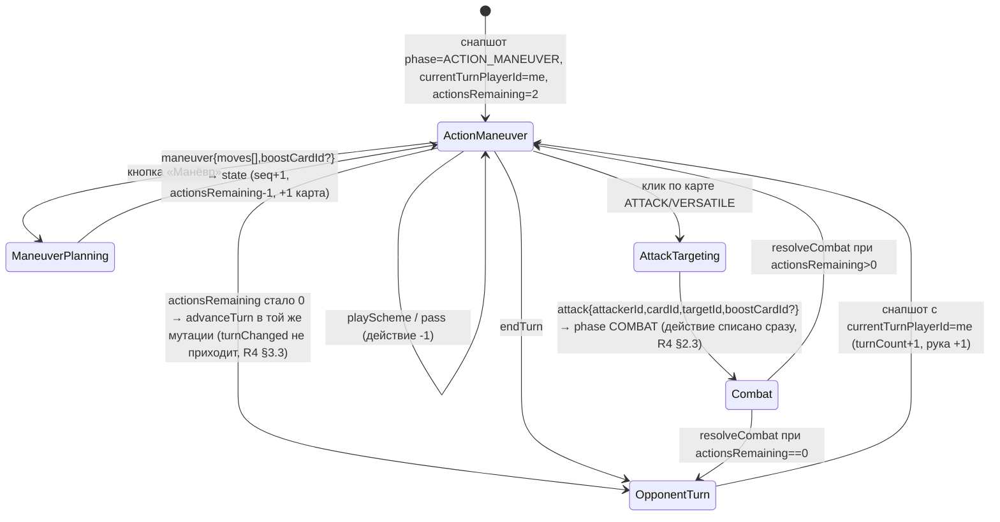

# Кандидат №3 — «Модульная Lyra-style архитектура под масштаб»

> Архитектор UE-клиента №3. Дата: 2026-09-02. Целевой движок: UE 5.8.2 (`C:\Program Files\Epic Games\UE_5.8`, R8 §2.1).
> Источники: `docs/unreal/00-mcp-verification.md` и `docs/unreal/_research/R1…R9`. Ссылки вида `R3 §2.9.4` — раздел research-файла; в скобках — путь к коду, на который research ссылается. Всё, чего в источниках нет, помечено «не найдено» / «не проверено».
> Идентификаторы кода, полей и операций — как в исходниках (английский). Префикс всех наших классов — `Um` (Unmatched).

---

## 1. Резюме подхода и целевые ограничения

### 1.1. Идея в одном абзаце

Клиент — это **тонкий нативный GraphQL-клиент + презентация**, у которого нет собственных правил игры: сервер — единственный арбитр (R4 §3.1). Поэтому архитектура строится не вокруг «движка игры», а вокруг трёх осей масштабирования: (1) **фичи** — Auth, Content, Lobby, Matchmaking, Match, MatchPresentation как независимые плагины с чёткими границами и одним общим сетевым ядром; (2) **контент** — 70+ героев, 880 карт, 30 досок и все будущие способности приходят как **данные** (DataAsset/DataRegistry, импорт из GraphQL), а не как код; (3) **платформы** — один UI-стек CommonUI (ПК → мобильные → консоли) и одна «презентационная шина» GameplayTags → GameplayCue → Niagara, куда новые механики (стойки, pending-эффекты, ауры, токены) подключаются добавлением тегов и cue-ассетов, а не переписыванием HUD.

### 1.2. Что берём из Lyra и что нет (честно)

| Паттерн Lyra | Берём? | Почему | Источник |
|---|---|---|---|
| Слои UI (`Game/GameMenu/Menu/Modal`) на `UCommonActivatableWidgetStack` | **Да**, своя реализация ~150 строк | CommonUI — не beta, но `CommonGame`/`CommonUser` в движке нет | R8 §2.6, §2.13 (`CommonUI.uplugin`; `find $UE/Plugins -iname CommonGame.uplugin` пуст) |
| Game Feature plugins | **Да, но только для контент-паков и feature-флагов**; код фич — обычные плагины | GameFeatures/ModularGameplay — `IsBetaVersion: true`, `EnabledByDefault: false` | R8 §2.13 (`GameFeatures.uplugin`, `ModularGameplay.uplugin`) |
| DataRegistry как фасад данных | **Да, с fallback на AssetManager** | DataRegistry — Beta | R8 §2.13 (`DataRegistry.uplugin`) |
| GameplayTags как язык состояний | **Да, без ограничений** | runtime-модуль движка, не beta | R8 §2.13 (`GameplayTagContainer.h:57`) |
| GameplayCues (GAS) для презентации | **Да, через собственный фасад с fallback** | статус плагина GameplayAbilities в research не проверен; MCP имеет `GASToolsets.*` (cues, теги) | `00-mcp-verification.md:51`; см. §8 риск R-4 |
| Experiences / ModularGameplay-компоненты для геймплея | **Нет** | клиент без серверной логики; избыточно | R8 §3.8 п.2 |
| MVVM (UMG Viewmodel) | **Нет** (свои `FieldNotify`-делегаты) | Beta | R8 §2.6 (`ModelViewViewModel.uplugin`) |
| CommonUI ↔ Enhanced Input интеграция | **Нет в MVP** | страница интеграции — Experimental, «not recommended to ship» | R8 §2.7 |

### 1.3. Целевые ограничения (жёсткие)

1. **Контракт бэкенда как есть**: HTTP `POST /graphql` + WS `graphql-transport-ws` на том же пути, JWT Bearer / `connection_init.payload.authorization` (R1 §2.1, §2.4). Никаких мутаций по WS (нет IP/UA для аудита, R1 §2.4).
2. **Никаких сторонних GraphQL-плагинов** — их нет (R8 §2.5). Свой слой поверх `HTTP` + `WebSockets` + `Json` + `JsonUtilities` (R8 §3.1).
3. **Снапшоты, не дельты; никакой оптимистики** — как production-путь веб-клиента (R7 §3.1). `sequenceNumber` — единственный ключ дедупликации.
4. **Источник истины для чисел — `GameState`**, контент — только арт/текст (R6 §3.4).
5. **Win64 — основная платформа**; Android/iOS — v1/v2 (папки платформ есть, SDK нужны), Linux — только кросс-компиляция (R8 §2.15).
6. **Агентный dev-loop через Unreal MCP** обязателен: свой `.uproject` с `ModelContextProtocol` + `AllToolsets`, порт 8123 (`00-mcp-verification.md:9-14, 60`).
7. **Ничего не реализовывать «на будущее» без данных на сервере**: двери/туман/возвышенность мертвы (R4 §3.16), матчмейкинг и presence неработоспособны по коду (R2 §4.1, §4.3) — только feature-флаги.

---

## 2. Структура проекта

### 2.1. Расположение и `.uproject`

```
<repo>/unreal/Unmatched/                      # новый каталог в монорепо (рядом с backend/, admin/, src/)
├── Unmatched.uproject
├── Source/
│   ├── Unmatched/                            # Runtime: GameInstance, GameModes, PlayerController, RootLayout wiring
│   ├── UnmatchedEditor/                      # Editor: импорт контента, валидаторы, свой MCP-тулсет
│   └── Unmatched.Target.cs, UnmatchedEditor.Target.cs
├── Plugins/
│   ├── UmTags/            (Runtime)          # нативные GameplayTags — таксономия §3.9
│   ├── UmGraphQL/         (Runtime, +Tests)  # транспорт HTTP + graphql-transport-ws
│   ├── UmSchema/          (Runtime, +Tests)  # USTRUCT/UENUM контракта, парсеры, операции
│   ├── UmAuth/            (Runtime)          # сессия, токены, refresh
│   ├── UmContent/         (Runtime)          # каталог героев/карт/досок, id-map, кэш картинок
│   ├── UmLobby/           (Runtime)          # лобби, комната
│   ├── UmMatchmaking/     (Runtime)          # очередь/подтверждение — за флагом Feature.Matchmaking
│   ├── UmMatch/           (Runtime, +Tests)  # состояние партии, синхронизация, действия, input-FSM
│   ├── UmMatchPresentation/ (Runtime)        # доска, бойцы, cue-диспетчер, Niagara
│   ├── UmUI/              (Runtime)          # CommonUI слои, экраны, виджеты
│   └── GameFeatures/
│       ├── GF_Matchmaking/                   # включает вход в матчмейкинг (UI + subsystem enable)
│       ├── GF_HeroPack_Core/                 # Medusa, King Arthur, Cobble City (MVP)
│       ├── GF_HeroPack_<Set>/                # по одному на набор (25 сетов, R5 §2.10)
│       └── GF_DevTools/                      # dev-HUD, фикстуры, e2e-хелперы
├── Content/                                  # только «ядро»: карты уровней, шрифт, базовые материалы
├── Config/
│   ├── DefaultEngine.ini, DefaultGame.ini, DefaultInput.ini, DefaultGameplayTags.ini
│   └── DefaultEditorPerProjectUserSettings.ini   # блок MCP (порт 8123, /mcp, автостарт)
├── Import/                                   # выход node-экспортёра (png + json), в .gitignore
└── Scripts/                                  # build.ps1, run-tests.ps1, export-content.mjs
```

`Unmatched.uproject` (ключевые записи):

```json
{
  "FileVersion": 3, "EngineAssociation": "5.8", "Category": "", "Description": "Unmatched digital client",
  "Modules": [
    { "Name": "Unmatched", "Type": "Runtime", "LoadingPhase": "Default",
      "AdditionalDependencies": ["Engine", "CommonUI", "UmGraphQL", "UmSchema", "UmMatch"] },
    { "Name": "UnmatchedEditor", "Type": "Editor", "LoadingPhase": "PostEngineInit" }
  ],
  "Plugins": [
    { "Name": "CommonUI", "Enabled": true }, { "Name": "EnhancedInput", "Enabled": true },
    { "Name": "GameplayAbilities", "Enabled": true }, { "Name": "Niagara", "Enabled": true },
    { "Name": "GameFeatures", "Enabled": true }, { "Name": "ModularGameplay", "Enabled": true },
    { "Name": "DataRegistry", "Enabled": true }, { "Name": "PlatformCrypto", "Enabled": true },
    { "Name": "ModelContextProtocol", "Enabled": true, "TargetAllowList": ["Editor"] },
    { "Name": "AllToolsets", "Enabled": true, "TargetAllowList": ["Editor"] },
    { "Name": "FunctionalTestingEditor", "Enabled": true, "TargetAllowList": ["Editor"] },
    { "Name": "Paper2D", "Enabled": false }
  ]
}
```

Обоснования: CommonUI выключен по умолчанию — включаем явно (R8 §2.6); EnhancedInput включён по умолчанию (R8 §2.7); PlatformCrypto для токенов (R8 §2.10); `ModelContextProtocol` + `AllToolsets` только для Editor-таргета (`NoRedist: true`, R8 §2.16); Paper2D не нужен — доска 3D (R8 §2.8, §3.3 п.3).

### 2.2. Ключевые ini-настройки

```ini
; DefaultEngine.ini
[/Script/Engine.Engine]
GameViewportClientClass=/Script/CommonUI.CommonGameViewportClient     ; обязательно для input routing CommonUI (R8 §2.6)
GameInstanceClass=/Script/Unmatched.UmGameInstance

[/Script/CommonInput.CommonInputSettings]
InputData=/Game/UI/Input/DA_CommonInputData.DA_CommonInputData
bEnableEnhancedInputSupport=False                                    ; Experimental — не включаем (R8 §2.7)

[WebSockets]
TextMessageMemoryLimit=8388608     ; 8 MB: снапшот с полными объектами карт в decks/drawPile (R3 §2.9.5) может превысить дефолт 1 MB (R8 §2.3)

[WebSockets.LibWebSockets]
PingPongInterval=10                ; WS-ping на уровне LWS (по умолчанию 0 — выключен, R8 §2.3); сервер сам шлёт ping-фреймы каждые 12 с (R1 §2.4)

[HTTP]
HttpConnectionTimeout=15
HttpActivityTimeout=20             ; тотального таймаута нет (HttpTotalTimeout=0) — задаём SetTimeout в коде (R8 §2.2)

[/Script/Engine.AssetManagerSettings]
+PrimaryAssetTypesToScan=(PrimaryAssetType="Hero",AssetBaseClass=/Script/UmContent.UmHeroDefinition,bHasBlueprintClasses=False,bIsEditorOnly=False,Directories=((Path="/Game/Content/Heroes"),(Path="/GF_HeroPack_Core/Heroes")))
+PrimaryAssetTypesToScan=(PrimaryAssetType="Board",AssetBaseClass=/Script/UmContent.UmBoardDefinition,...)

; DefaultGame.ini
[/Script/UnrealEd.ProjectPackagingSettings]
+CulturesToStage=en
+CulturesToStage=ru                ; R8 §2.12

; DefaultEditorPerProjectUserSettings.ini (как у MCPProject, 00-mcp-verification.md:12)
[/Script/ModelContextProtocolEngine.ModelContextProtocolSettings]
ServerPortNumber=8123
ServerUrlPath=/mcp
bAutoStartServer=True
bEnableToolSearch=True

; DefaultUnmatched.ini — конфиг клиента (UDeveloperSettings UUmClientSettings)
[/Script/UmGraphQL.UmClientSettings]
ApiBaseUrl=http://localhost:3000
GraphQLPath=/graphql               ; → http(s)://…/graphql и ws(s)://…/graphql (R1 §3.2)
AssetBaseUrl=http://localhost:5174 ; база для корневых /assets/… (раздаёт web-фронт, R6 §3.5, R9 §2.1)
```

### 2.3. Зависимости модулей (направление — только вниз)

```
Unmatched (game) ──► UmUI ──► UmMatchPresentation ──► UmMatch ──► UmContent ──► UmAuth ──► UmGraphQL
                     │                                  │                          │
                     └──► UmLobby, UmMatchmaking ───────┴──► UmSchema ◄────────────┘
                                                              │
                                                            UmTags  (без зависимостей, кроме GameplayTags)
```

`.Build.cs` `UmGraphQL`: `PublicDependencyModuleNames = { "Core", "CoreUObject", "Engine", "HTTP", "WebSockets", "Json", "JsonUtilities" }` (R8 §3.1 п.1). `UmMatchPresentation`: `+ "GameplayAbilities", "GameplayTags", "Niagara", "UMG"`. `UmUI`: `+ "CommonUI", "CommonInput", "UMG", "Slate", "SlateCore", "EnhancedInput"`.

### 2.4. Конвенции именования

| Сущность | Правило | Примеры |
|---|---|---|
| C++ классы | `UUm…`/`AUm…`/`FUm…`/`EUm…`/`IUm…` | `UUmGraphQLSubsystem`, `FUmGameState`, `EUmGamePhase` |
| GraphQL-операции | `FUmOps::<Name>` — константы документов, имя операции = PascalCase имени поля | `FUmOps::GameStateUpdated`, `FUmOps::Maneuver` |
| Виджеты | `W_<Screen>` (экран-Activatable), `WC_<Component>` (переиспользуемый) | `W_Lobby`, `WC_Card`, `WC_FighterPanel` |
| DataAsset/DataTable/Registry | `DA_`, `DT_`, `DR_` | `DA_Hero_medusa`, `DT_Cards_hells-kitchen`, `DR_Heroes` |
| Текстуры | `T_Card_<heroSlug>_<cardSlug>_EN\|RU`, `T_Hero_<heroSlug>_Avatar\|Mini\|Cover`, `T_Board_<boardSlug>` | по R9 §2.13 п.6 |
| Материалы, Niagara, cue | `M_`/`MI_`, `NS_`, `GCN_` | `MI_Zone_Blue`, `NS_HitSpark`, `GCN_Fighter_Damage` |
| Input | `IA_`, `IMC_` | `IA_Select`, `IMC_Board` |
| Уровни | `L_FrontEnd`, `L_Match` | |
| GameplayTags | `Domain.Sub.Value` (см. §3.9) | `Match.Phase.Combat`, `Cue.Match.Fighter.Damage` |
| Slug героя/карты | точная копия `slugify` из `scripts/sync-card-assets.mjs:23-31` (R9 §2.6) | `ms-marvel`, `queen-annes-revenge` |
| Тесты | `<Module>Tests/Private/*.spec.cpp`, имена `Unmatched.<Module>.<Suite>` | `Unmatched.GraphQL.WsStateMachine` |

Git: `Binaries/`, `Intermediate/`, `Saved/`, `DerivedDataCache/`, `Import/` — в `.gitignore`; `Content/**/*.uasset`, `*.umap` — Git LFS (ассеты сейчас вообще не в git, R9 §2.1 — это надо закрыть).

---

## 3. Слои и классы

### 3.1. Субсистемы (кто где живёт и почему)

| Субсистема | Тип | Плагин | Ответственность |
|---|---|---|---|
| `UUmGraphQLSubsystem` | GameInstance | UmGraphQL | HTTP-запросы, WS-клиент, реестр подписок, rate-limiter, метрики. Живёт через смену уровней — сокет не рвётся при переходе `L_FrontEnd → L_Match` |
| `UUmAuthSubsystem` | GameInstance | UmAuth | login/register/logout/refresh, хранилище токенов, проактивный refresh, `IUmAuthProvider` для транспорта |
| `UUmContentSubsystem` | GameInstance | UmContent | каталог (baked + runtime), id-map `name↔cuid↔slug`, `heroStances` кэш, `contentSummary` |
| `UUmImageCacheSubsystem` | GameInstance | UmContent | загрузка URL → диск → `UTexture2D` (PNG/JPEG через `IImageWrapper`), LRU в памяти |
| `UUmLobbySubsystem` | GameInstance | UmLobby | список игр, создание/вход, комната (polling + подписки), старт |
| `UUmMatchmakingSubsystem` | GameInstance | UmMatchmaking | очередь, `matchFound`, accept/decline — активен только при `Feature.Matchmaking` |
| `UUmMatchSubsystem` | GameInstance | UmMatch | `FUmMatchStore` (снапшоты/seq), подписки партии, действия, таймеры, pending-очередь, реконнект |
| `UUmPresenceSubsystem` | GameInstance | UmMatch | heartbeat раз в 120 с — выключен (`Feature.Presence`), см. R2 §4.1 |
| `UUmUILayersSubsystem` | LocalPlayer | UmUI | корневой layout, стек слоёв `UI.Layer.*`, push/pop экранов, тосты |
| `UUmInputModeSubsystem` | LocalPlayer | UmUI | переключение `IMC_Board`/`IMC_Menu`, `FUIInputConfig` |
| `UUmMatchPresentationSubsystem` | World | UmMatchPresentation | спавн `AUmBoardActor`/`AUmFighterPawn`, очередь воспроизведения снапшотов |
| `UUmMatchCueSubsystem` | World | UmMatchPresentation | фасад GameplayCue (тег → notify), fallback-реестр |
| `UUmSettingsSubsystem` | GameInstance | Unmatched | `SG_UmSettings`, язык, звук, URL сервера |

Правило: **вся сеть и состояние — в GameInstance-субсистемах** (переживают `OpenLevel`), **вся презентация — в World-субсистемах и акторах** (уничтожаются вместе с `L_Match`).

### 3.2. Сетевой слой (`UmGraphQL`)

#### 3.2.1. Публичный API

```cpp
struct FUmGraphQLRequest {
  FString OperationName;                       // "Login", "GameStateUpdated"…
  FString Document;                            // текст операции (FUmOps::*)
  TSharedPtr<FJsonObject> Variables;
  EUmAuthMode Auth = EUmAuthMode::Required;    // Required | Optional | None
  float TimeoutSec = 15.f;                     // тотального таймаута по умолчанию нет (R8 §2.2)
  bool bIsMutation = false;                    // мутации не ретраятся автоматически (R7 §3.7)
  FName RateLimitBucket;                       // ключ клиентского лимита (§3.2.4)
};
struct FUmGraphQLError {
  FString Message; FString Code;               // extensions.code ИЛИ верхнеуровневый code (prod-формат без extensions, R1 §2.10)
  int32 Status = 0;                            // extensions.status (409/404 для INTERNAL_SERVER_ERROR, R1 §2.10)
  int32 OriginalStatusCode = 0;                // extensions.originalError.statusCode
  TArray<FString> OriginalMessages;            // extensions.originalError.message[] (class-validator, R1 §2.10)
  TArray<FString> Path;
  EUmErrorClass Class;                         // классификатор §3.2.3
};
struct FUmGraphQLResult { TSharedPtr<FJsonObject> Data; TArray<FUmGraphQLError> Errors; int32 HttpStatus; bool bNetworkError; bool IsOk() const; };
DECLARE_DELEGATE_OneParam(FUmOnGraphQLResult, const FUmGraphQLResult&);

class UUmGraphQLSubsystem : public UGameInstanceSubsystem {
public:
  FUmRequestHandle Execute(const FUmGraphQLRequest&, FUmOnGraphQLResult);          // HTTP POST
  FUmSubscriptionHandle Subscribe(const FUmGraphQLRequest&, FUmOnNext, FUmOnError, FUmOnComplete);
  void Unsubscribe(FUmSubscriptionHandle);
  void ReconnectWebSocket(const FString& Reason);   // закрыть → backoff → connect → init → ack → re-subscribe(since)
  EUmNetState GetNetState() const;                 // Disconnected|Connecting|Connected|Reconnecting|Error (тег Net.State.*)
  FUmOnNetStateChanged OnNetStateChanged;
};
```

#### 3.2.2. HTTP-транспорт `FUmHttpTransport`

- `FHttpModule::Get().CreateRequest()`, `SetVerb("POST")`, `SetURL(ApiBaseUrl + GraphQLPath)`, `SetHeader("Content-Type","application/json")`, `SetHeader("Authorization","Bearer "+Access)` при `Auth != None`, `SetTimeout(TimeoutSec)`; тело `{ "query", "variables", "operationName" }` (R1 §2.3; R8 §3.1 п.2). Заголовок `Origin` не шлём — CORS не применяется (R1 §2.3).
- Разбор ответа **независимо от HTTP-статуса**: 200 при ошибках резолверов, 400 при парсинге/валидации/complexity (R1 §2.3). `data` может быть `null` или `{ "me": null }` (R1 §3.25).
- Делегат `OnProcessRequestComplete` приходит на game thread (`CompleteOnGameThread`, R8 §2.2) — UI трогаем напрямую.
- Retry: `FUmRetryPolicy { MaxAttempts=3, InitialDelay=0.3s, MaxDelay=10s, bJitter=true }` — только для `bIsMutation=false` и только при `bNetworkError` или классе `Internal` без `Status`; мутации — никогда (у бэка optimistic lock, повтор = «Concurrent modification», R7 §3.7). Исключение: `createGame` с `idempotencyKey` — 1 повтор (R1 §2.12).

#### 3.2.3. Классификатор ошибок `FUmErrorClassifier`

Таблица (R1 §2.10, §3.24; R3 §2.14):

| Признак | `EUmErrorClass` | Реакция по умолчанию |
|---|---|---|
| `code == UNAUTHENTICATED` **и** операция ∉ {`Login`, `ChangePassword`} | `AuthExpired` | single-flight refresh → повтор операции 1 раз |
| `code == UNAUTHENTICATED` от `Login`/`ChangePassword` | `InputRejected` | показать сообщение |
| `code == BAD_REQUEST` (+ `OriginalMessages[]`) | `InputRejected` | показать `Message`/первое из `OriginalMessages` |
| `code == BAD_USER_INPUT`, `GRAPHQL_VALIDATION_FAILED`, `GRAPHQL_PARSE_FAILED` | `ClientBug` | лог `LogUmGraphQL Error` + тост «Ошибка клиента» |
| `code == FORBIDDEN` | `Forbidden` | сообщение (не участник, бан, статус игры) |
| `code == INTERNAL_SERVER_ERROR` и `Status == 409` | `Conflict` | email/username занят; `Concurrent modification…` → `Resync` |
| `code == INTERNAL_SERVER_ERROR` и `Status == 404` | `NotFound` | |
| `INTERNAL_SERVER_ERROR`, `Message == "Internal server error"`, prod-маскирование | `Opaque` | если `Auth==Required` и access-JWT `exp` в пределах ±2 мин → трактовать как `AuthExpired` (1 раз); иначе «Действие отклонено» (R1 §2.10, R3 §4.9) |
| сообщение содержит `Query is too complex` | `ClientBug` | (R1 §2.11) |
| `bNetworkError` / таймаут | `Network` | retry-политика; `Net.State.*` |

WS-ошибки на `subscribe` приходят без `extensions.code` (R1 §2.4): классификатор по подстрокам `Неавторизованный доступ`, `Token revoked`, `Пользователь не найден` → `AuthExpired`.

#### 3.2.4. Клиентский rate-limiter `FUmRateLimiter`

Token-bucket по объявленным серверным значениям — сервер их сейчас не применяет, но может включить (R1 §2.11, R2 §2.14): `login 10/мин`, `register 5/мин`, `refreshTokens 3/мин`, `createGame 10`, `joinGame 15`, `leaveGame 10`, `startGame 5`, `abortGame 5`, `toggleReady 20`, `selectHero 10`, `joinQueue 5`, `attack/playDefense/playScheme/resolveCombat/pass 20`, `maneuver/moveFighter/endTurn/toggleDoor/setStance/resolvePendingEffect 30`. При исчерпании — локальная ошибка `RateLimited` без запроса.

#### 3.2.5. WS-клиент `FUmGraphQLWsClient` (graphql-transport-ws)

Абстракция сокета `IUmWebSocket` (для тестов — `FUmFakeWebSocket`), production-реализация над `IWebSocket`:

- Создание: `FWebSocketsModule::Get().CreateWebSocket(WsUrl, TEXT("graphql-transport-ws"))` — сабпротокол обязателен, иначе 4406 (R1 §2.4; R8 §2.3). Только на game thread (`check(IsInGameThread())`, R8 §2.3). `OnMessage` биндится **до** `Connect()` (R8 §2.3, `LwsWebSocket.h:327-341`).
- Машина состояний:

```
Idle ──Connect()──► Connecting ──OnConnected──► AwaitAck ──connection_ack──► Ready
  ▲                    │ OnConnectionError           │ таймаут 5 с / close       │ OnClosed / error
  │                    ▼                             ▼                           ▼
  └──── Backoff(n) ◄─────────────────────────────────┴───────────────────────────┘
```

- В `OnConnected` **немедленно** `{"type":"connection_init","payload":{"authorization":"Bearer <access>"}}` — окно 3 с, иначе 4408 (R1 §2.4). Второй `connection_init` запрещён (4429). Токен берётся у `IUmAuthProvider` в момент коннекта.
- `Ready`: `subscribe {id:"s<N>", payload:{operationName, query, variables}}`; `id` уникален в рамках соединения (4409); маршрутизация `next/error/complete` по `id`; на `ping` — `pong`; свой прикладной `ping` каждые 20 с с ожиданием `pong` 10 с (R1 §3.9).
- Close-коды: `4406` → `EUmNetState::Error` + лог «subprotocol misconfig», без ретраев; `4400/4401/4409/4429` → лог как баг клиента + 1 реконнект; `4408` → реконнект; `1001/1006/4500` и любой обрыв → backoff `1 с × 2^(n-1)`, 5 попыток (эталон `SubscriptionHandler.ts:97-101`, R7 §2.7), затем `Error` с кнопкой «Переподключиться» и фоновый повтор каждые 30 с, пока открыта партия.
- После `connection_ack` — переподписка всех активных операций; для `gameStateUpdated` подставляется актуальный `since = lastSeq` (R1 §3.11).
- `connection_ack` **не** подтверждает токен: auth-ошибка придёт на конкретный `subscribe` как `next{errors}+complete` или `error` (R1 §2.4) → `AuthExpired` → refresh → `ReconnectWebSocket("token-refreshed")`.
- Payload события лежит в `next.payload.data.<field>` (аналог ловушки `result.data.gameStateUpdated`, R7 §2.13 п.2).

#### 3.2.6. Реестр операций `FUmOps` (полный список см. Приложение A)

Документы — `static const TCHAR*` в `UmSchema/Public/UmOps.h`, сгенерированные скриптом из `Scripts/ops/*.graphql`. Тест `Unmatched.Schema.OpsAgainstIntrospection` валидирует каждый документ против снимка introspection `Scripts/schema.introspection.json` (снимается с живого сервера, т.к. `schema.gql` в репо нет — R1 §2.1 п.11, R3 §3.16).

### 3.3. Аутентификация (`UmAuth`)

```cpp
struct FUmAuthTokens { FString Access; FString Refresh; FDateTime AccessExp; FDateTime ObtainedAt; };
class UUmAuthSubsystem : public UGameInstanceSubsystem, public IUmAuthProvider {
  void Login(const FString& Email, const FString& Password, FUmOnAuth);
  void Register(const FString& Email, const FString& Username, const FString& Password, FUmOnAuth);
  void Logout();                       // серверный logout только при валидном access (иначе user?.id undefined → риск массовой ревокации, R1 §4.9); локально чистим всегда
  TFuture<bool> RefreshTokens();       // single-flight: один активный TPromise, остальные ждут (R1 §2.6 п.5)
  FString GetAccessToken() const override;  // IUmAuthProvider
  const FUmUser& GetUser() const;      // me.id — единственный источник userId (R7 §3.6)
  FUmOnAuthStateChanged OnAuthStateChanged;  // LoggedOut | Refreshing | LoggedIn | SessionLost(reason)
};
```

- `AccessExp` — из `exp` payload access-JWT (base64url без проверки подписи, R1 §3.14). Проактивный refresh за 5 мин до `exp` (access TTL 1 ч, R1 §2.5); refresh TTL 24 ч — после него нужен логин.
- Успех refresh → замена **обоих** токенов + `ReconnectWebSocket()` (веб этого не делает — R7 §2.13 п.17) + повтор ожидающих операций из очереди.
- Любая ошибка `refreshTokens` → `SessionLost` → экран входа; `Refresh token has been revoked` → сообщение «вход с другого устройства» (R1 §2.6).
- Клиентская валидация: `username` 3–20 `[A-Za-z0-9_]`, `password ≥ 8`, `email` (R1 §2.7); конфликт — `Status == 409`, не `CONFLICT` (R1 §3.18).
- Хранилище `UUmAuthTokenStore`: `USaveGame` слот `UmAuth`, содержимое — `Refresh` (+ `ObtainedAt`) зашифрованное `PlatformCrypto::Encrypt_AES_256_GCM` со случайным nonce; ключ — из платформенного хранилища через `IUmSecureKeyProvider` (Win64: DPAPI `CryptProtectData` в модуле `UmAuth/Private/Windows/`; остальные платформы — v1). Access-токен только в памяти (R8 §3.5). `FAES` (ECB) не используется (R8 §2.10).
- Не реализуем: сброс пароля / верификацию email — токены недоставляемы (R1 §2.7).

### 3.4. Модель данных (`UmSchema`)

Принципы: (а) GraphQL-DTO → `USTRUCT` + `FJsonObjectConverter::JsonObjectToUStruct(bStrictMode=false, OutFailReason)` (R8 §3.2); (б) wire-`GameState` — **ручной DOM-парсер** `FUmStateParser` (нужны толерантные enum'ы с `Unknown`, `TMap` по cuid-ключам, дефолты, `Float→int32`); (в) `DateTime` парсится **и как epoch-ms число, и как ISO-строка** — R3 §2.4 (`date-time.scalar.ts:13-16`) говорит epoch-ms, R1 §3.26 — ISO; расхождение research'ей закрываем толерантным парсером `FUmScalars::ParseDateTime(FJsonValue)`; (г) рекурсивный `CardEffect.options[].effects` не выражается USTRUCT'ом (UHT запрещает рекурсию) — вложенные эффекты хранятся как `FJsonObjectWrapper` и парсятся лениво.

#### 3.4.1. UENUM — GraphQL-enum'ы (имена членов = wire-значения)

| Enum | Значения | Источник |
|---|---|---|
| `EUmGameMode` | `ONE_V_ONE, TWO_V_TWO, FREE_FOR_ALL, VS_AI` | R3 §2.3.1 |
| `EUmGameStatus` | `PENDING, LOBBY, IN_PROGRESS, PAUSED, FINISHED, ABORTED` | R3 §2.3.1 |
| `EUmGamePhase` | `SETUP, TURN_START, ACTION_MANEUVER, ACTION_ATTACK, COMBAT, COMBAT_RESOLVE, TURN_END, GAME_OVER, Unknown` | R3 §2.3.1 |
| `EUmGameEventType` | 22 значения `ATTACK_INITIATED … SPECIAL_ABILITY` + `Unknown` | R3 §2.3.1 |
| `EUmUserRole` | `USER, ADMIN, MODERATOR` | R1 §2.7 |
| `EUmPresenceStatus` | `OFFLINE, ONLINE, INGAME, INQUEUE` | R2 §2.2 |
| `EUmZone` | `BLUE, GREEN, YELLOW, RED, PURPLE, BROWN, GRAY, ORANGE, PINK, WHITE, GOLD, BEIGE` | R5 §2.3 |
| `EUmContentCardType` | `ATTACK, DEFENSE, SCHEME, VERSATILE` | R5 §2.3 |
| `EUmContentFighterType` | `HERO, SIDEKICK` | R5 §2.3 |
| `EUmAbilityTrigger` | `PASSIVE, START_OF_TURN, DURING_COMBAT, WHEN_ATTACKED, WHEN_DEFENDING, END_OF_TURN` | R5 §2.3 |

Контентный `EffectTiming` **не запрашиваем** (`effects { id text }` только) — риск ошибки сериализации (R5 §3.2, §4.1).

#### 3.4.2. UENUM — строковые enum'ы внутри JSON-состояния (парсер: неизвестное → `Unknown`)

| Enum | Значения | Источник |
|---|---|---|
| `EUmFighterType` | `HERO, MINION, HUGE` | R3 §2.3.2 |
| `EUmAttackType` | `melee, ranged` (дефолт `melee`) | R3 §2.3.2 |
| `EUmEffectDuration` | `permanent, turn, round` | R3 §2.3.2 |
| `EUmEngineCardType` | `ATTACK, DEFENSE, SCHEME, UNIVERSAL, VERSATILE, MANEUVER` | R3 §2.3.2 |
| `EUmEffectType` | 21: `MODIFY_ATTACK … CHOOSE_ONE, UNSUPPORTED` | R3 §2.3.2 |
| `EUmEffectTiming` | `BEFORE_COMBAT, DURING_COMBAT, AFTER_COMBAT, ON_PLAY, ON_DISCARD, TURN_START, TURN_END, ON_REVEAL` | R3 §2.3.2 |
| `EUmEffectTarget` | 10: `ATTACKER … OPPONENT_PLAYER` | R3 §2.3.2 |
| `EUmEffectConditionKind` | 14: `WON_COMBAT … NOT_SHARES_ZONE_WITH_OPPONENT` | R3 §2.3.2 |
| `EUmCountSource` | 5: `FRIENDLY_ADJACENT_TO_OPPONENT, CARDS_IN_HAND, DISCARD_NAME_PREFIX, DAMAGE_DEALT, DAMAGE_TAKEN` | R3 §2.3.2 |
| `EUmBoostSource` | `PLAYER_CHOICE_HAND, SELF_DECK_TOP, OPPONENT_RANDOM_HAND` | R3 §2.3.2 |
| `EUmCellType` | `normal, wall, obstacle, door, zone-line` | R3 §2.3.2 |
| `EUmPendingEffectType` | `MOVE, PLACE, CHOOSE_ONE` | R3 §2.3.2 |
| `EUmGameActionType` (eventsSince) | 19 Prisma-значений | R3 §2.3.2 |

#### 3.4.3. USTRUCT — GraphQL-обёртки (десериализация `FJsonObjectConverter`)

| Struct | Поля (тип UE ← GraphQL) | Источник |
|---|---|---|
| `FUmAuthUser` | `Id, Email, Username: FString; Avatar: FString(nullable); Role: EUmUserRole; CreatedAt: FDateTime; EmailVerified: FDateTime?(флаг bHasEmailVerified)` | R1 §2.7 |
| `FUmAuthResponse` | `AccessToken, RefreshToken: FString; User: FUmAuthUser` | R1 §2.7 |
| `FUmUserSettings` | `Id, Theme, Language: FString; SoundEnabled, MusicEnabled, ProfileVisible, ShowOnlineStatus: bool` | R1 §2.8 |
| `FUmUserWithSettings` | `FUmAuthUser` + `Settings: FUmUserSettings; bHasSettings` | R1 §2.8 |
| `FUmUserStats` | `UserId; GamesPlayed, GamesWon, GamesLost, CurrentElo, PeakElo, TotalPlayTime: int32; WinRate: float; LastPlayedAt: FDateTime?; FavoriteHero{Id,Name,NameEn,NameRu}` | R1 §2.8 |
| `FUmGamePlayerResponse` | `Id (id записи GamePlayer!), UserId, Username: FString; Avatar?; HeroId? (cuid); IsReady, HasPassed: bool; SeatOrder: double→int32 (Float!)` | R2 §2.2, R3 §2.5 |
| `FUmGameResponse` | `Id, Code?, HostId, OpponentId?, BoardId, BoardState?, WinnerId?: FString; Status: EUmGameStatus; Mode: EUmGameMode; Host: FUmGamePlayerResponse; Opponent?; CreatedAt, UpdatedAt, StartedAt?, EndedAt?: FDateTime; Version: double (Float!); Players: TArray<FUmGamePlayerResponse>; Phase: EUmGamePhase?; CurrentTurn: int32?` — `host.id`/`opponent.id` = `User.id`, `players[].id` = id GamePlayer (R2 §2.2) | R3 §2.5 |
| `FUmGameStateResponse` | `Id, GameId, State (JSON-строка), CurrentTurnPlayerId?: FString; SequenceNumber, TurnCount: double→int32 (Float!); Phase: FString (не enum!); UpdatedAt: FDateTime` | R3 §2.5 |
| `FUmGameMutationResult` | `State: FString?; SequenceNumber, TurnCount: int32; Timestamp: FDateTime (epoch-ms); Phase: EUmGamePhase; CurrentTurnPlayerId?: FString` | R3 §2.8 |
| `FUmGameStateSubscriptionPayload` | `GameId: FString; SequenceNumber, TurnCount: int32; Phase: EUmGamePhase; CurrentTurnPlayerId: FString; Players, Fighters, HandZones, BoardState, Metadata: FString (5 JSON-строк, без decks/discardPiles)` | R3 §2.12 |
| `FUmGameEvent` | `Type: EUmGameEventType; GameId; SequenceNumber: int32; Timestamp: FDateTime; Payload: FString? (JSON `{phase,turnCount,currentTurnPlayerId}` либо `{userId,username}`/`{userId}`/`{reason,abortedBy}`)` | R3 §2.12, R2 §2.6 |
| `FUmTurnState` | `PlayerId (следующий игрок), TurnCount: int32, Phase` | R3 §2.12 |
| `FUmEventsSinceResponse` | `GameId; Events: TArray<FUmGameEvent>; LastSequence: int32; HasMore: bool` | R3 §2.5 |
| `FUmStanceOption` | `Id, Label: FString; IsDefault: bool` | R3 §2.5 |
| `FUmQueueStatus` | `InQueue: bool; Mode?: FString; Position?: int32; TotalPlayers, EstimatedWaitTime: int32; JoinedAt?: FDateTime (всегда null)` | R2 §2.2, §2.8 |
| `FUmMatchFound` | `GameId, OpponentId, OpponentUsername, Mode: FString; OpponentRating: int32; ExpiresAt: FDateTime` | R2 §2.2 |
| `FUmPenaltyInfo` | `CanJoinQueue: bool; DeclineCount: int32; TempBanUntil?: FDateTime; PenaltyElo?: int32; Reason?: FString` | R2 §2.2 |
| `FUmPresence`, `FUmHeartbeatResponse` | `UserId, Status: EUmPresenceStatus, CurrentGameId?, LastSeenAt: double (epoch-ms)`; `Presence, Ttl: double` | R2 §2.2 |
| `FUmHeroDto` | `Id (= name!), Name, NameEn?, NameRu?, Set: FString; Health, Movement (константа 3 — игнорировать): int32; FighterType: EUmContentFighterType; SidekickCount?: int32; Abilities: TArray<FUmHeroAbilityDto{Id,Name,Text,Trigger}>; Urls{Avatar,Mini,CardCover}?; ImageUrl?, AvatarUrl?; Cards: TArray<FUmCardDto>; UpdatedAt?` | R5 §2.3 |
| `FUmCardDto` | `Id (cuid), Title: FString; Type: EUmContentCardType; Value, Boost, Quantity: int32; CharacterName (= название карты, не banner); Effects: TArray<{Id,Text}>; ImageUrl?, ImageUrlRu?` | R5 §2.3 |
| `FUmBoardDto` | `Id (= name), Name; Width, Height: int32 (для скрапнутых — пиксели!); RecommendedPlayers; ImageUrl?; Spaces: TArray<FUmBoardSpaceDto{Position{X,Y}, Zones: TArray<EUmZone>, IsObstacle}>` | R5 §2.3 |
| `FUmContentSummary` | `Version: FString; HeroesCount, BoardsCount, SetsCount: int32; Sets: TArray<FString>` | R5 §2.2 |
| `FUmHeroListItem` | `Id (cuid!), Name, NameEn, NameRu, Set, FighterType, Ability?, ImageUrl?, AvatarUrl?: FString; Health: double→int32; CreatedAt` | R6 §2.2 |
| `FUmBoardListItem` | `Id (cuid!), Name, Set?, ImageUrl?, ImageUrlDark?: FString; Width, Height: int32; CreatedAt` | R6 §2.2 |
| `TUmPaginated<T>` (шаблон C++, не USTRUCT) | `Items; Total, Page, Limit, TotalPages: int32` | R6 §2.2 |

#### 3.4.4. USTRUCT — input DTO (сериализация `UStructToJsonObject`, только поля схемы — `forbidNonWhitelisted`, R1 §3.4)

| Struct | Поля | Источник |
|---|---|---|
| `FUmRegisterInput` | `Email, Username, Password` | R1 §2.7 |
| `FUmLoginInput` | `Email, Password` | R1 §2.7 |
| `FUmCreateGameInput` | `Mode: EUmGameMode; BoardId (cuid)` — `idempotencyKey` — **отдельный аргумент**, GUID v4 | R2 §2.5, R1 §2.12 |
| `FUmJoinGameInput` | `GameId (cuid); HeroId?` — без `idempotencyKey` (нет в схеме, R1 §2.12); `asOpponent` игнорируется — не шлём | R2 §2.5 |
| `FUmJoinQueueInput` | `Mode: EUmGameMode; HeroPref?` | R2 §2.8 |
| `FUmHeartbeatInput` | `Status: EUmPresenceStatus; CurrentGameId?` | R2 §2.9 |
| `FUmPositionInput` | `X, Y: int32` (0..19) | R3 §2.7.1 |
| `FUmManeuverMoveInput` | `FighterId; Path: TArray<FUmPositionInput>` (без стартовой клетки) | R3 §2.7.2, R4 §2.6.2 п.7 |
| `FUmManeuverInput` | `GameId; Moves: TArray<FUmManeuverMoveInput>; BoostCardId?` — legacy `fighterId/cardId/path` не используем | R3 §2.7.3, §4.13 |
| `FUmMoveFighterInput` | `GameId, FighterId; X, Y` | R3 §2.7.4 |
| `FUmAttackInput` | `GameId, AttackerId (боец), CardId (instance id `<cardId>::n`), TargetId (боец), BoostCardId?` | R3 §2.7.5, §3.10 |
| `FUmPlayDefenseInput` | `GameId, CardId, BoostCardId?` | R3 §2.7.6 |
| `FUmPlaySchemeInput` | `GameId, CardId` | R3 §2.7.8 |
| `FUmResolvePendingEffectInput` | `GameId, EffectId; FighterId?; X?, Y?; OptionIndex?` (optional через `bHas*` + custom export) | R3 §2.7.9 |
| `FUmGameIdInput` | `GameId` — для `resolveCombat`, `endTurn`, `pass` | R3 §2.7.7, §2.7.10 |
| `FUmToggleDoorInput` | `GameId; X, Y` | R3 §2.7.11 |
| `FUmSetStanceInput` | `GameId, StanceId` | R3 §2.7.12 |
| `FUmUpdateProfileInput`, `FUmSettingsInput`, `FUmChangePasswordInput` | по R1 §2.8 (без поля `role`) | R1 §2.8 |

#### 3.4.5. Wire-модель `GameState` (ручной парсер `FUmStateParser`)

| Struct | Поля и дефолты | Источник |
|---|---|---|
| `FUmGameState` | `GameId; SequenceNumber, TurnCount: int32; Phase: EUmGamePhase; CurrentTurnPlayerId; Players: TArray<FUmGameStatePlayer>; Fighters: TArray<FUmFighter>; Decks: TMap<FString,FUmDeckState> (bHasDecks); DiscardPiles: TMap<FString,TArray<FUmCard>> (bHasDiscardPiles); HandZones: TMap<FString,FUmHandZone>; BoardState: FUmBoardState; Metadata: FUmGameStateMetadata` | R3 §2.9.1 |
| `FUmGameStatePlayer` | `UserId, HeroId (cuid); Health, MaxHealth: int32; FighterIds: TArray<FString>; IsAlive: bool` | R3 §2.9.2 |
| `FUmFighter` | `Id, OwnerId, HeroId, Name; Type: EUmFighterType; Health, MaxHealth: int32; Position: FIntPoint; Effects: TArray<FUmFighterEffect{Type, Value?, Duration: EUmEffectDuration, ExpiresAt?, Source?}>; HasSidekick: bool; SidekickIds; IsDefeated (дефолт `Health<=0`); Movement (дефолт 2); AttackType (дефолт melee); HeroSlug?` | R3 §2.9.3, R4 §2.5.3 |
| `FUmCard` | `Id (instance), CardId (cuid), Name, NameEn, NameRu; CardType: EUmEngineCardType; AttackValue?, DefenseValue?, BoostValue? (int32 + bHas*); Effects: TArray<FUmCardEffect>; Text?; BannerName?; IsVisible (только HandCard; не признак «своя карта» — R3 §2.9.4)` | R3 §2.9.4 |
| `FUmCardEffect` | `Id; Type: EUmEffectType; Timing: EUmEffectTiming; Target?; Value?; When?{Kind, Value?}; Count?{Source, NamePrefix?, Per?}; Optional?; FighterName?; BoostSource?; Blind?; Options: TArray<FUmChooseOption{Label; EffectsJson: FJsonObjectWrapper}>; ChooseCount?; Text?; Source?; ParserVersion?` | R3 §2.9.4, R5 §2.4 |
| `FUmDeckState` | `Cards, DrawPile: TArray<FUmCard> (чужой drawPile приходит целиком — в UI не использовать, R4 §3.11); TopCard? (у чужой колоды удалён)`; `DrawPileCount` — производное | R3 §2.9.5 |
| `FUmHandZone` | `Cards: TArray<FUmCard>; MaxSize: int32 (7)` | R3 §2.9.5 |
| `FUmBoardState` | `Width, Height: int32; Cells: TArray<FUmCell> (row-major, индекс `y*Width+x`; источник `cells[y][x]`); Doors: TMap<FString,bool> (ключ `"x:y"`); Fog, Tokens — игнорируем (всегда `{}`)` | R3 §2.9.6 |
| `FUmCell` | `Type: EUmCellType; X, Y; Zones: TArray<FString> (1–2); Zone? (legacy первая зона — именно её использует `isInSameZone`, R4 §2.6.1); IsOpen?, IsHighGround?` | R3 §2.9.6 |
| `FUmGameStateMetadata` | `LastActionAt: FDateTime (ISO); LastActionBy; Version: int32; CombatInfo? (bHasCombatInfo); PassCount?; WinnerId?; ActionsRemaining (дефолт 2); TurnStartPositions: TMap<FString,FIntPoint>; PendingEffects: TArray<FUmPendingEffect>; ManeuveredThisTurn, AttackedThisTurn, LostCombatThisTurn (дефолт false); HeroStances: TMap<FString,FString>` | R3 §2.9.7 |
| `FUmCombatState` | `AttackerId (**боец**), DefenderId (**userId**), TargetFighterId? (fallback: первый боец защитника), AttackerCardId, DefenderCardId?; AttackValue, DefenseValue: int32; StartedAt: FDateTime (ISO); TimeoutAt? (никогда не приходит — R3 §4.2)` | R3 §2.9.8 |
| `FUmPendingEffect` | `Id; Type: EUmPendingEffectType; PlayerId; Value?; FighterName?; TargetsOpponent?; Text?; Options: TArray<FUmPendingOption{Index, Label}>; ChooseCount (дефолт 1); Card?` | R3 §2.9.9 |

Парсер покрыт фикстурами `UmSchemaTests/Fixtures/state_*.json`, снятыми с живого сервера (сценарий Game Tester, R6 §2.6): `seq1_initial`, `after_attack`, `after_defense`, `pending_choose_one`, `game_over`, `subscription_payload` (5 строк).

### 3.5. Каталог контента и ассеты (`UmContent`)

#### 3.5.1. Три провайдера за одним фасадом

```cpp
class UUmContentSubsystem : public UGameInstanceSubsystem {
  // Ключи: герой — heroSlug (slugify(name)); карта — Card.id (cuid) == HandCard.cardId; доска — Board.name
  const FUmHeroView*  FindHero(const FString& HeroSlug) const;
  const FUmCardView*  FindCard(const FString& CardCuid) const;
  const FUmBoardView* FindBoard(const FString& BoardName) const;
  void EnsureHero(const FString& HeroSlug, FUmOnReady);      // baked → runtime hero(id:<name>) → placeholder
  const FUmIdMap& IdMap() const;                              // name ↔ cuid ↔ slug (из heroList/boardList)
  void RefreshIdMap(FUmOnReady);                              // после логина: heroList(limit:300), boardList(limit:100)
  TArray<FUmStanceOption> GetStances(const FString& HeroSlug); // heroStances(heroSlug) с кэшем на сессию
};
```

| Провайдер | Что | Когда |
|---|---|---|
| **Baked** — `UUmHeroDefinition : UPrimaryDataAsset` (`PrimaryAssetType "Hero"`), `UUmBoardDefinition`, `UUmCardDefinition` (строки `DT_Cards_<set>`), текстуры `T_*` | контент, импортированный редакторским пайплайном (§3.5.3) и упакованный в `GF_HeroPack_*` | всегда, оффлайн |
| **Runtime** — `hero(id: <name>)`, `boards`, `board(id)`, `heroStances` + `UUmImageCacheSubsystem` | герои/карты, которых нет в baked (новый контент, правки в админке) | лениво при входе в комнату/партию |
| **Placeholder** — `T_Card_Placeholder`, `T_Hero_Placeholder` + текст | сеть недоступна | всегда как fallback |

Фасад `DR_Content` (DataRegistry, Beta): регистры `DR_Heroes`, `DR_Cards`, `DR_Boards` с источниками — DataTable'ы из активных `GF_HeroPack_*` (GF-action «Add Data Registry Source», R8 §2.13). **Fallback без DataRegistry**: `UAssetManager::GetPrimaryAssetIdList("Hero")` по `PrimaryAssetTypesToScan` (стабильный core-механизм). Переключатель — `UUmContentSettings::bUseDataRegistry` (по умолчанию `true` после spike E0.4, см. §7).

#### 3.5.2. Что из публичного контента **нельзя** использовать как истину (R5 §3.1)

`Hero.movement` (константа 3 → брать `Fighter.movement`), `Card.value` для SCHEME (= boost), `Card.characterName` (= название карты), `Hero.urls.mini/cardCover` (= рубашка), `Hero.sidekickHealth` (null), `Hero.id` (= имя, не cuid). Банер и тип атаки в каталоге недоступны — берём из `HandCard.bannerName` и `Fighter.attackType` игрового состояния (R5 §3.3, §3.4).

#### 3.5.3. Импорт-пайплайн (редактор + агент)

1. `Scripts/export-content.mjs` (Node, как остальные скрипты репо): introspection → `contentSummary` → `heroesPaginated` без `cards` → `hero(id)` по одному (N+1 на сервере, R5 §3.12) → `boards` → скачивание `imageUrl/imageUrlRu/urls.*` (и Supabase-URL, и `/assets/…` с `AssetBaseUrl`, R5 §3.6) → **конвертация WebP/AVIF → PNG** (`sharp`) → нормализация карт к 512×716 (`NoMipmaps`, `TextureGroup UI`), аватаров 512×512 cover-crop, mini 512×704, бордов ≤2048 (R9 §2.13) → `Import/<set>/{heroes,cards,boards}.json` + `Import/<set>/T_*.png`. WebP нативно не импортируется — конвертация обязательна (R8 §2.9).
2. Commandlet `UUmContentImportCommandlet` (модуль `UnmatchedEditor`): читает `Import/`, создаёт/обновляет `DA_Hero_<slug>`, `DT_Cards_<set>`, `DA_Board_<name>`, импортирует PNG как `T_*` (или через MCP `TextureTools.import_file` / `DataTableTools.import_file`, `00-mcp-verification.md:43-44`), пишет `ContentManifest.json` (`contentVersion`, `heroesCount`, max `Hero.updatedAt`).
3. Инвалидация: `contentVersion` — константа `'2.0.0'`, не меняется при правках (R6 §3.4) → сравниваем `contentSummary.heroesCount/boardsCount` + max `updatedAt` из `heroes`; при расхождении — runtime-провайдер перекрывает baked.

#### 3.5.4. `UUmImageCacheSubsystem`

`Get(const FString& Url, FUmOnTexture)`: память (LRU 256 текстур) → диск `FPaths::ProjectPersistentDownloadDir()/ImageCache/<sha1(url)>.<ext>` → HTTP GET (макс. 4 параллельно) → `IImageWrapperModule` PNG/JPEG → `UTexture2D::CreateTransient`. WebP/AVIF по URL (Supabase, R9 §2.6) — **не декодируется** без стороннего плагина: v1 — серверный/скриптовый прокси-конвертер (`Scripts/export-content.mjs --serve` отдаёт PNG по тому же пути), v2 — `RaiaN/RuntimeImageLoader` (сторонний, не проверен в 5.8 — R8 §2.9). Локаль: RU-изображение при `Language==ru` с fallback на EN (покрытие 133/227, R9 §3.2).

### 3.6. Партия: состояние, синхронизация, действия (`UmMatch`)

#### 3.6.1. `FUmMatchStore` — снапшоты и seq

```cpp
enum class EUmSnapshotSource { Query, Mutation, Subscription };
struct FUmApplyResult { bool bApplied; bool bGapDetected; FUmStateDiff Diff; };
class FUmMatchStore {
  FUmApplyResult Apply(FUmGameState&& Incoming, EUmSnapshotSource Source);
  // 1) Source==Subscription && Incoming.Seq <= LastSeq → drop (эхо после ответа мутации, R2 §3.20)
  // 2) Source!=Subscription && Incoming.Seq <= LastSeq && !bForceNext → drop
  // 3) Subscription без decks/discardPiles → merge из Current (R3 §3.6)
  // 4) Incoming.Seq > LastSeq+1 → bGapDetected (снапшот всё равно полный — применяем; затем Resync для decks)
  // 5) Diff = FUmStateDiff::Compute(Current, Incoming); Current = Incoming; LastSeq = Seq
  void ForceNext();                       // после refetch (аналог lastSequenceNumber=0 в remoteGameStore, R7 §2.6)
  const FUmGameState& Current() const; int32 LastSeq() const;
};
```

`FUmStateDiff` порождает упорядоченный список `FUmMatchEvent { FGameplayTag EventTag; FString FighterId; int32 Magnitude; FIntPoint From, To; FString CardId; … }`: `Match.Event.Fighter.Moved`, `…Damaged`, `…Healed`, `…Defeated`, `…Immobilized`, `Match.Event.Combat.Declared/DefenseRevealed/Resolved/AutoResolved`, `Match.Event.Card.Played/Drawn/Discarded`, `Match.Event.Turn.Changed`, `Match.Event.Actions.Changed`, `Match.Event.Pending.Added/Removed`, `Match.Event.Stance.Changed`, `Match.Event.Game.Over`. Итоги боя считаются по диффу `fighters[].health` — `combatSummary` через GraphQL не приходит (R4 §3.12).

#### 3.6.2. `UUmMatchSubsystem` — жизненный цикл

- `EnterMatch(GameId)`: `GetGame` (usernames, boardId, mode, hostId) → `GetGameState` → параллельно контент (`EnsureHero` по `heroSlug` каждого HERO-бойца, `board`, `heroStances`) → `Subscribe(GameStateUpdated{gameId, since: LastSeq})` + `Subscribe(GameEnded{gameId})` → `OnMatchReady` (R7 §3.2). Контент не блокирует старт партии.
- `Act(EUmAction, Input)`: `bActionInFlight` = true (UI lock) → `Execute(mutation, bIsMutation=true)` → `Apply(JSON(state), Mutation)` → unlock. Ошибка: `InputRejected` → тост с `Message` (маппинг по подстрокам `DT_ServerErrorMap`, R4 §3 п.20), откат выделений; `Conflict` с `Concurrent modification|sequence` → `Resync()` без повтора (R2 §3.21).
- `Resync()`: `GameSequence` → если `> LastSeq` или gap → `GetGameState` → `ForceNext(); Apply(Query)` → переподписка `since: LastSeq`. `eventsSince` — только для диагностического лога (не содержит ходов ИИ/auto-resolve и состояния, R3 §4.10).
- Смена хода детектируется по `currentTurnPlayerId/turnCount` снапшота — `turnChanged` не срабатывает при авто-передаче (R4 §3.3).
- `GAME_OVER`: `metadata.winnerId` → `W_GameOver`; при выходе — `leaveGame` (иначе игра остаётся `IN_PROGRESS`, занимает лимит 5 и блокирует очередь; статус станет `ABORTED`, R2 §3.13).
- `gameEnded` с `sequenceNumber 0` и payload `{reason, abortedBy}` — соперник вышел/прервал (R2 §3.16).

#### 3.6.3. Таймеры и серверные часы

`FUmServerClock`: `OffsetMs = mutation.timestamp (epoch-ms) − LocalUtcNowMs` — обновляется каждым ответом мутации (`GameMutationResult.timestamp`, R3 §2.8). Дедлайн защиты: `combatInfo.startedAt + 30 с` по серверным часам (`timeoutAt` никогда не приходит, R4 §3.8). По истечении ждём снапшот `COMBAT_RESOLVE` (auto-resolve не наносит урон, R4 §2.7.4) и запускаем правило авто-резолва (§4.4).

#### 3.6.4. Подсказки правил `FUmRulesHint` (клиент только подсвечивает, сервер валидирует — R4 §3.1)

- `Adjacent(a,b)`: манхэттен == 1 (R4 §2.6.1).
- `Reachable(board, from, steps, blocked)`: BFS 4-связности, непроходимы `wall/obstacle/door&&!isOpen` и клетки живых бойцов (R4 §2.6.1). Для манёвра — `steps = movement + boostValue`, конечная клетка свободна, промежуточные не через бойцов (строже сервера, R4 §3.5).
- `CanTarget(attacker, target, stanceId)`: melee — смежность; ranged — смежность или совпадение legacy `cell.zone` (R4 §4.1); плюс `DT_HeroRangeOverrides` (bullseye 5, t-rex 2, ms-marvel 2, muhammad-ali только `float` 2 — R4 §2.7.1; таблица синхронизируется вручную с `ABILITY_CONFIGS`, через GraphQL не экспортируется).
- `BoostAllowed(card, fighter, role)`: у карты эффект `BOOST` с `PLAYER_CHOICE_HAND`/без источника, либо герой `king-arthur` для атаки (R4 §2.7.2); манёвр — любая карта.
- `BannerAllows(bannerName, fighter)`: `'Any'`/пусто — все; иначе совпадение имени с отрезанным числовым суффиксом, `ies→y` (R4 §2.7.5, R7 §2.9.6 п.2).
- Аффордансы (без запроса): `IsMyTurn && Phase ∈ {ACTION_MANEUVER, ACTION_ATTACK} && ActionsRemaining > 0` для maneuver/attack/scheme/pass; `endTurn/setStance` — без проверки остатка; `playDefense` — `Phase==COMBAT && combatInfo.defenderId==me`; `resolvePendingEffect` — есть pending с `playerId==me` в любой фазе (R3 §3.11).

#### 3.6.5. `UUmMatchInputStateMachine`

Состояния (приоритет сверху вниз, как `GameView.handlePhaserEvent`, R7 §3.9): `Locked(in-flight|playback)` → `ChooseOne(modal)` → `PendingMove{effectId, fighterId?}` / `PendingPlace` → `DefensePick` (COMBAT и я защитник) → `ManeuverPlanning{paths: TMap<FighterId, TArray<FIntPoint>>, boostCardId?}` → `AttackTargeting{attackerId, cardId, boostCardId?}` → `Idle`. Вход — Enhanced Input `IMC_Board` (`IA_Select`, `IA_Cancel`, `IA_Confirm`, `IA_Zoom`, `IA_Pan`, `IA_EndTurn`) + UI-события виджетов. Решение: **основной способ движения — `maneuver` (draw + все бойцы + boost)**, `moveFighter` — только внутри pending-MOVE/PLACE-режима нет; отдельная кнопка «быстрый ход одним бойцом» (moveFighter) доступна как альтернатива в настройках (R7 §4.4).

### 3.7. UI (`UmUI`, CommonUI)

#### 3.7.1. Слои и стек

`W_RootLayout : UCommonUserWidget` с четырьмя `UCommonActivatableWidgetStack` (`R8 §2.6`): `UI.Layer.Game` (HUD партии), `UI.Layer.GameMenu` (пауза/выход), `UI.Layer.Menu` (login/lobby/room/settings), `UI.Layer.Modal` (диалоги, CHOOSE_ONE, ошибки). `UUmUILayersSubsystem::PushScreen(FGameplayTag Layer, TSubclassOf<UUmScreenBase>)`. Базовые классы в C++: `UUmScreenBase : UCommonActivatableWidget` (`GetDesiredInputConfig`: Menu — `ECommonInputMode::Menu`, HUD — `All`, R8 §2.6), `UUmModalBase` (`bIsModal`, back-action закрывает), `UUmToastHost`.

#### 3.7.2. Экраны и виджеты

| Виджет | Слой | Данные / действия | Источник поведения |
|---|---|---|---|
| `W_Boot` | Menu | загрузка `SG_UmAuth` → refresh → `me` → Lobby / Login | R1 §2.6 п.3 |
| `W_Login`, `W_Register` | Menu | `login/register`, валидация, rate-limit | R1 §2.7 |
| `W_Lobby` | Menu | `availableGames(mode)` polling 30 с, фильтр режима, «Создать», «Войти по ID» (deep-link `unmatched://join/<gameId>` — по коду нельзя, R2 §3.7), «Матчмейкинг» (только при `Feature.Matchmaking`) | R7 §2.9.2 |
| `W_CreateGame` | Modal | режим (`ONE_V_ONE`, `VS_AI`), доска из `boardList` (cuid) с превью, `createGame(idempotencyKey: GUID)` | R2 §3.7, R6 §3.2 |
| `W_Room` | Menu | polling `game(id)` 3 с; подписки `playerJoined/playerLeft/gameEnded/gameStateUpdated(since:0)` **до** старта; `selectHero` (cuid из `heroList`), `toggleReady` (не идемпотентен — блокировка двойного клика), `startGame` только хост при `allReady`; `isHost = hostId == me.id` | R2 §3.8–3.9, R7 §2.9.4 |
| `WC_HeroPicker` | внутри Room | каталог `fighterType==HERO`, поиск, карточка героя (`W_HeroDetails`: способность-текст, колода с артами) | R5 §3.10 |
| `W_Matchmaking`, `W_MatchFound` | Menu/Modal | §3.8 | R2 §3.24–3.31 |
| `W_MatchHUD` | Game | статус-бар (ход, «Ваш ход · действий k», фаза-пилюля, `Net.State`), `WC_PlayerPanel`×2 (HP, рука, колода, сброс, пипсы действий, стойка), `WC_HandTray` (7 слотов `WC_Card`), `WC_OpponentHand` (рубашки по количеству), кнопки «Манёвр», «Пас», «Конец хода», «Покинуть»; раскладка desktop (инспектор справа) / mobile (bottom-sheet) через `UCommonVisibilitySwitcher` по aspect/`ECommonInputType` | R7 §2.9.6, R9 §3.8 |
| `WC_CombatPanel` | Game | атака/защита открытые карты (по `attackerCardId/defenderCardId` в сбросе), значения, таймер 30 с, кнопки «Без защиты» (защитник, COMBAT), «Разрешить бой» (атакующий в COMBAT_RESOLVE; защитник — через 5 с ожидания) | R4 §3.9 |
| `WC_PendingBanner` | Game | очередь `pendingEffects[playerId==me]`: MOVE/PLACE подсказка + отказ; предупреждение о протухании при возврате хода | R4 §3.13 |
| `W_ChooseOne` | Modal | `options[].label`, `chooseCount`, повтор при `chooseCount>1` | R4 §2.10 |
| `WC_BoostPicker` | Game | выбор карты BOOST из руки (не та же карта), показ `+boostValue`, напоминание о доборе | R5 §3.7 |
| `WC_StanceBar` | Game | `heroStances(heroSlug)`, активна в свой ход в action-фазе, индикатор `metadata.heroStances[me]` с fallback `isDefault`; перерисовка по каждому снапшоту (авто-флип Ali) | R4 §3.14 |
| `WC_CardInspector` | Game | арт (RU→EN), `text`, `effects[].text`, тип/значение/буст, банер | R5 §3.2 |
| `W_GameOver` | Modal | «Победа/Поражение» по `winnerId`, «В лобби» → `leaveGame` | R2 §3.13 |
| `W_ConfirmDialog`, `W_ErrorToast`, `W_ReconnectOverlay` | Modal | | |
| `W_Settings` | Menu | язык (ru/en), звук, URL сервера (dev), `updateSettings` | R1 §2.8 |

Все тексты «хрома» — `FText` из `ST_UI` (String Table, R8 §2.12); тексты карт/героев — с бэкенда.

### 3.8. Матчмейкинг (`UmMatchmaking`, за флагом)

Готовая, но выключенная по умолчанию реализация: `penaltyInfo` → нет активных игр (`myGames`) → `Subscribe(MatchFound{userId: me.id as String!})` **до** `joinQueue({mode})` (без `idempotencyKey`) → polling `queueStatus(mode)` 5 с (время ожидания считаем локально — `joinedAt` всегда null) → `W_MatchFound` с таймером до `expiresAt` → `acceptMatch(gameId)` (`false` — ждём, `true` — оба приняли) + polling `game(gameId).status` (`LOBBY`/`ABORTED`) → комната (R2 §3.24–3.31). Включается тегом `Feature.Matchmaking` через `GF_Matchmaking` **только после серверных фиксов**: guard + `user.id` в резолверах, создание `GamePlayer` при матче, `presenceUpdated` (R2 §4.1, §4.3, §4.4).

### 3.9. GameplayTags — язык состояний (`UmTags`, нативные `UE_DEFINE_GAMEPLAY_TAG`)

```
Match.Phase.{Setup,TurnStart,ActionManeuver,ActionAttack,Combat,CombatResolve,TurnEnd,GameOver,Unknown}
Match.Turn.{Mine,Opponent}   Match.Actions.{Available,Exhausted}   Match.Role.{Attacker,Defender,None}
Match.Event.Fighter.{Moved,Damaged,Healed,Defeated,Immobilized}   Match.Event.Combat.{Declared,DefenseRevealed,Resolved,AutoResolved}
Match.Event.Card.{Played,Drawn,Discarded}   Match.Event.{Turn.Changed,Actions.Changed,Pending.Added,Pending.Removed,Stance.Changed,Game.Over}
Fighter.Type.{Hero,Minion,Huge}   Fighter.Attack.{Melee,Ranged}   Fighter.Status.{Immobilized,Defeated}
Card.Type.{Attack,Defense,Scheme,Universal,Versatile,Maneuver}
Effect.Type.{ModifyAttack,…,ChooseOne,Unsupported}   Effect.Timing.{OnReveal,DuringCombat,AfterCombat,OnPlay,BeforeCombat,OnDiscard,TurnStart,TurnEnd}
Pending.Type.{Move,Place,ChooseOne}
Zone.{Blue,Green,Yellow,Red,Purple,Brown,Gray,Orange,Pink,White,Gold,Beige}
Cue.Match.Fighter.{Move,Damage,Heal,Defeated,Select,Immobilized}   Cue.Match.Combat.{AttackDeclared,DefenseRevealed,Resolved,Timeout}
Cue.Match.Card.{Play,Draw,Discard,Boost}   Cue.Match.{Turn.Changed,Stance.Changed,Game.Over,Zone.Pulse}
UI.Layer.{Game,GameMenu,Menu,Modal}   UI.Screen.{Boot,Login,Register,Lobby,Room,Match,Matchmaking,Settings}
Input.Mode.{Menu,Board,Modal}   Net.State.{Disconnected,Connecting,Connected,Reconnecting,Error}
Feature.{Matchmaking,Presence,Doors,VsAi,DevTools}
```

`FUmTagMaps` — статические таблицы `EUmGamePhase ↔ Match.Phase.*`, `EUmEngineCardType ↔ Card.Type.*`, `EUmEffectType ↔ Effect.Type.*`, `EUmZone ↔ Zone.*`. `UUmMatchSubsystem::GetMatchTags()` возвращает `FGameplayTagContainer` текущего состояния (`Match.Phase.Combat` + `Match.Role.Defender` + `Match.Turn.Opponent` …); виджеты и cue-нотифаи гейтятся `FGameplayTagQuery` (например, кнопка «Атака»: `ALL(Match.Turn.Mine, Match.Actions.Available) AND ANY(Match.Phase.ActionManeuver, Match.Phase.ActionAttack)`). Новая механика = новые теги + cue-ассеты, без правки C++ HUD.

### 3.10. Презентация доски и боя (`UmMatchPresentation`)

- **Сцена** `L_Match`: `AUmBoardCameraPawn` (top-down, pitch 55°, ортографический zoom 0.8–1.4, pan в пределах доски), `AUmBoardActor` строит сетку из `boardState` (`width×height`, cell 100 uu): `UInstancedStaticMeshComponent` на цвет зоны (`MI_Zone_<Zone>`, 12 цветов из `ZONE_COLORS`, R9 §2.10.3), мультизонная клетка — материал с двумя цветами (split-disc), препятствия — `SM_Obstacle`, арт доски — плоскость под сеткой (`T_Board_*`, alpha 0.72) при наличии; fallback 20×20 без зон рисуется той же процедурой (R4 §3.7). Подсветки — второй ISM `MI_Highlight_{Move,Attack,Pending,Selected}` (цвета `76,210,220` / `230,92,70`, R9 §3.9).
- **Бойцы** `AUmFighterPawn`: подставка (герой r=31, сайдкик r=24 — пропорция 62/48 из Phaser, R7 §2.10), билборд-плоскость с `T_Hero_<slug>_Mini` (вписывать по высоте, не в квадрат — R9 §3.4), `UWidgetComponent` (`WC_FighterOverlay`: HP-бар цветов `#4ecca3/#d7b84b/#ff4d5f`, иконки `Fighter.Status.*`), кольцо выбора `NS_SelectionRing`. Побеждённые — скрываются с cue `Cue.Match.Fighter.Defeated`. Движение — сплайн по `path` (280 мс/клетка, референс R7 §2.10), телепорт для PLACE.
- **Очередь воспроизведения** `UUmMatchPresentationSubsystem::Enqueue(FUmApplyResult)`: снапшоты проигрываются последовательно; каждый `FUmMatchEvent` → `UUmMatchCueSubsystem::Emit(tag, params)` → возвращает длительность; следующий снапшот — после max длительности (VS_AI шлёт серию без задержек, R4 §3.19). Клик/`IA_Confirm` — fast-forward. HUD показывает `PresentedState` (последний проигранный), а не `Current` — числа и анимация согласованы.
- **Cue-фасад** `UUmMatchCueSubsystem`: реализация A — `UGameplayCueManager::Get()->HandleGameplayCue(Target, Tag, EGameplayCueEvent::Executed, Params)` с `UGameplayCueNotify_Burst`/`AGameplayCueNotify_Actor` из `GameplayCueNotifyPaths=/Game/Cues,/GF_*/Cues`; реализация B (fallback, если A потребует ASC) — `UUmCueRegistry` (DataAsset `Tag → TSubclassOf<UUmCueNotify>`). Обе за одним интерфейсом; выбор — spike E0.3 (§7). Список cue — §3.9. Niagara: `NS_HitSpark` (референс `hit-spark-strip` 8×64², R9 §2.8), `NS_CardFlash`, `NS_Heal`, `NS_ZonePulse`, `NS_SelectionRing`; звук — `MetaSound`/`SoundCue` по тем же тегам (v1).
- **Карты** — только UMG (`WC_Card`: арт 512×716, без дублирования заголовка/значения поверх полного арта — R9 §3.2; fallback: обложка + тип + значение).

### 3.11. Локализация

`ST_UI` (String Table ассет, ключи `Lobby.Create`, `Match.YourTurn`…), культуры `en`, `ru` (`+CulturesToStage`), переключение `FInternationalization::Get().SetCurrentLanguageAndLocale`, тест `-CULTURE=ru` (R8 §2.12, §3.7). Серверные ошибки — смешанные ru/en тексты: `DT_ServerErrorMap` (подстрока → ключ `ST_UI`) с fallback «Действие отклонено: <message>» (R3 §2.14). Тексты карт/героев — как приходят (`nameRu` = английские, R5 §3.13).

### 3.12. Сохранения

| Слот | Содержимое | Защита |
|---|---|---|
| `SG_UmAuth` | `Refresh` (AES-256-GCM), `ObtainedAt`, `UserId`, `Email` | PlatformCrypto + платформенный ключ (§3.3) |
| `SG_UmSettings` | язык, звук, `ApiBaseUrl` override (dev), последняя игра `LastGameId` (для «Вернуться в партию» после краша) | — |
| `SG_UmContentCache` | индекс `ImageCache/`, `contentSummary` снимок, max `updatedAt` | — |

`USaveGame` пишет незашифрованный `.sav` (R8 §2.10) — поэтому шифруем содержимое, а не полагаемся на слот.

---

## 4. Потоки

### 4.1. Логин / восстановление сессии

```mermaid
sequenceDiagram
  participant B as W_Boot
  participant A as UUmAuthSubsystem
  participant G as UUmGraphQLSubsystem
  participant S as backend :3000
  B->>A: RestoreSession()
  A->>A: load SG_UmAuth (decrypt refresh)
  alt refresh есть
    A->>G: Execute(RefreshTokens{refreshToken}, Auth=None, bucket=refresh 3/мин)
    G->>S: POST /graphql
    S-->>G: {data:{refreshTokens:{accessToken,refreshToken,user}}} | errors[UNAUTHENTICATED]
    alt ok
      A->>A: store both tokens, AccessExp = JWT.exp, timer(exp-5min)
      A->>G: Execute(Me)
      S-->>G: me{id,...,settings}
      A-->>B: LoggedIn(user) → PushScreen(Menu, W_Lobby); ContentSubsystem.RefreshIdMap()
    else
      A-->>B: SessionLost → W_Login
    end
  else нет токена
    B->>B: PushScreen(Menu, W_Login)
    B->>A: Login(email,pwd) → Execute(Login, Auth=None)
    S-->>G: AuthResponseDto | UNAUTHENTICATED("Неверный email или пароль") → InputRejected (не refresh!)
  end
```

Правила: `UNAUTHENTICATED` от `Login` — ошибка ввода (R1 §2.10); проактивный refresh по `exp` — основной путь в production, где код маскируется (R1 §3.14); после refresh — `ReconnectWebSocket` (R1 §3.11).

### 4.2. Лобби → комната → партия

```mermaid
sequenceDiagram
  participant L as W_Lobby/W_Room
  participant Lb as UUmLobbySubsystem
  participant M as UUmMatchSubsystem
  participant S as backend
  L->>Lb: CreateGame(mode, boardCuid)  [boardList → cuid]
  Lb->>S: createGame(input:{mode,boardId}, idempotencyKey: GUID)
  S-->>Lb: GameResponse{id,status:LOBBY,hostId,players[seat0]}
  Lb->>S: subscribe playerJoined/playerLeft/gameEnded(gameId), gameStateUpdated(gameId, since:0)
  Note over Lb: подписка на gameStateUpdated ДО startGame — первое STATE_UPDATED seq 1 = сигнал старта (R2 §3.9)
  loop каждые 3 с
    Lb->>S: game(id) → players[].heroId/isReady (событий на ready/hero нет, R2 §3.8)
  end
  L->>Lb: SelectHero(heroCuid) [heroList → cuid, R6 §3.2]
  Lb->>S: selectHero(gameId, heroId) → toggleReady(gameId)
  Note over L: второй игрок: joinGame(input:{gameId}) → selectHero → toggleReady
  L->>Lb: StartGame() [только hostId==me.id && allReady]
  Lb->>S: startGame(gameId)
  S-->>Lb: STATE_UPDATED seq 1 (gameStateUpdated) / status IN_PROGRESS
  Lb->>M: EnterMatch(gameId)  → OpenLevel(L_Match)
  M->>S: game(id), gameState(gameId) → Apply(Query); hero(id:<name>)×N, board, heroStances(heroSlug)
  M->>S: gameStateUpdated(gameId, since: LastSeq), gameEnded(gameId)
  M-->>L: OnMatchReady → PushScreen(Game, W_MatchHUD)
```

`VS_AI`: `createGame({mode: VS_AI})` → `selectHero` → `toggleReady` → `startGame`, бот добавляется сервером (R2 §3.12). Присоединение по инвайту — только по `gameId` (R2 §3.7).

### 4.3. Ход: два действия



Правила UI: `setStance`/`toggleDoor`/`resolvePendingEffect` не тратят действие (R4 §2.3); `pass` — «пропустить действие», карту не сбрасывает (R4 §3.17); в `moves[]` каждый боец ≤1 раза, путь без стартовой клетки (R4 §2.6.2).

### 4.4. Бой: attack → defense (30 с) → resolve

```mermaid
sequenceDiagram
  participant A as Клиент атакующего
  participant S as backend
  participant D as Клиент защитника
  A->>S: attack{attackerId,cardId,targetId,boostCardId?}
  S-->>A: GameMutationResult{state: phase COMBAT, combatInfo{startedAt,...}, seq n} → Apply(Mutation)
  S-->>D: gameStateUpdated seq n (без decks) → Apply(Subscription) → merge decks
  Note over A,D: Cue.Match.Combat.AttackDeclared; таймер = startedAt + 30 с по серверным часам (R4 §3.8)
  D->>D: DefensePick: карты DEFENSE/VERSATILE (banner ↔ targetFighterId), BOOST-слот
  alt защитник играет карту
    D->>S: playDefense{cardId,boostCardId?}
    S-->>D: state phase COMBAT_RESOLVE seq n+1 (отменяет таймер)
    S-->>A: gameStateUpdated seq n+1 → Cue.Match.Combat.DefenseRevealed
    A->>S: resolveCombat{gameId}  (авто через 1.5 с; кнопка «Разрешить бой» — только в COMBAT_RESOLVE, R4 §3.9)
  else защитник «Без защиты»
    D->>S: resolveCombat{gameId} (в COMBAT, defenseValue 0)
  else 30 с без ответа
    S-->>A: gameStateUpdated seq n+1 phase COMBAT_RESOLVE (урон НЕ применён, R4 §2.7.4) → Cue.Match.Combat.Timeout
    A->>S: resolveCombat{gameId} (авто у атакующего; у защитника кнопка через 5 с)
  end
  S-->>A: state seq n+2: fighters[].health/isDefeated изменены, combatInfo=null, phase ACTION_MANEUVER|advanceTurn|GAME_OVER
  Note over A,D: FUmStateDiff → Cue.Match.Fighter.Damage(Magnitude) / Defeated / Game.Over
```

VS_AI: бот сам играет защиту и резолвит — человек-атакующий авто-резолв не вызывает, если `opponent` — бот (`opponentId == AI user`, R4 §2.16); авто-резолв атакующего только если через 1.5 с после `COMBAT_RESOLVE` бой ещё не разрешён.

### 4.5. Pending effect (MOVE / PLACE / CHOOSE_ONE)

```mermaid
sequenceDiagram
  participant U as UI (WC_PendingBanner / W_ChooseOne)
  participant M as UUmMatchSubsystem
  participant S as backend
  M->>U: снапшот: metadata.pendingEffects[playerId==me] непуст → Match.Event.Pending.Added
  alt CHOOSE_ONE
    U->>U: модалка options[].label (блокирует доску); chooseCount>1 → повтор
    U->>M: resolvePendingEffect{effectId, optionIndex}
  else MOVE
    U->>U: выбор бойца (свой / чужой при targetsOpponent, фильтр fighterName) → BFS-подсветка value??1
    U->>M: resolvePendingEffect{effectId, fighterId, x, y}
  else PLACE
    U->>U: любая свободная проходимая клетка
    U->>M: resolvePendingEffect{effectId, fighterId, x, y}
  end
  M->>S: mutation (действие не тратится, любая фаза, seq+1; R4 §2.10)
  S-->>M: state без этого pending (или с остатком опций) → Pending.Removed
  Note over U: «Отказаться» = оставить pending; предупреждение: протухнет при возврате хода владельцу (R4 §2.10)
```

### 4.6. Реконнект и восстановление

```mermaid
sequenceDiagram
  participant W as FUmGraphQLWsClient
  participant M as UUmMatchSubsystem
  participant A as UUmAuthSubsystem
  participant S as backend
  W-->>M: OnClosed(1006) → Net.State.Reconnecting (W_ReconnectOverlay)
  loop n=1..5, delay 1s×2^(n-1)
    W->>S: Connect(ws://…/graphql, "graphql-transport-ws")
    W->>S: connection_init{authorization: Bearer <access из AuthProvider>} (≤3 с)
    S-->>W: connection_ack
  end
  W->>S: subscribe s1 gameStateUpdated{gameId, since: LastSeq}, s2 gameEnded{gameId}
  alt next{errors:[{message:"Неавторизованный доступ"}]} + complete
    W-->>A: AuthExpired → RefreshTokens() → ReconnectWebSocket("token-refreshed") → повтор
  end
  M->>S: gameSequence(gameId)
  alt gameSequence > LastSeq или был gap
    M->>S: gameState(gameId) → ForceNext(); Apply(Query)  (eventsSince — только в лог, R3 §4.10)
  end
  M-->>M: Net.State.Connected; input unlock
```

Дополнительно: при возврате приложения из фона (мобильные) — то же самое; при `SessionLost` — выход на `W_Login` с сохранением `LastGameId`.

---

## 5. C++ / Blueprint / Unreal MCP и dev-loop агента

### 5.1. Разделение

| Слой | Где | Почему |
|---|---|---|
| Сеть, auth, модель, парсеры, store/diff, правила-подсказки, input-FSM, субсистемы, базовые классы виджетов/акторов, cue-фасад, тесты | **C++** | сложная логика, тестируемость, производительность; `write_graph_dsl` хорош для glue, не для state machine (`00-mcp-verification.md:59`) |
| Внешний вид виджетов (дерево UMG, стили, анимации), `BP_BoardActor`/`BP_FighterPawn` (визуальные компоненты поверх C++-родителя), cue-нотифаи (`GCN_*`), Niagara, материалы, DataAssets/DataTables, Input-ассеты | **Blueprint/ассеты, создаются через MCP** | итерации без компиляции; агент делает это тулсетами |
| Мелкая glue-логика в виджетах (показать/скрыть по тегу, проиграть анимацию) | Blueprint DSL (`write_graph_dsl`) | S-expression DSL, компиляция сразу (R8 §2.16) |

Все `W_*` наследуют C++-класс с `BindWidget`-полями (например, `UUmMatchHudBase { UPROPERTY(meta=(BindWidget)) UCommonTextBlock* TurnLabel; … }`) — MCP создаёт дерево, C++ владеет логикой.

### 5.2. Тулсеты MCP → задачи (`00-mcp-verification.md:36-54`, R8 §2.16)

| Задача | Тулсет / инструмент |
|---|---|
| Создать плагин `UmXxx`, включить плагины | `PluginToolset.CreatePlugin`, `SetPluginEnabled` |
| Создать/изменить виджет, дерево, биндинги, компиляция | `UMGToolSet.CreateWidgetBlueprint`, `AddWidget`, `SetNamedSlotContent`, `BindToEventProperty`, `WrapWidgets`, `CompileWidgetBlueprint` |
| Glue-логика BP, родитель C++ | `BlueprintTools.write_graph_dsl`, `set_parent`, variables/components |
| Импорт PNG-текстур, DataTable/DataAsset из JSON/CSV | `TextureTools.import_file` (только форматы `TextureFactory`, без webp — R8 §2.9), `DataTableTools.create/import_file/add_rows/get_schema`, `DataAssetTools` |
| String Table `ST_UI` | `StringTableTools` |
| Регистрация/проверка тегов | `GameplayTagsToolset` (нативные теги — в C++; тулсетом проверяем наличие) |
| Материалы зон/подсветок, инстансы | `MaterialTools`, `MaterialInstanceTools` |
| Niagara-системы | Niagara toolsets (5) |
| Cue-нотифаи, инспекция | `GASToolsets.*` (cues, ability inspector) |
| DataRegistry `DR_*` | `DataRegistryTools` |
| Активация `GF_*` | `GameFeaturesToolset` |
| Сцена `L_Match`: камера, свет, `BP_BoardActor` | `SceneTools.add_to_scene_from_class`, `ActorTools`, `EditorAppToolset` |
| PIE, скриншоты, клики, формы | `EditorAppToolset.StartPIE/StopPIE`, `SlateInspectorToolset.Snapshot/Screenshot/Click/Type/FillForm/WaitFor` |
| Логи, тесты | `LogsToolset.GetLogEntries(category="LogUmGraphQL")`, `AutomationTestToolset.DiscoverTests/RunTests/GetTestResults` |
| Компиляция C++ | `LiveCodingToolset` — есть в движке («Live Coding compile toolset», R8 §2.16), противоречит `00-mcp-verification.md:58`; проверить `describe_toolset` (spike E0.1). Fallback — `Build.bat UnmatchedEditor Win64 Development -Project=<path> -WaitMutex` вне MCP |
| Ini-настройки | `ConfigSettingsToolset` |

### 5.3. Dev-loop агента (один цикл)

```
1. Агент правит C++ в Plugins/Um*/Source (файлы напрямую).
2. Компиляция: LiveCodingToolset (если работает) → иначе Scripts/build.ps1 (Build.bat … -WaitMutex); при новых UCLASS/USTRUCT — реинстансинг Live Coding; для новых UFUNCTION в MCP-тулсетах — рестарт редактора (R8 §2.14, §2.16).
3. Редактор Unmatched.uproject открыт (порт 8123 через ~40 с, 00-mcp-verification.md:22); агент через call_tool создаёт/правит W_*, DA_*, DT_*, GCN_*, NS_*.
4. EditorAppToolset.StartPIE (карта L_FrontEnd; бэкенд localhost:3000 поднят: docker compose, память проекта).
5. SlateInspectorToolset.FillForm(W_Login: email/password) → Click → WaitFor(W_Lobby) → Screenshot; LogsToolset по LogUmGraphQL/LogUmMatch.
6. AutomationTestToolset.RunTests("Unmatched.") → GetTestResults; e2e-набор — при UM_E2E_BACKEND=1.
7. Коммит: только явные пути (рабочее дерево смешано с чужими правками — память проекта), --no-verify (pre-commit сломан).
```

Ограничения MCP: один открытый проект = один сервер, вызовы сериализованы на game thread, без auth, только loopback (R8 §2.16) — параллельные агенты работают над разными подсистемами C++ и по очереди через MCP.

---

## 6. Тестирование

### 6.1. Юнит-тесты (Automation Spec, `*.spec.cpp`, флаги `ProductFilter | ApplicationContextMask`, R8 §2.11)

| Набор | Что проверяет |
|---|---|
| `Unmatched.GraphQL.WsStateMachine` | `FUmFakeWebSocket`: init в OnConnected, ack, subscribe/next/error/complete по id, ping→pong, коды 4400/4401/4406/4408/4409/4429/1006, backoff 1/2/4/8/16 с, переподписка с `since`, `Reconnect` после refresh |
| `Unmatched.GraphQL.ErrorClassifier` | все строки таблицы §3.2.3 (dev- и prod-формат, `extensions.status 409/404`, WS-ошибки по подстрокам) |
| `Unmatched.GraphQL.RateLimiter` | бакеты по таблице §3.2.4 |
| `Unmatched.Auth.Jwt` | base64url `exp`, проактивный таймер, single-flight (N одновременных → 1 запрос), `Logout` без валидного access не зовёт сервер |
| `Unmatched.Schema.DtoRoundTrip` | `FJsonObjectConverter` для всех структур §3.4.3–3.4.4 (регистр camelCase↔PascalCase — открытый вопрос R8 §4.5 закрывается этим тестом), `Float→int32`, `DateTime` epoch-ms и ISO |
| `Unmatched.Schema.StateParser` | фикстуры `state_*.json`: дефолты (`movement 2`, `attackType melee`, `actionsRemaining 2`), `Unknown`-enum'ы, `cells[y][x]`, `doors "x:y"`, рекурсивные `options`, подписка 5 строк без decks |
| `Unmatched.Schema.OpsAgainstIntrospection` | каждая операция `FUmOps::*` валидна против `schema.introspection.json` (нет `idempotencyKey` у `joinGame`, `matchFound(userId: String!)`, `since: Float`) |
| `Unmatched.Match.Store` | seq-guard, эхо после мутации, merge decks, gap-детект, `ForceNext` |
| `Unmatched.Match.Diff` | урон/лечение/поражение/движение/смена хода/pending/стойки из пар фикстур |
| `Unmatched.Match.RulesHint` | BFS/смежность/legacy `zone`/range-таблица/`BoostAllowed`/`BannerAllows` по R4 §2.6–2.7 |
| `Unmatched.Match.InputFsm` | приоритеты состояний §3.6.5 |
| `Unmatched.Content.Slugify` | примеры R9 §2.6 (`Queen Anne's Revenge → queen-annes-revenge`, `Ms. Marvel → ms-marvel`) |
| `Unmatched.Presentation.Playback` | очередь снапшотов: порядок, fast-forward, длительности cue |

### 6.2. Интеграционные (LatentIt, `UM_E2E_BACKEND=1`, бэкенд `localhost:3000`)

Сценарий = Game Tester + `backend/scripts/*.mjs` (R6 §2.6, §3.6): учётки `<LOCAL_P1_EMAIL>/<LOCAL_P1_PASSWORD>` и `<LOCAL_P2_EMAIL>/<LOCAL_P2_PASSWORD>` (R6 §2.9) → `myGames` + `abortGame` для `LOBBY|IN_PROGRESS|PENDING` (лимит 5) → `heroList`/`boardList` → `createGame → joinGame → selectHero×2 → toggleReady×2 → startGame` → оба клиента получают `gameStateUpdated` seq 1 → `maneuver` (seq 2, рука +1) → `attack` (COMBAT, таймер) → `playDefense` (COMBAT_RESOLVE) → `resolveCombat` (дифф HP) → `endTurn` → искусственный обрыв WS → реконнект → `gameSequence == LastSeq` → `leaveGame`. Отдельно: `CHOOSE_ONE` по `backend/scripts/e2e-choose-one.mjs` (R6 §3.10); `VS_AI` серия событий бота; refresh токена с истёкшим access (форсируем `AccessExp = now`).

### 6.3. Функциональные и UI

- `FT_BoardRender` (`AFunctionalTest` в `L_Match_Test`): загрузить `state_seq1_initial.json` → 24 клетки Cobble City или 400 (fallback 20×20), 2 героя + сайдкики на местах (2,2)/(w-3,h-3) (R3 §2.15).
- SlateInspector-сценарии из агента (без бэкенда — `UmMockBackend` in-process: `FUmFakeWebSocket` + фикстуры): login-форма, лобби, комната, HUD desktop/mobile скриншоты (`Screenshot`) для визуального диффа.

### 6.4. CI

`UnrealEditor-Cmd.exe Unmatched.uproject -unattended -nopause -NullRHI -ExecCmds="Automation RunTests Unmatched.;Quit" -testexit="Automation Test Queue Empty" -log -ReportOutputPath=<dir>` — параметр по коду `ReportOutputPath`, не `ReportExportPath` (R8 §2.11, §4.2). Сборка: `Build.bat UnmatchedEditor Win64 Development -Project=… -WaitMutex` (MSVC ≥ 14.38, Windows SDK ≥ 10.0.22621.0, R8 §2.14).

---

## 7. Дорожная карта и трудоёмкость

Допущения: 1 senior UE-разработчик + агент (агент берёт boilerplate: USTRUCT/операции/виджеты/тесты — ускорение ~1.5×, заложено в оценки); бэкенд стабилен на `localhost:3000`; человеко-день = 6 продуктивных часов; оценки ±30 %.

### Фаза 0 — спайки (все блокирующие, параллелимы): **5 ч/д**

| # | Спайк | Критерий |
|---|---|---|
| E0.1 | Скелет `.uproject`, плагины, MCP-ini, `Build.bat`; `describe_toolset(LiveCodingToolset)` | редактор + MCP :8123 + компиляция из агента или fallback-скрипт |
| E0.2 | WS handshake с бэкендом: `graphql-transport-ws`, init/ack, `gameStateUpdated`, pong на серверный ping-фрейм | стабильная подписка > 5 мин (R1 §3.9 — проверка pong) |
| E0.3 | `UGameplayCueManager::HandleGameplayCue` без ASC на `AUmFighterPawn` | cue-нотифай срабатывает; иначе fallback B |
| E0.4 | `GF_HeroPack_Core` + `DR_Heroes` («Add Data Registry Source») | герой читается через DataRegistry; иначе AssetManager |
| E0.5 | `export-content.mjs`: 2 героя + Cobble City, webp→png, `TextureTools.import_file` | текстуры в проекте |

### MVP — Medusa vs King Arthur (лобби + комната + партия, ПК): **≈ 60 ч/д** (≈ 12 недель одного разработчика; ≈ 8 недель с параллельными агентами)

| Эпик | Содержание | ч/д |
|---|---|---|
| E1 UmGraphQL | HTTP, WS-машина, ошибки, retry, rate-limiter, fake socket, спеки | 6 |
| E2 UmAuth | login/register/refresh/logout, JWT exp, DPAPI-хранилище, W_Login/W_Register | 4 |
| E3 UmSchema | enum'ы, DTO, input, wire-парсер, фикстуры, introspection-тест | 5 |
| E4 UmContent | каталог 3 провайдера, id-map, image-cache, DA/DT для 2 героев + доска | 5 |
| E5 UmLobby + UI | W_Lobby, W_CreateGame, W_Room, WC_HeroPicker, подписки комнаты | 5 |
| E6 UmMatch | store/diff/clock/rules-hint/input-FSM/actions/pending/reconnect/GAME_OVER | 8 |
| E7 UmMatchPresentation | 3D-доска, бойцы, подсветки, камера, очередь воспроизведения | 5 |
| E8 W_MatchHUD | панели, рука, бой, pending, CHOOSE_ONE, boost-picker, инспектор, game-over (desktop) | 6 |
| E9 Cues/Niagara (минимум) | move/damage/defeated/attack/defense/card-play, 4 NS | 3 |
| E10 Тесты/CI | e2e против бэкенда, SlateInspector-smoke, CI-скрипты | 4 |
| E11 Стабилизация | баги, UX-полировка, буфер на серверные сюрпризы | 6 |
| Итого MVP | | **57 + 5 (фаза 0) ≈ 62** |

MVP-специфика героев: Medusa — ranged (цели: смежные ∪ legacy `zone`), turn-start авто-урон врагу в зоне → показываем через дифф (`Cue.Match.Fighter.Damage`), 3 Harpies (banner `Harpies/Harpy` — суффикс/`ies→y`); King Arthur — `allowsAttackBoost` → `WC_BoostPicker` на любой атаке, Merlin ranged (R5 §2.8). Стойки, pending-move-способности, CHOOSE_ONE-карты у этих героев не задействованы, но UI CHOOSE_ONE/MOVE/PLACE делаем в MVP — без него партия зависает в pending (R5 §3.7).

### v1 — «весь контент, все платформы ввода, честный онлайн»: **≈ 56 ч/д**

| Эпик | Содержание | ч/д | Зависимости |
|---|---|---|---|
| V1.1 Полный импорт контента | 70 героев / 880 карт / 30 досок, `GF_HeroPack_<Set>` ×25, RU/EN арты, бюджет текстур | 6 | E0.5, Supabase-доступ |
| V1.2 Способности с UI | стойки (`alice`, `muhammad-ali` + авто-флип), range-оверлеи (bullseye/t-rex/ms-marvel/ali), лог `manualEffects`-подобных подсказок по `Card.text` | 4 | — |
| V1.3 Матчмейкинг | `GF_Matchmaking`, экраны, accept/decline, penalty | 5 | **серверные фиксы** (R2 §4.1, §4.3) |
| V1.4 VS_AI | режим, burst-playback, признак бота | 3 | — |
| V1.5 Профиль/настройки | `me/myStats/updateSettings/changePassword`, W_Settings | 3 | — |
| V1.6 Локализация | `ST_UI` ru/en, `DT_ServerErrorMap`, переключение | 3 | — |
| V1.7 Mobile-раскладка + touch | bottom-sheet инспектор, сворачиваемая рука, safe-area | 8 | CommonUI |
| V1.8 Android/iOS packaging | SDK, keystore/Keychain-хранилище токенов, wss | 8 | сертификаты, TLS на сервере (не найдено) |
| V1.9 Полировка презентации | Niagara/звук, cue для всех `Match.Event.*` | 8 | — |
| V1.10 Устойчивость | фоновый режим, `LastGameId`-возврат, телеметрия, реконнект-хардненинг | 4 | — |
| V1.11 Геймпад/консольная навигация | CommonUI cardinal navigation, `IMC_Gamepad` | 4 | — |

### v2 — расширения (оценки грубые, зависят от бэкенда)

3D-миниатюры из `.glb` (6 моделей, конвертация glTF→FBX; R9 §4.12) — 6 ч/д; реплеи по `eventsSince` (только полные партии людей, без ИИ/auto-resolve — R3 §4.10) — 8 ч/д; зрительский режим — **невозможен** (`game(id)` закрыт для не-участников до `FINISHED/ABORTED`, R2 §3.10); двери/токены/ресурсы — после появления в движке (R6 §3.8); консоли — CommonUI готов, нужны SDK; friends/leaderboard/chat — API нет (R7 §3.12).

---

## 8. Риски и их гашение

| # | Риск | Вероятность / влияние | Гашение |
|---|---|---|---|
| R-1 | GameFeatures/DataRegistry/ModularGameplay — Beta (R8 §2.13) | средняя / среднее | код фич — обычные плагины; GF только для контент-паков и флагов; DataRegistry за переключателем с fallback на AssetManager; spike E0.4 |
| R-2 | CommonUI+Enhanced Input — Experimental (R8 §2.7) | высокая / низкое | интеграцию не включаем; EI только для доски, CommonUI — свои кнопки/навигация |
| R-3 | Нет готового GraphQL-клиента (R8 §2.5) | факт / среднее | свой слой (~600 строк C++), спеки с fake-сокетом, e2e |
| R-4 | GameplayCue без ASC может не работать/статус плагина не проверен | средняя / низкое | фасад `UUmMatchCueSubsystem` с fallback-реестром; spike E0.3 (1 день) |
| R-5 | WebP/AVIF не импортируются и не декодируются (R8 §2.9) | факт / среднее | офлайн-конвертация в `export-content.mjs`; runtime-URL через прокси-конвертер; сторонний декодер — v2 |
| R-6 | Production `formatError` маскирует `UNAUTHENTICATED`/`BAD_REQUEST` (R1 §2.10) | высокая / высокое | проактивный refresh по `exp`; класс `Opaque` с эвристикой; запрос к бэкенду добавить коды в allow-list |
| R-7 | Матчмейкинг/presence неработоспособны по коду (R2 §4.1, §4.3, §4.4) | факт / среднее | `Feature.Matchmaking`/`Feature.Presence` выключены; реализация готова, включение после фиксов |
| R-8 | Auto-resolve не наносит урон; атакующий может резолвить до защиты (R4 §4.3, §4.4) | факт / среднее | клиентский протокол §4.4 (авто-резолв атакующего только в COMBAT_RESOLVE); просьба к бэкенду |
| R-9 | Подписка без `decks/discardPiles` (R3 §3.6) | факт / низкое | merge из предыдущего снапшота; счётчики по последнему известному; `Resync` при gap |
| R-10 | `Board.cells` в БД могут быть пусты → 20×20 без зон (R4 §4.13) vs «cells у 30/30 досок» (R6 §2.7.2) | средняя / среднее | рендер только из `boardState`; проверка на живом стенде в E0.2 |
| R-11 | Дальности/способности не экспортируются (R4 §3.6) | факт / низкое | `DT_HeroRangeOverrides` с тестом-напоминанием; сервер валидирует |
| R-12 | Ranged по legacy `cell.zone`, а не пересечению `zones[]` (R4 §4.1) | факт / низкое | подсветка по `zone`; при отказе сервера — тост |
| R-13 | Схема без файла, drift (R1 §4.10) | средняя / среднее | снимок introspection в репо + тест операций; CI-джоб обновления снимка |
| R-14 | Хранение токенов: ключ извлекаем (R8 §2.10) | средняя / среднее | DPAPI/Keychain/Keystore в своих платформенных модулях; только refresh на диске |
| R-15 | Pong на серверные WS-ping-фреймы на мобильных не проверен (R1 §3.9) | средняя / высокое (обрыв через ~24 с) | spike E0.2 на каждой платформе; `PingPongInterval`; прикладной ping |
| R-16 | Лимит 1 MB на текстовое WS-сообщение (R8 §2.3) | средняя / высокое | `TextMessageMemoryLimit=8 MB`; мониторинг размера снапшота в логе |
| R-17 | Rate limits могут быть включены на сервере (R1 §2.11) | средняя / низкое | клиентские бакеты уже стоят |
| R-18 | `hero(id:<cuid>)` → null до коммита правки (R6 §2.8) | факт / низкое | ключ каталога — `heroSlug`; `hero(id:<name>)` |
| R-19 | Ассеты не в git, манифест устарел, RU-сканы без прав (R9 §4.2–4.4) | факт / среднее | Git LFS для `unreal/Content`; свой экспортёр с Supabase как источником; RU-сканы не тащим |
| R-20 | MCP — Experimental, один проект, без auth, серийные вызовы (R8 §2.16) | факт / низкое | loopback; параллелизм агентов — по C++-плагинам; MCP-очередь |
| R-21 | Live Coding: новые `UFUNCTION` для тулсетов требуют рестарта (R8 §2.14) | факт / низкое | свои тулсеты — редко; game-код через реинстансинг |
| R-22 | `GAME_OVER` оставляет `IN_PROGRESS`, лимит 5 активных игр (R2 §3.13) | факт / среднее | обязательный `leaveGame` после конца; «прибирание» активных игр в лобби |
| R-23 | Утечка чужого `drawPile`/`cardId` (R4 §4.10) | факт / низкое | клиент не отображает; просьба к бэкенду |
| R-24 | Admin `heroList` доступен любому игроку и раскрывает PII в соседних query (R6 §4.9) | факт / низкое (для нас) | используем только `heroList/boardList`; просьба к бэкенду о публичном поле cuid |

### Открытые вопросы (требуют ответа бэкенда/продукта до соответствующего эпика)

1. Формат `DateTime` на проводе: epoch-ms (R3 §2.4) или ISO (R1 §3.26)? — парсер толерантен, но нужен снимок introspection + живой ответ (E0.2).
2. Будут ли добавлены `decks/discardPiles` в `gameStateUpdated` и `combatSummary/manualEffects` в `GameMutationResult` (R4 §4.11–4.12)? Это упростит cue и лог.
3. Планируется ли серверный фикс матчмейкинга (guards, `user.id`, `GamePlayer`, `presenceUpdated`) — от него зависит V1.3 (R2 §4.1, §4.3).
4. Auto-resolve с уроном и запрет резолва до защиты (R4 §4.3–4.4) — иначе остаётся клиентский протокол §4.4.
5. Публичное поле cuid и `bannerName`/`attackType`/`sidekicks` в контентных DTO (R5 §4.10, §4.16) — уменьшит зависимость от admin `heroList`.
6. `Card.effects.timing` в публичном API — падает ли (R5 §4.1)? Пока не запрашиваем.
7. Реальное содержимое `Board.cells` и `Card.imageUrl` (Supabase vs `/assets/…`) в живой БД (R5 §4.2, §4.8).
8. TLS/reverse-proxy в проде (wss/https, таймауты) — не найдено (R1 §4).
9. Ms. Marvel turn-start move описан как «отдельная мутация» (R5 §2.8), но среди 11 gameplay-мутаций её нет (R3 §1) — существует ли она в схеме?
10. `LiveCodingToolset`: запускает ли компиляцию из MCP (R8 §4.1)?
11. Прод-`formatError`: добавят ли `UNAUTHENTICATED/FORBIDDEN/BAD_REQUEST` в allow-list (R1 §4.6)?
12. Целевые разрешения/платформы для мобильной раскладки (в Phaser её нет, R9 §4.10).

---

## Приложение A. Реестр операций `FUmOps` (точный контракт)

| Операция | Документ (сокращённо) | Auth | Примечания |
|---|---|---|---|
| `Login` | `mutation Login($input: LoginDto!) { login(input:$input) { accessToken refreshToken user { id email username avatar role createdAt emailVerified } } }` | None | R1 §2.7 |
| `Register` | `mutation Register($input: RegisterDto!) { register(input:$input) { …как Login } }` | None | |
| `RefreshTokens` | `mutation RefreshTokens($refreshToken: String!) { refreshTokens(refreshToken:$refreshToken) { accessToken refreshToken user { id } } }` | None | 3/мин |
| `Logout` | `mutation Logout { logout }` | Required (только при валидном access) | R1 §4.9 |
| `Me` | `query Me { me { id email username avatar role createdAt emailVerified settings { id theme language soundEnabled musicEnabled profileVisible showOnlineStatus } } }` | Required | |
| `HeroIdMap` | `query HeroIdMap { heroList(page:1, limit:300, sortBy:"name", sortOrder:"asc") { items { id name nameEn set health fighterType avatarUrl } } }` | Required | cuid для `selectHero` (R6 §2.4) |
| `BoardIdMap` | `query BoardIdMap { boardList(page:1, limit:100, sortBy:"name", sortOrder:"asc") { items { id name set width height imageUrl } } }` | Required | cuid для `createGame` |
| `AvailableGames` | `query AvailableGames($mode: String, $limit: Float) { availableGames(mode:$mode, limit:$limit) { id mode status hostId boardId createdAt players { userId username avatar heroId isReady seatOrder } } }` | Optional (публичная) | только `LOBBY` без opponent (R2 §2.4) |
| `CreateGame` | `mutation CreateGame($input: CreateGameDto!, $idempotencyKey: String) { createGame(input:$input, idempotencyKey:$idempotencyKey) { ...GameFields } }` | Required | GUID |
| `JoinGame` | `mutation JoinGame($input: JoinGameDto!) { joinGame(input:$input) { ...GameFields } }` | Required | **без** `idempotencyKey` |
| `GetGame` | `query GetGame($id: String!) { game(id:$id) { ...GameFields } }` где `GameFields = id code status mode hostId opponentId boardId createdAt updatedAt startedAt endedAt winnerId version phase currentTurn players { id userId username avatar heroId isReady hasPassed seatOrder }` | Required | |
| `MyGames` | `query MyGames($filters: GameFiltersDto) { myGames(filters:$filters) { id status mode hostId updatedAt } }` | Required | только `status`/`limit` работают (R2 §2.4) |
| `SelectHero`, `ToggleReady`, `StartGame`, `LeaveGame`, `AbortGame` | `mutation X($gameId: String!, …) { x(gameId:$gameId, …) { ...GameFields } }` (`leaveGame` → `Boolean`) | Required | |
| `GetGameState` | `query GetGameState($gameId: String!) { gameState(gameId:$gameId) { gameId state sequenceNumber currentTurnPlayerId phase turnCount updatedAt } }` | Required | `state` — JSON-строка |
| `GameSequence` | `query GameSequence($gameId: String!) { gameSequence(gameId:$gameId) }` | Required | Float, 0 если нет |
| `EventsSince` | `query EventsSince($gameId: String!, $since: Float!) { eventsSince(gameId:$gameId, sinceSequence:$since) { gameId lastSequence hasMore events { type sequenceNumber timestamp payload } } }` | Required | только лог |
| `Maneuver`, `MoveFighter`, `Attack`, `PlayDefense`, `PlayScheme`, `ResolvePendingEffect`, `ResolveCombat`, `EndTurn`, `Pass`, `ToggleDoor`, `SetStance` | `mutation X($input: XDto!) { x(input:$input) { state sequenceNumber timestamp phase currentTurnPlayerId turnCount } }` | Required, `bIsMutation` | R3 §2.7 |
| `GameStateUpdated` | `subscription GameStateUpdated($gameId: String!, $since: Float) { gameStateUpdated(gameId:$gameId, since:$since) { gameId sequenceNumber phase turnCount currentTurnPlayerId players fighters handZones boardState metadata } }` | WS | R3 §2.12 |
| `GameEnded`, `PlayerJoined`, `PlayerLeft` | `subscription X($gameId: String!) { x(gameId:$gameId) { type gameId sequenceNumber timestamp payload } }` | WS | |
| `HeroStances` | `query HeroStances($heroSlug: String!) { heroStances(heroSlug:$heroSlug) { id label isDefault } }` | None | |
| `HeroContent` | `query HeroContent($id: String!) { hero(id:$id) { id name nameEn nameRu health set fighterType sidekickCount abilities { id name text trigger } urls { avatar mini cardCover } cards { id title type value boost quantity imageUrl imageUrlRu effects { id text } } } }` | None | `imageUrl/imageUrlRu` в `cards` — незакоммиченная правка маппера (R6 §2.8); без `timing` |
| `HeroesPaginated` | `query HeroesPaginated($page: Int, $limit: Int, $set: String) { heroesPaginated(page:$page, limit:$limit, set:$set) { items { id name set health fighterType urls { avatar } updatedAt } pagination { total page limit totalPages hasNextPage } } }` | None | без `cards` (N+1) |
| `Boards` / `Board` | `query Boards { boards { id name width height recommendedPlayers imageUrl spaces { position { x y } zones isObstacle } } }` | None | размер сетки — из `spaces` (R5 §3.5) |
| `ContentSummary` | `query ContentSummary { contentSummary { version heroesCount boardsCount setsCount sets } }` | None | |
| `JoinQueue`, `LeaveQueue`, `LeaveAllQueues`, `QueueStatus`, `PenaltyInfo`, `AcceptMatch`, `DeclineMatch` | `joinQueue(input: JoinQueueDto!)`, `leaveQueue(mode: String!)`, `queueStatus(mode: String!)`, `acceptMatch(gameId: String!)`… | Required (по коду guard'ов нет) | без `idempotencyKey` (R2 §3.26) |
| `MatchFound` | `subscription MatchFound($userId: String!) { matchFound(userId:$userId) { gameId opponentId opponentUsername opponentRating mode expiresAt } }` | WS | `String!`, не `ID!` |
| `Heartbeat` | `mutation Heartbeat($input: HeartbeatInput!) { heartbeat(input:$input) { ttl presence { userId status currentGameId lastSeenAt } } }` | Required | выключено (R2 §4.1) |

## Приложение B. Что сознательно не переносим из веб-клиента

Локальный движок (`src/core/engine`, `gameStore`, `/test-game`), deprecated-мосты (`GameActions`, `SubscriptionHandler`, `GameStateBridge`, `useOptimisticUpdate`), неподключённые Phaser-подсистемы и React-компоненты боя, экраны leaderboard/profile/social/chat (нет API), `FighterPlacement`, DEAD/INVALID-операции, `localStorage.userId`-ловушку, `MatchmakingView` с `userId='current-user-id'`, `idempotencyKey` у `joinGame/joinQueue` (R7 §2.14, §3.12).
